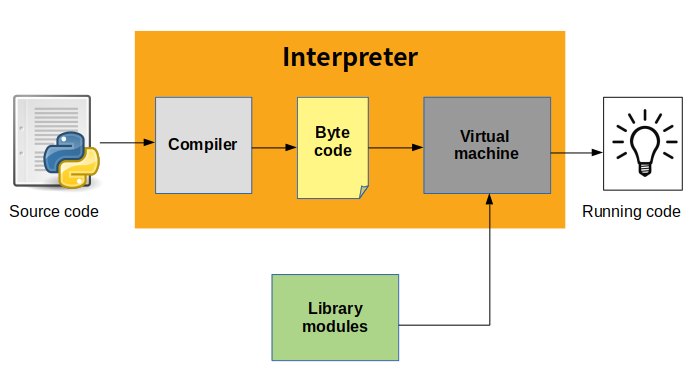

---
## Python's Features

> **Python** is an interpreted, object-oriented, high-level programming language with dynamic semantics. Its high-level built in data structures, combined with dynamic typing and dynamic binding

* 플랫폼 독립적인 인터프리터 언어
  * 코드를 실행하기전 컴파일할 필요가 없음

* os에 적절한 인터프리터만 깔려 있으면 돌아감
* 객체 지향의 동적 타이핑 언어
* 가비지 콜렉터(garbage collector) 존재

---

## Compiler vs Interpreter

### Compiler

> **컴파일러(Compiler)**는 특정 프로그래밍 언어로 쓰여 있는 문서를 다른 프로그래밍 언어로 옮기는 언어 번역 프로그램을 말한다. **컴파일러**는 고급 프로그래밍 언어를 실행 프로그램으로 만들기 위해 저급 프로그래밍 언어(Assembly, Object code, Machine code..)로 바꾸는 데 사용된다.

* 소스코드를 기계어로 먼저 번역
* 플랫폼에 최적화되어 프로그램을 실행
* 실행속도가 빠름
* 한번의 많은 기억장소 필요
* C, JAVA, C++, C#

### Interpreter

> **인터프리터(Interpreter)**는 프로그래밍 언어의 소스 코드를 바로 실행하는 컴퓨터 프로그램 또는 환경을 말한다. 원시 코드를 기계어로 번역하는 컴파일러와 대비된다. **인터프리터**는 다음의 과정 가운데 적어도 한 가지 기능을 가진 프로그램이다.
>
> 1. 소스 코드를 직접 실행한다.
> 2. 소스 코드를 효율적인 다른 중간 코드로 변환하고, 변환한 것을 바로 실행한다
> 3. 인터프리터 시스템의 일부인 컴파일러가 만든, 미리 컴파일된 저장 코드의 실행을 호출한다.

* 별도의 번역과정 없이 소스코드를 실행시점에 해석하여 컴퓨가 처리
* 간단히 작성
* 메모리 적게 필요
* 실행속도가 느림
* PYTHON, SCALAR

### Assembler

> **Assembler** is a program for converting instructions written in low-level assembly code into relocatable machine code and generating along information for the loader.

---

## 프로그램 동작 과정

* 사람이 알 수 있는 high-level 언어를 기계만 알 수 있는 low-level 언어로 변환
* 파이썬은 컴파일러 언어인 C로 작성됨
* 실행 시 assembler와 같은 기계어 변환 거침

출처 - https://automateinfra.com/2021/11/09/python-internal-working-easiest-way/

---

## OOP Language(객체 지향 언어)

* Object Oriented Programming
* 실행 순서가 아닌 단위 모듈(객체) 중심으로 프로그램 작성
* 하나의 객체는 목적을 달성하기 위한 행동(method)과 속성(attribute)을 가짐

---

## Dynamic Typing Language(동적 타이핑 언어)

> Python is a **dynamically typed** language. It doesn’t know about the type of the variable until the code is run. So declaration is of no use. What it does is, It stores that value at some memory location and then binds that variable name to that memory container. And makes the contents of the container accessible through that variable name. So the data type does not matter. As it will get to know the type of the value at run-time.

*  프로그램이 실행하는 시점에 사용해야할 테이터에 대한 타입 결정

---

## Garbage Collector

> **Garbage collection** is to release memory when the object is no longer in use. This system destroys the unused object and *reuses* its memory slot for new objects. You can imagine this as a recycling system in computers.
>
> Python has an automated **garbage collection**. It has an algorithm to deallocate objects which are no longer needed. Python has two ways to delete the unused objects from the memory.

* Reference counting
* Generational garbage collection

 

## 참고

---

1. [boostcourse - 머신러닝을 위한 파이썬](https://www.boostcourse.org/ai222)
2. [Python documentation](https://docs.python.org/3/)
3. [https://www.geeksforgeeks.org/introduction-of-assembler/](https://www.geeksforgeeks.org/introduction-of-assembler/)
4. [https://www.geeksforgeeks.org/why-python-is-called-dynamically-typed/](https://www.geeksforgeeks.org/why-python-is-called-dynamically-typed/)
5. [https://towardsdatascience.com/memory-management-and-garbage-collection-in-python-c1cb51d1612c](https://towardsdatascience.com/memory-management-and-garbage-collection-in-python-c1cb51d1612c)
