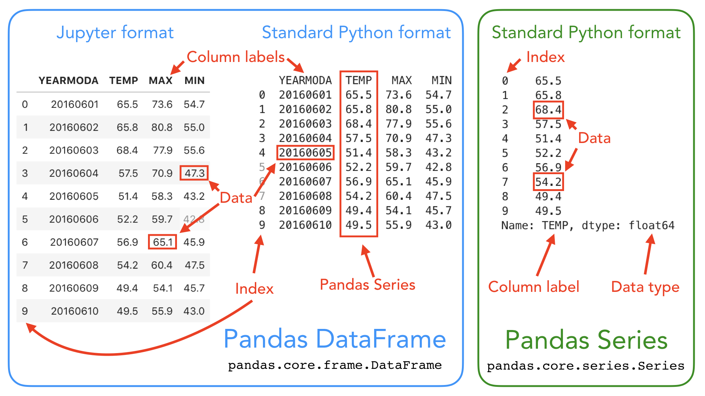

---

## Pandas 소개

### Pandas란?

* 구조화된 데이터의 처리를 지원하는 python 라이브러리
* 고성능 array 계산 라이브러리인 numpy와 통합하여, 강력한 스프레드시트 처리 기능을 제공
* 인덱싱, 연산용 함수, 전처리 함수 등을 제공
* 부동 소수점이 아닌 데이터 뿐만 아니라 부동 소수점 데이터에서도 결측 데이터(NaN)를 쉽게 처리
* 데이터 세트의 유연한 재구성 및 피벗
* 축의 계층적 라벨링(눈금당 여러 개의 라벨 가질 수 있음)
* 시계열 특정 기능 : 날짜 범위 생성, 주파수 변환, moving window 통계, 날짜 이동 및 지연

---

## Pandas 시작하기

### Pandas 라이브러리 호출

```python
import pandas as pd
```


### Pandas Data Loading

#### read_csv()

* csv 타입 데이터 로드
* sep(구분자)은 정규표현식을 이용해서 지정

```python
data_url = 'https://archive.ics.uci.edu/ml/machine-learning-databases/housing/housing.data'# data url
df_data = pd.read_csv(data_url, sep='\s+', header=None) 
# csv 타입 데이터 로드, seperate은 빈공간으로 지정, column 없음
```


#### head()

```python
df_data.head() # 처음 다섯줄 출력
```

#### columns

* column의 이름 지정

```python
df_data.columns = [
    'CRIM','ZN', 'INDUS', 'CHAS', 'NOX', 'RM', 'AGE', 'DIS', 'RAD', 'TAX', 'PTRATIO' ,'B', 'LSTAT', 'MEDV'] 
# Column Header 이름 지정
df_data.head()
```

|      |    CRIM |   ZN | INDUS | CHAS |   NOX |    RM |  AGE |    DIS |  RAD |   TAX | PTRATIO |      B | LSTAT | MEDV |
| ---- | ------: | ---: | ----: | ---: | ----: | ----: | ---: | -----: | ---: | ----: | ------: | -----: | ----: | ---: |
| 0    | 0.00632 | 18.0 |  2.31 |    0 | 0.538 | 6.575 | 65.2 | 4.0900 |    1 | 296.0 |    15.3 | 396.90 |  4.98 | 24.0 |
| 1    | 0.02731 |  0.0 |  7.07 |    0 | 0.469 | 6.421 | 78.9 | 4.9671 |    2 | 242.0 |    17.8 | 396.90 |  9.14 | 21.6 |
| 2    | 0.02729 |  0.0 |  7.07 |    0 | 0.469 | 7.185 | 61.1 | 4.9671 |    2 | 242.0 |    17.8 | 392.83 |  4.03 | 34.7 |
| 3    | 0.03237 |  0.0 |  2.18 |    0 | 0.458 | 6.998 | 45.8 | 6.0622 |    3 | 222.0 |    18.7 | 394.63 |  2.94 | 33.4 |
| 4    | 0.06905 |  0.0 |  2.18 |    0 | 0.458 | 7.147 | 54.2 | 6.0622 |    3 | 222.0 |    18.7 | 396.90 |  5.33 | 36.2 |

<br> 

#### values

* dataframe의 numpy 형태의 값을 불러옴

* pandas는 결국 numpy 기반으로 만들어졌기 때문에 값의 형태는 numpy 형태임

```python
df_data.values
```

```
array([[6.3200e-03, 1.8000e+01, 2.3100e+00, ..., 3.9690e+02, 4.9800e+00,
        2.4000e+01],
       [2.7310e-02, 0.0000e+00, 7.0700e+00, ..., 3.9690e+02, 9.1400e+00,
        2.1600e+01],
       [2.7290e-02, 0.0000e+00, 7.0700e+00, ..., 3.9283e+02, 4.0300e+00,
        3.4700e+01],
       ...,
       [6.0760e-02, 0.0000e+00, 1.1930e+01, ..., 3.9690e+02, 5.6400e+00,
        2.3900e+01],
       [1.0959e-01, 0.0000e+00, 1.1930e+01, ..., 3.9345e+02, 6.4800e+00,
        2.2000e+01],
       [4.7410e-02, 0.0000e+00, 1.1930e+01, ..., 3.9690e+02, 7.8800e+00,
        1.1900e+01]])
```


* type은 당연히 ndarray로 나옴

```python
type(df_data.values) # numpy의 ndarray 타입
```

```
numpy.ndarray
```

---

## Pandas의 구성



<p align="center">출처: https://geo-python-site.readthedocs.io/en/latest/notebooks/L5/exploring-data-using-pandas.html</p>


* series는 하나의 벡터로 볼 수 있음
* data table 전체는 dataframe

## 참고

---

1. [부스트코스 AI 기초다지기 pandas l - 최성철](https://www.boostcourse.org/ai100/lecture/739182?isDesc=false)
1. [https://geo-python-site.readthedocs.io/en/latest/notebooks/L5/exploring-data-using-pandas.html](https://geo-python-site.readthedocs.io/en/latest/notebooks/L5/exploring-data-using-pandas.html)

