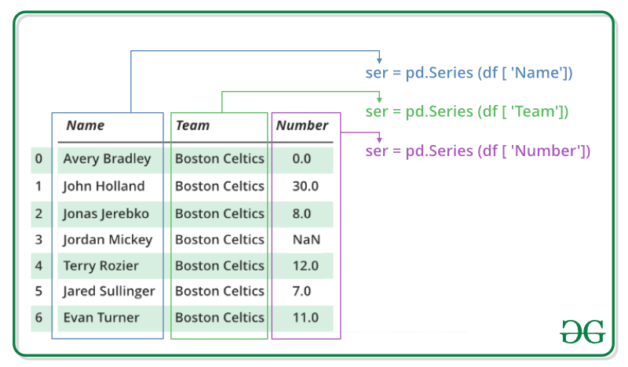

---

## Pandas Series

### Series의 특징



<p align="center">출처 - https://www.geeksforgeeks.org/python-pandas-series/</p>

* numpy.ndarray의 subclass
* 인덱스는 순서대로 존재하지 않아도 됨, 중복 가능


#### Series, DataFrame 객체

```python
from pandas import Series, DataFrame
import numpy as np
```

### Series 사용

#### Series()

```python
list_data = [1,2,3,4,5]
example_obj = Series(data = list_data) # data에는 list 타입 or dict 타입 가능
example_obj # series 객체, index, value, data type이 나옴
```

```
0    1
1    2
2    3
3    4
4    5
dtype: int64
```


* index 이름 정할 수 있음

```python
list_data = [1,2,3,4,5]
list_name = ["a","b","c","d","e"]
example_obj = Series(data = list_data, index=list_name) # index의 이름도 지정 가능, 잘 쓰지는 않음
example_obj
```

```
a    1
b    2
c    3
d    4
e    5
dtype: int64
```


* index 이름을 따로 넣지 않고 바로 dict 타입으로 이름을 넣을 수 있음

```python
dict_data = {"a":1, "b":2, "c":3, "d":4, "e":5}
example_obj = Series(dict_data, dtype=np.float32, name="example_data") # data type, series 이름 설정
example_obj
```

```
a    1.0
b    2.0
c    3.0
d    4.0
e    5.0
Name: example_data, dtype: float32
```


#### Series data index 접근하기

* series객체명[인덱스명] 형태로 접근 가능

```python
example_obj["a"]
```

```
1.0
```


* data index에 값 할당하기

```python
example_obj["a"] = 3.2
example_obj
```

```
a    3.2
b    2.0
c    3.0
d    4.0
e    5.0
Name: example_data, dtype: float32
```


* series의 값만 가져오기

```python
example_obj.values
```

```
array([1., 2., 3., 4., 5.], dtype=float32)
```


* series의 인덱스만 가져오기

```python
example_obj.index
```

```
Index(['a', 'b', 'c', 'd', 'e'], dtype='object')
```


#### to_dict()

* series 객체를 dict type으로 

```python
example_obj.to_dict() # series 객체를 dict 형태로
```

```
{'a': 1.0, 'b': 2.0, 'c': 3.0, 'd': 4.0, 'e': 5.0}
```


#### index 값을 기준으로 series 생성하기

```python
dict_data_1 = {"a":1, "b":2, "c":3, "d":4, "e":5}
indexes = ["a","b","c","d","e","f","g","h"]
series_obj_1 = Series(dict_data_1, index=indexes)
series_obj_1
```

```
a    1.0
b    2.0
c    3.0
d    4.0
e    5.0
f    NaN
g    NaN
h    NaN
dtype: float64
```

## 참고

---

1. [부스트코스 AI 기초다지기 pandas l - 최성철](https://www.boostcourse.org/ai100/lecture/739182?isDesc=false)
1. [https://www.geeksforgeeks.org/python-pandas-series/](https://www.geeksforgeeks.org/python-pandas-series/)

