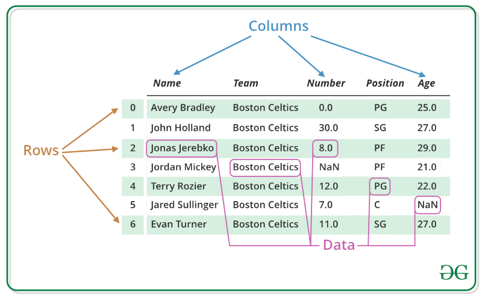

---
## Pandas DataFrame
### DataFrame의 특징



<p align="center">출처-https://www.geeksforgeeks.org/python-pandas-dataframe/</p>

* series들이 모인 전체 data table
* numpy array와 유사
* row와 column index 존재
* 각 column은 다른 type일 수 있음
* 기본적으로 2차원


### DataFrame 사용

#### DataFrame()

```python
# Example from - https://chrisalbon.com/python/pandas_map_values_to_values.html
raw_data = {'first_name': ['Jason', 'Molly', 'Tina', 'Jake', 'Amy'],
        'last_name': ['Miller', 'Jacobson', 'Ali', 'Milner', 'Cooze'],
        'age': [42, 52, 36, 24, 73],
        'city': ['San Francisco', 'Baltimore', 'Miami', 'Douglas', 'Boston']}
df = pd.DataFrame(raw_data, columns = ['first_name', 'last_name', 'age', 'city'])
df
```

|      | first_name | last_name | age  |     city      |
| ---- | :--------: | :-------: | :--: | :-----------: |
| 0    |   Jason    |  Miller   |  42  | San Francisco |
| 1    |   Molly    | Jacobson  |  52  |   Baltimore   |
| 2    |    Tina    |    Ali    |  36  |     Miami     |
| 3    |    Jake    |  Milner   |  24  |    Douglas    |
| 4    |    Amy     |   Cooze   |  73  |    Boston     |


* 특정 column들만 가져오기

```python
DataFrame(raw_data, columns = ["age", "city"])
```

|      | age  |     city      |
| :--: | :--: | :-----------: |
|  0   |  42  | San Francisco |
|  1   |  52  |   Baltimore   |
|  2   |  36  |     Miami     |
|  3   |  24  |    Douglas    |
|  4   |  73  |    Boston     |


* 새로운 column 추가하기

```python
DataFrame(raw_data, 
          columns = ["first_name","last_name","age", "city", "debt"]
         )
```

|      | first_name | last_name | age  |     city      | debt |
| :--: | :--------: | :-------: | :--: | :-----------: | :--: |
|  0   |   Jason    |  Miller   |  42  | San Francisco | NaN  |
|  1   |   Molly    | Jacobson  |  52  |   Baltimore   | NaN  |
|  2   |    Tina    |    Ali    |  36  |     Miami     | NaN  |
|  3   |    Jake    |  Milner   |  24  |    Douglas    | NaN  |
|  4   |    Amy     |   Cooze   |  73  |    Boston     | NaN  |


* column 선택 - series 추출 (1)

```python
df = DataFrame(raw_data, columns = ["first_name","last_name","age", "city", "debt"])
df.first_name
```

```
0    Jason
1    Molly
2     Tina
3     Jake
4      Amy
Name: first_name, dtype: object
```


* column 선택 - series 추출 (2)

```python
df["first_name"]
```

```
0    Jason
1    Molly
2     Tina
3     Jake
4      Amy
Name: first_name, dtype: object
```


### DataFrame data handling

#### 데이터 인덱스로 접근하기

##### loc[]

* index location
* 인덱스의 이름으로 접근하는 방식임

```python
df
```

|      | first_name | last_name | age  |     city      | debt |
| :--: | :--------: | :-------: | :--: | :-----------: | :--: |
|  0   |   Jason    |  Miller   |  42  | San Francisco | NaN  |
|  1   |   Molly    | Jacobson  |  52  |   Baltimore   | NaN  |
|  2   |    Tina    |    Ali    |  36  |     Miami     | NaN  |
|  3   |    Jake    |  Milner   |  24  |    Douglas    | NaN  |
|  4   |    Amy     |   Cooze   |  73  |    Boston     | NaN  |

```python
df.loc[1]
```

```
first_name        Molly
last_name      Jacobson
age                  52
city          Baltimore
debt                NaN
Name: 1, dtype: object
```

##### iloc[]

* index position
* 인덱스의 number로 접근

```python
df["age"].iloc[1:]
```

```
1    52
2    36
3    24
4    73
Name: age, dtype: int64
```

##### loc[] vs iloc[]

```python
# Example from - https://stackoverflow.com/questions/31593201/pandas-iloc-vs-ix-vs-loc-explanation
s = pd.Series(np.nan, index=[49,48,47,46,45, 1, 2, 3, 4, 5])
s
```

```
49   NaN
48   NaN
47   NaN
46   NaN
45   NaN
1    NaN
2    NaN
3    NaN
4    NaN
5    NaN
dtype: float64
```

##### loc[]

```python
s.loc[:3] # 인덱스 이름이 3인 지점 까지
```

```
49   NaN
48   NaN
47   NaN
46   NaN
45   NaN
1    NaN
2    NaN
3    NaN
dtype: float64
```

##### iloc[]

```python
s.iloc[:3] # 3번째 인덱스 까지(인덱스 2 까지)
```

```
49   NaN
48   NaN
47   NaN
dtype: float64
```


#### Column에 새로운 데이터 할당 

```python
df.age > 40
```

```
0     True
1     True
2    False
3    False
4     True
Name: age, dtype: bool
```


* 조건을 통해 반환된 값을 새로운 column에 할당하기

```python
df.debt = df.age > 40
df
```

|      | first_name | last_name | age  |     city      | debt  |
| :--: | :--------: | :-------: | :--: | :-----------: | :---: |
|  0   |   Jason    |  Miller   |  42  | San Francisco | True  |
|  1   |   Molly    | Jacobson  |  52  |   Baltimore   | True  |
|  2   |    Tina    |    Ali    |  36  |     Miami     | False |
|  3   |    Jake    |  Milner   |  24  |    Douglas    | False |
|  4   |    Amy     |   Cooze   |  73  |    Boston     | True  |


```python
values = Series(data=["M","F","F"],index=[0,1,3])
values
```

```
0    M
1    F
3    F
dtype: object
```

```python
df["sex"] = values
df
```

|      | first_name | last_name | age  |     city      | debt  | sex  |
| :--: | :--------: | :-------: | :--: | :-----------: | :---: | :--: |
|  0   |   Jason    |  Miller   |  42  | San Francisco | True  |  M   |
|  1   |   Molly    | Jacobson  |  52  |   Baltimore   | True  |  F   |
|  2   |    Tina    |    Ali    |  36  |     Miami     | False | NaN  |
|  3   |    Jake    |  Milner   |  24  |    Douglas    | False |  F   |
|  4   |    Amy     |   Cooze   |  73  |    Boston     | True  | NaN  |


#### T 메소드

* transpose

```python
df.T
```

|            |       0       |     1     |   2   |    3    |   4    |
| :--------: | :-----------: | :-------: | :---: | :-----: | :----: |
| first_name |     Jason     |   Molly   | Tina  |  Jake   |  Amy   |
| last_name  |    Miller     | Jacobson  |  Ali  | Milner  | Cooze  |
|    age     |      42       |    52     |  36   |   24    |   73   |
|    city    | San Francisco | Baltimore | Miami | Douglas | Boston |
|    debt    |     True      |   True    | False |  False  |  True  |


#### values

* array 형태로 값

```python
df.values
```

```
array([['Jason', 'Miller', 42, 'San Francisco', True, 'M'],
       ['Molly', 'Jacobson', 52, 'Baltimore', True, 'F'],
       ['Tina', 'Ali', 36, 'Miami', False, nan],
       ['Jake', 'Milner', 24, 'Douglas', False, 'F'],
       ['Amy', 'Cooze', 73, 'Boston', True, nan]], dtype=object)
```


#### to_csv()

* csv로 변환

```python
df.to_csv()
```

```
',first_name,last_name,age,city,debt,sex\n0,Jason,Miller,42,San Francisco,True,M\n1,Molly,Jacobson,52,Baltimore,True,F\n2,Tina,Ali,36,Miami,False,\n3,Jake,Milner,24,Douglas,False,F\n4,Amy,Cooze,73,Boston,True,\n'
```


#### del

* column을 삭제함

```python
del df["debt"]
df
```

|      | first_name | last_name | age  |     city      |
| :--: | :--------: | :-------: | :--: | :-----------: |
|  0   |   Jason    |  Miller   |  42  | San Francisco |
|  1   |   Molly    | Jacobson  |  52  |   Baltimore   |
|  2   |    Tina    |    Ali    |  36  |     Miami     |
|  3   |    Jake    |  Milner   |  24  |    Douglas    |
|  4   |    Amy     |   Cooze   |  73  |    Boston     |


#### dict 타입에서 dataframe 생성

```python
pop = {'Nevada': {2001: 2.4, 2002: 2.9},
 'Ohio': {2000: 1.5, 2001: 1.7, 2002: 3.6}}

DataFrame(pop)
```

|      | Nevada | Ohio |
| :--: | :----: | :--: |
| 2001 |  2.4   | 1.7  |
| 2002 |  2.9   | 3.6  |
| 2000 |  NaN   | 1.5  |

<br>

## 참고

---

1. [부스트코스 AI 기초다지기 pandas l - 최성철](https://www.boostcourse.org/ai100/lecture/739182?isDesc=false)
1. [https://www.geeksforgeeks.org/python-pandas-dataframe](https://www.geeksforgeeks.org/python-pandas-dataframe)