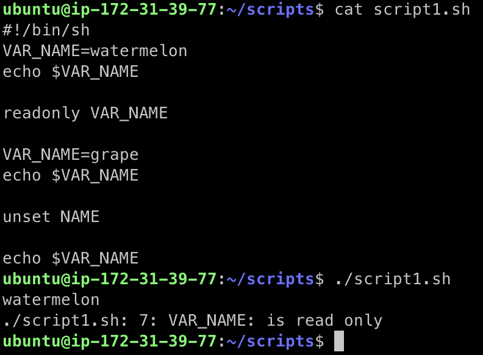

---
## Shell Script

* Unix shell의 cli가 실행할 수 있는 명령어의 조합
* 쉘 스크립트는 쉘에서 사용 할 수 있는 명렁어들의 조합을 모아서 만든 파일이라고 보면 편하다 
* 기본적으로 쉘을 이용해서 명령어들을 순차적으로 읽으면서 실행시켜준다
* .sh 파일을 생성해서 그 안에 쉘 커맨드를 추가 할 수 있다 
* If, while, case 문이 존재하며 작성후 ```bash {name.sh}``` 로 실행이 가능하다

---

## Shell Script의 선언

* ```#!``` : shebang(hashbang)
* ```#!/bin/sh``` : script를 시스템의 default shell로 인터프리트 (bourne shell)
  * 보통 ```/bin/sh```는 시스템의 디폴트 쉘을 가르키는 심볼릭 링크
  * 보통 POSIX-compliant 쉘이다 (Portable Operating System Interface)
* ```#!/bin/bash``` : bash shell script
* ```#!/bin/zsh``` : zshell shell script

* bash 쉘을 많이 이용하지만, bash 쉘이 설치 되어 있지 않는 alpine linux 같은 os도 존재하기 때문에 sh 쉘 기준으로 쉘 스크립트를 작성할줄 아는 것도 중요하다
* bash 쉘은 용량이 크다 (alpine linux는 bash 쉘이 없기 때문에 용량이 작음, docker 이미지 사이즈가 다른 리눅스에 비해 작음)

---

## Shell Script의 실행

* ```./{script_filename}```으로 실행
* 실행이 안될경우 권한 확인
  * 없을 경우 ```+x```권한 부여
* 실제 문제가 발생하기 전까지는 전부 실행됨

---

## Shell Script의 작성

### 변수

* 영문, 숫자만 사용가능
* 변수명은 대문자로 작성하자
* 변수의 사용은 ```$VAR_NAME```
* ```readonly VAR_NAME``` : 읽기 전용 변수로 선언 (읽기 전용 변수는 변경 불가능 -> 변경 시도시 에러 발생)
* ```unset VAR_NAME``` : 변수 할당 해제




---

## 쉘 스크립트의 사용

* ```#!/bin/bash``` : 이 스크립트를 Bash 쉘로 해석 하겠다는 선언문 같은 것

* ```$(date +%s) ``` : date를 %s (unix timestamp)로 변형

* ```START=$(date +%s)``` : START라는 변수에 저장

---

## Further Reading

* 쉘 스크립트를 통해 편리하게 자동화를 구축할 수 있다. 많이 연습해두자.

* 쉘 스크립트를 통해 구현 할 수 있는 기능 예시 : [https://www.geeksforgeeks.org/introduction-linux-shell-shell-scripting/](https://www.geeksforgeeks.org/introduction-linux-shell-shell-scripting/ )

* 위 링크에서 쉘 스크립팅에 대한 더 자세한 내용을 볼 수 있다.


## 참고

---

1. Naver Connection Boostcamp AI Tech 5th - Product Serving(변성윤)
2. [https://www.youtube.com/watch?v=cXnVygkAg4I](https://www.youtube.com/watch?v=cXnVygkAg4I)
3. [https://www.geeksforgeeks.org/introduction-linux-shell-shell-scripting/](https://www.geeksforgeeks.org/introduction-linux-shell-shell-scripting/)