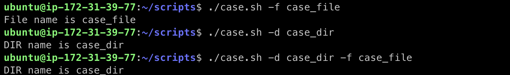
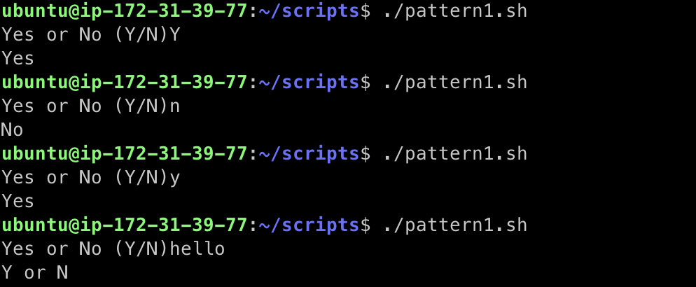
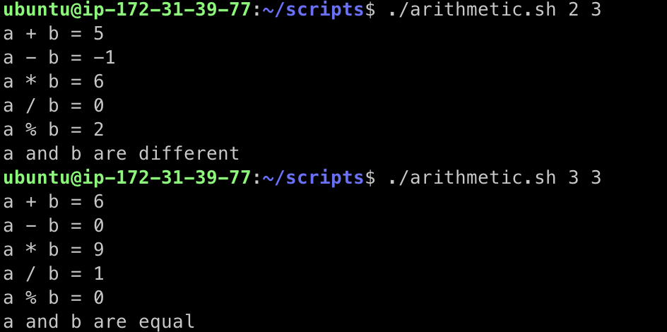

---

Bourne shell script 작성에 대한 기초.

---
## Shell Script

* Unix shell의 cli가 실행할 수 있는 명령어의 조합
* 쉘 스크립트는 쉘에서 사용 할 수 있는 명렁어들의 조합을 모아서 만든 파일이라고 보면 편하다 
* 기본적으로 쉘을 이용해서 명령어들을 순차적으로 읽으면서 실행시켜준다
* .sh 파일을 생성해서 그 안에 쉘 커맨드를 추가 할 수 있다 
* If, while, case 문이 존재하며 작성후 ```bash {name.sh}``` 로 실행이 가능하다

---

## Shell Script의 선언

* ```#!``` : shebang(hashbang)
* ```#!/bin/sh``` : script를 시스템의 default shell로 인터프리트 (bourne shell)
  * 보통 ```/bin/sh```는 시스템의 디폴트 쉘을 가르키는 심볼릭 링크
  * 보통 POSIX-compliant 쉘이다 (Portable Operating System Interface)
* ```#!/bin/bash``` : bash shell script
* ```#!/bin/zsh``` : zshell shell script

* bash 쉘을 많이 이용하지만, bash 쉘이 설치 되어 있지 않는 alpine linux 같은 os도 존재하기 때문에 sh 쉘 기준으로 쉘 스크립트를 작성할줄 아는 것도 중요하다
* bash 쉘은 용량이 크다 (alpine linux는 bash 쉘이 없기 때문에 용량이 작음, docker 이미지 사이즈가 다른 리눅스에 비해 작음)

---

## Shell Script의 실행

* ```./{script_filename}```으로 실행
* 실행이 안될경우 권한 확인
  * 없을 경우 ```+x```권한 부여
* 실제 문제가 발생하기 전까지는 전부 실행됨

---

## Shell Script의 작성

### 변수

* 영문, 숫자만 사용가능
* 변수명은 대문자로 작성하자
* 변수의 사용은 ```$VAR_NAME```
  * ```${VAR_NAME}```권장 
* ```readonly VAR_NAME``` : 읽기 전용 변수로 선언 (읽기 전용 변수는 변경 불가능 -> 변경 시도시 에러 발생)
* ```unset VAR_NAME``` : 변수 할당 해제

```sh
#!/bin/sh
VAR_NAME=watermelon
echo $VAR_NAME

readonly VAR_NAME

VAR_NAME=grape
echo $VAR_NAME

unset NAME

echo $VAR_NAME
```

```
# result of ./script1.sh
watermelon
./script1.sh: 7: VAR_NAME: is read only
```

### 특수목적 변수

```sh
#!/bin/sh

echo "Current Shell's PID: $$"
echo "Current Script's file name: $0"
echo "The 1st argument when the Script is executed: $1"
echo "The 2nd argument when the Script is executed: $2"
echo "The total number of parameters for the Script: $#"
echo "1. The parameters as a single word and return"
echo "---------------------------------------------------------"
for param in "$*"
do
	echo $param,
done
echo "---------------------------------------------------------"
echo "2. The parameters as seperate strings and return"
echo "---------------------------------------------------------"
for param in "$@"
do
	echo $param,
done
echo "---------------------------------------------------------"
```

```
# result of ./script2.sh A B C
Current Shell's PID: 65863
Current Script's file name: ./script2.sh
The 1st argument when the Script is executed: A
The 2nd argument when the Script is executed: B
The total number of parameters for the Script: 3
1. The parameters as a single word and return
---------------------------------------------------------
A B C,
---------------------------------------------------------
2. The parameters as seperate strings and return
---------------------------------------------------------
A,
B,
C,
---------------------------------------------------------
```

* ```$*``` vs ```$@```
  * ```$*``` : 모든 파라미터를 하나의 문자열로 인식 
  * ```$@``` : 모든 파라미터를 필드로 구분된 단어로 취급 (배열처럼 동작)

* ```$?``` : 마지막으로 실행된 명령어의 종료 상태
  * 보통 ```exit 0```이면 성공적으로 종료, 아닌 경우에 실패

```sh
#!/bin/sh

./success.sh

if [ $? -ne 0 ]; then
	echo "failed"
	exit 1
fi

echo "proceeding!"

./fail.sh

if [ $? -ne 0 ]; then
        echo "failed"
        exit 1
fi

echo "proceeding!"
```

```
# result
used exit 0
proceeding!
used exit 1
failed
```

* ```$!``` : 마지막 백그라운드 명령어의 PID

---

## 조건문

### if

* ```if```문을 이용해서 조건문 작성
* ```if```는 항상 ```fi```로 닫음
* 조건 뒤에 ```; then```으로 다음 수행을 알려준다

```sh
if [condition]; then
		${if 실행문}
elif [condition];
		${elif 실행문}
else
		${else 실행문}
fi
```

#### 예시

```sh
#!/bin/sh

if [ $1 -eq $2 ]; then
	echo "arguments are equal"
elif [ $1 -gt $2 ]; then
	echo "arg1 is greater than arg2"
else
	echo "arg1 is smaller than arg2"
fi
```


#### 비교 연산자

* ```-eq``` : equal, 두 값이 같은 경우 true
* ```-ne``` : negative, 두 값이 다른 경우 true
* ```-lt``` : less than, 다른 언어에서의 ```<```를 생각하면 됨, 왼쪽 값이 오른쪽 값보다 작은 경우 true
* ```-le``` : less than equal, 다른 언어에서의 ```<=```, 왼쪽 값이 오른쪽 값보다 작거나 같은 경우 true
* ```-gt``` : greater than, 왼쪽 값이 오른쪽 값보다 큰 경우 true
* ```-ge``` : greater than equal, 왼쪽 값이 오른쪽 값보다 크거나 같은 경우 true

#### Boolean Operators

| Operator |                         Description                          |                  Example                   |
| :------: | :----------------------------------------------------------: | :----------------------------------------: |
|  **!**   | This is logical negation. This inverts a true condition into false and vice versa. |         ```[ ! false ]``` is true.         |
|  **-o**  | This is logical **OR**. If one of the operands is true, then the condition becomes true. | ``` [$a -lt 20 -o $b -gt 100]``` is true.  |
|  **-a**  | This is logical **AND**. If both the operands are true, then the condition becomes true otherwise false. | ``` [$a -lt 20 -a $b -gt 100]``` is false. |

#### String Operators

| Operator |                         Description                          |            Example             |
| :------: | :----------------------------------------------------------: | :----------------------------: |
|  **=**   | Checks if the value of two operands are equal or not; if yes, then the condition becomes true. | ```[ $a = $b ]``` is not true. |
|  **!=**  | Checks if the value of two operands are equal or not; if values are not equal then the condition becomes true. |  ```[ $a != $b ]``` is true.   |
|  **-z**  | Checks if the given string operand size is zero; if it is zero length, then it returns true. |  ```[ -z $a ]``` is not true.  |
|  **-n**  | Checks if the given string operand size is non-zero; if it is nonzero length, then it returns true. | ```[ -n $a ]``` is not false.  |
| **str**  | Checks if **str** is not the empty string; if it is empty, then it returns false. |   ```[ $a ]``` is not false.   |

#### File Test Operators

|  Operator   |                         Description                          |             Example             |
| :---------: | :----------------------------------------------------------: | :-----------------------------: |
| **-b file** | Checks if file is a block special file; if yes, then the condition becomes true. |  ```[ -b $file ]``` is false.   |
| **-c file** | Checks if file is a character special file; if yes, then the condition becomes true. |  ```[ -c $file ]``` is false.   |
| **-d file** | Checks if file is a directory; if yes, then the condition becomes true. | ```[ -d $file ]``` is not true. |
| **-f file** | Checks if file is an ordinary file as opposed to a directory or special file; if yes, then the condition becomes true. (디렉토리가 아닌 regular 파일이면 true) |   ```[ -f $file ]``` is true.   |
| **-g file** | Checks if file has its set group ID (SGID) bit set; if yes, then the condition becomes true. |  ```[ -g $file ]``` is false.   |
| **-k file** | Checks if file has its sticky bit set; if yes, then the condition becomes true. |  ```[ -k $file ]``` is false.   |
| **-p file** | Checks if file is a named pipe; if yes, then the condition becomes true. |  ```[ -p $file ]``` is false.   |
| **-t file** | Checks if file descriptor is open and associated with a terminal; if yes, then the condition becomes true. |  ```[ -t $file ]``` is false.   |
| **-u file** | Checks if file has its Set User ID (SUID) bit set; if yes, then the condition becomes true. |  ```[ -u $file ]``` is false.   |
| **-r file** | Checks if file is readable; if yes, then the condition becomes true. |   ```[ -r $file ]``` is true.   |
| **-w file** | Checks if file is writable; if yes, then the condition becomes true. |   ```[ -w $file ]``` is true.   |
| **-x file** | Checks if file is executable; if yes, then the condition becomes true. |   ```[ -x $file ]``` is true.   |
| **-s file** | Checks if file has size greater than 0; if yes, then condition becomes true. |   ```[ -s $file ]``` is true.   |
| **-e file** | Checks if file exists; is true even if file is a directory but exists. |   ```[ -e $file ]``` is true.   |

<p align ='center'>출처 - https://www.tutorialspoint.com/unix/unix-basic-operators.htm</p>

* ```${A} -nt ${B}``` : newer than, A 파일이 B 파일보다 최신 파일이면 참
* ```${A} -ot ${B}``` : older than, A 파일이 B 파일보다 이전 파일이면 참
* ```${A} -ef ${B}``` : equal file, A 파일이 B 파일과 동일하면 참
* 위의 연산자들 외에도 많은 연산자 존재
* 필요한걸 찾아서 사용하자

### case

* 미리 정해진 패턴의 선택지 사용
* ```case```는 ```esac```으로 받음
* ```case``` 대상 변수 뒤에서는 ```in```과 ```pattern```이 와야함

```sh
case word in
   pattern1)
      Statement(s) to be executed if pattern1 matches
      ;;
   pattern2)
      Statement(s) to be executed if pattern2 matches
      ;;
   pattern3)
      Statement(s) to be executed if pattern3 matches
      ;;
   *)
     Default condition to be executed
     ;;
esac
```

#### 예시

```sh
#!/bin/sh

OPTION="${1}"
case ${OPTION} in
	-f) FILE="${2}"
	echo "File name is ${FILE}"
	;;
	-d) DIR="${2}"
	echo "DIR name is ${DIR}"
	;;
*)
	echo "`basename ${0}` :usage: [-f file] | [-d directory]"
	exit 1
	;;
esac
```



#### 패턴 이용 예시

```sh
#!/bin/sh

echo -n "Yes or No (Y/N)"
read check

case ${check} in
	[Yy] )
		echo "Yes"
		;;
	[Nn] )
		echo "No"
		;;
	* )
		echo "Y or N"
		;;
esac
```



---

## 산술 연산

* Bourne shell은 산술 연산자가 없어서 외부 프로그램을 사용해야 함
* awk / expr

### expr

* 문장 앞에 ```expr``` 명령어를 붙여줘야함
* 전체 문장은 ``` ` ```로 묶어야 함
* ```*```와 ```()```는 특수기호로 인식되기 때문에, 연산자로 인식하기 위해서 ```\```를 앞에 붙인다
  * 또는 부호 앞뒤로 ```""```로 감싸줄 수 있음
  * 문장 전체를 ```""``` 처리하면 문자열로 인식됨
* ```=``` 사용에는 공백이 없어야함

```sh
#!/bin/sh

ADD=`expr ${1} + ${2}`
echo "a + b = ${ADD}"
SUB=`expr ${1} - ${2}`
echo "a - b = ${SUB}"
MUL=`expr ${1} \* ${2}`
echo "a * b = ${MUL}"
DIV=`expr ${1} / ${2}`
echo "a / b = ${DIV}"
QUOT=`expr ${1} % ${2}`
echo "a % b = ${QUOT}"

if [ $1 = $2 ]; then
	echo "a and b are equal"
elif [ $1 != $2 ]; then
	echo "a and b are different"
fi
```



---

## 반복문

### while, do, done

```sh
#!/bin/sh

i=0
while [ "$i" -lt 10 ]
do
	j="$i"
	while [ "$j" -ge 0 ]
	do
		echo -n "$j "
		j=`expr $j - 1`
	done
	echo
	i=`expr $i + 1`
done
```

```
# result
0
1 0
2 1 0
3 2 1 0
4 3 2 1 0
5 4 3 2 1 0
6 5 4 3 2 1 0
7 6 5 4 3 2 1 0
8 7 6 5 4 3 2 1 0
9 8 7 6 5 4 3 2 1 0
```

* ```echo -n```은 끝에 개행문자를 출력하지 않음

#### break

```sh
#!/bin/sh

a=0

while [ $a -lt 10 ]
do
   echo $a
   if [ $a -eq 5 ]
   then
      break
   fi
   a=`expr $a + 1`
done
```

```
# result
0
1
2
3
4
5
```

---

## Function

```sh
#!/bin/sh

# Define your function here
Hello () {
   echo "Hello World"
}

# Invoke Function
Hello

# Pass Parameters to Function
Add () {
	echo "a+b = `expr $1 + $2`"
}

# Invoke Function
Add 4 5

# Return Value from Function
Ret () {
	echo "My id is $1"
	return 99
}

# Invoke Function
Ret loll

# Capture value returned by last command
RET_VAL=$?

echo "Value returned by function is $RET_VAL"
```

```
# result
Hello World
a+b = 9
My id is loll
Value returned by function is 99
```

---

## Metacharacters

* 메타 캐릭터(Shell Special Characters)
  * ```* ? [ ] ' " \ $ ; & ( ) | ^ < > new-line space tab```
* 문자로 사용하기 위해서는 ```\```을 사용해야하는 경우들이 있다

```sh
#!/bin/sh

echo Hello; Word
```

```
# result
Hello
./test.sh: line 2: Word: command not found

shell returned 127
```

* 위의 경우 처럼 ```;```앞에 ```\```를 붙여서 사용해야 한다

```sh
#!/bin/sh

echo Hello\; Word
```

```
# result
Hello; Word
```

* 그 이외에도 ```* ? [ ] ' " \ $ ; & ( ) | ^ < > new-line space tab``` 에 포함 되어있으면 앞에 ```\```를 위치시켜서 사용한다(문자로 사용해야하는 경우에)
* ```''```안에 위치 시키면 ```\``` 없이 특수 목적 문자들을 출력할 수 있음 (single quote)
* ``` ``  ``` 내부에 shell 명령어를 작성하고 실행할 수 있음

---

## 쉘 스크립트의 사용

* ```#!/bin/bash``` : 이 스크립트를 Bash 쉘로 해석 하겠다는 선언문 같은 것

* ```$(date +%s) ``` : date를 %s (unix timestamp)로 변형

* ```START=$(date +%s)``` : START라는 변수에 저장

---

## Further Reading

* 쉘 스크립트를 통해 편리하게 자동화를 구축할 수 있다. 많이 연습해두자.
* 쉘 스크립트를 통해 구현 할 수 있는 기능 예시 : [https://www.geeksforgeeks.org/introduction-linux-shell-shell-scripting/](https://www.geeksforgeeks.org/introduction-linux-shell-shell-scripting/ )
* ```echo -e```의 사용


## 참고

---

1. Naver Connection Boostcamp AI Tech 5th - Product Serving(변성윤)
2. [https://www.youtube.com/watch?v=cXnVygkAg4I](https://www.youtube.com/watch?v=cXnVygkAg4I)
3. [https://www.geeksforgeeks.org/introduction-linux-shell-shell-scripting/](https://www.geeksforgeeks.org/introduction-linux-shell-shell-scripting/)
4. [https://www.tutorialspoint.com/unix/unix-basic-operators.htm](https://www.tutorialspoint.com/unix/unix-basic-operators.htm)
5. [https://hand-over.tistory.com/32](https://hand-over.tistory.com/32)