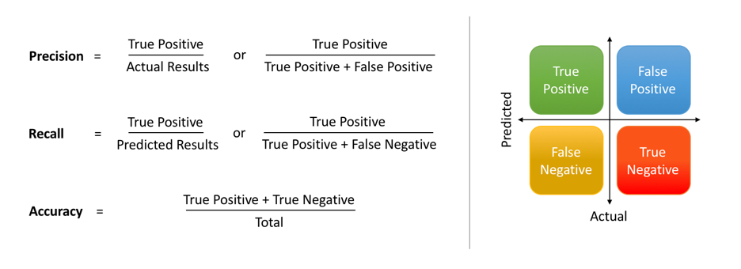
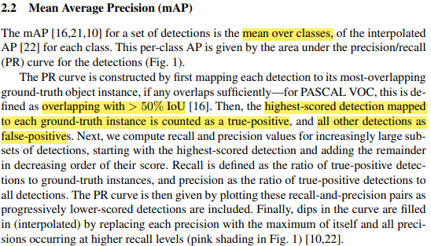
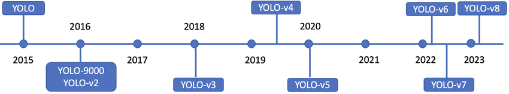
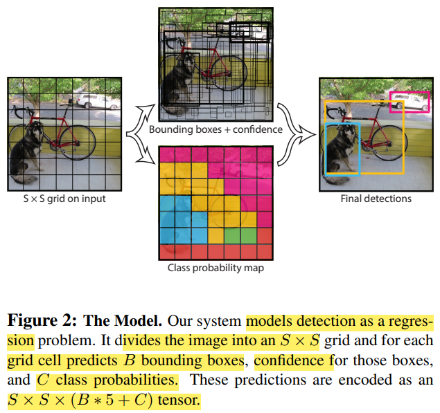

---
## 객체 탐지(Object Detection)
### Classification + Localization
하나의 객체에 대해서 클래스를 판별 하고, 그 객체의 위치를 알려주는 바운딩 박스(bounding box)를 찾아주는 작업을 classification and localization task라고 한다. 기본적인 아키텍쳐의 경우 CNN 네트워크에 클래스 점수(class score)를 정해주는 FC layer와 박스 좌표(box coordinate)를 정해주는 FC layer로 구성된다. 

이 경우 계산하는 loss는 두 개이고, 학습하는 data는 이미지의 클래스 레이블과 바운딩 박스가 정해진 ground truth를 가진 형태이다. 학습을 할 때 두 개의 loss에 대한 가중합을 학습한다. 이 때 각 loss에 대한 가중치를 하이퍼 파라미터(hyper parameter) 형태로 조절 해줘야하고, 이런 multi-loss에 대한 하이퍼 파라미터를 결정하는 작업은 까다롭다. 

 

CS231n

 

---

### Object Detection이란?

앞서 말한 classification + localization과는 다르게 객체가 여러 개가 존재해서, 각 객체에 대한 바운딩 박스와 클래스를 정해줘야 하는 태스크이다. Object detection은 결국 하나의 이미지내에서 다중 객체(multi object)에 대한 classification and localization을 한다고 보면 된다(물론 학습을 위해 사용하는 방법은 다르다). 

YOLOv3: An Incremental Improvement 

 

---

### Object Detection에 사용된 개념

#### Sliding Window

Object detection을 위해 초기에 시도 되었던 방법이다. 윈도우를 이미지 내에서 sliding(이동) 시키면서 모든 윈도우의 경우에 대해 분류를 진행하는 방식이다. Semantic segmentation의 sliding window와 거의 동일하다고 볼 수 있다. 이런 brute force 방식의 접근은 너무 높은 연산 비용을 요구하기 때문에, 높은 용량의 데이터를 다루는 영상 처리에서는 지양해야한다.

 

sliding window

 

---

#### Region Proposal(RoI - Regions of Interest)

객체가 있을 법한 후보군들의 region 찾아서 그 region들에 대해 CNN 네트워크의 입력으로 주는 방식이다. 아주 간단하게 설명하자면, region proposal을 뽑아서 CNN 네트워크의 입력으로 줘서 object detection을 수행한다고 보면 된다. 

모든 경우의 수 말고 몇몇(~2k)개의 후보군만 확인하면 되는 방식이라서 brute force보다 효율적이다. Region proposal 방식은 R-CNN([Rich feature hierarchies for accurate object detection and semantic segmentation](https://arxiv.org/abs/1311.2524))의 논문에 처음 소개 되었다.

 

---

## R-CNN 

R-CNN은 selective search라는 전통적인 알고리즘 기법(학습 x)을 통해 RoI를 만들어낸다. 뽑힌 RoI의 사이즈는 다양하기 때문에, 분류를 위한 CNN 네트워크의 입력으로 주기 위해서는 이미지의 사이즈를 FC layer에 들어갈 수 있게 전부 동일하게 고정된 사이즈로 변경해줘야 한다. 

이 때 변경된 이미지는 warped image region이라고 한다. Warped image 각각은 CNN 네트워크에 통과 시키고 분류를 위해서 SVM(2014년임을 고려하자)을 사용한다. 또한, RoI를 보정하기 위한 regression 과정도 거친다. 보정의 경우 RoI와 바운딩 박스가 일치하지 않는 경우를 보정하기 위한 offset 값을 4개 예측 해준다고 보면 된다.

 

CS231n 

 

R-CNN 방식은 그럼에도 불구하고 selective search를 통한 CNN 연산을 2000번 넘게 연산으로 인해 연산 비용이 높고, selective search도 cpu를 통한 연산이기 때문에 상대적으로 속도가 느리다. 

이를 해결하기 위해 Fast R-CNN이 등장 했다.

 

---

## Fast R-CNN 

Fast R-CNN의 경우 앞서 말한 RCNN과 동일하게 selective search라는 region proposal method를 사용하지만, RCNN과 다른점은 selective search로 구한 RoI 각각을 CNN 네트워크를 통과시키는 것이 아니라 입력 이미지 하나에 대해 CNN에 통과시키고, RoI들은 축소된 형태로 여러가지 사이즈로 feature map에 나타난다. 

이렇게 한다면, RCNN과 다르게 입력 이미지에 대해서만 CNN을 연산하고, 각각의 RoI에 대해서 분류와 regression을 진행하기 때문에 더 효율적이다. 조금 더 세부하게 과정을 살피자면, feature map의 RoI들은 사이즈가 제각각이기 때문에 RoI pooling이라는 과정을 통해서 FC layer의 입력에 넣을 수 있도록 고정된 크기의 벡터로 변환해야한다. 이 RoI feature vector는 softmax 연산을 통해 분류를 하고, 바운딩 박스 regression으로 바운딩 박스를 위한 보정값을 예측한다. 

  

Fast R-CNN architecture - 출처 : Fast R-CNN, CS231n 

 

Fast R-CNN에서도 한계점은 있다. 학습 시키지 않는 전통적인 알고리즘 기반의 selective search가 bottleneck의 원인 되었고, 이를 해결하기 위해서 Faster R-CNN이라는 방법이 등장했다.

 

---

## Faster R-CNN

앞의 Fast R-CNN의 한계는 결국 region proposal 단계의 병목 때문이다. Faster R-CNN은 이를 해결하기 위해 네트워크가 region proposal을 학습 할 수 있는 형태로 바꾼다. 간단히 말하자면 RPN(Region Proposal Network)를 RoI pooling과 함께 GPU단에서 해결 할 수 있도록 설계되었다.

 

CS231n 

 

지금까지 설명한 R-CNN 계열의 네트워크들은 region based method를 사용하는 2 stage detector 방식이다. 이 다음으로 1 stage detector와 2 stage detector의 차이 그리고 대표적인 1 stage detector 방식인 YOLO를 살펴보자.

 

Recent Advances in Deep Learning for Object Detection 

 

---

## 1-stage detector vs 2-stage detector 

A Survey of Deep Learning-Based Object Detection 

* **2 stage detector**

  * localization과 분류를 순차적으로 해결

  * 속도가 느림

  * RCNN family가 대표적인 2 stage detector

* **1 stage detector**

  * localization과 분류를 동시에 해결

  * feature extraction과 object detection이 전체 이미지에 대해 이루어지는 간단한 디자인

  * 속도가 빠름(real time detection이 가능)

  * 낮은 background error

  * YOLO가 대표적인 1 stage detector

---

## Object Detection을 위한 성능지표(Metric)

### Precision and Recall

 

 
https://www.datacamp.com/tutorial/precision-recall-curve-tutorial 

 

accuracy - 출처 : 
https://www.datacamp.com/tutorial/precision-recall-curve-tutorial 

* Precision(정확도) - 올바르게 탐지한 물체의 수(TP) / 모델이 탐지한 물체의 수(TP+FP)

* Recall(재현율) - 올바르게 탐지한 물체의 수(TP) / 실제 정답 물체의 수(TP+FN)

 

---

### 정확도와 재현율에 따른 Trade Off

모든 영역에 대하여 전무 물체가 존재한다고 판단을 하는 경우, 재현율은 높아지지만 정확도가 떨어진다.

확실할 때만(confident 한 경우만) 물체가 존재한다고 판단을 하는 경우, 정확도는 높아지지만, 재현율이 떨어진다.

 

---

### Mean Average Precision (mAP)

 

End-to-end training of object class detectors for mean average precision 

 

End-to-end training of object class detectors for mean average precision 

* precision과 recall은 보통 반비례 관계를 가진다. 
* mAP를 계산하기 위해서는 우선 각 클래스의 average precision(AP)를 계산한다. AP는 각 precision-recall 그래프의 넓이로 계산 할 수 있다. 그 다음 모든 AP들의 평균을 계산하면 mAP를 구할 수 있다.

 

---

### Intersection over Union (IoU)

True Positive(TP)와 False Positive(FP)를 결정하는 기준으로  IoU를 사용한다. IoU를 간략히 설명하자면 두 바운딩 박스가 겹치는 비율로 생각 할 수 있다.

 

pyimagesearch.com/2016/11/07/intersection-over-union-iou-for-object-detection/ 

 

pyimagesearch.com/2016/11/07/intersection-over-union-iou-for-object-detection/ 

* mAP@0.5는 ground truth와 prediction의 IoU가 50% 이상일 때 정답으로 판정하겠다는 의미
* NMS 계산의 경우, 같은 클래스끼리 IoU가 50% 이상일 때 낮은 confidence의 bounding box를 제거한다

 

---

### Non Maximum Suppression (NMS)

의미만 해석하자면 제일 큰 것을 제외하고 나머지는 suppress 하자는 의미이다. 

Object detection에서 하나의 인스턴스에는 하나의 바운딩 박스가 적용되어야 한다. 그렇게 때문에 하나의 물체에 대해 여러개의 바운딩 박스가 겹쳐져 있을 경우 하나로 합치는 방법이 필요하다. NMS는 보통 IoU가 특정 threshold를 넘어가는 중복되는 박스를 제거하는 방식이다. 

 

https://wikidocs.net/163295 

 

---

## YOLO (You Look Only Once)

 

https://www.researchgate.net/figure/Timeline-of-You-Only-Look-Once-YOLO-variants_fig1_369379818 

* YOLO v1 : 하나의 이미지의 bbox와 classification을 동시에 예측하는 1 stage detector의 등장
* YOLO v3 : multi scale feature map의 사용
* YOLO v5 : small, medium, large 크기 별로 모델 구성

 

---

### Unified Detection in YOLO

 

detection in YOLO  - 출처 : You Only Look Once

 

YOLO에서 object detection을 regression problem으로 전환해서 풀고 있다. 또한 간단한 구조의 end to end 네트워크를 사용하고 있다. 

YOLO에서 unified detection의 과정을 설명하자면, 입력 이미지를 SxS 그리드 영역으로 나누고 각 그리드 영역마다 B개의 바운딩 박스와 confidence score를 계산하고 C개의 클래스에 대해서 해당 클래스일 확률을 계산한다. (parameter used in YOLO, S=7, B=2, C=20) 

Confidence score는 그리드에서 `(object가 존재할 확률) x (ground truth와 IoU)`로 계산한다. 수식으로 표현하면 다음과 같다.
$$
confidence = Pr(object) \times IoU^{truth}_{pred}
$$
C개의 클래스에 대한 해당 클래스일 확률은 다음과 같이 계산한다.
$$
class probability = Pr(Class_{i}|Object)
$$
간단하게 요약을 하자면, 입력 이미지가 들어오면 이미지를 7x7(49개)의 그리드로 나누고, 각 그리드 마다 2개의 바운딩 박스와 confidence score를 계산하고, 각 그리드(49개의 그리드)마다 어떤 클래스인지 해당 클래스일 확률을 계산한다.

 

---

### Network Design of YOLO

 

You Only Look Once

* googlenet의 변형 사용

* 24 conv layers for feature extraction

* 2 fully connected layers for prediction

 

https://wikidocs.net/187967

* 결과는 7x7x30으로 나온다
* 바운딩 박스 1, 2에 대한 (x좌표, y좌표, 너비, 높이, confidence score) + 20개 클래스에 대한 확률

 

---

### 결과 추론(Inference)

각 바운딩 박스의 confidence score를 20개의 클래스 확률과 곱해서 각 bounding box가 각 클래스에 대해 어떤 클래스에 해당하는지 확률을 계산한다.

 

You Only Look Once

49개의 그리드당 2개의 bounding box를 계산하기 때문에 총 98개의 box에 대한 class specific confidence score를 계산한다.

 

---

### YOLO 장단점

**장점**

* 속도가 빨라서 real time detection에 활용 가능하다
* 물체의 일반화된 특징을 학습하기 때문에 새로운 도메인의 이미지에 대한 좋은 성능을 보인다

**단점**

* 그리드보다 작은 크기의 물체 검출이 불가능하다
* 신경망을 통과할 때 마지막 feature만 사용하기 때문에 정확도가 하락한다

---

## Further Reading

* Object Detection의 milestone을 확인해보기
* YOLO vs SSD 비교해보기
* 최근 SOTA 모델들의 트렌드 살펴보기

 

## Reference

---

1. [You Only Look Once: Unified, Real-Time Object Detection](https://arxiv.org/abs/1506.02640)
2. [End-to-end training of object class detectors for mean average precision](https://arxiv.org/abs/1607.03476)
3. [Rich feature hierarchies for accurate object detection and semantic segmentation](https://arxiv.org/abs/1311.2524)
4. [boostcourse : 재활용 쓰레기를 활용한 딥러닝 - Detection](https://www.boostcourse.org/ai341)
5. [CS231n](https://www.youtube.com/watch?v=vT1JzLTH4G4&list=PLC1qU-LWwrF64f4QKQT-Vg5Wr4qEE1Zxk)
