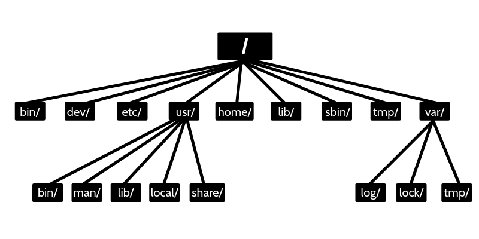

<br>

## Debugging

### 디버깅이란?

오류나 버그를 찾고 수정하는 과정. 이런 디버깅은은 보통 바라는 상황과 실제 상황이 차이가 나는 경우 행해야 하는 경우가 많다.

<br>

### 버그가 발생하는 이유

1. 휴먼 에러(실수)
   * 개발 과정 중 문법, 로직 오류
2. 실행 환경
   * OS, 가상 환경, 컨테이너, 하드웨어, 네트워크 상태 등
3. 의존성
   * 라이브러리에서 사용하는 다른 라이브러리의 버그로 인한 이슈
4. 복잡성
   * 소프트웨어가 복잡해질수록 버그 가능성이 높아질 수 있음
5. 잘못된 커뮤니케이션
   * 요구 사항에 대한 misunderstanding

<br>

### Debugging Process

문제 발생, 문제 인식, 해결책 찾기, 버그 기록, 버그 재현 등의 과정으로 진행할 수 있다.


<p align="center">출처 - https://www.javatpoint.com/debugging </p>

* 꼭 기록하는 습관을 가지자
* 답을 찾더라도 항상 교차 검증하자
* 항상 목적이 뭔지 상기하면서 해결책을 찾자

<br>

## Server Management

* 대부분 AI, ML 모델들은 서버에서 동작한다
* 서버의 관리를 배울 필요성이 있다

<br>

### 서버 관리의 목적

* 서버를 안정적으로 운영해서 장애를 발생하지 않기 위함
* 서버에서 작업을 원활하게 진행하기 위함

<br>

### 알아야할 지식

* 쉘 커맨드
* 파일 시스템
* 네트워크
* 패키지 관리
* 성능 모니터링
* 컨테이너, 오커스트레이팅

<br>

### Linux 파일 시스템

* 리눅스는 파일, 폴더 구조를 일관된 방식으로 제공한다. 시스템 구성, 로그 등을 별도로 저장하며 소프트웨어를 설치하는 공간도 따로 제공한다.




<p align="center">출처 - https://linuxconcept.com/linux-file-system-hierarchy/ </p>


* 파일 공간이 부족할 때 사용하지 않는 파일들을 지워준다. 그러나 한방에 전부 날리는 일은 피하도록 하자.(sudo 명령어로 실수해서 시스템 날려먹는 일 하지말자!)

<br>

#### 파일 시스템의 Case Study

경로나 호스트 머신의 디스크 문제를 인식하기 전에 서버가 어떤 환경에서 실행 중인지 확인하자.

* On Premise 환경, IDC와 같은 물리적으로 접근 가능한 서버 환경인지
* 클라우드 환경인지
* Docker/Kubernetes 같은 컨테이너 환경의 여부

<br>

### 네트워크 

* IP, DNS, port, 방화벽 등에 대한 개념을 공부하자

* ```ping``` : 서버가 연결되어 있는지, 얼마자 빠른 속도로 데이터가 전송되는 테스트

* ```nslookup``` : 특정 도메인을 찾을 수 있는지, DNS 서버에 연결 가능한지

* ```netstat``` : 포트 개방 확인(TCP connection), 특정 포트만 확인하고 할 때 ```grep``` 활용, 

  ex. ```netstat -tnlp | grep 3000```

<br>

## 참고

---

1. [https://www.geeksforgeeks.org/software-engineering-debugging/](https://www.geeksforgeeks.org/software-engineering-debugging/)
2. Naver Connection Boostcamp AI Tech 5th - Product Serving(변성윤)