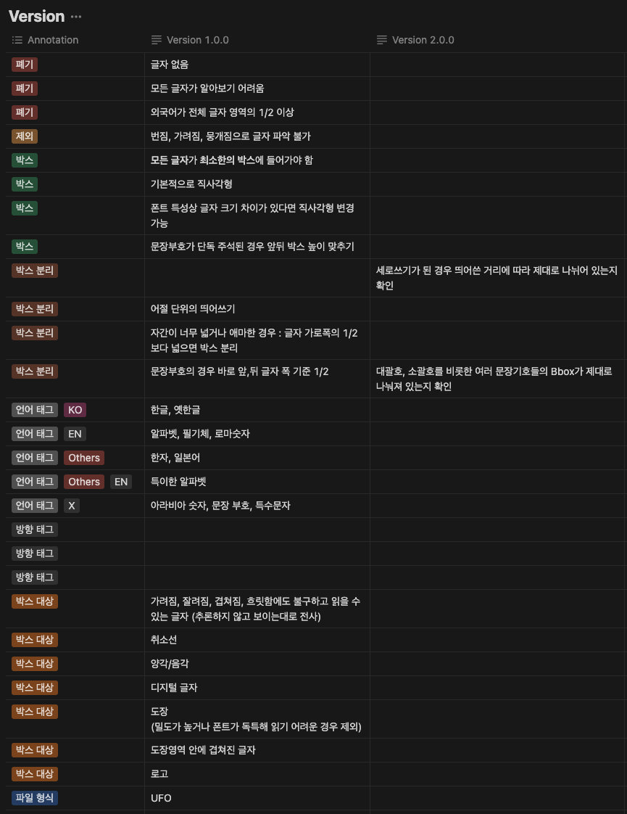

---

> **주관 단체**
>
> `Naver Boostcamp AITech 5기 CV 트랙`내에서 진행된 AI 모델 경진대회입니다.
{: .prompt-info }

---

---

## 📋 프로젝트 개요

> **참고**
>
> * **프로젝트 깃헙(레포지토리 내용은 동일합니다)**
>   * [개인 레포지토리](https://github.com/seungki1011/AI-Tech5-Data-Centric-Competetion)
>   * [팀 레포지토리](https://github.com/boostcampaitech5/level2_cv_datacentric-cv-03)
> * [팀 리포트](https://github.com/seungki1011/AI-Tech5-Data-Centric-Competetion/blob/master/etc/wrap_up_report.pdf)
> * [최종 발표 자료](https://github.com/seungki1011/AI-Tech5-Data-Centric-Competetion/blob/master/etc/presentation.pdf)
{: .prompt-info }

 

_OCR_

**OCR(Optimal Character Recognition) 기술은 사람이 직접 쓰거나 이미지 속에 있는 문자를 얻은 다음 이를 컴퓨터가 인식할 수 있도록 하는 기술**입니다. 스마트폰으로 카드를 결제하거나, 카메라로 카드를 인식할 경우 자동으로 카드 번호가 입력되거나 주차장에 들어가면 차량 번호가 자동으로 인식되는 등 일상생활에 이미 보편적으로 사용되고 있습니다. 

이번 대회는 OCR의 대표적인 모델 중 하나인 EAST(Efficient and Accurate Scene Text Detector) 모델을 활용하여 진료비 계산서 영수증안에 있는 글자를 인식하는 대회입니다.

이번 대회는 Data-Centric 대회로 다음과 같은 제약사항이 있습니다.

- 대회에서 주어지는 EAST 모델만을 사용해야 하며 모델과 관련된 코드를 바꿔서는 안됩니다.
- 이미지넷 기학습 가중치 외에는 사용이 불가합니다.

즉 이번 대회는 모델을 고정한 상태로 데이터만을 활용하여 OCR 모델의 성능을 최대한 끌어 올리는 프로젝트입니다.

최종 평가는 `F1-score`로 진행되었습니다.

 

---

## 📆 프로젝트 일정

프로젝트의 세부 일정입니다.

* **2023.05.22 ~ 2023.05.24** : OCR에 대해 알아보기, EDA
* **2023.05.25 ~ 2023.05.25** : Train dataset과 Validation dataset 분리, Validation 코드 추가
* **2023.05.26 ~ 2023.05.28** : Mixed Precision, Pickle 파일로 학습시간 단축
* **2023.05.27 ~ 2023.05.28** : Train/Test dataset 살펴보기, Re-labeling, Augmentation 실험
* **2023.05.29 ~ 2023.05.31** : Relabeling, Pretrain용 Dataset 탐색, wandb에 detEval 추가
* **2023.05.30 ~ 2023.05.31** : Relabeling, Optimizer & Scheduler 탐색
* **2023.06.01 ~ 2023.06.01** : Ensemble

 

---

## 🚀 프로젝트 진행

> **내가 맡은 역할**
>
> * Uptsage의 OCR 포맷인 UFO에서 COCO 포맷으로 변환하거나 역변환하는 파이썬 코드 구현
> * 라벨링 툴인 CVAT를 활용한 데이터 라벨링과 검수
> * 모델 실험
{: .prompt-info }

 

팀은 다음과 같이 프로젝트를 진행했습니다.

 

### EDA(데이터 시각화)

가장 먼저 데이터셋에 대한 파악이 이루어졌습니다. 일단 기본적으로 주어진 학습 셋(training set)은 **진료 영수증 이미지 301장과 그 애노테이션(annotation)이 전부 포함된 JSON 파일**입니다. **JSON 파일에는 Ground Truth가 UFO 포맷으로 표현**되었다. 해당 **데이터셋에 대한 내용을 시각화 해서 파악**해보기로 했습니다.

 

_단어의 갯수 파악_

* `word_counts`: 이미지 1장에 대해 애노테이션이 진행된 단어의 갯수
* `image_width`: 이미지 너비
* `image_height`: 이미지 높이

 

다음은 애노테이션(tag)에 대해 파악한 그래프입니다.

_종류별 애노테이션 파악_

* `occlusion`: 가려짐
* `stamp`: 도장
* `inferred word tags`: 약간의 추론이 들어간 경우
* `foreground`: 전경
* `handwriting`: 손글씨

 

_가로쓰기, 세로쓰기 파악_

* 텍스트가 가로쓰기가 대부분을 차지하고, 세로쓰기 텍스트는 56건으로 적은 비율을 차지한다는 것을 파악했습니다

 

_종횡비 파악_

* 가로쓰기 바운딩 박스에 대한 종횡비가 5가 넘어가는 케이스에 대해 유의하기로 했습니다

 

---

### EDA(데이터셋 직접 확인)

OCR을 진행하기 위해 **검출해야 하는 텍스트의 크기, 종횡비, 등 텍스트에 관련된 EDA를 진행했지만 많은 인사이트를 얻지 못했습니다**. 그래서 전체 학습 세트를 살펴보면서, **데이터가 어떤 특징을 가지고 있는지 육안으로 확인**했습니다.

* 구겨진 영수증에 대한 이비지
* 스캔과 인쇄로 인한 노이즈
* 흐린 이미지
* 어두운 이미지
* 텍스트가 도장에 가려져 있는 경우

위와 같은 **엣지 케이스들을 파악**했습니다.

**베이스라인 모델(baseline model)을 사용해서 전체 학습 세트에 대한 추론 결과를 확인**하고, 여러가지 케이스에 대한 추론을 베이스라인 모델이 어떻게 진행하는지 파악했습니다. 

이 과정에서 다음과 같은 **문제 상황을 파악**했습니다. 

* 세로로 쓰여진 가로쓰기를 잘 잡지 못하는 문제
* 세로쓰기를 검출하는 바운딩 박스가 불안정한 문제
* 바운딩 박스를 하나도 검출하지 못한 이미지가 존재하는 문제

이렇게 **파악한 내용으로 데이터에 대한 전처리 또는 재라벨링(relabeling)을 진행**하기로 했습니다.

 

---

### 재라벨링(Relabeling)

#### 가이드라인 정하기

팀에서 토의를 통해 재라벨링 기준을 위한 가이드를 작성했습니다. 좋은 품질의 데이터셋이 되기 위한 조건은 많지만, **OCR의 경우 데이터셋에 대한 엣지 케이스를 파악하는 것이 중요**합니다. 

**재라벨링의 목표는 정확하지 않은 바운딩 박스를 수정**하는 것입니다. 해당 **엣지 케이스에 대한 정확한 라벨링이 모델의 성능 향상을 위한 열쇠로 기대**했습니다.

 

_팀에서의 토의 후 만들어진 가이드라인_

 

---

#### COCO포맷으로 변환

> **UFO 포맷**
>
> Upstage Format for OCR
{: .prompt-info }

 

재라벨링을 진행하기 위해서 기존 **UFO 포맷으로 되어있는 JSON 파일을 COCO 포맷으로 변환이 필요**합니다. 그 이유는 오픈소스 또는 상용으로 풀려있는 대부분 라벨링 툴은 UFO 포맷을 지원하지 않고 **COCO 또는 그 외의 포맷을 지원**하기 때문입니다.

 

_UFO vs COCO_

 

Python으로 UFO와 COCO간의 양방향 변환이 가능하도록 코드를 구현하고, COCO 포맷으로 변환하고 재라벨링을 진행했습니다. 

 

---

#### 재라벨링 워크플로우

재라벨링은 다음의 워크플로우(workflow)를 사용했습니다.

 

_labeling workflow_

* 추론(inference)에서 **엣지 케이스와 잘못 예측된 케이스에 대한 분석을 진행**합니다
* 분석 내용에 따라 **가이드라인을 재작성** 했습니다
  * 이 과정에서 가이드라인 V1, V2로 버전이 증가할 수 있습니다
* 검수 관리자(supervisor)를 정해서 **일관되지 않은 라벨링 상황이 보일 경우 검수자가 가이드라인에 대한 교육을 다시**하고 라벨링 작업을 재분배 했습니다

 

---

### 모델 실험

다음의 기준으로 실험을 진행했습니다.

* 기본적인 전처리(preprocess) 적용 후 실험
* 일정 양의 재라벨링 진행마다 실험
* 추론 결과를 파악해서 특정 엣지 케이스에 맞는 데이터 전처리 또는 재라벨링을 진행하고, 각 케이스를 적용 후 실험

 

_추론 결과에 따라서 여러가지 방법으로 실험 진행_

 

---

## 📊 프로젝트 결과

최종적으로 아래와 같은 결과를 얻었습니다.

* Public Scoreboard 1등

_Public_

* Private Scoreboard 1등

_Private_

 

---

## 🤔 후기(2024-08-02 업데이트)

