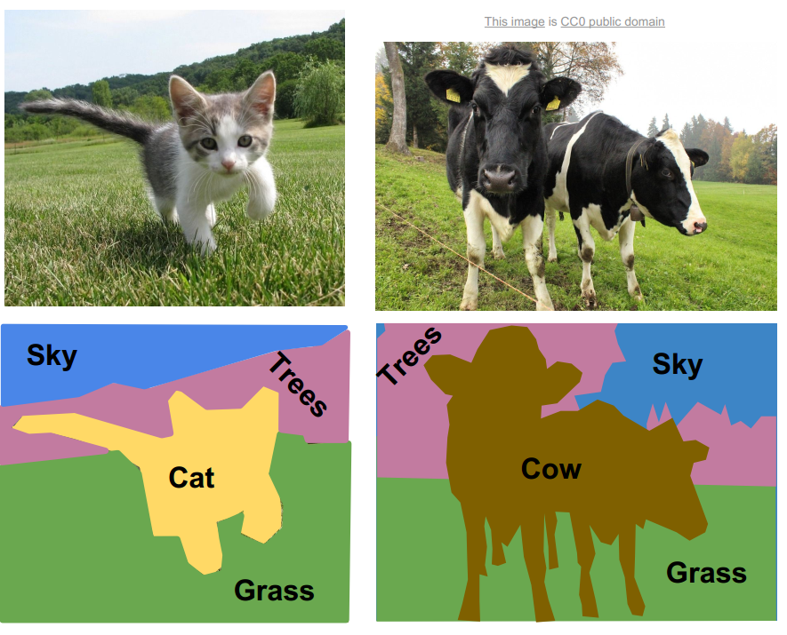
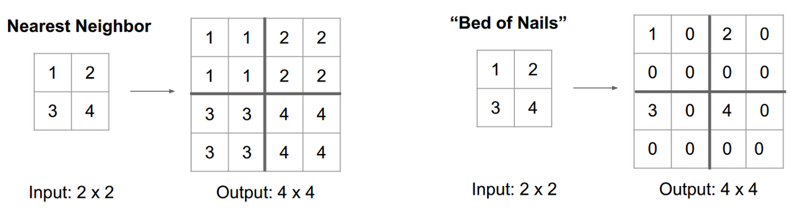
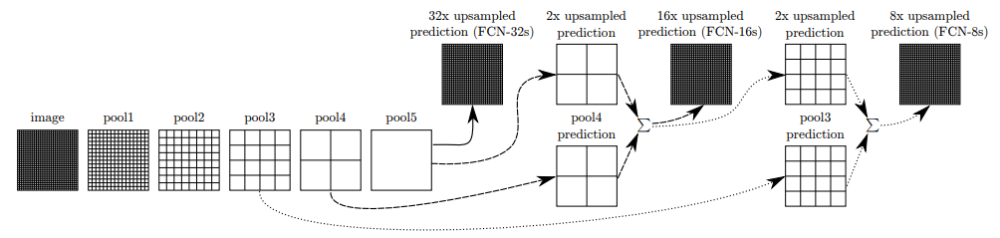

---
## Semantic Segmentation
### What is Semantic Segmentation?
Semantic Segmentation은 이미지의 모든 픽셀별로 클래스를 분류하는 task 이다. 말 그대로 pixel wise classification이라서 같은 클래스에 속하더라도 객체를 구분해주지는 않는다.

출처 - CS231n 

---

## Ideas used for Semantic Segmentation

### Sliding Window

이미지를 수 많은 작은 단위(crop)으로 나눠서 각자의 영역에 image classification을 진행하는 방법. 이 경우에 computation cost가 굉장히 많이 들고, crop 되는 영역이 겹칠 경우에는 인접한 feature에 대한 공통의 계산을 해야하기 때문에 비효율적이다.

출처 - CS231n 

### Fully Convolutional Network(FCN)

FC layer가 없는 convolution layer만 구성된 네트워크를 사용하는 방법이다. 이미지가 flatten되는 과정에서 공간정보를 잃게되는데, conv layer만 사용할 경우 공간정보를 유지할 수 있다.

출처 - Fully Convolutional Networks for Semantic Segmentation 

Downsampling 된 이미지 상태에서는 segmentation을 진행 할 수는 없기 때문에 이미지를 다시 키우는 upsampling을 진행한다. Upsampling 방법에는 여러가지가 있지만 대표적으로 deconvolution(transpose convolution) 연산을 이용한다.(수학에서 말하는 deconvolution과는 다른 연산. CNN에서 이야기하는 convolution 연산도 정확하게는 cross corelation 연산이기 때문에 용어 사용에 주의를 할 필요가 있다.) 

출처 - CS231n 

#### Upsampling

##### Unpooling : Nearest Neighbor, Bed of Nails

Fixed algorithm을 이용하는 방식. Receptive field를 복사하거나 빈자리에 0을 채워 넣는 방식이다.

Unpooling - 출처 - CS231n 

##### Deconvolution(Transpose Convolution)

Unpooling의 경우 고정된 함수로 진행하는 연산이기 때문에 학습과정을 거치지 않는다. 반면에 deconvolution의 경우 upsampling하는 과정을 학습한다. Deconvolution은 아주 간단하게 생각한다면 convolution 연산을 반대로 한다고 생각하면 된다. 과정을 간단하게 설명하자면, input feature map에서 좌상단 부터 차례대로 scalar 값을 하나씩 뽑고 filter와 곱해서 그 출력을 output region 복사한다. Overlapping 되는 영역을 sum을 해준다. (아래 그림을 참고)

Transposed Convolution - 출처 - Dive into Deep Learning 

Spatial size를 키워주기 위해서 학습가능한 filter를 사용한다고 보면 된다.

Transposed Convolution - 출처 - https://github.com/vdumoulin/conv_arithmetic 

​	

Deconvolution 하는 과정에서 작은 이미지를 과도하게 늘리는 과정에서 feature에 대한 정보가 유실되는 경우가 많다. 이를 해결하기 위해서 FCN에서는 skip architecture를 사용한다.

#### Skip Architecture in FCN(Fully Convolutional Networks for Semantic Segmentation)

FCN에서 이용한 skip architecture를 간단하게 설명하자면, convolution(encoding path)에서 나온 feature map을 deconvolution(decoding path)에서 나온 결과와 더해주는 것 이다. FCN 논문에서는 low layer information과 high layer information을 combine한다는 표현을 쓴다.

Skip Architecture - 출처 - Fully Convolutional Networks for Semantic Segmentation 

FCN - 32, 16, 8 - 출처 - Fully Convolutional Networks for Semantic Segmentation 

---

## Summary

이런 FCN 개념을 이용한 semantic segmentation은 결국은 convolution network를 통한 downsampling/upsampling을 진행해서 pixel에 대한 cross-entropy를 계산하여 네트워크를 end-to-end로 학습 가능하다.

Semantic Segmentation은 기본적인 segmentation task이며, 더 많은 요소까지 고려한 다양한 segmentation task들이 존재한다.

---

## Further Studying

1. Instance Segmentation
2. Panoptic Segmentation
3. Depth estimation

 

## 참고

---

1. [CS231n](https://www.youtube.com/watch?v=vT1JzLTH4G4&list=PLC1qU-LWwrF64f4QKQT-Vg5Wr4qEE1Zxk)
2. [https://github.com/vdumoulin/conv_arithmetic](https://github.com/vdumoulin/conv_arithmetic)
3. [Fully Convolutional Networks for Semantic Segmentation](https://arxiv.org/abs/1411.4038)
4. [Dive into Deep Learning](https://d2l.ai/)
