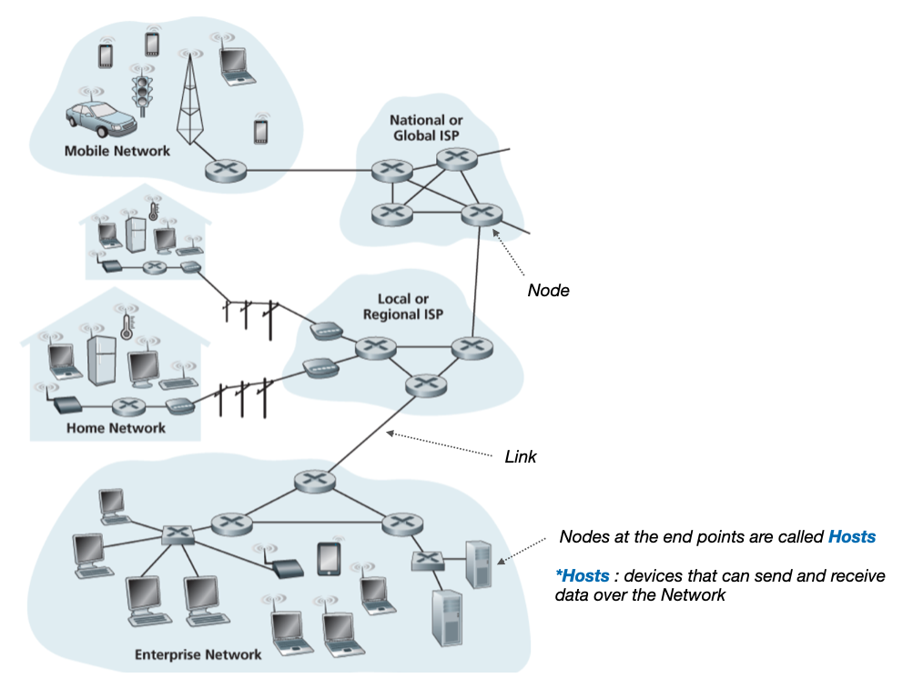
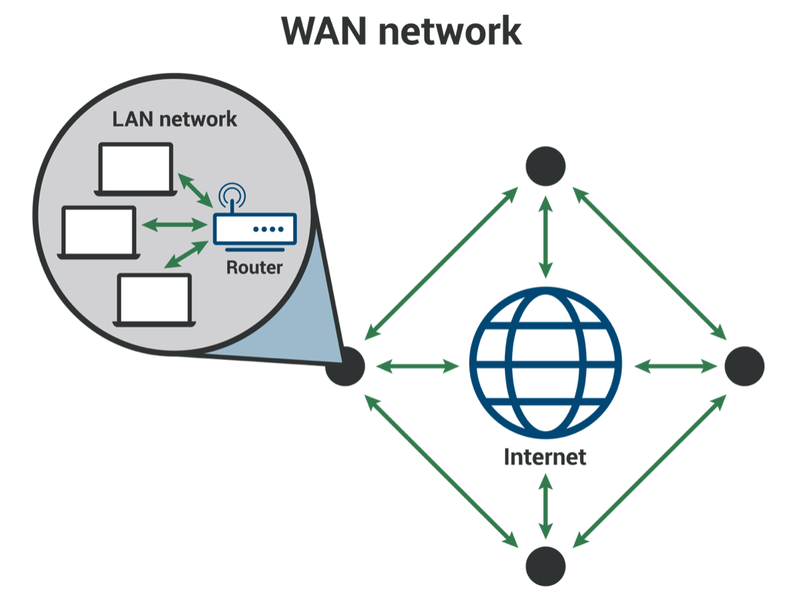
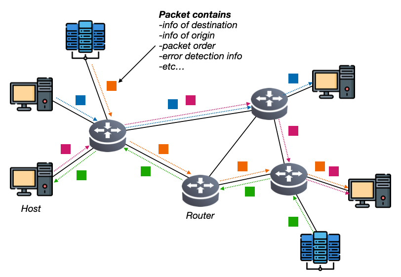
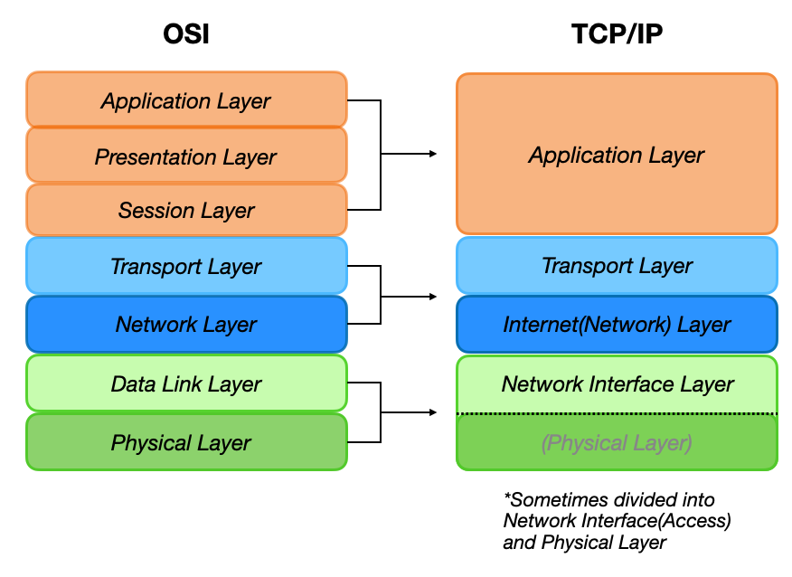
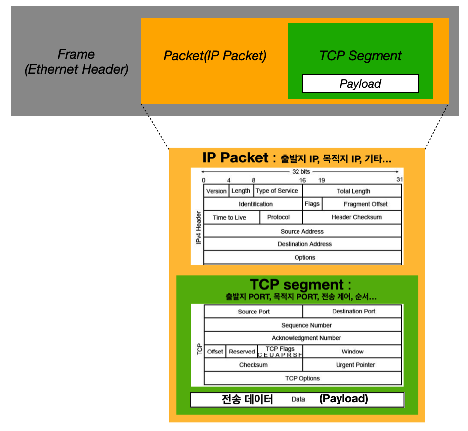
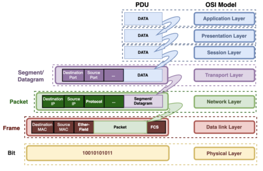

---

## 1. 네트워크의 기본 구조

네트워크는 **두 대 이상의 컴퓨터 시스템이나 장치들이 데이터 통신을 위해 물리적 혹은 논리적으로 연결된 구조**를 의미한다. 이를 통해 장치들은 데이터를 공유하고, 리소스를 공동으로 사용할 수 있게 된다. 네트워크는 다양한 종류와 범위를 가지며, 그 예로는 개인용 네트워크부터 대규모 인터넷 네트워크까지 있다. 

오늘날의 네트워크는 인터넷, 기업 내부망, 클라우드 서비스 등 다양한 분야에서 필수적인 인프라로 자리잡고 있다. 이를 통해 사용자들은 언제 어디서나 필요한 정보와 자원에 접근할 수 있으며, 효율적인 커뮤니케이션과 업무 처리가 가능하다.

 

> 가장 대표적인 네트워크의 예시는 **인터넷(internet)!**
{: .prompt-info }

 

네트워크의 기본적인 구조를 살펴보자.

 

_네트워크 하향식 접근: 네트워크의 구조_

* **노드(Node)**
  * 정보를 주고 받는 장치
* **링크(Link)**
  * 노드끼리 정보를 주고받을 수 있는 유무선의 통신 매체
* **호스트(Host)**
  * **네트워크의 가장자리(end point)에 위치한 노드**
  * 네트워크를 통해 흐르는 정보를 최초로 생성 및 송신하고 최종적으로 수신한다
  * 일반인들이 일상에서 사용하는 대부분의 네트워크 기기들은 여기에 속한다
* **서버(Server)**
  * 어떤 서비스를 제공하는 컴퓨터 또는 프로그램
  * 데이터, 파일, 애플리케이션, 자원 등을 클라이언트에게 제공한다
* **클라이언트(Client)**
  * 서버로부터 서비스를 요청하고 사용하는 컴퓨터 또는 프로그램
  * 클라이언트는 서버에 요청을 보내고, 서버는 요청을 처리해서 응답을 반환한다
* **네트워크 장비(중간 노드)**
  * 호스트가 아닌 중간에 위치하는 노드들. 정보가 거쳐가는 노드들이다.
  * 네트워크 장비들은 보통 **호스트끼리 주고 받는 정보가 안전하고 안정적으로 수신지까지 전송될 수 있도록 도와준다**
  * 대표적으로 **이더넷 허브, 스위치, 라우터, 공유기** 등이 있다
  

 

> **서버(Server)-클라이언트(Client)는 이분법적인 개념이 아니다.**
>
> 네트워크 구조와 관계는 다양하게 구현될 수 있다.
>
> 예) 서버는 또 다른 서버의 클라이언트가 될 수 있다.
{: .prompt-info }

 

---

## 2. 범위에 따른 네트워크 분류

네트워크는 지리적 범위와 규모에 따라 여러 가지로 분류된다. 이러한 분류는 네트워크의 목적, 사용 환경, 기술적 요구사항 등을 기반으로 이루어진다. 

 

_https://www.cloudflare.com/ko-kr/learning/network-layer/what-is-a-wan/_

* **LAN (Local Area Network)**
  - **범위:** 제한된 지역, 일반적으로 단일 건물이나 캠퍼스 내
  - **특징:** 고속 데이터 전송, 저지연, 높은 보안성
  - **사용 사례:** 가정, 학교, 사무실 내의 네트워크
  - **이유:** 소규모 지역 내에서 장치들을 효과적으로 연결하여 자원 공유와 데이터 전송을 용이하게 하기 위해

* **WAN (Wide Area Network)**
  - **범위:** 광범위한 지역, 도시 간, 국가 간, 대륙 간
  - **특징:** 낮은 데이터 전송 속도, 높은 지연 시간, 다양한 기술 사용(예: 위성, 광섬유)
  - **사용 사례:** 인터넷, 글로벌 기업 네트워크
  - **이유:** 지리적으로 넓은 지역에 걸쳐 있는 장치들을 연결하여 정보를 교환하고, 다양한 장소에서 자원에 접근할 수 있도록 하기 위해
    - 예) 다른 LAN에 속한 호스트와 메세지를 주고 받기 위해서 WAN이 필요
  - 우리가 인터넷을 사용하기 위해서 접속하는 WAN은 보통 ISP(인터넷 서비스 공급자)가 구축하고 관리한다

 

> 더 세분화해서 분류하기도 한다.
>
> * MAN (Metropolitan Area Network)
> * PAN (Personal Area Network)
> * CAN (Campus Area Network)
> * SAN (Storage Area Network)
{: .prompt-info }

 

---

## 3. 패킷 교환 방식(Packet Switching)

**패킷 교환(Packet Switching)**은 네트워크 통신 방식 중 하나로, **데이터를 작은 패킷으로 나누어 전송하는 방식**이다. 이 방식은 효율적이고 유연한 데이터 전송을 가능하게 한다. 우리가 사용하는 인터넷은 대부분 패킷 교환 방식을 이용한다.

 

_패킷 교환 방식_

패킷이 전송되는 과정을 단계적으로 설명하면 다음과 같다.(대략적인 설명이다)

일단 웹 브라우저의 특정 사이트에서 이미지를 다운로드한다고 가정해보자.

* **데이터 준비**
  * 서버에서 데이터(이미지)를 생성한다
  * 해당 **데이터는 전송하기 적합한 크기로 나뉜다. 이 과정을 세그멘테이션(segmentation)**이라고 한다.
* **패킷(packet) 생성**
  * 각 세그먼트에 헤더가 추가된다
  * 헤더에는 목적지 주소, 출발지 주소, 패킷의 순서에 대한 번호, 오류 검출 정보 등이 포함된다
  * 헤더가 추가된 세그먼트는 이제 패킷이다
* **프레임화**
  * 패킷에 네트워크 인터페이스 계층의 정보(프레임 헤더)를 추가한다. 이 과정은 데이터 링크 계층에서 이루어진다. (패킷을 프레임안에 넣는다고 생각하면 편하다)
  * 프레임 헤더에는 출발지와 목적지의 MAC 주소가 포함된다
* **전송을 시작한다**
* **라우터 처리**
  * 라우터가 프레임을 수신한다
  * 라우터는 프레임의 헤더를 제거하고 패킷을 추출한다
  * 라우터는 패킷 헤더의 목적지 IP를 확인하고 최적의 경로를 계산한다
  * 라우터는 패킷에 새로운 프레임 헤더를 추가하고 다음 라우터(또는 목적 장치)로 전달한다
    * 새로운 프레임 헤더에는 패킷이 다음 장치로 올바르게 전달되도록 필요한 정보를 포함한다
* **패킷은 중간 네트워크의 다양한 라우터를 거치며 전송된다**
  * 패킷은 독립적으로 최적의 경로를 통해 전송되기 때문에, 각 패킷은 다른 경로를 통해 전달될 수 있다
* **목적지 도착**
  * 최종 목적지의 네트워크 인터페이스가 패킷을 수신한다
  * 네트워크 인터페이스에서 프레임 헤더를 제거하고 패킷을 추출한다
* **데이터 재조립**
  * 전송 계층(TCP/UDP)은 패킷의 순서 번호를 확인해서 순서대로 조립한다
  * 패킷의 오류 검출 정보를 확인해서 데이터의 무결성을 검사한다. 만약 패킷에 오류가 있을 경우 재전송을 요청한다.
  * 정렬된 패킷을 원래의 데이터로 재조립한다
* **애플리케이션 계층**
  * 재조립된 데이터는 애플리케이션 계층에서 원래의 데이터 형태로 복원된다
  * 최종 처리를 한다
    * 예) 사용자에게 결과를 보여줌

 

> **패킷(Packet)은 다음으로 구성되어 있다.**
>
> * 페이로드(Payload) : 패킷을 통해 전송하고자하는 데이터(원본 데이터가 분할된 형태로 들어간다)
> * 헤더(Header) : 각 네트워크 계층에서 필요한 정보를 담고 있다
>   * 예) 출발지/목적지 주소, 오류 검출 정보, 패킷 순서 정보
> * 트레일러(Trailer) : 일부 프로토콜에서 패킷의 끝에 위치해서 에러 체크 정보를 포함하는 경우가 있다
{: .prompt-info }

 

> 패킷 교환은 이후 포스트에서 네트워크의 요소들을 한번씩 살펴보고나서 다시 자세히 설명할 예정이다.
>
> 모르는 용어들은 **"대충 이런게 있구나~"**라고 생각하고 넘어가자. 이후 포스트에서 자세히 다룰 예정이다.
>
> 지금은 대략적인 패킷 교환의 동작을 살펴본 것으로 만족하자.
{: .prompt-warning }

 

> **회선 교환 방식(Circuit Switching)**
>
> 회선 교환 방식은 통신이 시작될 때 통신 경로(회선, circuit)를 설정하고, 통신이 끝날 때까지 해당 경로를 독점적으로 사용하는 통신 방식이다. 모든 회선에서 끊임없이 정보를 주고 받고 있지 않는 이상 효율이 떨어지는 방식이다. 
>
> 회선 교환 방식의 대표적인 예시가 전통적인 전화망.
{: .prompt-info }

 

---

## 4. 송수신 방식

네트워크에서 데이터 송수신 유형에는 여러 가지가 있으며, 각 유형은 데이터가 어떻게 전달되고 수신되는지에 대한 방식과 범위를 정의한다. 

 

* **유니캐스트(Unicast)**
  * 하나의 수신지에 메세지를 전송하는 방식
  * 송신자와 수진자가 일대일로 메세지를 주고받는 경우
* **브로드캐스트(Broadcast)**
  * 자신을 제외한 네트워크상의 모든 호스트에게 전송하는 방식
  * 브로드캐스트의 수진지는 **브로드캐스트 도메인(broadcast domain: 자기 자신을 제외한 네트워크상의 모든 호스트)**

 

> 이외에도 멀티캐스트(Multicast), 애니캐스트(Anycast)등의 다양한 방식들이 존재한다.
{: .prompt-info }

 

---

## 5. 네트워크 계층 모델(OSI, TCP/IP)

우리가 택배를 보낼 때 물건을 택배 상자에 포장, 전달, 그리고 목적지에 도착하면 다시 포장을 제거해서 물건을 확인하는 여러가지 단계를 거치게된다. 네트워크도 마찬가지로, 정보를 주고 받을 때 정보는 네트워크의 여러 계층을 거치면서 다양한 작용이 일어난다. 

**네트워크 계층 모델(Network Layer Model)은 이러한 계층적 네트워크 통신을 설명하는 모델로, 각 계층이 특정 기능을 담당하여 데이터를 송수신하는 구조를 체계화한 것**이다. 대표적인 네트워크 계층 모델로는 **OSI(Open Systems Interconnection) 7 계층** 모델과 **TCP/IP** 모델이 있다. 이들 모델을 통해 네트워크 통신을 구조화하여 복잡한 네트워크 시스템을 이해하고 관리할 수 있다.

 

---

### OSI(Open Systems Interconnection)

OSI 모델은 국제 표준화 기구(ISO; International Organization for Standardization)에서 만든 네트워크 계층 모델로, 통신을 7개의 계층으로 나눈다. (그래서 OSI-7 Layer라고 부르기도 한다)

각 계층을 최하위 부터 최상위 계층까지 나열하면 다음과 같다.

 

1. **물리 계층 (Physical Layer)**
   * **역할:** 데이터 전송의 물리적 매체를 다룬다. **1과 0으로 표현되는 물리적인 비트 신호를 주고 받는 계층**이다.
   * **기능:** 비트 단위(1과 0 표현되는)의 데이터 전송, 물리적 연결 설정 및 유지
   * **예:** 케이블, 스위치, 네트워크 인터페이스 카드(NIC)

2. **데이터 링크 계층 (Data Link Layer)**
   * **역할:** 물리 계층을 통해 비트가 전송될 때 발생할 수 있는 오류를 탐지하고 수정한다. 쉽게 말해서 **네트워크 내 장치 간에 정보를 올바르게 주고받기 위한 계층**이다.
   * **기능:** 프레임 생성, MAC 주소를 통한 통신(송수신지 특정), 오류 검출 및 수정
   * **예:** 이더넷, 스위치

3. **네트워크 계층 (Network Layer)**
   * **역할:** **데이터 패킷을 발신지에서 수신지까지 전송한다. 네트워크간 통신이 이루어지는 계층**이다. IP 주소를 통해 통신하고자 하는 수신지와 네트워크를 식별하고, 원하는 수신지에 도달하기 위한 최적의 경로를 결정한다.
   * **기능:** 경로 선택, 논리적 주소(IP 주소) 할당, 패킷 전달
   * **예:** IP, 라우터

4. **전송 계층 (Transport Layer)**
   * **역할:** 종단 간 데이터 전송을 다룬다. 패킷이 정상적으로 보내졌는지, 유실된 정보를 없는지, 패킷의 순서가 뒤바뀌었는지 확인하는 계층이다. **패킷의 흐름이나 전송 오류를 점검해서 신뢰성있고 안정적인 전송이 이루어지도록 한다.** 포트(Port)를 이용해 응용 프로그램의 식별이 이루어지기도 한다.
   * **기능:** 데이터 분할 및 재조립, 흐름 제어, 오류 복구
   * **예:** TCP, UDP

5. **세션 계층 (Session Layer)**
   * **역할:** 통신 세션을 설정하고 유지하며 종료한다. **세션이라는 것은 보통 정보를 주고 받는 호스트 사이의 응용 프로그램 간 연결 상태를 의미한다. 세션 계층은 이런 세션(연결 상태)을 생성, 유지, 종료되었을 때 끊어 주는 역할을 담당**한다. 
   * **기능:** 세션 설정, 유지, 종료, 동기화
   * **예:** NetBIOS, PPTP

6. **표현 계층 (Presentation Layer)**
   * **역할:** 데이터 표현 형식을 다룬다. **사람이 이해할 수 있는 문자를 컴퓨터가 이해할 수 있는 코드로 변환하거나, 압축, 암호화 같은 작업**이 표현 계층에서 이루어진다.
   * **기능:** 데이터 인코딩, 압축, 암호화
   * **예:** JPEG, MPEG, SSL/TLS

7. **응용 계층 (Application Layer)**
   * **역할:** 최종 사용자가 네트워크 서비스를 이용할 수 있게 한다. OSI의 최상단 계층. 사용자가 이용하는 응용 프로그램에 네트워크를 제공하는 계층.
   * **기능:** 네트워크 서비스 제공, 응용 프로그램과 네트워크 간 인터페이스
   * **예:** HTTP, FTP, SMTP

 

---

### TCP/IP

OSI가 네트워크를 이론적으로 기술하고 이해할 때 사용하는 모델이라면, **TCP/IP는 실용적 구현에 중점을 둔 네트워크 모델이다.**

TCP/IP는 4계층으로 이루어졌고, 각 계층을 최하위 부터 최상위 계층까지 나열하면 다음과 같다.

 

1. **네트워크 인터페이스(액세스) 계층 (Network Interface Layer)**

   - **역할:** ~~물리적 네트워크 매체~~와 인터페이스(데이터 링크). **OSI의 물리 계층의 역할보다는 데이터 링크 계층의 역할을 수행**한다. 그래서 많은 서적이나 자료에서는 OSI 계층에 대응하기 위해서 TCP/IP에 물리 계층을 따로 추가해서 5계층으로 만들어서 표현하기도 한다.

   - **기능:** 데이터 링크 계층 및 물리 계층의 기능 포함

   - **예:** 이더넷, 와이파이

2. **인터넷 계층 (Internet Layer)**

   - **역할:** **패킷을 발신지에서 수신지까지 전달. OSI의 네트워크 계층(Network Layer)과 유사하다.**

   - **기능:** 경로 설정, IP 주소 할당, 패킷 전달

   - **예:** IP, ICMP

3. **전송 계층 (Transport Layer)**

   - **역할:** **종단 간 데이터 전송을 관리. OSI의 전송 계층(Transport Layer)과 유사하다.**

   - **기능:** 데이터 전송 신뢰성, 흐름 제어, 오류 복구

   - **예:** TCP, UDP

4. **응용 계층 (Application Layer)**

   - **역할:** **사용자와 네트워크 간의 상호작용을 관리. OSI의 세션, 표현, 응용 계층을 합친것과 비슷하다.**

   - **기능:** 네트워크 서비스 제공, 응용 프로그램과 네트워크 간 인터페이스

   - **예:** HTTP, FTP, SMTP

 

_OSI vs TCP/IP_

 

> OSI와 TCP/IP는 엄밀히 말해서 직접적인 비교가 힘들다. 위의 비교도 참고 사항일 뿐이지, OSI 계층을 칼로 자르듯이 잘라서 TCP/IP를 만들어내는 개념이 아니다.
>
> OSI나 TCP/IP는 참조를 하기 위한 모델일 뿐이지, 어떤 절대적인 규칙이 아니다. 네트워크를 작동 시키는 주체는 네트워크 프로토콜(protocol)과 네트워크 장비이다. **네트워크 모델은 이러한 프로토콜과 장비가 어떻게 상호작용해야 하는지를 구조적으로 이해하기 위한 이론적 틀을 제공할 뿐**이다.
{: .prompt-warning }

 

---

## 6. 캡슐화/역캡슐화 (Encapsulation/Decapsulation)

네트워크에서 캡슐화(Encapsulation)와 역캡슐화(Decapsulation)는 데이터가 네트워크를 통해 송신/수신될 때 발생하는 과정으로, 데이터를 여러 계층의 프로토콜로 포장하고 다시 푸는 작업을 의미한다.

많은 경우 택배의 배송 과정으로 비유해서 표현한다. 예시로 우리는 택배를 보낼때 물건을 택배 박스에 포장해서 보내고, 받는 사람은 택배 박스(포장)을 제거하고 물건을 꺼내서 받는다. 패킷도 마찬가지로 네트워크의 여러 계층을 거치면서 캡슐화와 역캡슐화가 일어나는 것이다.

 

> * 송신자(보내는 호스트) 입장에서는 패킷은 가장 높은 계층(애플리케이션 계층)에서 가장 낮은 계층(물리, 데이터 링크 계층)으로 이동해서 보내진다
> * 수신자(받는 호스트) 입장에서는 패킷은 가장 낮은 계층에서 가장 높은 계층으로 이동해서 데이터를 받는다
{: .prompt-info }

 

_https://www.computernetworkingnotes.com/ccna-study-guide/data-encapsulation-and-de-encapsulation-explained.html_

* **캡슐화(Encapsulation)** : 데이터가 송신 측에서 전송될 때, 각 계층의 프로토콜에 따라 포장하는 과정
  * **응용 계층(Application Layer)**
    * 응용 프로그램에서 데이터를 생성한다. 예시) 웹 브라우저가 HTTP 요청 생성
    * 데이터의 형식을 변환, 압축, 암호화한다
    * 세션을 설정, 관리, 종료한다
  * **전송 계층(Transport Layer)**
    * **데이터를 세그먼트로(segment) 캡슐화**한다
    * TCP 또는 UDP 프로토콜이 사용된다
    * TCP를 사용한다면 TCP 세그먼트 헤더를 추가한다고 보면 된다
  * **인터넷 계층(Internet; Network Layer)**
    * IP 프로토콜을 사용한다
    * **세그먼트를 패킷으로으로 캡슐화**한다. (IP 패킷을 생성한다)
    * **이 패킷을 IP 패킷이라고 부른다** (TCP/IP 패킷이라는 표현을 사용하기도 한다)
    * IP와 관련된 정보가 들어가는 IP 헤더가 추가된다. (IP 헤더가 패킷 헤더이다)
  * **네트워크 인터페이스 계층(Network Interface : Data Link + Physical Layer)**
    * **패킷을 프레임(Frame)으로 캡슐화**한다
    * 이더넷, Wifi, 등 다양한 물리적 네트워크 장치와 프로토콜을 사용한다
    * 프레임 헤더가 추가되는데, 프레임 헤더에는 다음과 같은 정보가 들어가있다
      * 이더넷(Ethernet) 프레임 헤더라고 가정하자
      * 목적지/출발지 MAC 주소
      * 이더타입(EtherType) : 상위 계층 프로토콜 식별

 

**역캡슐화(Decapsulation)는 위의 캡슐화의 역과정을 진행하면서 헤더를 하나씩 제거하고, 정보를 확인**한다. 데이터를 복원하는 과정으로 보면된다.

 

_https://seungki1011.github.io/posts/http-1-internet-communication/_

 

> **PDU(Protocol Data Unit)**
>
> 각 계층에서 송수신되는 정보의 단위를 PDU라고 부른다. 상위 계층에서 전달 받은 데이터에 현재 계층의 프로토콜 헤더를 추가하면 현재 계층의 PDU가 된다.
>
> _https://techwavehub.net/protocol-data-unit-pdu/_
>
> * 패킷은 네트워크에서 쪼개져서 전송되는 데이터 단위를 통칭하기 위한 용어로 사용되기도 하지만, 네트워크 계층의 송수신 단위를 지칭하기도 한다. 많은 자료들은 **혼동을 방지하기 위해서 네트워크 계층에서 사용하는 패킷을 IP 패킷으로 지칭**하기도 한다.
{: .prompt-info }

 

---

## Reference

1. [강민철: 혼자 공부하는 네트워크](https://www.google.co.kr/books/edition/%ED%98%BC%EC%9E%90_%EA%B3%B5%EB%B6%80%ED%95%98%EB%8A%94_%EB%84%A4%ED%8A%B8%EC%9B%8C%ED%81%AC/XWABEQAAQBAJ?hl=ko&gbpv=0)
1. [James F. Kurose : 컴퓨터 네트워킹 하향식 접근](https://www.google.co.kr/books/edition/%EC%BB%B4%ED%93%A8%ED%84%B0_%EB%84%A4%ED%8A%B8%EC%9B%8C%ED%82%B9_%ED%95%98%ED%96%A5%EC%8B%9D_%EC%A0%91%EA%B7%BC/CItKswEACAAJ?hl=ko)
1. [널널한 개발자 : 네트워크 기초 이론](https://www.youtube.com/watch?v=Bz-K-DPfioE&list=PLXvgR_grOs1BFH-TuqFsfHqbh-gpMbFoy&index=14)
1. [https://www.geeksforgeeks.org/tcp-ip-model/](https://www.geeksforgeeks.org/tcp-ip-model/)
1. [https://www.computernetworkingnotes.com/ccna-study-guide/data-encapsulation-and-de-encapsulation-explained.html](https://www.computernetworkingnotes.com/ccna-study-guide/data-encapsulation-and-de-encapsulation-explained.html)
1. [https://seungki1011.github.io/posts/http-1-internet-communication/](https://seungki1011.github.io/posts/http-1-internet-communication/)
1. [https://techwavehub.net/protocol-data-unit-pdu/](https://techwavehub.net/protocol-data-unit-pdu/)

---

## Icon Attribution

1. <a href="https://www.flaticon.com/kr/free-icons/" title="컴퓨터 아이콘">Computer icons created by Freepik - Flaticon</a>
2. <a href="https://www.flaticon.com/free-icons/data-center" title="data center icons">Data center icons created by monkik - Flaticon</a>
3. [it-symbols-collection](https://iconduck.com/sets/it-symbols-collection)
