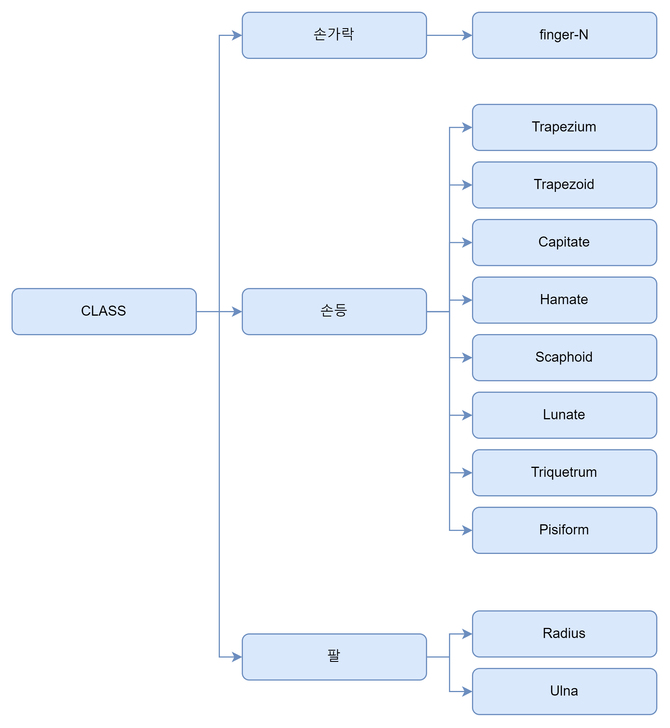

---

> **주관 단체**
>
> `Naver Boostcamp AITech 5기 CV 트랙`내에서 진행된 AI 모델 경진대회입니다.
{: .prompt-info }

---

## 📋 프로젝트 개요

> **프로젝트 링크**
>
> * **프로젝트 깃헙(레포지토리 내용은 동일합니다)**
>   * [개인 레포지토리](https://github.com/seungki1011/AI-Tech5-Semantic-Segmentation-Competetion)
>   * [팀 레포지토리](https://github.com/boostcampaitech5/level2_cv_semanticsegmentation-cv-03)
> * [팀 리포트](https://github.com/seungki1011/AI-Tech5-Semantic-Segmentation-Competetion/blob/master/Semantic%20Segmentation%20Wrap%20Up.pdf)
{: .prompt-info }

 

_bone segmentation_

뼈는 우리 몸의 구조와 기능에 중요한 영향을 미치기 때문에, 정확한 뼈 분할은 의료 진단 및 치료 계획을 개발하는 데 필수적입니다. Bone segmentation은 인공지능 분야에서 중요한 응용 분야 중 하나입니다. 특히, 딥러닝 기술을 이용한 bone segmentation은 많은 연구가 이루어지고 있으며, 다양한 목적으로 도움을 줄 수 있습니다. 

이번 프로젝트의 목표는 **손 뼈의 X-ray 이미지의 모든 픽셀에 대해서 29개의 클래스로 분류하는 모델을 개발**하는 것입니다.

최종 평가는 `mean dice coefficient`으로 진행되었습니다.

 

---

## 📆 프로젝트 일정

프로젝트 세부 일정

- **2023.06.05 ~ 2023.06.09** : Semantic Semgmentation에 대해 알아보기
- **2023.06.08 ~ 2023.06.08** : Baseline Model 실험
- **2023.06.08 ~ 2023.06.09** : EDA
- **2023.06.09 ~ 2023.06.11** : Augmentation 실험
- **2023.06.12 ~ 2023.06.14** : Loss, Optimizer, Image size 실험
- **2023.06.14 ~ 2023.06.14** : MMSegmentation 구현
- **2023.06.14 ~ 2023.06.22** : Model, Image size, Offline Augmentation 실험
- **2023.06.21 ~ 2023.06.22** : Ensemble

 

---

## 🚀 프로젝트 진행

> **팀에서 공통으로 진행한 역할**
>
> * EDA
> * Online Augmentation
> * 모델 실험
{: .prompt-info }

> **내가 맡은 역할**
>
> * Offline Augmentation 구현
>   * Mosaic, Rotation등의 변형을 통해 데이터를 늘리는 파이썬 코드 구현
> * TTA
{: .prompt-info }

 

### EDA

#### 데이터셋 파악

가장 먼저 데이터셋 부터 파악했습니다.

_클래스 파악_

* **손가락**: `finger-1` ~ `finger-19`
* **손등**: 총 8개의 클래스
* **팔**: 총 2개의 클래스

 

받은 데이터셋은 **트레이닝 셋(training set) 800장과 테스트 셋(test set) 300장**으로, 총 1100장의 이미지로 이루어졌습니다. 한 사람의 **왼손과 오른손 X-Ray 이미지가 쌍으로 존재**합니다(한 사람당 2장의 이미지). 모든 **이미지의 크기는 `2048x2048x3`**으로 이루어졌습니다.

해당 이미지 **데이터셋에 대한 메타정보(나이/성별/무게/신장)와 GT(Ground Truth)도 함께 제공**되었습니다.

 

> 데이터셋은 비공개 요청을 받았기 때문에, 기재하지 못하는 것을 양해바랍니다.
{: .prompt-warning }

 

---

#### 메타 데이터 분석

제공된 데이터셋에 대한 메타 데이터를 분석했습니다.

 

_height, weight_

* 남성의 키와 체중이 여성에 비해 높은 경향을 보였습니다

 

_age, 클래스별 분포_

* 나이의 분포는 두 성별이 대체로 비슷하나, `>=25 and <29`를 제외하고는 여성이 약간 더 많았습니다
* 각 클래스에 대해서 남성이 약간 더 많은 영역을 가지는 것을 파악했습니다

 

---

#### 데이터셋 분석

다음의 세 가지 방법으로 분석했습니다.

* 전체 데이터셋의 기존 원본 이미지 자체를 살펴봐서 엣지 케이스를 기록했습니다
* 이미지에 대한 GT(Ground Truth)를 표시하는 파이썬 코드를 구현해서, 각 클래스별 GT를 육안으로 파악했습니다
* 각 클래스별 평균 면적을 그래프로 시각화해서 파악했습니다

 

그래프로 시각화 해서 파악한 내용은 다음과 같습니다.

_각 크래스 평균 면적_

* `finger-16`, `trapezoid`, `pisiform`이 평균적으로 가장 낮은 면적을 가지고 있다

 

원본 이미지와 GT를 육안으로 확인해서 파악한 내용은 다음과 같습니다.

* 같은 사람이라도 팔 부분의 차이 때문에 왼손 오른손의 면적이 다를 수 있다
* 같은 좌표들을 가지는 폴리곤(polygon) 내에서도 두 가지 이상의 클래스가 겹칠(overlap) 수 있다
* 몇몇 이미지에서 손이 회전된 상태로 X-Ray를 찍은 것을 확인
* 엣지 케이스(outlier) 파악
  * 반지를 착용
  * 네일 아트
  * 손목 임플란트 도구
  * 휘어진 손가락
  * 밝기가 다른 이미지

 

---

#### 추론(Inference) 분석

베이스라인 모델이 어떤식으로 예측하는지 분석하기로 했습니다.

 

> **추론 분석 준비**
>
> 추론 분석을 하기 전에 기본적인 베이스라인 모델을 파악하기 위해서 다음의 기본적인 실험과 작업을 진행했습니다.
>
> * **학습셋, 검증셋 나누기**: Training set과 Validation set을 나누기 위해서 메타정보를 사용해서 최대한 성별 비율이 비슷하게 분포하도록 나누었습니다
> * **Seed 실험**: 몇 가지 시드를 가지고 실험해서 그 중 하나를 골라서 사용했습니다
> * **기본 모델 실험**: `PyTorch`에서 제공하는 기본 FCN, Deeplab 등의 backbone으로 이용하는 모델을 가지고 베이스라인을 정했습니다
>   * 이미지의 크기가 너무 커서, 실험 시간을 줄이기 위해 `512x512` 또는 `1024x1024`로 줄여서 실험을 진행했습니다
> * Augmentation, Loss, Optimizer는 디폴트 값을 사용하고 추후에 변경하여 실험하기로 했습니다
{: .prompt-info }

 

Validation set에 대한 추론을 진행하고 다음의 내용을 파악했습니다.

 

_validation 분석_

 

역시나 **영역이 작았던 `finger-16`, `Trapezoid`, `Pisiform` 에 대한 `dice` 스코어가 낮은 것을 파악**했습니다.

 

**추론을 통해 얻은 예측값을 GT와 비교할 수 있는 파이썬 코드를 구현**해서 확인해봤습니다. 이를 통해서 다음과 같은 내용을 파악했습니다.

 

_GT와 예측 비교_

* RED (라벨오류) : 21%
* YELLOW(과소예측): 45%
* GREEN(과대예측) : 33%

이미지에 대해 RED, YELLOW, GREEN으로 표시된 영역을 확인했더니 **뼈의 경계 부분에 대한 예측에서 많은 예측 실패**가 일어나는 것을 확인할 수 있었습니다.

 

---

### 가설 설정

EDA를 통해서 파악한 문제들을 정리하고, 각 문제에 대한 가설을 설정했습니다.

* 면적이 작은 클래스에 대해 예측을 잘 하지 못한다
  * → `512x512`, `1024x1024`로 줄이는 과정에서 생기는 문제라고 생각했습니다
  * → 이전 Object Detection 대회에서도 Multi-scale Training을 통해 성능의 향상을 얻었기 때문에, 기존 보다 **사이즈를 늘려서 실험**하기로 했습니다
* 뼈의 경계, 특히 `finger-n` 클래스에 대한 경계를 잘 예측하지 못한다
  * → **경계가 뚜렷해지도록 Emboss, Sharpen 등의 augmentation을 적용**하기로 했습니다
  * → 학습 이미지와 mask를 **줄이는 과정에서 생기는 정보 손실 때문에 발생했을 가능성**도 있다고 생각했습니다
* 반지와 같은 outlier들이 존재하고, 해당 outlier에 대한 예측을 잘 못한다
  * 다음의 2 가지 측면으로 나눠서 실험하기로 했습니다
    * → 기본적으로 반지와 같은 **액세서리는 착용하지 않고 X-ray를 찍을 것으로 예상**해서, **오히려 outlier들은 학습에 방해**가 될 수 있다는 예상
    * → 오히려 outlier들의 데이터를 더 늘려서 학습시켜야 한다는 예상

 

---

### 실험

#### Online Augmentation

* Gray-scale의 이미지이기 때문에 밝기 관련 augmentation 이 잘 동작할 것으로 예상되어, RandomBrightness Contrast를 사용했습니다
* 경계를 잘 잡는 것이 중요하다고 생각되어 경계의 강조가 효과적일 것으로 예상되는 Emboss, Sharpen, CLAHE 등의 augmentation을 사용했습니다
* 왼손/오른손 한 쌍으로 이미지가 존재하기에 HorizontalFlip의 성능이 좋을 것으로 예상되어 사용했습니다

 

_Online Augmentation 실험_

 

---

#### Offline Augmentation

*  **모자이크(mosaic)**: [Bone segmentation on whole-body CT using convolutional neural network with novel data augmentation techniques](https://www.sciencedirect.com/science/article/abs/pii/S0010482520301402)에서 **[RICAP](https://arxiv.org/abs/1811.09030)이라는 방식으로 성능을 올린것을 확인**했습니다. RICAP 기법은 이미지에서 임의의 사각형 패치를 잘라내어 다른 이미지의 패치와 결합하여 새로운 이미지를 만드는 방식입니다. **모자이크 방식이 RICAP기법과 유사하다고 판단**되어, 모자이크를 이용한 offline augmentation을 적용해보기로 했습니다.
* **회전(rotation)**: **손이 회전 상태에 놓인 이미지들도 존재**하기 때문에, **회전에 놓여있지 않은 이미지를 회전** 시켜서 데이터를 늘리는 offline augmentation을 적용해보기로 했습니다.

 

_RICAP vs mosaic_

 

_Offline Augmentation 실험_

 

---

#### 모델 실험

다음의 세 라이브러리를 사용해 실험을 진행했습니다.

* **torchvisions.models**
* **MMSegmentation**
* **SMP(Segmentation models with pretrained backbones)**

 

**torchvisions.models**에서는 FCN, Deeplabv3, Unet등의 각 backbone을 ResNet18, ResNet50, ResNet101 등으로 바꾸며 다양한 모델을 사용한 결과를 비교했습니다.

 

_torchvision 실험_

 

**MMSegmentation**에서는 이미지 사이즈를 늘려보면서, Torchvision에 구현되어 있지 않은 SegFormer 모델을 사용하는 방향으로 라이브러리를 사용했습니다.

**SMP**에서는 encoder 부분에 다양한 모델로 pre-trained가 되어 있는 모델을 사용하고자 했고, 의료 segmentation 분야에서 좋은 성능을 보이는 Unet과 Unet++가 구현되어 있어 해당 모델들을 EfficientNet-b5의 encoder 부분이 pre-trained 되어 있는 버전으로 사용했습니다.

 

---

## 📊 프로젝트 결과

_등수_

* Public 16등
* Private 16등

 

---

## 🧑‍💻 후기

### 잘했다고 생각한 점

* EDA부터 실험 결과 분석까지의 과정을 체계적으로 수행했던것 같다
* 팀원 전원이 커뮤니케이션에 적극적으로 참여했다

 

### 아쉬웠던 점

* 이전 경험을 토대로 섣불리 transformer 계열의 모델들이 무조건 성능이 좋을 것이라고 판단했던 것이 아쉬웠습니다. 물론, transformer 계열의 모델들이 보편적으로 높은 성능을 보여주긴 하지만, 의료에 특화된 U-net 계열의 모델들도 적극적으로 실험을 하지 못했던 점이 아쉬웠습니다.

* 여러가지 라이브러리들을 사용해서 실험을 진행하다보니, 같은 모델에 대해서 중복되는 실험들이 발생했습니다. 실험 계획을 더 잘 세워서 진행했으면 더 좋았을 것으로 생각됩니다.

 

### 배운 점

* 모델의 성능을 함부로 속단하지 않는 것이 좋다는 것을 깨달았습니다. 트랜스포머 계열이 아닌 전통적인 CNN 계열의 모델들도 특정 상황에서는 충분히 좋은 성늘을 보일 수 있다는 것을 확인했습니다.
* 의료 분야는 도메인 지식이 너무 중요하다는 것을 깨달았습니다. 아무리 AI 모델의 성능이 뛰어나도, 해당 도메인 지식을 가진 사람만이 판단할 수 있는 영역들이 많이 존재합니다.

 

---

## 🤔 후기(2024-08-06 업데이트)

