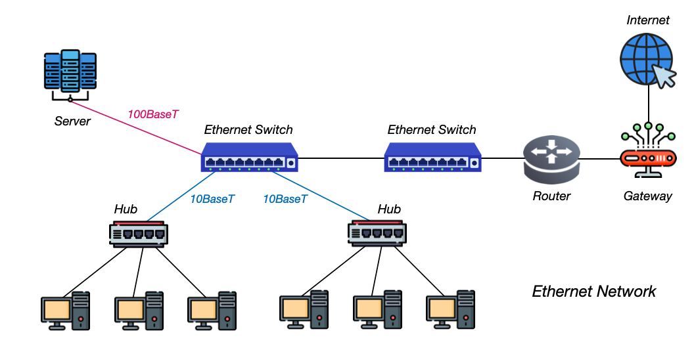
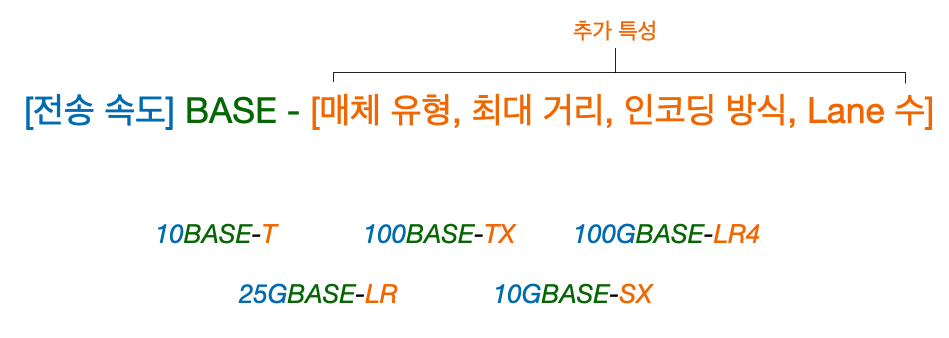
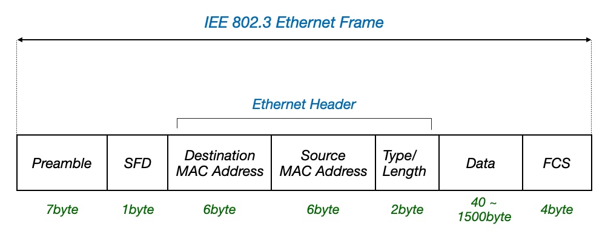
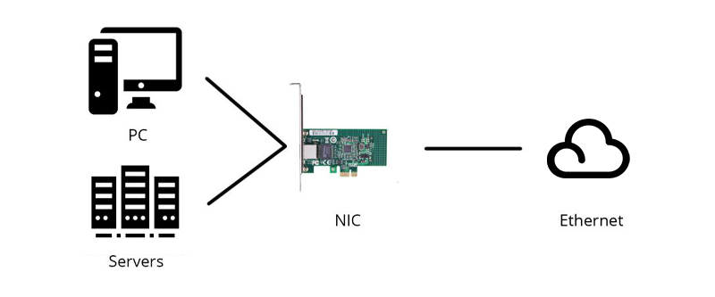
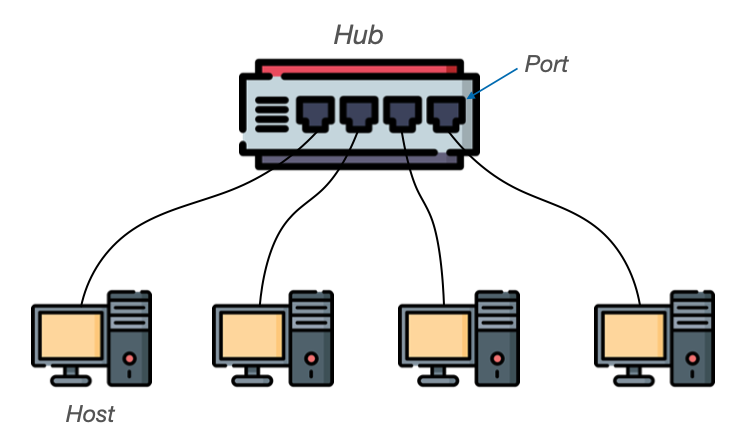
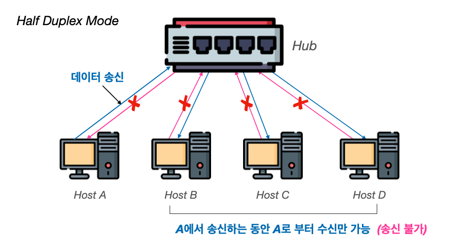
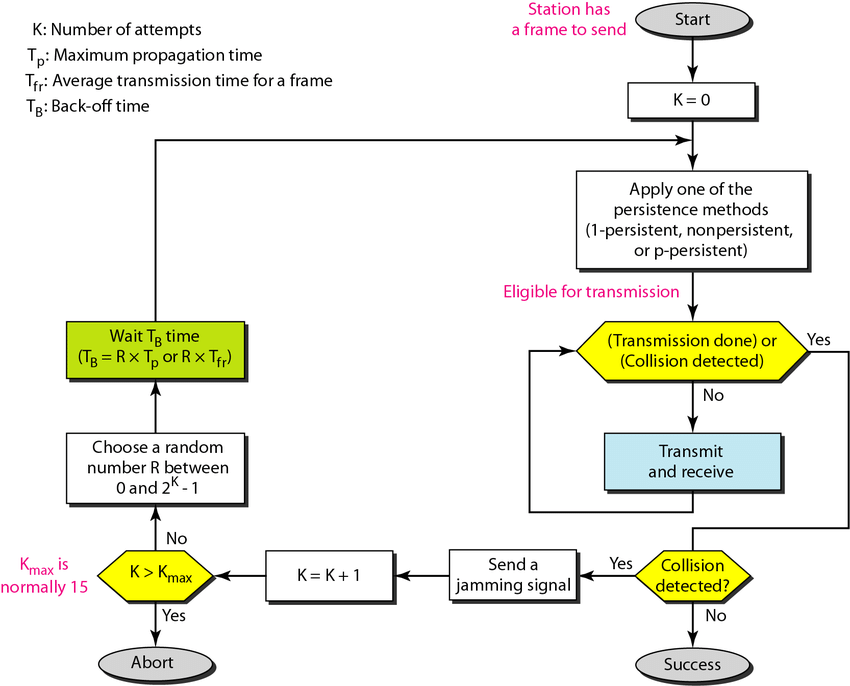

---

들어가기에 앞서 **물리 계층(Physical Layer)**과 **데이터 링크 계층(Data Link Layer)**에 대해 다시 한번 살펴보자.

* **물리 계층 (Physical Layer)**
  * **역할:** 데이터 전송의 물리적 매체를 다룬다. **1과 0으로 표현되는 물리적인 비트 신호를 주고 받는 계층**이다.
  * **기능:** 비트 단위(1과 0 표현되는)의 데이터 전송, 물리적 연결 설정 및 유지
  * **예:** 케이블, 허브, 네트워크 인터페이스 카드(NIC)
  * 주소의 개념이 없다
  * 물리 계층의 네트워크 장비는 송수신 정보에 대한 어떠한 변경이나 판단을 하지 않는다
* **데이터 링크 계층 (Data Link Layer)**
  * **역할:** 물리 계층을 통해 비트가 전송될 때 발생할 수 있는 오류를 탐지하고 수정한다. 쉽게 말해서 **네트워크 내 장치 간에 정보를 올바르게 주고받기 위한 계층**이다.
  * **기능:** 프레임 생성, MAC 주소를 통한 통신(송수신지 특정), 오류 검출 및 수정
  * **예:** 이더넷, 스위치
  * 주소의 개념이 존재한다
  * 데이터 링크 계층의 네트워크 장비들은 송수신지를 특정할 수 있고, 주소를 바탕으로 송수신되는 정보에 대한 조작과 판단이 가능하다

 

TCP/IP에서는 이 두 계층을 묶어서 네트워크 인터페이스 계층(Network Interface; Access Layer)이라고 한다.

 

---

## 1. 이더넷(Ethernet)

### 이더넷이란

**이더넷(Ethernet)은 네트워크의 물리 계층과 데이터 링크 계층에서 주로 사용되는 기술로, 유선 네트워크(특히 LAN 환경)에서 데이터 전송을 위한 표준을 제공**한다. 이더넷은 프레임을 통해 데이터를 전송하며, 네트워크 장치 간의 신호 전송 방식을 정의한다.

예를 들어보겠다. 두 대의 컴퓨터가 있다고 가정해보자. 이 컴퓨터끼리 정보를 주고받기 위해서는 데이터를 물리적으로 전송하기 위한 케이블(통신 매체)이 있어야 한다. 케이블을 통해 정보를 송수신하기 위한 프로토콜도 정해져있어야 한다.

**이더넷은 이런 통신 매체의 규격, 프레임의 형태, 프레임을 주고 받는 프로토콜을 정의한 네트워크 기술에 대한 표준**을 제공한다.

 

_https://www.javatpoint.com/what-is-ethernet : remade by seungki1011_

 

---

### 이더넷 표준

**이더넷 표준은 네트워크에서 데이터를 어떻게 전송할지에 대한 규칙과 지침을 정의한 것으로, 다양한 네트워크 장치 간의 상호 운용성을 보장한다**. IEEE(Institute of Electrical and Electronics Engineers)에서 개발한 **IEEE 802.3 시리즈 표준이 대표적**이며, 이 표준은 이더넷의 물리 계층과 데이터 링크 계층에서의 동작을 정의한다.

쉽게 말해서 허브, 스위치, NIC, 케이블, 등의 물리 계층과 데이터 링크 계층의 네트워크 장비들은 특정 이더넷 표준을 이해하고 따른다고 보면 된다.

 

> 이더넷 표준화 그룹 : [https://www.ieee802.org/3/](https://www.ieee802.org/3/)
{: .prompt-info }

 

---

### 통신 매체 명명 규칙(Ethernet Nomenclature)

이더넷은 유선 네트워크(LAN 환경)에서 데이터를 전송하기 위한 표준을 제공하기 때문에, 통신 매체는 보통 케이블이다.

이더넷 표준에 의한 통신 매체의 표기 형태는 다음과 같다.

 

_통신 매체의 표기_

* **전송 속도(Transmission Rate)**
  * 숫자만 표기 : Mbps
  * 숫자뒤에 G 표기 : Gbps
  * 예시
    * `100BASE-T` : 100Mbps
    * `100GBASE-T` : 100Gbps
* **BASE**
  * 전송 방식이 베이스밴드(Baseband)라는 의미
  * LAN 환경에서는 대부분 베이스밴드를 사용한다
  * BROAD로 표기하는 브로드밴드도 있지만 크게 신경쓰지 않아도 좋다
* **추가 특성**
  * **전송 매체 유형(Media Type)**
    * C(동축 케이블)
    * T(트위스티스 페어 케이블)
    * S(단파장 광섬유 케이블)
    * L(장파장 광섬유 케이블)
    * ETC
  * **전송 가능 최대 거리(Maximum Distance)**
    * LR(Long Reach) : 장거리 전송, 싱글모드 광섬유 최대 10km
    * ER(Extended Reach) : 확장된 거리 정송, 싱글모드 광섬유 최대 40km
    * ZR(Ultra-Long Reach) : 초장거리 전송, 싱글모드 광섬유 최대 80km
    * ETC
  * **물리 계층의 인코딩 방식**
    * 물리 계층의 인코딩 방식을 나타내기도 한다
    * 예) `100BASE-TX`에서 `X`는 4B/5B 인코딩 방식을 의미
  * **전송로(Lane)의 수**
    * 비트 신호를 옮길 수 있는 전송로의 수를 나타내기도 한다
    * 예) `100GBASE-LR4`에서 `4`는 전송로의 수

 

> 추가 특성을 나타내는 방식이 제각각 제멋대로 처럼 느껴질 수 있다. 이는 각 표준이 저의될 당시의 기술적 한계와 요구사항, 다양한 사용 시나리오가 계속 변해왔기 때문이다.
>
> 이더넷은 지금도 발전하고 있다. 규격별로 지원하는 속도도 점차 빨라지고 있다. 지금도 새로운 이더넷 표준들이 만들어지고 있다. **통신 매체의 표기 형식에 너무 매몰될 필요 없다. 개발자의 입장에서는 대략적으로 파악하기만 해도 괜찮다.**
{: .prompt-tip }

 

---

### 이더넷 프레임(Ethernet Frame)

**이더넷 프레임(Ethernet frame)은 이더넷 네트워크에서 데이터를 전달하는 기본 단위**이다. 이더넷 프레임은 **상위 계층으로 부터 받아들인 데이터에 헤더와 트레일러를 추가하는 캡슐화 과정**을 통해 만들어진다. 수신의 입장에서는 프레임의 헤더와 프레일러를 제거하고 상위 계층으로 보내는 역캡슐화 과정을 거친다. **프레임은 다양한 필드로 구성되며, 각 필드는 특정한 목적을 가지고 있다.**

 

_Ethernet Frame_

* **프리앰블(Preamble)**
  * **길이**: 7바이트 (56비트)
  * 네트워크 디바이스가 수신을 준비하도록 신호를 보내는 역할
  * 7바이트 동안 `10101010` 패턴이 반복된다
  * 수신 장치는 해당 패턴을 감지하고 동기화한다
* **SFD(Start Frame Delimiter)**
  * **길이**: 1바이트 (8비트)
  * 프리앰블의 끝에 위치하며, 프레임의 시작을 알린다
  * `10101011` 패턴을 가진다
  * 수신 장치는 이 패턴을 감지하고 프레임이 시작됨을 인식한다
* **목적지 MAC 주소(Desitination MAC Address)**
  * **길이:** 6바이트 (48비트)
  * 프레임이 전달될 목적지의 MAC 주소를 나타낸다
* **출발지 MAC 주소(Source MAC Address)**
  * **길이:** 6바이트 (48비트)
  * 프레임을 보낸 출발지 디바이스의 MAC 주소를 나타낸다
* **타입/길이(Type/Length)**
  * **길이:** 2바이트 (16비트)
  * 전송되는 데이터의 프로토콜 타입(IPv4, IPv6) 또는 데이터 필드의 길이를 나타낸다
  * **1500이하면 데이터 필드의 길이, 1536 이상의 값이면 상위 계층 프로토콜 타입을 나타낸다**
  * `0x0800` : IPv4
  * `0x86DD` : IPv6
  * `0x0806` : ARP
* **데이터(Data)**
  * **길이:** 46~1500바이트
  * 상위 계층에서 전달받거나 상위 계층으로 전달할 내용. 보통 네트워크 계층의 데이터와 헤더를 합친것이 포함된다.
  * 실제 전송되는 페이로드(Payload)를 포함한다
  * 반드시 46바이트 이상이어야 한다. 만약 46바이트 이하면 크기를 맞추기 위해서 패딩(`0`)이 채워진다.
* **FCS(Frame Check Sequence)**
  * **길이:** 4바이트 (32비트)
  * 오류 검출을 위해서 사용한다
  * 송신 장치는 프레임의 모든 필드를 사용해서 CRC(Cyclic Redundancy Check)를 계산하고, 해당 결과를 FCS에 추가한다
  * 수신 장치는 프레임을 수신해서 동일한 방식으로 CRC를 계산하여 FCS와 비교해서 데이터의 무결성을 체크한다
  * 만약 비교값이 일치하지 않으면 오류가 있다고 판단하고 해당 프레임을 폐기한다

 

> **MAC 주소**
>
> **네트워크 인터페이스마다 부여되는 6바이트(48비트) 길이의 주소. MAC을 통해서 LAN 내의 수신지와 송신지를 특정할 수 있다**. MAC은 보통은 고유하고 변경되지 않는 주소로 인터페이스에 부여된다. **NIC(Network Interface Controller)라는 장치가 네트워크 인터페이스 역할을 한다. 하나의 컴퓨터에 NIC가 여러개 있다면 여러개의 MAC 주소도 가능**하다.
>
> **MAC은 반드시 고유하고 변경되지 않는 것은 아니다**. 그러나 동일 네트워크 내에서 동작하는 기기의 MAC 주소가 같은 확률은 낮다.
{: .prompt-info }

 

---

## 2. 물리 계층(Physical Layer)

### NIC(Network Interface Controller)

**네트워크 인터페이스 카드(Network Interface Card, NIC)는 컴퓨터와 네트워크 간의 연결을 가능하게 하는 하드웨어 장치다**. NIC는 네트워크 상의 다른 컴퓨터 및 장치들과 데이터를 주고받을 수 있도록 도와주며, 컴퓨터가 네트워크에 접속할 수 있도록 하는 중요한 역할을 한다. NIC는 이더넷 카드, 네트워크 어댑터 또는 랜 카드(LAN Card)라고도 불린다.

NIC는 기본적으로 호스트(컴퓨터)와 통신 매체(케이블)을 연결하고 MAC 주소가 부여된다.

 

_https://community.fs.com/article/nic-card-guide-for-beginners-functions-types-and-selection-tips.html_

 

NIC의 주요 구성 요소를 살펴보자.

* **컨트롤러(Controller)**
  - NIC의 핵심 부품으로, 데이터 처리를 담당한다
  - 데이터의 송수신, 오류 검출 및 수정, 데이터 패킷의 분해 및 재조립 등을 수행한다

* **메모리(Memory)**
  - NIC는 데이터를 임시로 저장하기 위한 메모리를 포함한다
  - 송수신 버퍼와 같이 데이터가 네트워크로 전송되거나 컴퓨터로 전달되기 전에 저장되는 공간을 제공한다

* **MAC 주소(MAC Address)**
  - NIC는 고유의 MAC 주소를 가지고 있다
  - 이 주소는 네트워크 상에서 장치를 식별하는 데 사용된다
  - MAC 주소는 제조 과정에서 할당되며, 48비트로 구성된다

* **트랜시버(Transceiver)**
  - 트랜시버는 전기 신호와 디지털 데이터 간의 변환을 담당한다
  - 트랜시버는 데이터를 전송할 때 디지털 데이터를 전기 신호로 변환하고, 데이터를 수신할 때 전기 신호를 디지털 데이터로 변환한다

* **인터페이스 포트(Interface Port)**
  - NIC는 네트워크 케이블을 연결하기 위한 포트를 제공한다
  - 이더넷 카드의 경우 RJ-45 포트를 사용한다

* **드라이버(Driver)**
  - 드라이버는 운영 체제와 NIC 간의 통신을 가능하게 하는 소프트웨어이다
  - 드라이버는 NIC의 하드웨어 기능을 제어하고, 네트워크 통신을 관리한다

 

---

### 허브(Hub)

#### 허브 소개

**허브는 네트워크의 기본적인 연결 장치로, 데이터를 단순히 전달하고 모든 포트로 방송한다**. 보통 작은 네트워크에서 사용될 수 있다. 그러나 오늘날은 허브가 가지는 한계 때문에 현대 네트워크에서는 스위치(Switch)와 라우터(Router)와 같은 더 고급 장치들로 대체되는 추세이다.

 

_Hub_

 

이제부터 허브의 동작을 살펴보고, 허브의 단점인 충돌(collision)과 단점을 해결하기 위한 프로토콜인 CSMA/CD에 대해 알아보자.

 

---

#### 반이중 모드(Half Duplex)

**물리 계층에서는 주소의 개념이 없기 때문에 허브는 수신지를 특정할 수 없다.** 이 말은 **허브는 신호를 전달받으면 데이터를 송신지를 제외한 모든 포트에서 내보내기만 한다**. 허브를 통해 해당 신호를 전달받은 호스트는 데이터 링크 계층에서 패킷의 MAC 주소를 확인하고 자신과 관련이 없는 주소는 폐기한다.

 

> 허브는 **패시브 허브(Passive Hub) vs 액티브 허브(Active Hub)**로 나눌 수 있다
>
> * **패시브 허브**
>   * 데이터를 단순히 전송만 하며, 신호를 증폭하거나 재생하지 않는다
> * **액티브 허브**
>   * **리피터(repeater)**라는 장치가 내장되어 수신한 신호를 증폭하거나 재생하여 더 먼 거리로 데이터를 전송할 수 있다
>   * **허브는 대부분 리피터가 내장된 액티브 허브**이다
    {: .prompt-info }

 

**허브는 기본적으로 반이중 모드(Half Duplex Mode)로 동작한다. 반이중 모드는 데이터가 한 번에 한 방향으로만 전송될 수 있는 모드**이다. 예를 들어 A 장치가 B 장치로 데이터를 보내는 동안에는 B 장치가 데이터를 보낼 수 없다.

 

_반이중 모드(Half Duplex Mode)_

 

이런 반이중 모드의 단점은 한 호스트가 허브에 송신하는 동안 다른 호스트는 송신을 하고 싶어도 대기를 해야한다. 더 큰 **문제는 호스트가 동시에 허브에 송신하는 경우이다. 이 경우 신호가 충돌이 난다고 해서 충돌(Collision)이 발생**했다고 한다.

**콜리전이 발생할 수 있는 영역을 콜리전 도메인(Collision Domain)**이라고 한다. 위의 그림에서는 하나의 허브에 연결된 모든 호스트가 같은 콜리전 도메인 안에 속한다고 보면 된다. 이런 **콜리전 도메인이 크면 클수록 콜리전 발생 가능성이 높아진다**. (콜리전 도메인이 크다는 것은 그만큼 하나의 허브에 여러개의 호스트가 연결되었다는 뜻이다.)

이런 문제는 해결하기 위한 **해결법 중 하나는 CSMA/CD 프로토콜을 사용**하는 것이다.

 

> **전이중 모드(Full Duplex Mode)**
>
> **데이터가 동시에 양방향으로 전송될 수 있는 모드**이다. 예를 들어, A 장치가 B 장치로 데이터를 보내면서 동시에 B 장치로부터 데이터를 받을 수 있다.
>
> 전이중 모드는 충돌이 발생하지 않으므로, 반이중 모드 보다 네트워크 효율성이 좋다. 허브는 전이중 모드를 지원하지 않는다.
{: .prompt-info }

 

---

#### CSMA/CD

**CSMA/CD(Carrier Sense Multiple Access with Collision Detection)는 이더넷 네트워크에서 데이터 충돌을 방지하고 처리하기 위해 사용되는 프로토콜**이다. 이 프로토콜은 네트워크 장치가 데이터를 전송할 때 발생할 수 있는 충돌을 탐지하고 해결하는 방법을 정의한다.

* **CS(Carrier Sense)**
  * 데이터를 보내기 전에 현재 네트워크상에서 전송 중인 것이 있는지 확인을 먼저 한다. 쉽게 말해서 **현재 통신 매체의 사용 가능 여부를 확인**한다.
  * 한국어로 캐리어 감지를 뜻한다
* **MA(Multiple Access)**
  * 캐리어 감지를 해도 2개 이상의 호스트가 동시에 네트워크를 사용하려고 시도할 수 있다. **여러대의 호스트가 동시에 네트워크에 접근하는 상황을 다중 접근(Multiple Access)**이라고 한다.
  * 이렇게 **동시에 접근하는 경우 충돌(Collision)이 발생**한다
* **CD(Collision Detection)**
  * **충돌이 발생하면 검출한다**
  * 충돌을 감지하는 경우 **전송이 중단**된다
  * **충돌을 감지한 호스트는 다른 호스트들에게 충돌이 발생했음을 알리는 잼 신호(Jam Signal)을 보낸다**
* **백오프 알고리즘(Backoff Algorithm)**
  * **충돌 감지 이후 호스트는 임의의 시간을 대기하고 재전송을 시도**하는데, 이 **임의의 대기시간을 결정하는 것이 백오프 알고리즘**이다

 

_https://www.researchgate.net/figure/Flow-diagram-for-the-CSMA-CD_fig3_323511648_

 

---

## 3. 데이터 링크 계층(Data Link Layer)

### 스위치(Switch)

---

## Reference

1. [강민철: 혼자 공부하는 네트워크](https://product.kyobobook.co.kr/detail/S000212911507)
2. [James F. Kurose : 컴퓨터 네트워킹 하향식 접근](https://product.kyobobook.co.kr/detail/S000061694627)
3. [널널한 개발자 : 네트워크 기초 이론](https://www.youtube.com/watch?v=Bz-K-DPfioE&list=PLXvgR_grOs1BFH-TuqFsfHqbh-gpMbFoy&index=14)

## Icon Attribution

1. <a href="https://www.flaticon.com/kr/free-icons/-" title="네트워크 스위치 아이콘">Network Switch icon created by Yasashii std - Flaticon</a>
2. <a href="https://www.flaticon.com/free-icons/hub" title="hub icons">Hub icons created by Freepik - Flaticon</a>
3. <a href="https://www.flaticon.com/kr/free-icons/ui" title="ui 아이콘">Ui icon created by juicy_fish - Flaticon</a>
4. <a href="https://www.flaticon.com/kr/free-icons/" title="게이트웨이 아이콘">Gateway icon created by Freepik - Flaticon</a>
