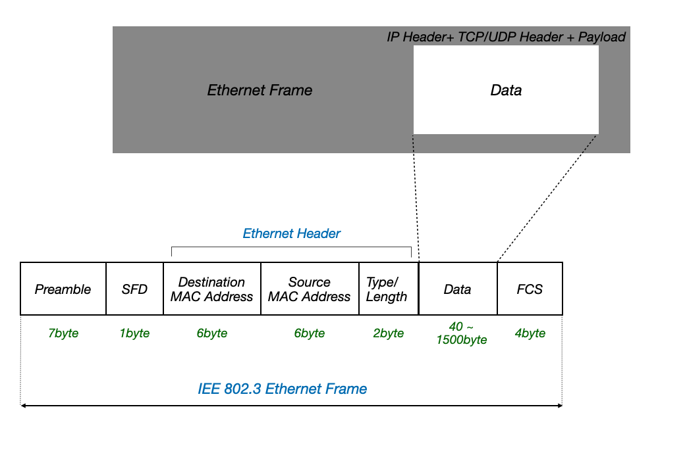
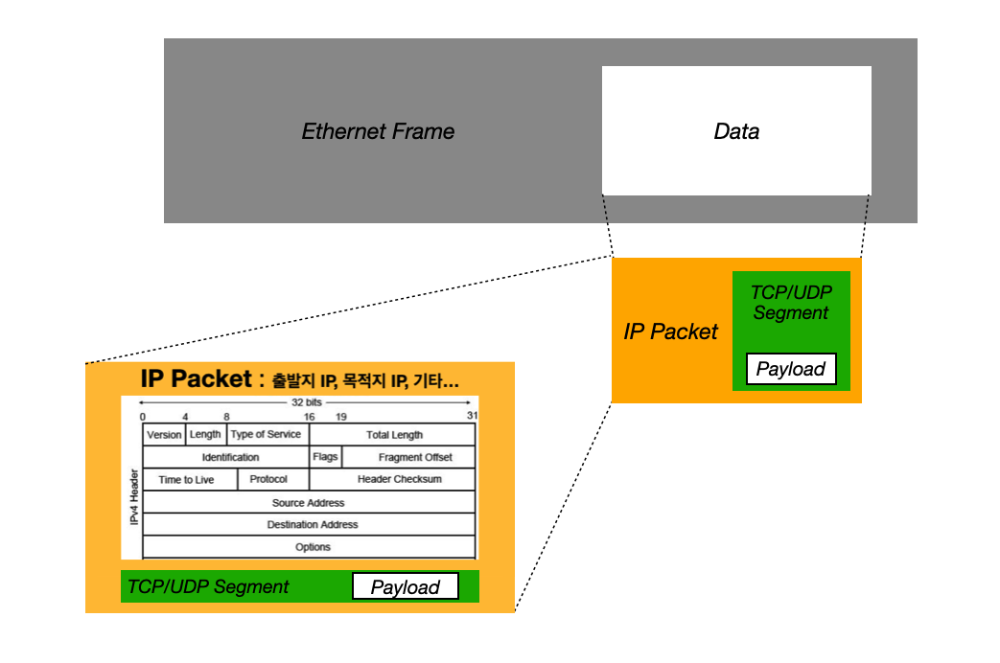
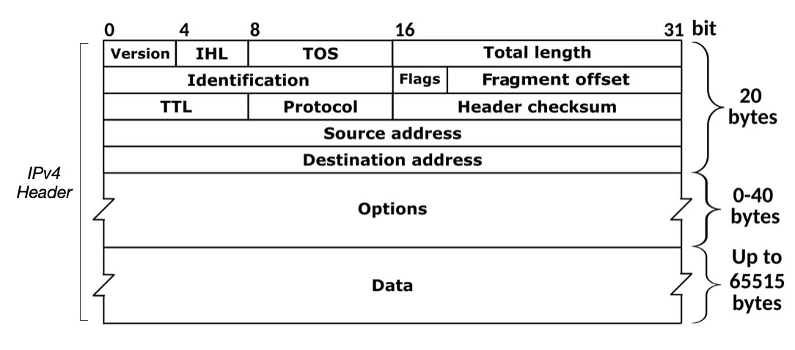

---

## 1. 데이터 링크 계층(Data Link Layer)의 한계

물리 계층과 데이터 링크 계층을 통해 LAN을 넘어선 네트워크로 통신하는 것은 어렵다. **데이터 링크 계층 내에서 송수신지를 특정할 수 있는 MAC 주소라는 개념**이 있기 때문에, **해당 정보(MAC 주소)를 바탕으로 LAN을 넘어선 통신을 할 수 있을것 같지만, 결론적으로 불가능**하다.

먼저 **물리 계층의 한계**를 살펴보자.

* **직접 연결을 요구**
  * 물리 계층은 전기적, 광학적 또는 무선 신호를 통해 데이터를 전송한다. **이 계층에서 통신하려면 두 장치가 물리적으로 연결되어 있어야 한다**. 예를 들어, 이더넷 케이블로 연결된 두 컴퓨터 사이의 데이터 전송은 물리 계층에서 처리된다.
* **네트워크 범위 제한**
  * 물리 계층의 **통신 범위는 케이블의 길이나 무선 신호의 범위에 의해 제한**됩니다. 따라서 장거리 통신이 어려우며, **물리적 연결이 없는 장치와는 직접 통신할 수 없다**.
* **신호 변형 및 간섭**
  * 신호가 **전송되는 동안 물리적 매체에서 신호가 변형되어 데이터 무결성에 영향**을 끼칠 수 있다

 

> **네트워크 세그먼트(Segment)**
>
> **물리적 또는 논리적으로 구분된 네트워크의 일부분**을 의미한다. 네트워크 세그먼트는 여러 장치들이 동일한 네트워크 환경 내에서 데이터를 주고받을 수 있도록 구성된 영역을 의미한다.
{: .prompt-info }

 

이번에는 **데이터 링크 계층의 한계**를 살펴보자.

일단 **데이터 링크 계층에서는 네트워크 세그먼트(Segment)내의 통신만 가능**하다. 데이터 링크 계층은 주로 동일한 네트워크 세그먼트 내에서 직접 연결된 장치들 간의 통신을 담당한다. **MAC 주소를 사용하여 세그먼트 내의 장치를 식별**하며, 네트워크 내의 로컬 통신을 처리한다고 보면 된다. 

여기서 **MAC 주소를 사용하여 다른 네트워크의 호스트를 특정하는 것은 불가능**하다. MAC 주소는 NIC에 할당되어 디바이스 식별하기 위한 정보로 사용된다. 택배에 비유하자면 MAC 주소는 받는 사람의 개인 정보 같은 것이다.

그러면 받는 사람의 주소에 해당하는 것은 무엇일까? 그건 바로 **네트워크 계층의 IP(Internet Protocol) 주소**이다

 

> 물리 계층과 데이터 링크 계층만으로 가른 네트워크 까지의 경로를 파악하기 어렵다. 다른 LAN에 속한 호스트와 데이터를 주고 받기 위해서는 수많은 네트워크 장비를 거치며 다양한 경로를 통해 이동할 수 있다.
>
> 이때 패킷의 이동이 가능한 **경로 중에서 최적의 경로를 선택하는 것을 라우팅(Routing)**이라고 한다. 라우팅을 수행하는 장비는 라우터(Router)이다.
{: .prompt-info }

 

정리하자면 다음과 같다.

* 데이터 링크 계층만으로는 서로 다른 네트워크 세그먼트 간의 통신이 어렵다
* 다른 네트워크와의 통신을 위해서는 네트워크 계층이 필요하다
* 네트워크 계층의 IP 주소를 통해 다른 네트워크의 호스트를 식별할 수 있다
* 다른 호스트로 가는 최적의 경로를 결정하는 라우팅을 통해 패킷이 이동한다

 

---

## 2. IP(Internet Protocol) 소개

> [다음 포스트](https://seungki1011.github.io/posts/network-04-ip/)에서 IP에 대해 더 자세히 다룬다.
{: .prompt-tip }

 

인터넷 프로토콜(Internet Protocol, IP)은 네트워크 계층에서 사용되는 주요 프로토콜이다. IP의 역할은 다음과 같다.

* **주소 지정(Addressing)**
  * IP는 각 네트워크 장치에 고유한 **IP 주소를 할당**하여 인터넷이나 로컬 네트워크에서 장치들을 식별하고 통신할 수 있도록 한다
* **패킷 전달**
  * IP 주소를 기반으로 패킷을 최종 목적지로 전달하기 위해 최적의 경로를 결정한다다. 이 과정은 라우팅이라고 불리며, 라우터가 이를 담당한다.
* **프래그멘테이션(Fragmentation,  단편화) 및 재조립**
  * **네트워크의 MTU(Maximum Transmission Unit) 크기보다 큰 패킷을 더 작은 조각들로 나누는 작업을 프래그멘테이션(fragmentation)**이라고 한다
    * 전송하고자 하는 패킷의 크기가 MTU보다 큰 경우, 이를 MTU 크기 이하의 복수의 패킷으로 나눈다
  * **목적지에서 다시 원래의 큰 패킷으로 재조립(reassembly)**한다

 

> **MTU(Maximum Transmission Unit)**
>
> **한번에 전송 가능한 IP 패킷의 최대 크기**. IP 패킷의 헤더도 MTU 크기에 포함된다.
>
> MTU는 일반적으로 1500바이트이다.
{: .prompt-info }

 

IP는 IPv4와 IPv6라는 2 가지 버전으로 나눌 수 있는데, 현재 포스트와 이후의 모든 포스트는 **IPv4를 기준으로 설명**하고 있다.

 

---

## 3. IP 패킷(IP Packet)

### IP 패킷 소개

IP 패킷에 대해 알아보자.

먼저 이전에 다룬 [이더넷 프레임](https://seungki1011.github.io/posts/network-02-physical-layer-data-link/#%EC%9D%B4%EB%8D%94%EB%84%B7-%ED%94%84%EB%A0%88%EC%9E%84ethernet-frame)을 살펴보자.

 

_Ethernet Frame_

 

이더넷 프레임의 데이터(Data) 필드는 상위 계층에서 전달받거나 상위 계층으로 전달할 내용이고, 보통 네트워크 계층의 데이터와 헤더를 합친것이라고 설명한적이 있다. 더 자세히 설명하자면, **IP 패킷으로 이루어져 있고, IP 패킷의 안에는 상위 계층인 전송 계층(Transport Layer)의 TCP/UDP 새그먼트**가 들어있다. TCP/UDP 새그먼트가 페이로드를 캡슐화한 형태이다.

현재 포스트는 네트워크 계층을 다루고 있기 때문에 TCP/UDP 새그먼트는 다루지 않고 IP 패킷의 IP 헤더만 다룰 예정이다.

 

_IP Packet_

 

---

### IP 헤더(IP Header)

IP 헤더는 이루는 필드를 살펴보자.

 

_https://ko.wikipedia.org/wiki/IPv4_

* **식별자(Identification)**
  * 패킷에 할당된 번호
  * **패킷을 식별하기 위한 고유 식별자**
  * 단편화된 패킷을 다시 조립할 때 사용한다
* **플래그(Flags)**
  * **3비트로 이루어진 단편화 관련 제어 비트**
  * 첫 번째 비트 : 사용되지 않는다(항상 `0`)
  * 두 번째 비트 : DF(Don't Fragment) 비트, 설정되면 패킷이 단편화되지 않도록 한다
    * `1` : IP 단편화 수행하지 않는다
    * `0` : IP 단편화 가능
  * 세 번째 비트 : MF(More Fragments) 비트, 설정되면 뒤에 더 많은 단편이 있음을 알린다
* **단편화 오프셋(Fragment Offset)**
  * 단편화된 패킷이 원래 데이터그램(새그먼트)에서 차지하는 위치를 나타낸다
  * 단편화되어 전송되는 패킷들은 수신지에 순서대로 도착하지 않을 수 있음. 수신지가 패킷들을 순서대로 재조립하려면 단편화된 패킷이 초기 데이터에서 몇 번째 데이터에 해당하는 패킷인지 알아야 한다.
  * 8바이트 단위로 계산된다
* **TTL(Time-To-Live)**
  * 패킷의 생존 시간을 나타내며, **최대 홉(Hop) 수를 지정**한다
  * 각 라우터를 지날 때마다 1씩 감소하며, 0이 되면 패킷이 폐기된다
* **프로토콜(Protocol)**
  * 상위 계층 프로토콜을 나타낸다
  * 예를 들어, TCP는 `6`, UDP는 `17`이다
  
* **송신지 IP 주소, 수신지 IP 주소(Source Address, Destination Address)**
  * 송신지 IP 주소(Source Address) : 패킷을 보낸 출발지의 IP 주소
  * 수진지 IP 주소(Destination Address) : 패킷이 도착할 목적지의 IP 주소
  

 

여기까지가 주요 IP 헤더 필드이다. 

다음은 기타 헤더 필드들이다.

* **Version**
  * IP의 버전을 나타낸다
  * IPv4의 경우 값은 `4`

* **Header Checksum**
  * IP 헤더의 오류 검출을 위한 체크섬 값
  * 수신 측에서 계산된 체크섬과 비교하여 데이터 무결성을 확인한다

* **Type of Service(TOS)**
  * 패킷의 우선순위와 QoS(Quality of Service)를 지정한다
  * 반적으로 0으로 설정되지만, 특정 트래픽의 우선순위를 지정할 때 사용된다

* **IHL(Internet Header Length, 인터넷 헤더 길이)**
  * IP 헤더의 길이를 `32`비트(`4`바이트) 단위로 나타낸다

* **Options**
  * `0~40`바이트의 가변 길이
  * 선택적으로 사용되는 필드로, 보안, 라우팅, 시간 스탬프 등을 포함할 수 있다
  *  이 필드는 IHL 필드의 값에 따라 길이가 결정

 

> **홉(Hop)**
>
> 패킷이 호스트 또는 다른 라우터로 한 번 전달되는 것을 홉(Hop)이라고 한다.
{: .prompt-info }

 

> **ARP(Address Resolution Protocol)**
>
> IP 주소는 네트워크 계층에서 디바이스를 식별하고 라우팅하는 데 사용되지만, 실제 데이터 전송은 데이터 링크 계층에서 이루어진다. 데이터 링크 계층에서는 MAC 주소를 사용하여 네트워크 내의 특정 디바이스에 데이터를 전달한다. 따라서, **네트워크 계층의 IP 주소를 데이터 링크 계층의 MAC 주소로 변환하는 과정이 필요**하다.
>
> 쉽게 말해서 상대 호스트의 IP주소는 알고, MAC 주소를 모를 때, IP 주소를 통해 MAC 주소를 알아내야 한다. **ARP는 IP주소를 통해 MAC 주소를 알아내는 프로토콜**이다.
{: .prompt-info }

 

다음 포스트는 IP 주소에 대해 더 자세히 살펴보고, 서브넷팅(Subnetting)을 포함한 여러 개념을 다룰 예정이다.

 

---

## Reference

1. [강민철: 혼자 공부하는 네트워크](https://product.kyobobook.co.kr/detail/S000212911507)
2. [James F. Kurose : 컴퓨터 네트워킹 하향식 접근](https://product.kyobobook.co.kr/detail/S000061694627)
3. [널널한 개발자 : 네트워크 기초 이론](https://www.youtube.com/watch?v=Bz-K-DPfioE&list=PLXvgR_grOs1BFH-TuqFsfHqbh-gpMbFoy&index=14)

