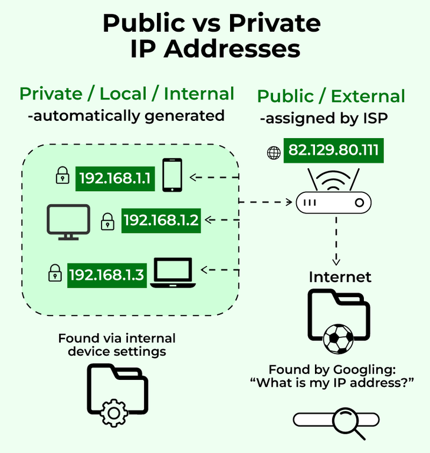
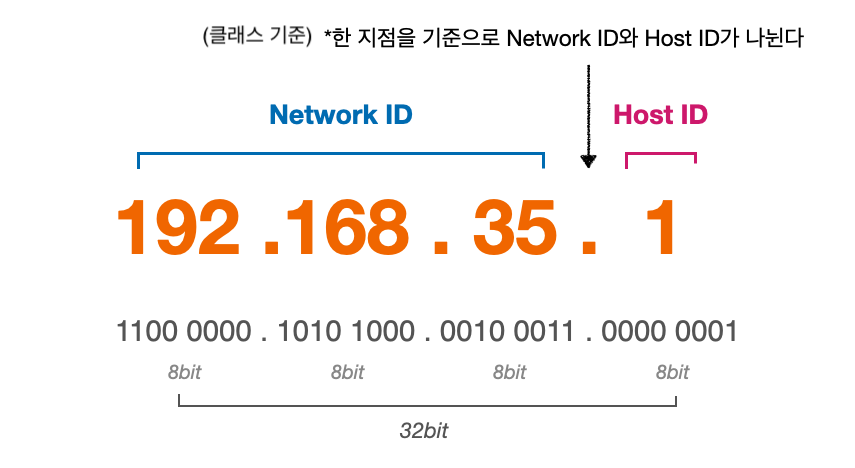
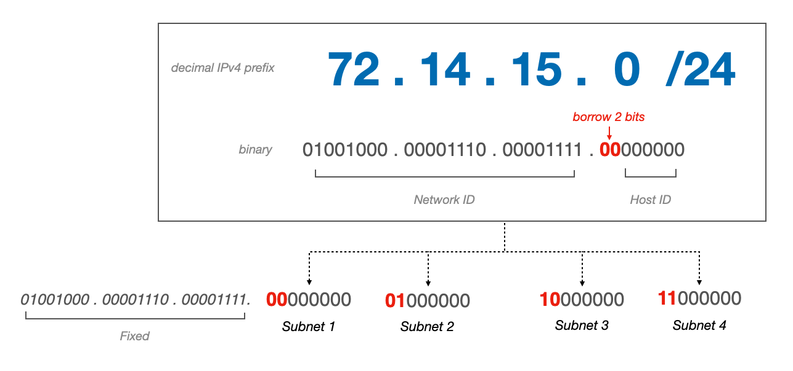

---

## 1. 공인 IP(Public IP)

### 공인 IP란?

* ISP에 의해 부여받는 IP 주소
* 인터넷 통신 목적으로 사용된다
* 공인 IP는 다른 IP 주소와 중복되지 않는다
* ISP는 공인 IP 주소를 통해 사용자를 모니터링 하고 추적할 수 있다
* 공인 IP는 유동 IP(Dynamic IP)와 고정 IP(Static IP)로 나눌 수 있다

<br>

---

### 유동 IP(Dynamic IP)

* ISP에 의해 디바이스에 부여하는 변하는 IP이다
  * 조금 더 자세히 들어가자면, ISP가 DHCP(Dynamic Host Configuration Protocol) 서버를 통해 디바이스에 부여하는 IP이다
* 보통 일정 주기 또는 접속을 할때 마다 사용하지 않는 IP 주소를 임시로 발급해주는 IP이다
* 대다수의 일반 사용자가 유동 IP를 사용한다고 보면 된다

<br>

---

### 고정 IP(Static IP)

* **ISP 또는 네트워크 관리자에 의해 할당 받는 변하지 않는 IP이다**
* 한번 부여된 IP는 다른 디바이스에 부여할 수 없다
* 유동 IP에 비해 보안이 뛰어나다
* 보통 지속적인 네트워크 접속이 있거나, 방화벽 화이트 리스트에 IP 주소를 추가해야하는 서버나 디바이스에 사용한다
* 비용을 지불해서 사용해야 한다
* 예시) 웹 호스팅, 이메일 서버

<br>

> **전용 IP(Dedicated IP)**
>
> 단일 호스팅을 위해 할당된 고정 IP 주소이다. 일반적으로 고정 IP는 환경에 따라 여러 디바이스에 걸쳐 공유될 수 있지만, 전용 IP는 오로지 하나의 사용자 또는 디바이스에 할당되어서 사용된다.
{: .prompt-info }

<br>

---

## 2. 사설 IP(Private IP)

### 사설 IP 소개

뒤의 [IP 주소 체계](https://seungki1011.github.io/posts/network-01-ip/#3-ip-%EC%A3%BC%EC%86%8C-%EC%B2%B4%EA%B3%84)에서 다루겠지만, 우리는 현재 IP 주소로 IPv4 프로토콜을 사용하고 있다.

<br>

_IPv4_

<br>

IPv4의 최대 IP 개수는 대략  43억($\approx 2^{32}$)개이다. 43억개는 언뜻 보면 많아 보이지만, 네트워크와 연결된 모든 디바이스에 아이피 주소를 할당하기는 부족하다.

**사설 IP(Private IP)는 이런 한정된 IPv4 주소를 활용하기 위해서 IP주소를 분할해서 사용하는 개념이다**.

사설IP는 사설망(Private Network)과 함께 사용된다.

<br>

> **사설망(Private Network)**
>
> * 사설망의 내부는 외부 인터넷 망으로 통신이 불가능한 Private IP로 구성된다
> * 외부로 통신할 때 통신이 가능한 Public IP를 이용(통신을 위해서 NAT을 사용)
> * **하나의 사설망은 보통 Private IP를 부여받은 다수의 기기와 NAT 기능을 갖춘 Gateway로 구성된다**
{: .prompt-info }

<br>

쉽게 설명하자면, **공유기(사설망의 입구로 생각하면 편하다)까지는 공인 IP를 할당하고. 공유기 내부의 네트워크(사설망) 안의 기기들은 사설 IP(Private IP)를 부여 받는다.**

이런 **사설 IP는 해당 사설망 내에서만 유일한 주소**이다. 사설 IP가 외부와 통신하기 위해서는 NAT 기능을 가진 게이트웨이가 필요하다.

<br>

> **IPv6**
>
> IPv4의 한계를 해결하기 위한 IPv6도 존재한다. IPv6는 가능한 IP주소가 굉장히 많기 때문에 Private IP의 개념이 필요없다.
>
> IPv6를 사용하는 경우는 많지 않다.
{: .prompt-info }

<br>

_https://www.geeksforgeeks.org/difference-between-private-and-public-ip-addresses_

<br>

---

### NAT(Network Address Translation)

사설망 안의 사설 IP를 받은 디바이스는 외부와 어떻게 통신을 할 수 있을까?

위에서 **"사설망은 보통 Private IP를 부여받은 다수의 기기와 NAT 기능을 갖춘 Gateway로 구성된다."**라고 설명을 했는데. NAT은 **사설 IP가 공인 IP를 통해 통신할 수 있도록 주소를 변환해 주는 방법**이라고 생각하면 된다.

<br>

NAT은 다음의 3가지 방법으로 나눈다.

* Dynamic NAT
* Static NAT
* PAT(Port Address Translation)

<br>

#### Dynamic NAT

* 1개의 Private IP를 가용 가능한 Public IP로 연결
* Public IP 그룹(NAT Pool)에서 현재 사용 가능한 IP를 가져와서 연결하는 방식

<br>

_https://cybermeteoroid.com/network-address-translation-a-complete-overview/_

<br>

---

#### Static Nat

하나의 Private IP를 고정된 하나의 Public IP로 연결

* AWS Internet Gateway가 사용하는 방식

<br>

_https://cybermeteoroid.com/network-address-translation-a-complete-overview/_

<br>

---

#### PAT(Port Address Translation)

* 다수의 Private IP를 하나의 Public IP로 연결
* NAT Gateway/NAT Instance가 사용하는 방식
* 대부분 가정이나 회사에서 이 방식을 사용
* Private IP에 붙은 포트와 Public IP에 붙은 포트는 다르다

<br>

_https://cybermeteoroid.com/network-address-translation-a-complete-overview/_

<br>

---

## 3. IP 주소 체계

### IPv4

IP 주소 체계에 대해 알아보자.

IP 주소는 IPv4 프로토콜을 사용한다.

<br>

_IP 주소_

* IP 주소는 `8bit`씩 끊어서 표현한다
* 총 `32bit`이다

<br>

IP 주소는 기본적으로 `네트워크 ID + 호스트 ID`로 이루어진다. 그래서 만약 `네트워크 ID`의 길이가 `24bit`이면, `호스트 ID`의 길이는 `8bit`가 된다.

($32 - 24 = 8$)

**여기서 중요한 것은 같은 네트워크 안에서는 `네트워크 ID`는 고정이 되고, `호스트 ID`만 변한다.**

<br>

그러면 `네트워크 ID`의 길이는 어떻게 정할까? 여기서 등장하는 개념이 `서브넷 마스크(Subnet Mask)`이다. 줄여서 `넷 마스크`라고 부르기도 한다.

<br>

---

### 서브넷 마스크(Subnet Mask)

서브넷 마스크에 대해 알아보자.

**IP 주소에서 네트워크 ID의 길이를 나타낸것이 서브넷 마스크**이다.

<br>

터미널에서 다음 명령어를 입력해서 IPv4 주소와 서브넷 마스크를 직접 확인해보자. (맥os 환경)

```bash
ipconfig getsummary en0 | grep ip
```

<br>

_서브넷 마스크 확인_

* **IPv4** : `192.268.35.1`
* **서브넷 마스크(subnet mask)** : `255.255.255.0`

<br>

그러면 이 서브넷 마스크를 가지고 어떻게 `네트워크 ID`를 구한다는 것일까? 결론부터 말하자면, IPv4에 서브넷 마스크를 `AND` 비트 연산을 하면 `네트워크 ID`가 나온다. 다음 그림을 통해 살펴보면 이해가 쉬울 것이다.

<br>

_네트워크 ID 구하기_

* 결과로 `네트워크 ID`가 `192.168.35.0`이기 때문에 `호스트 ID`는 `0.0.0.1`이 된다

<br>

---

### IP Class

IP 클래스는 기존 IPv4와 함께 사용된 IP 할당 방식이다. 이제는 사용되지 않는다. 현재는 클래스 방식이 아닌 CIDR 방식으로 IP를 할당한다.

클래스 방식을 간략히 설명하자면 **서브넷 마스크에 따라 클래스 A ~ E 별로 아이피의 범위를 분류하는 방식**이다.

<br>

_https://community.spiceworks.com/t/ip-address-classes-explained-a-subnetting-analogy/970214_

* `Private IP Range`가 사설망 내에 쓰이는 사설 IP의 범위이다
  * 해당 범위의 IP들은 공용 인터넷에서 라우팅이 불가능하다

<br>

> 우리가 주로 사용하는 IP는 클래스 `A`, `B`, `C`이다.
>
> * `Class D` : 멀티캐스팅(multi-cast)에 사용
> * `Class E` : 추후에 사용할 가능성을 위해 예약
>
> 뒤의 CIDR에서 자세히 다루겠지만, 클래스 할당 방식은 쉽게 말해서 서브넷 마스크가 `/8`, `/16`, `/24`인지에 따라 아이피 범위를 분류하는 것이다
{: .prompt-info }

<br>

**A, B, C 클래스로 나누는 방식은 굉장히 비효율적이다.**

예를 들어서 클래스 `C`의 IP 수는 `256`개이고 `B` 클래스의 IP 수는 `65536`개이다. 만약 하나의 회사에 사용하는 디바이스의 수가 대략 `20000`개 정도 된다고 가정해보자. 이 경우 `C` 클래스를 할당하기에는 IP가 부족하고, `B` 클래스를 할당하자니 낭비되는 IP의 수가 너무 많다.

이를 개선하고자 **CIDR, 서브넷팅(Subnetting)**의 개념이 등장했다.

<br>

---

### CIDR(Classless Inter Domain Routing)

CIDR은 **클래스 없는 도메인 간 라우팅 기법**이다. 기존의 클래스 방식의 IP 주소 할당 방식을 대체하기 위해서 등장했다.

기존 IP 할당 방식과 마찬가지로 CIDR은 IP 주소의 영역을 여러 네트워크 영역으로 나누기 위해 IP를 묶는 방식이다.

**다수의 사설망을 구축하기 위해 망을 나누는 방법으로 생각하면 편하다.** 

이때 네트워크(망)를 나누기 위한 행위를 **서브넷팅(Subnetting)**이라고 하고, 나누는 작업으로 인해 만들어진 네트워크를 **서브넷(Subnet)**이라고 한다.

<br>

* **CIDR Block**
  * **IP 주소의 집합**
  * 호스트 주소의 비트(bit) 만큼 IP 주소 보유 가능


* **CIDR Notation**
  * **CIDR Block을 표현하는 방법**
  * `[네트워크 ID] + [호스트 ID]/[네트워크 ID 길이]` 형식으로 구성된다
  * `네트워크 ID 길이`는 네트워크 주소가 몇 비트(bit) 인지 표시한다
  * `네트워크 ID 길이`는 `서브넷 마스크의 비트수`

<br>

IP 주소 체계와 서브넷 마스크에 관한 내용을 읽었으면 바로 감이 올 것이다. 그렇다, 저 `네트워크 ID 길이`가 결국에는 `서브넷 마스크의 비트수`인 것이다. 

이전의 서브넷 마스크에서 사용한 예시를 다시 보자.

* IP 주소 : `192.268.35.1`
* 서브넷 마스크 : `255.255.255.0`
  * 이를 다시 2진수로 표현하면 `1111 1111 . 1111 1111 . 1111 1111 . 0000 0000`

<br>

서브넷 마스크의 길이는 총 `24` 비트인 것을 알 수 있다. 이를 CIDR로 표현하면 다음과 같다.

> `192.268.35.1/24`
{: .prompt-info }

<br>

사실 CIDR은 결국에 지금까지 우리가 봐왔던 IP주소 표현에서 `255.255.255.0`과 같은 `서브넷 마스크`의 비트수를 사용해 뒤에 `/[네트워크 ID 길이]`를 붙인 것으로 보면 된다.

<br>

다음 그림으로 복습해보자.

<br>

_https://service.snom.com/display/wiki/CIDR-Notation_

* `서브넷 마스크`에 의해 `네트워크 ID`의 길이를 알 수 있음
* `서브넷 마스크`의 비트수가 결국에는 CIDR 표현에서 뒤에 붙은 `/[네트워크 ID 길이]`
* `(00001010 11011001 0111)1011 00000111` 에서 괄호친 부분은 고정
  * 고정 되지 않는 부분이 변하는 `호스트 ID`


<br>

---

## 4. 서브넷(Subnet)

### 서브넷 소개

서브넷은 네트워크 안의 네트워크이다. **큰 네트워크를 여러 네트워크로 쪼개면서 생긴 작은 네트워크**로 생각하면 편하다.

이때 이 **서브넷을 만들기 위해서 네트워크를 쪼개는 작업**을 **서브넷팅(Subnetting)**이라고 한다.

<br>

> 큰 네트워크에 부여된 IP 범위를 작은 단위로 나눈 후 서브넷에 할당한다. 이를 통해 더 효율적으로 IP 범위를 부여할 수 있다. 
{: .prompt-info }


<br>

_https://ipcisco.com/lesson/subnetting-examples/_

<br>

---

### 서브넷팅(Subnetting)

#### 고정 길이 서브넷 마스크(FLSM)

그러면 네트워크를 쪼개서 더 작은 네트워크로 만드는 서브넷팅의 과정을 살펴보자.

`72.14.15.0/24`이라는 네트워크가 있고, 이를 `4`개의 서브넷으로 분할한다고 가정해보자.

<br>

먼저 `72.14.15.0/24`를 살펴보자. 

* `네트워크 주소`는 `72.14.15.0`
* 서브넷 마스크가 `/24`이기 때문에 가능한 `호스트 주소`의 수가 `256`개

<br>

서브넷팅을 진행하기 위해서는 `호스트 주소`에서 비트를 빌린다는 개념을 사용한다. 다음 그림으로 살펴보자.

<br>

_호스트에서 비트 빌리기_

그림을 보면 2개의 비트를 빌린 것을 확인할 수 있다. 2개의 비트를 빌린 이유는 해당 2개의 비트로 4개의 네트워크를 만들 수 있기 때문이다. ($2^2=4$) 

쉽게 말해서 **해당 빌린 비트 부분이 우리가 나눌 4개의 서브넷을 구분해주는 비트가 된다.**

나머지 `6`비트의 `호스트 주소`로 `64`개의 주소를 가질 수 있다. ($2^6=64$)

만들어진 서브넷을 그림을 확인하면 다음과 같은 모습이다. `2`비트를 빌렸기 때문에 각 서브넷 미스크의 길이는 `24+2 = 26`이 된다.

<br>

_https://ipcisco.com/lesson/subnetting-examples/_

<br>

> 참고로
>
> * 가장 첫 주소는 `Network Address`로 서브넷 자체를 식별해주는 주소라서 사용할 수 없다.
> * 가장 마지막 주소는 `Broadcast Address`로 서브넷 안의 모든 호스트에게 데이터를 전송할 수 있도록 사용하기 때문에 사용할 수 없다.
>
> 만약 하나의 서브넷이 `64`의 호스트가 있다면, 사용할 수 있는 유저는 앞뒤 주소를 빼서 `62`개가 된다.
>
> 또한 보통 사용가능한 가장 첫 번째 주소를 라우터나 게이트웨이에 할당한다.
{: .prompt-info }

<br>

지금까지 살펴본 서브넷팅은 고정된 길이의 서브넷 마스크(subnet mask)를 사용했다고 해서 **FLSM(Fixed Length Subnet Mask)**라고 부른다.

고정 길이의 개념이 있다는 것은 당연히 가변 길이(VLSM)도 존재한다는 뜻이다.

<br>

---

#### 가변 길이 서브넷 마스크(VLSM)

그러면 이번에는 가변 길이 서브넷 마스크(VLSM)를 이용해서 서브넷팅하는 경우를 살펴보자.

<br>

`200.200.10.0/25`이라는 네트워크를 다음의 네트워크로 분할한다고 가정해보자. 각 네트워크의 크기는 이전과 다르게 서로 동일하지 않다.

* **network 1** : `6`
* **network 2** : `4`
* **network 3** : `14`
* **network 4** : `10`
* **network 5** : `9`

<br>

일단 기존의 FLSM 방식에서 했던 것 처럼 네트워크를 동일 크기로 분할하자. 우리의 경우 `5개의 서브넷`이 필요하기 때문에 `3 비트`를 빌려야한다.

`3 비트`를 빌리면 총 `8개의 서브넷`을 만들 수 있다. 각 서브넷은 `16개의 호스트`를 가진다.

여기서 일단 사용자가 `14`, `10`, `9`인 네트워크에 현재 분할된 서브넷을 하나씩 할당할 것이다. 그러나 사용자가 `6`, `4`인 네트워크에 `호스트 수가 16`인 서브넷을 할당하는 것은 비효율적이다. 그래서 `호스트 수가 16`인 서브넷을 다시 반으로 분할해서 각 네트워크에 할당할 것이다.

글로만 보면 이해가 어려울 수 있기 때문에 다음 그림으로 살펴보자.

<br>

_VLSM_

* 네트워크 `3`, `4`, `5`는 처음에 서브넷팅해서 나온 서브넷을 할당 해준다
* 네트워크 `1`, `2`는 처음에 서브넷팅해서 나온 서브넷을 다시 서브넷팅 해서 반으로 나눠서 할당 해준다
* 가변 길이 서브넷 마스크(VLSM)이라고 불리는 이유는 각 서브넷의 서브넷 마스크가 `28`로 동일하지 않고 `28`, `29`로 가변적이기 때문이다

<br>

> **슈퍼넷팅(Supernetting)**
>
> 서브넷팅이 네트워크를 분할해서 서브넷을 만드는 개념이라면, 슈퍼넷팅은 반대로 서브넷을 합쳐서 하나의 더 큰 네트워크를 만드는 것을 말한다.
{: .prompt-info }

<br>

---

## Reference

1. [https://www.youtube.com/watch?v=9nBq6PxDvp4&list=PLfth0bK2MgIan-SzGpHIbfnCnjj583K2m&index=5](https://www.youtube.com/watch?v=9nBq6PxDvp4&list=PLfth0bK2MgIan-SzGpHIbfnCnjj583K2m&index=5)
2. [https://www.youtube.com/watch?v=px0HDON5Wa4&t=639s](https://www.youtube.com/watch?v=px0HDON5Wa4&t=639s)
3. [https://www.geeksforgeeks.org/difference-between-private-and-public-ip-addresses/](https://www.geeksforgeeks.org/difference-between-private-and-public-ip-addresses/)
4. [https://cybermeteoroid.com/network-address-translation-a-complete-overview/](https://cybermeteoroid.com/network-address-translation-a-complete-overview/)
5. [https://service.snom.com/display/wiki/CIDR-Notation](https://service.snom.com/display/wiki/CIDR-Notation)
6. [https://ipcisco.com/lesson/subnetting-examples/](https://ipcisco.com/lesson/subnetting-examples/)
7. [https://en.wikipedia.org/wiki/Subnet](https://en.wikipedia.org/wiki/Subnet)
8. [https://cidr.xyz/](https://cidr.xyz/) : CIDR block을 직접 설정하면서 시각적으로 확인 가능

