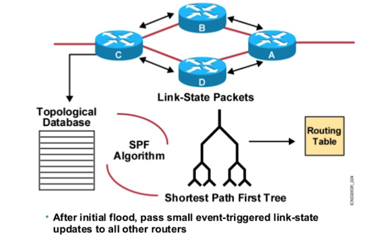
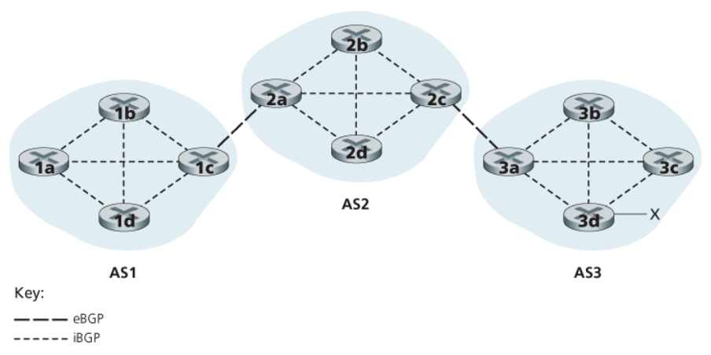

---

## 1. 라우팅(Routing) 소개

**라우팅(Routing)은 네트워크 패킷이 출발지에서 목적지까지 효율적으로 전달될 수 있도록 경로를 결정하고 관리하는 과정**이다. 이는 네트워크 통신의 핵심 요소로, 다양한 네트워크 장비와 프로토콜이 서로 협력하여 작동한다. 

**라우팅을 수행하는 네트워크 장비가 라우터(Router)**이다. 라우터는 네트워크 계층의 가장 핵심적인 장치이다. 패킷이 네트워크에서 통신을 할 때, 라우터를 거치면서 이동하는데, 하나의 **라우터에서 다음 라우터로 이동하는 하나의 과정을 홉(Hop)**이라고 부른다. 정리해서 이야기하자면, 패킷이 이동하는 과정은 여러번의 홉을 통해 호스트에 다른 네트워크 또는 호스트로 이동하는 것이다.

 

> **L3 스위치, 라우터, 공유기**
>
> * **L3 스위치**
>   *  L3 스위치는 전통적인 스위칭 기능(데이터 링크 계층, Layer 2)과 라우팅 기능(네트워크 계층, Layer 3)을 결합한 장치
>   * L3 스위치는 전통적인 스위치의 고속 데이터 전송 능력과 저지연 성능을 제공한다
>   * L3 스위치는 특정 네트워크 환경에서 고속 스위칭과 VLAN 간 라우팅을 위해 사용되지만, 그 사용 범위가 제한적
> * **라우터(Router)**
>   * 라우터는 네트워크 계층(Layer 3)에서 동작하며, 서로 다른 네트워크 간의 데이터 패킷을 전달하고 최적의 경로를 선택한다
>   * 라우터는 보통 LAN, WAN(광역 네트워크) 간의 연결을 관리하며, 인터넷 접속을 위한 게이트웨이 역할을 한다
>   * 복잡한 라우팅 결정과 다양한 네트워크 프로토콜을 처리할 수 있다
> * **공유기(Home Router, Wi-Fi Router)**
>   * 공유기는 라우터의 한 유형으로, 주로 가정이나 소규모 사무실 환경에서 사용한다
>   * 가정이나 소규모 사무실에서 여러 장치가 인터넷에 동시에 연결될 수 있도록 도와주는 장치이다
>   * 보통 Wi-Fi 기능을 포함한다
>   * 공유기는 기본적인 라우팅 기능 외에도 Wi-Fi 기능, NAT, DHCP 및 방화벽 기능 등을 제공하기도 한다
  {: .prompt-info }

 

---

## 2. 라우팅 테이블(Routing Table)

**라우팅 테이블은 네트워크 라우터가 패킷을 목적지로 전달하기 위해 사용하는 표 형태의 데이터** 구조이다. 이 테이블은 **네트워크 경로 정보를 포함**하고 있으며, 패킷이 올바른 방향으로 전달되도록 도와준다. 라우팅 테이블의 **각 항목은 특정 네트워크 대역이나 호스트로 가는 경로를 정의**한다.

라우팅 테이블에 기록되는 정보는 상황에 따라 다를수 있지만, 가장 공통적이자 핵심적인 정보는 다음과 같다.

* **목적지 네트워크(Destination Network, 수신지 네트워크)**
  * 패킷이 전달될 최종 목적지 주소 또는 네트워크
  *  IPv4 주소 체계를 사용하면 네트워크 주소와 서브넷 마스크로 표현된다
* **서브넷 마스크(Subnet-mask, Netmask)**
  * 목적지 네트워크의 크기를 나타낸다
  * 네트워크 주소의 범위를 정의하는 데 사용된다
* **게이트웨이(Gateway)**
  * **다음 홉(Next Hop)의 IP 주소**
  * 패킷이 목적지로 가기 위해 거쳐야 하는 중간 라우터의 주소다
* **인터페이스(Network Interface)**
  * 패킷을 목적지로 보내기 위해 사용되는 라우터의 네트워크 인터페이스
  * 실제로 패킷이 라우터를 떠나는 물리적 또는 논리적 포트를 의미한다(패킷을 내보내는 통로)
  * NIC 이름이 직접적으로 명시되거나, 인터페이스에 대응하는 IP주소가 명시되기도 한다
* **메트릭(Metric)**
  * 경로의 비용 또는 우선순위를 나타내는 값
  *  라우터는 메트릭을 사용하여 여러 경로 중 가장 효율적인 경로를 선택한다
  * 일반적으로 메트릭 값이 낮을수록 경로가 더 선호된다
* **플래그(Flags)**
  * 라우팅 테이블 항목에 대한 추가 정보를 나타낸다
  * 예를 들어, 항목이 정적인지, 동적인지 또는 게이트웨이인지 등을 나타낸다
    * **U (Up)**: 경로가 활성 상태임을 나타낸다. 인터페이스가 작동 중이며, 라우팅이 가능한 상태이다.
    * **G (Gateway)**: 경로가 게이트웨이를 통해 이루어짐을 나타낸다. 패킷이 다른 네트워크로 전달되기 위해 중간 라우터를 거쳐야 한다는 뜻이다.
    * **H (Host)**: 경로가 단일 호스트를 가리킴을 나타낸다. 이는 특정 IP 주소에 대한 경로임을 의미한다.
    * **D (Dynamic)**: 동적 라우팅 프로토콜에 의해 생성된 경로임을 나타낸다. 이 경로는 네트워크 상태에 따라 자동으로 업데이트된다.
    * **M (Modified)**: 동적 라우팅 프로토콜에 의해 수정된 경로임을 나타낸다. 라우터가 기존 경로 정보를 변경했음을 의미한다.
    * **R (Reinstate)**: 재확인된 경로임을 나타낸다. 일시적으로 사용되지 않았던 경로가 다시 활성화 되었다는 것을 의미한다.
    * **! (Reject)**: 경로가 거부되었음을 나타낸다. 이 경로로의 패킷은 드롭되며, 대상 네트워크에 도달할 수 없다.
    * **B (Blackhole)**: 패킷이 이 경로로 보내지면 드롭되지만, 네트워크의 혼잡 상태나 루프를 피하기 위해 의도적으로 설정된다. 

 

> 동적 라우팅에 대해서는 뒤의 라우팅 프로토콜에서 다룬다.
{: .prompt-warning }

 

_Routing Table 예시(Pseudo)_

* `192.168.1.0/24`
  * **범위**:  `192.168.1.0` ~ `192.168.1.255`
* `10.0.0.0/8`
  * **범위**: `10.0.0.0` ~ `10.255.255.255`
* `0.0.0.0/0`
  * **기본 경로(Default Route)**
  * 모든 IP 주소

 

만약 **패킷 내의 목적지 IP 주소가 라우팅 테이블에 있는 목적지 IP, 서브넷 마스크에 해당하는 경우가 없다**면 어떻게 될까? 이 경우에는 **기본 경로(Default Route)로 설정된 `0.0.0.0/0`으로** 보내지게 된다.

 

---

## 3. 라우팅 프로토콜(Routing Protocol)

### 라우팅 프로토콜의 분류

라우팅 프로토콜의 유형은 다음 처럼 분류된다.

 

_Routing Protocol의 분류_

**정적 라우팅(Static Routing)과 동적 라우팅(Dynamic Routing)의 분류**는 **라우팅 테이블(Routing Table)을 수동으로 업데이트 하는지, 자동으로 업데이트 하는지에 따라** 나눌 수 있다.

 

먼저 **정적 라우팅과 동적 라우팅의 특징을 비교**해보자.

* **정적 라우팅(Static Routing)**
  * **정적 라우팅은 네트워크 관리자가 수동으로 경로를 설정하는 방식**
  * 경로는 네트워크 디바이스의 라우팅 테이블에 고정된 형태로 저장되며, 네트워크 관리자에 의해 수동으로 추가, 수정, 삭제된다
  * 네트워크의 규모가 커지면 관리하기 어렵다
* **동적 라우팅(Dynamic Routing)**
  * **동적 라우팅은 라우팅 프로토콜을 사용하여 경로를 자동으로 설정하고 업데이트하는 방식**
  * 라우터는 라우팅 프로토콜을 통해 네트워크 상태 정보를 교환하고, 이를 바탕으로 최적의 경로를 계산하여 라우팅 테이블을 자동으로 유지 관리한다
    * 예를 들면, 동적 라우팅을 사용하면 네트워크 경로상에 문제가 생긴다면 이를 우회할 수 있도록 경로가 자동으로 갱신되기도 한다
  * **사용하기 적합한 사례**
    * 대규모 네트워크 : 다수의 라우터가 있는 큰 네트워크 환경
    * 변화가 잦은 네트워크 : 경로와 네트워크 상태가 자주 변경되는 환경
    * 고가용성(HA)이 요구되는 네트워크 : 빠른 장애 복구와 경로 재설정이 필요한 환경

 

---

### 동적 라우팅 프로토콜(Dynamic Routing Protocol)

모든 라우터는 특정 목적지까지 도달하기 위한 최적의 경로를 찾아 라우팅 테이블에 추가하려고 한다. 이를 위해서 **라우터끼리 서로 자신의 정보를 교환**하게 되는데, **이 과정에서 사용하는 프로토콜이 동적 라우팅 프로토콜**이다.

 

> **AS(Autonomous System)**
>
> 동적 라우팅 프로토콜을 들어가기 전 AS에 대해 알아보자.
>
> **Autonomous System (AS)**는 **네트워크의 집합체로, 동일한 관리권 아래에 있는 네트워크들로 구성된 개체**이다.
>
> 주요 개념을 정리하자면 다음과 같다.
>
> * **AS는 하나의 관리자가 또는 조직에 의해 운영되며, 통합된 라우팅 정책과 규칙을 적용하는 네트워크 집합**
> * AS는 인터넷에서 데이터 패킷의 경로를 결정하는 데 중요한 역할을 한다
> * **AS 내부에는 IGP(Interior Gateway Protocol), AS 간에는 EGP(Exterior Gateway Protocol)를 사용**하여 정보를 교환한다
> * AS 번호(ASN)는 인터넷에서 각 AS를 식별하기 위해 사용되는 고유한 번호이다
>   * ASN은 인터넷 협회인 IANA(Internet Assigned Numbers Authority) 또는 지역 인터넷 등록 기관(RIR)에 의해 할당된다
> * 단일 AS : 하나의 네트워크 또는 조직이 운영하는 AS
> * 다중 AS : 여러 조직 또는 네트워크가 협력하여 운영하는 AS
{: .prompt-info }

 

이제 **동적 라우팅 프로토콜의 분류**를 살펴보자.

 

_동적 라우팅 프로토콜의 분류_

동적 라우팅 프로토콜은 일단 라우팅 범위에 따라 크게 2 가지로 분류할 수 있다.

1. **내부 게이트웨이 프로토콜(IGP, Interior Gateway Protocol)** : 하나의 자율 시스템(AS) 내에서 사용되는 프로토콜
2. **외부 게이트웨이 프로토콜(EGP, Exterior Gateway Protocol)** : 서로 다른 자율 시스템(AS) 간에 사용되는 프로토콜

 

---

#### IGP(Interior Gateway Protocol)

IGP에는 어떤 프로토콜들이 있는지 살펴보자. 그전에 **거리 벡터 알고리즘**과 **링크 상태 알고리즘**에 대해 알아보자.

 

> **거리 벡터 알고리즘(Distance Vector), 링크 상태 알고리즘(Link State)**
>
> _https://www.routexp.com/2020/03/routing-basics-distance-vector-vs-link.html?m=0_
>
> * **거리 벡터 알고리즘** : 각 라우터가 이웃 라우터와 거리 정보를 주고받아 최적의 경로를 결정
> * 거리는 패킷이 경유한 라우터의 수(홉의 수)를 의미한다
> * **장점**
>   * 설정 용이
>   * 소규모 네트워크에 적합
>   
> * **단점**
>   * 느린 수렴
>
>
>  
>
> _https://www.routexp.com/2020/03/routing-basics-distance-vector-vs-link.html?m=0_
>
> * **링크 상태 알고리즘** : 각 라우터가 네트워크 전체의 링크 상태 정보를 유지하고, 이를 바탕으로 최단 경로를 계산
>   * 쉽게 말해서 비용이 매겨진 링크로 연결된 그래프에서 최소 비용 경로를 찾아서 사용한다고 생각하면 된다
> * 현재 네트워크의 상태를 링크 상태 데이터베이스(Link State Database)에 저장
> * LSDB에는 라우터들의 연결 관계, 연결 비용 등 현재 네트워크 상태를 그래프로 표현하기 위한 데이터가 저장되어 있음
> * **장점**
>   * 빠른 수렴
>   * 정확한 경로
>   * 확장성이 좋음
> * **단점**
>   * 복잡한 설정
>   * 높은 리소스 사용
  {: .prompt-info }

 

**최적 경로를 선정하는 과정에서 사용하는 프로토콜이 거리 벡터(Distance Vector)를 사용하는지, 링크 상태(Link State)를 사용하는지**에 따라 내부 게이트웨이 프로토콜(IGP)을 분류할 수 있다.

 

---

##### RIP(Routing Information Protocol))

먼저 **RIP(Routing Information Protocol)**부터 살펴보자. **RIP**는 **거리 벡터 알고리즘(Distance Vector)**을 바탕으로 설계된 프로토콜이다.

다음 그림들을 통해 **대략적인 RIP의 동작 과정**을 살펴보자. 라우터 A에서 라우터 D로 가는 경로를 선택하는 상황이라고 가정해보자.

 

_RIP: 초기 상태_

* 초기에는 각 라우터가 자신이 직접 연결된 네트워크에 대한 정보를 가지고 있다
* 각 라우터는 자신과 인접한 라우터들과 정보를 전송해서 교환한다

 

_RIP: 정보 교환 후 테이블 업데이트_

* 각 라우터는 다른 라우터로부터 받은 정보를 바탕으로 라우팅 테이블을 업데이트한다

 

_RIP: 최적 경로 선택_

* 정보 교환과 테이블 업데이트를 통해 라우터는 특정 수신지에 도달하기까지의 홉 수를 알 수 있다
* **RIP(Routing Information Protocol)**는 **거리 벡터 프로토콜**을 사용하는 프로토콜로서, **홉 수가 가장 적은 경로를 최적의 경로로 판단**한다
* 홉 수가 적을 수록 테이블상의 메트릭 값도 작아진다

 

**RIP의 특징**은 다음과 같다.

* **유형** : **거리 벡터 프로토콜**
* 최대 홉 수 15로 제한되어 있다. 16은 도달 불가능(infinity)로 간주된다. 이는 네트워크의 크기를 제한하는 요소이다.
* 주기적(기본적으로 30초마다)으로 전체 라우팅 테이블을 이웃 라우터에 전송한다
  * 수신한 라우팅 정보로 라우팅 테이블을 갱신한다
  * 수신한 경로가 기존 경로보다 짧다면 테이블 업데이트
* 동일한 홉 수를 가지는 경로가 여러 개 존재하는 경우, 다중 경로를 통해 로드 밸런싱(Load Balancing)을 할 수 있다
* 네트워크 변화 시 **새로운 경로로 수렴하는 속도가 느리다**. 이는 대규모 네트워크에서 문제를 일으킬 수 있다.
* 주기적으로 전체 라우팅 테이블을 전송하기 때문에 **네트워크 대역폭을 낭비**하는 경향이 있다
* 가변 길이 서브넷 마스크(VLSM)를 처리할 수 없다
* 더 좋은 대역폭 상태의 경로(Route)가 있어도 홉 수 메트릭에 의해 경로를 선택하기 때문에, 대역폭이 더 좋은 선택지는 고려되지 않는다
* 확장성과 효율성 문제로 인해 일부 소규모 네트워크를 제외하고는 잘 사용되지 않는다

 

---

##### OSPF(Open Shortest Path First)

**OSPF는 링크 상태(Link State) 프로토콜을 사용**한다.

일단 **OSPF의 동작 원리를 아주 간단히 설명**하면 다음과 같다.

* 각 라우터는 링크의 상태에 변화가 있는 경우에만 변화의 내용을 모든 라우터에게 플러딩(Flooding)해서 갱신된 상태 정보를 모든 라우터와 동시에 공유한다
* 각 라우터는 글로벌 네트워크 상태 정보에 다익스트라 알로리즘(Dijkstra Algorithm)을 실행하여 모든 라우터에 대한 최소 비용 경로를 계산한다(다익스트라 대신 SPF를 사용하기도 한다)
* 최소 비용 경로 계산 결과에 따라 라우팅 테이블을 갱신한다
* 여기서 비용(Cost)은 $10^8/\text{bandwidth(bps)}$를  사용한다. (대역폭이 높을수록 비용이 낮다)

 

쉽게 말해서, **OSPF는 대역폭이 높을 수록 낮은 비용을 설정한 링크를 사용하는 링크 상태 기반의 프로토콜**이다.

다음 그림들을 통해 **대략적인 OSPF의 동작 과정**을 살펴보자.

 

_OSPF: hello 패킷 교환_

* OSPF가 설정된 인접한 라우터 간에 주기적(10초)으로  hello 패킷을 주고 받으며 인접 이웃 관계(Adjacent Neighbor Relationship)을 형성한다

 

_OSPF: LSA 생성, flooding_

* 각 라우터는 갱신된 링크 상태 정보가 포함된 **LSA(Link State Advertisement, 링크 상태 광고)를 생성**
* LSA를 모든 라우터들에게 **플러딩(flooding)**함으로써 **링크 상태 갱신 정보 공유**

 

_OSPF: 모든 라우터는 동일 LSDB 유지_

* 공유된 LSA를 통해 **LSDB(Link State Database, 링크 상태 데이터베이스)를 계속 업데이트**해서, 모든 라우터는 **동일한 LSDB를 유지**한다

 

_OSPF: 최소 비용 경로 계산_

* 각 라우터는 자신의 **LSDB에 대해 다익스트라 알고리즘을 적용해서 모든 라우터에 대해 최소 비용 경로를 계산**한다
* 계산된 최소 비용 경로를 바탕으로 라우팅 테이블을 설정(업데이트)한다
* 보통 전송 속도가 빠르거나 대역폭이 크면 비용(cost)이 낮다

 

**OSPF의 특징**은 다음과 같다.

* **유형** : **링크 상태 프로토콜**
* 네트워크의 링크 상태 정보를 유지하고, 이를 바탕으로 Dijkstra 알고리즘을 사용하여 최소 비용 경로를 계산한다
* RIP 보다는 라우팅 정보 관련 갱신 횟수가 줄어들어 빈번한 처리 지연 발생으로 인한 라우터의 성능 저하를 방지할 수 있다
* 플러딩 방식의 갱신 정보 전송을 이용하기 때문에 정보 전파 속도가 빠르다
* 빠른 수렴 속도와 높은 확장성을 제공

 

OSPF의 문제점은 네트워크 구성이 변경될 때마다 라우팅 테이블을 갱신해야 하는데, **네트워크의 규모가 매우 커졌을 때는 링크 상태 데이터베이스(LSDB)에 모든 정보를 저장하기가 어렵다**. 이는 최적 경로를 갱신하는 연산의 부담도 커진다는 의미이다.

이를 해결하기 위해서 **OSPF에서는 하나의 AS를 영역(Area)라는 단위로 나누고, 나눠진 Area 내에서만 링크 상태를 공유**한다.

 

_OSPF : 계층 구조 적용_

* 하나의 AS를 여러개의 영역(Area)로 나눈다
* 각 영역은 독립적으로 OSPF 라우팅을 수행한다
* 영역 간의 라우팅은 백본 영역(Backbone Area)을 통해서 수행한다

 

> IGP에는 **EIGRP(Enhanced Interior Gateway Routing Protocol)**라는 프로토콜도 존재한다.
>
> * **유형** : **하이브리드 프로토콜** (거리 벡터와 링크 상태 프로토콜의 장점을 결합)
> * 여러 메트릭(대역폭, 지연, 신뢰성 등)을 사용하여 경로를 계산한다
> * 빠른 수렴 속도와 효율적인 경로 선택
>
> 이외에도 IS-IS(Intermediate System to System Protocol) 등의 프로토콜이 있다.
{: .prompt-info }

 

---

#### EGP : BGP(Border Gateway Protocol)

EGP(Exterior Gateway Protocol)은 대표적으로 **BGP(Border Gateway Protocol)**가 있다.

BGP는 **AS 간의 통신에 사용되는 유일한 표준 라우팅 프로토콜**로, **AS 간 통신이 아닌 AS 내의 라우터 간 통신에서도 사용할 수 있다**. BGP는 **경로 벡터(Path Vector) 라우팅 알고리즘을 기반**으로 설계되었다.

* **eBGP(external BGP)** : AS 간 통신에서 사용하는 BGP
  * TCP 연결을 통해 eBGP 피어(Peer) 형성

* **iBGP(internal BGP)** : AS 내 통신에서 사용하는 BGP
  * AS 내의 라우터들 간에 1:1 TCP 연결을 통해 iBGP 피어 형성
  * iBGP 연결은 논리적 연결이다

 

> 피어(Peer)는 아래에서 설명한다. 
{: .prompt-info }

 

> **경로 벡터 알고리즘(Path Vector)**
>
> 경로 벡터 알고리즘은 네트워크 라우팅 프로토콜의 한 종류로, BGP(Border Gateway Protocol)에서 사용된다. 이 알고리즘은 **경로 정보와 함께 각 경로를 거쳐온 자율 시스템(AS)의 목록을 포함하여 네트워크 경로를 관리하고 전달**한다. 이를 통해 루프 방지와 경로 선택을 효율적으로 수행한다.
>
> 대략적인 작동 방식은 다음과 같다.
>
> 1. 경로 광고
>    * 각 라우터는 목적지까지의 경로를 발견하면, 해당 경로와 경로를 거쳐온 AS 목록을 포함한 경로 정보를 인접 라우터에게 광고한다
>    * 예를 들어, 라우터 A가 라우터 B에게 목적지 D에 대한 경로를 광고할 때, 광고 메시지에는 AS 목록이 포함한다
> 2. 경로 업데이트
>    * 인접 라우터는 광고된 경로 정보를 수신하면, 자신이 속한 AS 번호를 AS 목록에 추가하고, 갱신된 경로 정보를 자신의 인접 라우터들에게 다시 광고한다
>    * 이 과정은 네트워크 전체에 걸쳐 반복되어 모든 라우터가 경로 정보를 공유하게 된다
> 3. 루프 방지
>    * 라우터는 광고된 경로 정보를 수신할 때, 자신의 AS 번호가 포함된 경로는 무시한다
>    * 예를 들어, 라우터 B가 자신이 이미 경로 목록에 포함된 경로를 수신하면, 해당 경로는 무시된다
> 4. 경로 선택
>    * 각 라우터는 수신한 경로 정보를 비교하여 최적의 경로를 선택한다
>    * 일반적으로 AS 목록이 가장 짧은 경로가 선호된다
>    * **BGP의 경우, 추가적인 경로 속성(예: Local Preference, MED 등)을 사용하여 더 세밀한 경로 선택이 이루어진다**
   {: .prompt-info }

 

_네트워크 하향식 접근: BGP_

 

AS 간 정보를 주고 받기 위해서는 AS 내에서 BGP 라우터(eBGP를 사용하는 라우터)가 하나 이상 존재해야 하고, 통신할 다른 AS의 BGP 라우터와 연결되어 있어야 한다.

일단 BGP의 주요 기능을 살펴보자.

* **피어링(Peering)**
  * 두 BGP 라우터가 서로 경로 정보를 교환하기 위해 세션을 설정하는 과정을 피어링이라고 한다
  * 피어(Peer)란, BGP 메세지를 주고받을 수 있도록 연결된 BGP 라우터를 의미한다
  * **쉽게 말해서 서로 피어 관계가 되도록 연결하는 과정을 피어링**이라고 한다
* **BGP 메세지**
  * BGP는 여러가지 메세지를 사용해서 정보를 교환한다
  * OPEN : 피어 간의 세션을 설정
  * UPDATE : 경로 정보(경로 광고와 경로 철회)를 전달
  * KEEPALIVE : 세션 유지를 위해 주기적으로 전송
  * NOTIFICATION : 에러 발생 시 전송되며, 세션을 종료
* **정책 기반 라우팅**
  * 네트워크 관리자들이 특정 경로를 선호하거나 피하도록 정책을 설정할 수 있다

 

**BGP의 대략적인 동작 방식**은 다음과 같다.

1. **세션 설정(Peering, 피어링)**
   * BGP 라우터는 다른 BGP 라우터와 TCP 연결을 설정한다(TCP 포트 179 사용)
   * OPEN 메시지를 보내 피어링 세션을 시작
   * 피어는 OPEN 메시지를 수신하고, 세션이 성공적으로 설정되면 KEEPALIVE 메시지를 주기적으로 교환한다
2. **경로 교환**
   * 피어링 세션이 설정되면, BGP 라우터는 자신이 알고 있는 경로 정보를 UPDATE 메시지를 통해 피어에게 보낸다
   * 각 경로에는 AS_PATH라는 속성이 포함되며, 이는 경로를 거쳐온 AS들의 목록이다
   * 경로 정보에는 목적지 네트워크, 다음 홉(Next-Hop), 경로를 거쳐온 AS 목록 등이 포함된다
3. **경로 선택**
   * BGP 라우터는 수신한 경로 정보를 바탕으로 최적의 경로를 선택한다
   * 경로 선택 과정은 다양한 속성(AS_PATH, Local Preference, MED 등)을 고려하여 이루어진다
     * 다양한 AS 정책을 속성을 통해서 구현 및 실현한다
   * 예를 들어, 가장 짧은 AS_PATH를 가진 경로를 선호하거나, Local Preference 값이 높은 경로를 선택할 수 있다
4. **경로 업데이트**
   * 네트워크 상태가 변경되면, BGP 라우터는 변경된 경로 정보를 피어에게 UPDATE 메시지를 통해 알린다
   * 예를 들어, 특정 경로가 더 이상 유효하지 않으면, 해당 경로를 철회하는 UPDATE 메시지를 보낸다
5. **세션 유지 및 종료**
   * BGP 라우터는 피어와의 세션을 유지하기 위해 주기적으로 KEEPALIVE 메시지를 전송
   * 에러가 발생하거나, 네트워크 상태에 따라 피어링 세션이 종료될 수 있다. 이때 NOTIFICATION 메시지가 사용된다

 

> 이번 포스트의 내용은 굳이 외울 필요없다. 프로토콜이 대략적으로 이런 원리로 동작한다는 것을 감으로 익혀놓겠다는 느낌으로 접근하자.
{: .prompt-tip }

 

---

## Reference

1. [https://www.youtube.com/watch?v=DWZE-qZHXUk](https://www.youtube.com/watch?v=DWZE-qZHXUk)
2. [https://www.youtube.com/watch?v=0h7hKi_j1GE](https://www.youtube.com/watch?v=0h7hKi_j1GE)
3. [강민철: 혼자 공부하는 네트워크](https://product.kyobobook.co.kr/detail/S000212911507)
4. [James F. Kurose : 컴퓨터 네트워킹 하향식 접근](https://product.kyobobook.co.kr/detail/S000061694627)
5. [널널한 개발자 : 네트워크 기초 이론](https://www.youtube.com/watch?v=Bz-K-DPfioE&list=PLXvgR_grOs1BFH-TuqFsfHqbh-gpMbFoy&index=14)
6. [https://www.routexp.com/2020/03/routing-basics-distance-vector-vs-link.html?m=0](https://www.routexp.com/2020/03/routing-basics-distance-vector-vs-link.html?m=0)

