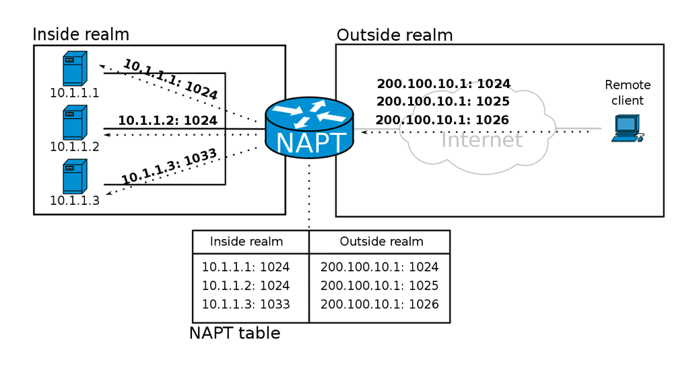
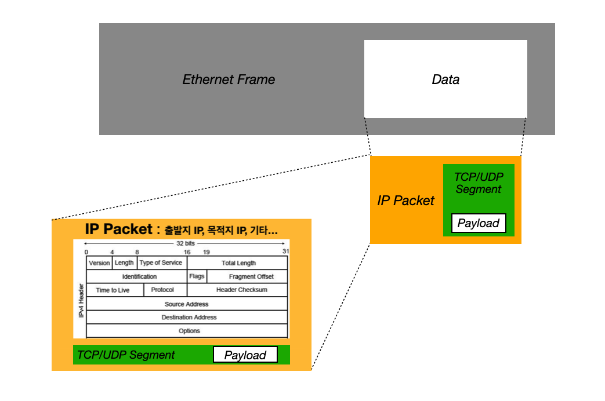
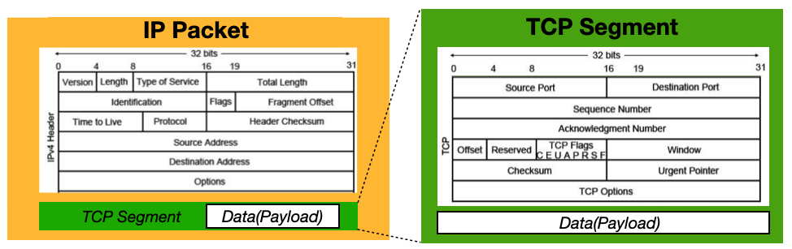
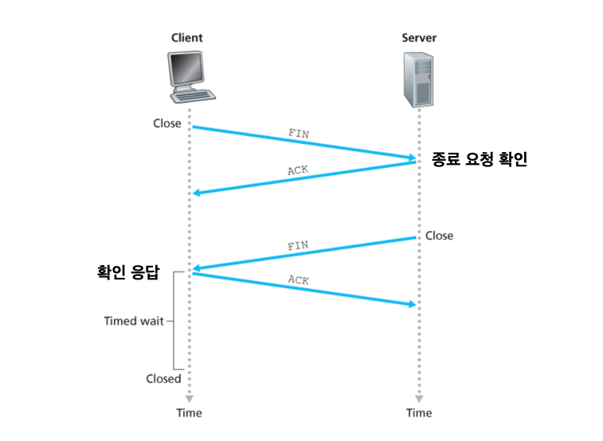
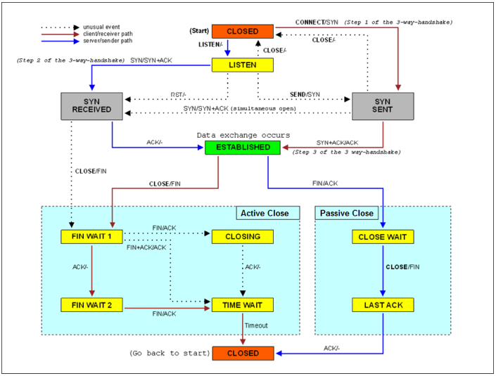

---

> 일부 내용은 [(HTTP - 1) 웹 통신](https://seungki1011.github.io/posts/http-1-internet-communication/) 포스트와 중복됩니다.
{: .prompt-warning }

---

## 1. IP의 한계

IP(인터넷 프로토콜)의 한계는 여러 가지가 있으며, 이를 극복하기 위해 전송 계층(Transport Layer)에서 다양한 기술이 사용된다.

일단 **IP의 주요 한계점**은 다음과 같다.

* **신뢰성 부족(Unreliable)**
  * IP는 최성형 전달(Best Effort Deliviery)을 사용한다
  * IP는 패킷을 목적지까지 전달하는 데 초점을 맞추고 있지만, **패킷이 손실되거나 중복되거나 순서가 뒤바뀔 수 있는 상황에 대해 신경 쓰지않는다**. 이는 데이터 전송의 신뢰성을 떨어뜨린다.
* **연결 지향성 부족(Connectionless)**
  * IP는 **연결을 설정하거나 유지하지 않는 비연결형 프로토콜(connectionless protocol)**이다.
  * 각각의 패킷은 독립적으로 처리되며 연결 상태에 대한 정보를 가지고 있지 않다.
  * 쉽게 말해서 **패킷이 받을 대상이 없거나 서비스 불능 상태여도 패킷을 전송**한다
* **포트(PORT) 구분이 불가능하다**
  * 같은 IP를 사용하는 서버에서 통신하는 애플리케이션 프로세스가 둘 이상이면 **포트로 구분해야 하지만, IP 프로토콜에서는 불가능하다**

 

> **비연결형 통신을 사용하는 이유**
>
> 일단 신뢰성을 보장하기 위해서 하는 작업(패킷 순서 확인, 연결 수립, 등)은 패킷을 그냥 보내는 것 보다 높은 성능 부하가 요구된다.
>
> 모든 인터넷 서비스가 반드시 신뢰성 있는 정송을 보장해야 하는 것은 아니다. 동영상이나 음성 스트리밍 서비스 처럼, 몇 개의 패킷 손실은 감수해도 빠른 전송이 우선시 되는 경우도 존재한다.
{: .prompt-info }

 

이런 IP의 한계를 극복하기 위해서 전송 계층에서 주요하게 사용되는 프로토콜에는 TCP(전송 제어 프로토콜)와 UDP(사용자 데이터그램 프로토콜)가 있다. 뒤에서 자세히 다루겠지만, 대략적으로 TCP와 UDP에 대해서 설명하자면, TCP는 신뢰성, 순서 보장, 흐름 제어, 오류 수정 등의 기능을 제공하여 안정적인 데이터 전송을 보장한다. 반면, UDP는 간단하고 빠른 전송을 지원하여 실시간 애플리케이션에 적합한 특징을 가진다.

TCP/UDP를 살펴보기 포트(PORT)가 무엇인지 살펴보자.

 

---

## 2. 포트(PORT)

### 포트 소개

전송 계층의 포트(PORT)에 대해서 알아보자.

클라이언트가 여러 서버들과 통신을 하는 상황이라고 가정해보자. 예를 들어, 같은 IP 내에서 게임, 화상통화, 웹 브라우징을 한다고 해보자.

 

_PORT_

위 그림에서, 같은 아이피내에서 게임과 화상통화를 진행하고 있는 것을 확인할 수 있다. 만약 전달 받은 패킷에 IP 주소만 있다면 어떻게 될까? 어느 애플리케이션으로 패킷을 전달해야하는지 모르기 때문에 정상적인 애플리케이션의 사용이 불가능할 것이다. **정상적인 통신을 위해서는 패킷이 실행 중인 특정 애플리케이션 프로세스까지 전달되어야** 한다.

쉽게 말해서 **패킷이 실행 중인 특정 애플리케이션까지 전달되려면 패킷에 특정 애플리케이션을 식별할 수 있는 정보가 필요**하다. **그 정보가 포트(PORT)**다.

전송 계층에서는 패킷 내 수신지(목적지) 포트와 송신지 포트를 통해서 송수신지 호스트의 애플리케이션을 식별한다.

 

---

### 포트 분류

TCP/UDP는 모두 포트 번호 필드에서 송신지 포트 번호와 수신지 포트 번호를 포함한다. 포트 번호는 16비트로 표현 가능하며, 사용 가능한 포트의 수는 $2^{16}$개, 즉 65536개 이다.

포트는 **잘 알려진 포트(well known port)**, **등록된 포트(registered port)**, **동적 포트(dynamic port)**로 분류할 수 있다.

* **잘 알려진 포트**
  * 이름 그대로 범용적으로 사용되는 애플리케이션 프로토콜들이 사용하는 널리 알려진 포트
  * **0 ~ 1023**
    * 예시로 다음의 포트들이 있다
    * `20`, `21` : FTP
    * `22` : SSH
    * `80` : HTTP
    * `443` : HTTPS
* **등록된 포트**
  * 잘 알려진 포트보다는 덜 범용적이지만, 흔히 사용되는 애플리케이션 프로토콜에 할당하기 위해서 사용된다
  * **1024 ~ 49151**
    * 예시
    * `3306` : MySQL
    * `6379` : Redis
* **동적(사설) 포트**
  * 사설 포트(private port)라고 부르기도 한다
  * 할당된 애플리케이션 프로토콜이 없다
  * 특별히 관리되지 않기 때문에 자유롭게 사용할 수 있다
  * **49152 ~ 65535**

 

---

### 포트 포워딩(Port Forwarding)

**포트 포워딩(Port Forwarding)**은 외부 네트워크에서 들어오는 요청을 특정 내부 네트워크의 장치로 전달하는 네트워크 설정이다. 주로 NAT(Network Address Translation) 환경에서 사용되며, **특정 포트 번호와 IP 주소를 매핑하여 내부 네트워크 장치가 외부와 통신할 수 있게 한다**.

예를 들어, 네트워크 내부의 여러 호스트가 공인 IP 주소를 공유하는 상황에서, 네트워크 외부에서 내부로 통신(원격 접속 등)을 시작하는 상황이라고 가정해보자. 네트워크 외부의 호스트가 네트워크 내부의 특정 호스트에게 패킷을 전달하고 싶어도, 네트워크 내에서는 사설 IP 주소들을 사용하고 있고 여러 호스트가 하나의 공인 IP 주소를 공유하고 있기 때문에 네트워크 외부 호스트의 입장에서는 어떤 IP 주소(포트)를 목적지 주소로 삼을지 결정하기 어려울 수 있다.

**포트 포워딩**을 이 때 사용할 수 있다. **특정 IP 주소와 포트 번호 쌍을 특정 호스트에게 할당하고, 외부에서 통신을 시작할 호스트에게 해당 접속 정보(`IP 주소:포트 번호`)를 알려주면 된다**. 이제 네트워크 외부 호스트는 해당 `IP주소:포트 번호` 매핑정보로 통신을 시작할 수 있다.

 

_https://en.wikipedia.org/wiki/Port_forwarding_

 

이제 **포트 포워딩**을 한번 정리하고, 조금 더 자세히 살펴보자.

* **포트 포워딩이란?**
  * 포트 포워딩은 라우터나 방화벽이 특정 포트로 들어오는 외부 네트워크 트래픽을 내부 네트워크의 특정 IP 주소와 포트로 전달하는 방법이다
* **NAT와의 관계는?**
  * NAT는 내부 네트워크의 사설 IP 주소를 외부로 나갈 때 공인 IP 주소로 변환한다
  * 포트 포워딩은 NAT의 한 기능으로, 외부에서 내부 네트워크의 특정 장치로의 접근을 가능하게 한다
* **포트 포워딩을 사용하는 상황**
  * **내부 서버 접근**
    * 내부 네트워크에 있는 웹 서버, FTP 서버, 게임 서버 등 특정 서비스에 외부에서 접근할 필요가 있을 때 사용한다
    * 예를 들면, 집에서 호스팅하는 웹 서버를 외부에서 접속하기 위해 포트 포워딩을 설정하는 경우
  * **원격 접속(Remote Access)**
    * 원격 데스크톱 연결, SSH 접속 등 내부 장치에 원격으로 접근할 필요가 있을 때 사용한다
  * **특정 애플리케이션의 기능 활성화**
    * P2P 파일 공유, 온라인 게임 등 특정 애플리케이션이 외부에서 내부 네트워크로 직접 연결을 필요로 할 때 포트 포워딩을 설정한다

 

포트 포워딩시 고려사항을 살펴보자.

* **보안 위험**
  * 포트 포워딩은 외부에서 내부 네트워크로의 직접 접근을 허용하므로, 보안 위협이 증가할 수 있다
  * 특정 포트를 열어두면, 해커가 해당 포트를 통해 내부 네트워크에 침투할 수 있는 가능성이 있다
* **보안 강화 방법**
  * **방화벽 설정**: 포트 포워딩 규칙을 설정할 때, 방화벽을 통해 허용된 IP 주소만 접근할 수 있도록 제한한다
  * **강력한 인증**: SSH, 원격 데스크톱 등 원격 접근 서비스의 경우 강력한 비밀번호와 2단계 인증을 사용한다

 

> **컨테이너에서의 포트 포워딩**
>
> **컨테이너 환경에서 포트 포워딩은 외부 네트워크 또는 호스트 머신과 컨테이너 내부의 서비스를 연결**하기 위해 자주 사용된다. 예를 들어, 컨테이너 내부에서 80번 포트에서 웹 서버가 실행 중이라면, 이 웹 서버를 외부에서 접근할 수 있도록 하기 위해 호스트의 8080번 포트로 포워딩할 수 있다.
>
> Docker에서는 `-p` 옵션을 통해서 설정한다.
{: .prompt-info }

 

---

## 2. TCP(Transmission Control Protocol)

### TCP 소개

TCP (Transmission Control Protocol)는 전송 계층(Transport Layer)에 속한 프로토콜로, 신뢰할 수 있는 데이터 전송을 제공하는 역할을 한다. **TCP는 연결 지향적 프로토콜로, 데이터를 안정적으로, 순서대로, 에러 없이 전송하기 위해 다양한 메커니즘을 사용**한다.

**연결 지향적이라는 뜻은, 통신하기 전에 연결을 수립하고 통신이 끝나면 연결을 종료**한다는 의미이다. TCP는 이런 연결을 수립하기 위해서 **Three Way Handshake**라는 것을 사용한다.

 

---

### TCP 세그먼트(TCP Segment)

이전의 네트워크 계층(Network Layer)를 설명하는 포스트에서 IP 패킷에 대해 설명한적이 있다. 거기서 TCP 세그먼트가 페이로드(Payload)를 캡슐화하고 **IP 패킷은 해당 TCP 세그먼트를 캡슐화한 형태**라는 것을 확인할 수 있었다.

 

_https://seungki1011.github.io/posts/network-03-network-layer/#3-ip-%ED%8C%A8%ED%82%B7ip-packet_

 

이 **TCP 세그먼트의 헤더 구조**를 자세히 살펴보자.

 

_TCP Segment_

**TCP의 동작을 이해하기 위한 주요 헤더**들은 다음과 같다.

* **출발지 포트(Source Port, 송신지 포트)**
  * 16비트
  * 송신자의 애플리케이션을 식별하기 위한 포트 번호
* **목적지 포트(Destination Port, 수신지 포트)**
  * 16비트
  * 수신자의 애플리케이션을 식별하기 위한 포트 번호
* **순서 번호(Sequence Number)**
  * 32비트
  * 세그먼트의 순서를 나타내는 번호(조립을 위한 순서)
* **확인 응답 번호(Acknowledgment Number)**
  * 32비트
  * 상대 호스트가 보낸 세그먼트에 대한 응답으로, 수신자가 다음에 기대하는 순서 번호가 명시된다

* **제어 플래그(Control Flags, TCP Flags)**
  * 9비트
  * 세그먼트에 대한 부가 정보를 플래그로 나타낸다
  * 각 플래그는 특정한 상태나 행동을 나타내며, 세그먼트가 수행해야 할 작업을 정의한다
  * **Three way Handshake에서 사용할 주요 플래그**
    * **ACK (Acknowledgment)**: 확인 응답 번호가 유효함을 나타낸다
      * 쉽게 말해서 세그먼트의 승인을 나타내기 위한 비트이다
    * **SYN (Synchronize)**: 연결 수립을 시작한다
    * **FIN (Finish)**: 연결을 종료한다
  * 기타 플래그
    * **URG (Urgent)**: 긴급 데이터가 포함되어 있음을 나타낸다
    * **PSH (Push)**: 수신자가 데이터를 즉시 전달해야 함을 나타낸다
    * **RST (Reset)**: 연결을 재설정한다
    * **ECE (Explicit Congestion Notification Echo)**: 혼잡 알림을 수신했음을 나타낸다
    * **CWR (Congestion Window Reduced)**: 송신자가 혼잡 윈도우 크기를 줄였음을 나타낸다
    * **NS (Nonce Sum)**
  * 총 9개의 플래그가 있으며, 각 플래그에 1비트를 할당한다(총 9비트)

* **윈도우(Window)**
  * 16비트
  * 수신자가 수신할 준비가 되어 있는 데이터의 양을 나타낸다
  * 쉽게 말해서 윈도우는 한번에 수신하고자 하는 데이터의 양이며, 해당 필드에는 윈도우의 크기가 명시된다

 

그 외의 헤더들.

* **예약 필드(Reserved)**
  * 미래를 위해 예약된 필드
* **체크섬(Checksum)**
  * 헤더와 데이터의 오류 검출을 위한 값
* **긴급 포인터(Urgent Pointer)**
  * 긴급 데이터의 위치를 나타냄
* **옵션(Options, TCP Options)**
  * 선택적으로 사용되는 필드
* **데이터 오프셋(Offset)**
  * TCP 헤더의 길이를 나타냄

 

---

### Three-Way Handshake(TCP 연결 수립) 

**TCP의 연결 수립**은 **쓰리 웨이 핸드쉐이크(Three-way Handshake)**라는 과정을 통해서 이루어진다.

 

_Three-way Handshake_

1. **클라이언트 → 서버**
   * SYN 세그먼트의 내용
     * 1로 설정된 SYN 플래그
     * 클라이언트의 초기 순서 번호
   * **연결을 요청(시작)하는 단계**
2. **서버 → 클라이언트**
   * SYN + ACK 세그먼트의 내용
     * 1로 설정된 SYN, ACK 플래그
     * 서버의 초기 순서 번호
     * 클라이언트가 전송한 세그먼트에 대한 확인 응답 번호
   * **연결 요청을 확인하고 수락하는 단계**
3. **클라이언트 → 서버**
   * ACK 세그먼트의 내용
     * 1로 설정된 ACK 플래그
     * 클라이언트의 다음 순서 번호
     * 서버가 전송한 세그먼트에 대한 확인 응답 번호
   * **클라이언트가 연결 수립을 확인했다고 응답하는 단계**

 

Three way Handshake을 통해 연결을 수립한 뒤 데이터 통신이 끝났다면 연결을 종료해야 한다. TCP가 **연결을 종료하는 과정은 송수신 호스트가 각자 한번씩 FIN과 ACK를 주고받으면 이루어진다**.

 

_Four-Way Handshake : Close Connection_

 

**TCP 연결의 종료**는 네 단계로 연결을 종료한다는 점에서, Three-way Handshake의 이름을 이어받아 **Four-way Handshake이라고 부르기도 한다**.

 

---

### TCP 상태

TCP 연결은 여러 상태를 거치면서 설정, 데이터 전송, 종료 등의 과정을 관리한다. 각 상태는 특정 이벤트에 의해 전환되며, 이 과정은 TCP의 신뢰성과 연결 지향적인 특성을 보장한다.

쉽게 말해서 **TCP는 연결형 통신과 신뢰할 수 있는 통신을 유지하기 위해서 다양한 상태를 유지**한다. **상태라는 것은 현재 어떤 통신 과정에 해당하는지 나타내는 정보**로 보면 된다.

TCP 상태에는 어떤 것들이 있는지 살펴보자.

1. **연결이 수립되지 않은 상태**

   * **CLOSED**
     * 초기 상태로, 연결이 열려 있지 않거나 이미 닫힌 상태
     * 연결이 닫혀 있거나 새로운 연결 요청을 받을 때 사용된다

   * **LISTEN**
     * 서버가 연결 요청(SYN)을 기다리고 있는 상태
       *  `listen()` 시스템 호출에 의해 설정되며, 클라이언트의 연결 요청을 수락한다

2. **연결 수립 상태**

   * **SYN-SENT**
     * 클라이언트가 연결 요청(SYN)을 보내고, 서버의 응답(SYN-ACK)을 기다리고 있는 상태
     * 클라이언트가 `connect()` 시스템 호출을 통해 서버에 연결 요청을 보낸 후 이 상태로 전환된다
   * **SYN-RECEIVED**
     * 서버가 클라이언트의 SYN을 받고, SYN-ACK을 보내고 클라이언트의 ACK을 기다리고 있는 상태
     * 서버가 클라이언트의 연결 요청을 수락하고 SYN-ACK을 보낸 후 이 상태로 전환된다

   * **ESTABLISHED**
     * 양쪽 모두 데이터 전송이 가능한 연결 상태
       * 클라이언트와 서버가 3-way 핸드셰이크를 성공적으로 완료한 후 이 상태로 전환되며, 실제 데이터 전송이 이루어진다

3. **연결 종료 상태**

   * **CLOSED**
   * **FIN-WAIT-1**
     * 연결을 종료하기 위해 FIN 세그먼트를 보낸 후, 상대방의 ACK 또는 FIN을 기다리고 있는 상태
     * 연결을 닫기 위한 첫 번째 단계로, FIN 세그먼트를 보낸 후 이 상태로 전환된다
   * **FIN-WAIT-2**
     * 상대방의 FIN 세그먼트를 기다리고 있는 상태
     * FIN-WAIT-1 상태에서 상대방의 ACK을 받은 후 이 상태로 전환된다

   * **CLOSE-WAIT**
     * 상대방의 FIN을 받고, 연결을 닫기 위한 준비를 하고 있는 상태
     * 수신 측에서 FIN 세그먼트를 받고, ACK을 보낸 후 이 상태로 전환된다
     *  애플리케이션이 연결을 닫기 위한 추가 작업을 수행한다

   * **LAST-ACK**
     * 상대방의 FIN에 대한 ACK을 보내고, 자신의 FIN에 대한 ACK을 기다리고 있는 상태
     * CLOSE-WAIT 상태에서 애플리케이션이 연결을 닫은 후, FIN을 보내고 이 상태로 전환된다

   * **TIME-WAIT**
     * 모든 세그먼트가 네트워크에서 사라지기를 기다리는 상태로, 일정 시간 동안 유지된다
     * CLOSING 상태에서 FIN에 대한 ACK을 받은 후, 네트워크에서 모든 패킷이 사라지도록 일정 시간 동안 이 상태로 유지된다

4. **CLOSING**

   * 양쪽 모두 FIN을 보낸 상태로, 아직 상대방의 FIN에 대한 ACK을 기다리고 있는 상태
   * 동시에 연결을 종료하려 할 때 전이되는 상태로 보면 된다
   * ACK를 수신한다면 각자 TIME-WAIT 상태로 접어든 뒤 종료하게 된다

 

_https://en.wikipedia.org/wiki/File:Tcp_state_diagram.png_

 

---

## Reference

1. [https://seungki1011.github.io/posts/http-1-internet-communication/](https://seungki1011.github.io/posts/http-1-internet-communication/)
2. [김영한: 모든 개발자를 위한 HTTP 웹 기본 지식](https://www.inflearn.com/course/http-%EC%9B%B9-%EB%84%A4%ED%8A%B8%EC%9B%8C%ED%81%AC/dashboard)
3. [강민철: 혼자 공부하는 네트워크](https://product.kyobobook.co.kr/detail/S000212911507)
4. [James F. Kurose: 컴퓨터 네트워킹 하향식 접근](https://product.kyobobook.co.kr/detail/S000061694627)
5. [널널한 개발자: 네트워크 기초 이론](https://www.youtube.com/watch?v=Bz-K-DPfioE&list=PLXvgR_grOs1BFH-TuqFsfHqbh-gpMbFoy&index=14)

