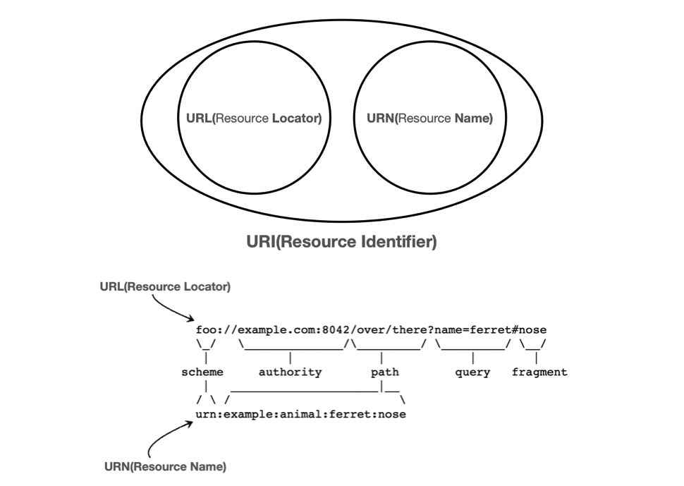

---

## 1. DNS(Domain Name System)

### 도메인 네임(Domain Name) 소개

클라이언트가 서버에게 요청 메세지를 보내고 응답을 받는 요청-응답 송수신 과정은 IP 주소를 통해서 이루어진다. 그러나 현실에서는 IP 주소를 통해서 요청을 하지 않고 특정 **도메인 네임(Domain Name)**을 입력해서 요청과 응답을 주고 받는다. 

> **도메인 네임(Domain Name)**
>
> **네트워크상에서 컴퓨터를 식별하는 호스트명**을 말한다. 보통 `www.naver.com` 처럼 사람이 읽을 수 있는 문자 형태의 주소로 이루어진다.
{: .prompt-info }

<br>

> 브라우저에 IP를 입력해서 요청하는 것이 불가능한 것은 아니다.
{: .prompt-info }

<br>

---

### 네임 서버(Name Server) 소개

이런 것이 가능한 이유는 어떤 존재가 **도메인 네임을 특정 IP에 매핑**을 해줬기 때문이다. 어떤 존재는 **도메인 네임과 IP 주소를 매핑한 정보를 관리해주는 네임 서버(Name Server)**라는 곳이다. 도메인 네을 관리해주는 네임 서버를 **DNS 서버**라고도 부른다.

<br>

_DNS 서버_

* DNS 서버는 전화번호와 해당하는 이름을 관리하는 전화번호부 처럼, 도메인 네임과 IP 주소를 모아 관리한다
* 도메인 네임을 네임 서버에 질의하면 해당 도메인 네임에 대한 IP 주소를 알아낼 수 있다

<br>

---

### 도메인 네임의 구조

네임 서버는 도메인 네임을 어떻게 관리하는지 도메인 네임의 구조를 통해 살펴보자.

**도메인 네임의 구조는 계층적(hierarchical)으로 설계**되어 있으며, 이는 **관리와 탐색의 효율성을 높이기 위한** 것이다. 도메인 네임은 여러 부분으로 나뉘며, 각각의 부분이 계층적으로 정렬되어 있다. 도메인 네임의 각 부분은 `점(.)`으로 구분되며, 아래에서 위로 읽는다.

이 구조를 통해 도메인 네임 시스템(DNS)은 빠르고 효율적인 검색을 가능하게 한다.

<br>

_도메인 네임 계층_

* 최상단에는 루트 도메인(root domain)인 `.`이 존재한다
* **최상위 도메인(Top-Level Domain, TLD)**
  * 최상의 루트 도메인의 다음 도메인
  * **일반적으로 도메인 네임의 마지막 부분**(사실 루트 도메인 `.`이 마지막 도메인이지만, 일반적으로 생략해서 표기하기 때문에 최상단 도메인을 도메인 네임의 마지막 부분으로 취급한다)
    * 예 : `www.example.com`에서 `com`이 최상단 도메인
* **2단계 도메인(Second-Level Domain, SLD)**
  * 최상위 도메인의 바로 하부 도메인
  * 예 : `www.example.com`에서 `example`이 SLD
* **Lower-Level Domain**
  * 보통 3단계 도메인 부터 지칭하는 도메인
  * 전체 도메인 네임은 일반적으로 3~5단계 수준
  * 예 : `www.example.com`에서 `www`가 3단계 도메인

<br>

_FQDN_

* 도메인 네임을 모두 포함하는 도메인 네임을 FQDN(Fully Qualified Domain Name)이라고 한다
* FQDN의 첫 부분(`www`)을 호스트 네임(host name)이라고 부르기도 한다

<br>

> 호스트 명(Host name)은 FQDN(전체 도메인 네임) 자체를 가르키기도 하고, 네트워크 상의 장치 이름을 가리키는데 사용되기도 한다. 어떤 의미로 사용되는지는 컨텍스트에 따라 파악하면 된다.
{: .prompt-info }

<br>

---

## 2. URI(Uniform Resource Identifier)

**자원(Resource)**은 **URI(Uniform Resource Identifier)로 식별할 수 있는 모든 것**을 의미한다. 자원은 매우 광범위한 개념으로, **웹을 통해 접근하거나 참조할 수 있는 모든 유형의 데이터를 포함**한다.

위에서 **"URI로 식별할 수 있는 모든 것"**이라고 표현했는데, 기본적으로 자원을 사용하기 위해서는 자원을 식별할 줄 알아야 한다. **URI가 자원을 식별해주는 정보**이다.

URI는 특정 경로를 기반으로 자원을 식별할 수도 있고, 특정 이름을 기반으로 자원을 식별할 수도 있다. **경로(위치)를 기반으로 식별하는 경우 URL(Uniform Resource Locater)**이라고 하고, **이름을 기반으로 식별하면 URN(Uniform Resource Name)**이라고 부른다.

<br>

_URI_

URL의 형식을 살펴보자.

> URL 구조
>
> `scheme://[userinfo@]host[:port][/path][?query₩][#fragement]`
{: .prompt-info }

<br>

다음과 같은 URL이 있다고 해보자.

```url
https://www.google.com:443/search?q=hello&hl=ko
```

* **protocol(scheme)**: `https`
  * 프로토콜은 어떤 방식으로 자원에 접근할 것인가 정하는 약속, 규칙
  * 예) `http`, `https`, `ftp`..
* **userinfo(authority)**
  * URL에 사용자 정보를 포함해서 인증
* **hostname**: `www.google.com`
  * 도메인명 또는 IP 주소를 직접 사용가능
* **port number**: `443`
  * 접속 포트
  * `http`는 `80`, `https`는 `443`으로 생략 가능
* **path**: `/search`
  * 리소스가 위치한 경로, 계층적 구조
  * 예) `/home/file1.png`, `members/1004`
* **query string**: `q=hello&hl=ko`
  * `key=value` 형태
  * 웹서버에 제공하는 파라미터
  * `?`로 시작하고, `&`로 추가 가능
* **fragment**
  * HTML 내부 북마크 등에 사용한다
    * 예) 깃헙의 마크다운 목차
  * 서버에 전송하는 정보는 아님

<br>

> HTTP에 관한 포스트는 [여기서](https://seungki1011.github.io/posts/http-1-internet-communication/) 내용 확인
{: .prompt-warning }

<br>

---

## Reference

1. [https://seungki1011.github.io/posts/http-1-internet-communication/](https://seungki1011.github.io/posts/http-1-internet-communication/)
2. [김영한: 모든 개발자를 위한 HTTP 웹 기본 지식](https://www.inflearn.com/course/http-%EC%9B%B9-%EB%84%A4%ED%8A%B8%EC%9B%8C%ED%81%AC/dashboard)
3. [강민철: 혼자 공부하는 네트워크](https://www.google.co.kr/books/edition/%ED%98%BC%EC%9E%90_%EA%B3%B5%EB%B6%80%ED%95%98%EB%8A%94_%EB%84%A4%ED%8A%B8%EC%9B%8C%ED%81%AC/XWABEQAAQBAJ?hl=ko&gbpv=0)
4. [James F. Kurose : 컴퓨터 네트워킹 하향식 접근](https://www.google.co.kr/books/edition/%EC%BB%B4%ED%93%A8%ED%84%B0_%EB%84%A4%ED%8A%B8%EC%9B%8C%ED%82%B9_%ED%95%98%ED%96%A5%EC%8B%9D_%EC%A0%91%EA%B7%BC/CItKswEACAAJ?hl=ko)
5. [널널한 개발자: 네트워크 기초 이론](https://www.youtube.com/watch?v=Bz-K-DPfioE&list=PLXvgR_grOs1BFH-TuqFsfHqbh-gpMbFoy&index=14)
