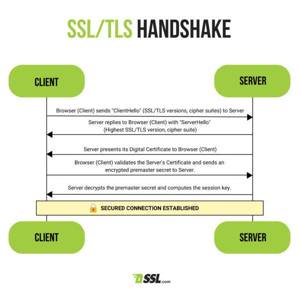

---

## 1. 암호화(Encryption)

### 암호화 소개

**암호화(encryption)는 평문(plaintext)을 암호문(ciphertext)으로 변환하는 과정**이다. 암호화 통해 **데이터가 전송되는 도중에 제3자가 내용을 알아볼 수 없게** 만드는 것이 암호화의 목적이다. 반대로, **복호화(decryption)는 암호문(ciphertext)을 평문(plaintext)으로 변환하는 과정**이다. 이는 암호화의 역과정으로, **허가된 사용자가 데이터의 원래 내용을 확인**할 수 있도록 해준다.

암호화는 다음과 같은 2 가지 주요 형태로 나눌 수 있다.

1. **대칭키 암호화(Symmetric key encryption)**
2. **비대칭키 암호화(Asymmetric key encryption)**
   * **공개키 암호화(Public key encryption)**라고도 부른다

 

암호화와 복호화에는 **키(key)를 통해 평문을 암호문으로 변환하거나, 그 역과정을 진행**한다.

 

> 여기서 키(key)라는 것은 **암호화 알고리즘이 데이터를 변환하기 위해 사용하는 일련의 값**이다. 키와 평문 데이터에 암호화 알고리즘(특정 수학적 연산)을 거치면 암호문이 생성된다. 키가 암호화 알고리즘에 사용되는 방식은 알고리즘 마다 상이하다.
>
> * 암호화 키 : 평문을 암호문으로 변환하는데 사용되는 값
> * 복호화 키 : 암호문을 평문으로 변환하는데 사용되는 값
{: .prompt-info }

 

각 암호화 방식을 자세히 살펴보자.

 

---

### 대칭키 암호화(Symmetric Key Encryption)

대칭키 암호화는 **동일한 키를 사용하여 데이터를 암호화하고 복호화**한다.

대칭키 암호화를 그림으로 살펴보자.

 

_대칭키 암호화_

* `호스트 A`와 `호스트 B`는 사전에 **대칭키를 공유**한다
  * 편의상 `A`와 `B`로 지칭할 것이다

* `A`가 전송하려는 `평문(데이터)`을 준비한다
  * `A`는 사전에 공유된 대칭키를 사용해서 평문을 암호화한다
  * 암호화된 데이터를 `B`에게 전달한다

* `B`는 암호화된 데이터를 수신한다
  * 사전에 공유된 대칭키로 암호문을 평문으로 다시 복호화한다
  * 이제 `B`는 평문을 사용할 수 있다

* 반대의 경우도 똑같은 과정이 진행된다

 

이런 대칭 키 암호화 방식에는 한가지 문제가 있다. 암호화와 복호화에 **동일한 키를 사용하기 때문에 키가 유출되면 지금까지 한 암호화 통신은 모두 무용지물**이 된다. 이 문제를 해결하기 위해서는 **상대방에게 안전하게 키를 전달할 방법이 필요**하다.

한마디로 제3자가 중간에 내용을 확인할 수 없는 방법으로 키를 전달해야 한다. 여기서 바로 이상함을 느낄 것이다. 

> *"암호화의 목적이 데이터가 전송되는 도중에 제3자가 내용을 알아볼 수 없게만드는 것인데, 암호화를 위한 키를 전달하기 위해서 제3자가 알아볼 수 없는 방법으로 전달하라고?"*

이건 마치 암호화의 문제를 해결하기 위해서 암호화를 사용하라고 말하는거나 마찬가지다. (뒤에서 다루겠지만, 이것이 오늘날 많이 사용하는 세션키 암호화 방식이다.)

 

대칭키 암호화의 문제를 해결하기 위해서 등장한 것이 **공개키 암호화(Public key encrpytion)**이다. **비대칭키 암호화**라고 부르기도 한다.

 

---

### 공개키 암호화(Public Key Encrpytion)

**공개키 암호화는 암호화를 위한 키와 복호화를 위한 키가 다르다**. 대칭키와 상반된다고 해서 비대칭키 암호화라고 부르기도 한다.

공개키 암호화에서는 **암호화를 위한 키를 공개키(public key)**, **복호화를 위한 키를 개인키(private key)**라고 부른다. 개인키를 비밀키라고 부르기도 한다. 여기서 **하나의 키를 안다고 해서 반대쪽 키를 유추하는 것은 불가능**하다.

공개키 암호화에서 **공개키는 누구에게나 공개해도 무방**하지만, **개인키는 절대로 유출되지 않도록** 보안을 유지하는 방식으로 사용된다. 다음 그림을 통해 공개키 암호화를 살펴보자.

 

_public key encryption_

* `호스트 A`가 `호스트 B`에게 데이터를 보내는 상황이라고 가정해보자
  * 편의상 `A`와 `B`로 지칭할 것이다
* 공개키 암호화에서는 각 호스트가 **공개키**와 **개인키** **쌍을 생성**한다
  * `B`는 자신의 공개키를 `A`에게 전달한다
* `A`는 전송하려는 `평문(데이터)`을 준비한다
  * `A`는 `B`의 공개키를 사용해서 평문을 암호화한다
  * 암호화된 데이터를 `B`에게 전송한다
* `B`는 자신이 소유한 개인키를 사용해서 암호문을 평문으로 복호화한다
  * 이제 `B`는 평문을 사용할 수 있다
* 반대의 경우도 똑같은 과정이 진행된다
  * 만약 `B`가 `A`에게 데이터를 보내는 상황이라면 `A`가 `B`에게 공개키를 전송한다

 

공개키 방식에서는 개인키의 소유자가 개인키를 유출당하지 않는 이상, 안전하게 데이터를 전달할 수 있다.

그러나 이런 **공개키 방식도 단점**은 존재한다. **암호화와 복호화에 사용하는 시간과 부하가 대칭키 방식에 비해 많이 소모**된다는 것이다. 대칭키와 공개키 방식의 특징을 비교해보자.

 

* **대칭키 암호화(Symmetric key encryption)**
  * 대칭키 암호화는 상대적으로 빠르다(빠른 암호화, 복호화)
  * 안전하게 키를 공유해야 하는 어려움이 있다
  * 키가 노출되면 전체 통신이 취약해질 수 있다
* **공개키 암호화(Public key encryption)**
  * 대칭키에 비해 속도가 느리다
  * 키 분배가 상대적으로 간편하며, 공개키는 누구와도 공유할 수 있고 개인키는 안전하게 보관해야 한다

 

---

### 세션키 암호화(Session Key Encryption)

그러면 키 전달의 안전성을 보장하면서 암호화와 복호화를 빠르게 수행할 수 있는 방법은 없을까? 그 방법이 바로 세션키 방식의 암호화이다. **세션키 방식은 대칭키 방식과 공개키 방식을 함께 사용**한다.

위에서 이런 이야기를 한적이 있다.

> *"암호화의 목적이 데이터가 전송되는 도중에 제3자가 내용을 알아볼 수 없게만드는 것인데, 암호화를 위한 키를 전달하기 위해서 제3자가 알아볼 수 없는 방법으로 전달하라고? 이건 마치 암호화의 문제를 해결하기 위해서 암호화를 사용하라고 말하는거나 마찬가지다."*

 

세션키 방식이 공개키 방식을 사용해서 키를 안전하게 전달해서 대칭 키를 사용하는 방식이다. 다음 그림을 통해 살펴보자.

 

_session key encryption_

* `A`는 임의의 세션키(대칭키)를 생성한다
* `A`는 `B`의 공개키를 사용해서 세션키를 암호화한다
  * 암호화된 세션키를 `B`에게 전송한다
* `B`는 자신의 개인키를 사용해서 암호화된 세션키를 복호화한다
  * 이제 `B`는 복호화된 세션키를 사용할 수 있다
* 이후 데이터를 암호화하고 전송하는 과정은 대칭키를 사용하는 것과 동일하게 진행된다

 

세션키를 사용하면 세션키(대칭키)를 안전하게 공유함과 동시에 고유한 대칭 키를 이용해 빠른 암호화/복호화를 수행할 수 있다.

 

---

## 2. 인증서(Certificate)

네트워크에서 사용되는 인증서라는 용어는 보통 공개키 인증성를 일컫는다.

**공개키 인증서(Public Key Certificate)는 디지털 인증서의 일종**으로, **공개키 기반의 암호화 시스템에서 신원 확인과 공개키의 안전한 배포를 위해 사용**된다. 이 인증서는 인증 기관(CA, Certificate Authority)에 의해 발급되며, **인증서 소유자의 공개키와 함께 여러 신원 정보가 포함**되어 있다.

예를 들어서 클라이언트와 웹 서버가 공개키 암호화 방식으로 통신한다고 가정해보자. 클라이언트는 웹 서버로부터 공개키를 전달받는다. 이때 전달받은 공개키가 정말 신뢰할 수 있는지, 조작되지 않았는지 보장해줄 방법이 필요하다.

웹 서버는 공개키뿐만 아니라 다음의 내용을 포함하는 인증서를 전송한다.

* **소유자 정보**: 인증서 소유자의 이름, 조직, 도메인 이름 등
* **공개키**: 인증서 소유자의 공개키
* **인증서 발급자 정보**: 인증서를 발급한 인증 기관의 이름과 정보
* **유효 기간**: 인증서의 유효 시작 날짜와 만료 날짜
* **인증서의 고유 번호**: 인증서를 식별하기 위한 고유 번호
* **디지털 서명**: 인증 기관이 인증서의 내용을 서명한 디지털 서명
* 기타 여러 정보

 

이런 인증서는 인증 기관(CA, Certificate Authority)에 의해 발급된다. 인증 기관은 인증서의 발급, 검증, 저장과 같은 역할을 수행하는 공인 기관이다. 전세계적으로 다양한 CA들이 존재한다.

**CA가 발급한 인증서에는 CA가 인증서를 보증하겠다는 내용을 담은 디지털 서명**값이 존재한다.

다음 일련의 그림들을 통해 **대략적인 인증서 발급에 대한 과정**을 살펴보자.

 

_CSR 생성 제출_

* 웹 서버는 공개키-개인키 쌍을 생성한다
  * 개인키는 서버에서 안전하게 관리하고, 공개키는 인증서에 포함된다
* 인증서 서명 요청(CSR)을 생성한다
  * 웹 서버는 자신의 공개키, 서버 도메인 명, 조직 정보 등의 정보를 포함한 CSR을 생성한다
  * CSR을 인증 기관(CA)에 제출한다

 

_CA에서 인증서 발급_

* CA에 제출된 CSR은 검증 과정을 거친다
* 검증이 완료되면 CSR을 기반으로 인증서가 발급된다
  * 인증서에는 웹 서버의 공개키와 신원 정보, CA의 서명 등이 포함된다
* CA의 디지털 서명은 CA의 개인키를 사용해서 만들어진다
  * 디지털 서명을 통해서 인증서의 무결성과 진위가 보장된다
* 인증서는 웹 서버로 전달된다
* 인증서를 웹 서버에 설치한다
* 클라이언트가 웹 서버에 접속(요청)을 시도하면 웹 서버는 클라이언트에게 자신의 인증서를 제공한다

 

_인증서 검증, 세션키 교환_

* 클라이언트는 제공받은 인증서를 검증한다
  * **서명 검증**: 클라이언트는 CA의 공개키를 사용하여 인증서의 서명을 검증한다
  * **유효성 검증**: 인증서의 유효 기간과 상태를 확인한다
  * **체인 검증**: 인증서 체인을 따라 최상위 CA까지 신뢰할 수 있는지 확인한다
* 클라이언트와 웹 서버는 안전한 세션키(대칭키)를 교환하고, 이를 통해 이후의 통신을 암호화한다
  * 뒤에서 다루겠지만, SSL/TLS 프로토콜에서 TLS 핸드셰이크를 통해서 세션키를 교환한다

 

---

## 3. SSL/TLS: HTTPS

**SSL(Secure Sockets Layer)과 TLS(Transport Layer Security)**는 인터넷 통신을 보호하기 위해 사용되는 **암호화 프로토콜**이다. 이 프로토콜들은 클라이언트와 서버 간의 데이터 전송을 암호화하여 도청, 변조, 위조로 부터 보호한다.

 

> **SSL은 TLS이다?**
>
> TLS는 **SSL을 계승한 프로토콜**이다. SSL 3.0 이후로 TLS로 발전했다. TLS는 SSL의 보안 취약점 해결, 더 강력한 암호화 알고리즘 도입, 프로토콜 개선 등을 통해 계속 개선되고 있다.
>
> 현재 **TLS 1.3**이 사용되고 있다. SSL/TLS, 또는 SSL은 사실상 TLS를 의미한다고 봐도 무방하다.
{: .prompt-info }

 

SSL/TLS를 사용하는 가장 대표적인 프로토콜이 HTTPS이다. **HTTPS(HTTP over TLS)**는 HTTP를 SSL/TLS를 통해 안전하게 전송하는 프로토콜이다. HTTPS의 통신 과정은 다음과 같은 과정으로 진행된다.

1. **TCP Three-way Handshake**
2. **TLS Handshake**
3. **이후 암호화된 데이터 송수신**

각 과정을 살펴보자.

TCP Three-way 핸드쉐이크는 [데이터 전송 계층 포스트](https://seungki1011.github.io/posts/network-06-transport/#three-way-handshaketcp-%EC%97%B0%EA%B2%B0-%EC%88%98%EB%A6%BD)에서 살펴보았다. **Three-way 핸드쉐이크를 통해서 TCP 연결을 수립**한다.

 

_https://www.ssl.com/article/ssl-tls-handshake-ensuring-secure-online-interactions/_

다음은 TLS 핸드쉐이크를 진행한다. TLS 핸드쉐이크의 과정은 다음과 같다.

* **클라이언트는 ClientHello 메세지를 보낸다**
  * **내용**: 클라이언트가 지원하는 SSL/TLS 버전, 암호화 알고리즘 목록(cipher suites), 임시 난수 등이 포함
* **서버는 ClientHello 메세지에 대한 응답으로 ServerHello 메세지를 보낸다**
  * **내용**: 서버가 선택한 SSL/TLS 버전, 암호화 알고리즘, 서버의 임시 난수 등이 포함
* ClientHello와 ServerHello를 주고 받은 후에 **서버 인증 및 키 교환을 준비**한다
  * 서버는 Certificate 메세지와 CertificateVerify 메세지를 전송한다
    * 이는 각각 **인증서와 디지털 서명**을 의미
    * **내용**: 서버의 공개 키가 포함된 인증서가 포함
* **클라이언트는 인증서를 검증한다**
  * **서명 검증**: 클라이언트는 CA의 공개 키를 사용해 서버 인증서의 서명을 검증
  * **유효 기간 확인**: 인증서의 유효 기간을 확인
  * **도메인 확인**: 인증서의 도메인 이름이 서버의 도메인과 일치하는지 확인
  * **폐기 상태 확인**: CRL 또는 OCSP를 통해 인증서의 폐기 상태를 확인
* **TLS 핸드쉐이크의 키 교환 단계**
  * **지금까지 결정된 정보를 통해서 서버와 클라이언트는 암호화에 사용할 키를 만들어낸다**
  * 클라이언트는 **프리마스터 시크릿(Pre-master Secret)을 생성**
  * 클라이언트는 **서버의 공개 키로 프리마스터 시크릿을 암호화하여 서버로 전송**
* **세션키(Session key) 생성**
  * 서버는 자신의 비밀 키를 사용하여 프리마스터 시크릿을 복호화한다
  * 클라이언트와 서버는 각자의 임시 난수와 프리마스터 시크릿을 사용하여 **동일한 세션 키를 생성**
  * 이 세션 키는 이후 통신을 암호화하는 데 사용된다
* **마지막으로 서버와 클라이언트는 TLS 핸드쉐이크의 완료를 의미하는 Finished 메세지를 주고받는다**

 

이후 **TLS 핸드쉐이크를 통해 얻은 세션키**로 암호화된 데이터를 주고받으면 된다. 통신이 완료되면 클라이언트와 서버는 SSL/TLS 세션을 종료하고 세션키는 폐기된다.

 

---

## Reference

1. [강민철: 혼자 공부하는 네트워크](https://product.kyobobook.co.kr/detail/S000212911507)
2. [James F. Kurose: 컴퓨터 네트워킹 하향식 접근](https://product.kyobobook.co.kr/detail/S000061694627)
3. [https://www.ssl.com/article/ssl-tls-handshake-ensuring-secure-online-interactions/](https://www.ssl.com/article/ssl-tls-handshake-ensuring-secure-online-interactions/)

---

## Icon Attribution

1. <a href="https://www.flaticon.com/free-icons/user" title="user icons">User icons created by Freepik - Flaticon</a>
2. <a href="https://www.flaticon.com/free-icons/lock" title="lock icons">Lock icons created by Pixel perfect - Flaticon</a>
3. <a href="https://www.flaticon.com/free-icons/smart-key" title="smart key icons">Key icons created by Freepik - Flaticon</a>
4. <a href="https://www.flaticon.com/kr/free-icons/" title=" 아이콘">Key icons created by Indielogy - Flaticon</a>
5. <a href="https://www.flaticon.com/free-icons/server" title="server icons">Server icons created by Freepik - Flaticon</a>
6. <a href="https://www.flaticon.com/free-icons/website" title="website icons">Website icons created by Freepik - Flaticon</a>

