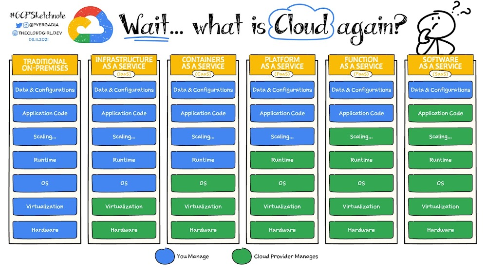

---

## 1. 클라우드(Cloud)

### 클라우드 컴퓨팅(Cloud Computing)이란?

클라우드 컴퓨팅(Cloud Computing)은 인터넷("클라우드")을 통해 서버, 스토리지, 데이터베이스, 네트워킹, 소프트웨어, 분석, 인텔리전스 등의 컴퓨팅 서비스를 제공하는 모든 것이다.

클라우드 컴퓨팅은 배포 유형에 따라 다음으로 분류할 수 있다.

<br>

* **퍼블릭 클라우드(Public Cloud)**
  * 컴퓨팅 리소스를 인터넷을 통해 사용할 수 있는 주문형 서비스로 볼 수 있다
  * 기업에서 직접 리소스를 조달하거나 구성, 관리할 필요가 없으며 사용한 만큼만 비용을 지불하면 된다
  * 상대적으로 운영 비용이 저렴하고 확장성이 용이하다


* **프라이빗 클라우드(Private Cloud)**
  * 단일 비즈니스 또는 조직에서 독점적으로 사용되는 클라우드 컴퓨팅 리소스를 의미한다
  * 보통 서비스와 인프라가 개인 네트워크에서 유지 관리된다
  * 기업에서 독자적으로 사용하는 IDC를 생각하면 편하다
  * 초기, 유지보수 비용이 상대적으로 비싸다
  * 보안이 상대적으로 강하다


* **하이브리드 클라우드(Hybrid Cloud)**
  * 퍼블릭/프라이빗 클라우드를 모두 사용하는 것
  * 대다수의 규모 있는 기업들은 하이브리드 클라우드를 사용한다
  * 일부 서비스나 기능만 퍼블릭 클라우드에서 사용하거나, 백업 용도로 퍼블릭을 사용하거나, 프라이빗에서 퍼블릭으로 마이그레이션하는 상황이거나, 등 기업마다 운영 방법은 다르다 

<br>

> 클라우드 컴퓨팅은 배포 유형이 아닌 서비스 유형에 따라서 분류할 수 있다.
>
> 이 포스트에서 사용하는 클라우드라는 용어는 퍼블릭 클라우드를 가리킨다.
> {: .prompt-info }

<br>

---

### 클라우드를 사용하는 이유

그러면 클라우드 컴퓨팅을 사용하는 이유는 뭘까? 먼저 클라우드 서비스가 없는 시대로 돌아갔다고 가정해보자.

기존의 전통적인 서버실(IDC)을 운영하기 위해서는 다음과 같은 어려움이 존재한다.

* 물리적 공간과 확장성(scalability)을 고려해야 한다. 
  * 예를 들어서, 사업이 잘 되어 트래픽이 몰리는 경우 운영을 위해서 서버(컴퓨터) 10대를 추가했다고 가정해보자. 만약 트래픽이 적어지면 추가한 10대의 서버를 낭비하게 되는 것이다.
  * 추후에 트래픽이 다시 증가할 수 있기 때문에 중고로 다시 내다파는 것도 현명하지 못한 결정이다.


* 기존의 서버실은 물리적으로 서버를 관리하고 인프라를 구성하기 위한 인원이 필요하다
  * 따로 인원을 고용하지 못하는 상황이라면 개발자가 직접 작업해야하는 경우도 빈번하다


* 재난 상황시 서비스 운영의 어려움
  * 재난 상황에서 해당 서버들을 사용하지 못해서 서비스가 운영되지 못하는 상황은 고가용성(HA)를 유지하지 못한다는 뜻이다
  * 그렇다고 여러 지역에 IDC를 운영하는 것도 비용적으로 비효율적일 수 있다

<br>

이외에도 수 많은 어려움이 존재한다.

반면에 클라우드를 사용하게 되면 다음의 효과를 누릴 수 있다.

* 빠른 구축 속도와 확장성의 용이함
  * 트래픽이 몰리는 시점에만 서버를 늘렸다가, 트래픽이 줄어들면 다시 줄이는 유연한 확장이 가능하다
  * 수요 예측 실패에 따른 손해가 적다


* 다양한 과금 모델이 존재한다
  * 초 단위의 on-demand 가격 측정이 가능(사용한 시간 만큼만 지불하는 형식으로 사용 가능하다)
  * 클라우드 프로바이더들은 on-demand 가격 모델이 가지는 유연성을 희생해서 기간 약정으로 더 저렴하게 사용할 수 있는 과금 모델들을 제공한다


* 재난 대처
  * 서비스가 클라우드를 통해 운영되기 때문에 재난 상황에서 서비스 운영이 중단되거나 하는 문제를 방지 할 수 있다


* 개발자가 직접 설정해야 했던 작업을 클라우드에서 쉽게할 수 있다(cloud managed service)
  * 다양한 소프트웨어, 운영체제 환경을 미리 설치/설정해놓은 상태로 제공한다
  * 유지 보수가 상대적으로 쉽다 

<br>

쉽게 말해서, 클라우드를 사용하면 IDC를 구축할 필요 없이 필요한 만큼만 리소스(서버)를 사용/확장이 가능하다. 또한 비용은 막대한 초기 비용을 소모할 필요 없이 사용한 만큼만 지불하면 된다.

<br>

---

### PaaS, IaaS, Saas

클라우드 서비스를 다음과 같이 분류할 수 있다.

* **SaaS(Software as a Service)**
  * SaaS는 전체 애플리케이션 스택을 제공하여 고객이 액세스하고 사용할 수 있는 전체 클라우드 기반 애플리케이션을 제공한다
  * SaaS 제품은 서비스 제공업체에서 모든 업데이트, 버그 수정, 전반적인 유지관리 등을 전적으로 관리해주며 즉시 사용할 수 있다
  * 대부분의 SaaS 애플리케이션은 웹브라우저를 통해 직접 액세스할 수 있으므로 고객이 기기에 아무것도 다운로드하거나 설치할 필요가 없다
  * 정리하자면 아무런 세팅 없이 바로 사용할 수 있다


* **PaaS(Platform as a Service)**
  * PaaS는 클라우드를 통해 애플리케이션을 개발하는 데 필요한 모든 하드웨어 및 소프트웨어 리소스를 제공하고 관리한다
  * 개발자와 IT 운영팀은 인프라 또는 플랫폼을 자체적으로 빌드하고 유지관리할 필요 없이 PaaS를 사용하여 애플리케이션을 개발, 실행, 관리할 수 있다
  * 고객은 여전히 코드를 작성하고 데이터와 애플리케이션을 관리해야 하지만, 클라우드 서비스 제공업체에서 앱을 빌드하고 배포하는 환경을 유지 관리한다
  * 정리하자면 인프라, OS, 기타 소프트웨어 실행에 필요한 환경을 제공한다
  * 개발자가 코드만 올려서 돌릴 수 있도록 구성되어 있다
  * 예) AWS Lambda, Firebase, Google App Engine


* **IaaS(Infrastructure as a Service)**
  * IaaS는 클라우드를 통해 컴퓨팅, 스토리지, 네트워킹, 가상화와 같은 주문형 인프라 리소스를 조직에 제공한다
  * 고객이 자체 데이터 센터 인프라를 관리, 유지관리 또는 업데이트할 필요는 없지만 운영체제, 미들웨어, 가상 머신, 앱 또는 데이터를 책임진다
  * 정리하자면 인프라만 제공하고, OS나 환경을 직접 설치하며 필요한 소프트웨어를 직접 개발해서 사용해야 한다
  * 가상의 컴퓨터 하나를 빌리는 것과 비슷하다
  * 예) AWS EC2

<br>


_https://www.stackscale.com/blog/cloud-service-models/_

<br>


_https://cloud.google.com/learn/paas-vs-iaas-vs-saas?hl=ko_

<br>

---

## 2. AWS(Amazon Web Service)

### AWS 소개

아마존 웹 서비스(AWS)는 아마존닷컴이 운영하고 있는 점유율 세계 1위의 클라우든 컴퓨팅 플랫폼이다. 

AWS는 국내(한국) 시장 점유율이 가장 높고 그 만큼 한국어로 된 레퍼런스도 많기 때문에 클라우드를 사용하는 경우 AWS를 사용하는 것을 권장한다. ~~사실 클라우드 프로바이더들이 제공하는 서비스들은 사용법이 다 거기서 거기이다.~~

이후 포스트들은 AWS에서 제공하는 각종 서비스와 환경을 살펴보고, 사용법까지 알아볼 예정이다.

<br>

---

### AWS 리전(Region)

AWS가 전 세계에서 데이터 센터를 클러스터링하는 물리적 위치를 리전(region)이라고 한다.

<br>


_https://aws.amazon.com/ko/about-aws/global-infrastructure/regions_az/_

* AWS의 서비스를 제공하는 데이터 센터의 물리적인 위치를 리전이라고 한다
* 전 세계에 흩어져 있으며, 대륙별로 묶여 있다
* 각 리전에는 고유의 코드가 부여되어 있다
  * Asia Pacific (Seoul) : `ap-northeast-2`
  * US West (N. California) : `us-west-2`
* 리전별로 가능한 서비스가 다를 수 있다
  * 예) `us-east-1`에는 모든 종류의 서비스가 가능하기 때문에, 새로운 서비스를 사용해보고 싶다면 `us-east-1` 리전을 사용하면 된다

<br>

위의 특징에서도 언급했지만 모든 리전이 똑같지 않다는 것을 알 수 있다.

리전을 선택할 때 다음을 고려하며 선택하자.

* 지연 속도
  * 내가 서비스하는 지역과 가까운 리전을 사용할수록 지연이 낮아진다
* 사용 가능한 서비스
  * 리전별로 가능한 서비스가 다르다
* 법률(데이터, 서비스 제공)
  * 데이터의 종류에 따라 국내에서만 저장해야하는 경우가 있을 수 있다
  * 예) 개인 정보는 국외에 저장하지 못한다

<br>

---

### AWS 가용영역(Availability Zone, AZ)

AZ(가용 영역)는 AWS 리전의 중복 전력, 네트워킹 및 연결이 제공되는 하나 이상의 개별 데이터 센터로 구성된 클러스터이다. 

<br>


_https://www.w3schools.com/aws/aws_cloudessentials_awsavailabilityzones.php_

<br>


_리전 코드와 가용영역_

* 가용영역(AZ)는 리전의 하부 단위로 볼 수 있다
* 하나의 리전은 반드시 3개 이상의 AZ으로 구성된다
* 하나의 AZ은 하나 이상의 데이터 센터로 구성된다
* 각 AZ는 높은 대역폭과 지연 시간이 짧은 네트워크로 연결되어 있다
* 각 AZ는 재난을 대비해 일정 거리 이상 떨어져 있다

<br>

각 계정별로 AZ의 코드가 같다고 해서 실제 위치가 같지는 않다. 예를 들어서 User1의 AZ-A는 User2의 AZ-A와 위치상 랜덤으로 배정하기 때문에 위치가 같지 않을 확률이 높다. 이렇게 하는 이유는 보안 강화와 더불어서 하나의 AZ로 트래픽이 몰리는 것을 방지하기 위해서이다. 

<br>

---

### AWS 글로벌 서비스

AWS는 서비스가 제공되는 지역의 기반에 따라 글로벌(전역) 서비스, 리전(지역) 서비스, AZ(가용영역) 서비스로 분류한다.

<br>


_https://jayendrapatil.com/aws-global-vs-regional-vs-az-resources/#google_vignette_

* **글로벌 서비스(Global)**
  * 데이터 및 서비스를 전세계 모든 지역에서 공유한다
  * CloudFront(CDN)
  * IAM
  * Route53
  * WAF
* **리전 서비스(Region)**
  * 리전을 기반으로 데이터 및 서비스를 제공한다
  * AWS 대부분의 서비스가 리전 서비스이다
  * S3 : 글로벌 서비스들이 가지는 특성을 몇몇 가지고 있지만 데이터는 리전에 종속된다
* **가용영역 서비스(Zonal)**
  * AZ를 기반으로 데이터 및 서비스를 제공한다

<br>

이런 서비스의 분류를 알아야하는 이유는 해당 서비스들이 운영되는 범위(scope)를 이해하기 위해서이다.

**예시**

* EC2 인스턴스는 AZ에 묶여 있지만, 해당 인스턴스를 생성할 때 리전을 선택해서 만든다.
* EC2의 오토 스케일링(auto-scaling)은 같은 리전안에서의 여러 AZ를 걸쳐서 사용이 가능하지만, 서로 다른 리전을 걸쳐서 사용하지는 못한다.
* VPC는 리전 단위로 생성하지만, 서브넷(subnet)은 AZ 단위로 존재한다.

<br>

> 사실 이런 리전 서비스, 가용영역 서비스의 차이는 해당 서비스들을 사용해보면 바로 이해할 수 있다.
{: .prompt-tip }

<br>

---

### ARN(Amazon Resource Name)

ARN은 AWS의 모든 리소스에 부여하는 리소스의 고유 아이디이다.

IAM 정책, Amazon Relational Database Service(RDS) 태그 및 API 호출과 같은 모든 AWS에서 리소스를 명료하게 지정해야 하는 경우 ARN이 필요하다.

쉽게 말해서 AWS 리소스를 형식화된 방법으로 인증, 정책, API를 사용하기 위한 고유 식별자로 생각하면 된다.

<br>

ARN의 일반적인 형식은 다음과 같다.

```
arn:partition:service:region:account-id:resource-id
arn:partition:service:region:account-id:resource-type/resource-id
arn:partition:service:region:account-id:resource-type:resource-id
```

* 예시
* IAM 사용자 - `arn:aws:iam::123456789012:user/johndoe`
* VPC - `arn:aws:ec2:us-east-1:123456789012:vpc/vpc-0e9801d129EXAMPLE`

<br>

와일드 카드(`*`)를 사용해서 다수의 리소를 지정하는 것도 가능하다.

```
arn:aws:iam::123456789012:user/Development/product_1234/*
arn:aws:iam::123456789012:user/*
arn:aws:iam::123456789012:group/*
```

* `user/*` : 모든 사용자를 의미
* `group/*` : 모든 그룹을 의미

<br>

---

## 3. AWS 유저

### Root User

AWS 계정을 처음 생성할 때 루트 유저(root user)와 기본 리소스(VPC)가 생성된다. 추후에 계정에 별명을 지정할 수 있다.

루트 유저의 특징은 다음과 같다.

* 생성한 계정의 모든 권한을 가지고 있음
* 생성시 만든 이메일 주소로 로그인을 한다
* 탈취당하는 경우 복구가 힘들기 때문에 가급적이면 사용하지 않고, 보안을 위해 MFA(다요소 인증) 등의 설정을 해야한다
* 루트 유저는 관리용으로만 사용한다(계정 설정 관리, 권한 부여, 비용 관리)
* 루트 유저로 AWS API 호출은 하면 안된다 ([공식 문서](https://docs.aws.amazon.com/IAM/latest/UserGuide/id_root-user_manage_add-key.html)를 살펴보면 루트 유저로 access key를 생성하지 않는 것을 강력히 권장하고 있다)

<br>

---

### IAM User

* IAM(Identity and Access Management)을 통해서 생성한 유저
  * IAM에 대해서는 뒤에서 자세히 다룬다
* 만들 때 주어진 아이디로 로그인을 한다 (이메일 로그인이 아니다)
* 기본 권한 없다 : 루트 유저를 통해 권한을 부여 받아야한다
  * Principle of least Privilege를 지키자 (필요한 최소한의 권한만 부여하자)
* IAM 유저는 사람이 아니라 애플리케이션이라는 주체를 대표할 수도 있다
* 관리를 제외한 모든 작업은 IAM 유저를 통해서 진행하자
  * AWS API 호출은 IAM 유저를 통해서 한다
  * Access Key/Secret Access Key를 사용한다
* IAM 유저도 루트 유저와 마찬가지로 MFA를 설정하자

<br>


_IAM 유저 생성_

<br>


_IAM 유저에 정책 부여_

* 정책(policy) 부여를 통해 필요한 권한을 줄 수 있다

<br>

---

## 4. IAM (Identity and Access Management)

### IAM 소개

IAM은 AWS 리소스에 대한 액세스를 안전하게 제어할 수 있는 글로벌 서비스이다. IAM을 사용하면 사용자가 액세스할 수 있는 AWS 리소스의 제어 권한을 중앙에서 관리할 수 있다.

IAM은 대표적으로 다음의 기능을 제공한다.

* 계정 관리 및 사용자의 AWS 서비스와 리소스에 대한 액세스 관리
* 사용자 및 그룹의 생성과 관리, 액세스에 대한 허용 및 거부
* 계정에 별명 부여
* 사용자의 역할(Role) 설정

<br>


_https://jayendrapatil.com/aws-iam-overview/_

IAM은 4가지 부분으로 이루어져있다.

* **사용자(User)**
  * 실제 AWS를 사용하는 개인 또는 애플리케이션


* **그룹(Group)**
  * 사용자들의 집합
  * 그룹에 속한 사용자는 그룹에 부여된 권한을 사용할 수 있다


* **역할(Role)**
  * AWS 리소스에 부여해서 AWS 리소스가 무엇을 할 수 있는지 정의한다
  * 다른 사용자가 역할을 부여 받아서 사용할 수 있다
  * 역할을 바꾸어 가며 서비스를 사용할 수 있다


* **정책(Policy, Permission)**
  * 사용자, 그룹, 역할이 무엇을 할 수 있는지를 포함한 문서
  * JSON 형식으로 정의한다

<br>

---

### 접근 권한 검증

<br>

사용자가 특정 리소스에 접근할때 정책에 따라 접근 권한을 어떻게 검증하는지 알아보자.

<br>


<p align='center'>출처 - https://k21academy.com/amazon-web-services/aws-identity-and-access-management-iam/</p>

사용자에 대한 권한 검증은 대략적으로 다음 순서로 진행된다.

1. 사용자에게 S3 버킷을 이용할 수 있는 정책이 부여되었는가?
2. 사용자가 속한 그룹에 S3 버킷을 이용할 수 있는 정책이 부여되었는가?
3. 사용자에게 위임된 역할에 S3 버킷을 이용할 수 있는 정책이 부여되었는가?
4. 버킷에 부여된 정책에 사용자의 버킷 사용을 허용하는가?
5. 어디에도 해당되지 않으면 권한이 없다는 것

<br>

> 위의 설명은 아주 대략적인 과정만 나타내고 있기 때문에 참고만 하자. 실제로는 설정과 정책에 따라 훨씬 복잡하게 작용할 가능성이 높다.
{: .prompt-warning }

<br>

서비스에도 정책을 부여할 수 있다. 예를 들어 AWS Lambda에서 S3 버킷을 사용할 수 있는지에 대해 정책을 부여할 수 있다.

<br>

---

### IAM 자격 증명 보고서(Credential Report)

IAM 자격 증명 보고서를 생성할 수 있다.

* 계정의 모든 증명 상태를 나열하는 보고서를 생성할 수 있다
* 암호, 액세스 키, MFA 디바이스, 서명 인증서를 포함한 사용자 자격 증명의 상태가 포함된다
* AWS 콘솔, CLI, API 에서 생성 요청 및 다운로드를 할 수 있다
* 4시간에 한번 생성이 가능하다

<br>

---

## Reference

1.  [https://docs.aws.amazon.com/vpc/latest/userguide/](https://docs.aws.amazon.com/vpc/latest/userguide/)
2.  [https://docs.aws.amazon.com/ko_kr/AWSEC2/latest/UserGuide/concepts.html](https://docs.aws.amazon.com/ko_kr/AWSEC2/latest/UserGuide/concepts.html)
3.  [https://docs.aws.amazon.com/IAM/latest/UserGuide/id_root-user_manage_add-key.html](https://docs.aws.amazon.com/IAM/latest/UserGuide/id_root-user_manage_add-key.html)
4.  [쉽게 설명하는 AWS](https://www.youtube.com/watch?v=9nBq6PxDvp4&list=PLfth0bK2MgIan-SzGpHIbfnCnjj583K2m&index=5)
5.  [https://k21academy.com/amazon-web-services/aws-identity-and-access-management-iam/](https://k21academy.com/amazon-web-services/aws-identity-and-access-management-iam/)
6.  [https://cloud.google.com/learn/paas-vs-iaas-vs-saas?hl=ko](https://cloud.google.com/learn/paas-vs-iaas-vs-saas?hl=ko)
7.  Naver Connection Boostcamp AI Tech 5th - Product Serving(변성윤)
