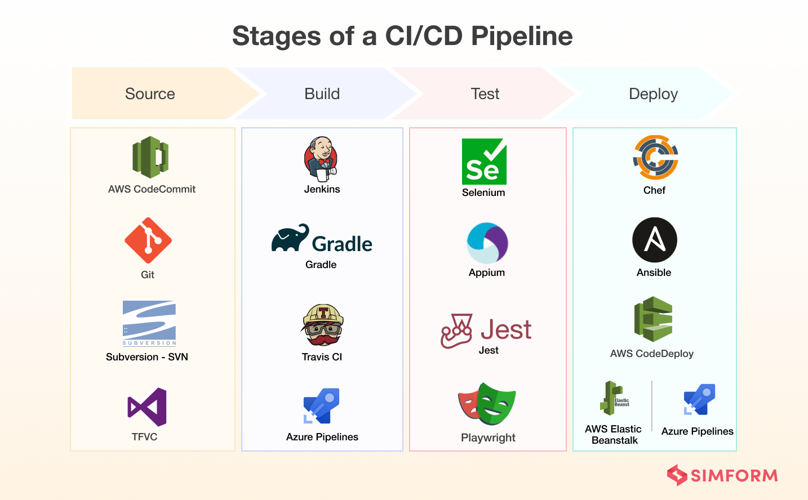

---
## 개발 환경
### Local
* 각자의 컴퓨터에서 개발
* 각 환경을 통일 시키기 위해 docker 또는 pyenv, venv 사용

### Development

* Local에서 개발한 기능을 테스트 하는 환경
* 테스트 서버

### Staging

* Production 환경에 배포하기 전에 운영하거나 보안, 성능을 측정하는 환경
* Staging 서버

### Production
* 실제 서비스를 운영하는 환경
* 운영 서버

개발 환경을 나누는 것은 실제 운영중인 서비스에 장애가 생기는 것을 방지하기 위함. 만약에 dev, staging, production 환경이 동일하다면 소스 코드를 저장하는 즉시 반영이 된다고 생각하면 됨.

 

## CI/CD란?

### Continuous Integration(지속적 통합)

* 새로 작성한 코드 변경 사항이 Build, Test를 진행한 후 Test Case를 통과하는지 확인
* 지속적으로 코드 품질 관리

### Continuous Delivery, Deployment(지속적 배포)

* 작성한 코드가 신뢰 가능한 상태가 되면(CI를 통과하면) 자동으로 배포될 수 있도록 하는 과정
* CI 이후 CD
* development, staging, main 브랜치에 merge 되는 경우 코드가 자동으로 서버에 배포

간단하게 요약하자면

* CI : 빌드, 테스트의 자동화

* CD : 배포 자동화

 

## CI/CD Solutions

* Jenkins, Travis CI, AWS CodeDeploy, Github Action etc..

출처 - https://www.simform.com/blog/scalable-ci-cd-pipeline-examples/ 

 

## Github Action

* Github에서 출시한 기능으로, 소프트웨어 workflow 자동화를 도와주는 도구
* Test code, Deployment, Shell script
* Github tag, release 자동 설정
* 새로운 브랜치 생성시 특정 작업 실행
* 다양한 Workflow template이 존재 https://github.com/sdras/awesome-actions

* Private repo는 유료
  * 유료와 무료 사이의 제한이나 제약 조건, 과금에 대한 내용 찾아봐서 사용

 

## Github Action 사용 방식

1. 코드 작업
2. 작업 후, Github Action으로 무엇을 할 것인지 생각
3. 사용할 Workflow 정의
4. Workflow 정의 후 정상 작동하는지 확인

 

## Github Action Workflow

### Workflow

* 여러 Job으로 구성, Event로 Trigger되는 자동화된 프로세스
* Workflow 파일은 YAML로 작성, 레포지토리의 ./github/workflows에 저장

### Event

* Workflow를 trigger하는 특정 행동, 규칙
* Example
  * 특정 브랜치로 Push
  * 특정 브랜치로 Pull Request
  * 특정 시간대에 반복

### Jobs

* Runner에서 실행되는 Steps들의 조합
* 여러 Jobs이 있는 경우 병렬로 실행, 순차적 실행도 가능
  * 다른 Job에 의존 관계를 가질 수 있음
  * Example) Job A Success -> Run Job B

### Steps

* Job에서 실행되는 개별 작업
* Action을 실행하거나 쉘 커맨드 실행
* 하나의 Job에서 데이터를 공유할 수 있음

### Actions

* Workflow에서 제일 작은 단위
* Job을 생성하기 위해 여러 step을 묶은 개념
* 재사용 가능한 component

### Runner

* Github Action도 일종의 서버에서 실행되는 개념
* Runner -> Workflow가 실행될 서버
  * Github-hosted runner
  * Self-hosted runner

 

## 참고

---

1. [https://github.com/zzsza](https://github.com/zzsza)
2. Naver Connection Boostcamp AI Tech 5th - Product Serving(변성윤)

