---

## 1. Amazon EC2

### EC2 소개

> Amazon Elastic Compute Cloud (Amazon EC2) provides on-demand, scalable computing capacity in the Amazon Web Services (AWS) Cloud. Using Amazon EC2 reduces hardware costs so you can develop and deploy applications faster. You can use Amazon EC2 to launch as many or as few virtual servers as you need, configure security and networking, and manage storage. You can add capacity (scale up) to handle compute-heavy tasks, such as monthly or yearly processes, or spikes in website traffic. When usage decreases, you can reduce capacity (scale down) again.
{: .prompt-info }

 

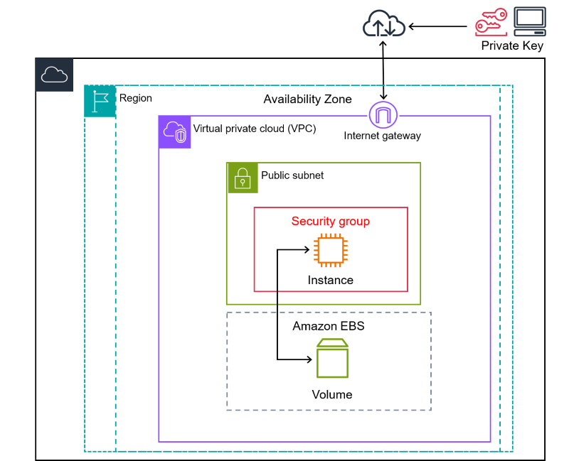
_https://docs.aws.amazon.com/ko_kr/AWSEC2/latest/UserGuide/concepts.html_

 

EC2(Elastic Cloud Compute)는 간단히 말해서 AWS에서 제공해주는 클라우드 컴퓨팅 서비스이다. 

EC2를 통해서 컴퓨터(서버)를 빌려 쓰는것으로 이해하는것이 제일 편하다. 물론 아마존은 EC2외에도 다양한 클라우드 서비스를 제공한다.

그러면 왜 EC2를 알아야할까? 

AWS는 사람들이 많이 찾는 기능이나 솔루션을 이미 상용 서비스로 만들어놓은 경우가 많다. 그러나 이런 상용 서비스들도 결국에는 EC2를 이용한 서버 위에서 돌아가고 있는 것이다. 소프트웨어와 환경을 직접 설치해가면서 사용하는 것으로 AWS 환경과 해당 소프트웨어에 대한 이해도를 높일 수 있다.

 

---

### EC2 사용 케이스

EC2를 사용하는 여러 케이스를 살펴보자.

* 웹 호스팅, 웹 애플리케이션
  * 백엔드, 프론트엔드 프레임워크로 만든 웹 서비스를 호스팅하기 위한 용도로 사용할 수 있다
* 개발/테스트 환경
  * 프로덕션에 영향을 주지 않는 샌드박스 환경을 제공하는 용도로 사용할 수 있다
* 고성능 작업/환경
  * 빅데이터 처리/분석을 위한 환경을 제공할 수 있다
  * 머신러닝
* 가상 데스크톱

 

이외에도 일반 컴퓨터(서버)로 할 수 있는 거의 모든 일을 할 수 있다.

 

---

### EC2 특성

* 초 단위의 On-demand 가격 측정
  * 가격이 초 단위로 결정 됨
  * 서비스 요금을 미리 지불할 필요 없다
  * 사용한 만큼 사용하면 된다

* 다양한 과금 모델
  * On-demand 가격 모델이 가지는 유연성을 희생해서 기간 약정으로 더 저렴하게 사용가능
  * 경매도 가능

* 빠른 구축 속도와 확장성
  * 정말 빠른 속도로 인스턴스를 늘려서 트래픽에 대응이 가능하다

* 다양한 구성방법을 지원한다
  * 머신러닝, 웹서버, 게임서버 등 특정 용도에 최적화된 서버 구성이 가능하다

* 다른 AWS 서비스와의 연동할 수 있다
  * 오토스케일링(Auto-Scaling), ELB(로드 밸런서), CloudWath(모니터링)

 

---

## 2. EC2 인스턴스 생성

### 인스턴스 생성 시작

EC2 인스턴스를 생성해보자.

먼저 AWS EC2 콘솔로 이동하자. `인스턴스 시작`이라는 버튼을 눌러서 인스턴스 생성 페이지로 이동하자.

 

_인스턴스 시작_

 

> 인스턴스의 설정은 설정창에서 표기하는 순서대로 진행하지는 않는다
{: .prompt-warning }

 

---

### 태그 설정

태그를 설정하자. 인스턴스에 설정하고 싶은 이름을 명시하자. 지금의 경우 `EC2Test`라는 이름으로 태그를 추가했다.

키는 `Name`으로 내버려두자. (기본적으로 `Name`으로 설정되어 있다)

 

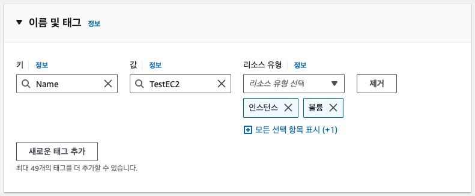_태그 설정_

 

---

### 인스턴스 유형(머신 유형) 설정

사용할 인스턴스의 유형(머신)을 선택하자. 지금의 경우 프리티어로 제공하는 `t2.micro`를 선택하고 있다.

 

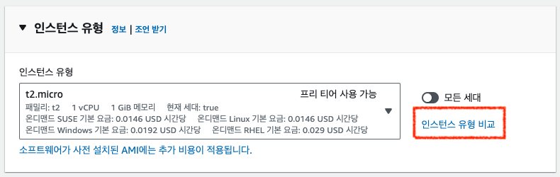_인스턴스 유형_

* 인스턴스가 사용할 머신의 성능/용도에 따라 선택이 가능하다
* `인스턴스 유형 비교`를 누르면 각 인스턴스 유형을 목록으로 확인하면서 비교할 수 있다

 

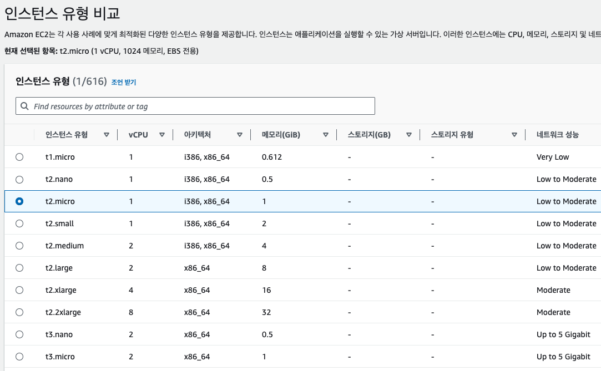_인스턴스 유형 비교_

* 인스턴스 타입별로 사용 목적에 따라 최적화된다
  * 예를 들어 메모리 위주의 유형인지, CPU 또는 그래픽 카드 위주의 유형인지 타입별로 나뉜다

 

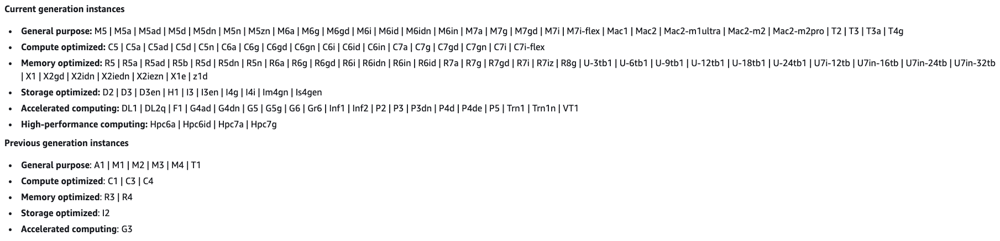_타입 유형별 이름_

* 사용 용도에 따라 타입의 유형별 이름이 부여 된다
* 하고 싶은 작업이 범용 작업, 메모리 최적화, 저장 최적화, 고성능 계산, 등에 따라서 고르면 된다

 

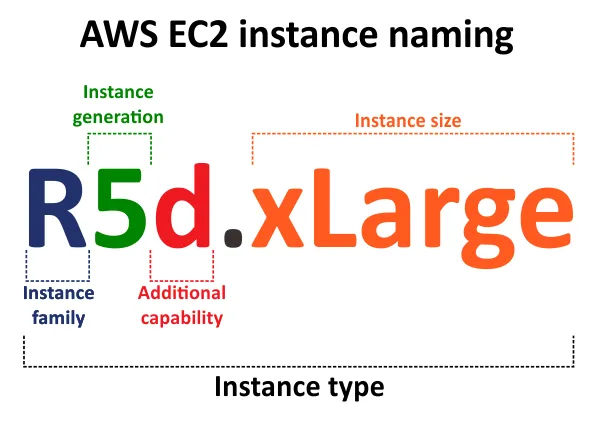_https://www.nakivo.com/blog/the-definitive-guide-to-aws-ec2-instance-types/_

* 인스턴스 유형 이름은 `{사용용도}.{세대}.{아키텍쳐 및 사용 기술}` 같은 형식으로 되어 있는 경우가 많다
  * 예) `m5a.xlarge` : `m` 타입, `5` 세대, `arm` 기반의 `xlarge` 사이즈를 가진 인스턴스

 

인스턴스의 크기(Instance size)는 CPU의 개수, 메모리의 크기, 종합적인 성능 등으로 결정이 된다.

보통 크기가 클 수록 다음의 요소도 크다.

* 메모리가 더 크다
* CPU가 더 많다
* 네트워크 대역폭이 더 크다
* EBS와 통신이 가능한 대역폭이 더 크다

 

---

### 키 페어(Key Pair) 설정

키 페어를 사용해서 인스턴스에 연결할 수 있다. 이미 존재하는 키 페어가 없다면 생성을 눌러서 새 키 페어를 생성해서 사용해야 한다.

 

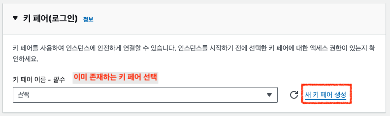_키 페어_

* `새 키 페어 생성`을 눌러서 새로운 키 페어를 생성하는 창을 열 수 있다

 

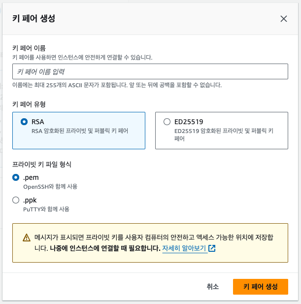_키 페어 생성 창_

* 사용하고 싶은 키 페어 이름을 명시해야한다
* 키 페어의 유형, 프라이빗 키 파일 형식을 선택할 수 있다
* `키 페어 생성`을 누면 프라이빗 키 파일이 로컬로 저장이 된다
* 인스턴스의 접속에 대한 인증 방법을 제공해서 보안을 위해 사용한다
* AWS는 비대칭 키 방식을 사용햇 인스턴스의 접근 제한한다
  * 퍼블릭 키는 인스턴스에 보관되고, 프라이빗 키는 사용자가 소유한다
  * 쉽게 말해서 인스턴스에 접속하기 위해서 사용자가 프라이빗 키를 가지고 있어야 한다(안전하게 보관해야 함!)
  * 콘솔을 통해 접속하는 경우에는 필요하지 않다
  
* FTP, SSH 연결 등에 사용할 수 있다

 

> 만약 윈도우 사용자라면 PuTTY를 통해 인스턴스를 접속할 것이기 때문에 `.ppk`를 선택해서 만들자
{: .prompt-warning }

 

---

### 네트워크, 보안 그룹 설정

네트워크 설정에서 네트워크와 방화벽(보안 그룹) 관련 설정을 편집할 수 있다.

네트워크 설정의 `편집`을 누르면, 설정을 편집할 수 있도록 폼이 변경된다.

새로운 보안 그룹을 만들어서 보안 그룹의 이름을 설정하고, 보안 규칙을 추가해서 `HTTP` 정도만 열어놓자.

 

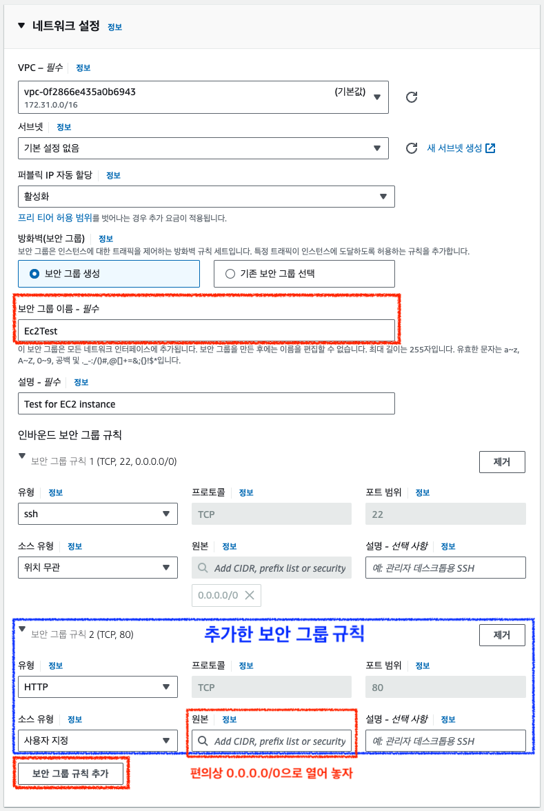_네트워크, 보안그룹_

* `보안 그룹 규칙 추가`를 통해서 생성한 보안 그룹이나 기존 보안 그룹에 규칙을 추가할 수 있다
  * 방화벽 규칙을 추가하는 것으로 생각하면 편하다
  * 보안 그룹을 생성하는 경우 보안 그룹의 이름을 필수적으로 명시해야 한다
* 나중에 보안 그룹과 관련된 포스트에서 다루겠지만 보통 저렇게 `0.0.0.0/0`으로 열어놓지 않는다. 지금은 그냥 편의를 위해 저렇게 열어놓고 사용하고 있다.

 

---

### 스토리지(EBS Volume) 설정

인스턴스가 사용할 스토리지를 설정한다. 인스턴스가 사용할 하드 디스크를 선택하는 것으로 생각하면 편하다.

일단 인스턴스를 생성하기 위해서 EBS와 관련된 설정을 따로 건들지 않고 사용할 것이다.

 

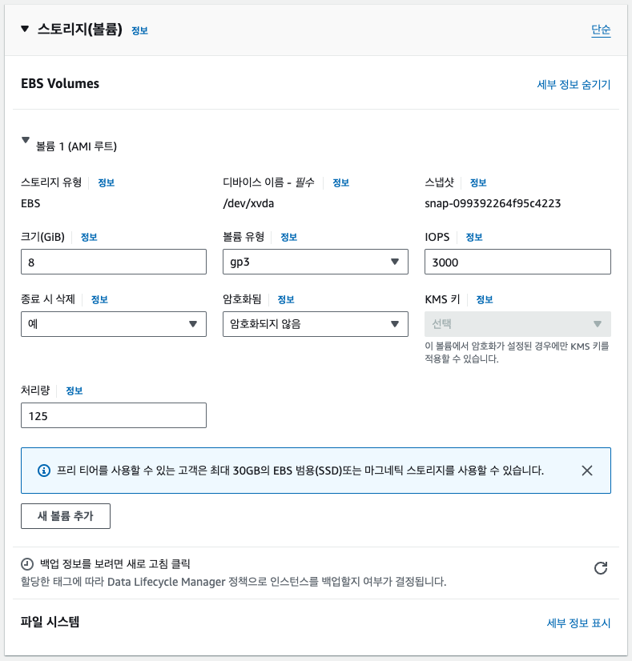_스토리지, EBS 설정_

* EBS(Elastic Block Storage)는 EC2에서 사용하는 가상의 하드디스크라고 생각하면 된다
* `종료 시 삭제`가 `예`인 경우, EC2 인스턴스가 종료되면 EBS도 같이 삭제된다
  * EBS는 EC2 인스턴스가 종료되어도 계속 유지가 가능하도록 설정할 수 있다

* 인스턴스와 EBS는 서로 네트워크로 연결 되어 있다
  * 연산을 담당하는 인스턴스와 저장을 담당하는 EBS는 물리적으로 분리되었지만, 논리적으로 네트워크로 연결되어 있다고 생각하면 편하다
  * 단순히 네트워크를 변경하는 것으로 EBS와 연결이 된 인스턴스의 변경이 가능하다

* 루트 볼륨으로 사용하면 인스턴스 종료시 같이 삭제된다 (설정을 통해 EBS만 따로 유지하는 것이 가능하다)
* EBS는 EC2와 같은 가용영역에 존재한다
  * 다른 가용영역의 EC2와 붙일 수 없다

* EBS도 다양한 유형이 존재하고, 상황에 따라서 적절한 것을 고르면 된다
  * 예) 범용 타입 : `GP3`

 

> 스냅샷(Snapshot)
>
> * 특정 시간의 EBS 상태의 저장본이다
> * 스냅샷을 통해 특정 시간의 EBS 복구가 가능하다
> * S3에 저장한다
>   * 증분식 저장 (변화하는 부분만에 대해서 저장을 한다)
>   * ~~깃의 버전 관리랑 비슷한거 같기도 하고..~~
  {: .prompt-info }

 

---

### AMI(Amazon Machine Image)

#### AMI 설정하기

인스턴스의 AMI를 설정하자. 현재 프리티어로 제공하는 Amazon Linux를 사용하고 있다.

 

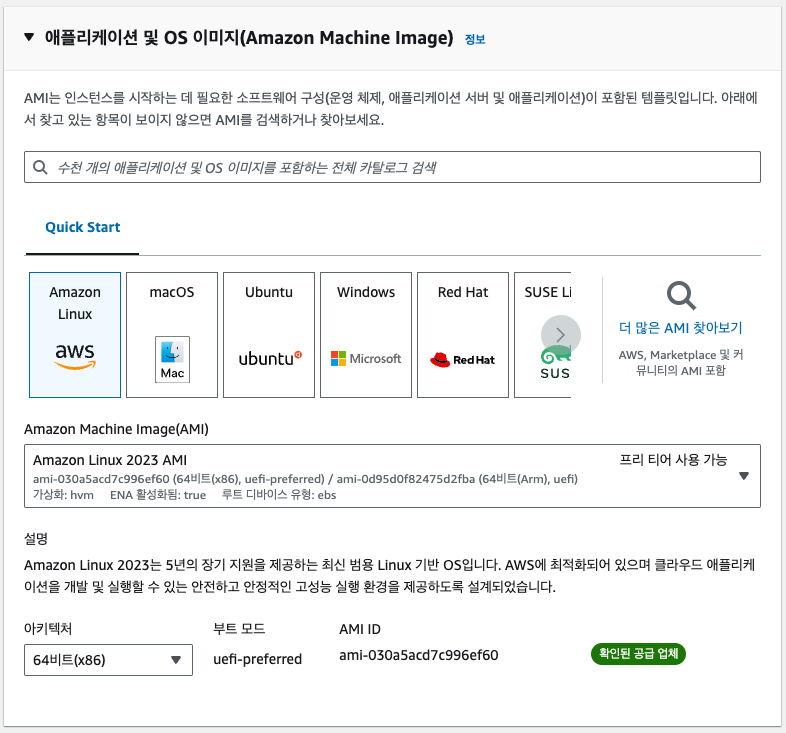_AMI 설정_

* AMI는 EC2 인스턴스를 실행하기 위한 정보를 담고 있는 이미지이다
* AMI를 사용하여 EC2를 복제하거나 다른 리전 또는 계정으로 전달할 수 있다
  * 현재 상태의 AMI를 완전히 복제해서 다른 유저에게 전달 가능

* 스냅샷 기반으로 AMI를 구성할 수 있다

* AMI의 구성은 다음과 같다
  * 1개 이상의 EBS 스냅샷
  * 루트 볼륨에 대한 템플릿 (운영체제, 애플리케이션 서버, 애플리케이션)
    * S3에 저장된 템플릿을 기반으로 생성
  * 사용 권한 (어떤 계정이 사용할 수 있는지)
  * 블록 디바이스 맵핑 (EBS가 무슨 용량으로 몇 개가 붙는지)

* AMI는 EBS 기반과 인스턴스 저장 기반을 선택할 수 있다
  * 인스턴스 스토리지 기반
    * 인스턴스 안에 스토리지가 존재한다
    * S3에 저장된 템플릿을 기반으로 생성된다
    * EBS와 다르게 스토리지가 인스턴스 안에 물리적으로 존재한다고 생각하면 편하다
    * 속도가 상대적으로 빠르다
    * 인스선스 스토리지는 인스턴스가 삭제되면 같이 삭제되는 것을 주의하자
  * EBS 기반
    * 스냅샷을 기반으로 루트 디바이스 생성

 

---

#### AMI 복사하기(이미지 생성하기)

> 해당 이미지 생성 부분은 인스턴스를 생성한 뒤에 진행해야한다.
{: .prompt-warning }

 

EC2 인스턴스 콘솔에서 생성된 인스턴스를 오른쪽 클릭해서 `이미지 및 템플릿 > 이미지 생성`을 누르자.

 

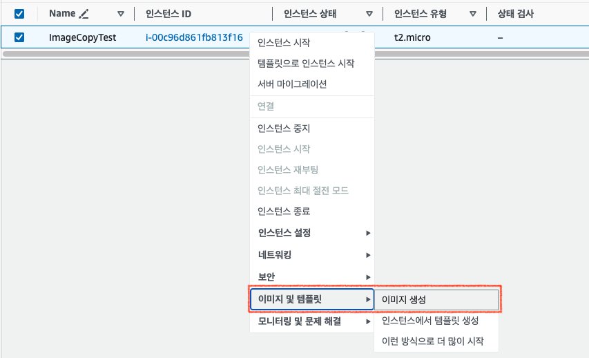_AMI 생성_

 

`이미지 생성`을 누르면 다음과 같은 창으로 이동한다. 여기서 생성할 AMI(이미지)의 이름을 설정하고 EBS, 태그 추가와 같은 추가적인 설정도 할 수 있다.

 

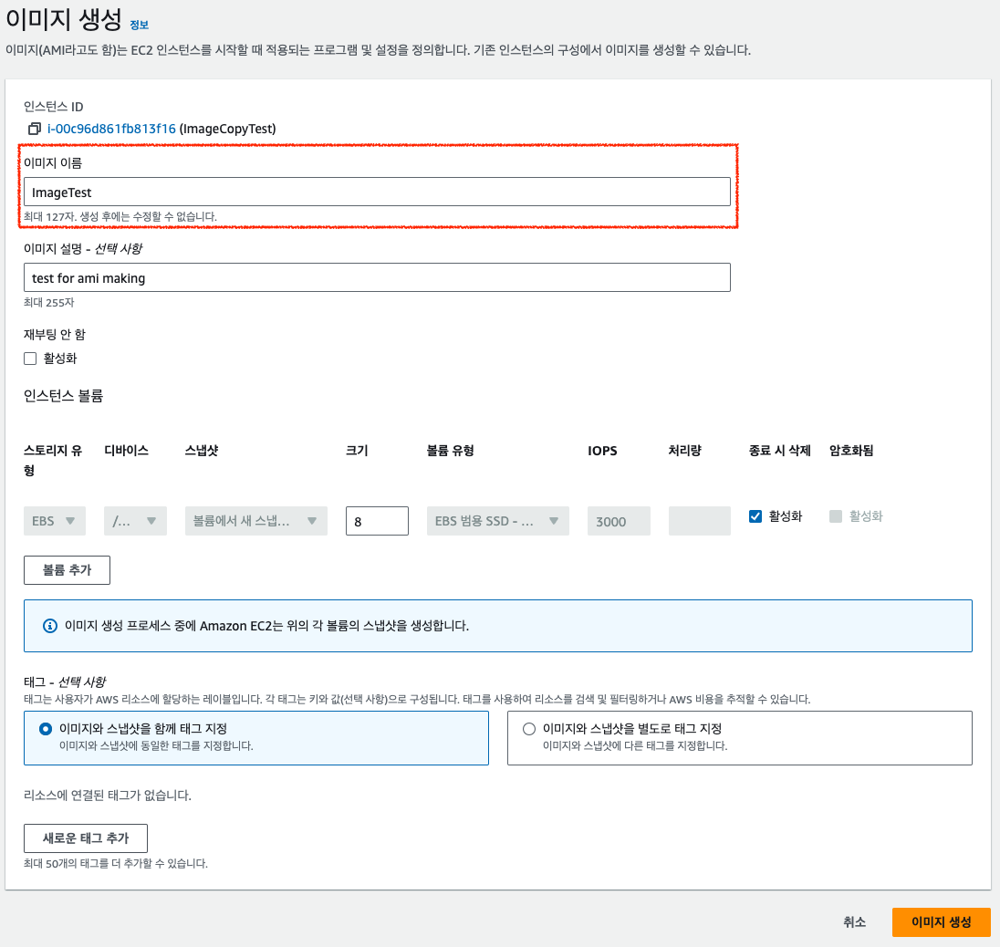_AMI 생성_

 

이미지를 생성하고 일정 시간을 기다리면 만들어 놓은 이미지를 사용할 수 있다.

만든 이미지를 사용해보기 위해서 인스턴스를 새로 만들어보자. `인스턴스 시작` 버튼을 눌러서 인스턴스 구성 창의 AMI 탭으로 이동하자.

 

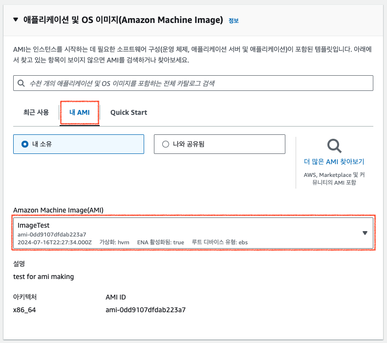_우리가 만든 AMI 사용_

 

`내 AMI`를 누르면 내가 생성했던 AMI를 확인할 수 있다. 이전에 만들었던 `ImageTest` 이미지가 존재하는 것을 확인할 수 있다.

이 처럼 기존에 사용했던 인스턴스의 AMI를 복사해서 손쉽게 해당 인스턴스의 설정을 그대로 사용할 수 있다. 그 뿐만 아니라 해당 인스턴스의 EBS에 저장된 내용도 함께 복사되기 때문에 특정 애플리케이션의 환경을 복제하기에 편하다. 

 

---

### 인스턴스 시작

`인스턴스 시작`을 누르고, EC2 콘솔에서 만들어진 인스턴스를 확인하자.

 

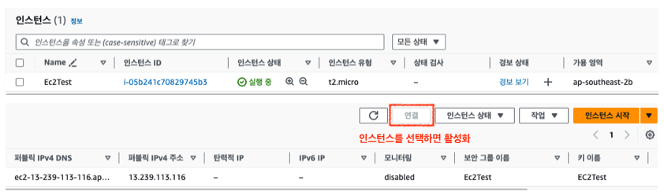_생성된 인스턴스 확인_

 

해당 인스턴스를 눌러서 관련된 세부 정보를 확인하는 것이 가능하다.

인스턴스를 선택한 상태에서 우측 위의 `연결`을 눌러서 해당 인스턴스에 접속한 터미널로 이동할 수 있다.

 

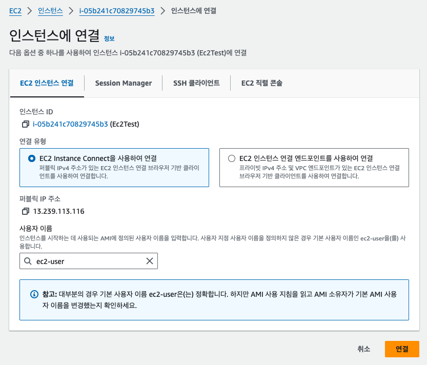_인스턴스 연결_

 

`연결`을 누르면 된다.

 

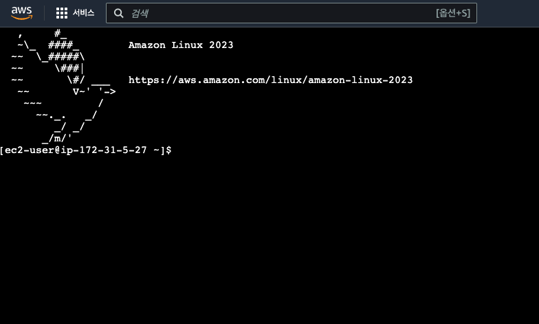_EC2 터미널_

 

이제 터미널을 통해 웹서버를 설치하는 것 처럼, 사용하고 싶은 소프트웨어를 설치해서 사용하면 된다.

 

>  보안 그룹에서 HTTP를 열어 놓았기 때문에, 웹서버를 설치하면 인스턴스의 퍼블릭 아이피(Public IP)를 통해 테스트 페이지를 확인할 수 있을 것이다.
{: .prompt-info }

 

> 인스턴스의 사용을 완료했으면 꼭 인스턴스를 `종료` 시키자!
>
> `중지`를 하는 경우 EBS의 요금은 계속 반영된다.
>
> 참고로 `중지`를 했다가 다시 시작하는 경우 퍼블릭 IP가 변경된다는 것을 꼭 알아두자. (프라이빗 IP는 변하지 않는다)
{: .prompt-danger }

 

---

## Reference

1. [https://docs.aws.amazon.com/ko_kr/AWSEC2/latest/UserGuide/concepts.html](https://docs.aws.amazon.com/ko_kr/AWSEC2/latest/UserGuide/concepts.html)
1. [쉽게 설명하는 AWS](https://www.youtube.com/watch?v=9nBq6PxDvp4&list=PLfth0bK2MgIan-SzGpHIbfnCnjj583K2m&index=5)

