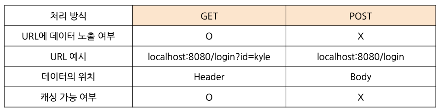

---
## 서버 구성 Use Case
* 앱/웹 서비스의 서버
* 머신러닝 서버
* 하나의 큰 서버가 사용 영역 별로 분할 되어 사용되는 경우
* 서비스 서버에서 머신러닝 서버로 예측 요청하며 통신하는 경우

---

## 서버의 형태

### 모놀로식 아키텍쳐(Monolothic Architecture)

* 하나의 큰 서버
* 모든 것을 하나의 큰 서버에서 처리
* 전체 서버를 배포해야해서 배포가 느림

 

### 마이크로 서비스 아키텍쳐(Micro Service Architecture - MSA)

* 개별의 서버로 구성하고 서로 통신하도록 하는 경우

---

## Rest API

* REST API는 정보를 주고 받을 때 널리 사용되는 형식으로 생각하면 된다
* REST라는 형식의 API
  * 각 요청이 어떤 동작이나 정보를 위한 것을 요청 모습 자체로 추론 할 수 있음
  * 기본적인 데아터 처리 CRUD : Create, Read, Update, Delete

* Representational State Transfer의 약자
  * Resource, Method, Representation of Resource로 구성
* 클라이언트 : 요청을 하는 플랫폼
  * 브라우저 같은 웹 
  * 앱
  * 우리가 파이썬을 사용해 요청하는 것도 클라이언트
* Resource : Unique한 ID를 가지는 리소스, URI
* Method : 서버에 요청을 보내기 위한 방식 : GET, POST, PUT, PATCH, DELETE

---

## URI, URL

1. URL : Uniform Resource Locator, 인터넷 상 자원의 위치
2. URI : Uniform Resource Identifier, 인터넷 상의 자원을 식별하기 위한 문자열의 구성

* URI는 URL을 포함, URI > URL

---

## HTTP Method

### GET vs POST

1. GET : 정보 요청을 위해 사용(Read)
   * 어떤 정보를 가져와서 조회하기 위해 사용되는 방식
   * URL에 변수(데이터)를 포함시켜서 요청함
   * 데이터를 헤더에 포함하여 전송함
   * URL에 데이터가 노출되어 보안에 취약
   * 캐싱할 수 있음(다른 방법과 비교해서 빠를 수 있음)

2. POST : 정보를 입력하기 위해 사용(Create)

   * 데이터를 서버로 제출해 추가 또는 수정하기 위해 사용하는 방식
   * URL에 변수(데이터)를 노출하지 않고 요청
   * 데이터를 Body에 포함
   * URL에 데이터가 노출되지 않아 기본 보안은 되어 있음
   * 캐싱 불가능(그 안에 아키텍쳐로 캐싱은 가능함)

   

출처 - https://stackoverflow.com/questions/43934585/which-http-method-get-or-post-i-should-use-for-creating-php-restfull-login-api 

### PUT, PATCH, DELETE

1. PUT : 정보를 업데이트하기 위해 사용(Update)
2. PATCH : 정보를 업데이트하기 위해 사용(Update)
3. DELETE : 정보를 삭제하기 위해 사용(Delete)

---

## Header, Body

* Http 통신은 Request를 하고, Response를 받을 때 정보를 Packet(패킷)에 저장
* Packet 구조: Header/Body

* Header : 보내는 주소, 받는 주소, 시간
* Body : 실제 전달하려는 내용

---

## Status Code

* 클라이언트의 요청에 따라 서버가 어떻게 반응하는지 알려주는 코드

* 1xx : 요청을 받았고, 프로세스를 진행함 
* 2xx : 요청을 성공적으로 받았고 실행함
* 3xx : 요청 완료를 위한 추가 작업 필요
* 4xx : 요청 문법이 잘못되었거나 요청을 처리할 수 없음
* 5xx : 서버가 요청에 대해 실패함

---

## 동기와 비동기(Sync, Async)

### 동기(Sync)

* 서버에서 요청을 보냈을 때, 응답이 돌아와야 다음 동작을 수행 할 수 있음. A 작업이 모두 완료될 때까지 B 작업은 대기

### 비동기(Async)

* 요청을 보낼 때 응답 상태와 상관없이 다음 동작을 수행함. A 작업과 B 작업이 동시에 실행됨

상황에 따라 동기적, 비동기적으로 구현할건지 정하면 됨

---

## IP

* 네트워크에 연결된 특정 PC주소를 나타내는 체계
* Internet Protocol
* 4그룹의 숫자로 구성된 IP 주소 체계를 IPv4라고 함
* 각 그룹마다 0~255로 나타낼 수 있음

### 용도가 정해진 경우

* localhost, 127.0.0.1 : 현재 사용중인 local PC
* 0.0.0.0, 255.255.255.255 : broadcast address, 로컬 네트워크에 접속된 모든 장치와 소통하는 주소
* 개인 PC보급으로 누구나 PC를 사용해 IPv4로 할당할 수 있는 한계점을 진입해서 IPv6 등장

---

## Port(포트)

* IP주소 뒤에서 나오는 숫자
* PC에 접속할 수 있는 통로(채널)
* 사용중인 포트는 중복 불가
* Example) 주피터 노트북은 8888
* 포트는 0~65535까지 존재
* 0~1024는 통신을 위한 규약에 정해짐
* Example)
  * 22 : SSH
  * 80 : HTTP
  * 443 : HTTPS

 

## 참고

---

1. [https://github.com/zzsza](https://github.com/zzsza)
2. Naver Connection AI Tech 5th - Product Serving(변성윤)
3. [https://geekflare.com/backend-solutions-for-web-and-mobile-apps/](https://geekflare.com/backend-solutions-for-web-and-mobile-apps/)

