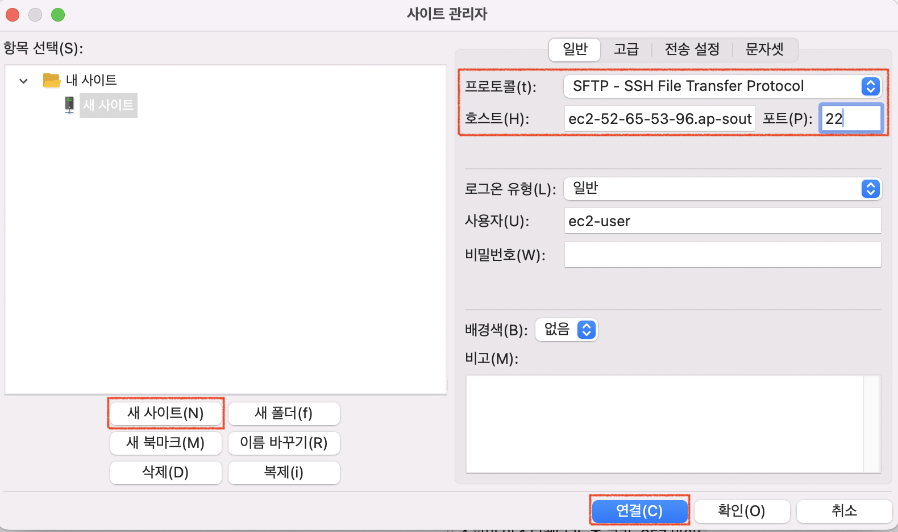

---

## 1. SSH 연결

EC2 인스턴스에 SSH 연결을 해보자.

인스턴스를 만들때 기존에 사용하던 키 페어가 없다면 키 페어를 새로 생성하자.

<br>

_키 페어 생성_

<br>

`키 페어 생성`을 누르면 프라이빗 키를 다운받는다.

이제 프라이빗 키가 존재하는 디렉토리로 이동해서 보관할 디렉토리로 복사하자.

만약 mac을 사용한다면 키는 `downloads` 디렉토리를 확인하면 된다.

<br>

_프라이빗 키 확인_

<br>

키를 보관할 디렉토리로 복사하자. 우리의 경우 `.ssh`라는 디렉토리에 보관을 할 것이기 때문에 키가 존재하는 디렉토리에서 `cp [key명] ~/.ssh`를 사용해서 복사를 진행했다.

이후 `.ssh`를 확인해서 정상적으로 키가 복사된 것을 확인했다.

<br>

> 키는 안전하게 보관해야하기 때문에 기존 `downloads`에 존재하던 키는 삭제를 했다.
{: .prompt-warning }

<br>

이제 본격적으로 SSH를 통한 연결을 진행하자.

연결 방법은 다음과 같다.

```bash
ssh -i [저장된 키의 위치] ec2-user@[Public IPv4 DNS]
```

* Amazon Linux는 기본 유저네임을 `ec2-user`로 설정한다
* 만약 Ubuntu를 사용한다면 `ec2-user`가 아니라 `ubuntu`를 사용하면 된다
* 이 처럼 운영체제에 따라서 설정되어 있는 기본 유저네임은 다르다(물론 몇 가지 설정을 거쳐서 변경할 수 있다)

<br>

`Public IPv4 DNS` 주소는 EC2 인스턴스 콘솔에서 인스턴스를 누르면 아래에서 확인할 수 있다.

<br>

_IPv4 확인_

<br>

현재 내 인스턴스의 정보는 다음과 같다.

* 아마존 리눅스 사용 → `ec2-user`를 유저네임으로 사용
* 퍼블릭 IPv4 : `ec2-52-65-53-96.ap-southeast-2.compute.amazonaws.com`
* 키 이름 : `test-ssh.pem`
* SSH 연결을 키가 존재하고 있는 `.ssh` 디렉토리에서 시도할 것이다

<br>

SSH 연결을 위해서 다음 커맨드를 사용하면 된다.

```bash
ssh -i test-ssh.pem ec2-user@ec2-52-65-53-96.ap-southeast-2.compute.amazonaws.com
```

<br>

> 가장 처음에 진행할 때 질문이 나올텐데 그냥 `yes`라고 입력하면 된다.
{: .prompt-warning }

<br>

다음 그림을 통해 살펴보자.

<br>

_SSH 연결_

* `bad permissions`가 뜬다면 키에 `chmod 400 [key명]`를 사용해서 권한을 재설정 후에 재접속하자
  * `400`은 `read-only` 권한


<br>

성공적으로 연결이 된것을 확인 할 수 있다.

<br>

---

## 2. SFTP로 파일 전송

SFTP를 통해 인스턴스에 파일을 전송 및 다운로드 해보자.

<br>

먼저 Filezilla를 설치하자. 

<br>

> 설치하러 가기 : [https://filezilla-project.org/](https://filezilla-project.org/) 
{: .prompt-info }

<br>

설치를 완료했으면 파일질라(Filezilla)를 열고 `설정 > 연결 > SFTP > 키 파일 추가`를 누르자.

`키 파일 추가`를 통해서 현재 사용하는 키 파일(`.pem`)을 추가하면 된다.

<br>

_키 파일 추가_

<br>

_키 파일 선택_

* 현재 사용하고 있는 `test-ssh.pem` 키를 선택했다

<br>

키 파일 추가를 완료 했으면 왼쪽 상단의 서버 연결 아이콘 처럼 생긴 버튼을 눌러서 호스트를 추가하자.

<br>

_왼쪽 상단의 버튼 선택_

<br>

버튼을 누르면 다음과 같은 창이 나온다. 여기서 `새 사이트`를 눌러서 현재 연결할 인스턴스에 대한 정보를 입력하자.

<br>

_호스트 추가_

* SFTP 프로토콜을 이용할 것이다
* SFTP는 FTP가 사용하는 `21`번 포트가 아니라 SSH가 사용하는 `22`번 포트를 사용한다
* `호스트`에는 인스턴스의 `퍼블릭 IPv4` 주소를 입력하면 된다
* 우리의 인스턴스는 아마존 리눅스를 이용하기 때문에 `사용자`는 `ec2-user`를 입력하면 된다

<br>

입력을 완료했으면 `연결`을 눌러서 연결하면 된다.

연결을 성공적으로 수행하면, 다음 그림 처럼 연결한 인스턴스의 파일 시스템도 확인할 수 있다.

<br>

_연결 완료_

<br>

이제 드래그 앤 드롭을 통해 로컬과 인스턴스간에 파일을 전송하거나 다운로드할 수 있다.

<br>

> 파일질라(Filezilla)를 왜 사용할까?
>
> 파일질라를 사용하지 않아도 `sftp` 커맨드를 사용해서 로컬과 인스턴스간 파일 전송이 가능하다.
>
> ```bash
> sftp -i [Key명] [username]@[Public IPv4 DNS]
> ```
>
> * 이후 `put`, `get`, `scp`와 같은 명령어를 사용해 파일을 업로드, 다운로드, 복사 등을 수행할 수 있다
>
> <br>
>
> 그럼에도 파일질라를 사용하는 이유는 몇 가지 존재한다.
>
> * 유저 친화적인 GUI를 제공
>   * 드래그 앤 드롭 방식 사용 가능
>   * 시각적으로 파일 탐색 가능
> * 배치(Batch) 전송을 지원한다
> * 중간에 중지된 파일 전송을 재시작 할 수 있다
{: .prompt-info }

<br>

---

## Reference

1. [쉽게 설명하는 AWS](https://www.youtube.com/watch?v=9nBq6PxDvp4&list=PLfth0bK2MgIan-SzGpHIbfnCnjj583K2m&index=5)
1. [https://www.youtube.com/watch?v=W_t7KUbUFDs](https://www.youtube.com/watch?v=W_t7KUbUFDs)
1. [패스트캠퍼스 : 한번에 끝내는 데이터 엔지니어링](https://fastcampus.co.kr/data_online_engineering)