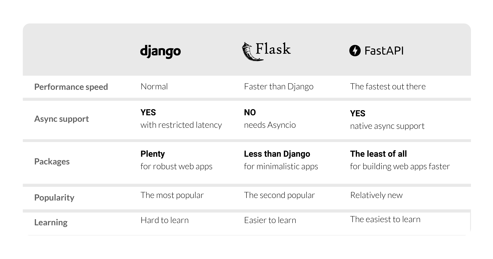

---
## FastAPI
* 최근 떠오르는 Python Web Framework
* API document 작성을 자동으로 해주는 Swagger
* 간결한 코드 작성
* 빠른 속도



<p align="center">출처 - https://quintagroup.com/services/python/fastapi</p>
---

## Path Parameter, Query Parameter

* 웹에서 get method를 사용해 데이터를 전송할 수 있음
* ID가 402인 사용자 정보를 가져오고 싶은 경우

### Path Parameter 방식

> /users/402

* 서버에 402라는 값을 전달하고 변수로 사용

### Query Parameter 방식

> /users?id=402

* Query String
* API뒤에 입력 데이터를 함께 제공하는 방식으로 사용
* Query String은 Key, Value의 쌍으로 이루어지며 &로 연결해 여러 데이터를 넘길 수 있음


### Path vs Query

* 언제 어떤 방식을 사용해야 할까?
* 상황마다 다름

#### Example1) 

* 어떤 리소스를 식별하고 싶은 경우(그러나 kyle이라는 유저가 없음)
* Path : /users/Kyle
  * 경로에 존재하는 내용이 없으면 404 에러 발생

* Query : /users?name=kyle
  * 데이터가 없는 경우 빈 리스트 -> 추가적인 에러 핸들링

보편적인 경우 

* 리소스 식별 : Path parameter가 적합
* 정렬, 필터링 : Query parameter가 적합

<br>

### Path Parameter

* GET method : 정보를 Read하기 위해 사용
* 유저 정보에 접근하는 API

```python
from fastapi import FastAPI
import uvicorn

app = FastAPI()

@app.get("/users/{user_id}")
def get_user(user_id):
    return {"user_id": user_id}
```

* FastAPI는 데코레이터로 GET, POST 표시
* @app.get, @app.post
* GET method의 인자로 있는 {user_id}가 함수의 값으로 인풋

<br>

### Query Parameter

* URL뒤에 ? 붙이고 Key, Value 형태로 연결
* Localhost:8000/items/?skip=0&limit=10

``` uvicorn main:app --reload```

```python
from fastapi import FastAPI
import uvicorn

app = FastAPI()

# DB 같은 느낌으로 사용
fake_items_db =[{"item_name": "Foo"}, {"item_name": "Bar"}, {"item_name": "Baz"}]

@app.get("/items/")
def read_items(skip: int = 0, limit: int = 10):
    return fake_items_db[skip:skip+limit]
```

---

## Optional Path

* 특정 파라미터는 선택적으로 사용하고 싶은 경우
* Typing 모듈의 Optional 사용
* Optional을 이용해 이 파라미터는 Optional 임을 명시

---

## Request Body

* 클라이언트에서 API에 데이터를 보낼 때 request body 사용
  * client -> API : request body
  * API response -> client : response body
* Request body에 데이터가 항상 포함되어야 하는 것은 아님
* Request body에 데이터를 보내고 싶다면 POST Method 사용
  * GET Method는 URL, Request header로 데이터 전달


* POST Method는 Request body에 데이터를 넣어 보냄
* Body의 데이터를 설명하는 content-type Header field 존재, 데이터 타입 명시 해야함
  * Application/x-www-form-urlencoded: BODY에 Key, Value 사용
  * Text/plain : 단순 txt 파일
  * Multipartform-data : 데이터를 바이너리 데이터로 전송

```python
from typing import Optional
from fastapi import FastAPI
import uvicorn

from pydantic import BaseModel

class Item(BaseModel):
    name: str
    description: Optional[str] = None
    price: float
    tax: Optional[float] = None
    
app = FastAPI()

@app.post("/items/")
def create_item(item: Item):
    return item
```

* POST 요청으로 item을 생성하는 예제
* pydantic으로 request body 데이터 정의
* Type hinting에 위에서 생성한 클래스 주입
* request body 데이터를 validation

---

## Response Body

* API response -> client : response body
* 데코레이터의 response_model 인자로 주입 가능

```python
from typing import Optional
from fastapi import FastAPI
import uvicorn

from pydantic import BaseModel

class ItemIn(BaseModel):
    name: str
    description: Optional[str] = None
    price: float
    tax: Optional[float] = None
    
class ItemOut(BaseModel):
    name: str
    price: float
    tax: Optional[float] = None
    
app = FastAPI()

@app.post("items/", response_model=ItemOut)
def create_item(item: ItemIn):
    return item
```

* Output 데이터를 해당 정의에 맞게 변형
* 데이터 validation
* response에 대한 JSON Schema 추가
* 자동으로 문서화

---

## Form

* Form 입력 형태로 데이터를 받고 싶은 경우
* Form을 사용하려면 ```pip install python-multipart``` 으로 설치
  * +간단한 프론트를 위한 ``` pip install Jinja2```

```python
from fastapi import FastAPI, Form
import uvicorn

app = FastAPI()

@app.post("/login")
# Form에서 입력된 값을 가져와서 사용한다
def login(username: str = Form(...), password: str = Form(...)):
    return {"username": username}
```

* Form 클래스를 사용하면 request의 form data에서 값을 가져옴
* Localhost:8000/login/ 으로 이동
  * login으로 접근해서 GET method가 요청됨

```python
from fastapi import FastAPI, Form, Request
from fastapi.templating import Jinja2Templates
import uvicorn

app = FastAPI()
template = Jinja2Templates(directory="./")

@app.get("/login/")
def get_login_form(request: Request):
    # login_form.html for frontend login page
    return template.TemplateResponse("login_form.html", context={"request": request})

@app.post("/login/")
def login(username: str = Form(...), password: str = Form(...)):
    return {"username": username}
```

* login_form.html 로 login 페이지 구성
* 제출을 누르면 login 함수 실행(POST 요청)
* Form(...) -> Python ellipsis, 필수적인 요소를 의미
  * FastAPI 웹 서버 실행 후 Swagger로 이동하면 required를 볼 수 있음

---

## File

* File 업로드의 경우
* Python-multipart 설치 필요

```python
from typing import List

from fastapi import FastAPI, File, UploadFile
from fastapi.responses import HTMLResponse

import uvicorn

app = FastAPI()

@app.post('/files/')
def create_files(files: List(Bytes) = File(...)):
    return {'file_sizes': [len(file) for file in files]}

@app.post('/uploadfiles/')
def create_upload_files(files: List(UploadFile) = File(...)):
    return {'filenames': [file.filename for file in files]}

@app.get('/')
def main():
    content = """
<body>
<form action="/files/" method="post" enctype="multipart/form-data">
<input type="file" name="files" multiple>
<input type="submit">
</form>
<form action="/uploadfiles/" method="post" enctype="multipart/form-data">
<input type="file" name="files" multiple>
<input type="submit">
</form>
</body>
"""
    return HTMLResponse(content)
```

* "/"로 접근할 때 보여줄 HTML 코드
* HTML에서 action으로 넘김
* 파일을 bytes로 표현
* 여러 파일은 List에 설정

---

## Pydantic

* FastAPI에서 Class를 사용할 때
* Data validation / Setting management 라이브러리
* Type Hint를 런타임에서 강제해 안전하게 데이터 핸들링
* 파이썬 기본 타입(str, int ..) + List, Dict, Tuple 에 대한 validtation 지원
* 기존 validation 라이브러리 보다 빠름
* config를 효과적으로 관리
* 머신러닝 feature data validation으로도 활용 가능

### Validation

Machine learning model의 input을 validation 하는 경우

Online serving에서 input 데이터에 대한 validation

* 여러가지 validation을 하는 로직이 있을 수 있음

* 사용할 수 있는 방법은 Python class, Dataclass, Pydantic

---

## Pydantic Config

* Validation 처럼 pydantic은 BaseSettings를 상속한 클래스에서 Type Hint로 주입된 설정 데이터를 검증할 수 있음
* Field 클래스의 env 인자로, 환경 변수로 부터 해당 필드를 오버라이딩 가능
* yaml, ini 파일들을 추가적으로 만들지 않고, .env 파일들을 환경변수로 만들어 두거나, 실행 환경에서 유연하게 오버라이딩 할 수 있음

<br>

## 참고

---

1. [https://github.com/zzsza](https://github.com/zzsza)
2. Naver Connection Boostcamp AI Tech 5th - Product Serving(변성윤)

