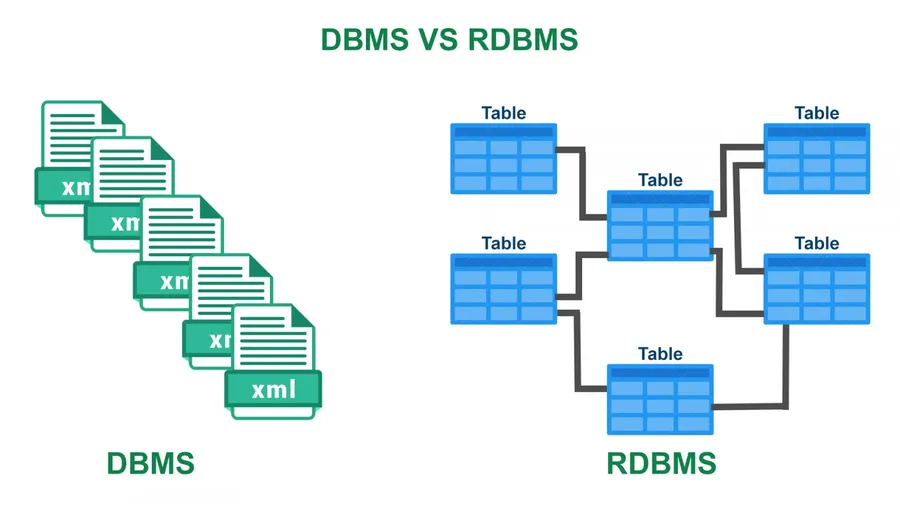
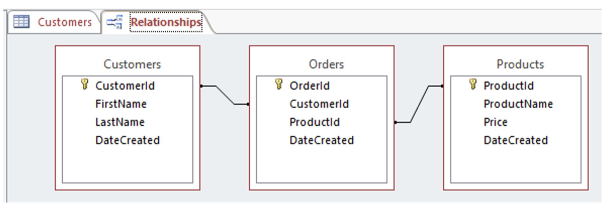
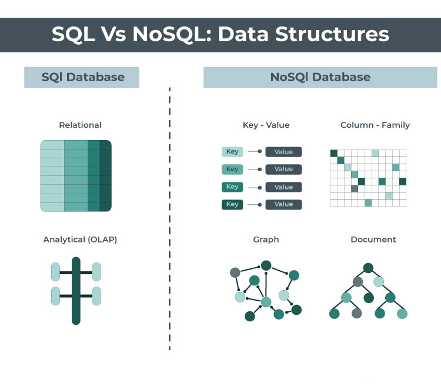
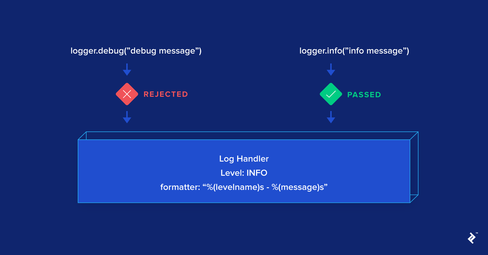
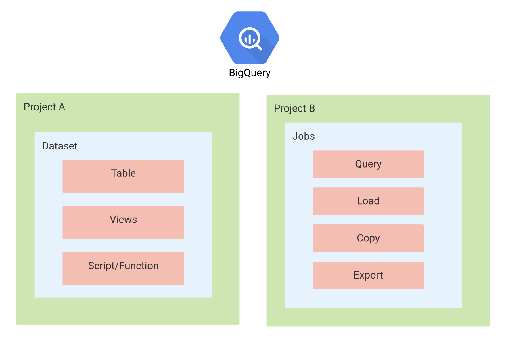

---
## Logging
* 사용자 로그 데이터, 이벤트 로그 데이터 ..
* 머신러닝 인퍼런스 요청 로그, 인퍼런스 결과 등을 저장해야 함

---

## 데이터의 종류

### 데이터베이스 데이터(서비스 로그)

* Database에 저장되는 데이터
* 서비스가 운영되기 위해 필요한 데이터
  * 고객 가입일, 물건 구입 내역 등..


### 사용자 행동 데이터(유저 행동 로그)

* Object storage, Data Warehouse에 주로 저장
* 유저 로그라고 지칭하면 보통 사용자 행동 데이터를 의미
* 서비스에 반드시 필요한 내용은 아니지만, 더 좋은 제품을 만들기 위해 또는 데이터 분석시 필요한 데이터
* 앱이나 웹에서 유저가 어떤 행동을 하는지 나타내는 데이터
* UX와 관련해서 인터랙션이 이루어지는 관점에 발생하는 데이터
  * click, view, swipe ..


### 인프라 데이터(Metric)

* 백엔드 웹 서버가 제대로 동작하고 있는지 확인하는 데이터
* request 수, response 수
* DB 부하
* 트래픽


### Metric, Log, Trace

1. Metric
   * 값을 측정할 때 사용
   * cpu, memory 사용량

2. Log
   * 운영 관점에서 알아야하는 데이터를 남길 때 사용
   * 함수의 호출, 예외 처리 등..
3. Trace
   * 개발 관점에서 알아야하는 것
   * 예외 trace

---

## 데이터 적재 방식

### Database(RDBMS)

* 데이터가 다시 웹, 앱 서비스에서 사용되는 경우 활용
* 실제 서비스용 DB

구체적으로 들어가면

* 관계형 데이터베이스(relational)
* 행과 열로 구성
* 데이터의 관계를 정의하고, 데이터 모델링 진행
* 비즈니스와 연관된 중요한 정보
  * 고객 정보, 주문 요청, 내역 ..
* 영구적으로 저장해야 하는 것은 데이터베이스에 저장
* 데이터 추출시 SQL 사용
* MySQL, PostgreSQL ..



<p align='center'>https://www.stechies.com/differences-between-dbms-rdbms/</p>




<p align='center'>Naver Boostcamp AI Tech 5th - Product Serving</p>


### Database(NoSQL)

* Elasticsearch, Logstash or Fluent, Kibana에서 활용하는 경우

구체적으로 들어가면

* 스키마가 strict한 RDBMS와 다르게 스키마가 없거나 느슨함
* **Not Only SQL**
* 데이터가 많아지며 RDBMS로 트래픽을 감당하기 어려워서 개발됨
* 일반적으로 RDBMS에 비해 쓰기와 읽기 성능이 빠름
* Key Value store, document, column family, graph ..
* json 형태와 비슷하며 xml 등도 활용됨
* MongoDB

### SQL vs NoSQL



<p align='center'>https://expeed.com/when-to-use-sql-databases-vs-nosql-databases-making-the-right-decision/</p>

<br>

### Object Storage

* S3, Cloud Storage에 파일 형태로 저장
* csv, parquet, json ..
* 별도로 DB나 warehouse로 옮기는 작업이 필요함

구체적으로 들어가면

* 어떤 형태의 파일이여도 저장할 수 있는 저장소
* 특정 시스템에 발생하는 로그를 xxx.log에 저장한 후, object storage에 저장하는 형태
* 비즈니스에서 사용되지 않는 분석을 위한 데이터
* 이미지, 음성 등을 저장

### Data Warehouse

* 데이터 분석시 활용하는 데이터 웨어하우스로 바로 저장

* 여러 공간에 저장된 데이터를 한곳으로 저장
* 데이터 창고 같은 느낌으로 알면 편함
* RDBMS, NoSQL, Object Storage 등에서 저장한 데이터를 한 곳으로 옮겨서 처리
* RDBMS와 같은 SQL을 사용하지만 성능이 더 좋은 편
* AWS Redshift, GCP BigQuery, Snowflake .. 

---

## Print vs Logging

* print는 콘솔에만 output을 출력하는 경우로 생각하자
* logging은 file, web socket 등 파이썬이 다룰 수 있는 모든 포맷으로 output 출력 가능
  * 언제 어디서 해당 output의 발생을 알 수 있음
* 심각도에 따른 분류를 할 수 있음
  * develop 환경에서는 debug로그 까지, production 환경에서는 info 로그만 

```python
#### 1. logging module 써보기
import logging

logger = logging.getLogger("example")  # root logger
logger.info("hello world")  # 아무런 로그도 출력되지 않습니다.

#### 1.1 logging module config 추가하기
import logging.config

logger_config = {
    "version": 1,  # required
    "disable_existing_loggers": True,  # 다른 Logger를 overriding 합니다
    "formatters": {
        "simple": {"format": "%(asctime)s | %(levelname)s - %(message)s"},
    },
    "handlers": {
        "console": {
            "level": "DEBUG",
            "class": "logging.StreamHandler",
            "formatter": "simple",
        }
    },
    "loggers": {"example": {"level": "INFO", "handlers": ["console"]}},
}

logging.config.dictConfig(logger_config)
logger_with_config = logging.getLogger("example")
logger_with_config.info("이제는 보이죠?")
```

* Config 설정을 해야 output 출력
* 지정한 로그 포맷 형태로 로그 출력 ```"format": "%(asctime)s | %(levelname)s - %(message)s"```
* [https://docs.python.org/3/library/logging.html](https://docs.python.org/3/library/logging.html)

---

## Python Logging Component

### Logger

   * 로그를 생성하는 method 제공(logger.info(), ..)
   * 로그 level과 logger에 적용된 filter를 기반으로 처리해야 하는 로그인지 판단
   * handler에게 logrecord 인스턴스 전달
   * ```logging.getLogger(name)```으로 Logger Object 사용
     * name이 주어지면 해당 name의 logger 사용
     * name이 없으면 root logger 사용
     * 마침표로 구분되는 계층 구조
       * ```logging.getLogger('foo.bar')``` -> ```logging.getLogger('foo')```의 자식 logger 반환
   * ```logging.setLevel()``` : Logger에서 사용할 level 지정

### Handler

   * Logger에서 만들어진 log를 적절한 위치로 전송(파일 또는 콘솔 출력..)
   * level과 formatter를 각각 설정해서 필터링 할 수 있음
   * StreamHandler, FileHandler, HTTPHandler ..

   



<p align='center'> https://www.toptal.com/python/in-depth-python-logging </p>

3. Formatter
   * 최종적으로 log에 출력될 포맷 설정
   * 시간, logger 이름, 심각도, output, 함수 이름, line 정보, 메세지 .. 

---

## Logging Flow


<p align='center'> https://docs.python.org/ko/3/howto/logging.html </p>

---

## Online Serving Logging (BigQuery)

BigQuery에 Online Serving Input과 Output 로그를 적재하는 과정

1. 빅쿼리 테이블을 세팅
2. 빅쿼리에 적재하기 쉽게 json 형태로 로그를 정제 -> [pythonjsonlogger](https://github.com/madzak/python-json-logger) 사용
3. Python logging 모듈을 사용해서 빅쿼리에 실시간으로 로그 적재(file과 console에도 남을 수 있도록 handle 지정)

---

## BigQuery Data Structure



<p align="center"> https://jayendrapatil.com/google-cloud-bigquery/ </p>

* GCP의 project 내부에 BigQuery 리소스가 존재
* Dataset 안에 Table, Views ..

<br>

## 참고

---

1. [https://github.com/zzsza](https://github.com/zzsza)
2. Naver Connection Boostcamp AI Tech 5th - Product Serving(변성윤)