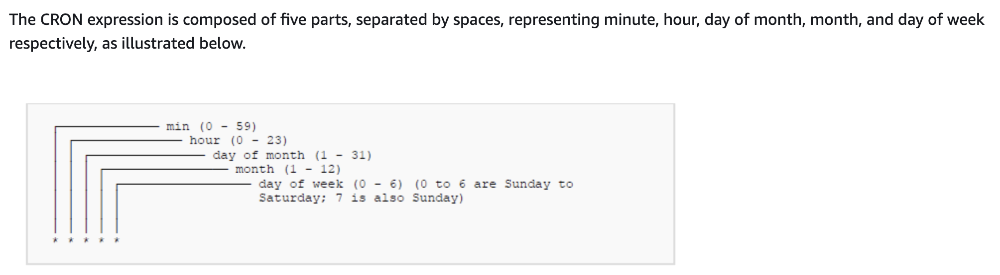
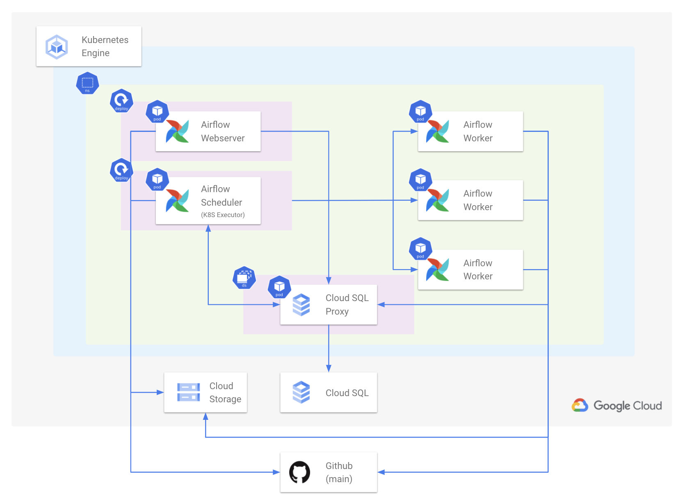

---
## Apache Airflow의 등장 배경
### Batch Processing
* 예약된 시간에 실행되는 프로세스
* 일회성 실행, 주기적인 실행 전부 가능
  * 월요일날 7:00시에 한번 실행, 매주 월요일 7:00에 실행

#### ML, AI 엔지니어 관점에서의 Batch Processing

* 모델을 주기적으로 학습시키는 경우(continuous training)
* 주기적인 Batch Serving을 하는 경우
* 그 외 개발에서 필요한 배치성 작업


#### Airflow 등장 전의 Batch Process

* Linux Crontab으로 Batch Process 구축하는 경우
* 크론 표현식은 Batcj Process의 스케쥴링을 정의한 표현식
  * 이 표현식은 다른 Batch Process 도구에서도 자주 사용됨



<p align='center'> 출처 - https://docs.aws.amazon.com/elemental-cl3/latest/apireference/channel-scheduling-cron-syntax-summary.html</p>

* ```*****``` - Every minute
* ```0****``` - Every hour
* ```00***``` - Every day at 12:00 AM
* ``` 00**FRI``` - At 12:00 AM, only on Friday
* ```001**``` - At 12:00 AM, on day 1 of the month

* https://crontab.cronhub.io/
* http://www.cronmaker.com/
* https://crontab.guru/


#### Linux Crontab의 한계

* 재실행 및 알람
  * 파일을 실행하다 오류가 생긴 경우, 크론탭이 별도의 처리를 하지 않음
* 실패할 경우, retry 하거나 실패했다는 알람을 보내주는 기능이 필요
* 과거 실행 이력 및 실행 로그를 보기 어려움
* 여러 파일을 실행하거나, 복잡한 파이프라인을 만들기 어려움

-> **더 정교한 스케쥴링 및 워크플로우 도구가 필요함!**


### 스케쥴링 도구들의 등장

* Luigi
* argo
* **Apache Airflow**
* Prefect
* MetaFlow

---

## Apache Airflow 소개

현재 스케쥴링, 워크플로우 도구의 표준

* 업데이트 주기 빠름
* 스케쥴링 도구로 무거울 수 있지만, 거의 모든 기능을 제공하고, 확장성이 넓어 일반적으로 스케쥴링과 파이프라인 작성 도구로 많이 사용
* 데이터 엔지니어링 팀에서 많이 사용

---

## Airflow의 기능

* 파이썬을  사용해 스케쥴링 및 파이프라인 작성
* 실패 시 알람
* 실패 시 재실행 시도
* 동시 실행 워커 수
* 설정 및 변수 값 분리

---

## Airflow 사용해보기

1. 가상환경 설정

``` bash
python -m venv .venv
source .venv/bin/activate
```

2. Airflow 설치

```bash
pip install pip --upgrade
pip install 'apache-airflow==2.2.0'
```

3. Airflow 기본 디렉토리 경로 지정

``` export AIRFLOW_HOME=.```

4. Airflow에서 사용할 DB 초기화

```airflow db init```

* DB를 초기화하면 기본 파일이 생성 ```ls -al```로 확인

5. Airflow에서 사용할 어드민 계정 생성

```airflow users create --username admin --password 1234 --firstname seungki --lastname kim --role Admin --email {email}```

6. Airflow Webserver 실행

```airflow webserver --port 8080```

7. WebUI Dashboard 등장
   * 스케쥴러가 실행중이지 않다는 에러가 보임
8. 별도의 터미널을 띄워서 Airflow Scheduler 실행

``` airflow scheduler```

* Web UI에서 관련 에러가 없어진 것을 확인할 수 있음

---

## DAG

### Batch Scheduling을 위한 DAG 생성

* Airflow에서는 스케줄링할 작업을 DAG이라고 부름
* DAG은 Directed Acyclic Graph의 약자로 Airflow에 한정된 개념이 아닌 소프트웨어 자료구조에서 일반적으로 다루는 개념
* DAG은 이름 그대로 순환하지 않는 방향이 존재하는 그래프를 의미

**Airflow는 Crontab처럼 단순히 하나의 파일을 실행하는 것이 아닌, 여러 작업의 조합도 가능함**

* DAG 1개 : 1개의 파이프라인
* Task : DAG 내에서 실행할 작업

**하나의 DAG에 여러 Task의 조합으로 구성**


<p align='center'>출처 - https://www.qubole.com/tech-blog/apache-airflow-tutorial-dags-tasks-operators-sensors-hooks-xcom</p>

**example) tutorial_etl_dag라는 DAG은 3가지 Task로 구성**

* extract
* transform
* load
* -> tutorial_etl_dag라는 DAG을 실행하면 이 3가지 Task을 순차적으로 실행함

**Task가 꼭 순차적으로 진행하지 않게 할 수도 있음**

tutorial DAG

* print_data Task 이후, sleep, templated Task 동시(병렬) 실행

---

## DAG 작성하기

### DAG 작성

1. DAG을 담을 디렉토리 생성(이름은 무조건 dags)

```mkdir dags```

2. dags 폴더 내에 hello_world.py 생성

**hello_world.py**

```python
# hello_world.py

from datetime import timedelta

from airflow import DAG
from airflow.utils.dates import days_ago
from airflow.operators.bash import BashOperator
from airflow.operators.python import PythonOperator

def print_world() -> None:
    print("world")

# with 구문으로 DAG 정의를 시작합니다.
with DAG(
    dag_id="hello_world",  # DAG의 식별자용 아이디입니다.
    description="My First DAG",  # DAG에 대해 설명합니다.
    start_date=days_ago(2),  # DAG 정의 기준 2일 전부터 시작합니다.
    schedule_interval="0 6 * * *",  # 매일 06:00에 실행합니다.
    tags=["my_dags"],  # 태그 목록을 정의합니다. 추후에 DAG을 검색하는데 용이합니다.
) as dag:

    # 테스크를 정의합니다.
    # bash 커맨드로 echo hello 를 실행합니다.
    t1 = BashOperator(
        task_id="print_hello",
        bash_command="echo Hello",
        owner="heumsi",  # 이 작업의 오너입니다. 보통 작업을 담당하는 사람 이름을 넣습니다.
        retries=3,  # 이 테스크가 실패한 경우, 3번 재시도 합니다.
        retry_delay=timedelta(minutes=5),  # 재시도하는 시간 간격은 5분입니다.
    )

    # 테스크를 정의합니다.
    # python 함수인 print_world를 실행합니다.
    t2 = PythonOperator(
        task_id="print_world",
        python_callable=print_world,
        depends_on_past=True,
        owner="heumsi",
        retries=3,
        retry_delay=timedelta(minutes=5),
    )

    # 테스크 순서를 정합니다.
    # t1 실행 후 t2를 실행합니다.
    t1 >> t2
```

* DAG 정의(이름, 태그)
  * 언제부터 스케쥴링 할지
  * 스케쥴링 간격은 어떻게 할 지
* DAG 내 Task 정의
  * Task 정의는 Airflow의 Operator 클래스 사용
  * Airflow에는 다양한 Operator 클래스가 존재하며, 뒤에서 살펴봄
    1. 첫 번째 Task는 bash 커맨드 실행
       * Airflow에서 제공하는 BashOperator 사용
       * bash_command 파라미터에 bash로 실행할 커맨드 전달
    2. 두 번째 Tasksms Python 함수 실행
       * Airflow에서 제공하는 PythonOperator 사용
       * python_callable 파라미터에 실행할 파이썬 함수 전달
* Dag 내 Task간 순서 정하기
  * 순서는 ```>>```와 같은 형태로 표현
  * t1 (BashOperator) 실행 후, t2 (PythonOperator)를 실행


### 실행결과 확인

* 파일을 저장하고, UI를 확인해보면 새로 생성한 DAG 보임
* DAG 상세 페이지에서 DAG을 ON 상태로 변경

* DAG Run의 첫 번째 Task 사각형을 눌러서 Log 버튼을 클릭해서 Log 확인 가능
* 특정 DAG Run의 기록을 지우고 다시 실행시키고 싶으면 Clear 실행

---

## Operator들 소개

* Airflow에서는 다양한 Operator를 제공

1. PythonOperator
   * 파이썬 함수를 실행
   * 함수 뿐 아니라, Callable한 객체를 파라미터로 넘겨 실행 가능
   * 실행할 파이썬 로직을 함수로 생성한 후, PythonOperator로 실행
2. BashOperator
   * Bash 커맨드를 실행
   * 실행해야할 프로세스가 파이썬이 아닌 경우에도 BashOperator로 실행 가능
     * shell script, scala file ..
3. DummyOperator
   * 아무것도 실행하지 않음
   * DAG내에서 Task를 구성할 때, 여러 개의 Task의 Success를 기다려야 하는 복잡한 Task 구성에서 사용
4. SimpleHttpOperator
   * 특정 호스트로 HTTP 요청을 보내고 Response로 반환
   * 파이썬 함수에서 requests 모듈로 사용한 뒤 PythonOperator로 실행시켜도 무방

5. 그 외
   * KubernetesOperator
   * OckerOperator
   * CustomOperator
   * 등..
6. 클라우드 기능을 추상화한 Operator도 존재함(AWS, GCP ..)
   * provider packages
   * Third Party와 연동해 사용하는 Operator의 경우 Airflow 설치 시에 다음처럼 extra package를 설치해야 함

---

## 추가적으로 학습 할 내용

* Variable
* Connections & Hooks
* Sensor
* Marker
* XComs

---

## Airflow Architecture


<p align='center'>https://airflow.apache.org/docs/apache-airflow/stable/core-concepts/overview.html</p>

### DAG Directory

* DAG 파일들을 저장
* DAG_FOLDER
* Scheduler에 의해 .py 파일은 모두 탐색되고 DAG에 파싱


### Scheduler

* 각종 메타 정보의 기록을 담당
* DAG들의 스케쥴링 관리
* 실행 진행 상황과 결과를 DB에 저장
* Executer를 통해 실제로 스케쥴링된 DAG을 실행
* Airflow의 가장 핵심적인 component


#### Scheduler - Executer

* 스케쥴링된 DAG을 실행하는 객체, 크게 2개로 나뉨

  

  ##### Local Executer
  
  * DAG Run을 프로세스 단위로 실행하며, 다음 처럼 나뉨
    * Local
      * 하나의 DAG Run을 프로세스로 띄워서 실행
      * 최대로 생성할 프로세스 수를 정해야 함
      * Airflow를 간단하게 운영할 때 적합
    * Sequential
      * 하나의 프로세스에서 모든 DAG Run들을 처리
      * Airflow 기본 Executer, 별도 설정이 없으면 이것을 사용
      * 테스트용으로 잠시 운영할 때 적합

  ##### Remote Executer

  * DAG을 외부 프로세스로 실행
    * Celery
      * DAG Run을 Celery Work Process로 실행
      * 보통 Redis를 중간에 두고 같이 사용
      * Local Executer를 사용하다 Airflow 운영 규모가 좀 더 커지면 Celery Executor로 전환
    * Kubernetes
      * 쿠버네티스 상에서 Airflow를 운영할 때 사용
      * DAG Run 하나가 하나의 Pod(컨테이너 같은 개념)
      * 운영 규모가 큰 팀에서 사용
  
  

### Workers

* DAG을 실제로 실행
* Scheduler에 의해 생기고 실행
* Executer에 따라 워커의 형태가 다름
  * Celery, Local Executer의 경우 Worker는 Process
  * Kubernetes의 경우 Worker는 Pod
* Dag Run을 실행하는 과정에서 생기는 로그를 저장


### Metadata Database

* 메타 정보를 저장
* Scheduler에 메타 정보가 쌓임
* 보토 MySQL이나 Postgres를 사용
* 파싱한 DAG 정보, DAG Run 상태와 실행 내용, Task 정보 등을 저장
* User와 Role(RBAC)에 대한 정보 저장
* Scheduler와 더불어서 핵심 컴포넌트
* 트러블 슈팅 시, 디버깅을 위해 직접 DB에 연결해서 데이터를 확인하기도 함
* 실제 운영 환경에서는 GCP Cloud SQL이나 AWS Aurora DB 등.. 외부 DB 인스턴스를 사용


### WebServer

* WebUI를 담당
* Metadata DB와 통신하며 유저에게 필요한 메타정보를 웹 브라우저에 보여주고 시각화
* 보통 Airflow 사용자들은 이 웹서버를 이용하여 DAG을 ON/OFF 하면서, 현 상황 파악
* REST API도 제공하기 때문에, Web UI를 통해서 통신하지 않아도 괜찮음
* 웹서버가 당장 작동하지 않아도 Airflow에 큰 장애가 발생하는 것은 아님

---

## 실제 Airflow 구축 및 활용

Airflow를 구축하는 방법은 보통 3가지 방법을 사용함

1. **Managed Airflow (GCP Composer, AWS MWAA)**
   * 클라우드 서비스 형태로 Airflow를 사용하는 방법
   * 장점
     * 설치와 구축을 클릭 몇번으로 클라우드 서비스가 진행
     * 유조는 DAG 파일을 스토리지(업로드) 형태로 관리
   * 단점
     * 비용
     * 자유도가 적음, 제약이 많음
2. **VM + Docker Compose**
   * 직접 VM 위에서 Docker Compose로 Airflow를 배포하는 방법
   * Airflow 구축에 필요한 컴포넌트(Scheduler, Webserver, Database..)를 Docker 컨테이너 형태로 배포 
   * 장점
     * Managed Service 보다는 조금 복잡하지만, 어려운 난이도는 아님
     * Docker Compose에 익숙하면 금방 익힐 수 있음
     * 하나의 VM만을 이용하기 때문에 단순
   * 단점
     * 각 Docker 컨테이너 별로 환경이 다르기 때문에, 관리 포인트가 늘어남
3. **Kubernetes + Helm**
   * Helm 차트로 Airflow를 배포하는 방법
   * Kubernetes는 여러 개의 VM을 동적으로 운영하는 일종의 분산환경, 리소스 사용이 매우 유연함(Scalability가 좋음)
   * 특정 시간에 배치 프로세스를 실행시키는 Airflow와 궁합이 매우 잘 맞음
   * Airflow DAG 수가 몇 백개로 늘어나도 노드 오토 스케일링으로 모든 프로세스를 잘 처리할 수 있음
   * 쿠버네티스 자체가 난이도가 있음 -> 구축, 운영이 어려움



<p align='center'>출처 - https://tech.socarcorp.kr/data/2021/06/01/data-engineering-with-airflow.html</p>

---

## MLOps 관점에서의 Airflow

데이터 엔지니어링에서 많이 쓰이지만, MLOps에서도 활용가능

* 주기적인 실행이 필요한 경우
  * Batch Training : 1주일 단위로 모델 학습
  * Batch Serving(Batch Inference) : 30분 단위로 인퍼런스
  * 인퍼런스 겨로가를 기반으로 일자별, 주차별 모델 퍼포먼스 Report 생성
  * MySQL에 저장된 메타 데이터를 데이터 웨어하우스로 1시간 단위로 옮기기
  * S3, GCS 등 Object Storage
  * Feature Store를 만들기 위해 Batch ETL 실행

<br>

## 참고

---

1. [https://github.com/zzsza](https://github.com/zzsza)
2. Naver Connection AI Tech 5th - Product Serving(변성윤)
