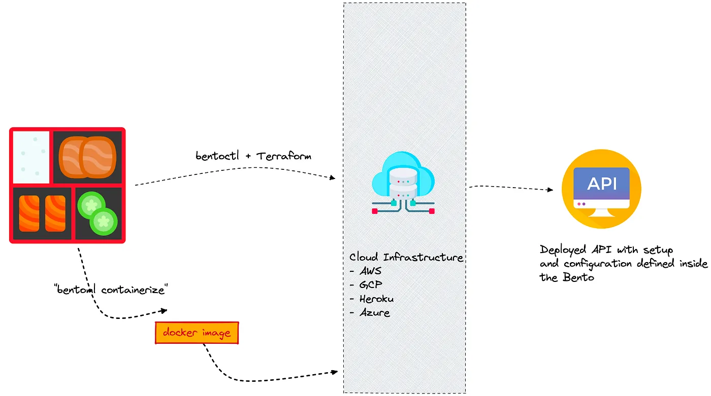

---
## BentoML 등장 배경
> BentoML is designed for teams working to bring machine learning (ML) models into production in a reliable, scalable, and cost-efficient way. In particular, AI application developers can leverage BentoML to easily integrate state-of-the-art pre-trained models into their applications. By seamlessly bridging the gap between model creation and production deployment, BentoML promotes collaboration between developers and in-house data science teams.

항상 많은 라이브러리들이 새롭게 등장하고, 보통 이 라이브러리들은 해결하려고 하는 핵심 문제가 존재 함.

### BentoML이 해결하려는 문제

1. Model Serving Infra의 어려움

   * Serving을 위해 다양한 라이브러리, artifact, asset 등.. 사이즈가 큰 파일을 패키징 해야함

   * Cloud service에 지속적으로 배포하기 위해 많은 작업이 필요함

     -> BentoML은 CLI로 이 문제의 복잡도를 낮추려고 함(CLI 명령어로 모두 진행 가능)

2. Online Serving의 Monitoring 및 Error Handling

   * Online Serving으로 API 형태로 생성
   * Error 처리, Logging을 추가로 구현해야 함
   * BentoML은 Python Logging Module을 사용해 Access Log, Prediction Log를 기본으로 제공
   * Config를 수정해 Logging도 커스텀할 수 있고, Prometheus 같은 Metric 수집 서버에 전송할 수 있음

3. Online Serving의 포퍼먼스 튜닝의 어려움

   * Adaptive Micro Batch 방식을 채택해 동시에 많은 요청이 들어와도 높은 처리량을 보여줌

---

## BentoML 특징

Serving에 특화된 가벼운 라이브러리로 볼 수 있음

* 쉬운 사용성
* Online/Offline Serving 지원
* Tensorflow, PyTorch, Keras, XGBoost 등 메이저 프레임워크 지원
* Docker, Kubernetes, AWS, Azure 등의 배포 환경 지원 및 가이드 제공
* Flask 대비 100배의 처리량
* 모델 저장소(Yatai) 웹 대시보드 지원
* 데이터 사이언스와 데브옵스 사이의 간격을 좁혀주고, 높은 성능의 serving 지원




<p align='center'> 출처 - https://towardsdatascience.com/10-ways-bentoml-can-help-you-serve-and-scale-machine-learning-models-4060f1e59d0d</p>

---

## BentoML 사용하기

### 1. BentoML 설치

* BentoML은 python 3.6 이상만 지원
* pyenv 등으로 파이썬 버전을 설정해서 진행
* 가상환경 virtualenv 또는 poetry로 설정

```pip install bentoml```


### 2. BentoML Flow

* 모델 학습 코드 생성
* Prediction Service Class 생성
* Prediction Service에 모델 저장
* Serving
* Docker Image Build(컨테이너화)
* Serving 배포


#### **Prediction Service Class 생성**

```python
# bento_service.py
import pandas as pd

from bentoml import env, artifacts, api, BentoService
from bentoml.adapters import DataframeInput
from bentoml.frameworks.sklearn import SklearnModelArtifact

@env(infer_pip_packages=True)
@artifacts([SklearnModelArtifact('model')])
class IrisClassifier(BentoService):
    """
    A minimum prediction service exposing a Scikit-learn model
    """

    @api(input=DataframeInput(), batch=True)
    def predict(self, df: pd.DataFrame):
        """
        An inference API named `predict` with Dataframe input adapter, which codifies
        how HTTP requests or CSV files are converted to a pandas Dataframe object as the
        inference API function input
        """
        return self.artifacts.model.predict(df)
```

* BentoService를 활용해 Prediction Service Class 생성
* 예측할 때 사용하는 API를 위한 Class


```python
@env(infer_pip_packages=True)
@artifacts([SklearnModelArtifact('model')])
```

* ```@env``` : 파이썬 패키지, install script 등 서비스에 필요한 의존성을 정의
* ```@artifacts``` : 서비스에서 사용할 artifact 정의 -> Sklearn, XGboost, Pytorch 등 ..


```python
class IrisClassifier(BentoService):
    """
    A minimum prediction service exposing a Scikit-learn model
    """

    @api(input=DataframeInput(), batch=True)
    def predict(self, df: pd.DataFrame):
        """
        An inference API named `predict` with Dataframe input adapter, which codifies
        how HTTP requests or CSV files are converted to a pandas Dataframe object as the
        inference API function input
        """
        return self.artifacts.model.predict(df)
```

* BentoService를 상속하면 해당 서비스를 Yatai(모델 이미지 레지스터리)에 저장
* ```@api``` : API 생성
  * Input과 Output을 원하는 형태(Dataframe, Tensor, JSON 등..)으로 선택할 수 있음
  * Doc string으로 Swagger에 들어갈 내용을 추가할 수 있음
* ```@artifacts```에 사용한 이름을 토대로 ```self.artifacts.model```로 접근


#### **Prediction Service에 저장(Pack)**

```python
# bento_packer.py
# 모델 학습
from sklearn import svm
from sklearn import datasets

clf = svm.SVC(gamma='scale')
iris = datasets.load_iris()
X, y = iris.data, iris.target
clf.fit(X, y)

# bento_service.py에서 정의한 IrisClassifier
from bento_service import IrisClassifier

# IrisClassifier 인스턴스 생성
iris_classifier_service = IrisClassifier()

# Model Artifact를 Pack
iris_classifier_service.pack('model', clf)

# Model Serving을 위한 서비스를 Disk에 저장
saved_path = iris_classifier_service.save()
```

* Model Artifact를 주입
* BentoML Bundle : Prediction Service를 실행할 때 필요한 모든 코드, 구성이 포함된 폴더, 모델 제공을 위한 바이너리


* CLI에서 ```python bento_packer.py``` 실행 -> Saved to ~ 경로가 보일 것임
* BentoML에 저장된 Prediction Service 확인
  * ```bentoml list```

* BentoML에 저장된 Prediction Service 폴더로 이동 후 파일 확인
  * ```tree``` 명령어로 디렉토리 구조 확인 (```tree -L 4```)
* ```bentoml.yml```에 모델의 메타 정보, 패키지 환경, API input/output, Docs 등을 확인 할 수 있음


#### **Serving**

#### **Yatai Service 실행**

* ```bentoml yatai-service-start```
* localhost:3000


#### **Docker Image Build**

* ```bentoml containerize IrisClassifier:latest -t iris-classifier```
* ```docker images```로 빌드된 이미지 확인

 -> docker 명령이나 FastAPI를 사용하지 않고 웹 서버를 띄우고, 이미지 빌드!

---

## Bentoml Component

* BentoService
* Service Environment
* Model Artifact
* Model Artifact Metadata
* Model Management & Yatai
* API Function and Adapters
* Model Serving
* Labels
* Retrieving BentoServices
* Web UI


### BentoService

* ```bentoml.BentoService```는 예측 서비스를 만들기 위한 베이스 클래스
* ```@bentoml.artifacts``` : 여러 머신러닝 모델 포함할 수 있음
* ```@bentoml.api```: Input/Output 정의
  * API 함수 코드에서 ```self.artifacts.{ARTIFACT_NAME}으로 접근 가능
* 파이썬 코드와 관련된 종속성 저장

### Service Enviroment

* 파이썬 관련 환경, Docker 등을 설정 가능
* ```@bentoml.env(infer_pip_packages=True)``` : import를 기반으로 필요한 라이브러리 추론
* ```requirements_txt_file```을 명시할 수 있음
* ```pip_packages=[]```를 사용해 버전을 명시할 수 있음
* ```docker_base_image```를 사용해 Base image를 지정 가능
* ```setup_sh```를 지정해 Docker Build 과정을 커스텀할 수 있음

### Model Artifact Metadata

Metadata 접근 방법

1. CLI

   * ```bentoml get model:version```

2. REST API

   * bentoml serve 후, /metadata로 접근

3. python

   * ```python
     from bentoml import load
     svc = load('path_to_bento_service')
     print(svc.artifacts['model'].metadata)
     ```

---

## Model Serving

BentoService가 Bento로 저장되면 여러 방법으로 배포할 수 있음!

1. Online Serving
   * 클라이언트가 REST API Endpoint로 근 실시간으로 예측 요청
2. Offline Batch Serving
   * 예측을 계산 후, Storage에 저장
3. Edge Serving
   * 모바일, IoT device에 배포

---

## Web UI

* ```@bentoml.web_static_content```를 사용해 웹프론트엔드에 추가할 수 있음

<br>

## 참고

---

1. [https://github.com/zzsza](https://github.com/zzsza)
2. Naver Connection Boostcamp AI Tech 5th - Product Serving(변성윤)
3. [https://docs.bentoml.org/en/latest/overview/what-is-bentoml.html](https://docs.bentoml.org/en/latest/overview/what-is-bentoml.html)