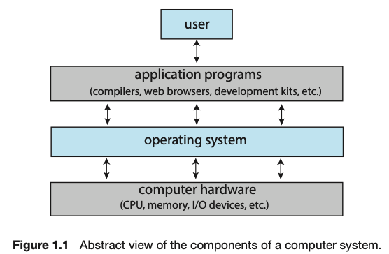
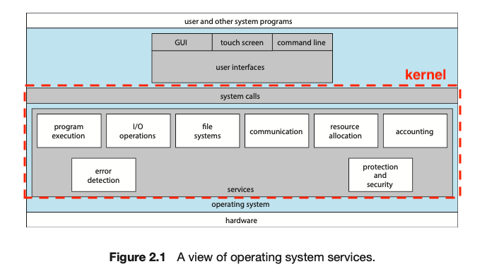
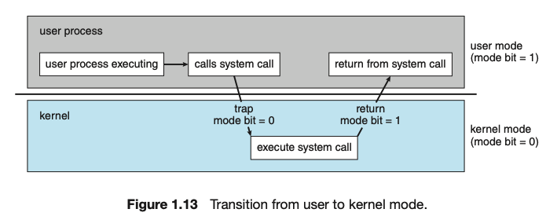
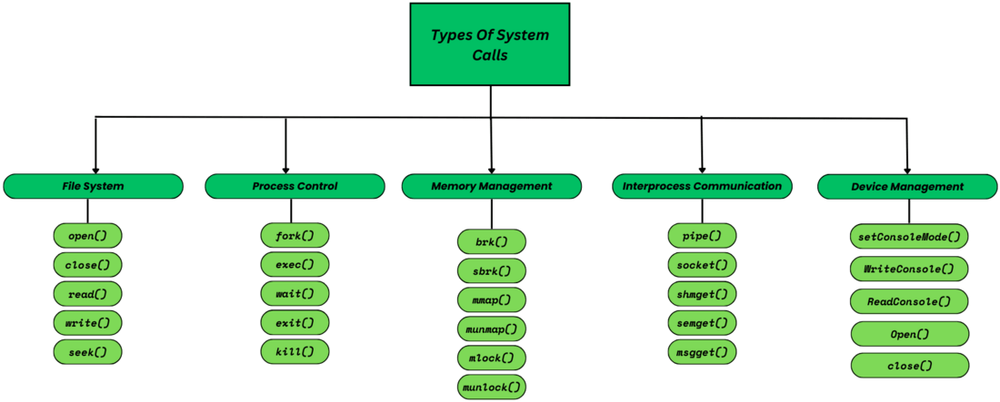
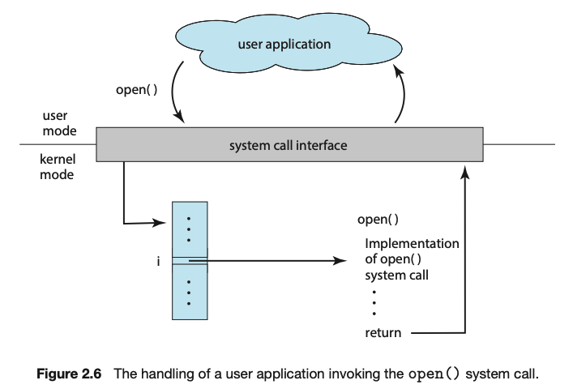

---

## 1. 운영체제(Operating System, OS)란

운영 체제(OS, Operating System)는 **컴퓨터 하드웨어와 소프트웨어 리소스를 관리하고 컴퓨터 프로그램의 실행을 제공하는 시스템 소프트웨어**이다. 운영 체제는 **사용자와 컴퓨터 하드웨어 간의 인터페이스 역할**을 하며, 여러 프로그램이 효율적으로 실행될 수 있도록 다양한 서비스를 제공한다.

 

_https://www.almabetter.com/bytes/articles/list-of-operating-system_

* 여러가지 운영체제가 존재한다

 

기본적으로 모든 프로그램은 실행을 위해서 **자원(resource)이 필요**하다. 여기서 **자원은 컴퓨터 시스템에서 사용되는 다양한 하드웨어와 소프트웨어 구성 요소**를 의미한다. 쉽게 말해서 CPU, 메모리, 디스크 드라이브 등 프로그램의 실행에 필요한 요소로 보면 된다.

이런 자원은 단지 컴퓨터에 전기를 공급한다고 해서 자동으로 분배가 되거나 사용할 수 있는게 아니다. **운영체제는 이런 자원을 할당해주고 응용 프로그램이 올바르게 실행되도록 도와주는 특별한 소프트웨어**로 보면된다.

 

> **응용 프로그램(application software)**
>
> 사용자가 특정 목적을 위해 사용하는 일반적인 프로그램
{: .prompt-info }

 

운영체제는 응용 프로그램(application software)과 하드웨어(hardware) 사이 위치한다. 

 

_Abraham Silberschatz: Operating System Concepts_

 

운영체제의 역할과 기능은 다음과 같다.

* **자원 관리**
  * 운영 체제는 CPU, 메모리, 디스크 드라이브 및 기타 주변 장치와 같은 컴퓨터 하드웨어 리소스를 관리한다. 이를 통해 여러 응용 프로그램이 동시에 실행되더라도 시스템 자원을 효율적으로 사용할 수 있다.
* **프로그램 실행 제어(프로세스 관리)**
  * 운영 체제는 응용 프로그램이 실행될 때 필요한 환경을 제공한다. 이는 프로그램이 하드웨어와 직접 상호 작용하는 대신 운영 체제를 통해 간접적으로 하드웨어를 제어하도록 한다.
  * 만약 프로그램이 직접 자원에 접근해서 사용할 수 있다면 예상치 못한 문제들이 발생한다. 
    * 예를 들어서 인터넷 브라우저를 열고 게임을 동시 실행한다고 가정해보자. 만약 게임에서 마음대로 인터넷 브라우저의 CPU 연산 자원을 가져갈 수 있다면, 제대로된 멀티 태스킹이 힘들 수 있다
* **파일 시스템 관리**
  * 운영 체제는 데이터를 저장하고 조직하는 파일 시스템을 제공한다. 이를 통해 사용자와 응용 프로그램은 데이터를 쉽게 저장하고 검색할 수 있다.
* **보안 및 접근 제어**
  * 운영 체제는 사용자 계정을 관리하고, 파일 및 시스템 자원에 대한 접근 권한을 제어하여 시스템의 보안을 유지한다. 이는 악의적인 사용자나 프로그램이 시스템을 손상시키지 않도록 보호한다.
* **네트워킹**
  * 운영 체제는 네트워크 기능을 제공하여 컴퓨터가 다른 컴퓨터 및 네트워크 장치와 통신할 수 있도록 한다. 이를 통해 데이터 전송, 인터넷 접속 및 네트워크 기반 응용 프로그램이 가능하다.
* **사용자 인터페이스 제공**
  * 운영 체제는 사용자와 시스템 간의 상호 작용을 위한 그래픽 사용자 인터페이스(GUI) 또는 명령줄 인터페이스(CLI)를 제공한다. 이는 사용자가 시스템을 쉽게 사용할 수 있도록 도와준다.
* **기타 다양한 서비스들**

 

---

## 2. 커널(Kernel)

### 커널 소개

커널(kernel)은 운영 체제의 가장 핵심적인 부분으로, **하드웨어와 응용 프로그램 사이의 상호 작용을 관리하고 조정하는 역할**을 한다. 커널은 운영 체제의 모든 중요한 기능을 제공하며, 시스템의 안정성과 효율성을 보장해준다.

 

_kernel_

 

커널은 자원에 접근해서 사용하는 기능, 프로그램이 올바르게 실행되도록 도와주는 기능, 파일 시스템 기능과 같은 대부분의 핵심적인 기능은 커널이 담당한다. 대다수의 운영체제를 설명하는 책이나 자료는 이 커널에 대해서 다룬다.

 

> **커널이 담당하지 않는 기능**
>
> 유저 인터페이스(UI)는 커널이 담당하지 않는다. UI는 사용자와 컴퓨터 간 소통을 위한 통로일 뿐, 핵심적인 기능이 아니다. 
{: .prompt-info }

 

---

### 이중 모드(Dual Mode)

#### 이중 모드 소개

이중 모드(Dual Mode)는 컴퓨터 시스템에서 운영 체제가 시스템의 안전성과 안정성을 유지하기 위해 사용하는 중요한 개념이다. **이중 모드는 시스템의 작동을 두 가지 모드로 나누는 것을 의미**하며, **각각의 모드에서는 서로 다른 권한 수준**을 가지게 된다. 이러한 모드는 **주로 사용자 모드(User Mode)와 커널 모드(Kernel Mode)로 구분**된다.

 

> **mode bit**
>
> 시스템의 현재 작동 모드를 나타내는 비트. 이 비트는 CPU의 상태를 나타내는 특별한 비트로, 현재 CPU가 사용자 모드(User Mode)인지 커널 모드(Kernel Mode)인지를 결정한다. 플래그 레지스터의 슈퍼바이저 플래그(supervisor flag)에 표시된다.
{: .prompt-info }

 

_Dual Mode_

* **사용자 모드(User Mode)**
  * **제한된 접근 권한**: 사용자 모드에서 실행되는 응용 프로그램은 제한된 권한만 가지며, **직접 하드웨어 자원이나 중요한 시스템 데이터에 접근할 수 없다**
  * 응용 프로그램이 오류를 일으키거나 악의적인 행동을 시도하더라도 시스템 전체에 영향을 미치지 않도록 격리된다
  * 응용 프로그램은 운영 체제에서 제공하는 **시스템 콜(system call)을 통해 간접적으로 하드웨어 자원이나 커널 서비스를 요청**한다
* **커널 모드(Kernel Mode)**
  * **전체 접근 권한**: 커널 모드에서는 시스템의 모든 자원(CPU, 메모리, 디스크 드라이브 등)에 대한 완전한 접근 권한을 가진다
  * **직접 하드웨어 접근**: 커널 모드에서는 직접 하드웨어 자원과 상호 작용할 수 있다
  * **운영 체제 기능 수행**: 프로세스 관리, 메모리 관리, 파일 시스템 관리, 장치 드라이버 관리 등의 핵심 운영 체제 기능을 수행한다

 

---

#### 시스템 콜(System Call)

위에서 언급하는 시스템 콜에 대해 알아보자. 위에서 사용자 모드에서 커널 모드로 전환될 때 시스템 콜을 사용하는 것을 볼 수 있었다.

시스템 콜(System Call)은 **사용자 프로그램이 운영 체제의 커널에게 서비스를 요청할 때 사용하는 인터페이스**이다. **사용자 프로그램은 직접 하드웨어 자원에 접근할 수 없기** 때문에 **시스템 콜이 제공하는 API를 통해 커널의 기능을 사용**하여 파일 시스템, 프로세스 관리, 메모리 관리, 네트워크 기능 등 다양한 작업을 수행할 수 있다.

 

_https://www.geeksforgeeks.org/different-types-of-system-calls-in-os/_

* 운영체제 마다 차이가 있지만, 대부분 비슷한 시스템 콜들을 제공해준다

 

_System Call_

시스템 콜의 대략적인 수행 과정은 다음과 같다.

* **시스템 콜 호출**
* **트랩(Trap) 발생**
  * 시스템 콜이 호출되면, **CPU는 소프트웨어 인터럽트(트랩)를 발생**시켜 현재 실행 중인 프로그램의 흐름을 커널로 전환한다
  * 이때, CPU는 사용자 모드에서 커널 모드로 전환된다
* **커널에서 시스템 콜 처리**
  * 커널은 시스템 콜 번호와 매개변수를 확인하여 적절한 커널 API를 호출한다
  * 커널 API는 요청된 작업을 수행하고, 결과를 준비한다
* **결과 반환**
  * 작업이 완료되면, 커널은 결과를 레지스터에 저장하고, CPU는 다시 커널 모드에서 사용자 모드로 전환된다

 

이런 시스템 콜의 가장 중요한 두 가지 특징을 꼽자면 다음과 같다.

1. **운영 체제와 프로그램 간의 명확한 경계**: 시스템 콜을 통해 사용자 프로그램은 운영 체제의 핵심 기능을 안전하게 사용할 수 있다
   * 자원의 접근 등의 작업을 커널이 수행해준다
2. **추상화 제공**: 시스템 콜은 하드웨어의 복잡한 세부 사항을 추상화하여, 개발자가 더 쉽게 프로그램을 작성할 수 있도록 한다
   * 개발자가 직접 하드웨어를 제어하는 코드를 작성할 필요 없다

 

---

#### 이중 모드 동작의 주요 요소

이중 모드 동작 방식의 주요 요소를 살펴보자.

* **모드 전환(mode transition)**
  * **시스템 콜**: 사용자 모드에서 실행 중인 응용 프로그램이 시스템 콜(System Call)을 호출하면, CPU는 사용자 모드에서 커널 모드로 전환된다. 이 과정에서 프로그램의 권한 수준이 높아지며, 커널의 코드를 실행할 수 있게 된다.
  * **인터럽트**: 하드웨어 인터럽트가 발생할 때도 모드 전환이 일어난다. 예를 들어, 타이머 인터럽트나 입출력 장치의 인터럽트가 발생하면 CPU는 커널 모드로 전환되어 해당 인터럽트를 처리한다.
* **프로텍션 링(protection ring)**
  * CPU는 일반적으로 여러 개의 보호 링(protection ring)을 가지고 있으며, 각 링은 서로 다른 수준의 권한을 나타낸다
  * 사용자 모드는 보통 링 3에 해당하며, 커널 모드는 링 0에 해당한다
  * 이 방식은 시스템 자원에 대한 불법 접근을 방지하고, 시스템의 안정성을 유지하는 데 도움을 준다
* **컨텍스트 스위칭(context switching)**
  * 모드 전환 시 컨텍스트 스위칭이 발생할 수 있다
  * 이 과정은 커널에 의해 관리된다

 

> **컨텍스트 스위칭(context switching)**
>
> 컨텍스트 스위칭에 대해서는 뒤에서 프로세스(process)를 다룰때 살펴볼 예정이다.
>
> 대략적으로 설명하자면, 컨텍스트 스위치(Context Switch)는 운영 체제에서 프로세스의 상태를 저장하고, 다른 프로세스의 상태(레지스터, 프로그램 카운터 등)를 복원하여 CPU의 실행을 전환하는 과정이다. 이는 멀티태스킹 환경에서 필수적인 작업으로, 여러 프로세스가 CPU를 공유할 수 있도록 한다.
{: .prompt-info }

 

---

## Reference

1. [강민청: 혼자 공부하는 컴퓨터 구조 + 운영체제](https://product.kyobobook.co.kr/detail/S000061584886)
2. [Abraham Silberschatz: Operating System Concepts(공룡책)](https://product.kyobobook.co.kr/detail/S000003114660)
