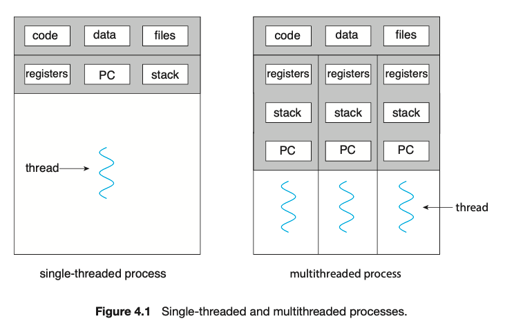

---

## 1. 프로세스(Process)

### 프로세스 소개

프로세스(Process)는 컴퓨터에서 **실행 중인 프로그램**을 의미한다. 프로세스는 **프로그램 코드와 그에 관련된 자원(예: 메모리, CPU 점유, 입출력 등)을 포함하여 CPU에서 실행될 수 있는 상태를 나타낸다**. 프로세스는 운영 체제에서 프로그램을 실행하는 기본 단위이며, 운영체제는 프로세스 단위로 다양한 작업을 수행하는 데 필요한 자원과 상태를 관리한다.

쉽게 말해서 메모리 위에서 실행 중인 프로그램을 나타내는 하나의 작업 단위를 프로세스라고 생각하면 된다.

 

> **프로그램 그 자체는 프로세스가 아니다!**
>
> 프로그램 자체는 명령어의 집합일 뿐이다. 반면에 프로세스는 해당 프로그램을 실행하여, 프로세스가 사용할 독립된 메모리 공간을 할당받는다.
>
> 예를 들면, 게임을 실행을 위해 아이콘을 더블 클릭하기 전 까지는 명령어의 집합으로 존재할 뿐이다. 비로소 실행을 시켜야지만 자원을 할당받고 상태를 관리 받을 수 있는 프로세스가 되는 것이다.
{: .prompt-warning }

 

**사용자 영역에서 저장**되는 **프로세스의 메모리 공간(주소 공간)**은 다음과 같이 구성된다.

 

_process memory_

* **텍스트 영역(Text Section)**
  * 실행 가능한 코드가 저장되는 공간
  * 일반적으로 읽기 전용이다
* **데이터 영역(Data Section)**
  * 초기화 된 전역 변수(global variable)와 정적 변수(static variable)를 저장하는 공간
  * BSS 영역이라고 해서, 초기화 되지 않은 전역 변수와 정적 변수를 모아 놓는 영역이 있다
  * 프로그램 시작 시 할당되고 종료 시 해제된다
* **힙 영역(Heap Section)**
  * 런타임(runtime) 도중 동적으로 할당된 메모리 블록이 저장된다
* **스택 영역(Stack Section)**
  * 함수 호출 시 생성되는 지역 변수, 매개변수, 리턴 주소 등이 저장된다
  * 스택은 함수 호출시 스택 프레임(stack frame)이 생성되고, 종료시 스택 프레임이 제거되는 방식으로 관리된다

 

> **정적 변수(static variable)**
>
>  함수 내부 또는 외부(파일 내)에서 선언되며, 프로그램의 전체 실행 시간 동안 메모리에 존재하는 변수.
{: .prompt-info }

 

---

### 프로세스 상태(Process State)

프로세스는 실행 중에 여러 가지 상태를 가지며, 운영 체제는 이러한 상태를 관리하여 프로세스가 올바르게 실행될 수 있도록 한다.

 

_process state_

프로세스들은 여러 상태를 전이하며 실행된다.(위 그림 참고)

다음은 각 프로세스 상태에 대한 설명이다.

* **new(새로운 상태)**
  * **프로세스가 생성되고 있는 상태**
  * 아직 실행 준비가 되지 않았으며, 운영 체제는 프로세스의 초기화 작업을 수행
  * 메모리 할당, PCB 생성 등의 작업이 이루어진다
* **ready(준비 상태)**
  * **프로세스가 실행 준비가 완료된 상태**
  * 프로세스는 실행될 준비가 되어 있지만, 현재 CPU를 사용할 수 없는 상태이다
  * 준비 상태 큐에 위치하며, CPU 할당을 기다린다
* **running(실행 상태)**
  * **프로세스가 현재 CPU를 사용하여 실행되고 있는 상태**
  * 하나의 CPU 코어는 동시에 하나의 프로세스만 실행할 수 있기 때문에, 실행 상태는 오직 하나의 프로세스만 가질 수 있다
* **waiting, blocked(대기 상태)**
  * **프로세스가 실행을 중단하고 특정 이벤트(예: I/O 작업, 자원 할당 등)를 기다리고 있는 상태**
  * 대기 상태 큐에서 관리된다
* **terminated(종료 상태)**
  * **프로세스가 실행을 완료하거나 강제로 종료된 상태**
  * 운영 체제는 프로세스의 자원을 회수하고, 프로세스 제어 블록(PCB)을 제거한다

 

> 일부 운영 체제에서는 프로세스 관리를 더 효율적으로 하기 위해 추가적인 상태를 정의하기도 한다.
>
> 예시) Suspended-Blocked, Suspended-Ready, 등 ...
{: .prompt-info }

 

---

### 프로세스 제어 블록(PCB, Process Control Block)

시분할(time-sharing) 운영 체제에서는 **프로세스들은 번갈아가며 한정된 시간 만큼만 CPU를 이용**해야 한다. 

각 프로세스 마다 CPU를 사용할 수 있는 일정한 시간을 할당하고, 프로세스가 할당된 시간을 다 사용하면 타이머 인터럽트(timer interrupt)가 발생해서 다음 프로세스로 전환 된다.

 

빠르게 번갈아가면서 수행되는 **프로세스들을 효율적으로 관리하기 위해서 사용하는 자료구조**를 **PCB(Process Control Block)**라고 한다. **커널에서는 프로세스를 다음과 같이 PCB 형태로 관리**한다고 보면 된다.

 

_PCB_

* **프로세스 식별자(PID, Process number, Process identifier)**
  * 각 프로세스를 고유하게 식별하는 값
  * PID를 통해 운영 체제는 프로세스를 구분하고 관리한다

* **프로세스 상태(Process state)**
  * 현재 프로세스의 상태

* **프로그램 카운터(Program Counter, PC)**
  * 프로세스가 다음에 실행할 명령어의 주소를 가리킨다
  * 문맥 교환 시 이 값을 저장하고 복원하여 프로세스가 이전 상태에서 이어서 실행될 수 있도록 한다

* **CPU 레지스터(CPU registers)**
  * 프로세스가 실행 중일 때 사용하던 모든 CPU 레지스터의 값
  * 문맥 교환 시 이 값을 저장하고 복원하여 프로세스의 연속성을 보장한다

* **CPU 스케쥴링 정보(CPU scheduling information)**
  * 프로세스의 우선순위, 스케줄링 큐 포인터, 기타 스케줄링 매개변수 등의 정보를 포함한다
  * 스케줄러가 프로세스를 효율적으로 관리하기 위해 사용한다

* **메모리 관리 정보(Memory management information)**
  * 프로세스의 메모리 공간에 대한 정보를 포함한다
  * 프로세스 마다 사용하는 메모리 주소가 다르니깐 당연히 메모리 주소에 대한 정보가 필요하다
  * 예를 들어, 페이지 테이블(page table), 세그먼트 테이블, 베이스 및 리미트 레지스터 등의 정보가 포함된다

* **집계 정보(Accounting information)**
  * CPU 사용 시간, 실제 사용 시간, 프로세스 생성 시간 등과 같은 정보를 포함한다
  * 주로 성능 분석과 자원 할당 최적화에 사용된다

* **입출력 상태 정보(I/O status information)**
  * 프로세스가 사용 중인 입출력 장치와 파일에 대한 정보를 포함한다
  * 예를 들어, 열린 파일 목록, 입출력 장치 큐 등의 정보가 포함된다

 

---

### 컨텍스트 스위치(Context Switch, 문맥 교환)

> **타임 슬라이스(Time Slice)**
>
> **각 프로세스가 CPU를 사용할 수 있는 최대 시간**. 이 시간 동안 프로세스는 실행 상태를 유지하며, 타임 슬라이스가 끝나면 운영 체제는 다른 프로세스에 CPU를 할당한다.
{: .prompt-info }

 

> **타이머 인터럽트(Timer Interrupt)**
>
> 타이머 하드웨어에 의해 설정된 주기적인 인터럽트. 이 인터럽트는 CPU 시간을 추적하고 타임 슬라이스가 종료되었음을 운영 체제에 알리는 역할을 한다.
{: .prompt-info }

 

> **멀티태스킹(Multi-tasking)**
>
> 타임 슬라이스와 타이머 인터럽트를 통해 프로세스들을 전환시키면서 마치 동시에 여러 작업을 처리하는 것 처럼 수행하는 것을 말한다.
>
> 멀티태스킹의 목적은 자원의 효율적인 활용과 프로세스의 응답 시간을 최소화 시키는 것이다.
{: .prompt-info }

 

**프로세스들은 번갈아가며 한정된 시간 만큼만 CPU를 이용**한다고 설명했다. 프로세스들은 타임 슬라이스(time slice)라는 일정한 시간 간격을 사용하여 각 프로세스에 CPU를 사용할 수 있는 시간을 할당하고, 각 타임 슬라이스가 끝날 때마다 타이머 인터럽트(timer interrupt)가 발생해서 해당 타임 슬라이스가 만료되었음을 알린다. 이후 프로세스가 전환된다.

여기서 **컨텍스트 스위치(context switch)는 운영 체제가 CPU를 하나의 프로세스에서 다른 프로세스로 전환하는 과정**이다.

 

_context switch_

 

컨텍스트 스위치의 대략적인 과정은 다음과 같다.

* **현재 프로세스 상태 저장**
  * 타이머 인터럽트가 발생하면, 운영 체제는 **현재 실행 중인 프로세스의 상태 정보를 PCB에 저장**한다
  * 이 정보에는 CPU 레지스터, 프로그램 카운터, 메모리 관리 정보 등이 포함된다
* **스케줄러 호출**
  * **운영 체제의 스케줄러가 호출되어 다음에 실행될 프로세스를 결정**한다
  * 스케줄러는 준비 상태 큐(ready state queue)에 있는 프로세스 중에서 선택한다
* **새 프로세스 상태 로드(복원)**
  * 선택된 프로세스의 PCB에서 상태 정보를 참조해서 상태를 복원한다
  * 이 정보에는 해당 프로세스가 마지막으로 실행되었을 때의 CPU 레지스터 값, 프로그램 카운터, 메모리 관리 정보 등이 포함된다
* **프로세스 전환**
  * CPU가 새 프로세스를 실행하기 시작한다
  * 프로그램 카운터의 값을 새 프로세스의 시작 지점으로 설정하고, CPU 레지스터 값을 새 프로세스의 값으로 설정한다

 

> **프로세스의 상태 정보를 문맥(context)**이라고 한다. 그래서 프로세스의 교환을 이런 문맥을 교환한다고 해서 문맥 교환(context switching)이라고 부른다.
{: .prompt-info }

 

이런 컨텍스트 스위칭을 통해서 여러 프로세스가 동시에 실행되는 것처럼 보여지는 멀티태스킹(multi-tasking)을 구현할 수 있고, 시스템 자원의 분배와 CPU 활용을 극대화할 수 있다.

컨텍스트 스위치는 필수적인 작업이지만, **비용이 발생한다**. 이러한 비용을 **오버헤드(Overhead)**라고 표현한다. 오버헤드에 해당하는 요소는 다음과 같다.

* **저장 및 로드 시간**: 현재 프로세스의 상태를 저장하고, 새 프로세스의 상태를 로드하는 시간
* **캐시 손실**: 컨텍스트 스위치가 발생하면 CPU 캐시가 비워지거나 재배치되어야 하는 경우가 있다
* **메모리 관리 작업**: 프로세스의 메모리 맵이 변경되면, TLB(Translation Lookaside Buffer)와 같은 메모리 관리 구조가 무효화될 수 있다(가상 메모리에서 다룰 예정이다)

 

이런 컨텍스트 스위치의 오버헤드를 줄이는 방법에 대해서는 이후에 스레드(thread)를 다루면서 살펴볼 예정이다.

 

---

### 프로세스 계층 구조(Process Hierarchy)

프로세스의 계층 구조는 **운영 체제에서 프로세스들이 어떻게 계층적으로 조직되고 관리되는지를 설명하는 개념**이다. 이 구조는 다양한 프로세스들이 서로 관계를 맺고 협력하며 실행되는 방식을 이해하는 데 중요하다.

프로세스는 실행 도중에 시스템 콜을 통해서 다른 프로세스를 생성할 수 있다.

* 새 프로세스를 생성한 프로세스: **부모 프로세스(Parent process)**
* 부모 프로세스에 의해 생성된 프로세스: **자식 프로세스(Child process)**
* 자식 프로세스는 또 다른 자식 프로세스를 생성할 수 있다

 

다음 그림은 **프로세스 트리(Process Tree)**이다.

 

_process tree_

* 프로세스 계층 구조는 **프로세스 트리**로 시각화될 수 있다
* 이 트리는 루트 프로세스(root process)에서 시작하여 자식 프로세스들로 확장된다
* 부모 프로세스와 자식 프로세스는 별개의 PID를 가진다
  * 일부 운영체제에서는 자식 프로세스 PCB에 부모 프로세스의 PID(PPID)를 명시하기도 한다

 

> **루트 프로세스(Root Process)**
>
> 시스템이 시작될 때 가장 먼저 실행되는 프로세스. 루트 프로세스 이외의 모든 프로세스는 이 프로세스에서 파생된다. 현대 Linux 시스템에서는 `systemd`가 루트 프로세스를 담당하고 있다. (`pid`가 `1`인 프로세스)
>
> `systemd`는 기존에 사용되던 `init`을 대체하면서 기능과 성능 향상이 이루어졌다.
>
> `systemd` [참고](https://docs.redhat.com/ko/documentation/red_hat_enterprise_linux/7/html/system_administrators_guide/chap-managing_services_with_systemd)
{: .prompt-info }

 

---

### 프로세스의 생성

프로세스 생성에 사용되는 `fork()`,  `exec()`에 대해 알아보자.

 

#### `fork()`

`fork()` 시스템 콜은 **현재 실행 중인 프로세스(부모 프로세스)의 복사본을 만들어 새로운 프로세스(자식 프로세스)를 생성**한다. `fork()`를 호출하는 시점에 프로세스는 두 개로 분기된다(부모 프로세스와 자식 프로세스). `fork()`의 반환 값에 따라 부모와 자식을 구별할 수 있다.

* 부모 프로세스에게는 자식 프로세스의 PID가 반환된다
* 자식 프로세스에게는 `0`이 반환된다
* `fork()`가 실패하면 부모 프로세스에게 `-1`이 반환된다

 

_fork()_

* 자식 프로세스는 부모 프로세스의 주소 공간을 복사한다. 여기에는 코드, 데이터, 힙, 스택이 포함된다.
  * PCB가 복사되는 것은 아니다!
*  복사된 후에는 독립된 주소 공간을 가지게 되어, 하나의 프로세스에서 다른 프로세스의 메모리 내용을 직접 수정할 수 없다
* 자식 프로세스는 부모 프로세스의 코드와 데이터를 복제하지만, 이후의 실행은 독립적이다

 

---

#### `exec()`

`exec()` 시스템 콜은 **현재 프로세스를 새로운 프로그램으로 덮어쓴다**. 쉽게 말해서 현재 프로세스를 대체하여 지정된 프로그램을 실행한다.

보통 **`fork()`와 `exec()`을 조합**해서 **새로운 프로세스를 생성하고, 그 프로세스에서 새로운 프로그램을 실행**하는 방법을 많이 사용한다.

 

_fork()-exec() 조합_

* 자식 프로세스가 `exec()`을 호출하면 자식 프로세스의 주소 공간은 새로운 프로그램으로 덮어써진다

 

---

#### `wait()`

`wait()` 시스템 콜은 부모 프로세스가 자식 프로세스의 종료를 기다리기 위해 사용한다. `wait()`은 부모 프로세스가 자식 프로세스가 종료될 때까지 블록(block) 상태로 대기하게 하며, 자식 프로세스가 종료되면 해당 종료 상태를 수집한다.

 

_wait()_

* **자식 프로세스 종료 대기**: 부모 프로세스가 자식 프로세스의 종료를 기다려야 할 때 사용한다
* **자식 프로세스 상태 확인**: 자식 프로세스가 정상적으로 종료되었는지, 어떤 신호에 의해 종료되었는지 등의 상태를 확인할 때 사용한다
* **좀비 프로세스 방지**: 자식 프로세스가 종료된 후 그 종료 상태를 수집하지 않으면 좀비 프로세스가 되는데, 이를 방지하기 위해 `wait()`를 사용한다

 

---

## 2. 스레드(Thread)

### 스레드 소개

스레드(Thread)는 **프로세스(Process)를 구성하는 하나의 실행 흐름 단위(작업 단위)**이다. 프로세스는 운영 체제에서 실행되는 독립적인 프로그램의 인스턴스를 의미하는 반면, 스레드는 그 프로세스 내에서 병렬로 실행되는 여러 작업 단위이다.

프로세스는 무조건 **하나 이상의 스레드로 구성**되어 있으며, **하나의 프로세스는 여러 스레드를 포함할 수 있다**. 스레드들은 **프로세스의 자원(code, data, files, 등)을 공유**하며, 각각 **독립적인 실행 흐름**을 가진다.

 

> **스레드는 CPU에서 실행되는 가장 기본적인 단위(unit of execution)**이다.
>
> *아니 프로세스가 기본 단위 아니였어?*
>
> 위에서 설명했듯이, 프로세스는 무조건 **하나 이상의 스레드로 구성**되어 있다. 이때 프로세스는 실행 중인 **프로그램의 독립적인 인스턴스**이며, 운영 체제에서 관리하는 **큰 실행 단위**이다. 그리고 스레드는 프로세스 내에서 **실제로 명령어를 실행하는 기본 단위**로, CPU에서 실행되는 "unit of execution"이다.
{: .prompt-info }

 

_multi-thread_

* **스레드는 독립적인 실행 흐름을 가진다**: 각 스레드는 독립적인 프로그램 카운터(PC), 레지스터, 스택을 가진다
* 하나의 프로세스는 하나 이상의 스레드로 구성되어 있다
  * 여러 프로세스를 동시에 사용 : 멀리 프로세싱(multi-processing)
  * 하나의 프로세스 내에서 여러 스레드를 동시에 사용 : 멀티 스레딩(multi-threading)

 

스레드의 **주요 구성 요소**는 다음과 같다.

* **사용자 영역에서 공유하는 메모리 영역**
   * **공유 메모리 영역**
     * **코드 영역(Text)**
       * 프로그램의 실행 코드가 위치하는 영역
       * 모든 스레드는 동일한 코드를 공유한다
     * **데이터 영역(Data)**
       * 초기화된 전역 변수와 정적 변수가 위치하는 영역
       * 모든 스레드는 이 영역을 공유한다
     * **힙 영역(Heap)**
       * 동적으로 할당된 메모리 공간
       * 모든 스레드는 힙을 공유하여 동적 메모리를 할당하고 접근할 수 있다
   * **개별 메모리 영역**
     * **스택 영역 (Stack)**
       * 각 스레드는 독립적인 스택을 가지며, 이 스택은 스레드가 함수 호출을 관리하고 로컬 데이터를 저장하는 데 사용된다
       * 스레드의 스택은 스레드가 생성될 때 할당되며, 각 스레드의 실행 흐름에 맞춰 동적으로 변한다
     * **레지스터(Registers)**
       * 각 스레드는 자신의 레지스터 집합을 가지고 있으며, 이것은 스레드의 실행 상태를 유지하는 데 필요하다
     * **프로그램 카운터(Program Counter, PC)**
       *  현재 실행 중인 명령어의 주소를 가리키는 레지스터
       * 스레드는 독립적인 실행 흐름을 가지므로 각 스레드는 자신의 프로그램 카운터를 가지고 있다

 

* **TCB (Thread Control Block)**
   * 스레드 제어 블록(TCB)은 스레드의 상태와 속성을 관리하기 위해 운영 체제가 사용하는 데이터 구조이다. TCB는 프로세스 제어 블록(PCB)와 유사하지만, 스레드 수준에서의 제어와 관리를 위해 사용된다.
   * **스레드 ID(Thread ID)**
     * 스레드 ID는 시스템 내에서 스레드를 고유하게 식별하는 데 사용된다
     * 운영 체제는 이 ID를 사용하여 스레드를 관리하고 추적한다
   * **스택 포인터(Stack Pointer)**
     * 스레드의 스택의 현재 위치를 가리킨다
   * **스레드 상태(Thread State)**
     * 스레드는 프로세스와 마찬가지로 실행, 준비, 대기, 종료 등의 여러 상태를 가질 수 있다
     * 스레드의 상태는 운영 체제가 스레드를 스케줄링하고 관리하는 데 중요한 정보를 제공한다
   * **우선순위(Priority)**
     * 우선순위는 스레드 스케줄링에 영향을 미치는 요소 중 하나이다
     * 운영체제는 우선순위를 기반으로 스레드를 선택하여 실행할 수 있다
   * **스레드 소속 프로세스(Process Identifier, PID)**
     * 스레드가 속한 프로세스를 식별하는 정보
     * 이를 통해 스레드가 어느 프로세스에 속해 있는지 알 수 있다
   * **링크(Thread Link)**
     * 동일한 프로세스 내에서 다른 스레드와의 연결 정보를 포함한다
     * 이를 통해 운영 체제가 프로세스 내 스레드를 관리할 수 있다
   * 이외에도 여러가지 정보를 포함하고 있다

 

TCB는 운영체제가 스레드를 관리하고 스케줄링하는 데 중요한 역할을 한다.

* **스레드 생성**
  - 새로운 스레드를 생성할 때, TCB가 초기화되고 스레드의 실행 정보가 저장된다
* **스레드 스케줄링**
  - 운영 체제의 스케줄러는 TCB를 참조하여 어느 스레드를 실행할지 결정한다
  - 스레드의 우선순위, 상태 등을 바탕으로 스케줄링이 이루어진다
* **컨텍스트 스위칭**
  * 한 스레드에서 다른 스레드로 전환할 때, 현재 스레드의 레지스터 값, 프로그램 카운터 등을 TCB에 저장하고, 다음 스레드의 TCB에서 해당 값을 로드한다
* **동기화 메커니즘(Synchronization Mechanisms)**
  * 스레드는 공유 자원을 안전하게 사용하기 위해 동기화 메커니즘을 필요로 한다
  * 뮤텍스, 세마포어, 모니터, 등이 여기에 포함된다
  * 스레드 간의 경합 조건이나 데드락을 방지하기 위해 사용된다
  * 이런 동기화도 TCB를 이용해서 관리된다

 

---

### 싱글 스레드의 단점

먼저 싱글 스레드(single-thread)만 사용할 수 있다면 프로그램이 어떻게 동작할까? 

 

_single-thread_

* **직렬 처리(Sequential Processing)**: 모든 작업이 순차적으로 처리된다
  * 한 작업이 끝나야 다음 작업을 수행할 수 있기 때문에, 각 작업은 다른 작업을 기다려야 한다
  *  I/O 작업(파일 읽기/쓰기, 네트워크 통신 등)이나 시간이 오래 걸리는 연산이 실행되는 동안, 프로그램의 다른 부분은 대기해야 한다
  * 예를 들면, 특정 파일을 보거나 채팅을 치는 동안은 UI가 멈추는 현상이 일어날 수 있다
  * 이는 **응답성 저하**로 이어진다
* 직렬 처리와 연관되는 문제로 **동시성 부족**이 있다
  * 병렬 처리의 부재로 인해, 여러 작업을 동시에 수행할 수 없어 전체 시스템의 처리량이 줄어든다
* **멀티코어 CPU 활용 부족**: 현대의 멀티코어 CPU 환경에서, 싱글 스레드 프로그램은 하나의 코어만 사용하게 된다.
  * 이는 CPU 자원을 비효율적으로 사용하는 것이다

 

이 처럼 싱글 스레드를 사용하는 경우 효율적으로 작업을 수행하기 어렵다는 것을 알 수 있다.

이번엔 멀티스레드를 사용하는 경우를 살펴보자.

 

_multi-thread_

* 각 작업을 처리하기 위해서 별도의 스레드에서 처리해서 응답성을 높일 수 있다
* 한 스레드에서 I/O 작업이 있는 동안 다른 스레드의 작업을 처리할 수 있다

 

---

### 프로세스간 컨텍스트 스위칭의 비용은 비싸다

이전에 설명한 프로세스 레벨의 컨텍스트 스위칭(context switching)에 대한 내용을 복습하자.

* 컨텍스트 스위칭은 하나의 프로세스에서 다른 프로세스로 전환하는 과정이다
* 프로세스 레벨의 컨텍스트 스위칭은 타임 슬라이스가 끝나고 타이머 인터럽트가 발생한뒤에 일어난다
* 컨텍스트 스위치가 일어나면, **새 프로세스로 전환하기 위해서 해당 프로세스가 마지막으로 실행되었을 때의 컨텍스트(CPU 레지스터 값, 프로그램 카운터, 메모리 관리 정보 등)가 로딩**된다
* 컨텍스트 스위치는 필수적인 작업이지만, **비용이 발생한다**. 이러한 비용을 **오버헤드(Overhead)**라고 표현한다.

 

여기서 우리가 살펴볼 것은 컨텍스트 스위칭의 오버헤드다. 컨텍스트 스위칭은 다음의 두 유형으로 나눌 수 있다.

* **프로세스 간 컨텍스트 스위칭**
* **같은 프로세스 내 스레드 간 컨텍스트 스위칭**

 

> 프로세스 간 컨텍스트 스위칭은 엄밀히 말하자면 다른 프로세스의 스레드 간 컨텍스트 스위칭이다.
>
> 프로세스는 하나 이상의 스레드로 구성되었다고 이전에 설명한적이 있다. 스레드는 CPU의 기본 실행 단위이다.
{: .prompt-info }

 

**같은 프로세스 내의 스레드 간 컨텍스트 스위칭이 더 빠르다**. 그림으로 살펴보자.

 

_thread context switching_

* 같은 프로세스 내의 스레드 간 컨텍스트 스위칭은 스레드의 상태를 저장, 로드하는 방식으로 이루어진다
* 위에서는 I/O 블럭을 예시로 들었는데, **컨텍스트 스위칭은 I/O 블럭이 아니더라고 다양한 상황에서 발생**할 수 있다

 

이번에는 다른 프로세스간 컨텍스트 스위칭을 살펴보자.

 

_process context switching_

* **PCB 저장 및 로드**: TCB뿐만 아니라, PCB를 저장하고 로드하는 작업이 포함된다
* **메모리 관련 작업 필요**: 프로세스 간 컨텍스트 스위칭에서는 새로운 프로세스의 주소 공간을 로드해야 하므로, 메모리 매핑을 포함한 메모리 관련 작업이 필요하다(가상 메모리에서 더 자세히 다룰 예정이다)

 

**스레드 컨텍스트 스위칭이 프로세스 컨텍스트 스위칭보다 성능이 좋은 이유**를 몇 가지 정리해보자.

* 스레드 컨텍스트 스위칭은 **메모리 주소 관련 처리를 하지 않기 때문에** 더 빠르다
* 스레드는 같은 프로세스 내에서 자원을 공유하기 때문에, 컨텍스트 스위칭 시 자원 상태를 저장하고 복원할 필요가 없다
* 프로세스 컨텍스트 스위칭은 프로세서 상태뿐만 아니라, 메모리 상태, 파일 테이블, 프로세스 제어 블록(PCB) 등의 여러 정보를 저장하고 복원해야한다
* 같은 프로세스 내에서 스레드 간의 스위칭은 TLB와 캐시가 대부분 유지되며, 따라서 TLB 미스나 캐시의 비효율성 문제가 상대적으로 적다

 

> **캐시 오염(Cache Pollution)**
>
> 캐시 오염은 **캐시에 저장된 데이터가 프로세스나 스레드 간의 컨텍스트 스위칭으로 인해 자주 변경되어 캐시의 효율성이 떨어지는 현상**을 의미힌다. 캐시 메모리는 CPU와 메인 메모리 사이의 속도 차이를 줄이기 위해 고속의 소규모 메모리를 사용하여 자주 접근하는 데이터를 저장한다. 캐시 오염이 발생하면 캐시의 히트율(hit rate)이 떨어져, 시스템의 전반적인 성능이 저하된다.
>
> 프로세스 컨텍스트 스위칭에서 CPU 캐시 메모리가 초기화 될 확률이 더 높다.(이건 운영체제 또는 하드웨어마다 다를 수 있다)
>
> **캐시 오염의 영향**
>
> * **캐시 히트율 저하**: 자주 사용되던 데이터가 캐시에서 빠르게 교체되므로 캐시 히트율이 낮아진다
> * **메모리 접근 시간 증가**: 캐시 미스가 발생할 때마다 메인 메모리 접근이 필요하므로, 전반적인 메모리 접근 시간이 증가한다
>
> **해결 방법**
>
> * 컨텍스트 스위칭을 줄인다
> *  프로세스가 사용하는 데이터 영역을 분리하여 캐시 간섭을 최소화한다
> * 캐시 알고리즘을 변경한다
{: .prompt-info }

 

---

## Reference

1. [강민청: 혼자 공부하는 컴퓨터 구조 + 운영체제](https://product.kyobobook.co.kr/detail/S000061584886)
2. [Abraham Silberschatz: Operating System Concepts(공룡책)](https://product.kyobobook.co.kr/detail/S000003114660)
3. [쉬운코드: 운영체제](https://www.youtube.com/watch?v=QmtYKZC0lMU&list=PLcXyemr8ZeoQOtSUjwaer0VMJSMfa-9G-)
4. [https://stackoverflow.com/questions/40282990/why-do-we-use-wait-when-we-create-child-processes](https://stackoverflow.com/questions/40282990/why-do-we-use-wait-when-we-create-child-processes)