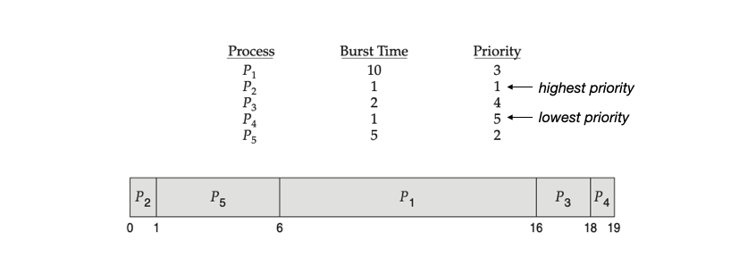

---

## 1. CPU 스케쥴링(CPU Scheduling)

### 스케쥴링 소개

CPU 스케줄링은 운영체제에서 **프로세스나 스레드에 CPU 자원을 할당하는 방법을 정하는 작업**이다. 이를 통해 시스템의 효율성을 최대화하고, 응답 시간을 최소화하며, 공정하게 CPU 자원을 분배하는 것이 목표이다. 쉽게 말해서 효율적인 시스템을 위해서 **CPU가 다음으로 수행할 프로세스의 실행 순서를 정하는 작업**으로 보면 된다.

스케쥴링의 대략적인 과정을 살펴보자.

1. 일단 운영체제에서 여러 프로세스를 관리하기 위해서 **준비 큐(Ready queue)**라는 것을 사용한다. 준비 큐는 **실행 준비 상태(Ready state)에 있는 모든 프로세스들을 관리하는 큐**이다. 이 큐에 있는 프로세스들은 CPU를 할당받아 실행되기를 기다린다.
2. **스케쥴러(Scheduler)**는 준비 큐에서 실행 준비가 되어 있는 프로세스 중에서 하나를 선택한다. 선택은 **스케쥴링 알고리즘**에 따라 달라진다. 선택한 프로세스는 디스패처에 의해 CPU에 할당이 될 것이다.
3. **디스패처(Dispatcher)**는 스케쥴러에 의해 **선택된 프로세스를 CPU에 할당**한다. 디스패처는 선택된 프로세스의 문맥(context)을 로드하고, 프로세스를 실행(Running) 상태로 전환한다.
4. **프로세스가 CPU에서 실행된다**. 프로세스 실행 중 **I/O 작업을 요청하면, 대기(Waiting) 상태로 전환**된다. I/O 작업을 요청한 프로세스는 **대기 큐(Waiting queue, I/O queue)로 이동**한다.
5. 프로세스의 I/O 작업이 완료되면, 프로세스는 다시 준비 상태(Ready state)로 전환되고, 준비 큐에 추가되어 CPU 할당을 다시 기다린다.

 

프로세스 상태 전이에 따른 스케쥴링의 과정을 그림으로 살펴보자.

 

_Process Scheduling_

 

> **용어 정리**
>
> 위에서 언급한 몇 가지 용어를 다시 정리해보자.
>
>  
>
> **준비 큐(Ready queue)**
>
> * 준비 큐는 실행 준비가 된 프로세스들이 CPU를 할당받기 전까지 대기하는 장소. 준비 큐는 현재 실행 가능하지만 CPU를 사용하고 있지 않은 프로세스들의 상태를 관리한다.
> * 준비 큐는 이름이 큐(queue)이지만, 굳이 FIFO(선입선출) 큐로 구현할 필요 없다. 우선순위 큐, 연결 리스트 등 다양한 방식으로 대기열을 구현할 수 있다.
>
> 
>
> **대기 큐(Waiting queue)**
>
> * I/O 큐라고도 부른다
> * 프로세스가 I/O 작업을 요청하거나 특정 이벤트를 기다릴 때, 해당 프로세스는 CPU를 사용할 수 없으므로 대기 큐로 이동한다
> * 대기 상태(Waiting/Blocked state)에 있는 프로세스들이 이 큐에 속한다
>
> 
>
> **스케쥴러(Scheduler)**
>
> * 준비 큐에 있는 프로세스 중 하나를 스케쥴링 알고리즘을 사용해서 선택한다
>
> 
>
> **디스패처(Dispatcher)**
>
> * 프로세스의 실행을 관리하고 CPU에 할당하는 기능을 담당하는 모듈. 쉽게 말해서 스케쥴러에 의해 선택된 프로세스를 CPU에 할당해준다.
>   * 컨텍스트 스위칭
>   * 사용자 모드로 전환하는 일
>   * 프로그램을 다시 시작하기 위해 사용자 프로그램의 적절한 위치로 이동하는 일
>
> * 스케쥴러와 디스패처를 하나로 묶어서 설명하는 경우도 많다
>
> 
>
> **스케쥴링 알고리즘(Scheduling algorithm)**
>
> * 스케쥴러가 CPU에게 할당할 프로세스나 스레드를 선택하는 방법을 결정하는 알고리즘
> * 예시) **FCFS(First-Come, First-Served)**는 도착한 순서대로 프로세스를 처리하는 알고리즘이다. 뒤에서 자세히 다루겠지만 긴 프로세스가 먼저 도착하면 다른 프로세스들이 오랫동안 대기할 수 있다는 단점이 있다.
{: .prompt-info }

 

---

### 스케쥴링 방식

스케쥴링 방식은 **선점형 스케줄링(Preemptive Scheduling)**과 **비선점형 스케줄링(Non-preemptive Scheduling)**으로 구분할 수 있다.

각 방식에 대해 자세히 살펴보자.

 

---

#### 비선점형 스케쥴링(Non-preemptive Scheduling)

비선점형 스케쥴링은 **현재 실행 중인 프로세스가 자발적으로 CPU 자원을 반환할 때까지 다른 프로세스가 CPU를 요청하더라도 기다려야 하는 방식**이다. 즉, 현재 프로세스가 스스로 작업을 마치거나 블로킹 상태가 되어야만 CPU를 양도할 수 있다.

비선점형 스케쥴링의 대표적인 특징은 다음과 같다.

* **느린 응답성**: 비선점형 스케줄링은 응답 시간이 길어질 수 있다. 특히, 장기 실행 프로세스가 CPU를 독점하면 다른 프로세스가 대기하게 된다.
* **협력적(cooperative)**: 프로세스들이 서로 협조적으로 자원을 공유해야 한다. 각 프로세스가 CPU 자원을 자발적으로 양도하지 않으면, 다른 프로세스가 CPU를 사용할 수 없기 때문에 프로그램 레벨에서 서로 협력을 하는 의지가 필요하다.

 

비전섬형 스케쥴링 알고리즘에는 다음이 있다.

* **FCFS(First-Come, First-Served)**: 프로세스가 도착한 순서대로 CPU를 할당받으며, 먼저 도착한 프로세스가 먼저 실행된다
* **SJF(Shortest Job First)**: CPU 시간을 가장 적게 소요하는 프로세스가 우선적으로 실행된다

 

---

#### 선점형 스케쥴링(Preemptive Scheduling)

선점형 스케줄링은 **현재 실행 중인 프로세스가 일정한 조건이 되면 CPU 자원을 다른 프로세스에게 강제로 양도할 수 있는 방식**이다. 즉, 현재 실행 중인 프로세스가 자발적으로 CPU를 반환하지 않아도, **운영체제가 특정 조건에 따라 CPU 자원을 다른 프로세스에게 선점**할 수 있다.

오늘날 대부분의 컴퓨터 시스템은 선점형 스케쥴링 방식을 사용한다.

 

선점형 스케쥴링의 동작방식을 대략적으로 설명하면 다음과 같다.

* **타임 슬라이스(Time Slice)**
  * 선점형 스케줄링에서는 각 프로세스에게 일정한 시간 단위(타임 슬라이스)가 할당된다.
  * 타임 슬라이스가 끝나면 현재 실행 중인 프로세스는 CPU 자원을 반납하고, 운영체제는 다음 프로세스를 선택하여 CPU를 할당한다
* **컨텍스트 스위칭(Context Switching)**
  * 선점형 스케줄링에서는 프로세스 간에 CPU 자원을 교환할 때 컨텍스트 스위칭이 발생한다
  * 운영체제는 현재 프로세스의 상태를 저장하고, 다음 프로세스의 상태를 복원하여 CPU를 할당한다
* **우선순위 기반 선점**
  * 프로세스가 우선순위 기반으로 실행되는 경우, 우선순위가 높은 프로세스가 낮은 프로세스의 실행을 선점할 수 있다
  * 이 경우 우선순위가 낮은 프로세스는 운영체제에 의해 실행을 잠시 중단하고 대기 상태로 전환될 수 있다
* **시간 제어 및 강제 전환**
  * 선점형 스케줄링은 프로세스가 자발적으로 CPU를 반환하지 않더라도, **운영체제가 강제로 CPU를 전환할 수 있다**
  * 이것이 비선점형 스케쥴링과의 가장 큰 차이점이다

 

> **우선순위(priority)**
>
> 우선순위(priority)는 운영체제가 프로세스들을 관리하고 스케줄링하는 데 있어 각 프로세스의 중요도를 나타내는 값이다. 우선순위는 운영체제가 어떤 프로세스를 먼저 실행할지 결정하는 데 중요한 역할을 한다.
{: .prompt-info }

 

선점형 스케쥴링의 대표적인 특징은 다음과 같다.

* **타임 슬라이스 사용**: 각 프로세스에 일정한 시간 단위(타임 슬라이스)가 할당된다. 프로세스는 할당된 시간 동안만 CPU를 사용할 수 있으며, 타임 슬라이스가 끝나면 운영체제가 강제로 다른 프로세스에 CPU를 할당한다.
* **우선순위 기반 선점**: 우선순위가 높은 프로세스가 준비 상태가 되면, 현재 실행 중인 우선순위가 낮은 프로세스를 중단시키고 높은 우선순위의 프로세스에 CPU를 할당할 수 있다
* **빠른 응답성에 유리**: 선점형 스케줄링은 시스템의 응답성을 높이는 데 유리하다
* **컨텍스트 스위칭이 빈번하다**: 이는 시스템의 응답성을 높이지만, 컨텍스트 스위칭에 따른 오버헤드가 존재한다
* **동기화 문제**: 선점형 스케줄링에서는 프로세스가 언제든지 중단될 수 있기 때문에, 공유 자원에 접근하는 과정에서 교착 상태(Deadlock)나 경쟁 상태(Race Condition) 등의 동기화 문제가 발생할 수 있다
  * 뒤에서 다루겠지만 이를 해결하기 위해서 세마포어, 뮤텍스 등의 동기화 메커니즘을 통해 자원 접근을 제어한다

 

선점형 스케쥴링 알고리즘에는 다음이 있다.

* **라운드 로빈(Round Robin)**: 모든 프로세스가 동일한 시간 할당량(타임 슬라이스)을 가지고, 순서대로 CPU를 할당받는 방식이다
* **우선순위 스케줄링(Priority Scheduling)**: 각 프로세스에 우선순위를 부여하고, 높은 우선순위를 가진 프로세스가 낮은 우선순위의 프로세스를 선점할 수 있는 방식이다
* **멀티레벨 큐 스케줄링(Multilevel Queue Scheduling)**: 여러 개의 큐를 사용하여 각 큐에 다른 우선순위를 부여한다. 시스템, 상호작용, 배치 등 프로세스 종류에 따라 다른 큐에 배치된다.
* **기타**

 

---

## 2. 스케쥴링 알고리즘(Scheduling Algorithm)

스케쥴링 알고리즘은 **스케쥴러가 CPU에게 할당할 프로세스나 스레드를 선택하는 방법을 결정하는 알고리즘**이다.

다양한 스테쥴링 알고리즘들이 존재하며, 대표적인 스케쥴링 알고리즘들을 살펴보자.

 

---

### FCFS(First-Come, First-Served)

프로세스가 준비 큐에 도착한 순서대로 CPU를 할당하는 방식. 먼저 도착한 프로세스가 먼저 실행되며, 하나의 프로세스가 완료될 때까지 다른 프로세스는 대기해야 한다.

 

_FCFS_

* `P1`, `P2`, `P3` 순서대로 왔으면 실행도 `P1`, `P2`, `P3` 순으로 실행된다
* 실행중인 프로세스가 완료될 때 까지 다음 프로세스는 대기한다

 

FCFS의 특징

* 비선점형 스케쥴링
* 구현이 매우 쉬움
* 평균 대기 시간이 길어질 수 있다
* 긴 프로세스가 CPU를 점유하면 다른 프로세스들이 오랫동안 대기해야 한다

 

---

### SJF(Shortest-Job-First)

CPU가 **가장 짧은 실행 시간(Burst Time)을 가진 프로세스 부터 할당**된다. 프로세스의 실행 시간이 같은 경우 FCFS를 사용한다.

 

_SJF_

* 가짱 짧은 실행 시간(Burst Time)을 가진 `P4` 부터 실행된다

 

SJF의 특징

* 비선점형 스케쥴링이지만, 선점형 스케쥴링도 가능하다. 이 경우 SRTF라고 부른다
* 짧은 작업을 먼저 처리하므로 전체적으로 대기 시간이 줄어든다
* 프로세스의 실행 시간을 사전에 알 수 없기 때문에 실제로는 정확한 실행 시간을 예측하기 어려울 수 있다
  * 작업의 실행 시간을 미리 알고 있어야 효율적이다
* 짧은 작업이 우선 처리되기 때문에 긴 작업이 무한히 대기하는 기아(Starvation) 현상이 발생할 수 있다

 

---

### SRTF(Shortest-Remaining-Time-First)

현재 실행 중인 프로세스와 준비 큐에 있는 프로세스 중에서 남은 실행 시간이 가장 짧은 프로세스에 CPU를 할당한다. SJF의 선점형 버전이라고 보면 된다.

 

_SRTF_

* 가장 먼저 준비큐에 존재하던 `P1` 부터 실행 → `1ms` 실행 → `P2` 도착
* `P2`가 도착한 시점
  * `P1`은 `7ms`
  * `P2`는 `4ms`
  * 실행 시간이 더 적은 `P2`로 바뀌어서 실행된다 → `P3` 도착
* `P3`가 도착했어도 `P2`의 실행 시간이 더 적기 때문에 `P2`는 그대로 실행 → 중간에 `P4` 도착
* `P2`가 끝난 시점
  * `P1`은 `7ms`
  * `P3`는 `9ms`
  * `P4`는 `5ms`
  * 이제부터 `P4` → `P1` → `P3` 순서로 실행된다

 

SRTF의 특징은 다음과 같다.

* 새로운 프로세스가 자주 도착하는 경우, SJF에 비해서 시스템이 더욱 반응적이고 유연하게 대응할 수 있다
* SJF에 비해 다양한 프로세스가 동적으로 도착하는 환경에서 유리하다

 

---

### RR(Round-Robin) Scheduling

프로세스는 고정된 시간 단위(타임 슬라이스) 동안 CPU를 할당받는다. 타임 슬라이스가 끝나면 다음 프로세스에 CPU가 할당된다.

 

_Round Robin_

* 각 프로세스는 타임 슬라이스가 끝나면, 다시 대기 큐의 맨 끝으로 이동하고, 다음 프로세스가 실행되고 반복된다

 

라운드 로빈 스케쥴링에서는 **타임 슬라이스의 크기가 중요**하다. 타임 슬라이스가 너무 짧으면 컨텍스트 스위칭에 대한 오버헤드가 증가하고, 너무 길면 FCFS 방식과 다를 바 없다.

 

라운드 로빈의 특징은 다음과 같다.

* 모든 프로세스가 공전하게 CPU를 할당받는다
* 응답 시간이 짧아 사용자 인터랙티브 시스템에 적합하다
* 타임 슬라이스의 크기가 중요하다

 

> **컴퓨터 공학에서의 라운드 로빈(Round Robin)**
>
> 라운드 로빈이라는 용어는 CPU 스케쥴링 외에도 컴퓨터 공학에서 자주 사용된다. 일반적으로 공평하고 순차적인 방식으로 작업을 처리하는 알고리즘을 의미한다.
>
> * **순환 처리**: 라운드 로빈 알고리즘은 주어진 항목(작업, 프로세스, 요청 등)을 순서대로 한 번씩 처리한 후, 다시 처음으로 돌아가서 반복하는 방식이다
> * **공평한 분배**: 모든 항목이 동등한 기회를 가지도록 보장하며, 순서가 중요한 경우에도 공평한 처리를 제공한다
{: .prompt-info }

 

---

### Priority Scheduling

우선순위 스케쥴링이라고 부른다. 각 프로세스에 우선순위를 부여하고, 우선순위가 높은 프로세스부터 CPU를 할당한다. 우선순위가 같은 경우 FCFS를 사용한다. 

운선순위 방식은 기본적으로 프로세스의 중요성이나 필요성에 따라 CPU 자원을 효율적으로 분배하려는 목표를 가지고 있다. 우선순위 스케쥴링은 다양한 형태로 구현될 수 있다.

 

우선순위 스테쥴링은 비선점형 방식과 선점형 방식으로 나눌 수 있다.

* **비선점형 우선순위 스케줄링**
  * 프로세스가 CPU를 할당받으면 해당 프로세스가 완료될 때까지 CPU를 점유한다
  * 새로운 프로세스가 도착하면, 현재 CPU를 점유하고 있는 프로세스가 완료된 후에 다음 우선순위 프로세스가 실행된다
  * **장점**: 구현이 간단하고, 문맥 전환 오버헤드가 적다
  * **단점**: 낮은 우선순위 프로세스는 계속해서 대기하는 기아 현상이 발생할 수 있다
* **선점형 우선순위 스케줄링**
  * 새로운 프로세스가 도착할 때, 그 프로세스의 우선순위가 현재 실행 중인 프로세스의 우선순위보다 높으면 현재 프로세스는 중단되고, 새로운 프로세스가 CPU를 사용한다
  * **장점**
    * 높은 우선순위의 프로세스가 낮은 우선순위의 프로세스보다 먼저 처리되므로, 중요한 작업이 더 빠르게 처리된다
  * **단점**
    * 문맥 전환이 빈번하게 발생하여 오버헤드가 증가할 수 있다
    * 기아 현상이 발생할 수 있다
  * 보통, 기아 현상을 줄이기 위한 **우선순위 조정 정책**이 포함된다.(뒤에서 Ageing 기법에 대해 살펴볼 것이다)

 

> **SJF와 SRTF 스케쥴링 방식은 운선순위 스케쥴링의 일종**
>
> * SJF: 실행 시간이 짧은 프로세스에게 높은 우선순위 부여
> * SRTF: 현재 실행 중인 프로세스와 준비 큐에 있는 프로세스 중에서 남은 실행 시간이 가장 짧은 프로세스 부터 높은 우선순위를 부여한다
{: .prompt-info }

 

_Priority Scheduling: Non-Preemptive_

* 비선점형 우선순위 스케쥴링이다
* 선점형 우선순위를 사용하면 SRTF 방식 처럼, 새로운 프로세스가 도착했을때 그 프로세스의 우선순위가 높으면, 그 프로세스가 CPU를 선점한다

 

우선순위 스케쥴링은 **기아(Starvation) 현상이라는 근본적인 문제점**이 있다.

**기아 현상**은 **낮은 우선순위를 가진 프로세스가 계속해서 실행되지 않고 대기하는 상황**을 말한다. 시스템에 높은 우선순위의 프로세스가 자주 도착하면, 낮은 우선순위 프로세스는 CPU를 거의 할당받지 못하게 된다.

**기아 현상을 해결하기 위한 가장 대표적인 방법은 Ageing(노화)** 기법이다. (물론 노화 외에도 다양한 방법들이 존재한다)

**Ageing(노화)**

* 대기 중인 프로세스의 우선순위를 점진적으로 높여서 기아 현상을 방지하는 방법이다
* 프로세스가 대기 큐에서 오래 대기할수록 우선순위를 높여주는 방식
* 이렇게 하면 우선순위가 낮아도 언젠가는 우선순위가 높아져서 CPU를 사용할 차례가 온다

 

---

### Multi-level Queue Scheduling

**Multilevel Queue Scheduling (다단계 큐 스케줄링)**은 **프로세스를 여러 개의 큐로 나누어 각 큐에 대해 서로 다른 스케줄링 정책을 적용하는 스케줄링 기법**이다. 각 큐는 보통 우선순위로 분류되어 있다. (상위 큐는 하위 큐보다 높은 우선 순위를 가진다)

쉽게 말해서 프로세스들을 그룹화해서, 그룹별로 큐를 두는 방식이라고 보면 된다.

이런 다단계 큐 스케쥴링을 사용하면 프로세스를 유형별로 효율적으로 처리하는 것이 가능하다. 예를 들면,

* 우선순위 0: 실시간 프로세스
* 우선순위 1: 시스템 프로세스
* 우선순위 2: 상호작용 프로세스
* 우선순위 3: 백그라운드 프로세스

 

_Multi-level Queue Scheduling_

* 우선순위가 가장 높은 큐에 있는 프로세스를 먼저 처리한다
* 우선순위가 가장 높은 큐가 비어 있으면 다음 우선순위의 큐에 있는 프로세스를 처리한다
* 각 큐별로 스케쥴링 정책을 다르게 지정해서 사용하는 것이 가능하다
  * 예) 
    * 우선순위0: 우선순위 스케쥴링 적용
    * 우선순위1: RR 스케쥴링 적용(타임슬라이스 2)
    * 우선순위2: SRTF 스케쥴링 적용
    * 우선순위3: RR 스케쥴링 적용(타임슬라이스 4)

 

다단계 큐 스케쥴링에서도 기아 현상이 발생할 수 있다. 왜냐하면 **프로세스는 큐 간에 이동할 수 없기 때문이다!** 즉, 우선순위가 낮은 큐의 프로세스는 계속 그 큐에 머무를 수 밖에 없다.

이를 **해결하기 위해서 Multilevel Feedback Queue Scheduling을 사용**할 수 있다.

 

> **Multi-level Feedback Queue Scheduling**
>
> 기존의 Multi-level Queue Scheduling와 달리 프로세스가 여러 개의 큐를 이동하면서 실행될 수 있다. 처음에는 높은 우선순위 큐에 들어가지만, CPU 시간을 많이 사용하면 낮은 우선순위 큐로 이동하게 된다.
>
> * **장점**
>   * CPU 사용량에 따라 프로세스를 동적으로 관리할 수 있다
> * **단점**
>   * 설계와 조정이 상대적으로 복잡하다
>   * 잘못 설계된 경우 성능 저하가 발생할 수 있다
  {: .prompt-info }

 

---

## Reference

1. [강민청: 혼자 공부하는 컴퓨터 구조 + 운영체제](https://product.kyobobook.co.kr/detail/S000061584886)
2. [Abraham Silberschatz: Operating System Concepts(공룡책)](https://product.kyobobook.co.kr/detail/S000003114660)
3. [쉬운코드: 운영체제](https://www.youtube.com/watch?v=QmtYKZC0lMU&list=PLcXyemr8ZeoQOtSUjwaer0VMJSMfa-9G-)
