---

## 1. 동기화(Synchronization)

### 동기화 소개

**동기화(Synchronization)**는 여러 프로세스나 스레드가 **동시에 실행될 때, 이들의 실행 순서를 제어하여 일관성 있는 결과를 보장하는 기술**이다. 동기화는 **주로 공유 자원에 대한 접근을 제어하여 데이터 무결성을 유지하고, 교착 상태(Deadlock)와 경쟁 조건(Race Condition)을 방지**하는 데 사용된다.

<br>

> **데이터 무결성(Data Integerity)**
>
> 데이터의 정확성, 일관성, 유효성이 유지되는 것.
{: .prompt-info }

<br>

> 이 포스트에서 프로세스와 스레드를 통틀어서 **작업(task)**이라는 표현을 사용할 것이다. 프로세스와 스레드를 상호교환적으로 사용할 수도 있다.
{: .prompt-warning }

<br>

다시 정리하자면 동기화가 필요한 주된 이유는 **공유 자원**에 대한 **동시 접근**으로 인한 **데이터 일관성 문제**를 해결하기 위함이다.

* **경쟁 조건(Race Condition):** 여러 스레드가 동시에 공유 자원에 접근할 때, 실행 순서에 따라 결과가 달라질 수 있는 상황이 올 수 있다
* **데이터 일관성(Data Consistency):** 여러 스레드가 공유 데이터를 일관되게 읽고 쓸 수 있도록 보장해야 한다
* **교착 상태(Deadlock):** 두 개 이상의 스레드가 서로가 가지고 있는 자원을 기다리느라 무한 대기 상태에 빠지는 상황이 올 수 있다

<br>

동기화는 보통 이 문제들을 해결하기 위해서 다음을 보장하도록 해야한다.

* **실행 순서 제어(execution order control)**: 작업이 올바른 순서로 실행되도록 한다
* **상호 배제(mutual exclusion)**: 동시에 접근해서는 안되는 자원에 하나의 작업만 접근하도록 한다
* 더 자세한 내용은 뒤에서 다룬다

<br>

---

### 임계 구역(Critical Section)

**공유 자원(Shared Resource)은 여러 작업이 동시에 접근하고 사용할 수 있는 자원**을 의미한다. 동시에 접근할 수 있는 변수, 파일, 데이터 구조, 입출력 장치, 등을 전부 공유 자원이라고 할 수 있다.

이런 **공유 자원에 접근하는 코드의 영역을 임계 구역(Critical Section)**이라고 한다. 임계 구역에서는 기본적으로 하나의 작업만 실행되도록 해야 한다.

이런 **임계 구역을 통해 동시에 공유 자원에 접근해서 발생하는 문제를 Race Condition**이라고 한다.

<br>

> **Race Condition**
>
> 여러 작업이 동시에 공유 자원에 접근할 때, 접근 순서나 타이밍에 따라 프로그램의 결과가 달라지는 상황을 말한다. 이러한 상황은 **데이터 일관성 문제**를 일으키며, 예기치 않은 버그나 시스템 오류를 발생시킬 수 있다.
>
> 자원을 가지고 경쟁 한다고 해서 경합(Race)이라는 표현이 사용된다.
{: .prompt-info }

<br>

레이스 컨디션(Race Condition)이 발생하는 **근본적인 이유 중 하나는 고수준(high-level) 언어에서 작성된 코드가 저수준(low-level)에서 실행될 때 예상치 못한 방식으로 인터리빙(섞여서) 실행될 수 있기 때문**이다.

고수준 코드에서 `counter`를 증가시키는 단순한 작업을 한번 살펴보자.

```cpp
int counter = 0;

void increment() {
    counter++;
}
```

* 해당 코드는 단순히 `counter`의 값을 `1` 증가시키는 코드이다
* 나중에 `increment()`를 사용했을때, `counter`를 증가시키는 부분이 임계구역이 된다

<br>

그럼 해당 코드의 저수준(어셈블리)에서의 동작을 살펴보자.

```Assembly
mov eax, [counter]  ; counter의 값을 메모리에서 레지스터로 읽어온다
add eax, 1  ; 레지스터의 값을 증가시킨다
mov [counter], eax  ; 증가된 값을 다시 메모리에 쓴다
```

* 고수준에서의 `counter++` 연산은 저수준에서는 여러 단계로 나뉘어 수행된다
  * `counter`의 값을 메모리에서 레지스터로 읽어온다
  * 레지스터의 값을 증가시킨다
  * 증가된 값을 다시 메모리에 쓴다

<br>

이 코드에서 **레이스 컨디션이 발생하는 상황**을 살펴보자. 두 개의 스레드가 동시에 `increment()` 함수를 호출한다고 가정해보자.

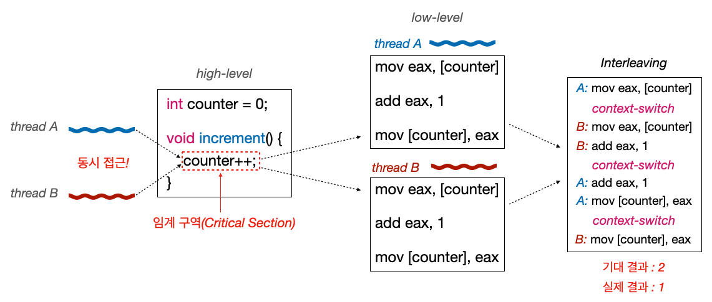_Race Condition_

* 임계 구역은 동시에 접근하는 `counter`를 증가시키는 영역이다
* `스레드A`와 `스레드B`가 동시에 `counter`에 접근하고, 자기의 레지스터에 저장하고 값을 증가 시키는 일련의 과정에서 코드가 인터리빙(섞일) 될 수 있다
* 결론적으로 `스레드A`에서 한번 증가시키고, `스레드B`에서 한번 증가시켜서 `2`라는 값이 나오길 기대하지만, 실제 결과는 `1`이 나올 수 있다

<br>

표로 레이스 컨디션이 일어나는 과정을 살펴보자.

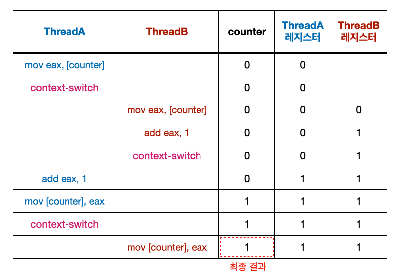_Race Condition_

<br>

> **컨텍스트 스위치를 막으면 레이스 컨디션을 해결할 수 있을까?**
>
> 결론부터 말하자면 불가능하다. 왜냐하면 멀티코어 환경에서는 스레드가 병렬로 처리될 수 있기 때문이다.
{: .prompt-info }

<br>

그러면 운영체제는 이런 **임계 구역 문제를 어떻게 해결**할까? 

일단 코드의 기본적인 모양새는 다음과 같이 구현한다.

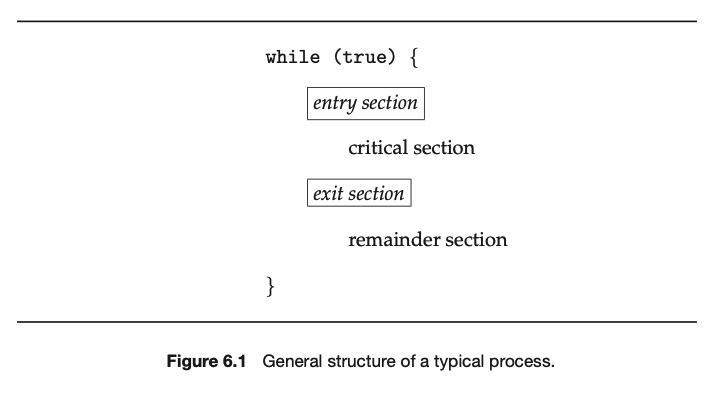_Critical Section_

* **입장 구역(Entry Section)**
  * 이 구역에서는 스레드가 임계 구역에 진입하기 전에 필요한 동기화 작업을 수행한다
  * 특정 스레드가 이미 임계 구역에 들어가 있을 때 다른 스레드의 진입을 기다리게 한다
* **퇴장 구역(Exit Section)**
  * 이 구역에서는 스레드가 임계 구역에서 나올 때 필요한 동기화 작업을 수행한다
  * 임계 구역에 대한 접근 권한을 해제하여 다른 스레드가 임계 구역에 진입할 수 있도록 한다

<br>

위의 코드는 기본적인 뼈대이고, **실제로 임계 구역 문제를 해결하기 위해서는 다음의 3 가지 조건을 만족**하도록 구현해야 한다.

1. **상호 배제(Mutual Exclusion)**
   * **동시에 하나의 프로세스나 스레드만 임계 구역에 접근할 수 있어야 한다**. 쉽게 말해서 동시에 2 개 이상의 작업이 임계 구역에 진입해선 안된다.
   * 임계 구역에 대한 접근을 독점적으로 관리하여 데이터 무결성을 유지한다
2. **진행 조건(Progress Condition)**
   * **임계 구역에 접근하려는 프로세스가 없을 때, 다른 프로세스가 대기 중이라면 그 프로세스는 임계 구역에 접근할 기회를 가져야 한다**
   * **데드락(Dead-lock) 방지**: 이는 대기 중인 프로세스가 계속해서 임계 구역에 접근하지 못하는 상황을 방지한다
3. **한정 대기(Bounded Waiting)**
   * **특정 프로세스가 임계 구역에 접근하기 위해 무한정 대기하지 않도록 보장해야 한다**. 쉽게 말해서 특정 프로세스가 임계 구역에 진입하고 싶다면 언젠가는 진입할 수 있어야 한다.
   * **기아(Starvation) 방지**: 특정 프로세스가 무한정 대기하는 것을 방지한다
   * 대기 시간에 대한 상한을 설정하여 공정성을 보장한다

<br>

이제 운영체제가 이런 원칙을 이루기 위해서 사용하는 동기화 기법들을 살펴보자.

<br>

---

## 2. 동기화 기법

### Test-and-Set, Compare-and-Swap

뮤텍스, 스핀락, 세마포어 등의 동기화 기법은 기본적으로 **하드웨어 수준에서 제공하는 원자성(atomicity)을 보장하는 연산을 사용해서 구현**한다.

제공하는 연산으로는 **Test-and-Set**, **Compare-and-Swap(CAS)**, 등이 있다.

<br>

**Test-and-Set**을 한번 살펴보자.

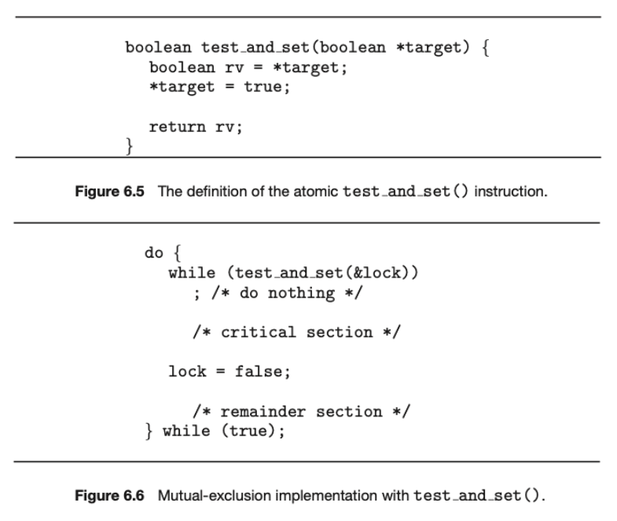_Test and Set_

* 특정 플래그 변수(보통 boolean 타입)를 원자적으로 읽고, 동시에 해당 플래그를 설정한다
* 다음의 두 가지 작업을 동시에 수행한다
  * **읽기:** 현재 플래그 변수(`*target`)의 값을 읽어온다
  * **설정:** 플래그 변수를 `true`로 설정한다

<br>

**Compare-and-Swap(CAS)**을 살펴보자.

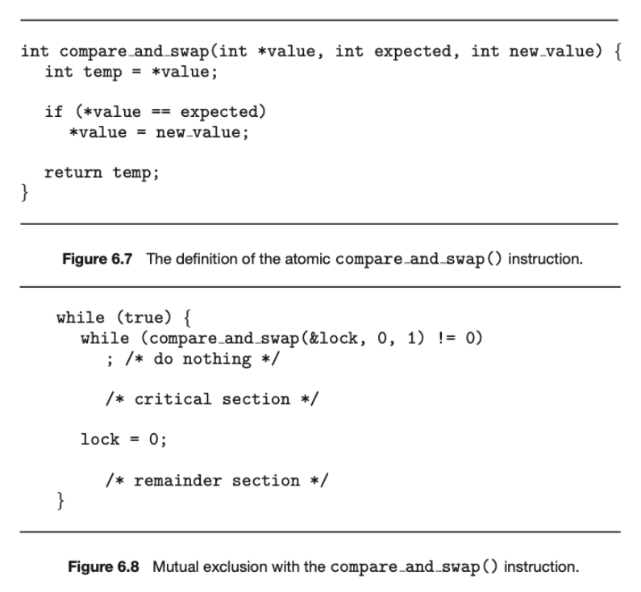_Compare and Swap_

* 특정 메모리 위치의 값이 예상한 값과 일치할 때만 새로운 값으로 교체한다
* **기대 값(`expected`):** 현재 메모리 위치에 저장된 값과 비교할 값
* **새 값 (`new_value`):** 메모리 위치를 업데이트할 새로운 값
* **메모리 위치 (`value`):** 업데이트할 실제 메모리 위치
* 다음의 연산을 수행한다
  * 메모리 위치의 현재 값이 기대 값과 같으면, 새로운 값으로 교체한다
  * 그렇지 않으면, 메모리 위치의 현재 값이 기대 값으로 업데이트된다
* CAS는 스핀락, 원자적 데이터 구조 구현 등에 사용된다

<br>

---

### 뮤텍스(Mutex): Busy-Waiting

**뮤텍스(Mutex) 또는 뮤텍스 락(Mutex-lock)**은 **`acquire`를 통해서 락(Lock)을 획득한 스레드만이 임계구역에 접근하도록 허용하고, `release`를 통해 락을 반환**하는 방식을 통해 **상호배제(Mutual Exclusion)**를 보장한다.

<br>

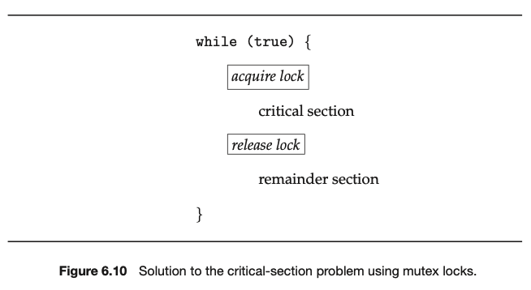_Lock_

* `acquire`: 스레드가 임계구역에 진입하기 위해서는 락을 얻어야 한다
* `release`: 스레드가 임계구역에서 퇴장할때 락을 반환한다

<br>

`acquire()`과 `release()`의 대략적인 구현은 아래와 같다. **원자적(atomic)으로 수행되어야 한다**.

<br>

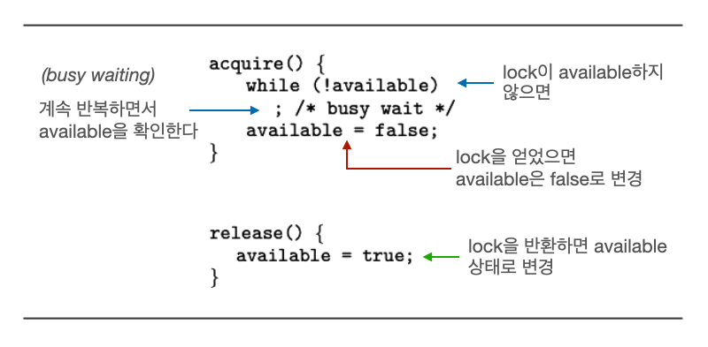_acquire and release_

* 하나의 스레드가 락을 얻기 위해서 `available`을 체크한다. 만약 `available`이 `true`라면 락을 얻고(`acquire`), 그렇지 않다면 계속 루프로 체크 한다.
* 스레드가 임계 영역에서의 작업을 전부 끝내면 락을 반환(`release`)한다

<br>

위의 뮤텍스 구현에서는 한 가지 문제점이 있다. 이는 **busy-waiting**이 필요하다는 점이다. **Busy-waiting**은 컴퓨터 시스템에서 한 프로세스나 **스레드가 특정 조건을 만족할 때까지 반복적으로 조건을 검사하면서 CPU 자원을 소비하는 대기 방식**을 의미한다.

**Busy-waiting은 락을 얻기 위해 기다리는 동안 CPU를 계속 사용하기 때문에 CPU 자원이 낭비**된다. 다른 유용한 작업을 수행하지 않고 단지 조건을 확인하기 위해 CPU를 통한 반복 작업을 수행하기 때문이다.

이런 **busy waiting을 사용하는 방식을 스핀락(Spin-Lock)이라고 부른다**.

<br>

> **용어 정리**
>
> **Busy-waiting을 사용하는 뮤텍스 락을 스핀 락(Spin-Lock)이라고 부르고**, busy-waiting을 사용하지 않으면 뮤텍스(Mutex)라고 부르는 경우들이 있는 것 같다.
>
> 뒤에서도 자세히 다루겠지만 이 포스트에서는 다음과 같이 용어를 사용할 것이다.
>
> * **스핀 락(Spin-Lock)**: busy-waiting을 사용하는 뮤텍스 락
> * **뮤텍스 락(Mutex-Lock)**: sleep-and-wakeup 방식을 사용하는 뮤텍스 락
> * **sleep-and-wakeup**: 프로세스나 스레드가 조건이 만족될 때까지 자발적으로 CPU 사용을 중지하고 대기하다가, 조건이 만족되면 다시 깨어나는 방식
>
> 뒤에서 **busy-waiting**과 **sleep-and-wakeup** 방식의 차이에 대해 더 자세히 알아볼 것이다.
> {: .prompt-warning }

<br>

---

### 세마포어(Semaphore): Busy-Waiting

세마포어(Semaphore)는 **`wait`와 `signal` 함수를 사용해서, 하나 이상의 스레드가 임계 구역에 접근할 수 있도록 하는 기법**이다. 

세마포어(`S`)는 단순히 카운터로 생각할 수 있으며, 이 카운터는 특정 자원의 사용 가능 상태를 나타낸다.

`wait`와 `signal`이 어떻게 구현되고 사용되는지 살펴보자.

<br>

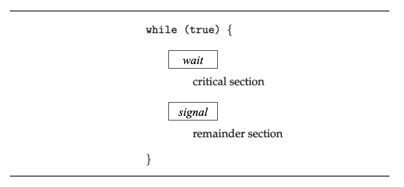_semaphore_

* `wait`와 `signal`은 임계구역의 앞뒤로 위치한다
* `wait`: 자원을 기다린다
* `signal`: 자원을 반납하고, 사용할 수 있다는 신호를 준다

<br>

**`S`는 임계구역의 사용 가능한 공유 자원의 개수.(임계 구역에 진입할 수 있는 스레드의 개수)**

`S`를 세마포어로 지칭 하는 경우도 많으나, 현재 포스트에서는 `S` 값 또는 사용 가능한 공유 자원의 개수라고 하겠다. (`S`는 Integer다)

<b>

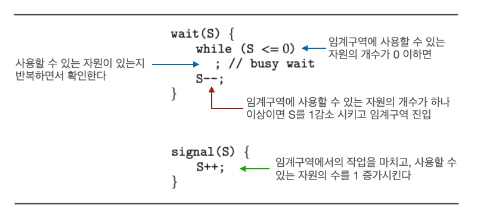_Semaphore: busy-waiting_

* **`wait`**
  * 임계구역에 사용할 수 있는 자원의 개수가 0 이하라면, 계속 반복하면서 사용할 수 있는 자원이 있는지 확인한다
  * 사용할 수 있는 자원의 개수가 하나 이상(`S>0`)이면 `S`를 1감소 시키고 임계구역을 진입한다
* **`signal`**
  * 임계구역에서의 작업을 다 마치면, 사용할 수 있는 자원의 수를 1 증가 시킨다(`S++`)
* 이전의 뮤텍스 때와 마찬가지로 **busy wait**를 사용한다(**뒤에서 다루겠지만 busy-wait 방식이 아닌 sleep-and-wakeup 방식으로 구현할 수 있다**)

<br>

> **Binary Semaphore vs Counting Semaphore**
>
> * **이진 세마포어(Binary Semaphore)**
>   * `S`가 `0`또는 `1`만 가능한 세마포어
>   * 뮤텍스와 유사하게 동작한다
>     * `S=1` → `Available=true`
>     * `S=0` → `Available=false`
> * **카운팅 세마포어(Binary Semaphore)**
>   * `S`에 제한이 없는 세마포어
>   * 현재 포스트는 카운팅 세마포어를 기준으로 설명을 하고 있다
    {: .prompt-info }

<br>

예시를 통해서 동작 과정을 살펴보자. 상황은 다음과 같다.

* 프로세스 `P1`, `P2`, `P3`가 임계구역에 동시에 접근한다
* 라운드 로빈 방식을 사용한다. `Time Slice`는 `2`
* **Busy-wait**로 구현된 세마포어를 사용한다

<br>

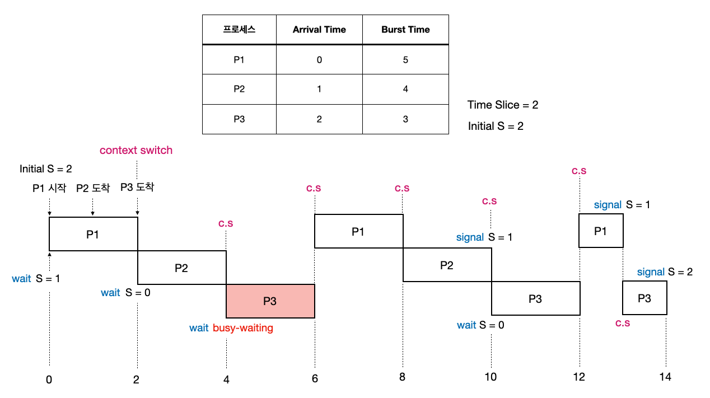_Semaphore example_

* `P1`, `P2`가 자원을 사용하는 동안은 `P3`는 **busy waiting**을 해야 한다
* `P2`가 임계구역의 작업을 모두 마치고 `signal`로 자원을 반납해야 `P3`가 임계구역에 접근할 수 있다

<br>

이전에도 설명했지만 **Busy-waiting**은 컴퓨터 시스템에서 한 프로세스나 **스레드가 특정 조건을 만족할 때까지 반복적으로 조건을 검사하면서 CPU 자원을 소비하는 대기 방식**을 의미한다. 쉽게 말해서 **자원에 접근 제한이 걸려 있을 경우 이를 얻을 때까지 무한 루프를 돌면서 다른 작업(스레드)에 CPU를 양보하지 않는다**.

이런 방식은 **자원에 대한 접근 제한이 풀리는 주기가 매우 짧은 경우에는 문제가 되지 않지만**, 그렇지 않은 경우에는 CPU를 낭비하는 비효율적인 방식이다.

다음으로 **busy-waiting**의 문제점을 해결할 수 있는 **sleep-and-wakeup** 방식의 세마포어를 살펴보자.

<br>

> **뮤텍스 vs 세마포어**
>
> * **뮤텍스**
>   * 동기화의 대상이 1개일 때만 사용 가능하다
>   * 락(Lock)의 소유개념이 존재해서, 락을 보유한 작업만이 락을 해제할 수 있다
> * **세마포어**
>   * 세마포어는 락의 개념이 아니기 때문에, 세마포어를 보유하지 않은 작업도 세마포어 해제가 가능하다
  {: .prompt-info }


<br>

---

### 세마포어(Semaphore): Sleep-and-Wakeup

**Sleep-and-wakeup** 방식의 경우, **사용할 수 있는 자원이 없을 경우 해당 작업을 대기(Block, Wait, Sleep) 상태로 만든다**. **사용할 수 있는 자원이 생기면, 대기 큐의 작업을 준비 상태(ready state)로 만든다**.

<br>

> **Sleep? Block?**
>
> 자료나 서적에 따라 sleep-and-wakeup을 block-and-wakeup으로 표현하기도 한다.
>
> 현재 포스트에서는 [Abraham Silberschatz: Operating System Concepts](https://www.google.co.kr/books/edition/Operating_System_Concepts_10e_Abridged_P/VFV1DwAAQBAJ?hl=ko&gbpv=0)에서 사용하는 `sleep()`, `wakeup()`이라는 표현을 사용할 것이다.
{: .prompt-warning }

<br>

구현을 살펴보자.

<br>

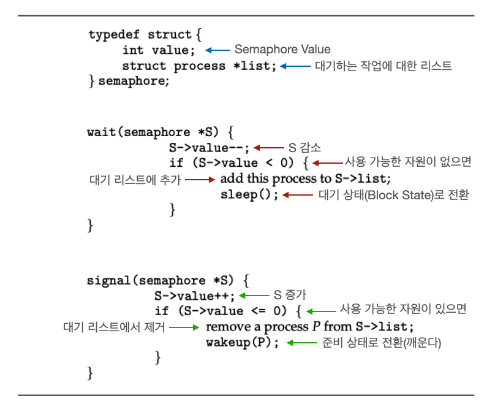_Semaphore: sleep-and-wakeup_

* `wait()`
  * `S`를 감소 시켰는데 음수라는 것은 이미 자원이 없었다는 뜻 → 해당 작업을 대기 리스트에 추가하고 대기(블락) 상태로 전환한다
  * `sleep()`: 작업을 대기 상태로 전환한다
* `signal()`
  * `S`를 증가 시켰는데 `0` 이하라는 것은 어떤 작업이 `wait()`를 통해 자원을 얻으려고 했지만, 자원이 없어서 대기 상태라는 뜻 → 대기 리스트의 작업 중 하나를 깨워서 준비 상태로 전환한다
  * `wakeup()`: 대기 상태의 작업을 깨운다

<br>

대다수의 경우 **busy-waiting** 보다 **sleep-and-wakeup**을 더 많이 사용하게 된다. **Sleep-and-wakeup** 방식을 사용하면, 비효율적으로 CPU를 계속 낭비하는 상황을 피할 수 있다. 그러나 무조건 **sleep-and-wakeup** 방식이 정답이라는 뜻은 아니다.

다음으로 **Busy-waiting**과 **sleep-and-wakeup** 방식을 정리하고 비교해보자.

<br>

---

### Busy-Waiting(Spin-Lock)을 사용하는 경우

Busy-Waiting(Spin-Lock)은 많은 상황에서 Sleep-and-Wakeup 보다 비효율적인 경우가 많으나, **특정 상황에서는 Busy-Waiting(Spin-Lock)이 선호**될 수 있다.

<br>

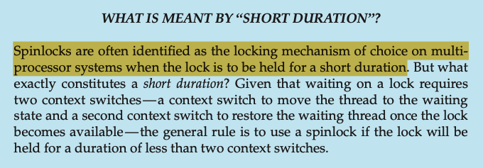_Short Duration_

* 스핀락을 사용하지 않는 뮤텍스 락 방식은 락을 기다리는 대기 상태와 락을 취득해서 실행 상태로 임계구역을 실행시키는, 총 **2번의 컨텍스트 스위칭이 필요**하다
* 스핀락은 **락을 얻고 반환하는 주기가 2번의 컨텍스트 스위칭에 걸리는 시간보다 짧은 경우에 사용**해야 한다

<br>

스핀락의 기본적인 아이디어는 **굳이 오버헤드(overhead)를 발생시키는 컨텍스트 스위칭을 하지말고 아주 짧은 락의 주기를 기다려서 임계구역을 사용**하는 것이다. 이는 당연히 **`acquire-release` 과정이 짧으면 짧을수록 효과적**이다.

<br>

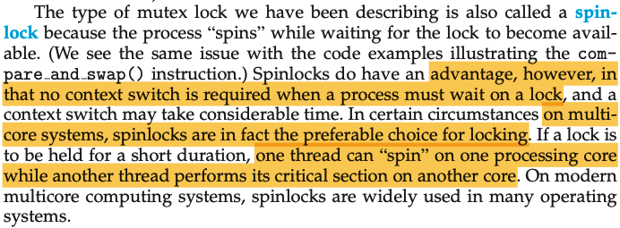_Spin Lock_

<br>

멀티코어(Multi-core) 시스템에서 아주 짧은 주기동안 하나의 코어가 기다리고, 다른 코어가 임계 구역의 작업을 처리하는 상황에서는 스핀락이 더 선호될 수 있다.

하나의 코어의 프로세스는 다른 프로세스의 임계구역 작업이 끝나자마자 컨텍스트 스위칭 없이 바로 사용할 수 있다.

<br>

---

### 모니터(Monitor)

이전의 세마포어 또는 뮤텍스 방식의 동기화는 **개발자의 잘못된 사용으로 인해 데드락(Deadlock)이나 교착 상태가 발생할 수 있다. 또한, 잠금을 해제하는 것을 깜빡하거나, 세마포어 값을 잘못 조정하는 등의 실수가 발생할 수 있는 요지가 많다**.

앞으로 살펴볼 **모니터(Monitor)는 동기화 메커니즘을 자동으로 관리**해줘서, 개발자가 직접 뮤텍스나 세마포어를 관리하는 부담을 덜어준다.

모니터는 **상호 배제(Mutual Exclusion)를 위한 동기화도 제공하면서, 조건 변수(Condition Variable)을 통한 접근 순서 제어를 위한 동기화도 제공**한다.

모니터의 작동 원리를 살펴보자.

<br>


## 5. 동기화 문제들

동기화와 프로세스 간 통신에 관련된 대표적인 문제 시나리오들을 살펴보자.

<br>

### Reader-Writer Problem

이 문제는 여러 작업이 공유 자원에 접근할 때 읽기와 쓰기 작업이 어떻게 조정되어야 하는지에 대해서 다룬다.

기본적으로 다음과 같은 상황을 고려한다.

* **읽기 작업 (Read):** 여러 `reader`가 동시에 공유 자원을 읽을 수 있다. 읽기는 **자원을 변경하지 않기 때문에 동시에 여러 작업이 읽어도 문제되지 않는다**
* **쓰기 작업 (Write):** 공유 자원을 **쓰는 작업은 자원을 변경하므로 동시에 하나의 작업만 접근**할 수 있어야 한다. 동시에 두 개 이상의 작업이 쓰기를 시도하면 데이터 무결성에 문제가 발생할 수 있다.
* **혼합 작업 (Read/Write):** 읽기와 쓰기가 동시에 일어나는 경우, 읽기 작업과 쓰기 작업은 서로 충돌하지 않아야 하며, **쓰기 작업이 진행되는 동안에는 다른 읽기 작업이나 쓰기 작업이 들어와서는 안된다**

<br>

Reader-Writer 문제는 보통 두 가지 유형으로 나뉜다.

1. 여러 `reader`가 동시에 읽을 수 있지만, `writer`가 한 번에 하나만 접근할 수 있어야 하는 문제
   * 이 경우, `writer`가 자원에 접근하고 있을 때는 다른 `reader`(또는 `writer`)도 접근할 수 없도록 해야 한다
2. `reader`와 `writer` 간의 우선 순위 문제
   * 예를 들면, `writer`가 기다리는 동안 `reader`가 계속 접근하게 되면, `writer`가 무한히 대기하게 되는 문제가 발생할 수 있다. 이 문제를 해결하기 위해 우선순위 정책을 추가해야 한다.

<br>

문제를 해결하기 위해서 다음과 같은 방법을 사용한다.

* 읽기 우선(Reader-Preferred)
  * 읽기 작업이 우선되며, `writer`가 대기 중이라도 읽기 작업은 계속 진행된다
  * 단, `writer`가 진행 중이면 읽기가 차단된다
* 쓰기 우선(Writer-Preferred)
  * 쓰기 작업이 우선되며, `writer`가 대기 중일 때 읽기 작업도 차단된다
  * 읽기 작업이 진행 중일 때 쓰기 작업이 대기하게 된다


---

## Reference

1. [강민철: 혼자 공부하는 컴퓨터 구조 + 운영체제](https://www.google.co.kr/books/edition/%ED%98%BC%EC%9E%90_%EA%B3%B5%EB%B6%80%ED%95%98%EB%8A%94_%EC%BB%B4%ED%93%A8%ED%84%B0_%EA%B5%AC%EC%A1%B0+%EC%9A%B4/OXmAEAAAQBAJ?hl=ko&gbpv=0)
2. [Abraham Silberschatz: Operating System Concepts(공룡책)](https://www.google.co.kr/books/edition/Operating_System_Concepts_10e_Abridged_P/VFV1DwAAQBAJ?hl=ko&gbpv=0)
3. [쉬운코드: 운영체제](https://www.youtube.com/watch?v=QmtYKZC0lMU&list=PLcXyemr8ZeoQOtSUjwaer0VMJSMfa-9G-)
4. [https://velog.io/@gabie0208/OS-Interleaving-Race-condition-Critical-Section](https://velog.io/@gabie0208/OS-Interleaving-Race-condition-Critical-Section)
5. [https://cs-ssupport.tistory.com/428#3._Monitor](https://cs-ssupport.tistory.com/428#3._Monitor)
