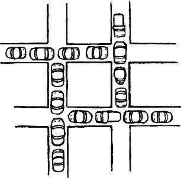
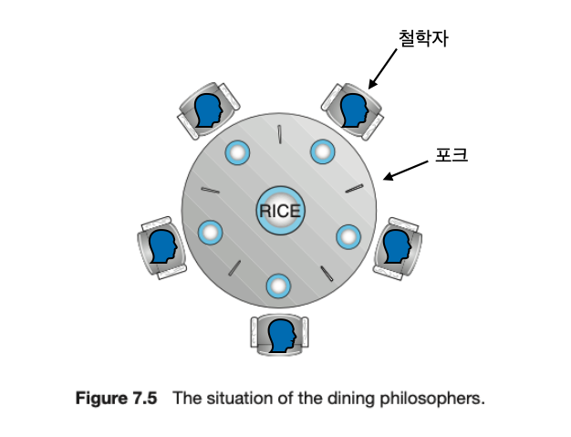
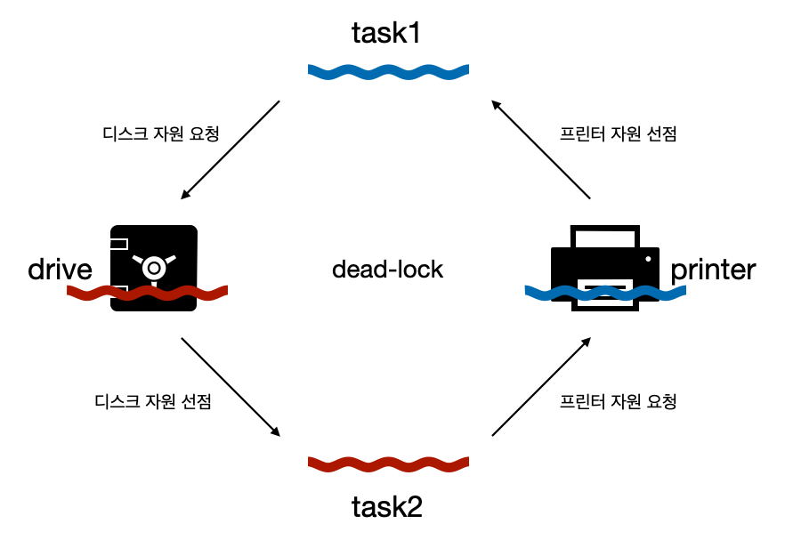
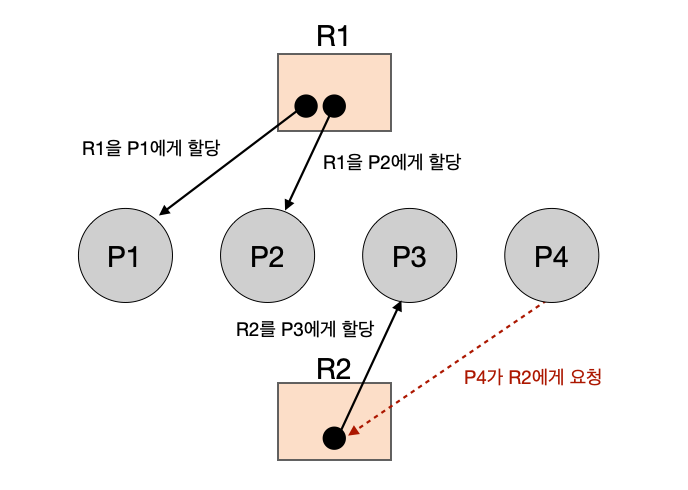
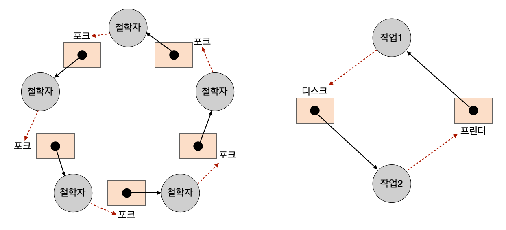

---

## 1. 교착상태(DeadLock)

### 데드락 소개

데드락(DeadLock)은 **여러 프로세스나 스레드가 서로 자원을 기다리며 영원히 실행을 멈추는 상태**를 의미한다. 쉽게 말해서, 두 개 이상의 작업이 서로 상대방의 작업이 끝나기 만을 기다리고 있기 때문에 결과적으로 아무것도 완료하지 못하는 교착 상태를 의미한다.

 

_https://denninginstitute.com/itcore/processes/Dead.html_

* 데드락을 교차로마다 차가 막혀서 교통이 진행되지 않는 상태에 비유하는 경우가 많다
* 차가 진행하기 위해서는 상대 차가 움직여야 하지만, 상대 차가 움직일 수 없는 상태이기 때문에 교통이 영원히 움직이지 못하는 상태에 접어든다.

 

---

### 철학자들의 식사 문제(Dining Philosophers Problem)

**식사하는 철학자 문제(Dining Philosophers Problem)**는 동시성 프로그래밍과 관련된 고전적인 문제로, 다섯 명의 철학자들이 식사와 사고를 번갈아 가며 하는 상황을 모델링한 문제이다. 이 문제는 **교착 상태(DeadLock)** 같은 문제를 설명하고 해결하는 데 자주 사용된다.

문제 시나리오를 살펴보자.

* 원형 식탁에 5명의 철학자가 앉아 있다
* 각 철학자 앞에는 하나의 식사가 존재하고, 각 철학자 사이에는 포크가 하나씩 존재한다
* 각 철학자는 양옆 2개의 포크를 모두 사용해야만 식사를 할 수 있다
* 철학자들은 다음과 같은 순서로 식사를 진행한다
  * **1**: 철학자는 계속 사고(think)하다가 왼쪽 포크가 사용 가능하면 집어든다
  * **2**: 철학자는 계속 사고think)하다가 오른쪽 포크가 사용 가능하면 집어든다
    * 양 옆 포크를 동시에 집어드는 것은 불가능하다
  * **3**: 왼쪽과 오른쪽 포크를 모두 집어들면 정해진 시간동안 식사(eat)를 한다
  * **4**: 식사 시간이 끝나면 오른쪽 포크를 내려놓는다
  * **5**: 오른쪽 포크를 내려놓은 뒤 왼쪽 포크를 내려놓는다
  * **1**번 부터 반복한다

 

_식사하는 철학자 문제_

 

위 상황에서 한, 두 명의 철학자가 식사하는 것은 문제가 되지 않는다. 그러나 모든 철학자가 동시에 식사를 시도하면서 문제가 생긴다. 모든 철학자가 `1번(왼쪽 포크가 사용 가능하면 집어든다)`을 마치고 `2번(오른쪽 포크가 사용 가능하면 집어든다)`을 진행하려고 하지만 불가능하다. 왜냐하면 이미 모든 철학자들이 해당 포크를 왼쪽 포크로 사용하기 위해서 들었기 때문이다.

식사를 진행하기 위해서는 양쪽 포크가 필요하기 때문에 철학자들은 다른 철학자가 식사를 끝마치고 포크를 내려놓기를 기다린다. 결국 모든 철학자는 서로의 식사가 끝나기를 기다리지만 아무도 식사를 진행할 수 없는 상황이기 때문에 교착상태에 빠진다.

식사하는 철학자 문제를 정리하자면 다음과 같다.

* **철학자**: 프로세스 또는 스레드
* **포크**: 실행에 꼭 필요한 자원
* **식사**: 자원을 사용한 프로세스 또는 스레드의 실행
* 식사하는 철학자 문제는 **일어나지 않을 사건(식사)을 기다리면 진행이 멈춰 버리는 현상, 즉 데드락 상황을 모델링한 문제**이다

 

---

### 자원 할당 그래프(Resource Allocation Graph, RAG)

데드락이 발생하는 상황을 실제 상황으로 살펴보자. 예를 들어 하나의 `작업1`이 `프린터`를 사용하면서 `디스크`를 요청하고, `작업2`가 `디스크`를 사용하면서 `프린터`를 요청한 상황이다.

 

_dead-lock example_

 

`작업1`과 `작업2`는 서로가 필요한 자원을 선점하면서 서로의 자원을 무작정 기다리고 있는 데드락 상황이다.

이런 데드락을 해결하기 위해서 다음이 필요하다.

* 데드락이 발생했을 때의 상황을 정확하게 표현할 수 있어야 한다
* 데드락이 발생한 근본적인 이유를 파악해야 한다

 

여기서 **데드락이 발생했을 때의 상황을 정확하게 표현**하기 위해서 사용하는 것이 **자원 할당 그래프(RAG)**이다. 자원 할당 그래프(RAG)는 시스템에서 **프로세스(스레드)와 자원의 할당 상태를 시각적으로 표현한 그래프**이다. 

자원 할당 그래프의 구성 요소와 그리는 방법을 알아보자.

* **노드(nodes)**
  * **프로세스 노드 (P)**: 원으로 표현되며, 각각의 프로세스(P1, P2,..)를 나타낸다
  * **자원 노드 (R)**: 사각형으로 표현되며, 각각의 자원(R1, R2,..)을 나타낸다
    * 자원 노드는 여러 개의 작은 원으로 나누어 표현될 수 있는데, 이는 해당 자원의 인스턴스(동시 사용 가능한 자원의 개수)를 나타낸다
* **간선(Edges)**
  * **요청 간선**: 프로세스가 자원을 요청할 때 사용된다
    * 프로세스 노드에서 자원 노드로 향하는 방향의 화살표로 표현된다
    * 예를 들어, P1 → R1은 P1이 자원 R1을 요청하고 있음을 나타낸다
  * **할당 간선**: 자원이 프로세스에게 할당되었을 때 사용된다
    * 예를 들어, R2 → P2는 R2가 P2에게 할당되었음을 나타낸다

 

RAG의 예시를 살펴보자.

_RAG example_

* **자원**: `R1`, `R2`
  * `R1`: 2개의 인스턴스
  * `R2`: 1개의 인스턴스
* **프로세스**: `P1`, `P2`, `P3`, `P4`
* `R1`을 `P1`, `P2`에게 할당했다
* `R2`를 `P3`에게 할당했다
* `P4`는 `R2`에게 사용 요청을 하고 있다

 

위의 RAG는 데드락 상황을 나타내지는 않는다. 이번에는 **데드락이 발생한 상황을 RAG로 표현**해보자. 이해하기 쉽게 이전에 다뤘던 **식사하는 철학자 문제와 프린터-디스크 데드락 상황**을 한번 표현해보자.

 

_RAG dead-lock example_

 

RAG를 보자마자 **데드락 상태가 가지는 공통적인 특징**을 하나 발견할 수 있다. 그것은 바로 **RAG가 원의 형태(사이클)를 가진다**는 것이다. 사실, 데드락이 발생하기 위한 조건 중에서 **순환 대기(Circular Wait)라는 조건이 이에 해당**한다. 

뒤에서 자세히 살펴보겠지만, **사이클이 있다고 해서 데드락이 무조건 발생하는 것은 아니다**.

다음으로, 데드락이 발생하기 위한 4가지 조건을 살펴보자.

 

---

## 2. 교착상태(DeadLock) 해결하기

### 데드락이 발생하기 위한 조건

데드락이 발생하기 위해서는 다음의 **4가지 조건이 모두 동시에 충족**되어야 한다. 다음 **조건 중 하나라도 만족하지 않으면 데드락이 발생하지 않는다**. 다음 4가지 조건을 **모두 만족하면 데드락이 발생할 수 있다**.

1. **상호 배체(Mutual Exclusion)**
   * 자원은 한 번에 하나의 프로세스만 사용할 수 있어야 한다
2. **점유와 대기(Hold and Wait)**
   * 프로세스가 하나 이상의 자원을 점유하면서 다른 자원을 기다리고 있어야 한다
   * **예시**: 프로세스 P1은 자원 R1을 점유하고 있고, 자원 R2를 기다리고 있는 상태
3. **비선점(Non-Preemption)**
   * 다른 프로세스가 사용 중인 자원을 강제로 빼앗을 수 없어야 한다
   * 프로세스가 자원을 자발적으로 해제할 때까지 기다려야 한다
4. **순환 대기(Circular Wait)**
   * 프로세스들이 순환적으로 자원을 기다리는 상태여야 한다
   * **예시**:  프로세스 P1은 자원 R1을 가지고 자원 R2를 기다리고, 프로세스 P2는 자원 R2를 가지고 자원 R3를 기다리며, 프로세스 P3는 자원 R3를 가지고 자원 R1을 기다리는 상태
     * P1(R1 선점) → R2
     * P2(R2 선점) → R3
     * P3(R3 선점) → R1
   * 자원 할당 그래프(RAG)가 순한 그래프(Cyclic Graph)인 상태라고 보면 된다

 

---

### 데드락 해결 방법

데드락을 해결하는 방법에 대해서 알아보자.

데드락을 해결하기 위해서는 보통 다음의 4가지 접근을 사용한다.

1. **예방(Prevention)**
   * 데드락 발생 조건 중 하나라도 충족되지 않도록 하는 방법
   * 교착 상태의 4가지 발생 조건 중 하나를 없애버리면 된다
2. **회피(Avoidance)**
   * 데드락 상태가 발생할 수 있는 가능성을 미리 분석하고, 데드락을 피할 수 있는 자원 할당 방법을 선택하는 방식
   * 가장 잘 알려진 회피 기법으로는 은행가 알고리즘(Banker's Algorithm)이 있다
3. **검출 및 복구(Detection and Recovery)**
   * 데드락이 발생했는지 주기적으로 검사하고, 데드락이 발생하면 이를 해결하는 방법
   * 쉽게 말해서 데드락의 발생을 받아들이고 조치를 취하는 방식이다
4. **무시(Ignorance)**
   * 데드락이 발생할 가능성이 매우 낮은 경우, 데드락을 무시하는 방법이다

 

각 해결법들을 알아보자.

 

---

#### 예방(Prevention)

**데드락 발생 조건 중 하나라도 충족되지 않도록 하는 방법**이다. 쉽게 말해서 조건 중 하나 이상을 없애는 방법이다.

각 조건을 하나씩 없애는 경우를 살펴보자.

* **상호 배제를 없애는 경우**: 모든 자원을 공유한다
  * 이론적으로는 가능하나 현실적인 방법은 아니다
* **점유와 대기를 없애는 경우**: 특정 프로세스에 자원을 모두 할당하거나, 아예 할당하지 않는 방식으로 자원을 배분한다
  * 자원의 활용률이 너무 낮아진다
* **비선점을 없애는 경우**: 하나의 프로세스가 다른 프로세스의 자원을 뺏을 수 있게 만든다
  * CPU와 같은 선점이 가능한 자원에 한해서는 효과적일 수 있다
  * 프린터와 같이 선점이 불가능한 자원들도 존재한다(중간에 다른 작업이 프린터를 사용하는 것을 뺏어서 사용하는 것은 불가능하다)
* **순환 대기를 없애는 경우**: 순환 대기를 없애기 위해서는 모든 자원의 순서를 정하여 프로세스가 자원을 할당받는 순서를 강제하는 것이다
  * **자원에 고유한 우선순위 부여**: 각 자원에 고유한 번호(우선순위)를 부여한다. 예를 들어, 자원 A는 1번, 자원 B는 2번, 자원 C는 3번 식으로 번호를 매
  * **프로세스가 자원을 할당받는 순서 강제**: 프로세스는 자신이 현재 보유하고 있는 자원의 우선순위보다 높은 번호를 가진 자원만 요청할 수 있다
  * 이런 규칙을 통해 프로세스가 자원을 요청하는 순서가 정해지므로 순환 대기가 발생하지 않는다
  * 자원마다 사용률이 다르기 때문에 구현이 복잡하며, 상황에 따라 자원의 할당이 유연하지 않을 수 있다

 

---

#### 회피(Avoidance): 은행원 알고리즘(Banker's Algorithm)

데드락 회피의 기본적인 아이디어는 **데드락을 무분별한 자원 할당으로 이해 발생했다고 간주**하는 것이다.

회피에서는 데드락 상태가 발생할 수 있는 가능성을 미리 분석하고, **데드락을 피할 수 있는 자원 할당 방법을 선택**한다. 쉽게 말해서, **데드락이 발생하지 않도록 조심하면서 자원을 할당**하는 것이다.

데드락 회피에서 가장 잘 알려진 알고리즘은 [**은행원 알고리즘(Banker's Algorithm)**](https://en.wikipedia.org/wiki/Banker%27s_algorithm)이다. 은행원 알고리즘에 대해 알아보자.

 

은행원 알고리즘의 이름은 은행가가 여러 고객에게 대출을 할 때, 모든 고객이 대출금을 반환할 수 있는지 확인하는 방식에서 유래했다.

 

은행원 알고리즘의 주요 요소.

* **자원 종류(Resource Types)**: 시스템에 있는 자원의 종류와 각각의 수량
* **프로세스(Process)**: 자원을 요청하는 프로세스들
* **최대 요구량(Maximum Demand):** 각 프로세스가 필요로 하는 자원의 최대 수량
* **할당량(Allocation):** 현재 각 프로세스에 할당된 자원의 수량
* **잔여 필요량(Need):** 각 프로세스가 추가로 필요로 하는 자원의 수량 (잔여 필요량 = 최대 요구량 - 할당량)
* **가용 자원(Available):** 현재 시스템에서 사용 가능한 자원의 수량

 

은행원 알고리즘의 동작 방식.

* **자원 요청이 들어올 때:**
  - 프로세스가 자원을 요청하면, 시스템은 이 요청을 처리하기 전에 "시뮬레이션"을 통해 자원을 할당한 후의 시스템 상태를 예측한다
* **안전성 검사:**
  - 요청을 처리한 후 시스템이 **안전 상태**에 있는지 검사한다.
  - 안전 상태란, **각 프로세스가 최대 요구량을 충족시키고 결국 자원을 반환할 수 있는 상태**를 의미한다
* **안전 상태일 경우:**
  - 요청된 자원을 실제로 할당한다
* **비안전 상태일 경우:**
  - 요청을 거부하고, 해당 프로세스가 자원을 나중에 요청하도록 유도한다

 

은행원 알고리즘의 단점.

* 프로세스의 최대 자원 요구량을 미리 알아야 하며, 이는 모든 상황에서 현실적이지 않을 수 있다
* 안전성 검사를 자주 수행해야 하므로, 시스템 오버헤드가 발생할 수 있다
* 안전 상태를 유지하기 위해 실제로 자원을 사용할 수 있는 범위가 제한될 수 있다

 

---

#### 검출 및 복구(Detection and Recovery)

**데드락의 발생을 인정하고 사후에 조치하는 방식**이다. 데드락이 발생했는지 주기적으로 검사하고, 데드락이 발생하면 이를 해결하는 방법이다. 이 접근법은 데드락을 완전히 예방하는 대신, 발생한 후에 문제를 해결하는 데 중점을 둔다.

데드락 검출 알고리즘을 통해 데드락을 검출하면 다음과 같은 방법들로 복구 할 수 있다.

* **프로세스 종료를 통한 복구**
  * **모든 데드락 프로세스 종료**: 데드락에 관련된 모든 프로세스를 종료한다. 이 방법은 확실하게 데드락을 해결할 수 있지만, 많은 프로세스를 종료해야 할 수 있다. (작업 내역을 잃을 가능성)
  * **단계적 종료**: 하나씩 프로세스를 종료하여 데드락 상태를 해결한다. 종료할 프로세스를 선택하는 기준에는 우선순위, 가장 적게 진행된 프로세스, 최소 자원을 점유한 프로세스, 등을 참고할 수 있다.
* **자원 선점을 통한 복구**
  * 데드락 상태를 해결하기 위해 특정 프로세스로부터 자원을 강제로 회수(선점)한다
  * 위와 마찬가지로 선점 프로세스를 선택하는 기준에는 다양한 상황이 고려될 수 있다
  * 자원을 선점당한 프로세스는 일시적으로 중단되며, 나중에 다시 자원을 요청하여 작업을 재개할 수 있다

 

---

#### 무시(Ignorance)

데드락 무시는 **데드락 문제를 해결하려는 특별한 조치를 취하지 않고, 데드락이 발생할 가능성을 무시하는 전략**이다. 이 접근법은 특정 시스템이나 상황에서 **데드락이 발생할 가능성이 매우 낮거나, 발생하더라도 그 영향이 크지 않다고 판단될 때 사용**된다.

이런 전략을 **타조 알고리즘(Ostrich Algorithm)**이라고도 부른다.

 

> **타조 알고리즘(Ostrich Algorithm)**
>
> 타조 알고리즘은 시스템에서 데드락과 같은 문제가 발생할 가능성이 있을 때, 이를 해결하기 위해 복잡한 방안을 적용하지 않고, 발생할 때까지 단순히 무시하는 접근법을 의미한다.
>
> 이 이름은 타조가 위험을 느꼈을 때 머리를 모래에 묻는다는 속설에서 유래했다. 실제로 타조는 그 정도로 멍청하지는 않다.
{: .prompt-info }

 

---

## Reference

1. [강민철: 혼자 공부하는 컴퓨터 구조 + 운영체제](https://www.google.co.kr/books/edition/%ED%98%BC%EC%9E%90_%EA%B3%B5%EB%B6%80%ED%95%98%EB%8A%94_%EC%BB%B4%ED%93%A8%ED%84%B0_%EA%B5%AC%EC%A1%B0+%EC%9A%B4/OXmAEAAAQBAJ?hl=ko&gbpv=0)
2. [Abraham Silberschatz: Operating System Concepts(공룡책)](https://www.google.co.kr/books/edition/Operating_System_Concepts_10e_Abridged_P/VFV1DwAAQBAJ?hl=ko&gbpv=0)
3. [쉬운코드: 운영체제](https://www.youtube.com/watch?v=QmtYKZC0lMU&list=PLcXyemr8ZeoQOtSUjwaer0VMJSMfa-9G-)
