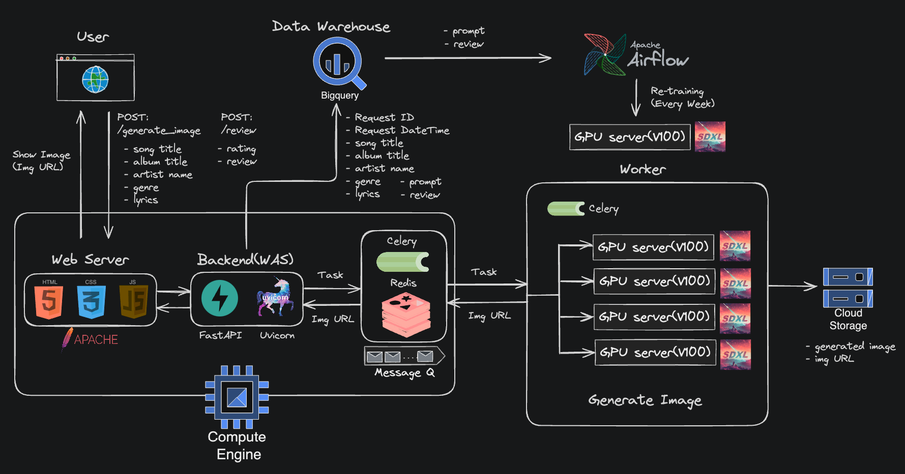

---

> `Naver Boostcamp AITech 5기`에서 진행된 팀 프로젝트 입니다.
{: .prompt-info }

---

## 1. 개요

> **참고**
>
> * **프로젝트 깃헙(레포지토리의 내용은 동일합니다)**
>   * [개인 레포지토리](https://github.com/seungki1011/Album-Art-Generation-Service)
>   * [팀 레포지토리](https://github.com/boostcampaitech5/level3_cv_finalproject-cv-03)
> * [프로젝트 팀 리포트](https://github.com/seungki1011/Album-Art-Generation-Service/blob/main/docs/%EC%B5%9C%EC%A2%85%ED%94%84%EB%A1%9C%EC%A0%9D%ED%8A%B8_CV_%ED%8C%80%20%EB%A6%AC%ED%8F%AC%ED%8A%B8(03%EC%A1%B0).pdf)
{: .prompt-info }

 

팀 프로젝트에서 맡은 역할은 다음과 같습니다.

* FastAPI, Redis, Celery, BigQuery, GCS를 이용한 백엔드 구축
* 서비스 아키텍쳐 설계, 배포
* 모델 실험

 

다음의 두 가지 기능을 구현한 프로젝트입니다.

* Text-to-Image 생성 모델을 사용해서 노래의 제목, 가수 이름, 장르, 가사 등의 정보를 넣으면 해당 정보를 활용해 곡의 분위기와 어울리는 앨범 이미지를 생성
* 사용자의 사진을 입력 받고 해당 이미지를 식별할 수 있도록 Text-to-Image 모델을 Fine-Tuning 하여, 위와 같이 앨범 정보를 활용해 사용자의 얼굴 이미지가 들어간 앨범 이미지를 생성

 

---

## 2. 프로젝트 진행

팀 프로젝트가 진행된 대략적인 수행 순서와 방법입니다.

 

1. **데이터 수집**
     * 앨범 제목, 발매일, 앨범 장르, 노래 가사, 노래 제목, 가수 이름, 앨범 표지를 API 또는 크롤링으로 수집했습니다

2. **모델 선정 및 학습**
     * **모델 선정**
       * **SDXL**: Stable Diffusion을 1.0 버전, 2.0 버전, XL 버전에 대한 결과를 살펴봤을 때 가장 최근 모델인 SDXL이 제일 고품질의 이미지를 생성했습니다
         * 물론 1.0, 2.0에 비해 추론 속도가 느렸으나, 충분히 감수할 만한 트레이드-오프라고 판단했습니다
       * **DreamBooth**: 드림부스(DreamBooth)는 사용자가 특정한 개체(예: 사람, 동물, 사물)를 기계 학습 모델에 학습시켜서, 그 개체를 포함한 이미지를 생성할 수 있게 해주는 기술입니다.
         * **소량 데이터 학습 가능**: 수천장의 이미지가 아닌, 수십 장의 이미지로도 특정 개체를 학습시킬 수 있습니다
         * **파인튜닝(fine-tuning)**: 드림부스는 이미 사전 학습된 모델에 대해 추가적인 학습을 수행하여 특정 개체를 모델에 맞춤 학습시키는 방식으로 작동합니다.
     * **모델 학습**
       * 학습을 위한 데이터셋 제작은 수집한 데이터를 바탕으로 OpenAI의 GPT3.5 API를 이용한 파이썬 스크립트를 짜서 프롬프트(Prompt)를 생성하고, 이미지 URL과 결합하여 CSV 파일로 학습을 진행하였습니다.
       * 생성형 AI 모델의 특성상, 메트릭(metric)이 명확하지 않아서 일정 주기 마다 주관적인 평가를 통해 학습을 진행하였습니다.
3. **서비스 아키텍쳐**
     * 프론트엔드, 백엔드(FastAPI) 애플리케이션을 하나의 GCE 인스턴스 위에 올려서 구축했습니다. 모델을 통해 이미지를 생성하는 작업은 괴장히 고비용이기 때문에 Redis와 Celery를 이용해서 이미지 생성 작업 요청을 워커(GPU 서버)들로 보내는 방식으로 구현했습니다. 정리하자면, 백엔드 애플리케이션에서 보내는 요청을 GPU 서버가 받아서 처리하고, 결과를 응답으로 주는 방식입니다.
4. **프론트엔드**
   * 프레임워크의 사용 없이 기본적인 HTML/CSS, Javascript 그리고 Bootstrap을 사용했습니다
5. **데이터베이스**
   * 전통적인 RDBMS를 사용하지 않고 그냥 빅쿼리(BigQuery)에 데이터를 적재했습니다
   * 저장 데이터는 사용자의 리뷰(별점, 평가) 그리고 사용자 요청의 입력값(이미지 생성에 사용한 정보)
6. **재학습 파이프라인**
   * 모델 재학습은 일주일 단위로 이루어집니다. 일주일간 사용자가 남긴 리뷰와 입력값을 BigQuery에서 가져오고 저장하여 학습이 가능한 형태로 데이터를 가공합니다.
   * 주간 사용자 레포트를 작성하고 결과를 Slack으로 전송시켜서 주간 이용 현황을 확인할 수 있도록 구성했습니다. 재학습과 리포팅은 모두 Airflow로 구현했습니다.

 

_Service Architecture_

 

---

### 3. 배운 점

* 모듈화의 중요성을 느꼈다. 확장성을 고려한 설계를 하기 위해서 모듈화를 잘해야 한다.
* 대부분 머신러닝 프로젝트는 대용량 트래픽을 감당을 해야 하고, 이러한 대용량 트래픽을 감당 하기 위해 고려할 점이 너무나 많다는 것을 느꼈다. 단순히 로드 밸런싱이나 확장성을 넘어서 실시간 전처리, 캐싱, 대용량 데이터의 저장 등에 대해서 알아야할 것이 많다는 것을 인지했다.
* 에자일한 개발을 위해서는 CI/CD 파이프라인이 효율적으로 설계 되어야 한다.
* 새로운 영역에 대한 재학습 기준을 정하기가 어렵다. **생성 모델로 이미지를 생성하는 경우 FID, CLIP score, 등 여러가지 평가 방법이 존재하지만 이 메트릭(metric)들은 결국 참고용 지표가 될 수 밖에 없다**는 것을 느꼈다. 가령 CLIP score가 기존의 기학습(pretrained) StableDiffusion 보다 높아도 그것이 더 높은 퀄리티의 이미지를 보장하지 않다는 것을 알게되었다. 이번 프로젝트 같은 경우 재학습 기준을 유저 피드백을 통해 정했었다. **정량적인 평가와 유저 피드백을 동시에 참고한 기준을 정하는 것이 어렵다**는 것을 느꼈다.

 

---

## 후기, 개선점(2024-08-01 기준)

예전에 했던 프로젝트를 지금 다시 보니깐, 시작부터 끝까지 모든 것이 엉망이라는 것을 느꼈다.

혹시라도 추후에 이 프로젝트를 리팩토링하고 업데이트 할 경우를 생각해서 개선점을 적어 놓을 생각이다.(~~업데이트 수준이 아니라 처음부터 끝까지 다 뜯어고쳐야 할 것 같지만..~~)

 

- **데이터가 너무 적다**: 기본적으로 생성형 AI를 위한 데이터 수집을 할거면 몇 천, 몇 만장의 이미지가 아니라 백만 ~ 억 단위로 수집을 하는 것이 맞다. 이런 데이터 파이프라인을 통해서 데이터를 수집, 적재, 처리하는 작업을 진행해야 한다. 데이터 파이프라인을 제대로 생성하고 나서야, 데이터셋을 만들 수 있는 것이다.

- **분산 시스템 사용**: 만약 대용량으로 데이터 수집을 할거면 여러 노드에서 동시로 수집하는 것이 효율적일 수 있다. 스파크, 하둡 등의 도구를 사용할 수 있다.

- **최선의 품질이 최선의 선택이 아닐 수 있다**: 이 당시에는 제일 성능 좋은 SDXL을 선택해서 모델로 사용했지만, 그 당시 가지고 있던 **자원(V100 16gb 5대)에 비해 너무 큰 모델을 선택**한 것이 아닌가 생각이든다.

- **CI/CD 파이프라인 필요**: 어느 세월에 수동으로 인스턴스에 올리고 WAS 띄우고 할 것인가? 만약 CI/CD 파이프라인을 구성했다면 더 빠른 속도의 개발이 가능했을 것이다.

- **데이터베이스 사용**: 지금 돌이켜보면 이게 제일 어이가 없다. 빅쿼리를 마치 관계형DB 마냥 사용하고 있다 ㅋㅋ. 웬만하면 트랜잭션 작업을 지원하는 RDBMS를 사용했어야 했다. 아니, 굳이 RDBMS가 아닌 MongoDB와 같은 NoSQL을 사용해서 사용자 데이터를 저장할 수도 있었다. (물론, 이 당시에는 데이터베이스에 대한 이해가 부족해서 그냥 빅쿼리를 사용했던것 같다. 기술에 대한 이해 없이 사용한 케이스이다.)

- **로깅이 부족하다**: GCP에서 제공하는 에러 서비스를 사용했던거 같은데, 기본적으로 로깅을 해서 GCS든 S3든 저장했어야 했다.

- **서드 파티 API 의존**: 데이터셋 제작이라든지, 사용자의 입력을 사용해서 프롬프트를 생성하는 일에 너무 OpenAI의 API에 의존하고 있다. 지나친 API 의존은 비용 증가와 서비스의 안정성을 떨어트린다. 만에 하나 OpenAI의 서버가 다운되면, 해당 API를 사용하는 서비스도 다운되는 것이 좋을 설계일까? API를 사용하더라도, 일종의 고가용성을 확보하기 위해서는 해당 API를 대체하거나 의존하지 않을 방법이 필요하다.

- **기술에 대한 이해가 없다**: 이 당시에 시간이 없어서 오로지 프로젝트가 돌아가도록 하는 것에 집중했던 것 같다. 지금 보니깐 Redis랑 Celery를 사용해서 로드밸런서 흉내라도 낼려고 했던거 같은데, 이 당시에는 그냥 분산 처리와 비동기 처리라는 단어에 꽂혀서 사용했던 것 같다. (기술에 대한 이해가 없으니 나중에 트러블슈팅 하는데 애를 먹었다)

- **재학습 주기 기준 변경**: 일정 시간을 주기로 재학습을 트리거 시키는 것이 아닌, 피드백에 의해 트리거 시키는 것이 더 좋은 선택일 것 같다.(예: 평균 평점이 내려가면 재학습)

- **스케일링 고려, 아키텍쳐 개선**: 그 당시 프로젝트를 진행했을 때 워커(GPU 서버)를 여러개 구성했으니 스케일링을 고려했다고 생각한 나 자신이 부끄럽다 ㅋㅋ.. 이 아키텍쳐의 문제점은 다음과 같다.
  - **백엔드 애플리케이션 서버가 SPOF가 된다**: WAS의 스케일-아웃이나 고가용성을 고려하지 않았기 때문에 아무리 워커 수를 늘려봤자 백엔드 서버가 다운되면 전체 서비스가 다운된다. 병목 지점이 되기도 한다. (물론 이 당시에는 전통적인 WAS가 아닌 Uvicorn을 사용했지만)
  - **웹서버와 WAS의 분리**: 이 당시에는 그냥 하나의 서버 안에 구성했다. 이렇게 구성하면 리소스의 활용이 매우 비효율적이고, 필요에 따라 웹서버나 WAS만 따로 인스턴스를 늘리는 스케일링을 적용하기 힘들다.

- **REST API 설계**: API 설계가 엉망이다. 예를 들어서 이미지 생성에 대한 API가 `/generate_image` 같은 형식으로 되어 있다. API 버저닝까지 고려해서 다시 REST API로 API 설계를 해야한다.

- **컨트롤러 단에서 모든 걸 해결하고 있다**: 비즈니스 로직을 포함해서 모든 로직을 컨트롤러에 우겨넣었다. 현 상황에서 프로젝트가 단순히 유지보수에 큰 어려움이 없겠지만, 기능을 추가하다보면 유지보수가 힘들 것이다.

- **예외 처리 부족**: 예외 상황에 대한 처리가 부족하다. 사용자의 잘못된 입력, 시스템 내부 문제, 등에 대한 예외 상황에 대한 처리가 필요하다. 예를 들어 404, 500 페이지 보여주기, 또는 예외 상황에 대한 메세지 보내기 등이 있다.

- **모니터링 부족**: 로깅만 가지고는 부족하다. 각 서버들의 자원 사용량과 헬스체크를 할 수 있는 모니터링 시스템이 필요하다.

 

~~다시 보니깐 총체적 난국이다..~~

