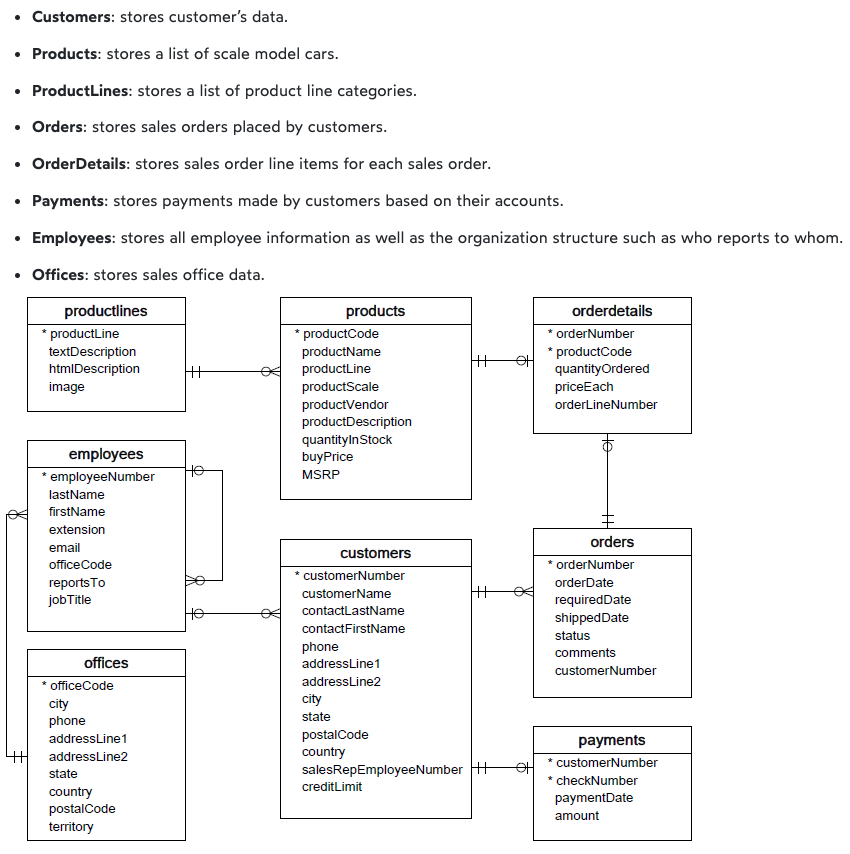
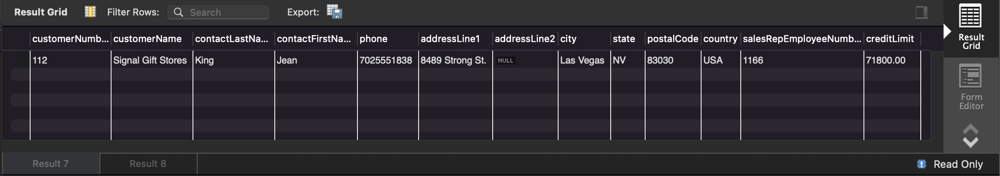

---
"혼자 공부하는 SQL" 강의와 [mysqltutorial](https://www.mysqltutorial.org/mysql-sample-database.aspx/)을 참고해서 정리한, MySQL을 이용한 SQL 기초 및 연습.
---

## 시작하기 (mac)

### 설치

```brew install mysql```

### 실행

```mysql.server start``` 

(데몬으로 실행하는 경우)

```brew services start mysql```

* 실행을 확인하기 위해서 ```brew services list```

#### 실행 후 초기 설정

```mysql_secure_installation```

* root password, 원격 접속 허용 등, 여러가지 기본 설정을 설정한다

#### Root 유저로 접속하기

```mysql -u root -p```

### 종료

```mysql.server stop```

(데몬으로 실행했다면)

```brew services stop mysql```

### +etc

* ```mysql -V``` : MySQL 버전 확인
* [메뉴얼한 설치](https://dev.mysql.com/downloads/mysql/)

---

## Load Sample Database into MySQL Server

1. MySQL 서버에 연결 
   * ```mysql -u root -p```
2. MySQL 서버로 데이터를 로드
   * ```mysql> source path\to\db\mysqlsampledatabase.sql``` 
3. 현재 서버의 모든 DB 확인
   * mysql> show databases;

---

## 데이터베이스

### 사용할 데이터베이스

* [mysqltutorial에서 제공하는 샘플 데이터베이스](https://www.mysqltutorial.org/wp-content/uploads/2018/03/mysqlsampledatabase.zip)



<p align='center'>출처 - https://www.mysqltutorial.org/mysql-sample-database.aspx/</p>

### 데이터베이스 생성

데이터베이스를 직접 생성하는 경우

```sql
CREATE SCHEMA 'name_of_db';
```

* DB 생성후 테이블을 설계하고 생성

```mysql
USE name_of_db;
CREATE TABLE name_of_table (
    tinyint_col  TINYINT,
    smallint_col SMALLINT,
    int_col    INT,
    bigint_col BIGINT );
```

---

## Index

### 인덱스

데이터베이스에서 테이블에 대한 동작 속도를 높여주는 자료구조. 사전의 목차를 생각해보자. 'F'로 시작하는 단어를 찾기 위해서 목차에 적혀진 'F'에 해당하는 페이지로 이동해서 찾는 것이 앞에서 부터 한 페이지씩 찾는 것 보다 효율적이다.

> An index is a schema object. It is used by the server to speed up the retrieval of rows by using a pointer. It can reduce disk I/O(input/output) by using a rapid path access method to locate data quickly. An index helps to speed up select queries and where clauses, but it slows down data input, with the update and the insert statements. 

* 빠르게 검색하기 위해서 데이터들이 정렬된 형태로 있어야하는데, 이때 인덱스를 데이터 컬럼의 사본을 정렬 해놓은 것으로 볼 수 있다
* 이때 데이터들은 b-tree, b+tree 같은 자료구조를 이용해서 정렬해놓는다

### CREATE INDEX

```sql
-- 인덱스를 생성하지 않고 찾을 경우 full table scan으로 찾게 됨
SELECT * FROM customers WHERE city='Las Vegas';

-- idx_city_name이라는 인덱스 생성
CREATE INDEX idx_city_name ON customers(city);
```

---

## View

### 뷰

하나 이상의 테이블(또는 다른 뷰)에서 원하는 모든 데이터를 선택하여, 사용자 정의에 따라 나타낸 가상의 테이블.

> In SQL, a view is a virtual table based on the result-set of an SQL statement. A view contains rows and columns, just like a real table. The fields in a view are fields from one or more real tables in the database. You can add SQL statements and functions to a view and present the data as if the data were coming from one single table. A view is created with the `CREATE VIEW` statement. 

뷰를 사용하는 이유 중 하나 (microsoft)

> Views are generally used to focus, simplify, and customize the perception each user has of the database. Views can be used as security mechanisms by letting users access data through the view, without granting the users permissions to directly access the underlying base tables of the view. Views can be used to provide a backward compatible interface to emulate a table that used to exist but whose schema has changed. Views can also be used when you copy data to and from SQL Server to improve performance and to partition data.

### CREATE VIEW

```sql
-- customer_view라는 뷰 생성
CREATE VIEW customer_view
AS 
	SELECT * FROM customers;
	
-- customer_view에 접근
SELECT * FROM customer_view;
```

---

## Stored Procedure

### 저장 프로시저

일련의 쿼리를 마치 하나의 함수처럼 실행하기 위한 쿼리의 집합. 쿼리를 묶는 개념 외에도 연산식, 조건문, 반복문 등을 사용할 수 있음.

### Example

```sql
DELIMITER $$ -- delimeter를 $$로 일시적으로 변경
CREATE PRoCEDURE myProc()
BEGIN
	SELECT * FROM customers WHERE city = 'Las Vegas';
	SELECT * FROM employees WHERE jobTitle = 'Sales Rep';
END $$ -- 블록을 $$로 종료
DELIMITER ; -- delimeter를 ;로 다시 변경
```

```sql
-- 저장 프로시저 호출
CALL myProc()
```




<p align='center'>myProc()를 호출해서 Result 7, 8 두 개의 결과를 확인</p>

---

## Further Reading

* [https://www.geeksforgeeks.org/sql-indexes/](https://www.geeksforgeeks.org/sql-indexes/)
* [https://www.datacamp.com/tutorial/introduction-indexing-sql](https://www.datacamp.com/tutorial/introduction-indexing-sql)
* [B-tree](https://www.geeksforgeeks.org/introduction-of-b-tree-2/)


## 참고

---

1. [https://www.mysqltutorial.org/mysql-sample-database.aspx/](https://www.mysqltutorial.org/mysql-sample-database.aspx/)
2. [혼자 공부하는 SQL](https://www.youtube.com/watch?v=_JURyg_KzHE&list=PLVsNizTWUw7GCfy5RH27cQL5MeKYnl8Pm&index=7)
3. [https://dev.mysql.com/downloads/mysql/](https://dev.mysql.com/downloads/mysql/)
4. [https://www.geeksforgeeks.org/sql-indexes/](https://www.geeksforgeeks.org/sql-indexes/)
5. [https://www.datacamp.com/tutorial/introduction-indexing-sql](https://www.datacamp.com/tutorial/introduction-indexing-sql)
6. [https://www.w3schools.com/sql/sql_view.asp](https://www.w3schools.com/sql/sql_view.asp)

