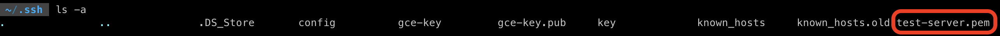
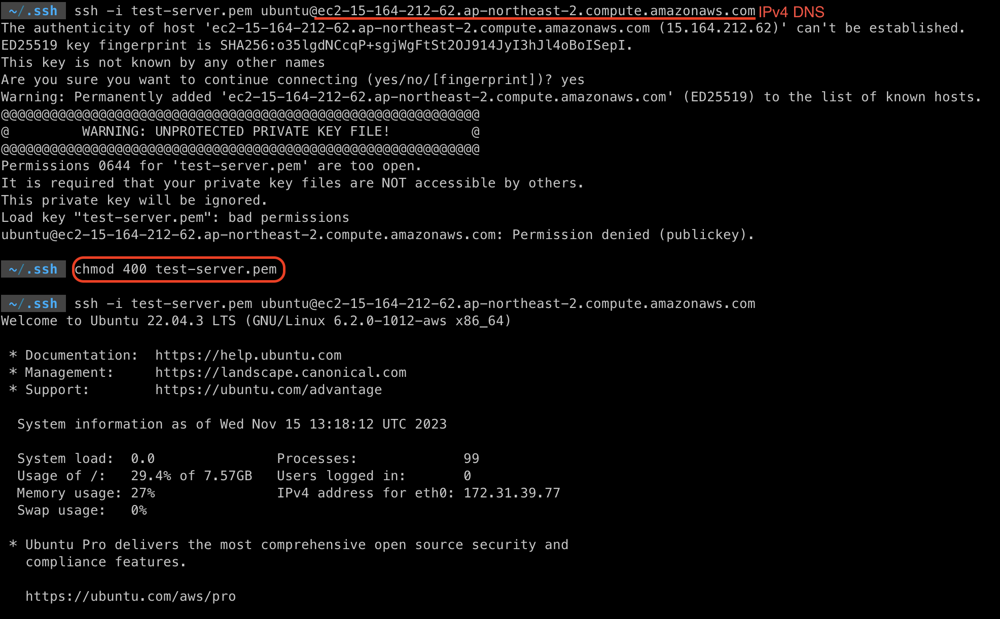
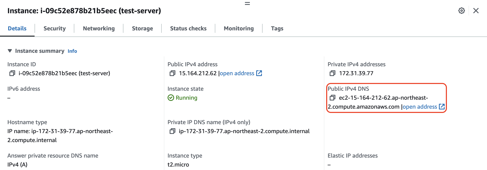
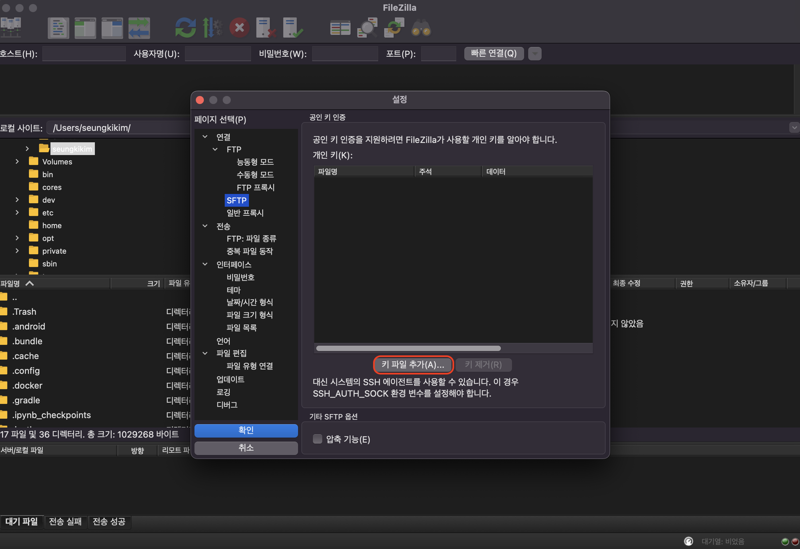
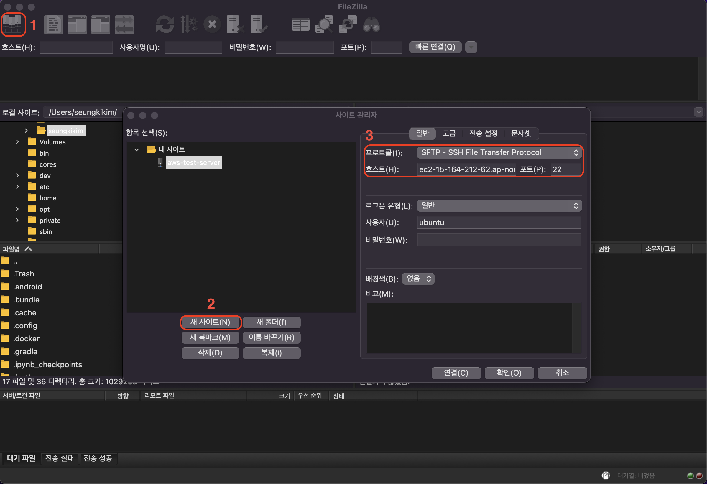

---
AWS documentation, 패스트 캠퍼스의 "한번에 끝내는 데이터 엔지니어링" 강의를 참고해서 정리한 EC2에서 SSH 연결하기.

---

## EC2 사용하기

### SSH 연결 (Linux, Mac)



* 생성한 키가 존재하는 디렉토리로 이동
* 키 확인





* ```ssh -i {key name} ubuntu@{Public IPv4 DNS}```
* 키에 대한 권한 설정 (read only로) - ```chmod 400 {key name}```
* 연결 확인

### FTP로 파일 전송

1. Filezilla 설치
   * [https://filezilla-project.org/](https://filezilla-project.org/)
2. SFTP 항목의 키 파일 추가로 받은 pem 파일 추가
3. 호스트 추가
   * 새 사이트
   * SFTP 프로토콜
   * 호스트는 IPv4 DNS 주소
   * 포트 22 (FTP 21번 포트가 아닌 SSH를 위한 22번 포트 사용)





---

## ETC

* VScode의 remote-ssh를 사용하면 조금더 seamless한 인터페이스를 제공했던거 같다. 찾아보니 remote-ssh를 사용하는 경우, 리모트 머신(이 경우에는 EC2 인스턴스)에 경량화된 VScode 서버를 설치하고, 이 서버가 리모트 머신과 로컬 VScode와의 통신을 매니징 해주는 것 같다.

* 예전에 사용했을때 터미널에서 ```sftp username@server-ip``` 로 연결하고 ```put```이나 ```get``` 명령어로 파일 transfer를 했던걸로 기억한다
* 다음 AWS 포스트는 AWS의 VPC에 대한 내용 그리고 스냅샷과 AMI에 관한 내용을 정리해야겠다


## 참고

---

1. [쉽게 설명하는 AWS](https://www.youtube.com/watch?v=9nBq6PxDvp4&list=PLfth0bK2MgIan-SzGpHIbfnCnjj583K2m&index=5)
2. 패스트 캠퍼스 - 한 번에 끝내는 데이터 엔지니어링