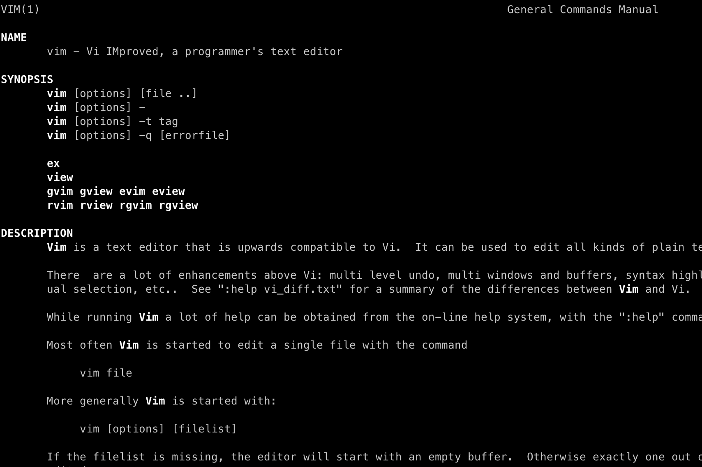
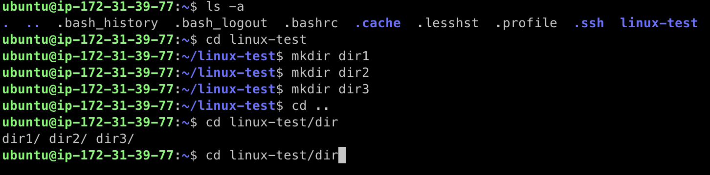
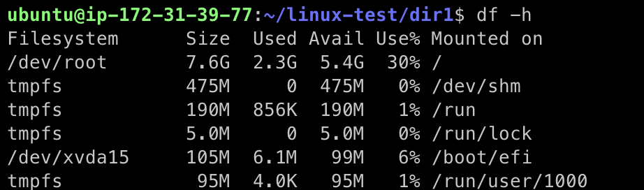
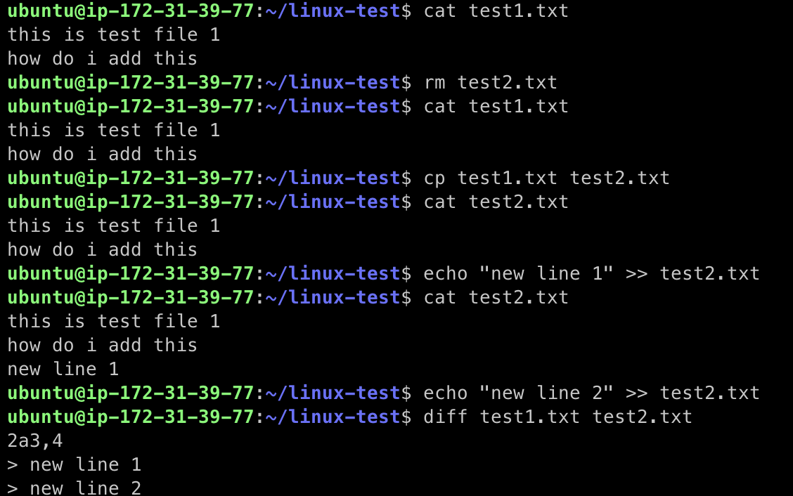
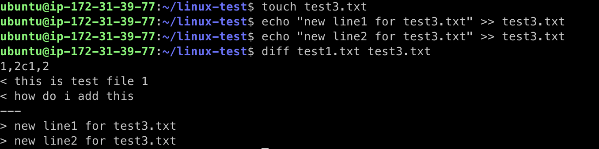
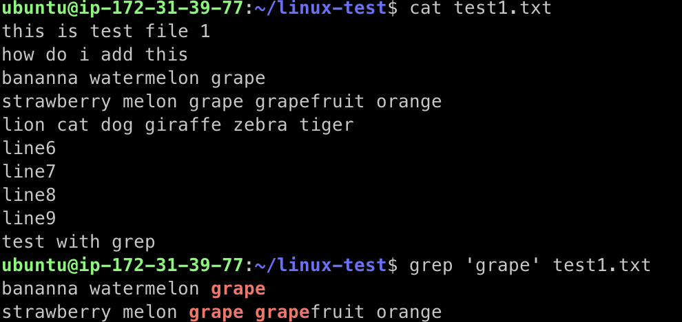
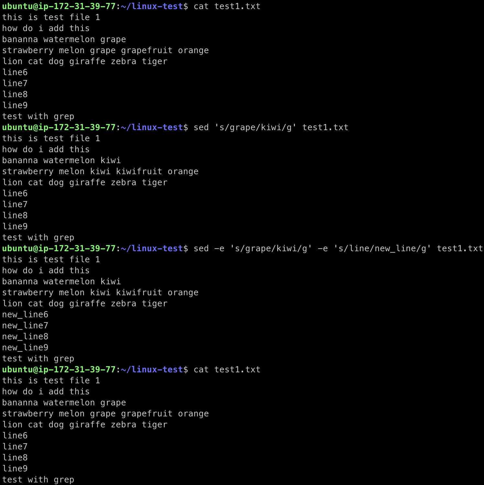

---

Linux 활용 총정리 (Ubuntu 환경에서 진행). 이전 포스트에서 정리한 명령어와 중복 되는 경우 최대한 제외하려고 노력함.

---

## 이전 리눅스 정리 포스트

* [linux basic - 1](https://seungki1011.github.io/Basic-Linux-1/)
* [linux basic - 2](https://seungki1011.github.io//Basic-Linux-2/)

---

## 파일 시스템

### man, --help

* 명령어에 대한 메뉴얼, 도움말을 보여주는 명령어
* 예시
  * ```man vi```
  * ```vi --help```
  * ```vi -h```



### cd

* change directory
*  ```cd {path}``` 상태에서 탭키를 누르면 path 안에 선택할 수 있는 경로를 보여줌



* ```cd -``` : 이전의 경로로 다시 가기
* ```cd ~``` : 홈 디렉토리로 가기
* 유저에 따라 홈 디렉토리가 다를 수 있음
  * 유저의 이름으로 생성된 디렉토리가 홈 디렉토리가 될 수 있음
  * 사용하는 os 환경에 따라 다름


### ls

* ```ls -a``` : .으로 시작하는 파일, 폴더를 포함해서 전체 파일 출력
* ```ls -l``` : 퍼미션, 소유자, 만든 날짜, 용량까지 출력
* ```ls -h``` : 용량을 사람이 읽기 쉽도록 표현 (h는 human-readable)
* 옵션을 여러개 줘서 사용이 가능하다
  * ```ls -al``` 같은 형식으로 많이 사용 (기본적으로 ```ll```이라는 alias가 제공이 됨)

### rm

* remove
* ```rm {파일명}``` : 파일 삭제
* ```rm -r {디렉토리명}``` : 폴더 삭제 (r는 recursive)
  * ```rmdir {디렉토리명}``` 도 사용가능
* ```rm -rf {디렉토리명}``` : 강제 삭제 (f는 force)

### df

* 디스크 공간 확인
* ```df -h```



### du

* ```du -h```
  * 특정 프로그램 파일이나 로그 파일의 용량 확인에 활용
* ```du -sh``` : 전체 용량 확인 (s는 summarize)
* ```du -h -d 2``` : max depth 옵션을 주는 것이 가능함 (깊이 2까지만 확인)


### chmod

* change mode (접근 권한 변경)
* r(read) : 읽기 권한
* w(write) : 쓰기 권한
* x(execute) : 실행 권한
* User, Group, Others가 존재하고 권한 범위도 존재함
* User (u)
  * ```echo $USER```
  * ```whoami```
* Group (g)
  * ```groups```
  * ```groups {그룹명}``` : 그룹에 속한 유저들 확인
* Other (o)
  * 그외의 사용자
* All (a)
  * 모든 사용자


<p align='center'>출처 - https://www.reddit.com/r/linux/comments/ayditr/chmod_cheatsheet/</p>

#### 예시

* ```chmod +x {파일명}``` : 모두 실행권한 추가
* ```chmod -x {파일명}``` : 모두 실행권한 제거
* ```chmod u+x {파일명}``` : user(owner)에게만 실행 권한 추가
* ```chmod o-r {파일명}``` : other에게 읽기 권한 제거
* ```chmod 660 {파일명}``` : owner, group에는 rw-(읽기, 쓰기) 권한 / others에는 --- (권한 없음)

---

## 파일 관리

### touch

* 새로운 빈 파일 생성
* ```touch {새 파일명}```

### tail

* 파일의 끝 내용 출력
* ```tail -f {파일명}``` : 새롭게 추가 되는 내용을 실시간으로 확인 할 수 있음
  * 서버 로그 쌓이는 것을 확인할 때 사용 가능

### comm

* compare
* 두 개의 파일을 비교해주는 명령어
* ```comm -12 {파일1} {파일2}``` : 파일1과 파일2에 둘다 똑같이 존재하는 라인만 출력
* ```comm -3 {파일1} {파일2}``` : 파일1과 파일2와 비교했을때 유니크(유일)하게 존재하는 라인만 출력

### cmp

* compare
* 바이트 단위로 비교
* ```cmp {파일1} {파일2}```
* 두 파일의 바이트 수 차이를 알려줌

### diff

* difference
* 라인별로 비교해서 차이점을 보여줌
* add(a), change(c), delete(d) 3가지 심볼로 차이를 나타냄





### less

* 프린트 하지 않고 파일 내용을 볼 수 있음(man과 비슷)
* ```vi```는 파일 전체를 열기 때문에 파일이 크면 느릴 수 있지만, ```less```는 현재 보고 있는 부분만 열기 때문에 더 빠르게 내용을 확일 할 수 있음
* 양방향 탐색 가능
* ```less {파일명}```

### ln (symbolic links)

* 심볼 링크, 소프트 링크
* 윈도우의 바로가기랑 비슷한거로 생각하면 편함
* 파일, 디렉토리에 대한 간접 포인터
* ```ln -s {파일 경로} {파일에 대한 심볼 링크}```
* 심볼링크에 대한 파일을 삭제하는 경우 심볼링크가 깨짐
  * 해당 경로에 삭제한 파일과 동일한 파일명을 다시 추가하는 경우 심볼링크를 삭제하지 않은 경우 다시 이어짐
  * 파일의 inode를 기반으로 링크하는 것이 아니라 경로를 기반으로 링크하는 것을 알 수 있음
* ```unlink``` 또는 ```rm```으로 심볼링크 삭제 가능

---

## 검색

### which

* ```$PATH```에 등록된 경로 중에서 인자로 주어진 이름의 파일 위치를 찾음
* 사용하는 명령어가 설치된 위치를 찾는데 활용
  * ```which python```

### grep

* 파일에 주어진 패턴 목록과 매칭되는 라인을 검색 해줌 (정규식 사용 가능)
* 파이프 ```|```와 자주 사용

#### 예시

* ```grep "{찾을 패턴}" {파일명}```
* 일치하는 패턴이 있으면 해당하는 라인을 보여줌



* ```grep -r "{찾을 패턴}" {경로}```
* 특정 경로에 있는 모든 파일에 대해서 특정 패턴이 존재하는 라인을 보여줌
* ```grep -rn "{찾을 패턴}" {경로}``` : 해당 줄이 몇번째 줄인지 라인 넘버까지 표시 해줌


* ```|```를 사용해 결과에 대해 다시 명령어 사용 가능 (파이프는 결과를 다음 명령어로 넘겨준다는 뜻)


### sed

* streamlined editor
* 편집을 위한 명령어
  * 텍스트 필터링 또는 변환
* 원본 손상 없음
  * 모든 결과는 명령을 수행한 화면으로 출력 됨
* 편집 결과를 저장하기 전까진 파일을 변형하지 않음
* ```sed```에 대해 더 알아보기 [https://www.gnu.org/software/sed/manual/sed.html](https://www.gnu.org/software/sed/manual/sed.html)
  * 패턴 스페이스, 홀드 스페이스에 대한 내용을 알아봐도 좋을 것 같다

#### 예시

* 치환
* ```sed 's/{target_word}/{new_word}g'{파일}``` : 파일에 존재하는 target_word를 전부 new_word로 교체(대소문자 구분)
* ```-e``` 옵션을 줘서 여러개의 명령을 추가 가능
* 원본에 저장하기 위해서 ```-i``` 옵션 사용
  * ```sed -i 's/{target_word}/{new_word}g'{파일}```
* ```sed 's/{target_word}/{new_word}g'{파일} > {새로운파일}``` 
  * 원본은 바꾸는 않고 결과를 새로운 파일에 저장하는 형식으로 사용가능



* ```vi```에 들어가서 ```%s/{target_word}/{new_word}/g```를 이용해 치환하는 것도 가능하다

---

## 시스템

### uname

* 시스템 정보 확인
* ```uname -a```
  * 모든 정보 출력
* ```uname -n```
  * 네트워크 노드의 호스트 네임

### ps

* process
* 현재 실행중인 프로세스 확인
* ```ps -ef```
  * 프로세스들의 상태 확인
* ```ps aux```
  * 프로세스들 상태를 cpu, memory 사용률과 함께 확인
* ```ps aux | grep {target_name}```
  * 프로세스 중에 ```target_name```을 명령어 또는 파라미터로 넣은 프로세스 확인 가능

| 항목 |                  의미                   |
| :--: | :-------------------------------------: |
| PID  |             프로세스 아이디             |
| PPID | 부모 프로세스 아이디(Parent Process ID) |
| TTY  |      프로세스가 실행된 터미널 세션      |

### kill

* 프로세스에 signal을 보내는 명령어
  * 보낼 시그널을 지정하지 않을 경우 SIGTERM 시그널을 보내게 됨(프로그램 종료)
* ```kill -l``` : 시그널 리스트 확인
* ```kill -9 $pid```
  * SIGKILL
  * 프로세스 강제 종료
* ```kill -15 $pid``` 또는 ```kill $pid```
  * SIGTERM
  * 종료하겠다는 시그널을 보낸다
    * 어플리케이션의 코드에 따라 시그널을 처리하는 것이 달라진다
* ```kill -2 $pid```
  * SIGINT
  * interrupt
  * 프로세스를 유지하는 세션(터미널에서 foreground로 돌아가는 프로세스)에서 ctrl+c 할 경우 이 시그널이 전달됨
* 부모를 ```kill``` 해줘야 돌아가는 프로세스의 로직을 종료 시킬 수 있는 경우가 있음

---

## 네트워크 관련

## ss

* socket statistics
* ```netstat``` 명령어의 대체
* ```ss```
  * 네트워크의 소켓 정보를 표시해준다

#### 옵션 종류

* ```-a``` : 전체 포트 보기
* ```-t``` : TCP 포트 보기
* ```-u``` : UDP 포트 보기
* ```-x``` : 유닉스 포트 보기
* ```-l``` : 접속 대기(listening) 상태의 포트 보기
* ```-p``` : 프로세스명 표시
* ```-n``` : IP로 표기
* ```-s``` : 현재 소켓 상태에 대한 통계 표시
* ```-m``` : 네트워크 사용량 표시

---

## I/O

### redirection

* 출력의 결과를 파일로 저장
* ```>``` : 기존의 파일 내용을 지우고 저장(overwrite)
* ```>>``` : 기존 파일 내용 뒤에 저장(append)
* ```<``` : 파일의 데이터를 명령어에 입력
* ```>>``` : 지정한 단어까지의 데이터를 명령어에 입력


## 참고

---

1. [https://www.youtube.com/watch?v=EL6AQl-e3AQ](https://www.youtube.com/watch?v=EL6AQl-e3AQ)
1. 패스트 캠퍼스 - 한번에 끝내는 데이터 엔지니어링
1. [https://www.reddit.com/r/linux/comments/ayditr/chmod_cheatsheet/](https://www.reddit.com/r/linux/comments/ayditr/chmod_cheatsheet/)
1. [https://www.gnu.org/software/sed/manual/sed.html](https://www.gnu.org/software/sed/manual/sed.html)

