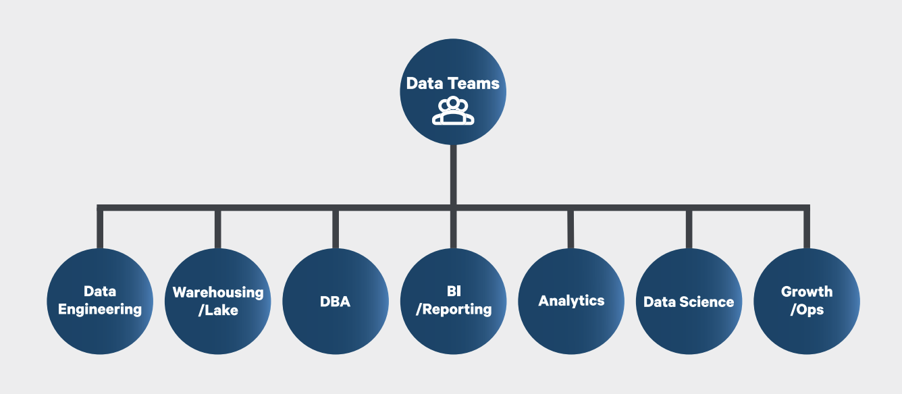

---
해당 포스트는 코세라의 IBM Data Engineering 코스를 한글로 다시 정리한 내용입니다.

---
## Role of Data Engineering

### 데이터 팀 직무별 소개

데이터로 부터 가치를 이끌어내기 위해서는 다양한 직무와 협업을 해야한다. 데이터팀의 다양한 직무에 대한 소개를 하자면 다음과 같다. (**회사의 규모나 특징에 따라 한 직무가 여러가지 일을 맡아야하는 경우도 존재한다. JD나 기술블로그 등을 통해서 희망하는 회사의 데이터 엔지니어가 정확히 어떤 일을 하는지 찾아보는 것도 좋을 것 같다.**)

1. 데이터 엔지니어(Data Engineer)
   * 데이터 인프라 및 아키텍쳐를 개발하고 유지보수
   * 여러 데이터 소스로 부터 데이터를 추출, 통합 및 정리
   * 데이터 분석을 준비하기 위해서 데이터 전처리, 클렌징 등의 작업
   * 여러 이해 관계자(End-user)들이 필요한 데이터에 접근을 할 수 있는 파이프라인 구축
   * 필요한 스킬
     * 프로그래밍, 시스템 아키텍쳐, 데이터베이스에 대한 지식
2. 데이터 분석가(Data Analyst)
   * 의사 결정을 위해 데이터를 해석
   * 데이터를 검사 및 분석
   * 데이터내의 상관관계와 패턴을 찾기
   * 분석을 위한 데이터 시각화
   * 필요한 스킬
     * SQL, 분석 툴, 프로그래밍에 대한 지식
     * 분석한 내용을 스토리텔링 할 수 있는 능력
3. 데이터 사이언티스트(Data Scientist)
   * Actionable insight에 대한 데이터를 분석
   * 데이터를 가지고 머신러닝 모델 개발
   * 여러가지 복잡한 문제와 현상을 데이터를 통해 해결
   * 필요한 스킬
     * 수학, 통계, 프로그래밍 지식
     * 도메인 지식을 습득해서 적용할 수 있는 능력
4. 비즈니스 및 BI 분석가(Business Analyst & BI Analyst)
   * 데이터 분석가과 사이언티스트로 부터 얻은 분석 및 통찰을 이용
   * 시장의 동향이나 외부 영향에 집중
   * BI 솔루션 제공

출처 - https://www.sisense.com/blog/the-6-functions-of-a-data-team/

## 참고

---

1. [Coursera - IBM Introduction to Data Engineering](https://www.coursera.org/learn/introduction-to-data-engineering/)
2. [https://www.sisense.com/blog/the-6-functions-of-a-data-team/](https://www.sisense.com/blog/the-6-functions-of-a-data-team/)
