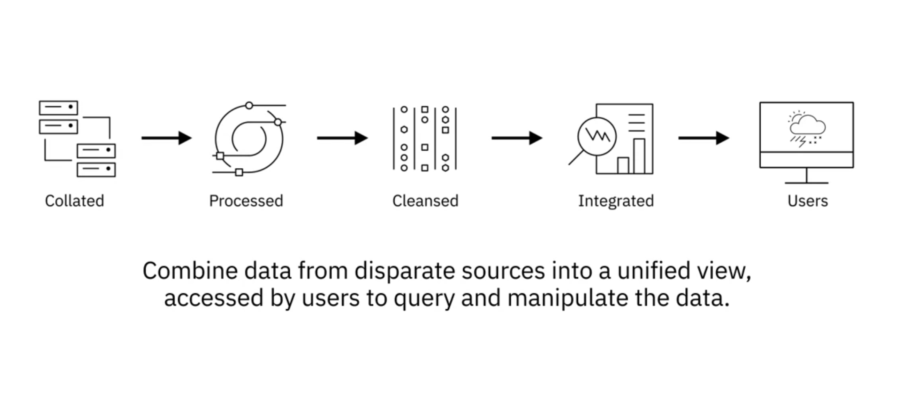
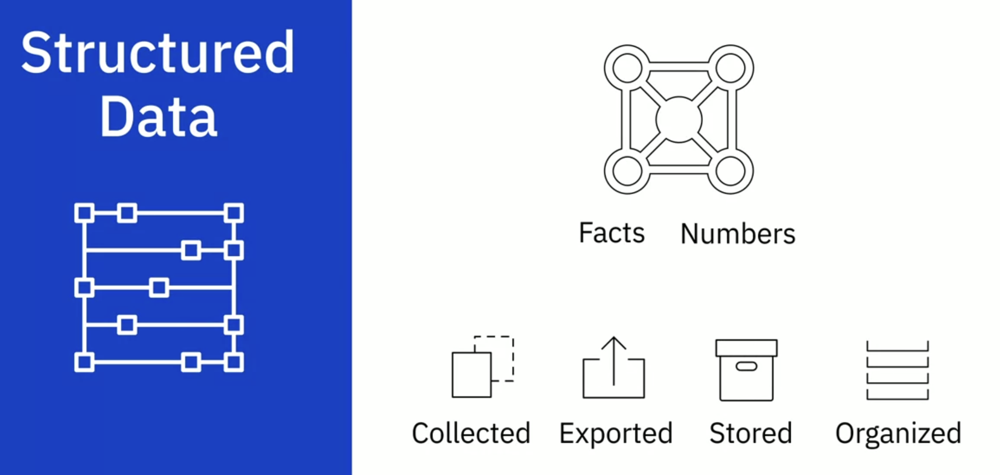
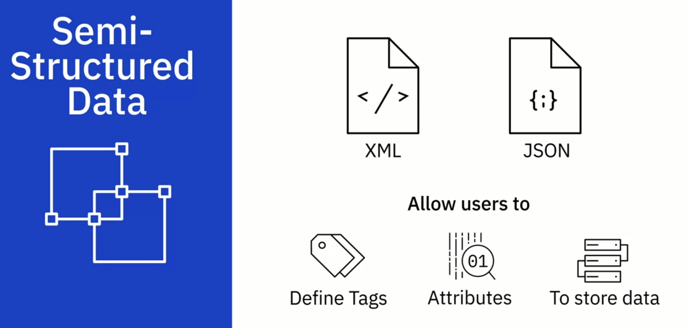
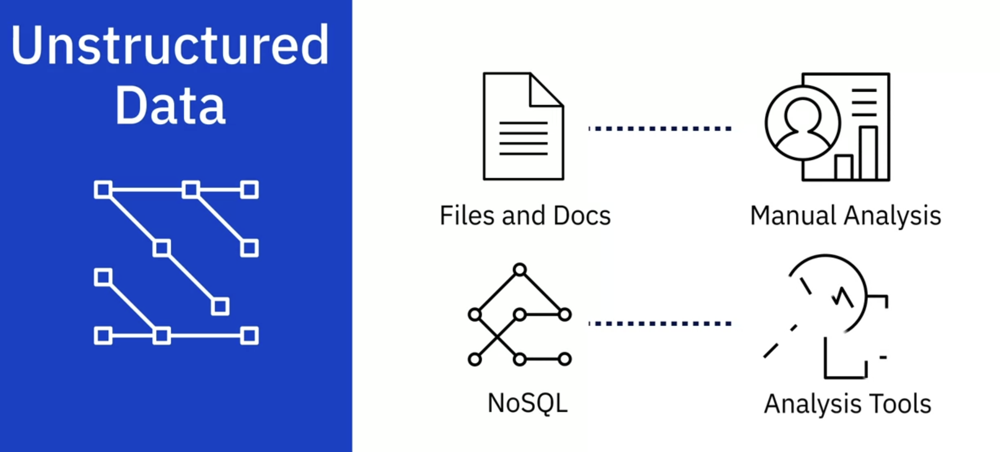

---
해당 포스트는 코세라의 IBM Data Engineering 코스를 한글로 다시 정리한 내용입니다.

---

## What Data Engineers Work On

### A Data Engineer's Ecosystem

데이터 엔지니어가 작업하는 시스템은 데이터 관리 및 처리에 필수적인 다양한 요소를 포함한다.

1. 데이터 유형(Date Types)
   * 데이터에는 정형(structured), 비정형(unstructured) 그리고 반정형(semi-structured) 데이터가 존재한다
   * 이런 데이터의 형태는 데이터의 저장 및 처리 방법에 영향을 미친다
   * 정형 데이터의 경우 RDBMS(관계형 데이터베이스)에 맞는 반면, 비정형이나 반정형 데이터는 NoSQL 데이터베이스가 더 적합하다
2. 데이터 원천 및 포맷(Data Sources and Formats)
   * 데이터는 데이터베이스, 웹 서비스, API 등.. 다양한 소스로 부터 수집된다
   * 데이터들은 다양한 파일 포맷으로 올 수 있으며, 어떤 데이터베이스를 사용할지 정하는 것은 이런 데이터의 형태, 파일 포맷, 소스 등에 따라 달라질 수 있다
3. 데이터 레포지토리(Data Repositories)
   * OLTP(Online Transaction Processing) 시스템들은 보통 높은 볼륨의 운영 데이터를 저장해야 한다. 온라인 뱅킹 transaction, 항공권 예매 등이 여기에 포함된다.
     * OLTP는 보통 관계형 데이터베이스를 사용하지만, NoSQL 데이터베이스도 사용 할 수 있다
   * OLAP(Online Analytical Processing) 시스템의 경우 복잡한 데이터 분석을 위해 최적화 해야하는 경우가 많다
     * OLAP는 SQL, NoSQL, 데이터 웨어하우스, 데이터 마트, 데이터레이크, 등.. 다양한 데이터 레포지토리에서 분석을 진행한다
   * [OLTP vs OLAP]()
4. 데이터 통합(Data Integration)
   * 데이터 엔지니어들은 데이터 통합 툴들을 이용해서 여러 데이터 소스로 부터 얻은 데이터를 하나의 인터페이스로 통합해서 유저가 접근할 수 있도록 한다
   * 보통 데이터 클리닝과 전처리, 등의 작업이 포함된다 
5. 데이터 파이프라인(Data Pipeline)
   * 데이터가 원천에서 끝단까지 잘 흘러가도록 데이터 파이프라인을 구축해야 한다
   * 이런 파이프라인들은 ETL또는 ELT 같은 프로세스가 포함된다
6. 프로그래밍과 SQL 언어(Programming and Query Languages)
   * SQL 등의 쿼리 언어를 쿼리를 작성하는데 사용한다
   * 파이썬이나 자바 같은 프로그래밍 언어로 애플리케이션을 개발한다
   * 쉘 스크립트 언어로 배치성 작업과 같은 운영 작업을 수행한다
7. BI & Reporting Tools
   * BI 툴들은 여러가지 데이터를 시각화해서 상호작용이 가능한 대시보드의 형태로 보여준다
   * 데이터 엔지니어들은 데이터 분석가나 BI 분석가들이 이런 툴들을 사용할 수 있는 인프라를 구성하거나 경우에 따라서는 직접 개발을 해야하는 경우가 있을 수 있다

출처 - https://www.coursera.org/learn/introduction-to-data-engineering

---

## Different Types of Data

### What is Data?

데이터는 의미를 도출하기 위해 처리될 수 있는 정리되지 않은 정보이다. 여기에는 어떠한 관찰, 숫자, 문자, 기호, 이미지 등 여러가지 종류의 정보가 포함된다. 데이터는 다음의 세가지 구조에 따라 분류 할 수 있다.

#### 정형 데이터(Structured Data)

* 특정 데이터 모델을 준수하는 구조
* Tabular 포맷(행과 열로 이루어진 테이블, 표)
* 스프레드 시트, 센서 데이터, 네트워크 로그 데이터, 서버 로그 데이터 등이 여기에 포함
* 보통 관계형 데이터베이스(SQL Database)에 저장되고 표쥰 데이터 분석 방법 및 도구를 이용해 분석

출처 - https://www.coursera.org/learn/introduction-to-data-engineering

#### 반정형 데이터(Semi-Structured Data)

* 일부는 체계적으로 정리된 속성을 보유하고 있지만 강력히 고정된 스키마를 가지고 있지 않는다
* 데이터 그룹화와 계층 구조에 대한 태그, 요소 또는 메타데이터 포함
* HTML, 이메일, XML, 바이너리 실행 파일 및 압축 파일 등이 포함
* XML 및 JSON 형식은 일반적으로 반정형 데이터를 저장하고 교환하는데 사용할 수 있음
  * 서버와 클라이언트간 데이터를 주고 받기위해 사용되는 경우가 많다

출처 - https://www.coursera.org/learn/introduction-to-data-engineering

#### 비정형 데이터(Unstructured Data)

* 고정된 스키마가 존재하지 않고, 행과 열로 구성할 수 없음
* 특정 형식, 순서, 규칙을 따르지 않음
* 소셜 미디어 피드, 이미지, 비디오/오디오 파일, 문서, 설문조사 등이 포함
* 문서 파일 등에 저장하고 수동 분석을 하는 경우도 있음
* 보통 NoSQL 데이터베이스에 저장하고 분석툴을 이용해 분석

출처 - https://www.coursera.org/learn/introduction-to-data-engineering

정리하자면, 정형데이터는 강력한 스키마 아래 구조화 된 데이터에 적합하다. 반정형 데이터의 경우 정형 데이터에 비해 스키마가 고정되어 있지 않고, 메타 태그를 이용해서 계층화 그룹화를 시킨다. 비정형 데이터는 행과 열의 형태로 데이터를 표현할 수 없다.

## 참고

---

1. [Coursera - IBM Introduction to Data Engineering](https://www.coursera.org/learn/introduction-to-data-engineering)

