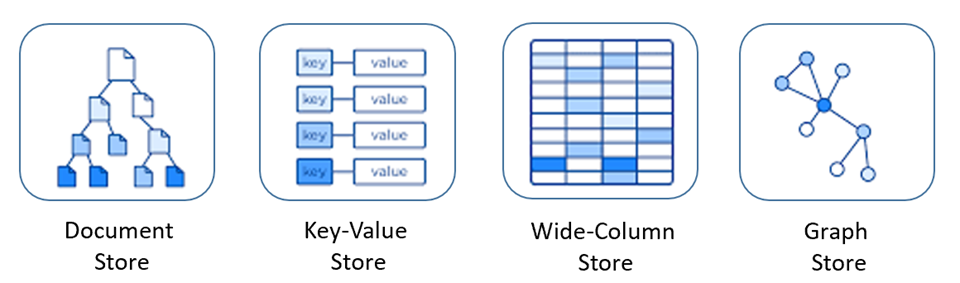
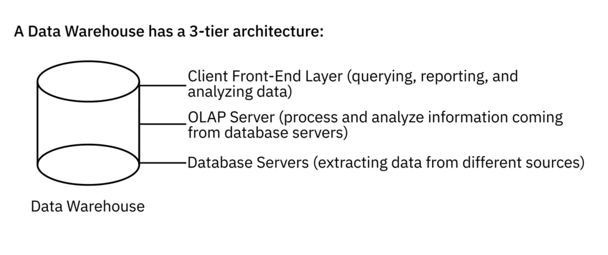
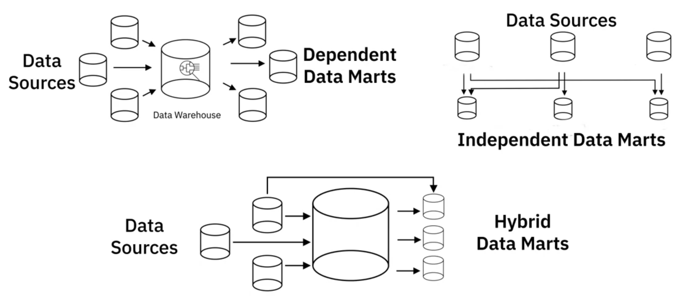
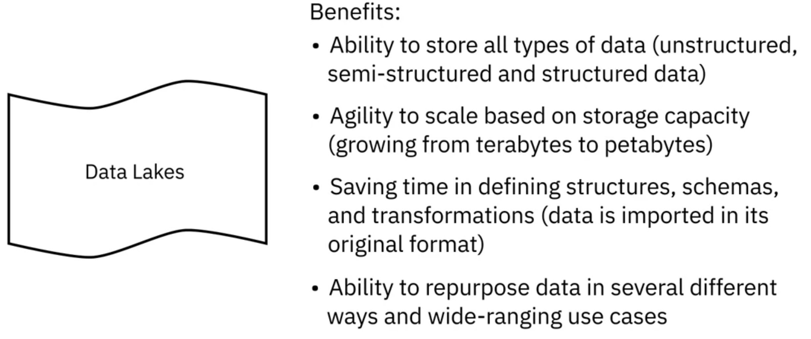

---
해당 포스트는 코세라의 IBM Data Engineering 코스를 한글로 다시 정리한 내용입니다.

---

## Understanding Data Repositories : DB, Data Warehouse, BigData Repository

### 데이터 저장소의 이해 

데이터 저장소는 비즈니스 운영, 보고 및 데이터 분석에 사용되는 체계적이고 격리된 데이터 집합을 의미한다. 보통 하나 이상의 데이터베이스로 구성되며 크기와 구조가 다양할 수 있다. 다음은 데이터베이스, 데이터 웨어하우스, 빅데이터 저장소 등 다양한 데이터 저장소 유형들의 소개이다.

#### 데이터베이스(Database)

* 데이터 입력, 저장, 검색 및 수정을 위해 설계
* DBMS에 의해 관리(데이터베이스와 DBMS는 사전 의미상 다른 것을 의미하지만, 실제로는 상호교환적으로 쓰이는 경우가 많다)
* 쿼리를 사용해서 데이터 추출 및 수정이 가능하다
* 범주에는 관계형(Relational, RDBMS) 그리고 비관계형(Non-relational, NoSQL) 데이터베이스가 존재한다
  * 관계형 데이터베이스(RDBMS)는 잘 정의된 스키마를 사용해서 데이블 형식 구조(Tabular format)로 데이터를 구성하고 쿼리에 SQL을 사용한다
  * 비관계형 데이터베이스(NoSQL)에는 스키마가 느슨하거나 없는 형태로 데이터를 저장할 수 있으며 속도, 유연성 그리고 확장성이 필요하다

출처 - https://towardsdatascience.com/relational-vs-non-relational-databases-f2ac792482e3

#### 데이터 웨어하우스(Data Warehouse)

* 다양한 소스의 데이터를 저장하는 중앙 저장소 같은 느낌
* ETL 프로세스는 분석 및 BI를 위해 데이터를 추출, 변환하고 하나의 포괄적인 데이터베이스로 로드한다
  * ETL이나 ELT에 관한 내용은 다음 포스트에서 다룰 예정
* 기존 데이터 웨어하우스는 관계형인 경우가 많았지만 비관계형 데이터 저장소가 많아지는 추세
* 데이터 웨어하우스와 관련된 내용으로 데이터 레이크(Data Lake)와 데이터 마트(Data Mart)가 있다

#### 빅데이터 스토어(Bigdata Store)

* 분산된 컴퓨팅 및 스토리지 인프라를 사용한다
* 대규모 데이터 세트 저장, 확장 및 처리
* 클라우드 컴퓨팅, IoT, 소멸 미디어 등에서 생성되는 빅데이터를 관리하는데 필수적이다

**Snowflake에서 정의 내리는 Data Repository**

> A data repository is a collection of data in a physically stored location or an assigned data storage location. More specific definitions include locations within an existing IT infrastructure where organizations or businesses are storing data across multiple databases or in some cases, where partitioned data sets are stored together (also this latter definition more accurately belongs to the data warehouse). [Data marts](https://www.snowflake.com/data-warehousing-glossary/data-mart/) are also sometimes referred to as data repositories, also this is a narrow definition.

---

## RDBMS

### 관계형 데이터베이스 알아보기

관계형 데이터 베이스의 이점과 불리점, 예시를 살펴보자.

1. Advantages
   * 스프레드 시트와 다르게 대용량 데이터에 대한 최적화된 데이터 저장, 검색 및 처리에 이상적이다
   * 각 테이블에는 고유한 행과 열 집합이 있으며, 테이블 간 관계를 정의할 수 있으므로 데이터 중복을 최소화할 수 있다
   * 필드를 특정 데이터 타입과 값으로 제한 할 수 있기 때문에 일관성과 데이터 무결성을 높을 수 있다
   * 쿼리에 SQL을 사용하고 많은 양의 레코드를 처리하고, 검색할 수 있다
   * 데이터에 대한 통제된 액세를 제공하고 데이터를 관리하기 위한 표준 및 정책을 적용할 수 있도록 보장한다
2. Disadvantages
   * 반정형, 비정형 데이터에 적합하지 않다, 따라서 이러한 데이터에 대한 광범위한 분석 또한 적합하지 않다
   * 두 RDBMS간 마이그레이션을 위해서는 소스 테이블과 목적 테이블 간에 스키마와 데이터 유형이 동일해야 한다.
3. Examples
   * DB2
   * Microsoft SQL Server
   * MySQL
   * Oracle Database
   * PostgreSQL
4. Cloud-based RDBMS(Database as a Service)
   * Amazon Relational Database Service(RDS)
   * Google Cloud SQL
   * Oracle Cloud
   * SQL Azure

---

## NoSQL

### 비관계형 데이터베이스 알아보기

NoSQL은 "Not Only SQL"의 약자로 유연한 데이터 저장 및 검색을 위해 설계된 비관계형 데이터베이스 유형이다. 다양한 데이터 유형들이 등장하고 클라우드 컴퓨팅, 빅데이터, 대용량 웹 및 모바일 애플리케이션 시대에 맞춰 확장성, 성능, 사용 편의성으로 인해 인기를 얻기 시작했다. NoSQL은 기존의 구조화된 데이터베이스 모델을 따르지 않으며 데이터 쿼리에 항상 SQL을 사용하지 않는다. 스키마 없는 스토리지를 제공하며 정형, 반정형, 비정형 데이터를 수용할 수 있다.

NoSQL의 네 가지 일반적인 유형은 다음과 같다

1. Key-Value Store
   * 키는 데이터의 속성을 나타내며 고유 식별자 역할을 한다
   * 키-값 모두 간단한 정수부터 복잡한 JSON 까지 될 수 있다
   * 사용자 세션 데이터, 선호도, 실시간 추천, 캐싱 등에 적합한 Key-Value 쌍으로 저장
   * 예시로는 Redis, Memchached, DynamoDB 등
2. Document-Based
   * 레코드 및 관련 데이터가 하나의 문서 내에 저장되어 유연한 인덱싱 및 임시 쿼리가 가능하다
   * 실제 use-case로는 이커머스, 의료 기록, CRM 등이 있다
   * 예시로는 MongoDB, DocumentDM, CouchDB 등
3. Column-Based
   * 데이터는 행이 아닌 열로 구성되어 있어 많은 쓰기 요청이 필요한 시계열 데이터, 날씨 데이터, IoT 데이터 등에 적합하다
   * 예시로는 Cassandra, HBase 등
4. Graph-Based
   * 그래프 모델을 활용하여 데이터를 표현하고 저장하기 때문에 데이터간 연결 및 관계를 시각화하기 적합하다
   * 실제 use-case에는 소셜 네트워크, 추천, 네트워크 다이어그램, 액세스 관리 등에 사용한다
   * 예시로는 Neo4j, CosmosDB 등

NoSQL 데이터베이스의 장점으로는 대용량의 데이터를 처리할 수 있는 능력, 분산 처리 시스템 지원, 비용 효율적인 확장, 설계의 유연성 등이 있다. 특히 클라우드 컴퓨팅 환경과 에자일한 개발에 유용하다.

관계형 데이터베이스와 대조되는 장점을 가짐에도 불구하고, NoSQL 데이터베이스는 관계형 데이터베이스에 비해 ACID 준수성이 부족하고, 리스크 관리나 대처에 있어서도 부족할 수 있다는 것을 염두 해두어야 한다.(기술의 성숙도가 낮다는 표현을 쓰는 같다)

출처 - https://learn.microsoft.com/ko-kr/dotnet/architecture/cloud-native/relational-vs-nosql-data

---

## Data Warehouse, Data Mart, Data Lake

### 데이터 웨어하우스(Data Warehouse)

* 여러 데이터 소스에서 통합된 중앙 저장소
* 정리, 조정 및 분류된 현재와 과거의 데이터를 저장
* 데이터가 웨어하우스에 로드되면 해당 데이터는 이미 특정 목적에 맞게 모델링 및 구조화되어 있어 분석 준비가 완료되어 있을 확률이 높다
* 전통적으로 CRM, ERP, HR, 재무 애플리케이션 등과 같은 거래 시스템 및 운영 데이터베이스의 관계형 정보를 저장하는 역할을 했으나, NoSQL 기술과 새로운 데이터 소스들의 출현으로 비관계형 데이터 저장소로 데이터 웨어하우징에 사용되고 있다
* 일반적으로 데이터 웨어하우스는 3계층 아키텍쳐로 이루어져 있다

출처 - https://www.coursera.org/learn/introduction-to-data-engineering

* 전통적으로 온프레미스 데이터 센터에 존재하던 데이터 웨어하우스는 클라우드로 이동하고 있다
  * 클라우드를 사용하는 이점은 비용 절감, 무제한 스토리지, pay-as-you-go 기반의 스케일링, 빠른 재난 복구 등이 있다
* 보통 보고 및 분석을 위해 즉시 사용할수 있어야 하는 방대한 양의 데이터가 있을 경우 데이터 웨어하우스를 선택하게 된다
* 예시로는 Teradata Data Warehouse Platform, Oracle Exadata, Amazon Redshift, Google Bigquery, Snowflake Cloud Data Warehouse 등이 있다

출처 - https://www.coursera.org/learn/introduction-to-data-engineering

### 데이터 마트(Data Mart)

* 특정 비즈니스의 기능, 목적 또는 사용자 커뮤니티를 위해 특별히 구축된 데이터 웨어하우스의 하위 섹션
* 데이터 마트에는 3가지 유형이 있다

#### 종속형(Dependent)

* 데이터 웨어하우스의 제한된 영역에 대한 분석 기능을 제공하고 격리된 보안과 격리된 성능도 제공한다
* 데이터가 이미 정리되고 변환된 엔터프라이즈 데이터 웨어하우스에서 가져오는 경우가 많다

#### 독립형(Independent)

* 엔터프라이즈 데이터 웨어하우스 이외의 소스에서 생성된다, 내부 운영체제나 외부 데이터가 이에 해당한다
* 운영 제제 및 외부 소스에서 제공되는 소스 데이터에 대한 변환 프로세스를 수행해야 한다

#### 하이브리드형(Hybrid)

* 데이터 웨어하우스, 운영 시스템 및 외부 시스템의 입력을 결합한다

출처 - https://www.coursera.org/learn/introduction-to-data-engineering

유형이 무엇이든 데이터 마트의 목적은 필요 할 때 사용자에게 가장 관련성이 높은 데이터를 제공하고, 효율적인 응답 시간을 제공하여 비즈니스 프로세스를 가속화하고, 안전한 액세스와 제어 능력을 가진 효율적인 데이터 기반 서비스를 제공하는 것이다.

**AWS에서 정의하는 데이터 마트**

> 데이터 마트는 조직의 사업부와 관련된 정보를 포함하는 데이터 스토리지 시스템입니다. 여기에는 회사가 더 큰 스토리지 시스템에 저장하는 데이터의 일부만 포함됩니다. 기업은 데이터 마트를 사용하여 부서별 정보를 보다 효율적으로 분석합니다. 주요 이해 관계자가 정보에 입각한 결정을 신속하게 내리는 데 사용할 수 있는 요약 데이터를 제공합니다. 
>
> 예를 들어, 회사는 공급업체 정보, 주문, 센서 데이터, 직원 정보 및 재무 레코드와 같은 다양한 소스의 데이터를 데이터 웨어하우스 또는 데이터 레이크에 저장할 수 있습니다. 그러나 회사는 소셜 미디어 리뷰 및 고객 레코드와 같은 마케팅 부서와 관련된 정보를 데이터 마트에 저장합니다.

### 데이터 레이크(Data Lake)

* 대량의 정형, 반정형, 비정형 게이터를 저장할 수 있는 데이터 저장소
* 데이터 웨어하우스는 특정 여구에 맞게 정리, 변환 및 처리된 데이터를 저장하지만, 데이터 레이크는 로드하기 전에 데이터의 구조와 스키마를 정의할 필요가 없다
* 데이터를 분석하게 될 모든 사용 사례를 알 필요도 없다
* 데이터 레이크는 데이터 소스에서 직접 원시 형식의 raw data를 저장하는 저장소
* 분석이 필요한 경우 꺼내서 변환 및 처리를 하고 분석한다

**위의 특징을 가진다고 데이터 거버넌스 없이 그냥 마구잡이로 데이터를 저장하고 폐기해도 된다는 뜻은 아니다.** 데이터 레이크에 있는 데이터는 적절하게 분류, 보로 및 관리하게 된다.

* 데이터 레이크는 데이터 분석가와 과학자들의 민첩한 데이터 탐색을 위해 다양한 기술들을 결합해서 사용한다
* 데이터 레이크는 Amazon S3와 같은 cloud object storage 또는 빅데이터 처리에 사용되는 Apache Hadoop과 같은 분산 처리 시스템을 사용해서 배포할 수 있다

출처 - https://www.coursera.org/learn/introduction-to-data-engineering

**마이크로소프트에서 정의하는 데이터 레이크**

> 데이터 레이크는 대량의 데이터를 원래 형태로 수집하고 저장하는 중앙 집중식 리포지토리입니다. 그런 다음 데이터를 처리하고 다양한 분석 요구 사항의 기초로 사용할 수 있습니다. 개방적이고 확장 가능한 아키텍처로 인해 데이터 레이크는 정형(데이터베이스 테이블, Excel 시트)에서 반정형(XML 파일, 웹 페이지), 비정형(이미지, 오디오 파일, 트윗)에 이르기까지 충실도를 저해하지 않고 유형과 관계 없이 모든 원본의 데이터를 수용할 수 있습니다. 데이터 파일은 일반적으로 원시, 정리 및 선별된 단계적 영역에 저장되므로 다양한 유형의 사용자가 필요에 따라 다양한 형식의 데이터를 사용할 수 있습니다. 데이터 레이크는 다양한 애플리케이션에서 핵심 데이터 일관성을 제공하여 [빅 데이터 분석](https://azure.microsoft.com/ko-kr/resources/cloud-computing-dictionary/what-is-big-data-analytics/), [기계 학습](https://azure.microsoft.com/ko-kr/resources/cloud-computing-dictionary/what-is-machine-learning-platform/), 예측 분석 및 기타 지능형 작업 형태를 지원합니다.

---

## Further Reading

* [RDBMS vs NoSQL Database](https://www.mongodb.com/compare/relational-vs-non-relational-databases)
* [Data Mart vs Data Warehouse](https://aws.amazon.com/ko/what-is/data-mart/)
* [Data Lakes](https://azure.microsoft.com/ko-kr/resources/cloud-computing-dictionary/what-is-a-data-lake/#data-lake-examples)

## 참고

---

1. [Coursera - IBM Introduction to Data Engineering](https://www.coursera.org/learn/introduction-to-data-engineering)
1. [https://towardsdatascience.com/relational-vs-non-relational-databases-f2ac792482e3](https://towardsdatascience.com/relational-vs-non-relational-databases-f2ac792482e3)
1. [https://www.snowflake.com/trending/data-repository-vs-data-platform](https://www.snowflake.com/trending/data-repository-vs-data-platform)
1. [https://learn.microsoft.com/ko-kr/dotnet/architecture/cloud-native/relational-vs-nosql-data](https://learn.microsoft.com/ko-kr/dotnet/architecture/cloud-native/relational-vs-nosql-data)
1. [https://aws.amazon.com/ko/what-is/data-mart/](https://aws.amazon.com/ko/what-is/data-mart/)
1. [https://azure.microsoft.com/ko-kr/resources/cloud-computing-dictionary/what-is-a-data-lake/#data-lake-examples](https://azure.microsoft.com/ko-kr/resources/cloud-computing-dictionary/what-is-a-data-lake/#data-lake-examples)
