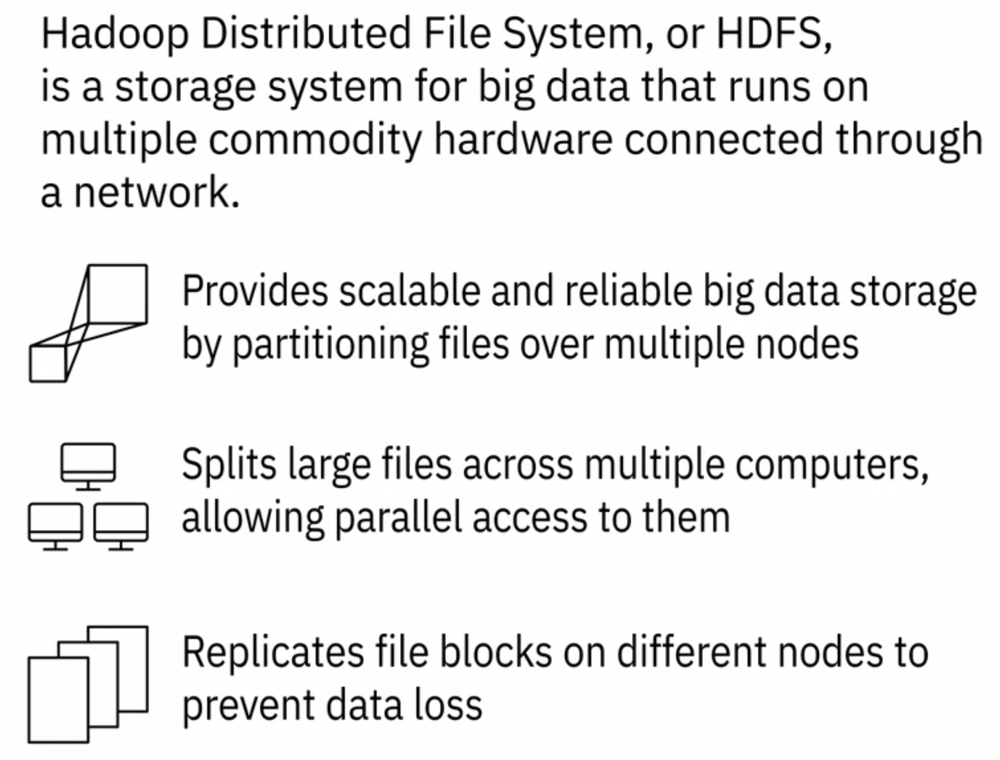

---
해당 포스트는 코세라의 IBM Data Engineering 코스를 한글로 다시 정리한 내용입니다.

---

## Foundations of BigData

### 빅데이터의 정의

빅데이터는 사람, 도구, 기계에 의해 생성되는 동적이고 대용량의 데이터 볼륨들을 의미한다. 소비자, 위험, 이익, 성과, 생산성 관리 및 주주 가치와 관련된 비즈니스 인사이트를 얻기 위해서는 방대한 양의 데이터를 실시간으로 수집 및 분석할 수 있는 기술이 필요하다. 

빅데이터에 대한 정의는 다양하지만, 이런 다양한 정의에 걸쳐 공통되는 특정 요소들이 존재한다. 이것들을 빅데이터의 "V"라고 표현한다. 빅데이터의 V들은 다음과 같다.

출처 - https://medium.com/analytics-vidhya/the-5-vs-of-big-data-2758bfcc51d

1. Velocity(속도)
   * Velocity는 데이터가 축적되는 속도다
   * 데이터는 굉장히 빠른 속도로 생성되고 있고 실시간 스트리밍, 로컬 및 클라우드 기반 기술들은 정보를 매우 빠르게 처리할 수 있다
2. Volume(부피)
   * Volume은 데이터의 규모 또는 저장된 데이터양의 증가이다
   * 데이터 소스의 증가, 고해상도 센서 및 확장 가능한 인프라의 증가 등이 볼륨이 중요한 원인이다
3. Variety(다양성)
   * Variety는 데이터의 다양성이다
   * 정형 데이터, 비정형 데이터, 반정형 데이터 처럼 다양한 형식을 가진 데이터가 존재한다
   * 데이터는 기계, 사람, 프로세스 등 처럼 다양한 소스로 부터 나온다
4. Veracity(정확성)
   * Veracity는 데이터의 품질과 출처, 그리고 데이터의 정확성 그리고 사실과의 일치성 등을 말한다
   * 속성에는 일관성, 완전성, 무결성 및 모호성이 포함된다
   * 많은 양의 데이터 속에 무엇이 진실인지 찾는 것이 중요하다
   * 비용과 추적 가능성도 중요 요소이다
5. Value(가치)
   * Value는 데이터를 가치로 바꾸는 것이다
   * 단순한 이익만을 의미하는 것이 아니라 사회적이나 의료적인 혜택 부터 시작해서 고객, 직원 또는 개인의 만족까지 포함할 수 있다

(빅데이터의 V에 대한 내용을 찾아보면 다양하게 정의되는 것 같다, 정답을 알아야겠다 보다는 느낌을 알아가려고 하자)

이런 빅데이터를 이용하기 위해서는 알맞는 도구를 사용해야한다. 오늘날 데이터 분석가나 과학자는 이러한 빅데이터에서 인사이트를 얻어내기 위해 노력한다. 그러나 수집되는 데이터의 규모로 인해 기존 데이터 분석 도구를 사용는 것은 불가능하다. 이런 문제를 해결하기 위해 분산 컴퓨팅 성능을 활용하는 Apache Spark나 Hadoop 같은 도구들을 사용한다. 

다음은 이런 빅데이터를 처리하기 위한 다양한 도구에 대한 소개다.

---

## Big Data Processing Tools

### 빅데이터 처리 도구들

세 가지 오픈소스 기술인 Apache Hadoop, Apache Hive, Apache Spark에 대해 알아보자.

---

## Hadoop

하둡은 빅데이터의 분산 저장 및 처리에 대한 도구를 제공해준다

> The Apache Hadoop software library is a framework that allows for the distributed processing of large data sets across clusters of computers using simple programming models. It is designed to scale up from single servers to thousands of machines, each offering local computation and storage. Rather than rely on hardware to deliver high-availability, the library itself is designed to detect and handle failures at the application layer, so delivering a highly-available service on top of a cluster of computers, each of which may be prone to failures.

* Java 기반 오픈소스 프레임워크
* 컴퓨터 클러스터 전반에 걸쳐 대규모 데이터 세트를 분산 저장하고 처리할 수 있다
* 하둡 분산 시스템에서 노드(node)는 단일 컴퓨터이고 노드의 집합을 클러스터(cluster)라고 한다
* 단일 노드에서 원하는 수의 노드로 확장할 수 있으며 각 노드는 로컬 스토리지와 연산을 지원한다
* 형식에 대한 요구사항 없이 데이터를 저장할 수 있는 확장 가능하며 비용 효율적인 솔루션을 제공한다

하둡을 이용하면 다음과 같은 일들을 할 수 있다.

* 스트리밍 오디오, 비디오, 소셜 미디어 감정(social media sentiment), 클릭 스트림 데이터 등과 같은 데이터를 데이터 웨어하우스에서 다른 데이터(정형, 반정형, 비정형 데이터들)들과 통합한다
* 모든 이해 관계자들에게 실시간 self-service 액세스를 제공한다
* 자주 사용하지 않는 콜드 데이터를 하둡 기반 시스템으로 이동시켜서 엔터프라이즈 데이터 웨어하우스의 비용을 최적화한다

하둡의 주요 네 가지 요소 중 하나는 HDFS(Hadoop Distributed File System)이다. HDFS는 네트워크를 통해 연결된 여러 상용 하드웨어에서 실행되는 빅데이터용 스토리지 시스템이다. 

* HDFS는 파일들을 여러 노드로 [파티셔닝(partitioning)](https://www.cockroachlabs.com/blog/what-is-data-partitioning-and-how-to-do-it-right/)하여 확장 가능하고 안정적인 빅데이터 스토리지를 제공한다
* 대용량 파일들을 여러 컴퓨터에 분할하여 병렬 액세스를 허용한다. 따라서 계산은 데이터가 저장되는 각 노드에서 병렬로 실행될 수 있다
* 데이터 손실을 방지하기 위해 여러 노드에 파일 블록을 복제하여 **내결함성(fault-tolerant)**을 제공한다.
  * **내결함성**이라는 것은 하나 이상의 구성 요소에 결함이나 고장이 발생해도 시스템이 정상적 혹은 부분적으로 기능을 수행할 수 있는 시스템을 말한다 (장애 허용 시스템)

출처 - https://www.coursera.org/learn/introduction-to-data-engineering

예시를 통해 한번 알아보자. 미국에 있는 모든 사람의 전화번호가 포함된 파일이 있다고 가정해보자. 성이 A로 시작하는 사람의 번호는 서버 1에 저장되고 B는 서버 2에 저장 될 수 있다. Hadoop을 사용하면 이 전화번호부의 일부가 클러스터 전체에 저장된다. 전체 전화번호를 재구성하기 위해서는 클러스터에 있는 모든 서버의 블록이 필요하다. HDFS는 이러한 작은 조각들을 두 개의 추가 서버에 복제해서 서버에 장애가 발생할 경우 가용성(availability)을 보장한다. 이는 더 높은 가용성 외에도, 여러가지 이점을 제공한다. 가령 Hadoop 클러스터가 작업을  더 작은 덩어리(chunk)로 나누고 확장성을 위해 클러스터의 모든 서버에서 해당 작업을 실행할 수 있게한다. 마지막으로 데이터가 있는 노드에 가깝게 연산을 이동시켜주는 데이터 지역성(data locality)의 이점을 얻을 수 있다. 이는 네드워크 정체를 최소화하고 처리량을 증가시키므로 대규모 데이터 세트로 작업할 때 매우 중요하다.

---

## Hive

Hive는 HDFS 또는 Apache HBase와 같은 데이터 스토리지 시스템에 직접 저장되는 대규모 데이터 세트 파일을 읽고, 쓰고, 관리하기 위한 오픈소스 데이터 웨어하우스 소프트웨어다. 

* Hadoop은 긴 sequential scan을 위해 고안되었으며 Hive는 Hadoop을 기반으로 하기 때문에 쿼리의 지연 시간이 매우 높다(high latency)
* Hive는 그래서 매우 빠른 응답 시간이 필요한 애플리케이션에는 적합하지 않다
* Hive는 읽기 기반이기 때문에 쓰기 작업의 비율이 높은 트랜잭션 처리에 적합하지 않다
* Hive는 ETL, 보고, 데이터 분석과 같은 데이터 웨어하우징 작업에 더 적합하며 SQL을 통해 데이터에 쉽게 액세스 할 수 있는 도구들을 제공하고 있다

---

## Spark

Spark는 대화형 분석, 스트림 프로세싱, 기계학습, 데이터 통합 및 ETL을 포함한 애플리케이션의 데이터를 추출하고 처리하도록 설계된 범용 데이터 처리 엔진이다.

> Apache Spark takes advantage of in-memory processing to significantly increase the speed of computations and spilling to disk only when memory is constrained. Spark has interfaces for major programming languages, including Java, Scala, Python, R, and SQL. It can run using its standalone clustering technology as well as on top of other infrastructures such as Hadoop. And it can access data in a large variety of data sources, including HDFS and Hive, making it highly versatile. The ability to process streaming data fast and perform complex analytics in real-time is the key use case for Apache Spark.

## Further Reading

---

1. [https://cloud.google.com/learn/what-is-big-data](https://cloud.google.com/learn/what-is-big-data)
1. Hadoop - Map Reduce, Zookeeper

## 참고

---

1. [Coursera - IBM Introduction to Data Engineering](https://www.coursera.org/learn/introduction-to-data-engineering)
1. [https://medium.com/analytics-vidhya/the-5-vs-of-big-data-2758bfcc51d](https://medium.com/analytics-vidhya/the-5-vs-of-big-data-2758bfcc51d)
1. [https://hadoop.apache.org/](https://hadoop.apache.org/)
1. [https://www.cockroachlabs.com/blog/what-is-data-partitioning-and-how-to-do-it-right/](https://www.cockroachlabs.com/blog/what-is-data-partitioning-and-how-to-do-it-right/)