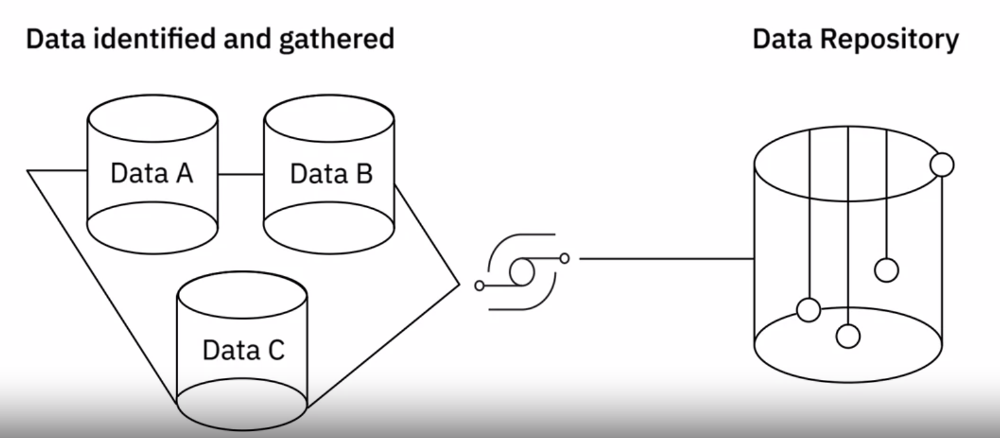

---
해당 포스트는 코세라의 IBM Data Engineering 코스를 한글로 다시 정리한 내용입니다.

---

## Data Collection

### 데이터 수집

데이터 수집을 위한 방법들을 살펴보자.

1. SQL for Relational Databases
   * SQL은 관계형 데이터베이스에서 정보를 추출하는 강력한 도구다
   * 사용자는 SQL을 통해 검색할 데이터, 레코드를 그룹할 방법, 표시의 순서 등을 제어할 수 있다
2. Non-Relational Databases
   * 비관계형 데이터베이스는 SQL 또는 SQL과 유사한 쿼리 도구를 사용해서 쿼리 할 수 있다
   * Cassandra, Neo4J 같은 일부 제품에서는 자체 쿼리 도구가 제공된다
3. API
   * API는 다양한 소스에서 데이터를 추출하는데 사용할 수 있다
   * 애플리케이션으로 부터 호출해서 데이터베이스, 웹서비스 및 데이터 마켓 플레이스를 포함한 데이터 엔드포인트에 접근하기위해 사용할 수 있다
   * API는 데이터 유효성(data validation) 검사에도 사용할 수 있다
4. Web Scraping
   * 웹 스크래핑은 정의된 기준이나 파라미터를 기반으로 웹 페이즈에서 특정 데이터를 추출하는데 사용한다
   * 웹 페이즈로 부터 텍스트, 이미지, 비디오 등 여러가지 데이터를 추출하는데 사용할 수 있다
5. RSS Feed
   * RSS 피드는 정보가 지속적으로 업데이트되는 온라인 포럼 및 뉴스 사이트에서 업데이트된 데이터를 얻는데 유용한 소스이다
   * (소셜 미디어의 급부상이나 이메일 구독 같은 요소들로 인해 인기가 식긴했지만, 아직 여러가지 RSS 소스로 부터 정보를 얻는 경우가 존재한다)
6. Data Streams
   * 데이터 스트림은 IoT 기기, 소셜 미디어 플랫폼, 자동차의 GPS 데이터 등 가양한 소스에서 지속적인 데이터 흐름을 집계하는데 사용된다
7. Data Exchange Platforms
   * 공급자와 소비자 같의 안전한 데이터 교환이 일어난다
   * 표준, 프로토콜, 보안 조치 등을 유지하기 때문에 데이터 공유를 위한 안정적인 옵션이 될 수 있다
     * 데이터 교환 플랫폼들은 데이터의 보안 및 거버넌스가 유지되도록 보장한다
   * 데이터 라이센싱 워크플로우, 개인정보 비식별화 및 보호, 격리된 분석 환경 등을 제공한다(예시를 좀 찾아 봐야겠다)
   * 인기있는 플랫폼으로는 AWS Data Exchange, Crunchbase, Lotame, Snowflake 등이 있다

출처 - https://www.coursera.org/learn/introduction-to-data-engineering

다양한 소스에서 데이터를 수집한 다음은 이를 데이터 저장소로 가져오는 것이다. 데이터를 가져오는 프로세스에는 다양한 소스의 데이터를 결합하여 데이터를 쿼리하고 조작할 수 있는 결합된 뷰와 단일 인터페이스를 제공하는 작업이 포함된다. 데이터를 가져오기 위한 도구와 방법의 선택은 데이터의 유형, 볼륨 및 대상 저장소에 따라 다르다. 

---

## Data Wrangling

### 데이터 랭글링

**데이터 랭글링(wrangling)** 또는 **먼징(munging)**은 원시 데이터(raw data)의 분석 준비를 위해서 **일련의 탐색, 변환, 검증을 포함하는 반복적인 프로세스**이다. 이 프로세스에는 다양한 변형과 데이터 클리닝 작업들이 포함된다. (Data Wrangling, Data Munging, Data Remediation 등으로 불린다)

데이터 분석을 하는 시나리오에서 데이터가 겪는 주요 변환들을 살펴보자.

1. Structuring
   * 데이터의 형식과 스키마를 변경하는 작업
     * 들어오는 데이터는 다양한 형식일 수 있음
     * 예를 들면 일부 데이터는 관계형 데이터베이스에서 가져오고 일부 데이터는 웹 API에서 가져올 수 있음
     * 이를 병합하기 위해서는 데이터의 형식과 스키마를 변경해야함
     * 조인, 유니온 등..
2. Normalization
   * 정규화는 사용되지 ㅇ낳는 데이터의 데이터베이스를 정리하고 중복성과 불일치를 줄이는데 중점을 둔다
     * 예를 들면 다수의 삽입, 업데이트 및 삭제 작업이 지속적으로 수행되는 트랜잭션 시스템에서 들어오는 데이터는 고도로 정규화된다
3. Denormalization
   * 역정규화는 더 빠르게 쿼리할 수 있도록 여러 테이블의 데이터를 단일 테이블로 결합하는데 사용된다
     * 예를 들면 트랜잭션 시스템에서 나오는 정규화된 데이터는 일반적으로 보고 및 분석을 위해 쿼리를 실행하기 전 비정규화 된다
4. Cleaning
   * 데이터 클리닝은 신뢰가능한 정확한 분석을 하기 위해서, 데이터의 불규칙성을 수정하는 작업이다
   * 먼저 데이터세트에 있을 수 있는 다양한 유형의 문제와 오류를 감지해야 한다
     * 스크립트나 도구들을 이용해 데이터에 대한 규칙과 제약을 정하고 그것에 대해 유효성 검사를 진행할 수 있다
     * 데이터 프로파일링이나 시각화 도구를 이용할 수 있다
       * 데이터 프로파일링은 원본데이터를 검사해서 데이터의 구조, 내용, 상호 관계 등을 이해하는데 도움을 줄 수 있다
       * 빈 값, null 값, 중복 데이터, 범위를 벗어난 데이터 등 데이터 어노말리(anomalies)나 퀄리티 이슈를 찾을 수 있다
       * 시각화는 이상값을 찾는데 도움이 될 수 있다
   * 실제로 적용되는 데이터 클리닝은 사용 사례와 발생한 문제 유형에 따라 다르다
   * 누락값 같은 경우, 누락값이 있는 레코드를 필터링하거나 통계값 기반으로 결측값을 계산하는 등 여러가지 방법이 있다
   * 클리닝에는 데이터형 변환이나 이상값(outlier) 수정 등 여러가지 고려할 요소있다

### Tools for Data Wrangling

다음은 데이터 랭글링을 위한 도구들이다.

* Excel Power Query / Spreadsheets
* OpenRefine
* Google DataPrep
* Watson Studio Refinery
* Trifacta Wrangler
* Python, R 과 같은 프로그래밍 언어와 그것들이 지원하는 라이브러리 및 패키지

어떤 도구를 선택할 것인지는 데이터의 크기, 데이터 구조, 인프라, 쉽게 배울 수 있는지 등 여러가지 요인이 있다. 상황에 맞춰서 도구를 고르고 사용하면 된다.

## 참고

---

1. [Coursera - IBM Introduction to Data Engineering](https://www.coursera.org/learn/introduction-to-data-engineering)
2. [https://www.coursera.org/articles/data-wrangling](https://www.coursera.org/articles/data-wrangling)
