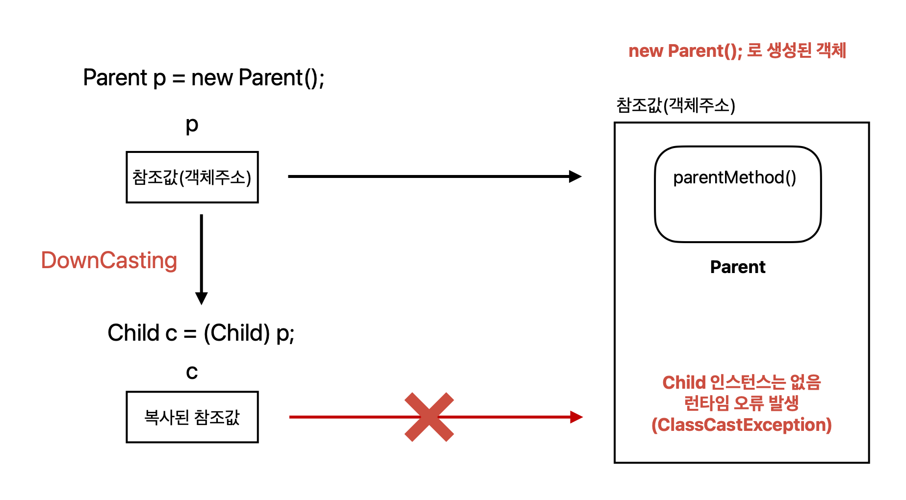
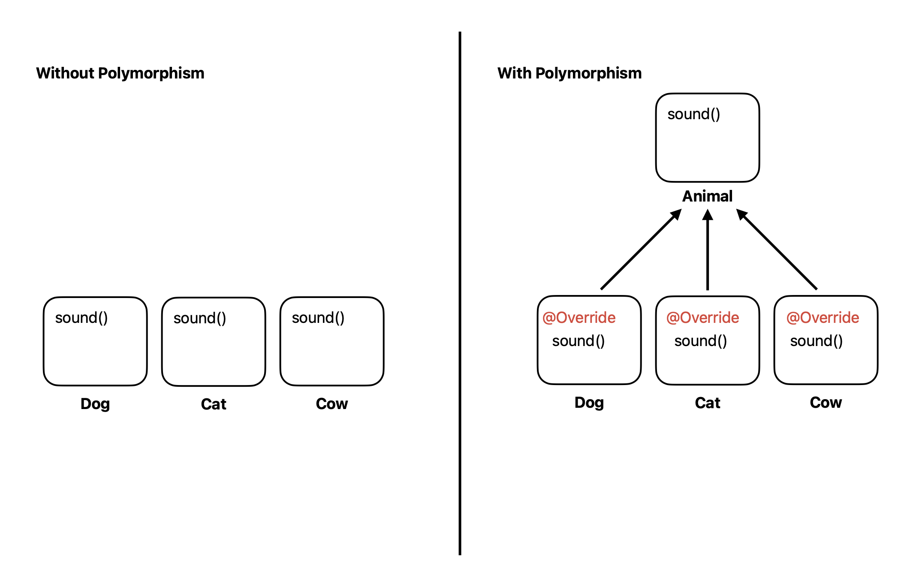
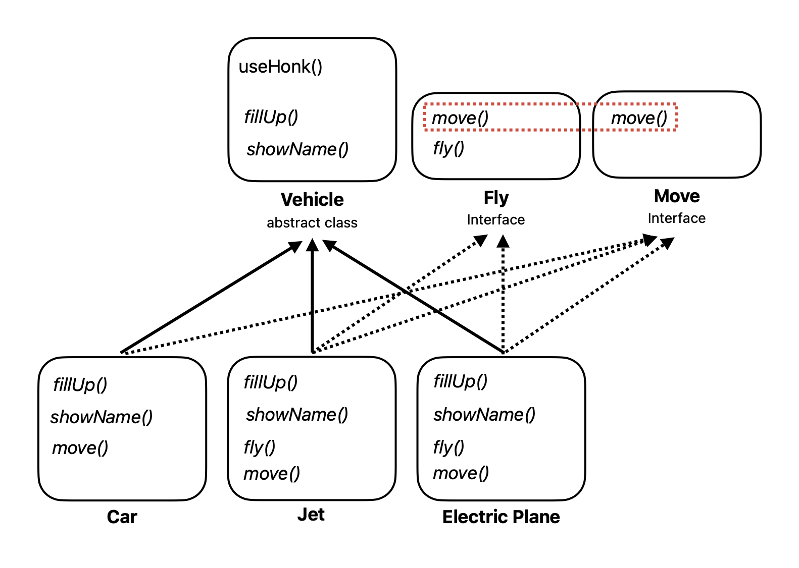

---

## 1. 다형성(Polymorphism)

* **다형성은 하나의 참조변수로 여러 타입(클래스)의 객체를 참조할 수 있는 것**
  * 하나의 객체를 다른 타입으로 사용될 수 있음

* **조상타입의 참조변수로 자손타입의 인스턴스를 다룰 수 있는 것이 다형성**이라고 볼 수 있음
* **자식 타입은 부모 타입 참조 불가** (자식 그릇에 부모를 담을 수 없는 걸로 이해하면 편함)

<br>

```java
public class Parent {
  
    private String color = "Yellow";
  
    public void parentMethod() {
        System.out.println("called parentMethod");
    }
}
```

<br>

```java
public class Child extends Parent{
    public void childMethod() {
        System.out.println("called childMethod");
    }
}
```

<br>

```java
public class PolyMain1 {
    public static void main(String[] args) {
      
        // 1. Parent 변수가 Parent 인스턴스 참조 (부모 -> 부모)
        System.out.println("1. Parent(p1)가 Parent 참조");
        Parent p1 = new Parent();
        System.out.print("p1.parentMethod() 실행 : ");
        p1.parentMethod();
        System.out.println("------------------------");
      
        // 2. Child 변수가 Child 인스턴스 참조 (자식 -> 자식)
        System.out.println("2. Child(c1)가 Child 참조");
        Child c1 = new Child();
        System.out.print("c1.childMethod() 실행 : ");
        c1.childMethod();
        System.out.print("c1.parentMethod() 실행 : ");
        c1.parentMethod();
        System.out.println("------------------------");
      
        // 3. Parent 변수가 Child 인스턴스 참조 (부모 -> 자식) (다형적 참조)
        System.out.println("3. Parent(p2)가 Child 참조");
        Parent p2 = new Child();
        System.out.print("p2.parentMethod() 실행 : ");
        p2.parentMethod();
        // p2는 Child 타입을 참조해도 Parent 타입이기 때문에 Parent 클래스의 메서드만 알고 있음
        // childMethod()를 실행시키고 싶은 경우 casting을 이용
        // p2.childMethod();
    }
}
```

```
1. Parent(p1)가 Parent 참조
p1.parentMethod() 실행 : called parentMethod
------------------------
2. Child(c1)가 Child 참조
c1.childMethod() 실행 : called childMethod
c1.parentMethod() 실행 : called parentMethod
------------------------
3. Parent(p2)가 Child 참조
p2.parentMethod() 실행 : called parentMethod
```

* ```Parent p2 = new Child();``` 처럼 부모 타입이 자식 타입을 참조하는 경우라도 ```p2.childMethod()```로 자식 타입의 메서드를 호출하는 것은 불가능
* ```p2```는 일단 ```Parent```타입이기 때문에 자식에 대한 정보 x

<br>

---

## 2. 형변환(Casting)

### 다운 캐스팅(Downcasting)

* 다운캐스팅
* 자식 타입으로 변환

```java
Parent p = new Child();
Child c = (Child) p;
c.childMethod();  
```

* 부모 타입이 자식 타입의 기능을 사용하기 위해서 위와 같이 다운캐스팅 결과를 변수에 담아두고 이후에 기능을 사용하면 됨

<br>

```java
public class CastMain1 {
    public static void main(String[] args) {
      
        // Parent가 Child 참조 (부모 -> 자식)
        Parent p3 = new Child();
        // 자식 타입을 참조하더라도 자식의 메서드 호출은 불가
        // p3.childMethod();

        // 다운캐스팅으로 사용 가능
        Child c2 = (Child) p3;
        c2.childMethod(); // Child의 메서드 호출 가능
        c2.parentMethod();
    }
}
```

```
called childMethod
called parentMethod
```

<br>

---

#### 일시적 다운캐스팅(Temporary Downcasting)

* 다운캐스팅 결과를 변수에 담아두는 과정 없이 일시적으로 다운캐스팅을 해서 인스턴스의 하위 계층 클래스의 기능을 사용 가능

<br>

```java
public class TempCastMain1 {
    public static void main(String[] args) {
      
        Parent p4 = new Child();

        // 1. 기존 다운캐스팅
        Child c3 = (Child) p4;
        c3.childMethod();

        // 2. 일시적 다운캐스팅
        ((Child) p4).childMethod(); // p4를 Child 타입으로 일시 다운캐스팅
    }
}
```

* 임시적으로 ```p4```의 타입을 ```Parent```에서 ```Child```로 변경
  * ```Child``` 클래스의 기능을 바로 호출 가능
* 이 과정에서 ```p4``` 타입 자체가 ```Child```로 변경되는 것은 아님
  * ```p4```의 참조값을 복사후, 복사한 참조값이 ```Child``` 타입이 됨

<br>

---

#### 다운 캐스팅시 주의할 점

* 업캐스팅과 달리 다운캐스팅은 무조건 명시적으로 캐스팅을 해야하는 이유
  * 업캐스팅과 달리 안전하기 않기 때문!


* 다운캐스팅을 잘못하는 경우 런타임(Runtime) 오류 발생 가능

<br>

```java
public class DownCastMain2 {
    public static void main(String[] args) {

        Parent p = new Parent();
        Child c = (Child) p; // 다운 캐스팅 - 런타임 오류 발생
        c.childMethod();

        // 런타입 오류 발생
        // Exception in thread "main" java.lang.ClassCastException: de.java.polymorphism.Parent cannot be cast to de.java.polymorphism.Child
        //	at de.java.polymorphism.DownCastMain2.main(DownCastMain2.java:7)
    }
}
```

```
Exception in thread "main" java.lang.ClassCastException: de.java.polymorphism.Parent cannot be cast to de.java.polymorphism.Child
	at de.java.polymorphism.DownCastMain2.main(DownCastMain2.java:7)
```

* 사용할 수 없는 타입으로 다운캐스팅을 진행하는 경우 ```ClassCastException``` 발생


* 다운캐스팅이 업캐스팅 보다 위험한 이유는 업캐스팅에서 객체 생성시 해당 탑의 상위 부모 타입까지 모두 함께 생성됨([참고](https://github.com/seungki1011/Data-Engineering/tree/main/java/(014)%20Inheritance#3-java-inheritance-memory-allocation))
  * 업캐스팅은 메모리 상에 부모 클래스에 대한 인스턴스가 모두 존재하기 때문에 안전함
  * 다운캐스팅의 경우 인스턴스에 존재하지 않는 하위 타입으로 다운캐스팅하는 겨우 문제 발생 가능 (자식 타입은 생성 되지 않기 때문에)

<br>



* 다운 캐스팅을 안전하게 사용하기 위해서 ```instanceof``` 사용 가능 (인스턴스 타입 확인)

<br>

---

### 업캐스팅(Upcasting)

* 부모 타입으로 변환
* 업캐스팅은 캐스팅 생략 가능

```java
// 1. 캐스팅 생략 x
Child c = new Child();
Parent p = (Parent) c;

// 2. 캐스팅 생략 o
Parent p1 = c;
```

<br>

```java
public class CastMain2 {
    public static void main(String[] args) {
      
        // 1. 업캐스팅 - Parent는 Child를 담을 수 있음
        Child c = new Child();
        Parent p = (Parent) c;

        // 2. 업캐스팅은 캐스팅하는 과정 생략 가능
        Parent p1 = c; // 업캐스팅은 생략 권장

        p.parentMethod(); // Parent의 기능 호출 가능
        p1.parentMethod();
    }
}
```

<br>

---

## 3. instanceof

* **참조변수가 참조하는 인스턴스의 실제 타입을 체크하는데 사용**
* 연산 결과는 ```true``` or ```false```
* 결과가 ```true```인 경우 해당 타입으로 캐스팅(형변환)이 가능하다는 뜻
* 다운캐스팅 전에 ```instanceof```로 체크해서 사용 

<br>

```java
public class InstanceOfMain1 {
    public static void main(String[] args) {
      
        Parent poly1 = new Parent();
        Parent poly2 = new Child();
        Parent poly3 = new GrandChild();
        Child poly4 = new GrandChild();
        Child poly5 = new Child();

        System.out.print("Is poly1 a instance of Child? : "+(poly1 instanceof Child)+"\n");
        call(poly1); // Child 인스턴스 x
        System.out.println("--------------------------");
        System.out.print("Is poly2 a instance of Child? : "+(poly2 instanceof Child)+"\n");
        call(poly2); // Child 인스턴스 o
        System.out.println("--------------------------");
        System.out.print("Is poly3 a instance of Child? : "+(poly3 instanceof Child)+"\n");
        call(poly3); // Child 인스턴스 o
        System.out.println("--------------------------");
        System.out.print("Is poly4 a instance of GrandChild? : "+(poly4 instanceof GrandChild)+"\n");
        call(poly4); // Child 인스턴스 o
        System.out.println("--------------------------");
        System.out.print("Is poly5 a instance of GrandChild? : "+(poly5 instanceof GrandChild)+"\n");
    }

    private static void call(Parent parent) {
        if (parent instanceof Child) {
            System.out.println("It is a instance of Child!");
            // 만약 parent가 Child의 인스턴스가 맞다면 다운캐스팅 가능
            Child child = (Child) parent;
            child.childMethod();
        } else {
            System.out.println("It is not a instance of Child!");
        }
    }
}
```

```
Is poly1 a instance of Child? : false
It is not a instance of Child!
--------------------------
Is poly2 a instance of Child? : true
It is a instance of Child!
called childMethod
--------------------------
Is poly3 a instance of Child? : true
It is a instance of Child!
called childMethod
--------------------------
Is poly4 a instance of GrandChild? : true
It is a instance of Child!
called childMethod
--------------------------
Is poly5 a instance of GrandChild? : false
```

* ```instanceof```를 사용할때 오른쪽의 타입에 왼쪽에 있는 인스턴스 타입이 들어갈 수 있는지 대입해보면 됨
  * 대입이 가능하면 ```true```
  * 불가능하면 ```false```

<br>

```java
public class InstanceOfMain2 {
    public static void main(String[] args) {
      
        Parent p = new Parent();

        System.out.println("p instanceof Child : "+(p instanceof Child));
        System.out.println("new Parent() instanceof Child : "+(new Parent() instanceof Child));

        Child c = new Child();
        Parent p1 = c;

        System.out.println("new Child() instanceof Parent : "+(new Child() instanceof Parent));
        System.out.println("p1 instanceof Parent : "+(p1 instanceof Parent));
        System.out.println("p1 instanceof Child : "+(p1 instanceof Child));
        System.out.println("c instanceof Parent : "+(c instanceof Parent));
    }
}
```

```
p instanceof Child : false
new Parent() instanceof Child : false
new Child() instanceof Parent : true
p1 instanceof Parent : true
p1 instanceof Child : true
c instanceof Parent : true
```

* **자식은 부모를 담을 수 없음**
* 인스턴스가 존재하기 위해서는 해당 인스턴스가 존재 가능하게 하위 클래스의 인스턴스가 선언 되어야 함
  * ```Child```인스턴스가 존재하기 위해서는 ```Child``` 이하 클래스의 객체가 선언 되어야 함 → ```Child``` 이상의 인스턴스 존재

<br>

---

## 4. 메서드 오버라이딩(Method Overriding)

* **오버라이딩 된 메서드가 항상 우선권을 가짐!**

<br>

```java
public class Parent {
  
    public String color = "Yellow";
    public String value = "Parent Value";
  
    public void commonMethod() {
        System.out.println("Parent's commonMethod");
    }
  
    public void parentMethod() {
        System.out.println("called parentMethod");
    }
}
```

<br>

```java
public class Child extends Parent {
  
    public String color = "White";
    public String value = "Child Value";
  
    @Override
    public void commonMethod() {
        System.out.println("Child's commonMethod (Overrided)");
    }
  
    public void childMethod() {
        System.out.println("called childMethod");
    }
}
```

<br>

```java
public class OverridingMain1 {
    public static void main(String[] args) {

        // 1. Parent 변수가 Parent 인스턴스 참조
        Parent parent = new Parent();
        System.out.println("2. Parent -> Parent");
        System.out.println("color = "+parent.color);
        System.out.println("value = "+parent.value);
        parent.commonMethod();
        System.out.println("------------------------");
      
        // 2. Child 변수가 Child 인스턴스 참조
        Child child = new Child();
        System.out.println("1. Child -> Child");
        System.out.println("color = "+child.color);
        System.out.println("value = "+child.value);
        child.commonMethod();
        System.out.println("------------------------");
      
        // 3. Parent 변수가 Child 인스턴스 참조 (다형적 참조)
        Parent poly = new Child();
        System.out.println("3. Parent -> Child");
        System.out.println("color = "+poly.color); // 변수의 경우 오버라이딩 안됨
        System.out.println("value = "+poly.value);
        poly.commonMethod(); // 메서드는 오버라이딩된 Child.commonMethod()가 실행됨
    }
}
```

```
1. Parent -> Parent
color = Yellow
value = Parent Value
Parent's commonMethod
------------------------
2. Child -> Child
color = White
value = Child Value
Child's commonMethod (Overrided)
------------------------
3. Parent -> Child
color = Yellow
value = Parent Value
Child's commonMethod (Overrided)
```

* ```poly```는 ```Parent``` 타입이기 때문에 ```Parent``` 영역에서 ``value``와 ```commonMethod```를 찾아서 실행

  

  * ```poly.value```의 경우 ```Parent```의 ```value``` 값을 읽음 (변수는 오버라이딩 x)

  

  * ```poly.commonMethod()```의 경우 먼저 ```Parent```의 ```commonMethod```를 실행하려고 한다 → 하위 클래스인 ```Child```에서 ```commonMethod```가 오버라이딩 되어 있는 것을 확인 → **오버라이딩 된 메서드가 항상 우선권**을 가지기 때문에 ```Child.commonMethod``` 실행

  

  * 만약 더 하위 계층의 자식 중에서 오버라이딩 된 메서드가 존재한다면 해당 메서드가 우선권을 가진
    * 쉽게 말해서 오버라이딩 된 메서드가 있다면 아래 클래스쪽으로 찾아서 실행

<br>

---

## 5. 다형성의 활용

### 다형성 사용해보기

<br>

```java
public class Animal {
  
    private String name = "Animal";

    public void sound() {
        System.out.println("Generate Animal Sound!");
    }
  
    public void getName() {
        System.out.println("I'm a "+name+"!");
    }
}
```

<br>

```java
public class Dog extends Animal{
  
    private String name = "Dog";

    @Override
    public void sound() {
        System.out.println("Bow wow~");
    }

    @Override
    public void getName() {
        System.out.println("I'm a "+name+"!");
    }
}
```

<br>

```java
public class Cat extends Animal{
  
    private String name = "Cat";

    @Override
    public void sound() {
        System.out.println("Meow~");
    }

    @Override
    public void getName() {
        System.out.println("I'm a "+name+"!");
    }
}
```

<br>

```java
public class UsePolyMain1 {
    public static void main(String[] args) {
      
      	/*
      	Animal dog = New Dog();
      	Animal cat = New Cat();
      	Animal cow = New Cow();
      	*/
      	// 배열로 리펙토링
        Animal[] animalArray = new Animal[] {new Dog(), new Cat(), new Cow()};
      	
      	// 다형성 없이 코드 작성 했다면 각 동물마다 똑같이 반복되는 코드를 작성해서 사용했어야함
      	/*
      	System.out.println("--------Animal Sound Start!--------");
        cat.getName();
        cat.sound();
        System.out.println("---------Animal Sound End!---------");
      	*/
        for (Animal animal : animalArray) {
            makeAnimalSound(animal);
        }
    }

    private static void makeAnimalSound(Animal animal) {
        System.out.println("--------Animal Sound Start!--------");
        animal.getName();
        animal.sound();
        System.out.println("---------Animal Sound End!---------");
    }
}
```

```
--------Animal Sound Start!--------
I'm a Dog!
Bow wow~
---------Animal Sound End!---------
--------Animal Sound Start!--------
I'm a Cat!
Meow~
---------Animal Sound End!---------
--------Animal Sound Start!--------
I'm a Cow!
Moo~
---------Animal Sound End!---------
```

* 다형성을 통해 코드의 재사용성, 유연성, 확장성 등을 챙길 수 있음
  * 새로운 기능, 클래스를 추가해도 변하는 부분을 최소화


* 예를 들어 새롭게 동물을 추가해도 ```makeAnimalSound``` 같은 메서드의 코드를 변경하지 않고 유지할 수 있다

<br>



<br>

---

### 한계

* ```Animal``` 클래스는 ```Cat```, ```Dog``` 클래스와 다르게 직접 생성해서 사용하는 일이 없다고 볼 수 있다
  * 한 마디로 ```Animal```클래스는 다형성을 위해서 하위 클래스(```Cat```, ```Dog```)가 상속 받을 수 있도록 만든 클래스로 볼 수 있음


* 또한 ```Cat```이나 ```Dog``` 클래스와 같은 하위 클래스에서 ```sound()```나 ```getName()```과 같은 메서드를 오버라이딩 하지 않으면 의도한대로 기능이 동작하지 않을 가능성이 있다
  * 실수로 오버라이딩을 하지 않으면 문제가 발생


* 위의 문제를 해결하기 위해서 추상 클래스(Abstract Class)를 도입

<br>

---

## 6. 추상 클래스(Abstract Class)

* **추상 클래스는 추상적인 개념을 제공하는 클래스**
  * 예시 : 위의 `Animal` 클래스와 같은 경우

* 추상 클래스는 보통 상속을 목적으로 사용 됨 (부모 클래스 담당)
* **추상 클래스는 인스턴스 생성 불가**

* **추상 클래스는 추상 메서드를 포함하고 있는 클래스**
  * 추상 메서드
    * 선언부만 있고 구현부(body)가 없는 메서드
    * 부모 클래스를 **상속 받는 자식 클래스가 반드시(강제) 오버라이딩 해야 하는 메서드**를 부모 클래스에 정의 가능
    * 메서드 앞에 `abstract` 키워드 붙인다
  * 추상 메서드가 하나라도 존재한다면 추상 클래스로 선언해야함
    * 클래스 앞에 `abstract` 키워드 
  * **만약에 자식 클래스에서 추상 메서드를 오버라이딩 하지 않을 경우 자식 메서드도 추상 클래스이여야 함**

* 다른 클래스를 작성하는데 도움을 줄 목적으로 작성된다

<br>

```java
public abstract class Animal { // 추상 클래스는 abstract

    // 1. 추상 메서드는 상속 받는 자식에서 override으로 구현
    public abstract void makeSound(); // 추상 메서드는 구현 x

    // 2. 추상 메서드가 아니면 그냥 상속 받아서 사용 가능
    public void move() {
        System.out.println("Currently moving!");
    }
}
```

<br>

```java
public class Dog extends Animal {
  
    private String name = "Dog";

    @Override
    public void makeSound() { System.out.println("Bow Wow~"); }

    // 추상 메서드가 아니어도 오버라이드하는 경우
    @Override
    public void move() {
        System.out.println("Dog is moving! (Overrided)");
    }
}
```

<br>

```java
public class Pig extends Animal {
  
    private String name = "Pig";
  
    // 추상 클래스에서 정의한 추상 메서드는 무조건 오버라이드해서 구현해야 함
    @Override
    public void makeSound() {
        System.out.println("Oink~");
    }
}
```

<br>

```java
public class AbstractMain1 {
    public static void main(String[] args) {

        Animal[] animalArray = new Animal[] {new Dog(), new Cat(), new Pig()};

        for (Animal animal : animalArray) {
            makeAnimalSound(animal);
        }
    }

    private static void makeAnimalSound(Animal animal) {
        System.out.println("--------Animal Sound Start!--------");
        animal.move();
        animal.makeSound();
        System.out.println("---------Animal Sound End!---------");
    }
}
```

```
--------Animal Sound Start!--------
Dog is moving! (Overrided)
Bow Wow~
---------Animal Sound End!---------
--------Animal Sound Start!--------
Currently moving!
Meow~
---------Animal Sound End!---------
--------Animal Sound Start!--------
Currently moving!
Oink~
---------Animal Sound End!---------
```

* 추상 클래스를 통해 제약을 추가 (추상 메서드)
* 순수하게 추상 메서드로만 이루어진 클래스를 구현 → 경우에 따라 다를 수 있지만 인터페이스를 이용해서 구현

<br>

---

## 7. 인터페이스(Interface)

### 인터페이스 소개

* ```class``` 대신 ```interface``` 키워드 사용
* 인터페이스의 모든 메서드는 자동으로 ```public abstract```가 붙는다

* 인터페이스의 모든 멤버 변수는 자동으로 ```public```, ```static```, ```final```이 붙는다
  * 상수만 정의 가능

* Java8 부터 ```default``` 메서드를 사용해서 인터페이스에도 메서드 구현이 가능 함 (아주 예외적인 상황)
* 순수하게 추상 메서드만으로 이루어짐

* 실제 구현된 것이 전혀 없는 설계도
  * 미리 정해진 규칙에 맞게 구현하도록 표준을 제시하는데 사용됨 (규격 제공)

* 인터페이스를 상속 받는 것이 아니라 인터페이스를 구현하는 것으로 표현한다
* 인터페이스를 구현할 때는 ```extends```가 아닌 ```implements```를 사용 
* 추상 메서드와 상수만을 멤버로 가질 수 있음
* 인스턴스를 생성할 수 없고, 클래스 작성에 도움을 줄 목적으로 사용된다
* 인터페이스의 다중 구현 가능
* 다형성을 위해서 사용된다

<br>

> 인터페이스를 사용하는 이유
>
> * 제약을 통해서 규격 제공
> * 다형성을 위해서 사용
> * 인터페이스의 다중 구현 (클래스에서는 불가능했던 다중 상속)
{: .prompt-tip }

<br>

---

### 인터페이스를 통한 다중구현

* 기존 클래스의 다중 상속에서는 어느 부모의 메서드를 사용해야할지 결정 못하는 다이아몬드 문제가 발생

* 인터페이스는 부모의 메서드는 구현되지 않고 오로지 자식에서 오버라이딩 해서 구현하기 때문에 다이아몬드 문제가 발생하지 않는다

* ```implements InterfaceA, InterfaceB``` 처럼 다중 구현 사용
  * 공통된 메서드는 하나만 오버라이딩 하면 됨

<br>

```java
public abstract class Vehicle{
    // 추상 메서드
    public abstract void fillUp();
    public abstract void showName();

    // 일반 메서드
    public void useHonk() {
        System.out.println("Used Honk! Bing Bong~");
    }
}
```

<br>

```java
public interface Move { // 인터페이스는 class 대신 interface 사용
    void move(); // 모든 메서드에 public abstract가 자동으로 붙음
}
```

<br>

```java
public interface Fly {
    void move(); // 같은 메서드가 Move 인터페이스에도 존재, 다중 구현시 move()는 하나만 구현해도 됨
    void fly(); /
}
```

<br>

```java
public class Car extends Vehicle implements Move{ // Move 인터페이스 구현
  
    // Vehicle 클래스(부모 클래스)의 추상 메서드 구현(오버라이드)
    @Override
    public void fillUp() {
        System.out.println("Filled up gas.");
    }
  
    @Override
    public void showName() {
        System.out.println("This is a Car.");
    }

    // Move 인터페이스의 추상 메서드 구현
    @Override
    public void move() {
        System.out.println("The car is moving!");
    }
}
```

<br>

```java
public class Jet extends Vehicle implements Fly, Move{ // Fly, Move 인터페이스 다중 구현
  
    @Override
    public void fillUp() {
        System.out.println("Filled up jet fuel.");
    }
  
    @Override
    public void showName() {
        System.out.println("This is a Jet.");
    }

    // 다중 구현으로 두 인터페이스 모두 구현
    @Override
    public void fly() {
        System.out.println("Jet will start to fly.");
    }
  
    @Override
    public void move() {
        System.out.println("The jet is moving.");
    }
}
```

<br>

```java
public class ElectricPlane extends Vehicle implements Fly, Move{
  
    @Override
    public void fillUp() {
        System.out.println("Charging battery.");
    }
  
    @Override
    public void showName() {
        System.out.println("This is a Electric Plane");
    }

    @Override
    public void fly() {
        System.out.println("The electric plane will start to fly.");
    }
  
    @Override
    public void move() {
        System.out.println("The electric plane is moving.");
    }
}
```

<br>

```java
public class InterfaceMain1 {
    public static void main(String[] args) {
      
        Vehicle[] vehicleArray = {new Car(), new ElectricPlane(), new Jet()};
      
        for (Vehicle vehicle : vehicleArray) {
            action(vehicle);
            if (vehicle instanceof Fly) {
                startFly((Fly) vehicle);
            }
            if (vehicle instanceof Move) {
                startMove((Move) vehicle);
            }
            vehicle.useHonk();
        }
    }

    private static void action(Vehicle vehicle) {
        System.out.println("--------Start Action--------");
        vehicle.showName();
        vehicle.fillUp();
    }
  
    private static void startFly(Fly fly) {
        fly.fly();
    }
  
    private static void startMove(Move move) {
        move.move();
    }
}
```

```
--------Start Action--------
This is a Car.
Filled up gas.
The car is moving!
Used Honk! Bing Bong~
--------Start Action--------
This is a Electric Plane
Charging battery.
The electric plane will start to fly.
The electric plane is moving.
Used Honk! Bing Bong~
--------Start Action--------
This is a Jet.
Filled up jet fuel.
Jet will start to fly.
The jet is moving.
Used Honk! Bing Bong~
```

* ```extends```와 ```implements```를 함께 사용하는 경우 ```extends```먼저 

<br>



* 다중 구현에서 다이아몬드 문제는 발생하지 않는다
  * ```Fly```, ```Move``` 인터페이스에 둘다 추상 메서드 ```move```가 존재하지만 두 인터페이스 다중 구현시 ```move```는 하나만 구현하기 때문에 메서드 선택이 문제인 다이아몬드 문제는 존재하지 않음

<br>

