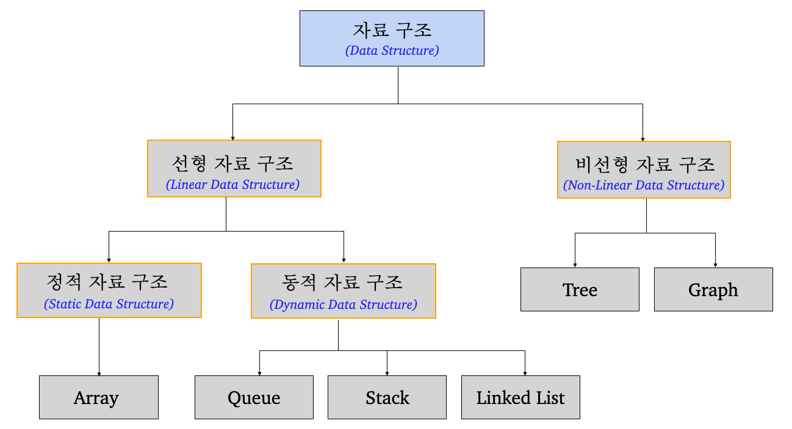
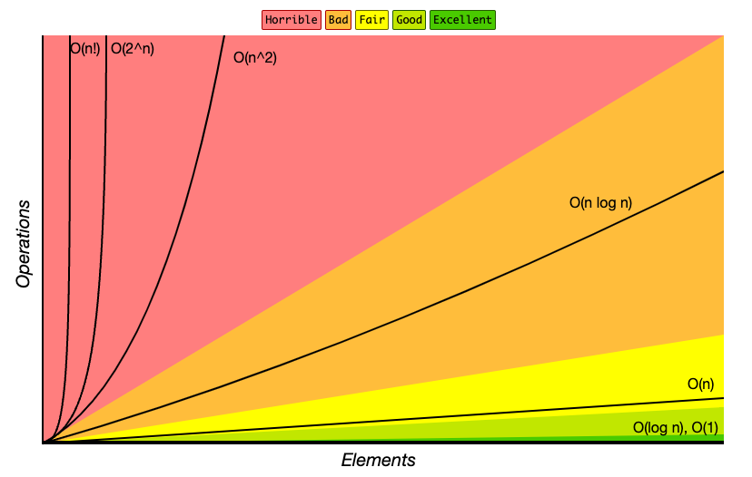
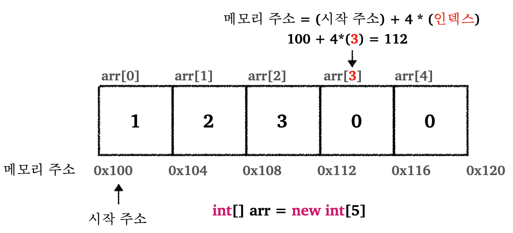

---

## 1) 자료구조(Data Structure) 

### 1.1 자료구조란?

자료구조(data structure)란, 데이터에 대한 효율적인 접근 및 수정을 가능케 하는 데이터의 조직, 관리, 저장을 의미한다. 더 쉽게 이야기 하자면, 자료구조는 데이터 값의 모임, 관계 그리고 데이터에 적용할 수 있는 함수를 망라하는 개념이라고 생각하면 된다.

상황에 맞게 자료구조를 이용하면 보다 효율적으로 알고리즘을 적용할 수 있다. 여기서 효율적이라는 뜻은, 더 적은 실행시간 혹은 더 적은 메모리 용량을 뜻한다.

 <br>



<p align='center'>자료 구조의 종류</p>

* 위 표에 나타난 자료구조 외에도 다양한 자료구조들이 존재한다

<br>

---

### 1.2 Big-O 표기

#### 1.2.1 Big-O 설명

**Big-O 표기법**은 알고리즘의 성능(효율성)을 분석할 때 사용하는 수학적 표현 방식이다.

<br>

> **위키피디아 Big-O**
>
> “빅 오 표기법은 인자가 특정한 값이나 무한대로 향할 때 함수의 극한적인 동작을 설명하는 수학적인 표기법입니다. 이것은 폴 바흐만, 에드문드 란다우 등이 고안한 기호 체계 중 하나로, 박만-란다우 표기법 또는 점근적 표기법이라고 불리는 체계에 속합니다.”
{: .prompt-info }

<br>

쉽게 이야기 하자면 알고리즘이 처리할 데이터가 무한히 많아질때, 해당 알고리즘이 얼마나 빠르게 실행되는지 나타내는 표기법이라고 볼 수 있다. 이때, 실제 해당 알고리즘이 실행하는데 걸리는 시간을 계산하는 것이 아니라, 데이터를 증가 시킬때 해당 알고리즘의 성능 변화의 추세를 파악하는 것이 중요하다.

<br>

> 위의 설명만 보아서는 Big-O 표기법을 단순히 알고리즘의 실행시간 분석을 위한 표현방식으로 이해할 수 있는데, 그렇지 않다.
>
> 알고리즘의 성능은 복잡도라는 척도로 파악하는데, 복잡도는 다음 두 가지로 나눌 수 있다.
>
> * 시간 복잡도(Time Complexity) : 특정 크기의 입력에 따른 필요한 연산의 횟수
>   * 예) 중첩 루프(nested loop)는 $O(n^2)$
>
> 
>
> * 공간 복잡도(Space Complexity) : 알고리즘 실행에 필요한 공간(메모리)
>   * 예) 2차원 배열(2D array)은 $O(n^2)$ 
>
> <br>
>
> 많은 경우 알고리즘의 성능을 파악할 때 시간 복잡도를 기준으로 파악한다. (그렇다고 공간 복잡도를 몰라도 된다는 것은 아니다! 아무리 메모리가 저렴해졌다고 하지만, 메모리 효율적으로 알고리즘을 적용해야하는 경우가 생길 수 있다.)
{: .prompt-info }

<br>



<p align='center'>Big-O 치트시트 참고 : https://www.bigocheatsheet.com/</p>

* `O(1)` - 상수 시간 : 입력 데이터의 크기에 상관없이 알고리즘의 실행 시간이 일정하다
* `O(n)` - 선형 시간 : 알고리즘의 실행 시간이 입력 데이터의 크기에 비례하여 증가한다
* `O(n^2)` - 제곱 시간 : 알고리즘의 실행 시간이 입력 데이터의 크기의 제곱에 비례하여 증가한다
* `O(logn)` - 로그 시간 : 알고리즘의 실행 시간이 입력 데이터의 크기의 로그에 비례하여 증가한다
* `O(nlogn)` - 선형 로그 시간

<br>

---

#### 1.2.2 Big-O 표기법 특징

빅오 표기법의 표기 방법에 대해 알아보자.

* 빅오 표기법은 별도의 컨텍스트가 없다면 보통 최악의 상황(worst scenario)를 가정해서 표기한다. (물론 상황에 따라 최적, 평균, 최악에 따라 나누어서 표기하는 경우도 존재한다)
  * 배열의 순차 검색에 케이스별 표기
  * 최적 케이스 : 배열의 시작(첫 번째 인덱스)에서 바로 값을 찾음. `O(1)`​로 표기.
  * 평균 케이스 : 보통의 경우 중간 어느 지점에서 값을 찾음. 이런 경우 `O(n/2)`로 표기하는 것이 아니라 `O(n)`​으로 표기.
  * 최악 케이스 : 배열의 가장 끝(마지막 인덱스)에서 값을 찾음. 이런 경우 전체 요소를 순회하기 때문에 `O(n)`으로 표기.


* 빅오 표기법은 매우 큰 데이터를 입력한다고 가정하고, 데이터양 증가에 따른 성능 추세를 파악하기 때문에 상수는 큰 의미를 가지지 않는다
  * 빅오 표기법에서는 상수를 제거한다
  * 예) `O(n+2)`, `O(n/2)`, `O(2n)` 등은 그냥 `O(n)`으로 표기한다

<br>

---

## 2) 배열(`Array`)

### 2.1 배열 설명

제일 기본적인 자료구조 중 하나. 배열(Array)는 같은 종류의 데이터들이 순차적으로 저장되어 있다.

<br>



* 배열의 첫번째 요소의 메모리 주소를 기본 주소, 시작 주소, 시작 참조 등으로 부른다
* **배열은 임의 접근(random access)가 가능하다**
  * 배열의 크기에 상관 없이 인덱스를 알고 있으면 해당 원소로 접근하는데 걸리는 시간은 `O(1)`​이다
* 배열은 메모리 주소가 연속될 것을 요구하기 때문에 배열의 크기를 늘리는 것은 불가능하다
* 배열의 크기를 늘릴 필요가 있다면 크기가 더 큰 새로운 배열을 생성하여 기존 배열의 내용을 복사하거나, 배열의 일부를 새로운 배열과 연결하는 방법, 등이 사용된다

<br>

---

### 2.2 배열 기능 구현

배열에서 다음의 기능을 구현해보자.

* 배열의 첫번째 위치에 요소 밀어 넣기
* 배열의 중간에 특정 인덱스 위치에 요소 넣기
* 배열의 마지막에 요소 넣기

<br>

`ArrayMain`

```java
public class ArrayMain {
    public static void main(String[] args) {

        int[] arr = new int[5];

        arr[0] = 1;
        arr[1] = 2;
        arr[2] = 5;
        // 배열 출력 - [1, 2, 5, 0, 0]
        System.out.println("arr = " + Arrays.toString(arr));

        // 첫 번째 인덱스에 값 밀어 넣기
        addFirst(arr, 99);
        System.out.println("arr = " + Arrays.toString(arr));

        // 마지막 인덱스에 값 넣기
        addLast(arr, 10);
        System.out.println("arr = " + Arrays.toString(arr));

        // 2번 인덱스에 값 넣기
        addAtIndex(arr, 2, 200);
        System.out.println("arr = " + Arrays.toString(arr));
    }
    
    private static void addFirst(int[] arr, int newValue) {
        for (int i = arr.length - 1; i > 0; i--) {
            arr[i] = arr[i - 1];
        }
        arr[0] = newValue;
    }
  
    private static void addLast(int[] arr, int newValue){
        arr[arr.length - 1] = newValue;
    }

    private static void addAtIndex(int[] arr, int index, int newValue) {
        for (int i = arr.length - 1; i > index; i--) {
            arr[i] = arr[i - 1];
        }
        arr[index] = newValue;
    }
}
```

```
arr = [1, 2, 5, 0, 0]
arr = [99, 1, 2, 5, 0]
arr = [99, 1, 2, 5, 10]
arr = [99, 1, 200, 2, 5]
```

* `addAtIndex()` : 배열의 중간에 특정 인덱스 위치에 데이터를 추가
  * 지정한 인덱스에 데이터를 추가하기 위해서는 지정한 인덱스 위치에 공간을 확보해야한다
  * 지정한 인덱스부터 시작해서 데이터를 오른쪽으로 한 칸씩 밀어서 확보한다
  * 해당 인덱스의 공간이 확보되면 데이터 추가


* `addFirst()` : 배열의 앞(0번 인덱스)에 데이터를 추가
  * 앞에 추가하기 위해서는 기존 데이터를 모두 오른쪽으로 한 칸씩 밀어서 공간을 확보해야한다
  * 데이터를 유지하기 위해서 끝(마지막 인덱스)에서 부터 오른쪽으로 밀어야 데이터 유지 가능
  * 앞에 공간이 확보되면 데이터 추가
  * 사실상 `addAtIndex(int[] arr, int index, int newValue)`에서 `index`가 0인 경우


* `addLast()` : 배열의 마지막 위치에 데이터 추가
  * 그냥 마지막 인덱스에 데이터를 바로 넣어주면 된다


<br>

---

### 2.3 배열의 성능과 한계

바로 이전에서 다뤘던 배열에 데이터를 추가할 때의 위치에 따른 성능에 대해 알아보자.

* 배열 첫 번째 위치에 추가
  * 인덱스 조회 : 인덱스를 이용하기 때문에 `O(1)`
  * 공간 확보를 위해 배열 크기(`n`) 만큼 한 칸씩 이동하기 때문에 `O(n)`
  * 총 연산 : `O(n+1)` → `O(n)`


* 배열 중간 특정 인덱스에 추가
  * 인덱스 조회 : `O(1)`​
  * 공간 확보를 위해 중간의 특정 인덱스 부터 오른쪽으로 한 칸씩 이동하기 때문에  `O(n/2)`
  * 총 연산 :  `O(n/2 + 1)` → `O(n)`


* 배열의 마지막 위치에 추가
  * 조회 : `O(1)`
  * 조회하고 데이터 이동 없이 바로 넣으면 되기 때문에 총 연산은 `O(1)`

<br>

배열은 인덱스를 사용하는 경우 굉장히 빠른 속도로 데이터에 접근할 수 있다. 그러나 배열은 크기를 생성 시점에서 정하고, 바꾸지 못한다는 단점이 존재한다. 만약 처음에 너무 작게 배열 공간을 설정하면, 다시 배열을 크게 생성해서 기존 배열을 복사해야하는 일이 생긴다. 그렇다고 처음부터 너무 많은 공간을 확보하면 메모리가 낭비된다.

이런 한계를 극복하기 위해서 동적 자료구조인 리스트(List)가 등장한다.

---

## Reference

1. [인프런: 김영한 실전 자바](https://www.inflearn.com/roadmaps/744)
2. [자료구조 - Data Structures with Python](https://www.youtube.com/watch?v=PIidtIBCjEg&list=PLsMufJgu5933ZkBCHS7bQTx0bncjwi4PK)
3. [쉬운코드 - 데이터 구조](https://www.youtube.com/watch?v=-2YpvLCT5F8&list=PLcXyemr8ZeoR82N8uZuG9xVrFIfdnLd72)

