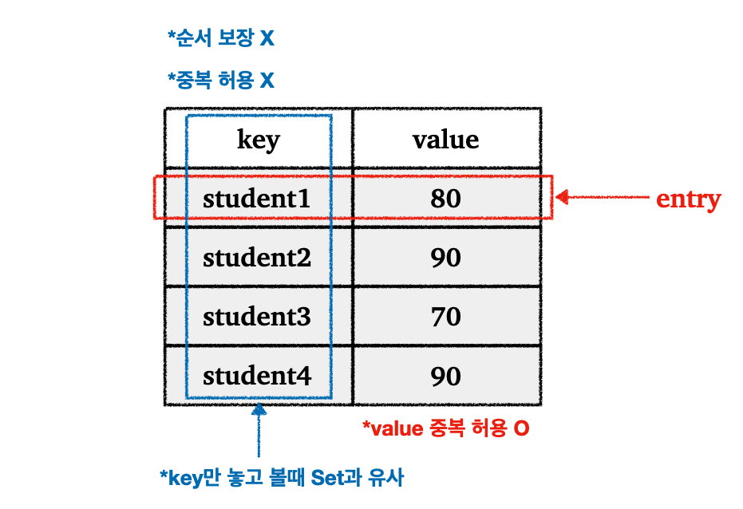

---

## 1) Map

### 1.1 Map 설명

`Map`은 `key-value` 쌍을 저장하는 자료구조이다. 자바에서는 `Map` 인터페이스를 통해 여러 구현 클래스를 제공한다.

맵(`Map`)을 그림을 보면 다음과 같은 모양이다.

<br>



* `Key`는 중복을 허용하지 않는다(유일하다)
* 순서를 보장하지 않는다
* `Value`는 `Key`와 쌍으로 존재하는 값
  * `Value`는 중복되어도 상관 없다
* 하나의 `null Key`와 다수의 `null Value` 허용

<br>

맵의 특징을 살펴보면 `Set` 자료구조와 상당히 비슷한것을 알 수 있다. 맵은 쉽게 생각해서 `Set`의 유일한 요소들에 대해 `Value`가 붙은 형태로 생각하면 편하다. 실제로도 자바에서 `HashSet`의 구현은 `HashMap`의 구현을 가져다 사용한다.(`Map`에 `Value`만 없으면 `Set`처럼 사용 가능)

<br>

---

### 1.2 Map 인터페이스

`Map` 인터페이스는 `HashMap`, `LinkedHashMap`, `TreeMap`, `HashTable`을 제공한다. 참고로 `Map`은 컬렉션 프레임워크가 제공하지 않고, `Iterable` 인터페이스를 구현하지도 않는다. 이에 대한 내용은 나중에 다룰 예정이다.

<br>


바로 이전에서 `Map`은 `Set`에 값이 붙은 형태로, `Set`과 유사하다고 언급했다. 실제로 `Set`와 `Map` 인터페이스의 구현 클래스들을 살펴보면 서로 대응되는 클래스들이 있다는 것을 알 수 있다.

* `HashMap` - `HashSet`
* `LinkedHashSet` - `LinkedHashSet`
* `TreeMap` - `TreeSet`
* `HashTable`의 경우 거의 deprecated 되었고, 대부분 `HashMap`이나 `ConcurrentHashMap`으로 대체되었다

<br>

각 `Map`의 종류에 따른 특징, 성능, 사용 용도를 알아보자.

<br>

1. `HashMap`
   * 해시를 사용해서 요소 저장
   * `Key`는 해시 함수를 통해서 해시 코드로 변환
   * 순서를 보장하지 않는다
   * 동기화 되어있지 않다 (Synchronization X)
     * 싱글 스레드에서 더 좋은 성능을 가진다
     * 멀티 스레드 환경에서는 `ConcurrentHashMap` 사용 권장
   * 성능
     * `HashSet`과 유사하게 중요 작업들은 평균적으로 `O(1)`의 시간복잡도를 가지고, 최악의 경우는 `O(n)`이지만 해시 충돌의 확률은 높지않다

2. `LinkedHashMap`
   * `HashMap`과 유사하지만 `LinkedList`를 사용해서 삽입 순서 또는 최근 접근 순서에 따라 요소의 순서를 유지한다
     * 순서를 보장한다
   * 성능
     * `HashMap`과 유사하다

3. `TreeMap`
   * `TreeSet`과 마찬가지로 Red-Black 트리를 기반으로 구현되어 있다
   * 모든 키는 자연 순서 또는 생성자에 제공된 `Comparator`에 의해 정렬된다
   * 키들은 정렬이 유지된 상태로 저장
   * 성능
     * 추가/삭제/조회 같은 주요 작업들은 `O(logn)`의 시간 복잡도를 가진다

<br>

---

### 1.3 HashMap 원리

`HashMap`의 원리는 이전에 다룬 `HashSet`의 원리와 유사하다. 그림을 통해 알아보자.

<br>


* `Key`를 기준으로 해시코드를 생성한다
* 저장되는 데이터는 `Key-Value` 쌍인 엔트리(entry)
* `HashSet`과 마찬가지로 해시를 이용하기 때문에 `Map`의 `Key`로 사용되는 객체는 `eqauls()`, `hashCode()`를 오버라이딩해야 한다
* 대부분의 경우 맵이 필요한 경우 `HashMap`을 사용한다
  * 만약 순서 유지 또는 정렬 유지가 필요하다면, 그 때 가서 `LinkedHashMap`과 `TreeMap`의 사용을 고려할 수 있다 

<br>

---

## 2) Map 사용하기

`Map` 인터페이스를 통해 `HashMap`을 사용해보자.

공식 문서 참고 : [https://docs.oracle.com/javase/8/docs/api/java/util/Map.html](https://docs.oracle.com/javase/8/docs/api/java/util/Map.html)

<br>

`MapMain`

```java
public class MapMain {
    public static void main(String[] args) {

        Map<String, Integer> studentGrades = new HashMap<>();

        // 해시맵에 엔트리 추가
        studentGrades.put("Alice", 90);
        studentGrades.put("Bob", 85);
        studentGrades.put("Charlie", 92);
        studentGrades.put("David", 88);

        // 출력
        printMap(studentGrades);

        // 특정키의 값 조회
        System.out.println("studentGrades.get('Charlie') = " + studentGrades.get("Charlie"));

        // 특정키의 유무 확인
        System.out.println("studentGrades.containsKey('Alice') = " + studentGrades.containsKey("Alice"));

        // 모든 Key 확인
        System.out.println("studentGrades.keySet() = " + studentGrades.keySet());

        // 모든 Value 확인
        System.out.println("studentGrades.values() = " + studentGrades.values());

        // 모든 Entry 확인
        System.out.println("studentGrades.entrySet() = " + studentGrades.entrySet());

        // 특정 엔트리 제거
        studentGrades.remove("Bob");
        studentGrades.remove("David");
        printMap(studentGrades);

    }

    private static void printMap(Map<String, Integer> map) {
        System.out.println("------printMap------");
        for (Map.Entry<String, Integer> entry : map.entrySet()) {
            System.out.println("Key: " + entry.getKey() + ", Value: " + entry.getValue());
        }
        System.out.println("--------------------");
    }
}
```

```
------printMap------
Key: Bob, Value: 85
Key: Alice, Value: 90
Key: Charlie, Value: 92
Key: David, Value: 88
--------------------
studentGrades.get('Charlie') = 92
studentGrades.containsKey('Alice') = true
studentGrades.keySet() = [Bob, Alice, Charlie, David]
studentGrades.values() = [85, 90, 92, 88]
studentGrades.entrySet() = [Bob=85, Alice=90, Charlie=92, David=88]
------printMap------
Key: Alice, Value: 90
Key: Charlie, Value: 92
--------------------
```

---

## Reference

1. [인프런: 김영한 실전 자바](https://www.inflearn.com/roadmaps/744)
2. [자료구조 - Data Structures with Python](https://www.youtube.com/watch?v=PIidtIBCjEg&list=PLsMufJgu5933ZkBCHS7bQTx0bncjwi4PK)
3. [쉬운코드 - 데이터 구조](https://www.youtube.com/watch?v=-2YpvLCT5F8&list=PLcXyemr8ZeoR82N8uZuG9xVrFIfdnLd72)
