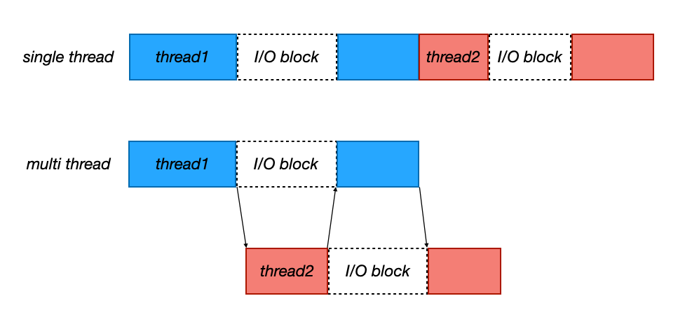
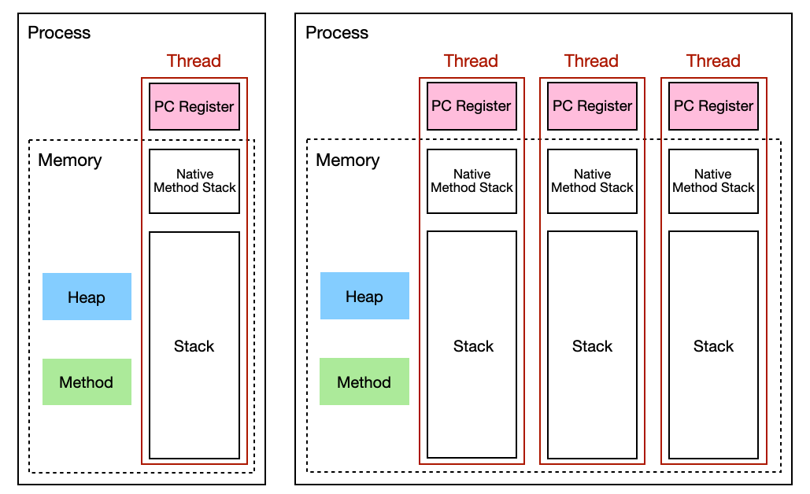
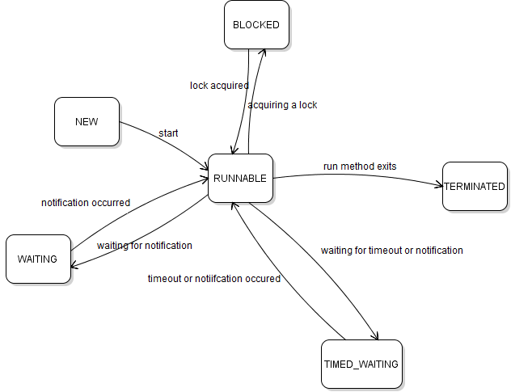
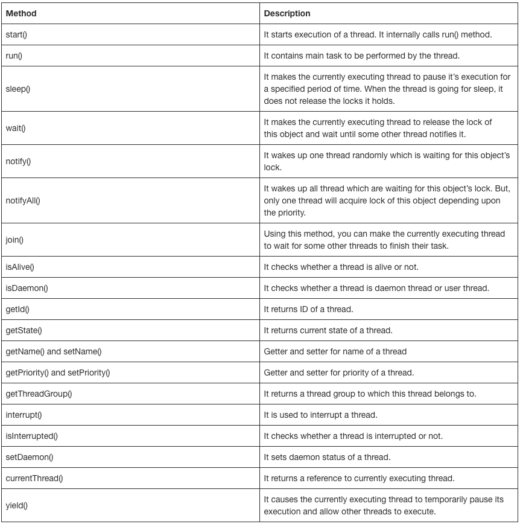
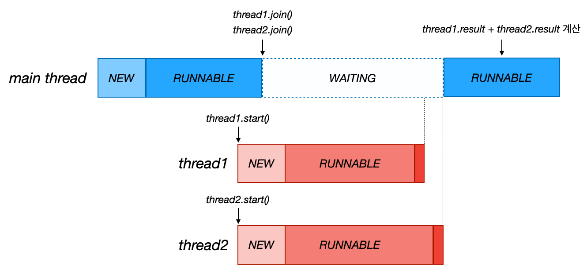

---

> **(macOS) IntelliJ IDEA > Preferences > search "console" > use soft wraps in console** 
>
> 이 설정을 사용하면 콘솔의 내용을 자동 줄바꿈 해준다.
{: .prompt-tip }

---

> **해당 포스트는 Lombok과 `@Slf4j`(Logback)를 사용한다**
>
> 로그는 `logstash-logback-encoder`를 통해 JSON 형태로 파싱하고 있다. 편의상 `version`, `level`, `levelValue` 필드를 제외하고 사용했다.
>
> 만약 로깅에 익숙하지 않다면 로깅 대신 `System.out`을 사용하면 된다.
{: .prompt-warning }

---

## 0. 스레드(Thread) 기본 개념

몇 가지 기본 개념들을 복습해보자.

### 프로세스, 스레드

> OS에서의 프로세스와 스레드에 대한 내용은 [여기](https://seungki1011.github.io/posts/os-02-process/)에서 확인하자.
{: .prompt-tip }

<br>

---

### 멀티프로세싱 vs 멀티태스킹(Multiprocessing vs Multitasking)

1. **멀티프로세싱 (Multiprocessing)**

   * **정의**: 멀티프로세싱은 여러 개의 프로세서를 활용하여 여러 프로세스를 동시에 수행하는 방법이다. 각 프로세스는 독립적으로 실행되며, 각 프로세스는 자체 메모리 공간을 가지며 병렬로 작업을 수행한다.

   * **특징**
     - **병렬 처리**: 여러 CPU 코어를 활용하여 작업을 병렬로 처리할 수 있어 성능이 크게 향상될 수 있다
     
     - **안정성**: 프로세스 간 메모리 공간이 분리되어 있어 하나의 프로세스에서 발생한 오류가 다른 프로세스에 영향을 미치지 않는다
     
     - **복잡성**: 프로세스 간의 통신이 필요할 경우, 메세지 패싱, 공유 메모리 등을 활용해야 하므로 복잡도가 증가할 수 있다
     
   * **예**: 다중 코어 프로세서를 사용하는 현대 컴퓨터 시스템
   
2. **멀티태스킹(Multitasking)**

   * **정의**: 멀티태스킹은 하나의 CPU가 여러 작업을 동시에 수행하는 것처럼 보이게 하는 방법이다. CPU는 매우 빠르게 작업 간을 전환하며, 각 작업은 일부분만 처리된 후 다시 대기 상태로 전환된다. 이 과정은 매우 빠르게 일어나기 때문에, 사용자에게는 작업이 동시에 진행되는 것처럼 보인다.
   * **특징**
     - **시간 분할**: CPU는 작업을 작은 시간 단위로 쪼개어 할당하며, 각 작업이 자신의 시간 할당량을 소모한 후에는 다른 작업으로 전환한다(시분할)
     - **효율성**: CPU 자원을 최대한 활용하여 여러 작업을 동시에 진행할 수 있도록 설계되어 있다
     - **오버헤드**: 컨텍스트 스위칭(Context Switching)을 통해 작업간 전환이 이루어지는데, 이때 오버헤드가 발생한다
   * **예**: 현대 운영 체제에서 여러 애플리케이션이 동시에 실행되는 환경
     * 브라우저, 문서 편집기, 등

<br>

---

### 스레드의 I/O Blocking

I/O 블락킹 : 입출력 동안 작업이 중지된다/

자바의 스레드의 I/O 블락킹에 대해서 알아보자. 싱글 코어 상황이라고 가정하자.

<br>

_single-thread vs multi-thread_

* 한 스레드에서 I/O 작업이 있는 동안 다른 스레드의 작업을 처리할 수 있다

<br>

멀티 스레드를 이용할 경우 작업을 더 효율적으로 진행할 수 있다. 기본적으로 이런 멀티 스레딩이 싱글 스레드를 사용하는 환경보다 응답성이 좋다.

<br>

---

### 스레드의 메모리 구성

프로세스와 스레드의 메모리 구성을 살펴보자. 기본적으로 프로세스는 무조건 하나 이상의 스레드로 만들어진다. 스레드가 실질적인 CPU 실행의 단위로 봐도 무방하다.

JVM의 런타임 메모리 구조는 OS에서의 프로세스와 스레드의 메모리 구조와 개념적으로 유사한 부분이 많으면서도, 구체적인 구현에 있어서 몇 가지 차이점을 가진다.

<br>

_JVM Runtime Thread Memory_

* **스레드별로 공유되는 영역**
  * **메서드 영역(Method)**: 전통적인 OS의 **코드 영역 및 데이터 영역**과 비슷한 역할을 한다
    * 클래스의 메타데이터, 메서드의 바이트코드, 클래스 변수(static 변수), 상수 풀 등이 저장
  * **힙 영역(Heap)**: 전통적인 힙 영역과 유사하게 **동적으로 할당된 객체**가 저장된다
    * JVM의 가비지 컬렉터(GC)에 의해 관리된다
* **스레드별로 관리되는 영역**
  * 스레드별로 독립적으로 관리되는 메모리 영역
  * **자바 스택 (Java Stack)**: 각 스레드마다 할당된 스택으로, **메서드 호출 시 생성되는 프레임**이 저장된다
    * 프레임에는 로컬 변수, 중간 연산 결과, 리턴 주소 등이 포함된다
  * **PC 레지스터 (Program Counter Register)**: 각 스레드가 현재 실행 중인 **명령어 주소**를 저장한다
  * **네이티브 메서드 스택 (Native Method Stack)**: 네이티브 메서드를 실행할 때 사용되는 스택으로, 자바 스택과 비슷하지만 자바 바이트코드가 아닌 네이티브 코드 실행 시 사용된다
  

<br>

---

### CPU Bound vs I/O Bound

**CPU bound 작업**과 **I/O bound 작업**은 프로그램의 성능을 결정하는 중요한 개념으로, 각 작업의 특성과 시스템 자원 사용 방식에 따라 성능 최적화 방법이 달라진다.

1. **CPU Bound 작업**

   - **정의**: **CPU bound 작업**은 **CPU의 처리 능력**에 의해 성능이 주로 결정되는 작업이다. 보통의 경우, 프로그램이 대부분의 시간을 계산, 처리 또는 연산을 수행하는 데 사용하며, CPU가 지속적으로 바쁘게 일을 하고 있는 상태이다.
     - **예시**
       - 복잡한 수학 연산 (예: 대규모 행렬 연산, 암호화 알고리즘 실행)
       - 데이터 처리 및 분석 (예: 대규모 데이터 세트에 대한 통계 연산)
       - 게임 엔진의 물리 연산

   - **성능 개선 방법**
     - CPU의 성능을 높이거나, 멀티코어 CPU에서 병렬 처리를 통해 성능을 향상시킬 수 있다

2. **I/O Bound 작업**

   - **정의**: **I/O bound 작업**은 **입출력 장치**(예: 디스크, 네트워크, 파일 시스템)의 속도에 의해 성능이 주로 결정되는 작업이다. 프로그램이 대부분의 시간을 **I/O 작업(데이터 읽기/쓰기, 네트워크 통신 등)**을 기다리며 보내는 상태이다.
     - **예시**
       - 파일 읽기/쓰기 (예: 대용량 파일을 디스크에 저장하거나 읽는 작업)
       - 네트워크 요청 처리 (예: 웹 서버의 요청 처리, HTTP 요청 전송 및 응답 대기)
       - 데이터베이스 쿼리 실행 (예: 외부 데이터베이스에서 데이터를 조회하는 작업)

   - **성능 개선 방법**
     - 비동기 I/O 또는 논블로킹 I/O를 사용하여 I/O 작업을 기다리는 동안 CPU를 다른 작업에 활용할 수 있다
     - 캐싱을 통해 반복적인 I/O 작업을 줄일 수 있다
     - 네트워크 대역폭이나 디스크 I/O 속도를 향상시키는 하드웨어 업그레이드도 고려할 수 있다

<br>

도메인에 따라 다르지만, **백엔드 엔지니어링의 경우 CPU 바운드 작업보다 I/O 바운드 작업이 대부분**을 차지한다. 예를 들어, 스레드가 1 ~ 10000까지 더하는 CPU의 연산이 필요한 작업보다는, 대부분 사용자의 입력을 기다리거나, 데이터베이스를 호출하고 그 결과를 기다리는 I/O 바운드 작업이 많다.

**CPU-바운드 작업이 많은지, I/O 바운드 작업이 많은지에 따라 스레드의 숫자를 설정하는 것이 중요**하다.

* **CPU-바운드 작업**
  * CPU 코어 수 + 1개(변경 가능)
  * CPU를 거의 100% 사용하는 작업이므로 스레드를 CPU 숫자에 최적화한다
* **I/O-바운드 작업**
  * CPU 코어 수 보다 많은 스레드를 생성, CPU를 최대한 사용할 수 있는 숫자까지 스레드 생성 CPU를 많이 사용하지 않으므로 성능 테스트를 통해 CPU를 최대한 활용하는 숫자까지 스레드를 생성한다
  * 단 너무 많은 스레드를 생성하면 컨텍스트 스위칭 비용도 함께 증가할 수 있기 때문에 적절한 성능 테스트가 필요하다

<br>


---

## 1. 자바의 스레드(Thread)

자바의 스레드에 대해서 알아보자

스레드의 구현과 실행에는 다음의 두 가지 방법이 있다.

* **`Thread` 클래스 상속**
  * `Thread` 클래스를 상속받아 `run()` 메서드만 재정의하면 된다
  * 단점
    * 자바는 단일 상속만을 허용하므로 이미 다른 클래스를 상속받고 있는 경우 `Thread` 클래스를 상속 받을 수 없다
    * 인터페이스를 사용하는 방법에 비해 유연성이 떨어진다
* **`Runnable` 인터페이스 구현** **(권장)**
  * `Runnable` 인터페이스 방식은 다른 클래스를 상속받아도 문제없이 구현할 수 있다
  * 스레드와 실행할 작업을 분리하여 코드의 가독성을 높일 수 있다
  * 여러 스레드가 동일한 `Runnable` 객체를 공유할 수 있어 자원 관리를 효율적으로 할 수 있다


<br>

---

### Thread 클래스 상속

`Thread` 클래스를 상속하는 경우 다음과 같이 사용한다.

```java
class MyThread extends Thread {
  @Override
  public void run() {
    // Thread클래스의 run()을 오버라이딩해서 사용한다
  }
}
```

```
MyThread t1 = new MyThread(); // 스레드 생성
t1.start(); // 스레드 실행
```

<br>

---

### Runnable 인터페이스 구현

#### Runnable 소개

`Runnable` 인터페이스는 다음과 같이 생겼다.

```java
public interface Runnable {
    /**
     * When an object implementing interface <code>Runnable</code> is used
     * to create a thread, starting the thread causes the object's
     * run() method to be called in that separately executing thread.
     * 
     * The general contract of the method run() is that it may
     * take any action whatsoever.
     */
    public abstract void run();
}
```

```java
class MyThread implements Runnable {
  @Override
  public void run() {
    // Runnable 인터페이스의 추상 메서드 run()을 구현한다
    // 스레드의 작업
  }
}
```

```java
// 1. runnable 사용하기
Runnable runnable = new MyThread();
Thread thread1 = new Thread(runnable);
thread1.start(); // 스레드 실행

// 2. 위의 두줄을 한줄로 정리하면
Thread thread2 = new Thread(new MyThread());
thread2.start();

// 3. 스레드에 이름 지정하기
Thread thread3 = new Thread(new MyThread(), "threadName");
thread3.start();
```

* **스레드를 생성할때 이름을 지정할 수 있다**: `new Thread(new MyThread(), "threadName")`

<br>

스레드에 대해서 자세히 알아보기 전에 `Runnable`을 만드는 다양한 방법을 알아보자.

<br>

---

#### 정적 중첩 클래스 사용

특정 클래스 안에서만 사용하는 경우, 다음 처럼 중첩 클래스를 사용해서 구현하면 된다.

<br>

```java
@Slf4j
public class NestedRunnableMain {
    public static void main(String[] args) {
        log.info("main() start");
        Thread thread = new Thread(new InnerRunnable());
        thread.start();
        log.info("main() end");
    }
    
    static class InnerRunnable implements Runnable {
        @Override
        public void run() {
            log.info("run()");
        }
    }
}
```

<br>

---

#### 익명 클래스 사용

특정 메서드 안에서만 간단히 정의하고 사용하고 싶다면 익명 클래스를 사용하면 된다.

<br>

```java
@Slf4j
public class AnonymousClassRunnableMain {
    public static void main(String[] args) {
        log.info("main() start");
        // 익명 클래스(익명 구현 객체) 정의
        Runnable runnable = new Runnable() {
            @Override
            public void run() {
                log.info("run()");
            }
        };
        // 익명 클래스를 runnable 대신 바로 안에서 정의해서 사용 가능
        Thread thread = new Thread(runnable);
        thread.start();
        log.info("main() end");
    }
}
```

<br>

---

#### 람다(Lambda) 사용

람다를 통해 익명 구현 객체(익명 클래스)를 더 간단히 표현할 수 있다. 쉽게 말해서, 람다를 통해 코드 조각을 전달 할 수 있다고 생각하면 편하다.

> 람다에 대한 포스트 [보러가기](https://seungki1011.github.io/posts/java-26-lambda/)
{: .prompt-tip }

<br>

```java
@Slf4j
public class LambdaRunnableMain {
    public static void main(String[] args) {
        log.info("main() start");
        Runnable runnable = () -> log.info("run()");
        // 람다를 변수로 전달하지 않고 안에 정의해서 사용 가능
        Thread thread = new Thread(runnable);
        thread.start();
        log.info("main() end");
    }
}
```

<br>


---

### 스레드 사용해보기

스레드 사용을 여러 예시를 이용해서 연습해보자.

```java
public class ThreadTest1 {
    public static void main(String[] args) {
      
        Runnable r1 = new MyThread1();
        Thread t1 = new Thread(r1);

        Runnable r2 = new MyThread2();
        Thread t2 = new Thread(r2);

        t1.start(); // 스레드 t1 시작
        t2.start(); // 스레드 t2 시작
				
    }
}

class MyThread1 implements Runnable {
    @Override
    public void run() { // 스레드가 수행할 작업 작성
        for (int i = 0; i < 100; i++) {
            System.out.print("["+Thread.currentThread().getName()+"]"); // 스레드의 이름 반환
        }
    }
}

class MyThread2 implements Runnable {
    @Override
    public void run() {
        for (int i = 0; i < 100; i++) {
            System.out.print("["+Thread.currentThread().getName()+"]");
        }
    }
}
```

```
[Thread-0][Thread-1][Thread-0][Thread-0][Thread-1][Thread-0][Thread-1][Thread-0][Thread-1][Thread-0][Thread-1][Thread-0][Thread-1][Thread-0][Thread-1][Thread-0][Thread-1][Thread-0][Thread-1][Thread-0][Thread-1][Thread-0][Thread-1][Thread-0][Thread-0][Thread-0][Thread-0][Thread-0][Thread-1][Thread-0]
```

* `Thread.currentThread().getName()`: 현재 실행중인 스레드의 이름 반환
* `.start()`: 스레드의 작업을 시작한다
* 스레드를 생성해서 `start()` 하지 않고 `main`에서 로직을 작성했으면 싱글 스레드로 동작한다
* **반면에 스레드를 새로 생성해서 멀티 스레드를 사용하면 작업이 번갈아가면서 실행되는 것을 확인할 수 있다**

<br>

스레드의 특징을 정리해보자.

* **스레드의 실행 순서는 os의 스케쥴러가 결정한다**
  * 스레드가 먼저 `start()` 했다고 먼저 실행되는 것은 아니다

* 자바 어플리케이션은 `main()`을 실행하는 기본 메인 스레드가 존재한다
* **자바에서는 모든 user 스레드가 종료되기 전까지 JVM은 종료되지 않는다**
* JVM은 각 **스레드에게 자기만의 호출 스택**을 준다
  * 각 스레드는 자기만의 호출 스택(stack)과 레지스터(register)를 가진다

<br>

> **스레드 그룹(Thread Group)**
>
> 스레드 그룹(thread group)은 서로 관련된 스레드를 그룹으로 묶어서 다루기 위해 사용한다. 모든 스레드는 반드시 하나의 그룹에 포함된다.
>
> 그러나 우리는 지금까지 스레드를 그룹에 지정하지 않고도 문제 없이 사용할 수 있었다. 그 이유는 그룹을 지정하지 않고 생성한 스레드는 `메인 스레드 그룹`에 속하기 때문이다.
>
> 스레드는 자신을 생성한 스레드(parent thread)의 그룹과 우선순위를 상속받는다.
{: .prompt-info }

<br>

> **스레드 우선 순위(Thread Priority)**
>
> 자바 스레드의 우선 순위를 설정할 수 있다. 우선순위는 스레드 스케줄러가 어떤 스레드를 우선 실행할지 결정하는 데 사용된다. 하지만 실제 실행 순서는 JVM 구현과 운영체제에 따라 달라진다. 실제로 스레드 우선 순위는 크게 영향을 주지 않는다.
{: .prompt-info }

<br>

---

## 2. 메인 스레드, 데몬 스레드(Main Thread, Daemon Thread)

### 스레드의 종류

메인 스레드는 `main()`의 코드를 수행하는 스레드이다.

자바에서 스레드는 두 가지로 나눌 수 있다.

* **사용자 스레드(user thread) : 어플리케이션이 동작하도록 하는 스레드**
  * 메인 스레드는 사용자 스레드에 해당한다
  * 모든 사용자 스레드가 종료되면 프로그램(JVM)도 종료된다
  * **메인 스레드가 종료되도 다른 사용자 스레드가 살아있으면 프로그램도 살아**있다
* **데몬 스레드(daemon thread) : 보조 역할을 하는 스레드**
  * 데몬 스레드는 일반 스레드의 작업을 돕는 보조적인 역할을 수행한다
    * 가비지 컬렉션과 같은 보조 역할을 백그라운드에서 하는 스레드라고 보면 된다
  * 데몬 스레드는 **유저 스레드가 모두 종료되면 자동적으로 종료**된다

<br>

---

### 메인 스레드(Main Thread)

코드로 살펴보자.

```java
public class ThreadTest2 {

    static long startTime = 0;

    public static void main(String[] args) {

        Thread t1 = new Thread(new MyThread1());
        Thread t2 = new Thread(new MyThread2());

        t1.start();
        t2.start();
        startTime = System.currentTimeMillis();

        System.out.println();
        System.out.println("Total task time : "+ (System.currentTimeMillis()-startTime));
    } // main 스레드
}
```

```
[Thread-1]Total task time : 0
[Thread-0][Thread-1][Thread-0][Thread-1][Thread-1][Thread-0][Thread-1][Thread-0][Thread-1][Thread-1][Thread-0][Thread-1][Thread-0][Thread-1][Thread-0][Thread-1][Thread-0][Thread-1][Thread-0][Thread-1][Thread-1][Thread-0][Thread-1][Thread-1][Thread-0][Thread-0][Thread-1][Thread-0][Thread-1][Thread-1][Thread-1][Thread-1][Thread-1][Thread-0][Thread-0][Thread-0][Thread-1][Thread-0][Thread-1][Thread-0][Thread-1][Thread-0][Thread-0][Thread-0][Thread-1][Thread-0][Thread-1][Thread-1][Thread-1][Thread-1][Thread-1]
```

* 메인 스레드가 초반에 끝나버리는 것을 확인할 수 있다 → 메인 스레드는 스레드 `t1`, `t2`를 시작하고 할일이 없으니깐 종료

<br>

이번에는 `Runnable`을 구현하는 `HelloRunnable`이라는 클래스를 만들자.

```java
@Slf4j
public class HelloRunnable implements Runnable{
    @Override
    public void run() {
        log.info(Thread.currentThread().getName() + ": run()");
    }
}
```

<br>

```java
@Slf4j
public class ManyThreadMain {
    public static void main(String[] args) {
        log.info("main() start");
      
        Thread thread = new Thread(new HelloRunnable());
        thread.start();
      
        log.info("main() end");
    }
}
```

```
{
  "@timestamp" : "2024-02-05T20:41:20.998741+09:00",
  "message" : "main() start",
  "thread_name" : "main",
}
{
  "@timestamp" : "2024-02-05T20:41:21.002429+09:00",
  "message" : "main() end",
  "thread_name" : "main",
}
{
  "@timestamp" : "2024-02-05T20:41:21.002612+09:00",
  "message" : "Thread-0: run()",
  "thread_name" : "Thread-0",
}
```

* **자바에서는 모든 유저 스레드가 종료되기 전까지 JVM은 종료되지 않는다**:  `main` 스레드가 종료되어도, `Thread-0`가 종료되기 전까지 JVM은 살아있다

<br>

---

### 데몬 스레드(Daemon Thread)

**데몬 스레드는 유저 스레드의 작업을 돕는 보조적인 역할을 수행**한다. 데몬 스레드는 일반 스레드가 모두 종료되면 자동적으로 종료된다.

다음이 보조 역할에 해당하는 것들이다.

* 가비지 컬렉터
* 자동저장
* 화면 자동 갱신

<br>

데몬 스레드는 보통 무한루프와 조건문을 이용해서, 실행 후 대기하다가 특정 조건을 만족하면 작업을 수행하고 대기하도록 작성한다.

<br>

```java
boolean isDaemon() // 스레드가 데몬 스레드인지 확인한다. 만약 데몬 스레드라면 true 반환

void setDaemon(boolean on) // 스레드를 데몬 스레드 또는 사용자 스레드로 변경한다. on을 true로 지정하면 데몬 스레드로 변경된다.
```

* `setDaemon(true)`: 데몬 스레드로 설정한다
* `setDaemon()`은 반드시 `start()`를 호출하기 전에 실행되어야한다. 그렇지 않은 경우 예외 발생!
  * 기본값은 `false`이다(모든 스레드는 기본적으로 유저 스레드이다)

<br>

---

## 3. 스레드 생명 주기

### 스레드의 상태(Thread state)

스레드의 상태에 대해서 알아보자.

* **NEW** : 스레드가 생성되고 아직 `start()`를 하지 않은 상태

* **RUNNABLE** : 스레드가 실행 중 이거나 실행 가능한 상태

  * `start()`가 호출되면 스레드는 이 상태로 들어간다
  * **RUNNABLE** 상태인 모든 스레드가 동시에 실행되는 것은 아니다. 실행 대기열에 들어있다가 운영체제의 스케쥴러에 따라 시간을 할당해서 실행되고, 다시 실행 대기열에 들어가는 사이클이 반복된다. (**자바에서는 실행 대기열에 있는 상태와 실제 실행되는 상태를 구분하지 않는다**)

* **TERMINATED** : 스레드의 작업이 종료된 상태

* **일시 중지 상태**

  * **BLOCKED** : 동기화 락(Lock)을 기다리는 동안 일시 정지된(blocked) 상태
    * 예를 들자면, `synchronized` 블럭에 진입하기 위해서 락을 얻어야 하는 경우 **BLOCKED** 상태로 들어간다

  * **WAITING** : 스레드가 다른 스레드의 특정 작업이 완료되기를 기다리는 대기 상태(일시 정지 상태)
    * `wait()`, `join()` 등의 메서드가 호출될 때 **WAITING** 상태가 된다
    * 스레드는 다른 스레드가 `notify()` 또는 `notifyAll()` 메서드를 호출하거나, `join()` 이 완료될 때까지 기다린다

  * **TIMED_WATING** : **WAITING**과 동일하지만 기다리는 시간이 지정된 경우
    * 주어진 시간이 결과하거나 다른 스레드가 해당 스레드를 깨우면 이 상태에서 벗어난다

<br>

_https://www.codejava.net/java-core/concurrency/understanding-thread-states-thread-life-cycle-in-java_


<br>

_https://javaconceptoftheday.com/java-threads-cheat-sheet/_

<br>

---

### 다른 스레드 기다리기: join()

다음 코드에서 메인 스레드가 바로 끝나버리고 다른 스레드가 메인 스레드 이후에 끝난다. (이전의 메인 스레드에 대해 알아볼 때 사용했던 코드이다)

<br>

```java
@Slf4j
public class ManyThreadMain {
    public static void main(String[] args) {
        log.info("main() start");
      
        Thread thread = new Thread(new HelloRunnable());
        thread.start();
      
        log.info("main() end");
    }
}
```

```
{
  "@timestamp" : "2024-02-05T20:41:20.998741+09:00",
  "message" : "main() start",
  "thread_name" : "main",
}
{
  "@timestamp" : "2024-02-05T20:41:21.002429+09:00",
  "message" : "main() end",
  "thread_name" : "main",
}
{
  "@timestamp" : "2024-02-05T20:41:21.002612+09:00",
  "message" : "Thread-0: run()",
  "thread_name" : "Thread-0",
}
```

* `main` 스레드가 끝나고 `Thread-0` 스레드가 이후에 끝난다

<br>

이런 현상이 일어나는 이유는 알다시피 메인 스레드가 생성된 다른 스레드가 끝나길 기다려주지 않기 때문이다. **"그러면 메인 스레드가 특정 스레드를 기다리게 하고 싶으면 어떻게 해야할까?**"

예시를 통해 알아보자. 다음과 같은 상황을 스레드로 구현한다고 가정해보자.

* `1 ~ 100` 까지 더하는 결과를 두 스레드로 나눠서 진행하고, 그 결과를 합치는 방식으로 합을 구할 것이다
  * **스레드1**: `1 ~50` 더하기
  * **스레드2**: `51 ~ 100` 더하기
  * **메인 스레드**: 두 결과 합치기
* 결과는 `5050`이 나와야 한다

<br>

우리가 스레드에 대해 몰랐을 때 처럼, **싱글 스레드 환경 처럼 생각하고 코드를 작성**해보자. `sleep()`에 대한 `try-catch`를 처리해주는 유틸을 만들어서 사용하자. (유틸에 대한 코드는 생략했다)

```java
@Slf4j
public class TraditionalMain {
    public static void main(String[] args) {
        log.info("main start");
        SumTask task1 = new SumTask(1 ,50);
        SumTask task2 = new SumTask(51 ,100);
        Thread thread1 = new Thread(task1, "Thread1");
        Thread thread2 = new Thread(task2, "Thread2");

        thread1.start();
        thread2.start();

        log.info("task1.result = {}", task1.result); // 기대: 1275, 실제: 0
        log.info("task2.result = {}", task2.result); // 기대: 3775, 실제: 0

        int total = task1.result + task2.result;
        log.info("[expected value: 5050] total = {}", total); // 기대: 5050, 실제: 0
        log.info("main end");
    }

    static class SumTask implements Runnable {
        int start;
        int end;
        int result = 0;

        public SumTask(int start, int end) {
            this.start = start;
            this.end = end;
        }

        @Override
        public void run() {
            log.info("SumTask 시작");
            sleep(2000);
            int sum = 0;
            for (int i = start; i <= end; i++) {
                sum += i;
            }
            result = sum;
            log.info("SumTask 완료, result = " + result);
        }
    }

}
```

```
{
  "@timestamp" : "2024-02-06T07:40:03.098795+09:00",
  "message" : "main start",
  "thread_name" : "main"
}
{
    "@timestamp" : "2024-02-06T07:40:03.102168+09:00",
    "message" : "SumTask 시작",
    "thread_name" : "Thread2"
  }
{
    "@timestamp" : "2024-02-06T07:40:03.10215+09:00",
    "message" : "SumTask 시작",
    "thread_name" : "Thread1"
}
{
  "@timestamp" : "2024-02-06T07:40:03.102154+09:00",
  "message" : "task1.result = 0",
  "thread_name" : "main"
}
{
  "@timestamp" : "2024-02-06T07:40:03.102708+09:00",
  "message" : "task2.result = 0",
  "thread_name" : "main"
}
{
  "@timestamp" : "2024-02-06T07:40:03.102789+09:00",
  "message" : "[expected value: 5050] total = 0",
  "thread_name" : "main"
}
{
  "@timestamp" : "2024-02-06T07:40:03.102866+09:00",
  "message" : "main end",
  "thread_name" : "main"
}
{
    "@timestamp" : "2024-02-06T07:40:05.109666+09:00",
    "message" : "SumTask 완료, result = 3775",
    "thread_name" : "Thread2"
  }
{
    "@timestamp" : "2024-02-06T07:40:05.109666+09:00",
    "message" : "SumTask 완료, result = 1275",
    "thread_name" : "Thread1"
}
```

* 기대한대로 결과가 나오지 않는다

<br>

각 스레드에 대한 작업이 끝나서, 해당 작업 결과를 다시 메인 스레드에서 합해서 구하는 로직이 실패하는 이유는 알다시피 `main` 스레드가 `Thread1`과 `Thread2`를 기다려주지 않기 때문이다. 코드가 기대에 맞게 동작시키기 위해서는 **`main` 스레드가 `Thread1`과 `Thread2`의 계산이 끝날때 까지 기다리도록 하면 된다**.

자바에서는 해당 기능을 `join()`이라는 메서드로 제공한다.

<br>

이번에는 `join()`을 사용하도록 코드를 수정하고 동작을 확인해보자.

```java
log.info("main start");
SumTask task1 = new SumTask(1 ,50);
SumTask task2 = new SumTask(51 ,100);
Thread thread1 = new Thread(task1, "Thread1");
Thread thread2 = new Thread(task2, "Thread2");

thread1.start();
thread2.start();

// join() 사용
log.info("thread1.join(): main 스레드가 thread1 종료까지 대기");
log.info("thread2.join(): main 스레드가 thread2 종료까지 대기");
thread1.join();
thread2.join();
log.info("main 스레드 대기 완료");

log.info("task1.result = {}", task1.result);
log.info("task2.result = {}", task2.result);

int total = task1.result + task2.result;
log.info("[expected value: 5050] total = {}", total);
log.info("main end");
```

* 기존 `SumTask`는 동일하다

```
{
  "@timestamp" : "2024-02-06T09:00:05.990481+09:00",
  "message" : "thread1.join(): main 스레드가 thread1 종료까지 대기",
  "thread_name" : "main"
}
{
  "@timestamp" : "2024-02-06T09:00:05.990826+09:00",
  "message" : "thread2.join(): main 스레드가 thread2 종료까지 대기",
  "thread_name" : "main"
}
{
  "@timestamp" : "2024-02-06T09:00:07.99697+09:00",
  "message" : "SumTask 완료, result = 3775",
  "thread_name" : "Thread2"
}
{
  "@timestamp" : "2024-02-06T09:00:07.99697+09:00",
  "message" : "SumTask 완료, result = 1275",
  "thread_name" : "Thread1"
}
{
"@timestamp" : "2024-02-06T09:00:07.998319+09:00",
"message" : "main 스레드 대기 완료",
"thread_name" : "main"
}
{
"@timestamp" : "2024-02-06T09:00:07.999069+09:00",
"message" : "task1.result = 1275",
"thread_name" : "main"
}
{
"@timestamp" : "2024-02-06T09:00:08.002653+09:00",
"message" : "task2.result = 3775",
"thread_name" : "main"
}
{
"@timestamp" : "2024-02-06T09:00:08.002863+09:00",
"message" : "[expected value: 5050] total = 5050",
"thread_name" : "main"
}
```

* 이제 `main` 스레드는 `Thread1`, `Thread2` 스레드의 종료를 기다린다
* 기대한대로 합이 `5050`이 나오는 것을 확인할 수 있다

<br>

시간의 흐름에 대한 스레드의 상태를 그림으로 살펴보자.

<br>

_join()_

* `join()`을 통해서 메인(`main`) 스레드는 `Thread1`, `Thread2` 스레드가 종료될 때 까지 기다린다
  * 이때 `main` 스레드는 **WAITING** 상태가 된다
* `Thread1`, `Thread2` 어느 한 스레드가 종료되더라도 메인 스레드는 `join()`을 통해 **WAITING** 상태에 있기 때문에, 두 스레드가 전부 종료된 상태여야 메인 스레드가 **RUNNABLE** 상태로 변경된다
* **RUNNABLE** 상태가 된 메인 스레드는 이제 `Thread1`, `Thread2`의 결과를 이용해서 합을 구할 수 있다

<br>

> **WAITING**
>
> 스레드가 다른 스레드의 특정 작업이 완료되기를 무기한 기다리는 상태이다.
>
> `thread.join()`을 통해 **WAITING** 상태가 된 경우, 대상 스레드(`thread`)가 **TERMINATED**(종료) 상태가 될 때 까지 대기한다. 대상 스레드가 종료되고 나서, 호출 스레드가 다시 **RUNNABLE** 상태가 되면서 스레드의 다음 코드(`join()` 이후의 코드)를 수행한다. 
{: .prompt-info }

<br>

> **`join()` vs `join(ms)`**
>
> * `join()` : 호출 스레드는 대상 스레드가 완료될 때 까지 무한정 대기한다
>
> * `join(ms)` : 호출 스레드는 지정한 시간 만큼만 대기한다. 호출 스레드는 지정한 시간이 지나면 다시 `RUNNABLE`
>
>   상태가 되면서 다음 코드를 수행한다.
{: .prompt-info }

<br>

---

### 스레드 중간에 중단 시키기: interrupt()

#### interrupt() 사용

특정 스레드의 작업을 중간에 중단하고 싶으면 어떻게 해야할까? 결론부터 말하자면, 자바는 이를 위해 `interrupt()`라는 메서드를 제공한다.

자바의 `interrupt()` 메서드는 **특정 스레드에 인터럽트 신호를 보내는 데 사용**된다. **이를 통해 해당 스레드가 현재 실행 중인 작업을 멈추고 인터럽트를 처리**하게 할 수 있다.

사용 방법을 알아보자.

<br>

특정 스레드가 `sleep()`을 통해 쉬고 있을때, 처리해야 하는 작업이 들어와 해당 스레드를 깨워야 할 수 있다. 또는 `sleep()`으로 쉬고 있는 스레드에게 더 이상이 일 없으면, 작업의 종료를 지시할 수 있다.

`interrupt()`는 **WAITING**, **TIMED_WAITING** 상태의 스레드를 깨워서 **RUNNABLE**(실행 가능) 상태로 만든다.

```java
@Slf4j
public class InterruptV1Main {
    public static void main(String[] args) {
        MyTask task = new MyTask();
        Thread printThread = new Thread(task, "print");
        printThread.start();

        ThreadUtils.sleep(4000); // 메인 스레드가 4초 뒤에 printThread에 인터럽트를 건다(편의를 위해 유틸의 sleep 사용)
        log.info("printThread.interrupt() 호출: 작업 인터럽트 지시");
        printThread.interrupt(); // print 스레드에 인터럽트 발생
        log.info("[main 끝] print 스레드 인터럽트 상태 = " + printThread.isInterrupted());
    }

    static class MyTask implements Runnable {
        @Override
        public void run() {
            try {
                while (true) {
                    log.info("2초마다 출력 중..."); // 여기까지는 InterruptedException이 발생하지 않는다
                    Thread.sleep(1000); // 여기서 InterruptedException 발생
                }
            } catch (InterruptedException e) {
                log.info("[인터럽트 발생] print 스레드 인터럽트 상태 = " + Thread.currentThread().isInterrupted());
                log.info("interrupt message = " + e.getMessage());
                log.info("state = " + Thread.currentThread().getState());
            } finally {
                log.info("자원 정리");
                log.info("작업 종료");
            }
        }
    }
}
```

* 메인 스레드에서는 `printThread`가 시작하고 4초 뒤에 `printThread`에 인터럽트를 건다

* `MyTask`에서는 인터럽트로 `while`문을 빠져나가기 전까지 2초마다 출력하고 있다

* **`isInterrupted()`**: 해당 스레드의 인터럽트 상태를 확인할 수 있다

  * `true`: 인터럽트 상태
  * `false`: 인터럽트 상태가 아님

* **`printThread.interrupt()`**

  * `printThread`에 인터럽트가 발생한다
  * 인터럽트 발생시 해당 스레드에서 `InterruptedException` 발생
  * 인터럽트가 발생한 스레드는 **RUNNABLE** 상태로 변경되고 코드를 정상 수행할 수 있는 상태가 된다
  * `catch`로 `InterruptedException`을 잡아서 처리하면 된다

* **`InterruptedException`의 발생 시기**

  * `interrupt()`를 호출 하자마자 발생하지 않는다

  * `interrupt()`를 호출한 상태에서 `sleep()` 처럼 `InterruptedException`를 던지는 메서드를 호출해야만 예외가 발생한다

    * ```java
      while (true) {
          log.info("1초마다 출력 중..."); // 여기까지는 InterruptedException이 발생하지 않는다
          Thread.sleep(1000); // 여기서 InterruptedException 발생
      }
      ```

<br>

위 코드의 실행 결과를 살펴보자.

```
{
  "@timestamp" : "2024-02-06T18:15:42.261841+09:00",
  "message" : "2초마다 출력 중...",
  "thread_name" : "print"
}
{
  "@timestamp" : "2024-02-06T18:15:43.269993+09:00",
  "message" : "2초마다 출력 중...",
  "thread_name" : "print"
}
{
  "@timestamp" : "2024-02-06T18:15:46.267117+09:00",
  "message" : "printThread.interrupt() 호출: 작업 인터럽트 지시",
  "thread_name" : "main"
}
{
    "@timestamp" : "2024-02-06T18:15:46.270284+09:00",
    "message" : "[main 끝] print 스레드 인터럽트 상태 = true",
    "thread_name" : "main"
}
{
    "@timestamp" : "2024-02-06T18:15:46.270287+09:00",
    "message" : "[인터럽트 발생] print 스레드 인터럽트 상태 = false",
    "thread_name" : "print"
  }
{
  "@timestamp" : "2024-02-06T18:15:46.270792+09:00",
  "message" : "interrupt message = sleep interrupted",
  "thread_name" : "print"
}
{
  "@timestamp" : "2024-02-06T18:15:46.271163+09:00",
  "message" : "state = RUNNABLE",
  "thread_name" : "print"
}
{
  "@timestamp" : "2024-02-06T18:15:46.271448+09:00",
  "message" : "자원 정리",
  "thread_name" : "print"
}
{
  "@timestamp" : "2024-02-06T18:15:46.271668+09:00",
  "message" : "작업 종료",
  "thread_name" : "print"
}
```

* 위에서 주요하게 볼 로그는 스레드의 인터럽트 상태를 출력하는 로그이다
  * 인터럽트가 적용되고, 인터럽트 예외가 발생하면, 해당 스레드는 실행 가능 상태가 되고, 인터럽트 발생 상태도 정상으로 돌아온다는 것을 확인할 수 있다
  * **[main 끝] print 스레드 인터럽트 상태 = true**: 인터럽트 상태인 스레드는 `true`
  * **[인터럽트 발생] print 스레드 인터럽트 상태 = false**: `InterruptedException` 발생후 다시 **RUNNABLE** 상태가 되었기 때문에 인터럽트 상태는 다시 `false`

<br>

---

#### 코드 개선: interrupted()

이전 코드의 아쉬운 부분은 `while`문에서 인터럽트에 대한 체크를 하지 않는다는 것이다. 이전 코드의 `while`문 부분을 살펴보자.

```java 
while (true) { // 인터럽트에 대한 체크를 하지 않는다
    log.info("2초마다 출력 중...");
    Thread.sleep(1000); // 여기서 InterruptedException 발생
}
```

* `while(true)`: 항상 `true`이기 때문에 인터럽트 상태에서 `sleep()`의 호출을 통한 인터럽트 예외 발생 전까지 무한 반복된다

<br>

해당 코드를 다음 처럼 `while`문에서 인터럽트 여부를 체크할 수 있다면, 더 빠른 반응이 가능하다.

```java
while (인터럽트_상태_확인) { // 인터럽트 상태인지 확인한다
    log.info("2초마다 출력 중...");
    Thread.sleep(1000); // 여기서 InterruptedException 발생
}
```

* `while`문의 조건을 체크하는 파트에서 인터럽트 상태를 확인해서 더 빠르게 탈출할 수 있다
* 인터럽트 상태를 직접 확인하기 때문에 `sleep()` 없이도 `while`문 탈출이 가능하다

<br>

그러면 이전의 코드를 수정해보자.

수정한 코드에서 스레드의 인터럽트 상태를 직접 확인하기 위해서 `Thread.interrupted()`라는 메서드를 사용한다.

`Thread.interrupted()`는 다음과 같이 동작한다.

* 스레드가 인터럽트 상태라면 `true` 반환 후 해당 스레드의 인터럽트 상태를 `false`로 변경한다
* 스레드가 인터럽트 상태가 아니라면 `false`를 반환한다

<br>

> **왜 `isInterrupted()`을 사용하지 않지?**
>
> 스레드의 인터럽트 상태를 확인하기 위한 메서드로 `isInterrupted()`라는 메서드가 존재하는데, 갑자기 `interrupted()`라는 메서드를 사용한다고 해서 의문이 들것이다.
>
> `isInterrupted()`를 사용하는 경우 한 가지 문제가 발생한다. 이는 `isInterrupted()`가 인터럽트의 상태를 변경하지 않고 단순히 확인만 한다는 것이다.
>
> *"상태만 확인하면 무슨 문제가 발생하는데?"*
>
> <br>
>
> `isInterrupted()`를 사용한 코드를 살펴보자.
>
> ```java
> while (!Thread.interrupted()) { // 단순히 스레드의 인터럽트 상태를 확인하고 인터럽트 상태가 true라면 while문 탈출
>     log.info("출력 중...");
> }
> log.info("스레드 인터럽트 상태 = " + Thread.currentThread().isInterrupted()); // 확인해보면 아직 인터럽트 상태가 true이다
> try {
>     log.info("자원 정리 시도");
>     Thread.sleep(1000); // 인터럽트 상태가 아직 true이기 때문에 여기서 InterruptedException 발생
>     log.info("자원 정리 완료");
> } catch (InterruptedException e) {
>     log.info("자원 정리 실패 - 자원 정리 중 인터럽트 발생"); // 결론적으로 자원 정리에 실패한다
> } finally {
>     log.info("작업 종료");
> }
> ```
>
> 위 코드에서 확인했듯이, 정상적인 동작을 위해서는 `while`문에서 인터럽트 상태를 체크하고, `true`라면 다시 `false`로 변경해주는 로직이 필요하다. 자바에서도 기본적으로 인터럽트 예외가 발생하면 스레드의 인터럽트 상태를 다시 `false`로 돌린다. 만약 인터럽트 상태를 그대로 둔다면, 나중에 예상하지 못한 영역에서 `sleep()`을 만나 인터럽트 예외가 발생할 수 있다.
>
> 결론적으로 상태만을 확인하는 `isInterrupted()`를 사용하는 것이 아니라, 상태를 체크하고 다시 `false`로 변경해주는 `interrupted()`를 사용해야 한다.
{: .prompt-info }

<br>

`interrupted()`를 사용하는 개선된 코드를 살펴보자.


<br>

```java
@Slf4j
public class InterruptV2Main {
    public static void main(String[] args) {
        MyTask task = new MyTask();
        Thread thread = new Thread(task, "print");
        thread.start();

        ThreadUtils.sleep(10);
        log.info("thread.interrupt() 호출: 작업 인터럽트 지시");
        thread.interrupt();
        log.info("[main 끝] print 스레드 인터럽트 상태 = " + thread.isInterrupted());
    }

    static class MyTask implements Runnable {
        @Override
        public void run() {
            while (!Thread.interrupted()) { // interrupted()라는 메서드를 사용한다: 인터럽트 상태가 변경된다 true -> false
                log.info("출력 중...");
            }
            log.info("[인터럽트 발생] print 스레드 인터럽트 상태 = " + Thread.currentThread().isInterrupted());
            try {
                log.info("자원 정리 시도");
                Thread.sleep(1000);
                log.info("자원 정리 완료");
            } catch (InterruptedException e) {
                log.info("자원 정리 실패 - 자원 정리 중 인터럽트 발생");
                log.info("[자원 정리 실패] print 스레드 인터럽트 상태 = " + Thread.currentThread().isInterrupted());
            } finally {
                log.info("작업 종료");
            }
        }
    }
}
```

```
{
  "@timestamp" : "2024-02-06T20:41:46.092588+09:00",
  "message" : "출력 중...",
  "thread_name" : "print"
}
{
    "@timestamp" : "2024-02-06T20:41:46.092624+09:00",
    "message" : "출력 중...",
    "thread_name" : "print"
  }
{
  "@timestamp" : "2024-02-06T20:41:46.092495+09:00",
  "message" : "thread.interrupt() 호출: 작업 인터럽트 지시",
  "thread_name" : "main"
}
{
  "@timestamp" : "2024-02-06T20:41:46.092664+09:00",
  "message" : "출력 중...",
  "thread_name" : "print"
}
{
    "@timestamp" : "2024-02-06T20:41:46.093346+09:00",
    "message" : "[main 끝] print 스레드 인터럽트 상태 = true",
    "thread_name" : "main"
  }
{
    "@timestamp" : "2024-02-06T20:41:46.093348+09:00",
    "message" : "[인터럽트 발생] print 스레드 인터럽트 상태 = false",
    "thread_name" : "print"
}
{
  "@timestamp" : "2024-02-06T20:41:46.093563+09:00",
  "message" : "자원 정리 시도",
  "thread_name" : "print"
}
{
  "@timestamp" : "2024-02-06T20:41:47.098899+09:00",
  "message" : "자원 정리 완료",
  "thread_name" : "print"
}
{
  "@timestamp" : "2024-02-06T20:41:47.099247+09:00",
  "message" : "작업 종료",
  "thread_name" : "print"
}
```

<br>

무조건 `interrupted()`를 사용하라는 뜻은 아니다. 우아하게 자원 정리까지 해서 종료하는 것이 아니라, 최대한 빠르게 스레드를 종료해야 하는 긴급 상황이라면 그냥 인터럽트 상태로 두는 것도 방법일 수 있다.

<br>

> **`yield()`**
>
> `yield()`는 특정 스레드가 자신의 실행을 일시적으로 중단하고, 동일한 우선순위를 가진 다른 스레드에게 CPU 시간을 양보하도록 하는 메서드이다. 하지만 이 양보가 반드시 실행되지는 않으며, 스케줄러의 판단에 따라 결정된다.
>
> * **`yield()`를 사용하는 상황**
>   * **CPU 바운드 작업에서의 공정성 유지:** 여러 스레드가 CPU 자원을 사용해 연산을 수행할 때, 특정 스레드가 지나치게 많은 자원을 소비하지 않도록 `yield()`를 사용해 공정하게 스레드들이 자원을 나눌 수 있게 한다
>   * **경쟁 완화:** 특정 자원을 여러 스레드가 경쟁적으로 사용하려고 할 때, `yield()`를 사용해 다른 스레드가 자원을 사용할 기회를 주거나 경합을 완화할 수 있다
>   * **스레드 우선순위에 따른 조정:** 우선순위가 다른 여러 스레드가 있을 때, 낮은 우선순위 스레드가 시스템 자원을 독점하지 않도록 `yield()`를 사용해 스케줄링을 조정할 수 있다
> * **`yield()`의 한계**
>   * `yield()`가 호출되더라도 스레드 스케줄러가 반드시 다른 스레드를 실행하는 것은 아니다
>   * 멀티코어 시스템에서는 여러 코어가 동시에 작업을 수행하기 때문에, `yield()`가 미치는 영향이 미미할 수 있다. 하나의 스레드가 `yield()`를 호출해도, 다른 코어에서 이미 실행 중인 스레드가 계속해서 자원을 사용하기 때문이다.
  {: .prompt-info }


<br>

---

## Reference

1. [이것이 자바다!](https://www.google.co.kr/books/edition/%EC%9D%B4%EA%B2%83%EC%9D%B4_%EC%9E%90%EB%B0%94%EB%8B%A4_%EA%B0%9C%EC%A0%95%ED%8C%90/SLWGEAAAQBAJ?hl=ko&gbpv=0)
1. [김영한: 실전 자바 로드맵](https://www.inflearn.com/roadmaps/744)
1. [https://www.codejava.net/java-core/concurrency/understanding-thread-states-thread-life-cycle-in-java](https://www.codejava.net/java-core/concurrency/understanding-thread-states-thread-life-cycle-in-java)
1. [https://javaconceptoftheday.com/java-threads-cheat-sheet/](https://javaconceptoftheday.com/java-threads-cheat-sheet/)
