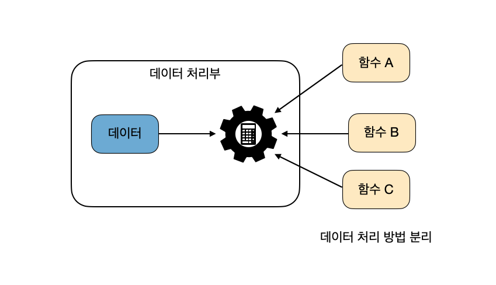
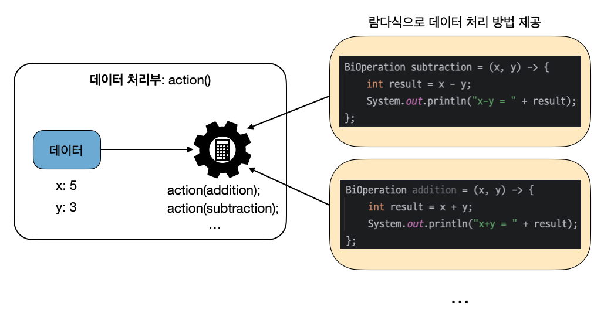

---

## 1. 람다 표현식(Lambda Expression)

### 함수형 프로그래밍 소개

> 자바는 Java8(JDK1.8) 부터 함수형 언어들이 가지는 몇 가지 기능을 추가시켰다. 람다 표현식을 포함해서, 뒤에서 다룰 `stream`, `optional` 등이 여기에 해당한다.
{: .prompt-info }

<br>

**함수형 프로그래밍(Functional Programming)**은 프로그래밍 패러다임 중 하나로, **프로그램을 함수의 연속으로 구성하고 상태 변화와 부작용을 최소화하는 것을 목표**로 한다.

함수형 프로그래밍의 주요 특징은 다음과 같다.

* **순수 함수(Pure Function)** 
  * 같은 입력에 대해 항상 같은 출력을 반환하고, 함수 외부의 상태를 변경하지 않는 함수
  * 사이드 이펙트(side-effect)를 제거한 함수이다
* **불변성(Immutability)** 
  * 함수형 프로그래밍에서는 데이터의 상태가 변경되지 않도록 하는 것이 중요하다
  * 변수를 선언한 후 값을 바꾸지 않고, 새로운 값을 만들어내는 방식으로 작업을 진행한다
* **일급 함수(First-Class Function)** 
  * 함수가 다른 값들과 동일하게 취급되는 것을 의미한다. 즉, 함수를 변수에 할당하거나, 다른 함수의 인자로 전달하거나, 함수에서 반환값으로 사용할 수 있다.
* **고차 함수(Higher-Order Function)** 
  * **다른 함수를 인자로 받거나, 함수를 반환하는 함수**를 의미한다. 즉, **함수를 값으로 다루는 함수를 고차 함수**라고 한다.
  * 함수형 프로그래밍에서는 고차 함수를 많이 사용한다
* **참조 투명성(Referential Transparency)** 
  * 동일한 입력값이 주어지면 항상 동일한 출력값을 반환하는 속성이다. 이는 프로그램을 이해하고 예측 가능하게 만든다.
* **지연 평가(Lazy Evaluation)** 
  * 필요할 때까지 계산을 미루는 평가 방법으로, 불필요한 계산을 줄이고 효율성을 높이는 데 사용한다
  * 쉽게 말해서 코드 실행 즉시 값이 평가되는 것이 아니라, 필요한 시점에 평가를 진행하는 것을 말한다

<br>

함수형 프로그래밍을 쉽게 설명하자면, **프로그램을 "함수"라는 작은 조각들로 만드는 방법**이라고 보면 된다. **이 조각들은 서로 독립적이고, 항상 같은 입력이 주어지면 같은 결과를 내는 게 특징**이다.

* **함수는 하나의 상자**: 입력을 넣으면 결과가 나오는 상자처럼 생각하자. 같은 입력을 넣으면 항상 같은 결과가 나온다.
* **변수를 바꾸지 않는다**: 프로그램에서 변수를 한 번 정하면 나중에 바꾸지 않는다. 새로운 값을 만들 때는 기존 변수를 바꾸지 않고, 새로운 변수를 만들어서 사용한다.
* **함수를 전달하고 반환할 수 있다**: 함수도 숫자나 글자처럼 다른 함수에 전달하거나, 함수가 함수를 반환할 수 있다.
* **사이드 이펙트를 최소화 한다**: 함수가 프로그램의 다른 부분에 영향을 주지 않도록 한다. 예를 들어, 함수가 다른 변수를 바꾸거나 프로그램의 상태를 변경하지 않도록한다.

<br>

> **데이터 처리부와 처리 방법의 분리**
>
> 함수형 프로그래밍에서는 **데이터를 처리하는 부분**과 **처리 방법**을 분리한다. 이때, 데이터를 처리하는 부분은 "어떻게 데이터를 처리할지"에 대해 미리 알지 못하고, 오직 데이터를 가지고 있을 뿐입니다. 반면, **처리 방법**은 함수로 정의되어 외부에서 전달된다.
>
> <br>
>
> _데이터 처리부와 처리 방법의 분리_
>
> <br>
>
> 이 방식은 다음과 같이 동작한다.
>
> * **데이터 처리부**: 특정 데이터를 처리하는 코드 부분이다. 이 부분은 데이터를 직접 어떻게 처리할지 알지 못하고, 단지 데이터를 순회하거나 전달된 함수를 호출해 데이터를 처리한다.
> * **데이터**: 데이터 처리부에서 사용하는 자료(예: 숫자, 리스트 등)
> * **함수**: 데이터 처리부에서 사용될 처리 로직을 정의한 코드 조각(예: 숫자를 제곱하는 함수)
>
> 데이터 처리부와 처리 방법을 분리하면, 데이터 처리부는 아주 유연해진다. **데이터 처리부는 "어떻게 처리할지"에 대해 아무런 가정을 하지 않기 때문에, 다양한 함수를 전달받아 다른 방식으로 데이터를 처리할 수 있다**.
>
> 예를 들어, 숫자 배열의 요소를 제곱할 수도 있고, 두 배로 늘릴 수도 있으며, 특정 조건을 만족하는지 검사할 수도 있다. **데이터 처리부**는 항상 같은 역할을 하면서도, 외부에서 제공되는 **함수**에 따라 완전히 다른 작업을 수행할 수 있게 된다.
{: .prompt-info }

<br>

---

### 람다식 소개

람다식(Lambda Expression)에 대해서 알아보자.

**람다식은 함수(메서드)를 간단한 식(expression)으로 표현하는 방법**이다. 람다식은 **기본적으로 익명 함수(annonymous function)**이다.

람다식은 데이터 처리부에 제공되는 함수 역할을 하는 매개변수를 가진 중괄호 블록으로 볼 수 있다. **데이터 처리부가 람다식을 받아 매개변수에 데이터를 대입하고 중괄호 내의 코드를 실행시켜 처리**한다. 한마디로, **람다식은 함수를 별도의 메서드로 정의하지 않고, 코드 내에서 바로 처리 방법을 정의할 수 있게 해준다**. 이렇게 하면 데이터 처리부에 전달할 처리 방법을 아주 간단하게 표현할 수 있다.

<br>

**람다식 형태**

```
람다식: (매개변수, ...) -> {처리 내용}
```

* **매개변수(parameters)**: 함수에 전달되는 입력값
  * 매개변수가 없는 경우도 있다

* **처리 내용**: 데이터에 대한 처리 내용 
* 단일 표현식인 경우 `{}`를 생략할 수 있다

<br>

자바에서 **람다식은 익명 구현 객체(익명 클래스)로 변환**된다.

<br>

> **익명 구현 객체(익명 클래스)**
>
> 익명 객체는 이름이 없는 객체를 뜻한다. **명시적으로 클래스를 선언하지 않고 사용**한다. 익명 객체는 필드값, 로컬 변수값, 아규먼트(arg), 등으로 주로 사용된다.
>
> 익명 객체는 클래스를 상속하거나 **인터페이스를 구현해야만 생성**할 수 있다. 클래스를 상속해서 만드는 경우 자식 익명 객체라고 하고, **인터페이스를 구현해서 만드는 경우 익명 구형 객체**라고 부른다.
>
> 인터페이스를 만들고, 해당하는 익명 구현 객체를 생성해보자.
>
> ```java
> interface MyInterface {
>  void doSomething();
>  // void doSomething2();
> }
> ```
>
> * `MyInterface`는 단일 추상 메서드 `doSomething()`를 가지는 인터페이스이다
>   * 물론, 여러개의 추상 메서드를 가진 인터페이스를 만들어서 익명 구현 객체를 만들 수 있다.(물론 람다식과 같은 특별한 경우도 존재한다. 이는 뒤에서 자세히 알아볼 것이다.)
>
>
> <br>
>
> ```java
> MyInterface myObject = new MyInterface() {
>     @Override
>     public void doSomething() {
>         System.out.println("익명 클래스에서 뭔가 하는 중.");
>     }
> };
> 
> myObject.doSomething(); // 출력: 익명 클래스에서 뭔가 하는 중.
> ```
>
> * `MyInterface`를 구현하는 익명 클래스를 생성하고, 그 객체를 `myObject` 변수에 할당한 것이다. 이 객체를 통해 `doSomething()` 메서드를 호출하면, 메서드에 정의된 내용이 출력된다.
> * 참고로 오버라이드 메서드가 아닌, 익명 클래스 내부에서 새로 정의하는 메서드는 익명 클래스의 외부 스코프에서 사용할 수 없다
>
> <br>
>
> 익명 클래스에 대한 포스트 [보러가기](https://seungki1011.github.io/posts/java-20-nested-class/#5-%EC%9D%B5%EB%AA%85%ED%81%B4%EB%9E%98%EC%8A%A4anonymous-class)
{: .prompt-info }

<br>

먼저 **익명 구현 객체를 생성하는 경우**를 살펴보자. 익명 구현 객체를 만들기 위해서는 먼저 인터페이스가 필요하다. `Operate`라는 인터페이스를 만들어보자.

<br>

> **람다식의 인터페이스는 1개의 추상 메서드만 존재해야 한다**
>
> 오로지 1개의 추상 메서드를 갖는 인터페이스를 **함수형 인터페이스(Functional Interface)**라고 한다. 람다식은 반드시 함수형 인터페이스를 통해서 사용해야 한다.
>
> 함수형 인터페이스는 뒤에서 더 자세히 다룰 예정이다.
{: .prompt-danger }

<br>

```java
interface Operate {
    int operate(int a, int b);
}
```

* 이 인터페이스는 `operate(int a, int b)`라는 하나의 추상 메서드를 가지며, 두 정수를 입력받아 그 결과를 반환하는 역할을 한다

<br>

이제 익명 구현 객체를 생성해서 사용해보자.

```java
public class OperateMain {
    public static void main(String[] args) {

        Operate addition = new Operate() {
            @Override
            public int operate(int a, int b) {
                return a + b;
            }
        };

        int result = addition.operate(5, 3);
        System.out.println("addition result = " + result); // 출력: addition result = 8

    }
}
```

* `Operate` 인터페이스를 구현하는 익명 클래스를 사용하여, 두 정수를 더하는 `operate` 메서드를 정의했다

<br>

이제 이 **익명 구현 객체를 람다식으로 표현**해보자. 위에서 람다식의 형태는 다음 처럼 표현한다고 했다.

```
람다식: (매개변수, ...) -> {처리 내용}
```

* 위의 익명 구현 객체에서
  * **매개변수** `int a`, `int b`
  * **처리 내용**: `return a+b`

<br>

그러면 이제 람다식으로 표현해보자.

```java
Operate additionLambda = (a, b) -> a + b;

int result = additionLambda.operate(5, 3);
System.out.println("addition result = " + result); // 출력: addition result = 8
```

* 인터페이스의 메서드와 람다식 매개변수 개수와 반환타입이 일치해야 한다
* 단일 표현식(문장 하나)이기 때문에 `{}`를 생략할 수 있다. 만약 여러줄의 코드가 필요하면 `{}`를 사용해야 한다.
* 반환값이 있는 경우 `return`은 생략할 수 있다
* 매개변수의 타입 추론이 가능하면 타입도 생략할 수 있다

<br>

람다식을 사용하면, 인터페이스를 통해 다양한 연산을 쉽게 구현할 수 있다. 예를 들어, 빼기, 곱하기, 나누기를 각각 람다식으로 표현해 볼 수 있다.

```java
Operate subtractionLambda = (a, b) -> a - b;
Operate multiplicationLambda = (a, b) -> a * b;
Operate divisionLambda = (a, b) -> a / b;
```

<br>

---

### 함수형 인터페이스(Functional Interface)

함수형 인터페이스는 자바 8부터 도입된 개념으로, **하나의 추상 메서드만을 가지는 인터페이스(SAM)**를 말한다. 위에서 설명하지 않았지만, **람다식은 함수형 인터페이스를 통해서만 사용할 수 있다**.

함수형 인터페이스를 나타내기 위해서 `@FunctionalInterface` 애노테이션을 사용한다.

```java
@FunctionalInterface
interface Operate {
    int operate(int a, int b);
}
```

* 인터페이스가 단일 추상 메서드만 가지고 있다면 `@FunctionalInterface`를 사용하지 않아도 되지만, 사용하는 것을 권장한다

<br>

`@FunctionalInterface` 애노테이션은 선택 사항이지만, **컴파일러가 인터페이스가 단 하나의 추상 메서드만 가지고 있는지 확인**하도록 할 수 있다. 만약 두 개 이상의 추상 메서드를 추가하려 하면 컴파일 오류가 발생한다.

참고로 함수형 인터페이스는 하나의 추상 메서드만 가져야 하지만, **디폴트 메서드(default method)나 정적 메서드(static method)를 포함할 수 있다**. 디폴트 메서드와 정적 메서드는 추상 메서드가 아니므로, 인터페이스가 함수형 인터페이스로 간주되는 데 방해가 되지 않는다.

<br>

자바에서는 **자주 사용되는 다양한 함수형 인터페이스들을 미리 정의**해두었다. 이 인터페이스들은 자바 8부터 도입된 `java.util.function` 패키지에 포함되어 있으며, 개발자들이 반복적인 코드 작성 없이 람다식과 함수형 프로그래밍을 쉽게 활용할 수 있도록 도와준다.

<br>

자바에서 제공하는 몇 가지 함수형 인터페이스들을 살펴보자.

* **`Function<T, R>`**

  * **역할**: 입력을 받아서 출력으로 변환하는 함수

  * **추상 메서드**: `R apply(T t)`

  * **예시**: 문자열의 길이를 반환하는 함수

  * ```java
    Function<String, Integer> lengthFunction = s -> s.length();
    int length = lengthFunction.apply("Hello");
    ```

* **`Consumer<T>`**

  * **역할**: 입력을 받아서 소비하는 함수 (즉, 값을 반환하지 않음)

  * **추상 메서드**: `void accept(T t)`

  * **예시**: 문자열을 출력하는 함수

  * ```java
    Consumer<String> printConsumer = s -> System.out.println(s);
    printConsumer.accept("Hello");
    ```

* **`Supplier<T>`**

  * **역할**: 아무 입력 없이 값을 공급하는 함수

  * **추상 메서드**: `T get()`

  * **예시**: 현재 시간을 반환하는 함수

  * ```java
    Supplier<Long> timeSupplier = () -> System.currentTimeMillis();
    long time = timeSupplier.get();
    ```

* **`Predicate<T>`**

  * **역할**: 입력을 받아 조건을 테스트하고 `boolean`을 반환하는 함수

  * **추상 메서드**: `boolean test(T t)`

  * **예시**: 문자열이 빈 문자열인지 확인하는 함수

  * ```java
    Predicate<String> isEmpty = s -> s.isEmpty();
    boolean result = isEmpty.test("");
    ```

* **`UnaryOperator<T>`**

  * **역할**: 동일한 타입의 입력을 받아 동일한 타입의 결과를 반환하는 함수

  * **추상 메서드**: `T apply(T t)`

  * **예시**: 문자열을 대문자로 변환하는 함수

  * ```java
    UnaryOperator<String> toUpperCase = s -> s.toUpperCase();
    String result = toUpperCase.apply("hello");
    ```

* **`BinaryOperator<T>`**

  * **역할**: 동일한 타입의 두 입력을 받아 동일한 타입의 결과를 반환하는 함수

  * **추상 메서드**: `T apply(T t1, T t2)`

  * **예시**: 두 숫자를 더하는 함수

  * ```java
    BinaryOperator<Integer> sum = (a, b) -> a + b;
    int result = sum.apply(5, 3);
    ```

* **Runnable**

  * `java.lang`에 포함되어 있다

  * **추상 메서드**: `void run()`

  * `run()`은 매개변수나 반환값이 없고, 단순히 실행할 코드를 정의하는 메서드이다. 이 메서드는 스레드가 수행할 작업을 정의할 때 주로 사용한다.

  * ```java
    Runnable task = () -> System.out.println("Task is running");
    ```

<br>

이외에도 다양한 함수형 인터페이스들을 제공한다.

자바에서 미리 **함수형 인터페이스를 만들어서 제공하는 이유**는 다음과 같다.

* **재사용성**: 자주 사용되는 함수형 인터페이스를 미리 정의함으로써, 개발자는 매번 새로운 인터페이스를 정의할 필요 없이 바로 사용할 수 있다
* **표준화**: 공통적인 함수형 인터페이스를 제공함으로써, 코드의 일관성을 유지하고 다른 개발자와의 협업을 원활하게 한다. 모든 개발자가 같은 인터페이스를 사용하므로 코드의 가독성이 높아지고 유지보수가 쉬워진다.
* **람다식 활용 촉진**: 람다식과 함수형 프로그래밍의 장점을 쉽게 활용할 수 있도록 도와준다. 표준 함수형 인터페이스는 자바의 스트림 API나 컬렉션 프레임워크에서 널리 사용되며, 람다식을 통해 간단하고 효율적인 코드를 작성할 수 있게 해준다.

<br>

---

### 데이터 처리부와 처리 방법의 분리

위에서 데이터 처리부와 처리 방법을 분리할 수 있다고 했다. **이게 가능한 이유는 람다식이 익명 구현 객체이고 인터페이스 타입의 매개변수에 대입이 될 수 있기 때문**이다.

<br>

코드를 통해 살펴보자. 

먼저 두 개의 피연산자를 받아서 연산하는 추상 메서드를 가지는 `BiOperation`이라는 함수형 인터페이스를 정의하자.

```java
@FunctionalInterface
public interface BiOperation {
    void operate(int a, int b);
}
```

<br>

다음과 같이 `BiOperation` 타입 매개변수를 가지는 `action()`이라는 메서드가 있다고 가정해보자.

```java
public static void action(BiOperation operation) {
    int x = 5;
    int y = 3;
    operation.operate(x, y); // 데이터 제공, 추상 메서드 호출
}
```

<br>

위에서도 설명했듯이, `action()`을 호출할 때 아규먼트(argument)로 라다식을 제공할 수 있다.

```java
public class DataSeparateMain {
    public static void main(String[] args) {
        
        // 1. action()에 람다식을 직접 제공
        action((x, y) -> {
            int result = x + y;
            System.out.println("x+y = " + result); // 출력: x+y = 8
        });
        
        // 2. 람다식을 미리 정의하고 변수를 통해 제공
        BiOperation subtraction = (x, y) -> {
            int result = x - y;
            System.out.println("x-y = " + result); // 출력: x-y = 2
        };
        action(subtraction);

    }

    public static void action(BiOperation operation) {
        int x = 5;
        int y = 3;
        operation.operate(x, y); // 데이터 제공, 추상 메서드 호출
    }
}
```

<br>

어떤 람다식을 아규먼트로 제공하냐에 따라 결과는 달라진다. 쉽게 말해서, **`action()`이 데이터 처리부의 역할을 하고, 람다식을 통해 데이터를 처리하는 방법을 제공**하는 것이다.

<br>

_데이터 처리부와 처리 방법의 분리: 람다식으로 데이터 처리방법 제공_

<br>

---

### 매개변수가 없는 람다식

함수형 인터페이스의 추상 메서드에 매개변수가 없는 경우 람다식을 다음과 같이 작성할 수 있다. 보통 어떤 입력값도 필요하지 않은 작업을 수행할 때 사용한다.

```java
() -> { /* 실행할 코드 */ }
```

* `()` : 매개변수가 없음을 나타낸다

<br>

예시를 통해 알아보자.

```java
@FunctionalInterface
public interface MyInterface {
    void execute();
}
```

* 함수형 인터페이스 `MyInterface`는 매개변수가 없고, `void`를 반환하는 단일 추상 메서드 `execute()`를 가진다

<br>

람다식을 정의해서 사용해보자.

```java
public class NoArgFunctionMain {
    public static void main(String[] args) {
        // 예시 1
        MyInterface printHello = () -> System.out.println("Hello, World!");
        printHello.execute(); // 출력: Hello, World!

        // 예시 2
        MyInterface printCurrentTime = () -> {
            long currentTime = System.currentTimeMillis();
            System.out.println("현재 시간(milliseconds): " + currentTime);
        };
        printCurrentTime.execute(); // 출력: 현재 시간(ms): 1723471071955
    }
}
```

<br>

---

## 2. 메서드 참조(Method Reference)

메서드 참조(Method Reference)는 자바 8에서 도입된 기능으로, **메서드를 참조해서 매개변수의 정보 및 리턴 타입을 알아내 람다식에서 불필요한 매개변수를 제거**하는 것을 목표로 한다. 메서드 참조는 **이미 존재하는 메서드를 참조하여 람다식처럼 사용할 수 있게** 해준다. 메서드 참조는 `::` 연산자를 사용하여 표현되며, 코드의 가독성을 높이고 중복을 줄이는 데 도움이 된다.

쉽게 말해서 하나의 메서드만 호출하는 람다식은 이중 콜론 연산자 `::` 를 통해서 더 간단히 나타낼 수 있다.

<br>

메서드 참조는 **4가지 주요 유형**으로 나눌 수 있다.

1. **정적 메서드 참조(Static Method Reference)**

   - 클래스의 정적 메서드를 참조한다

   - **syntax**: `ClassName::methodName`

2. **인스턴스 메서드 참조(Instance Method Reference)**

   - 특정 객체의 인스턴스 메서드를 참조한다

   - **syntax**: `instance::methodName`

3. **특정 타입의 임의 객체의 인스턴스 메서드 참조(Instance Method Reference of an Arbitrary Object of a Particular Type)**

   - 특정 클래스의 임의의 객체에서 호출될 수 있는 인스턴스 메서드를 참조한다

   - **syntax**: `ClassName::methodName`

4. **생성자 참조(Constructor Reference)**
- 클래스의 생성자를 참조한다
  
- **syntax**: `ClassName::new`

<br>

각 유형을 자세히 살펴보자.

<br>

---

#### 정적 메서드 참조(Static Method Reference)

> **Syntax**
>
> `ClassName::methodName`
>
> `클래스::메서드`
{: .prompt-info }

<br>

정적 메서드 참조는 **클래스의 정적 메서드**를 사용할 때 사용한다. 

예를 들어, `Integer` 클래스의 `parseInt` 메서드를 참조하여 문자열을 정수로 변환할 수 있다.

<br>

`람다식`

```java
Function<String, Integer> parseInt = s -> Integer.parseInt(s);
```

`메서드 참조`

```java
Function<String, Integer> parseInt = Integer::parseInt;
```

* `Integer` 클래스의 `parseInt` 정적 메서드를 참조한다

<br>

---

#### 인스턴스 메서드 참조(Instance Method Reference)

> **Syntax**
>
> `instance::methodName`
>
> `참조변수::메서드`
{: .prompt-info }

<br>

인스턴스 메서드 참조는 **특정 객체의 인스턴스 메서드**를 사용할 때 사용한다.

예를 들어, `String` 타입 객체인 `myString`이라는 객체를 만들어서, 해당 객체의 인스턴스 메서드인 `toUpperCase`를 참조하여 문자열을 모두 대문자로 변환할 수 있다.

<br>

`람다식`

```java
// 특정 객체
String myString = "Hello";
Supplier<String> supplier = () -> myString.toUpperCase();
```

`메서드 참조`

```java
// 특정 객체
String myString = "Hello";
Supplier<String> supplier = myString::toUpperCase;
```

*  `toUpperCase` 메서드는 `myString`이라는 특정 객체에 대해 호출

<br>

---

#### 특정 타입의 임의 객체의 인스턴스 메서드 참조

> **Syntax**
>
> `ClassName::new`
>
> `클래스::new`
{: .prompt-info }

<br>

**특정 타입의 임의 객체에 대해 인스턴스 메서드를 참조**할 때 사용된다. 이 경우, 메서드 참조는 **특정 클래스의 임의의 객체**에 대해 호출된다. 즉, 이 메서드 참조가 어떤 객체에 적용될지는 메서드를 호출할 때 정해진다.

<br>

`람다식`

```java
BiPredicate<String, String> equalsChecker = (s1, s2) -> s1.equals(s2);
```

* **`s1` 매개변수의 메서드 `equals()`를 호출해서 `s2` 매개변수를 매개값(argument)로 사용하고 있다**

`메서드 참조`

```java
BiPredicate<String, String> equalsChecker = String::equals;
```

* `equals` 메서드는 **`String` 클래스의 임의 객체**에 대해 호출된다
  * 쉽게 말해서, `String` 클래스의 모든 인스턴스에서 사용할 수 있는 메서드를 참조한다. 어떤 객체에서 호출할지는 나중에 결정된다.


<br>

---

#### 생성자 참조(Constructor Reference)

> **Syntax**
>
> `ClassName::methodName`
>
> `클래스명::메서드명`
{: .prompt-info }

<br>

생성자 참조는 **클래스의 생성자**를 사용할 때 사용한다. 예를 들어, `StringBuilder` 객체를 생성할 때 사용할 수 있다.

<br>

`람다식`

```java
Supplier<StringBuilder> stringBuilderSupplier = () -> new StringBuilder();
```

`메서드 참조`

```java
Supplier<StringBuilder> stringBuilderSupplier = StringBuilder::new;
```

* 새로운 `StringBuilder` 객체를 생성한다

<br>

---

## 3. 람다의 단점

* **람다식을 이용하면 로그를 보면서 디버깅하기가 어려워진다**
  * 함수의 위치, 이름 파악하기 어려움(원인 추적의 어려움)

* **람다를 사용해서 만든 익명함수는 재사용 불가**
  * 복잡한 로직이나 여러 번 재사용해야 하는 코드에는 적합하지 않다

* **람다는 익명 클래스의 대안으로 사용되지만, 서로가 완전히 대체 가능한 것은 아니다**
  * 익명 클래스는 상태를 가질 수 있지만, 람다식은 상태를 가질 수 없기 때문에 복잡한 상태 관리가 필요한 경우 람다식이 적합하지 않다.


<br>

---

## Reference

1. [이것이 자바다!](https://www.google.co.kr/books/edition/%EC%9D%B4%EA%B2%83%EC%9D%B4_%EC%9E%90%EB%B0%94%EB%8B%A4_%EA%B0%9C%EC%A0%95%ED%8C%90/SLWGEAAAQBAJ?hl=ko&gbpv=0)
2. [자바의 정석](https://www.google.co.kr/books/edition/Java%EC%9D%98_%EC%A0%95%EC%84%9D_3%ED%8C%90_%EC%A0%842%EA%B6%8C/JnU7jwEACAAJ?hl=ko)
