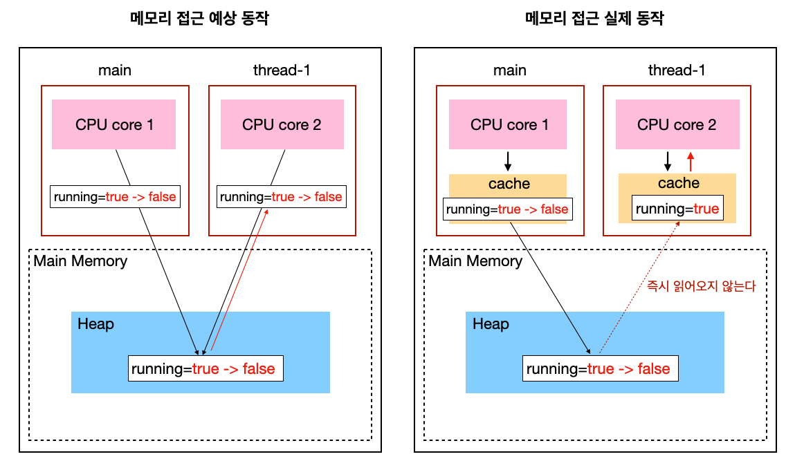
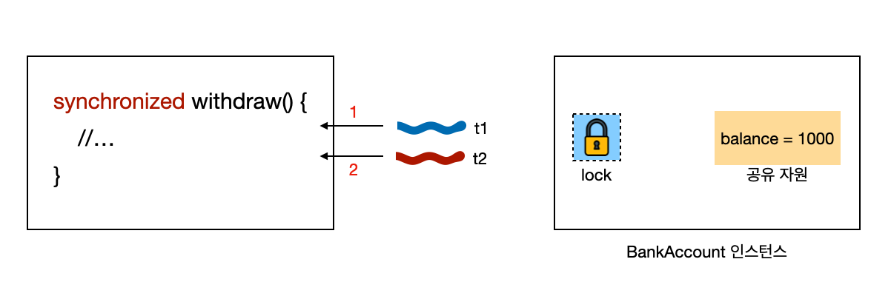
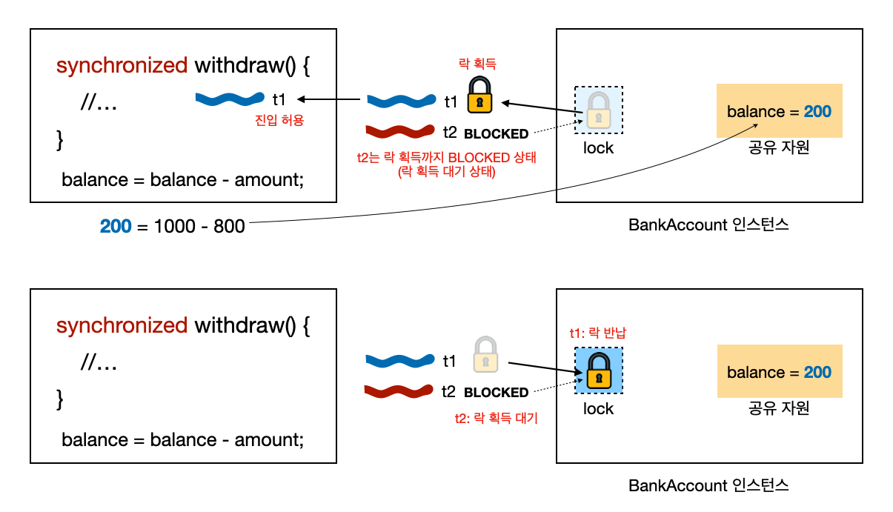
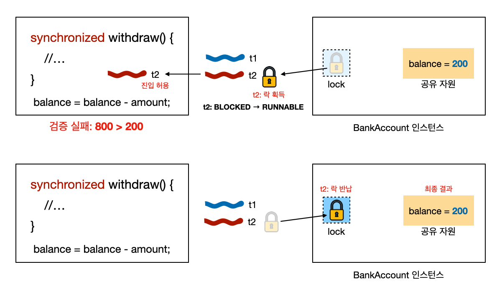
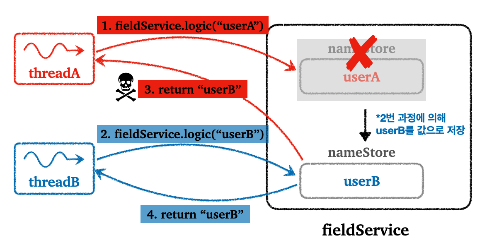
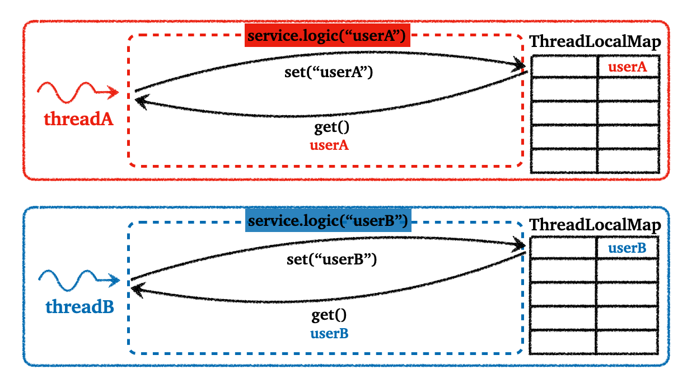
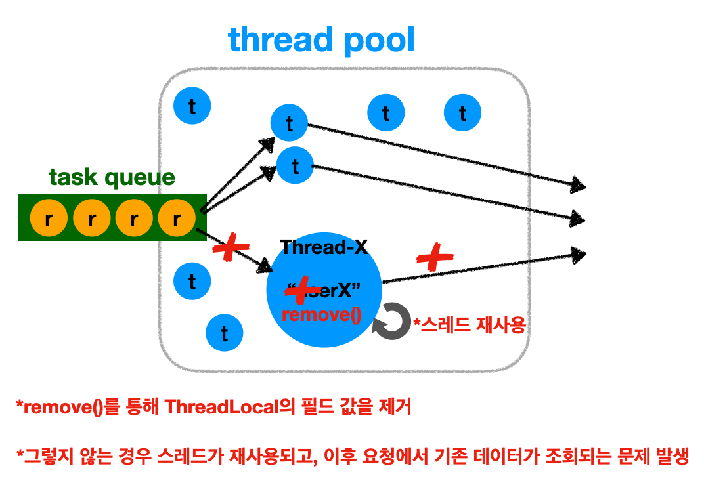

---

> 2024-08-01 내용 업데이트
{: .prompt-warning }


---

> **해당 포스트는 Lombok과 `@Slf4j`(Logback)를 사용한다**
>
> 로그는 `logstash-logback-encoder`를 통해 JSON 형태로 파싱하고 있다. 편의상 `version`, `level`, `levelValue` 필드를 제외하고 사용했다.
>
> 만약 로깅에 익숙하지 않다면 로깅 대신 `System.out`을 사용하면 된다.
{: .prompt-warning }

---

## 1. 메모리 가시성(Memory Visibility)

### 메모리 가시성 소개

메모리 가시성(visibility)은 **하나의 스레드에서 변경된 값이 다른 스레드에 올바르게 보이도록 보장하는 것을 의미**합니다. **자바의 메모리 모델(JMM, Java Memory Model)은 이러한 메모리 가시성을 관리하고 규정하는 역할**을 한다.

멀티스레드 환경에서 스레드들은 각각 자신만의 캐시나 CPU 레지스터에서 데이터를 읽고 쓸 수 있다. 이로 인해 메모리 가시성과 관련된 문제가 발생할 수 있다.

* **메모리 가시성 문제**

  - **캐시(cache) 일관성 문제:** 한 스레드가 공유 변수의 값을 변경하더라도, 다른 스레드가 이 값을 즉시 보지 못할 수 있다. 이는 **각 스레드가 자신만의 캐시에 데이터를 저장하고 이를 참조하기 때문**이다.

  - **순서 보장 부족:** 프로그램 내에서 변수의 쓰기 작업과 읽기 작업이 순서대로 일어나지 않을 수 있다. 즉, 한 스레드가 변수 값을 변경한 후 다른 스레드가 이를 읽는다고 해도, 기대한 대로 변경된 값이 보장되지 않을 수 있다.

<br>

---

### 메모리 가시성: 캐시 일관성 문제

메모리 가시성과 관련된 문제가 발생하는 상황을 예시를 통해 알아보자.

다음의 코드를 살펴보고, 실행해보자.

```java
@Slf4j
public class VisibilityProblemMain {

    public static void main(String[] args) {
        Task task = new Task();
        Thread worker = new Thread(task, "thread-1");
        log.info("running = {}", task.running);
        worker.start();

        ThreadUtils.sleep(1000); // 메인 스레드 1초 동안 대기

        log.info("메인 스레드에서 running을 false로 변경");
        task.running = false; // running 값을 false로 설정해 루프 탈출 시도

        log.info("running = {}", task.running);
        log.info("메인 종료");
    }

    static class Task implements Runnable {

        boolean running = true;

        public void run() {
            log.info("task 시작");
            while (running) {
                // 무한 루프: running이 false가 되면 루프를 빠져나와야 함.
            }
            log.info("task 종료");
        }
    }
}
```

* 메인 스레드에서 `running` 값을 로그로 찍어보면 `false`인 것을 확인할 수 있다 그러나 `thread-1` 스레드에서 

<br>

이 코드의 문제점은 하나의 스레드에서 변수의 값이 변경되더라도 다른 스레드가 이를 즉시 인지하지 못하는 **캐시 일관성 문제**가 발생한 것이다. 다음 그림을 통해 우리가 **예상하는 메모리 접근 방식과 실제 메모리 접근 방식의 차이**를 살펴보자.

<br>

_메모리 가시성: 캐시 일관성 문제_

* **예상하는 메모리 접근 동작**
  * 각 스레드에서 바로 메인 메모리의 `running`에 접근해서 읽기/쓰기를 진행하는 것
* **실제 메모리 접근 동작**
  * `main` 스레드와 `thread-1` 스레드는 메인 메모리에서 `running`의 초기값인 `true`를 읽는다
  * `running=true`를 각 스레드의 캐시 메모리에 보관한다
  * 이후 `main` 스레드에서 `running`을 `false`로 변경해도 해당 캐시 메모리에서만 변경된다
* **`main` 스레드의 캐시 메모리가 메인 메모리와 `thread-1` 스레드에 반영되는 시점은?**
  * CPU 설계 방식과 운영체제에 따라 다르기 때문에 **알 수 없다**!
  * 메인 메모리에 반영을 해도 `thread-1`에서 즉시 읽어오지 않을 수 있다

<br>

---

### 메모리 가시성 문제 해결: volatile

메모리 가시성 문제를 해결하기 위해서 **`volatile`이라는 키워드를 사용**할 수 있다.

`volatile`은 멀티스레드 프로그래밍 시 메모리 가시성을 보장하기 위해 사용되는 키워드이다. 이 키워드는 **변수에 적용되며, 특정 변수에 대해 스레드 간에 일관된 값을 유지하도록 하는 역할**을 한다. 이를 통해 스레드 간의 데이터 일관성 문제를 예방할 수 있다.

이전에 우리가 겪은 데이터 일관성 문제는 각 스레드에서 각 캐시 메모리에서 데이터를 접근했기 때문이다. 이에 대한 **해결방안은 단순히 메인 메모리에서 값을 직접 읽고 쓰면 되는 것**이다. `volatile` 키워드가 이런 기능을 제공해준다.

물론 캐시에서 접근해서 사용하는 것보다 느리기 때문에 **약간의 성능을 포기하는 대신 메모리 가시성을 보장**해준다고 생각하면 된다.

이전 코드에 `volatile`을 적용해보자.

<br>

```java
static class Task implements Runnable {

    volatile boolean running = true; // 단순히 volatile을 추가해주면 된다

    public void run() {
        log.info("task 시작");
        while (running) {
            // 메인 메모리에서 바로 접근해서 사용하기 때문에 이제 정상적으로 while문을 빠져나간다
        }
        log.info("task 종료");
    }
}
```

* `volatile boolean running`: 단순히 `volatile`을 추가해서 스레드 간에 `running`에 대한 메모리 가시성 문제를 해결할 수 있다

<br>

> **메모리 가시성 문제 해결**
>
> 뒤에서도 다루겠지만, **volatile** 또는 **스레드 동기화 기법(synchronized, ReentrantLock)**을 사용하면 메모리 가시성의 문제가 발생하지 않는다.
{: .prompt-info }

<br>

---

### 자바 메모리 모델(Java Memory Model): happens-before

자바 메모리 모델(Java Memory Model, JMM)은 **자바 프로그램에서 스레드가 메모리에 접근하고 공유하는 방식을 규정한 규칙과 개념의 집합**이다.

JMM의 개념 중에서도 **happens-before**라는 개념에 대해서 자세히 살펴보자.

<br>

**happens-before**

* 두 연산 간의 순서 관계를 규정하는 개념
* `happens-before` 관계에 있으면 한 동작이 다른 동작보다 먼저 발생함을 보장하고, 한 스레드의 작업을 다른 스레드에서 볼 수 있어야 한다.
  * 하나의 연산(A)이 다른 연산(B)보다 먼저 수행된다는 보장이 있다
  * A가 수행된 후의 모든 메모리 쓰기 연산은 B가 수행될 때 가시적이어야 한다. 즉, B는 A 이후의 메모리 상태를 반영한다.
* 쉽게 말해서, 한 스레드에서 수행한 작업을 다른 스레드가 참조할 때 최신 상태가 보장된다

<br>

이 관계가 중요한 이유는, 멀티스레드 프로그램에서 각 스레드가 데이터를 처리하는 순서와 그 데이터의 가시성이 매우 복잡할 수 있기 때문이다. `happens-before` 관계를 통해 이러한 복잡성을 관리하고, 개발자가 기대하는 대로 프로그램이 작동하도록 한다.

<br>

자바에서의 `happens-before` 관계는 다음과 같은 여러 규칙들로 정의된다.

1. **프로그램 순서 규칙**

   * 같은 스레드 내에서 발생하는 모든 연산은 **코드에 작성된 순서**대로 실행된다. 즉, 코드 상에서 앞에 있는 명령문은 뒤에 있는 명령문보다 먼저 실행된다고 보장할 수 있다.

   * ```java
     int a = 1;       // A
     int b = a + 1;   // B
     ```

   *  `A happens-before B`: `A`가 먼저 실행되고 그 결과가 `B`에 반영된다

2. **모니터 잠금 규칙**

   * 한 스레드가 `synchronized` 블록을 통해 객체에 대한 잠금을 해제하는 연산은 그 다음에 다른 스레드가 해당 객체에 대해 같은 잠금을 획득하는 연산보다 먼저 발생한다.

   * ```java
     class MonitorExample {
         private int counter = 0;
     
         public synchronized void increment() {   // A
             counter++;
         }
     
         public synchronized int getCounter() {   // B
             return counter;
         }
     }
     ```

   * `A happens-before B`: 스레드 1이 `increment()` 메서드를 호출하고 나서 잠금을 해제하면, 그 다음에 스레드 2가 `getCounter()` 메서드를 호출하여 잠금을 얻을 수 있다. 이때, 스레드 1의 `increment()` 메서드에서 `counter`에 대한 모든 변경 사항이 완료된 후에야, 스레드 2가 `getCounter()`를 통해 `counter` 값을 읽을 수 있다.

3. **`volatile` 변수 규칙**

   * 한 스레드에서 `volatile` 변수에 대한 쓰기 연산은 그 뒤에 다른 스레드에서 같은 `volatile` 변수를 읽는 연산보다 먼저 발생한다

   * ```java
     volatile boolean flag = false;   // 초기화
     
     // Thread 1
     flag = true;   // A
     
     // Thread 2
     if (flag) {    // B
         // 작업
     }
     ```

   * `A happens-before B`: 스레드 1이 `flag`를 `true`로 설정한 후, 스레드 2가 이를 인식한다

4. **스레드 시작 및 종료 규칙**

   * `Thread.start()` 호출은 새로 시작된 스레드에서 발생하는 모든 작업보다 먼저 발생한다
   * `Thread.join()` 호출은 해당 스레드의 모든 작업이 완료된 후에 반환된다

5. **전이 규칙(Transitivity Rule)**

   * `A happens-before B` 관계, `B happens-before C` 관계 → `A happens-before C` 관계

<br>

---

## 2. synchronized

> 공유 자원, 임계 영역, 등 동기화 문제 대한 기본적인 개념을 안다는 가정하에 진행된다.
>
> 동기화에 대해 [보러가기](https://seungki1011.github.io/posts/os-04-synchronization/)
{: .prompt-warning }

<br>

### synchronized 소개: BankAccount 예시

`synchronized`는 자바에서 멀티스레드 프로그래밍 시 동기화를 위해 사용하는 키워드이다. 자바에서 여러 스레드가 동시에 실행될 때, 공유 자원(예: 공유되는 변수, 객체)을 수정하거나 읽는 상황이 발생할 수 있다. 이 경우, 적절한 **동기화가 이루어지지 않으면 데이터 불일치, 레이스 조건(race condition) 같은 문제가 발생**할 수 있습니다.

`synchronized`는 이런 문제를 방지하기 위해 **임계 구역(critical section)**을 설정하여, **동시에 하나의 스레드만 해당 구역에 접근하도록 제한**한다. 이 구역에 접근하는 스레드는 객체의 모니터 락(Monitor Lock)을 획득해야 하며, **락을 획득한 스레드만이 임계 구역에서 작업을 수행**할 수 있다.

<br>

예시를 통해 알아보자. 계좌에서 출금하는 기능을 구현한다고 가정해보자.

```java
@Slf4j
public class BankAccount {
    private int balance; // 여러 스레드가 사용할 수 있는 공유 자원

    public BankAccount(int balance) {
        this.balance = balance;
    }

    public synchronized boolean withdraw(int amount) { // balance를 사용하는 임계 영역이 존재하기 때문에 synchronized 적용
        log.info("거래 시작: " + getClass().getSimpleName());

        log.info("[검증 시작] 출금액: " + amount + ", 잔액: " + balance);
        if (balance < amount) {
            log.info("[검증 실패] 출금액: " + amount + ", 잔액: " + balance);
            return false;
        }
        log.info("[검증 완료] 출금액: " + amount + ", 잔액: " + balance);
        ThreadUtils.sleep(1000);
        balance = balance - amount;
        log.info("[출금 완료] 출금액: " + amount + ", 잔액: " + balance);

        log.info("거래 종료");
        return true;
    }

    public synchronized int getBalance() { // balance를 사용하는 임계 영역이 존재하기 때문에 synchronized 적용
        return balance;
    }
}
```

* `balance`: 계좌의 잔액 - 공유 자원에 해당한다
* `withdraw(int amount)`: 명시한 금액 만큼 출금한다
  * 출금하기 전 검증을 진행한다
  * `출금액>잔액`: 검증 실패, `false` 반환
  * `출금액<잔액`: 검증 통과, 출금 진행, `true` 반환
* `getBalance()`: 잔액 반환
* `synchronized`
  * `withdraw()`, `getBalance()`에 추가된 키워드
  * 해당 메서드에는 공유 자원인 `balance`를 접근하는 임계 영역이 존재하기 때문에 `synchronized` 키워드를 붙여서 동기화 문제를 해결한다

<br>

```java
public class WithdrawTask implements Runnable {

    private BankAccount account;
    private int amount;

    public WithdrawTask(BankAccount account, int amount) {
        this.account = account;
        this.amount = amount;
    }

    @Override
    public void run() {
        account.withdraw(amount);
    }
}
```

* `account`: 출금할 계좌
* `amount`: 출금할 금액
* `account`와 `amount`를 받아서 스레드가 출금을 실행한다

<br>

```java
@Slf4j
public class BankMain {
    public static void main(String[] args) throws InterruptedException {
        BankAccount account = new BankAccount(1000);
        Thread t1 = new Thread(new WithdrawTask(account, 800), "t1");
        Thread t2 = new Thread(new WithdrawTask(account, 800), "t2");
        t1.start();
        t2.start();
        sleep(500); // 검증 완료까지 잠시 대기

        log.info("t1 state: " + t1.getState());
        log.info("t2 state: " + t2.getState());

        t1.join();
        t2.join();
        log.info("최종 잔액: " + account.getBalance());
    }
}
```

* **기대하는 결과**
  * `t1`에서 잔액 `1000`에서 `800`을 출금한다. 출금액이 잔액보다 적기 때문에 검증을 통과하고 성공적으로 출금된다.
  * `t2`에서 잔액 `200`에서 `800`을 출금한다. 출금액이 잔액보다 많기 때문에 검증을 실패하고 출금을 실패한다.
  * `synchronized`를 적용했기 때문에 기대한 결과대로 동작할 것이다.

<br>

로그를 살펴보면 기대한 대로 동작했다는 것을 확인할 수 있다.

```
{"@timestamp":"2024-07-15T15:06:35.387301+09:00","message":"거래 시작: BankAccount","thread_name":"t1"}
{"@timestamp":"2024-07-15T15:06:35.391551+09:00","message":"[검증 시작] 출금액: 800, 잔액: 1000","thread_name":"t1"}
{"@timestamp":"2024-07-15T15:06:35.391732+09:00","message":"[검증 완료] 출금액: 800, 잔액: 1000","thread_name":"t1"}
{"@timestamp":"2024-07-15T15:06:35.893826+09:00","message":"t1 state: TIMED_WAITING","thread_name":"main"}
{"@timestamp":"2024-07-15T15:06:35.894948+09:00","message":"t2 state: BLOCKED","thread_name":"main"}
{"@timestamp":"2024-07-15T15:06:36.397629+09:00","message":"[출금 완료] 출금액: 800, 잔액: 200","thread_name":"t1"}
{"@timestamp":"2024-07-15T15:06:36.398562+09:00","message":"거래 종료","thread_name":"t1"}
{"@timestamp":"2024-07-15T15:06:36.399215+09:00","message":"거래 시작: BankAccount","thread_name":"t2"}
{"@timestamp":"2024-07-15T15:06:36.400023+09:00","message":"[검증 시작] 출금액: 800, 잔액: 200","thread_name":"t2"}
{"@timestamp":"2024-07-15T15:06:36.40077+09:00","message":"[검증 실패] 출금액: 800, 잔액: 200","thread_name":"t2"}
{"@timestamp":"2024-07-15T15:06:36.401217+09:00","message":"최종 잔액: 200","thread_name":"main"}
```

<br>

---

### synchronized 동작 과정

위의 `synchronized` 예시에 대한 동작 과정을 살펴보자.

먼저 `synchronized`의 기본 개념은 다음과 같다.


<br>

`t1`, `t2` 스레드가 `synchronized` 메서드에 접근하고 락을 얻고 반환하는 과정을 그림을 통해 살펴보자.

<br>

_monitor lock_

* 모든 객체는 내부에 **모니터 락(monitor lock)**을 가지고 있다
* 스레드가 `synchronized` 키워드가 붙은 메서드에 진입하기 위해서는 반드시 해당 객체의 락이 있어야 한다
  * 스레드가 `BankAccount` 인스턴스의 `synchronized withdraw()`를 호출할 때, 해당 인스턴스의 락을 획득해야지만 `withdraw()`에 진입할 수 있다

<br>

_t1 스레드 락 획득_

* **동작 순서**
  * `t1` 부터 실행되는 경우 `t1` 부터 `synchronized`가 붙은 메서드 `withdraw()`를 호출한다
  * `t1` 스레드에서 해당 메서드에 진입하기 위해서는 해당 인스턴스(`BankAccount` 인스턴스)의 락을 획득해야 한다
  * 현재 `BankAccount` 인스턴스의 락이 존재하기 때문에, `t1`에서 해당 락을 획득한다
    * 이때 `t2`도 락 획득을 시도하지만 `BankAccount` 인스턴스에는 락이 존재하지 않기 때문에 실패한다
    * `t2`는 락을 획득하기 전 까지 **BLOCKED** 상태로 대기한다(락 획득을 대기하는 상태)
  * `t1`이 락을 획득했기 때문에 이제 `withdraw()`에 진입할 수 있다
  * `t1`은 스레드에 정의한 로직을 수행한다
    * 예시의 경우 `800`을 출금하는 로직이다
    * 검증을 통과하고 성공적으로 출금한다
    * 결과 `balance`를 반영한다
  * 모든 작업이 끝나면 `t1`은 락을 반납한다

<br>

_t2 스레드 락 획득_

* **동작 순서**
  * 반납된 락을 **BLOCKED** 상태의 `t2`가 자동으로 획득한다
    * `t2`의 상태는 **BLOCKED**에서 **RUNNABLE**로 변경된다
  * `t2`가 락을 가지고 있기 때문에 `withdraw()`에 진입할 수 있다
  * 스레드의 로직을 수행한다
    * `t2`의 경우 `800` 출금을 시도하지만, 잔액이 부족해서 검증에 실패한다
    * 출금에 실패한다
  * `t2`는 락을 반납한다
  * **최종 결과**
    * `t1` 800원 출금 완료
    * `t2` 잔액 부족으로 출금 실패
    * 최종 `balance`는 200원

<br>

> **락 획득 순서는 보장되지 않는다**
>
> 다수의 스레드가 `withdraw()`를 호출했을 때, 오로직 1개의 스레드만이 락을 획득한다. 나머지 스레드는 대기한다. 어느 스레드가 락을 획득하는지는 보장되지 않는다. 
{: .prompt-info }

<br>

---

### synchronized 블럭 설정

`synchronized`의 가장 큰 단점은 **임계 영역에 하나의 스레드만 접근**할 수 있다는 것이다. **여러 스레드가 동시에 실행할 수 없기 때문에, 성능이 떨어진다**.

사실 이는 대부분 동기화 기법들이 지니고 있는 한계이다. 동기화의 보장을 위해 성능을 포기하는 트레이드-오프로 보면 된다. `synchronized`를 최대한 효율적으로 사용하기 위해서는 정말 필요한 곳(임계 영역)에만 `synchronized`를 적용해야 한다. 우리가 이전에 메서드 레벨에 적용한 방법은 간편하지만, `synchronized`가 필요없는 코드 영역까지 동기화를 적용할 확률이 높다.

자바는 메서드 전체가 아닌, 특정 코드 블록만 동기화할 수 있는 기능을 제공한다. 이 방법은 **동기화가 필요한 코드만 임계 구역으로 설정하여 성능을 최적화**할 수 있도록 한다.

사용법을 알아보자.

<br>

이전 예시에서 사용한 `withdraw()`에 `synchronized` 블럭을 적용하자.

```java
public boolean withdraw(int amount) { // 메서드 레벨의 synchronized 제거
    log.info("거래 시작: " + getClass().getSimpleName());
    
    // 임계 영역 시작(balance를 사용하는 영역) - synchronized 블럭을 적용한다
    synchronized (this) {
        log.info("[검증 시작] 출금액: " + amount + ", 잔액: " + balance);
        if (balance < amount) {
            log.info("[검증 실패] 출금액: " + amount + ", 잔액: " + balance);
            return false;
        }
        log.info("[검증 완료] 출금액: " + amount + ", 잔액: " + balance);
        ThreadUtils.sleep(1000);
        balance = balance - amount;
        log.info("[출금 완료] 출금액: " + amount + ", 잔액: " + balance);
    }
    // 임계 영역 종료
    
    log.info("거래 종료");
    return true;
}
```

* 메서드 레벨의 `synchronized`는 제거한다
* 임계 영역만 `synchronized (this) {...}`로 감싼다
* `synchronized ()`의 `()` 안에는 락을 획득할 인스턴스의 참조를 명시하면 된다
  * `this`: 이 인스턴스의 참조

<br>

---

### 인스턴스 레벨 동기화 vs 클래스 레벨 동기화

`synchronized`는 클래스 레벨과 인스턴스 레벨에서 다르게 동작한다.

<br>

```java
public class Counter {
    private int count = 0;

    public synchronized void increment() { // 인스턴스 메서드 동기화
        count++;
    }

    public synchronized int getCount() { // 인스턴스 메서드 동기화
        return count;
    }
}
```

* **인스턴스 메서드 동기화**
  * 일반적으로 `synchronized` 메서드는 인스턴스 레벨에서 동작한다. 즉, 각 객체 인스턴스마다 별도의 모니터 락이 존재한다.
  * 같은 객체의 메서드는 하나의 스레드만 접근할 수 있지만, 다른 인스턴스는 해당 메서드에 동시에 접근할 수 있다.
  * 인스턴스 변수(필드) 또는 인스턴스별 상태를 보호해야 할 때 사용

<br>

```java
public class Singleton {
    private static Singleton instance;

    private Singleton() {}

    public static synchronized Singleton getInstance() {  // 정적 메서드 동기화(클래스 레벨 동기화)
        if (instance == null) {
            instance = new Singleton();
        }
        return instance;
    }
}
```

* **정적 메서드 동기화**
  * **정적 메서드 동기화**는 클래스 단위에서 동기화를 처리한다
  * `synchronized` 키워드를 정적 메서드에 사용하면, 그 메서드가 실행되는 동안 **해당 클래스의 클래스 객체(Class Object) 모니터 락**이 걸리게 된다.
  * 클래스 레벨에서 동기화가 이루어지므로, 이 클래스의 모든 인스턴스가 공유하는 자원에 대해 동기화가 필요할 때 사용한다.
  * 클래스 자체가 관리하는 정적 변수(static variable) 또는 클래스 전역 상태를 보호해야 할 때 사용

<br>

---

## 3. java.util.concurrent 패키지

### java.util.concurrent 소개

`synchronized`는 매우 편리한 동기화 기법이지만, 다음과 같은 한계를 지니고 있다.

* **성능 저하**
  * **락 경합**: `synchronized`는 락을 기반으로 작동하며, 여러 스레드가 동시에 동기화된 메서드나 블록에 접근하려고 하면 락 경합(lock contention)이 발생할 수 있다. 이로 인해 스레드가 대기 상태에 머물게 되어 성능 저하가 발생할 수 있다.
  * **블로킹 동작(무한 대기)**: `synchronized`는 블로킹 방식으로 동작하므로, 한 스레드가 락을 획득하고 있을 때 다른 스레드들은 해당 락이 해제될 때까지 기다려야 한다. 이로 인해 전체 시스템의 응답성이 떨어질 수 있다.
* **유연성 부족**
  * **타임아웃 설정 불가**: `synchronized`는 락을 시도할 때 타임아웃을 설정할 수 없다. 즉, 스레드가 락을 얻기 위해 무기한 대기할 수밖에 없다. 반면에, `ReentrantLock` 같은 클래스는 타임아웃을 설정하여 일정 시간 동안만 락을 시도하도록 할 수 있다.
* **인터럽트 불가**
  * **인터럽트 처리 제한**: `synchronized`는 인터럽트가 발생했을 때 이를 처리할 수 없다. 인터럽트가 발생해도 락 대기 상태는 지속되며, 스레드는 중단되지 않고 계속 대기한다. 반면에, `ReentrantLock`은 `lockInterruptibly()` 메서드를 통해 인터럽트 발생 시 락 대기에서 벗어날 수 있다.
* **공정성 설정 불가**
  * **공정성(fairness) 설정 불가**: `synchronized`는 기본적으로 비공정한 락을 사용한다. 이는 락을 기다리는 스레드가 무작위로 선택될 수 있다는 것을 의미하며, 오랫동안 기다린 스레드가 락을 얻지 못할 가능성이 있다. 반면에, `ReentrantLock`은 공정성(fairness)을 설정할 수 있는 옵션을 제공하여, 락을 가장 오래 기다린 스레드가 먼저 획득할 수 있도록 할 수 있다.

<br>

더 유연한 제어가 가능한 방법을 제공해주기 위해서 자바 1.5 부터 `java.util.concurrent`라는 동시성 문제 해결을 위한 패키지가 추가되었다.

<br>

---

### LockSupport

`LockSupport`는 자바의 `java.util.concurrent.locks` 패키지에 포함된 유틸리티 클래스이다. 이 클래스는 스레드의 중단 및 재개를 직접적으로 제어할 수 있는 메서드를 제공한다. `LockSupport`를 사용해서 스레드를 **WAITING** 상태로 변경할 수 있다. **WAITING** 상태는 누가 깨워주기 전까지 계속 대기한다. CPU 스케쥴링에도 포함되지 않는다.

대표적인 기능은 다음과 같다.

* **`park()`**
  * 현재 스레드를 중단한다
  * 이 메서드가 호출된 스레드는 깨어나기 전까지 실행을 멈추고 **WAITING**(대기) 상태에 들어간다
* **`parkNanos(nanos)`**
  * 스레드를 지정한 나노초 동안 **TIMED_WAITING** 상태로 변경한다
  * 지정한 나노초가 지나면 다시 **RUNNABLE** 상태로 변경된다
* **`unpark(thread)`**
  * 인자로 전달된 스레드를 깨워서(재개시켜서) 실행을 다시 시작하게 만든다(**RUNNABLE** 상태로 변경한다)

<br>

예시를 통해 사용법을 알아보자.

```java
@Slf4j
public class LockSupportMain {
    public static void main(String[] args) {
        // 현재 실행 중인 메인 스레드를 참조
        Thread mainThread = Thread.currentThread();

        log.info("메인 스레드 시작...");

        // 새로운 스레드를 생성하고 시작
        Thread workerThread = new Thread(() -> {
            log.info("Worker 스레드 시작...");
            ThreadUtils.sleep(2000);

            log.info("메인 스레드 재개 전 상태: {}", mainThread.getState());
            log.info("unpark(mainThread): 메인 스레드를 깨운다.");
            LockSupport.unpark(mainThread); // 메인 스레드를 깨움(메인 스레드를 다시 RUNNABLE 상태로 변경)
            log.info("Worker 스레드 종료...");
        }, "worker");

        workerThread.start(); // worker 스레드 시작

        log.info("메인 스레드 대기 전 상태: {}", mainThread.getState());
        log.info("park(): 메인 스레드 대기.");
        LockSupport.park(); // 메인 스레드 중단, 워커 스레드가 깨울 때까지 대기(WAITING 상태로 변경)
        log.info("메인 스레드 재개...");
        log.info("메인 스레드 재개 후 상태: {}", mainThread.getState());
    }
}
```

* `worker` 스레드에서 일정 시간을 `sleep()`하고 이후에 메인 스레드를 `unpark()`를 통해 **RUNNABLE** 상태로 변경한다
* `main`에서는 `park()`를 통해 메인 스레드를 **WATIING** 상태로 변경한다
* 동작 순서는 다음과 같다
  * 메인 스레드의 초기 상태는 **RUNNABLE**
  * `worker` 스레드 시작
  * `worker` 스레드의 `sleep(2000)` 동안 `main`의 로직 진행
    * `main`에서 `park()`: 메인 스레드는 대기 상태로 변경된다(**RUNNABLE** → **WAITING**)
  * 2초 지나면 `worker` 스레드 로직 다시 진행
    * `unpark(mainThread)`: 메인 스레드를 깨운다(**WAITING** → **RUNNABLE**)

<br>

> `parkNanos(nanos)`의 사용법도 위와 비슷하다. 단지 지정한 시간 이후에 스레드가 무조건 깨어난다는 것이 차이있다.
{: .prompt-info }

<br>

> **BLOCKED** vs **WAITING**
>
> **BLOCKED**, **WAITING** , **TIMED_WAITING** 상태 모두 스레드가 대기하며, 실행 스케줄링에 들어가지 않기 때문에, CPU 입장에서 보면 실행하지 않는 비슷한 상태이다.
>
> * **BLOCKED** 상태는 `synchronized` 에서만 사용하는 특별한 대기 상태라고 이해하면 편하다
>   * 인터럽트가 걸려도 대기 상태를 빠져나오지 못한다
> * 반면에 **WAITING** , **TIMED_WAITING** 상태는 범용적으로 활용할 수 있는 대기 상태라고 이해하면 편하다
>   * 인터럽트가 걸리면 대기 상태를 빠져나온다(**RUNNABLE** 상태로 변한다)
    {: .prompt-info }

<br>

`synchronized`의 문제 중 하나는 **BLOCKED**의 사용 때문에 발생하는 무기한 대기였다. `LockSupport`를 사용하면 **특정 시간까지만 대기할 수 있는 `parkNanos()`**, 또는 **인터럽트를 걸어서 중간에 깨울 수 있다**. 이를 통해 `synchronized`의 **무기한 대기 문제를 해결**할 수 있다.

<br>

---

## 4. ReentrantLock

### Lock 인터페이스 소개

기존 `LockSupport`의 문제는, `LockSupport`를 사용하기 위해서는 상대적으로 저수준에서 락을 구현해야한다. 이는 **개발자들에게 귀찮고, 휴먼 에러가 발생할 확률이 증가**한다.

자바는 이런 문제를 해결하기 위해서 `Lock`이라는 인터페이스와 `ReentrantLock`과 같은 구현체를 제공해준다. **`ReentrantLock`은 고수준에서 기능을 제공하면서 기존 `synchronized`의 단점도 극복**할 수 있도록 해준다.

<br>

`Lock` 인터페이스

```java
public interface Lock {
     void lock();
     void lockInterruptibly() throws InterruptedException;
     boolean tryLock();
     boolean tryLock(long time, TimeUnit unit) throws InterruptedException;
     void unlock();
     Condition newCondition();
}
```

* **`void lock()`**
  - 락을 획득한다
  - 만약 다른 스레드가 이미 락을 보유하고 있다면, 락이 해제될 때까지 현재 스레드는 대기(**WAITING**)한다
  - 인터럽트에 응답하지 않는다

* **`void lockInterruptibly()`**
  - 락을 획득을 시도하되, 다른 스레드가 인터럽트할 수 있도록 한다
  - 다른 스레드가 락을 획득한 경우, 현재 스레드는 락 획득 전까지 대기한다
  - 대기 중에 인터럽트가 발생할 경우 `InterruptedException`이 발생하고 대기를 중단할 수 있다(락 획득을 포기한다)
    - 스레드가 인터럽트 상태일 때도 락 획득을 시도할 수 있도록 허용한다

* **`boolean tryLock()`**
  - 락 획득을 시도한다
  - **성공 여부 즉시 반환**: 락을 획득할 수 있으면 즉시 `true`를 반환하고, 그렇지 않으면 `false`를 반환한다

* **`boolean tryLock(long time, TimeUnit unit)`**
  - 주어진 시간 동안 락 획득을 시도한다
    - 타임아웃이 있는 락 획득 시도로, 지정된 시간 동안만 대기합니다
  - 해당 시간 내에 락을 획득할 수 있으면 `true`를 반환하고, 시간이 초과되면 `false`를 반환합니다
  - 대기 중에 인터럽트가 발생할 경우 `InterruptedException`이 발생하고 대기를 중단한다

* **`void unlock()`**
  - 락을 해제한다
  - 락을 획득한 스레드만이 이 메서드를 호출할 수 있다
  - 이 메서드를 호출하지 않으면 다른 스레드가 해당 자원에 접근하지 못하는 교착 상태가 발생할 수 있다

* **`Condition newCondition()`**
  - 락과 연계된 새로운 `Condition` 객체를 생성한다
  - 락과 결합되어 사용되며, 스레드가 특정 조건을 기다리거나 신호를 받을 수 있도록 한다
    - `Condition` 객체는 특정 조건을 대기하거나 신호를 보내는 데 사용되며, 고급 동기화 기능을 제공한다

<br>

---

### ReentrantLock: 공정성 옵션

`ReentrantLock`은 `Lock` 인터페이스의 가장 일반적인 구현체로, **재진입 가능한 락을 제공하여, 동일한 스레드가 여러 번 락을 획득할 수 있게 한다**. `synchronized`와 유사하지만, 더 많은 기능을 제공한다(예: 타임아웃, 공정성 설정 등).

`ReentrantLock`은 기존 `synchronized`의 **공정성(fairness) 문제를 해결**할 수 있다. `ReentrantLock`은 **공정 모드**와 **비공정 모드**로 설정할 수 있으며, 이 두 모드는 락을 획득 하는 방식에서 차이가 있다. (`ReentrantLock`은 기본적으로 비공정 모드이다)

<br>

```java
public class ReentrantLockEx { 
    // 비공정 모드 락
    private final Lock nonFairLock = new ReentrantLock(); // 락 생성
    // 공정 모드 락
    private final Lock fairLock = new ReentrantLock(true);
  
    public void nonFairLockTest() {
        nonFairLock.lock(); // 락을 건다
        try {
            // 임계 영역 
        } finally {
            nonFairLock.unlock(); // 락을 해제한다
        }
    }
  
    public void fairLockTest() {
        fairLock.lock(); // 락을 건다
        try {
            // 임계 영역
        } finally {
            fairLock.unlock(); // 락을 해제한다
        } 
    }
}
```

* **비공정 모드**
  * `new ReentrantLock()`
  * `ReentrantLock`의 기본 모드
  * 락을 먼저 요청한 스레드가 락을 먼저 획득한다는 보장이 없다(대기 중인 아무 스레드가 락을 획득할 수 있다)
  * **성능 우선**: 락을 획득하는 속도가 상대적으로 빠르다
  * **선점 가능**: 새로운 스레드가 기존 대기 스레드보다 먼저 락을 획득할 수 있다
  * **단점**
    * **기아 현상(starvation) 가능성**: 특정 스레드가 계속해서 락을 획득하지 못할 수 있다

* **공정 모드**
  * `new ReentrantLock(true)`: 생성자에 `true`를 전달해서 사용한다
  * 락을 요청한 순서대로 스레드가 락을 획득한다(먼저 대기한 스레드가 먼저 락을 획득한다)
    * 공정성을 보장한다
  * **공정성 보장**: 대기 큐에서 먼저 대기한 스레드가 락을 우선 획득한다
  * **기아 현상 방지**: 모든 스레드는 언젠가는 락을 획득하도록 보장한다
  * **단점**
    * **성능 저하**: 락을 획득하는 속도가 느릴 수 있다

<br>

---

### ReentrantLock: 사용 예시

`synchronized`에서 사용한 `BankAccount`를 `synchronized` 대신 `ReentrantLock`을 적용해보자.

```java
@Slf4j
public class BankAccount {
    private int balance; // 여러 스레드가 사용할 수 있는 공유 자원
    
    private final Lock lock = new ReentrantLock(); // ReentrantLock 생성  
  
    public BankAccount(int balance) {
        this.balance = balance;
    }

    public boolean withdraw(int amount) { // 메서드 레벨의 synchronized 사용 x
        log.info("거래 시작: " + getClass().getSimpleName());
        
        lock.lock(); // ReentrantLock으로 lock 걸기
        try {
            // 임계 영역 시작 - synchronized 블럭을 사용하는 대신 ReentrantLock 사용
            log.info("[검증 시작] 출금액: " + amount + ", 잔액: " + balance);
            if (balance < amount) {
                log.info("[검증 실패] 출금액: " + amount + ", 잔액: " + balance);
                return false;
            }
            log.info("[검증 완료] 출금액: " + amount + ", 잔액: " + balance);
            ThreadUtils.sleep(1000);
            balance = balance - amount;
            log.info("[출금 완료] 출금액: " + amount + ", 잔액: " + balance);
            // 임계 영역 종료
        } finally {
            lock.unlock(); // lock 해제
        }
      
        log.info("거래 종료");
        return true;
    }

    public int getBalance() {
        lock.lock(); // ReentrantLock으로 lock 걸기
        try {
            return balance;
        } finally {
            lock.unlock(); // lock 해제
        }
    }
}
```

* `lock.lock()`: `ReentrantLock`을 사용해서 락을 건다
* `lock.lock()` ~ `lock.unlock()` 까지의 임계 영역은 동기화 처리 된다
* **`unlock()`으로 반드시 락 반납을 해야한다**
  * `finally` 블럭에 작성하도록 한다!

<br>

---

### ReentrantLock: 대기 중단 (tryLock())

`ReentrantLock`을 사용해서 **락을 무기한 대기하지 말고, 중간에 빠져나가도록 사용**해보자. 해당 기능은 **`tryLock()`을 통해서 사용**할 수 있다.

이잔의 `Lock` 인터페이스의 `tryLock()` 메서드를 다시 복습해보자.

* **`boolean tryLock()`**
  - 락 획득을 시도한다
  - **성공 여부 즉시 반환**: 락을 획득할 수 있으면 즉시 `true`를 반환하고, 그렇지 않으면 `false`를 반환한다

* **`boolean tryLock(long time, TimeUnit unit)`**
  - 주어진 시간 동안 락 획득을 시도한다
    - 타임아웃이 있는 락 획득 시도로, 지정된 시간 동안만 대기합니다
  - 해당 시간 내에 락을 획득할 수 있으면 `true`를 반환하고, 시간이 초과되면 `false`를 반환합니다
  - 대기 중에 인터럽트가 발생할 경우 `InterruptedException`이 발생하고 대기를 중단한다

<br>

이전의 `BankAccount` 예시에 적용해보자.

```java
@Slf4j
public class TryLockBankAccount {
    private int balance;

    private final Lock lock = new ReentrantLock(); // ReentrantLock 생성

    public TryLockBankAccount(int balance) {
        this.balance = balance;
    }


    public boolean withdraw(int amount) {
        log.info("거래 시작: " + getClass().getSimpleName());

        try {
            // 락을 획득 못하면 0.5초 대기, 대기 이후 획득 못하면 false 반환
            if (!lock.tryLock(500, TimeUnit.MILLISECONDS)) { 
                log.info("[락 획득 실패] 이미 처리 중인 작업 존재");
                return false;
            }
        } catch (InterruptedException e) {
            throw new RuntimeException();
        }

        try {
            log.info("[검증 시작] 출금액: " + amount + ", 잔액: " + balance);
            if (balance < amount) {
                log.info("[검증 실패] 출금액: " + amount + ", 잔액: " + balance);
                return false;
            }
            log.info("[검증 완료] 출금액: " + amount + ", 잔액: " + balance);
            ThreadUtils.sleep(1000);
            balance = balance - amount;
            log.info("[출금 완료] 출금액: " + amount + ", 잔액: " + balance);
        } finally {
            lock.unlock(); // lock 해제
        }

        log.info("거래 종료");
        return true;
    }

    public int getBalance() {
        lock.lock();
        try {
            return balance;
        } finally {
            lock.unlock();
        }
    }
}
```

* **`tryLock(500, TimeUnit.MILLISECONDS)`**
  *  락을 획득 못하면 `500ms` 대기, 대기 이후 획득 못하면 `false` 반환
  * 스레드는 대기하는 동안 **TIMED_WAITING** 상태

<br>

```java
@Slf4j
public class BankMain {
    public static void main(String[] args) throws InterruptedException {
        TryLockBankAccount account = new TryLockBankAccount(1000);
        Thread t1 = new Thread(new WithdrawTask(account, 800), "t1");
        Thread t2 = new Thread(new WithdrawTask(account, 800), "t2");
        t1.start();
        t2.start();
        sleep(500); // 검증 완료까지 잠시 대기

        log.info("t1 state: " + t1.getState());
        log.info("t2 state: " + t2.getState());

        t1.join();
        t2.join();
        log.info("최종 잔액: " + account.getBalance());
    }
}
```

```
{"@timestamp":"2024-07-15T02:38:46.471709+09:00","message":"거래 시작: TryLockBankAccount","thread_name":"t2"}
{"@timestamp":"2024-07-15T02:38:46.471707+09:00","message":"거래 시작: TryLockBankAccount","thread_name":"t1"}
{"@timestamp":"2024-07-15T02:38:46.482377+09:00","message":"[검증 시작] 출금액: 800, 잔액: 1000","thread_name":"t1"}
{"@timestamp":"2024-07-15T02:38:46.482618+09:00","message":"[검증 완료] 출금액: 800, 잔액: 1000","thread_name":"t1"}
{"@timestamp":"2024-07-15T02:38:46.97715+09:00","message":"t1 state: TIMED_WAITING","thread_name":"main"}
{"@timestamp":"2024-07-15T02:38:46.978676+09:00","message":"t2 state: TIMED_WAITING","thread_name":"main"}
{"@timestamp":"2024-07-15T02:38:46.982737+09:00","message":"[락 획득 실패] 이미 처리 중인 작업 존재","thread_name":"t2"}
{"@timestamp":"2024-07-15T02:38:47.488545+09:00","message":"[출금 완료] 출금액: 800, 잔액: 200","thread_name":"t1"}
{"@timestamp":"2024-07-15T02:38:47.489102+09:00","message":"거래 종료","thread_name":"t1"}
{"@timestamp":"2024-07-15T02:38:47.48954+09:00","message":"최종 잔액: 200","thread_name":"main"}
```

* `t1: tryLock(500, TimeUnit.MILLISECONDS)`: `t1` 이 먼저 락을 획득하고 임계 영역의 작업을 수행
  * `t1`은 `sleep(1000)` 동안 **TIMED_WAITING** 상태
* `t2: tryLock(500, TimeUnit.MILLISECONDS)`: `t2`가 락 획득을 시도하지만 실패하고 `500ms`를 대기한다
  * `t2`는 대기 상태(**TIMED_WAITING**): 내부에서 `LockSupport.parkNanos(t)`가 호출되도록 구현되어 있다
* `t2`가 `500ms` 대기하는 동안 락 획득을 못하는 경우 `false` 반환
  * `t2`는 **TIMED_WAITING**에서 **RUNNABLE** 상태로 변경
* `t1`은 임계 영역의 작업을 모두 완료하고 락 반납

<br>

> **`tryLock()`**
>
> 락을 획득할 수 없으면 바로 포기하고 대기하지 않는다. 즉시 `false`를 반환한다.
{: .prompt-info }

<br>


---

## 5. ThreadLocal

### 동시성 문제

동일한 객체의 필드에 여러 스레드가 접근하고 조회하면서 생기는 문제에 대해서 알아보자.

다음 코드를 살펴보자.

<br>

`FieldService`

```java
@Slf4j
public class FieldService {

    private String nameStore;

    public String logic(String name) {
        log.info("Stored name = {} -> nameStore = {}", name, nameStore);
        nameStore = name;
        SleepUtil.sleep(1000);
        log.info("Found nameStore = {}", nameStore);
        return nameStore;
    }
}
```

* `FieldService`라는 클래스의 `logic()`은 넘어온 파라미터(`name`)를 `nameStore`라는 필드에 저장한다. 그 후 `sleep(1000)`을 통해서 1초 대기하고 `nameStore`를 반환하다
* `sleep()`은 따로 `SleepUtil` 클래스를 만들어서 `try-catch`를 처리했다

<br>

이제 `FieldService`라는 클래스의 인스턴스를 생성하고, 두 스레드가 이용하는 경우를 살펴보자.

<br>

`FieldServiceTest`

```java
@Slf4j
public class FieldServiceTest {

    private FieldService fieldService = new FieldService();

    @Test
    void field() {
        log.info("Main thread start!");
				
        // Runnable 인터페이스를 통해서 스레드를 구현
        Runnable userA = () -> {
            fieldService.logic("userA");
        };

        Runnable userB = () -> {
            fieldService.logic("userB");
        };

        Thread threadA = new Thread(userA);
        threadA.setName("threadA");
        Thread threadB = new Thread(userB);
        threadA.setName("threadB");
        
        // 스레드A 시작
        threadA.start();
        //SleepUtil.sleep(2000); // 동시성 문제 발생 x
        SleepUtil.sleep(200); // 동시성 문제 발생 o
        // 스레드B 시작
        threadB.start();

        SleepUtil.sleep(3000); // Main thread 종료 대기
        log.info("Main Exit!");
    }
}
```

```
02:20:54.319 [Test worker] INFO FieldServiceTest -- Main thread start!
02:20:54.321 [threadA] INFO FieldService -- Stored name = userA -> nameStore = null
02:20:54.522 [threadB] INFO FieldService -- Stored name = userB -> nameStore = userA
02:20:56.327 [threadA] INFO FieldService -- Found nameStore = userB
02:20:56.527 [threadB] INFO FieldService -- Found nameStore = userB
02:20:57.526 [Test worker] INFO FieldServiceTest -- Main Exit!
```

* `FieldService`의 인스턴스인 `fieldService`를 통해서 두 스레드 `threadA`, `threadB`가 각각 `userA`, `userB`라는 파라미터를 넘기고 있다
* 동작 순서
  * `threadA` 시작
  * `"userA"`를 인스턴스의 필드인 `nameStore`에 저장
  * `threadA`는 아직 처리중(`sleep()`)
  * `threadB` 시작
  * `"userB"`를 인스턴스의 필드인 `nameStore`에 저장 (기존 `"userA"`→`"userB"`)
  * `threadA`에서 `nameStore` 조회 : `userB`를 받음
  * `threadB`에서 `nameStore` 조회 : `userB`를 받음

<br>

여기서 문제는, **로직의 동작 의도는 `threadA`에서 `userA`를 조회해야 하지만, `userB`를 조회했다는 것**이다. 이것이 **멀티 스레드에서 공통으로 사용하는 인스턴스의 필드에 접근시 격게되는 동시성 문제**이다. 다음 그림을 통해서 문제를 다시 한번 살펴보자.

<br>

 _동시성 문제_


위 그림에서도 살펴볼 수 있듯이, 다수의 스레드에서 객체의 필드에 접근해서 사용하게 되면, 의도하지 않는 결과를 만들어낼 수 있다.(`threadA`에서 `userB` 값을 조회)

이런 동시성 문제는 싱글톤 패턴 처럼 공통으로 사용하는 객체가 있거나, `static`과 같은 공용 필드에 값을 변경하기 때문에 발생한다.(값을 읽기만 하는 경우 발생하지 않는다) 

이런 문제를 해결하기 위해서 자바는 `ThreadLocal` 클래스를 제공한다.

<br>

---

### ThreadLocal을 통해 문제 해결

자바가 제공하는 `java.lang.ThreadLocal` 클래스를 사용해보자.

들어가기에 앞서, 스레드 로컬의 기능을 아주 간단히 설명하자면 **스레드 로컬을 사용하면 스레드 별로 별도의 내부 저장소를 제공**한다. 스레드 별로 존재하기 때문에, **같은 인스턴스의 스레드 로컬 필드에 접근해도, 별도로 저장하기 때문에 안전**하다. 예시와 그림을 통해서 더 자세히 알아보자.

<br>

`ThreadLocalService`

```java
@Slf4j
public class ThreadLocalService {
    private ThreadLocal<String> nameStore = new ThreadLocal<>();

    public String logic(String name) {
        log.info("Stored name = {} -> nameStore = {}", name, nameStore.get());
        nameStore.set(name);
        SleepUtil.sleep(1000);
        log.info("Found nameStore = {}", nameStore.get());
        return nameStore.get();
    }
}
```

* `set(value)` : 값 저장
  * 현재 스레드 기준으로 `ThreadLocalMap` 객체에 값을 저장한다(없다면 생성)
* `get()` : 값 조회
  * 현재 스레드 기준으로 `ThreadLocalMap` 객체에 저장된 값을 찾아서 반환
* `remove()` : 값 제거
  * 현재 스레드 기준으로 `ThreadLocalMap` 객체에 해당 값을 제거

<br>

코드에서 구현하지는 않았지만 스레드 로컬 필드에 값을 저장후 사용이 끝났으면, 나중에 `remove()`로 값을 제거해줘야 문제가 발생하지 않는다.

<br>

`ThreadLocalServiceTest`

```java
@Slf4j
public class ThreadLocalServiceTest {

    private ThreadLocalService service = new ThreadLocalService();

    @Test
    void field() {
        log.info("Main thread start!");

        Runnable userA = () -> {
            service.logic("userA");
        };

        Runnable userB = () -> {
            service.logic("userB");
        };

        Thread threadA = new Thread(userA);
        threadA.setName("threadA");
        Thread threadB = new Thread(userB);
        threadB.setName("threadB");

        threadA.start();
        SleepUtil.sleep(100);
        threadB.start();

        SleepUtil.sleep(3000); // Main thread 종료 대기
        log.info("Main Exit!");

    }
}
```

```
16:48:58.456 [Test worker] INFO ThreadLocalServiceTest -- Main thread start!
16:48:58.459 [threadA] INFO ThreadLocalService -- Stored name = userA -> nameStore = null
16:48:58.564 [threadB] INFO ThreadLocalService -- Stored name = userB -> nameStore = null
16:48:59.464 [threadA] INFO ThreadLocalService -- Found nameStore = userA
16:48:59.569 [threadB] INFO ThreadLocalService -- Found nameStore = userB
16:49:01.568 [Test worker] INFO ThreadLocalServiceTest -- Main Exit!
```

* 기존 필드 저장 후 조회의 문제가 `ThreadLocal`을 도입하면서 해결된 것을 확인할 수 있다

<br>

다음 그림을 통해서 더 쉽게 이해해보자.

<br>

 

* `ThreadLocal`을 사용하면 각 스레드 별로 필드에 대한 별도의 저장소가 생김
* 스레드 별로 관리가 되기 때문에, 멀리 스레드 상황에서 스레드 로컬 필드에 접근해서 쓰기 작업을 하든 읽기 작업을 하든 문제가 생기지 않는다
* 주의할 점은 해당 스레드의 로직이 스레드 로컬 사용을 완료했으면 반드시 `remove()`로 저장된 값을 제거해줘야 한다

<br>

그럼 왜 `remove()`를 통해 스레드 로컬 필드의 값을 제거해줘야 할까?

그 이유는 스레드 풀을 사용할때 값을 제거하지 않는 경우 문제가 발생하기 때문이다.

<br>

 

* 기존 값을 제거하지 않는 경우 스레드풀에서 스레드를 재사용하는 과정에서 다시 `get()`을 통해 필드에 접근하면, 제거하지 않은 값을 그대로 조회할 수 있는 문제가 발생할 수 있다

<br>

> **`synchronize` vs `ThreadLocal`**
>
> `ThreadLocal`은 스레드마다 독립적인 상태를 제공하는 반면, `synchronized`는 여러 스레드가 동일한 자원에 접근할 때 동기화를 보장하는 데 사용된다.
>
> 만약 스레드별로 독립된 값을 유지해야 하는 경우라면 `ThreadLocal`을 사용해야 하고, 여러 스레드가 공유 자원에 안전하게 접근할 수 있도록 해야 하는 경우라면 `synchronized`를 사용해야 한다.
{: .prompt-info }

<br>

---

## 다음 포스트

다음 포스트에서는 동기화와 관련된 생산자-소비자 문제(Producer-Consumer Problem)를 소개하고, 그 해결 방법에 대해서 알아볼 예정이다.

<br>

---

## Reference

1. [이것이 자바다!](https://www.google.co.kr/books/edition/%EC%9D%B4%EA%B2%83%EC%9D%B4_%EC%9E%90%EB%B0%94%EB%8B%A4_%EA%B0%9C%EC%A0%95%ED%8C%90/SLWGEAAAQBAJ?hl=ko&gbpv=0)
1. [김영한: 실전 자바 로드맵](https://www.inflearn.com/roadmaps/744)

---

## Icon Attribution

1. <a href="https://www.flaticon.com/free-icons/lock" title="lock icons">Lock icons created by Pixel perfect - Flaticon</a>