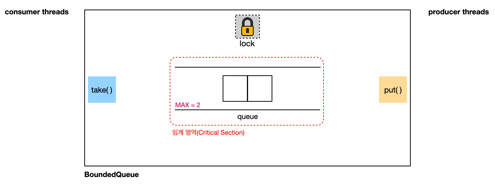
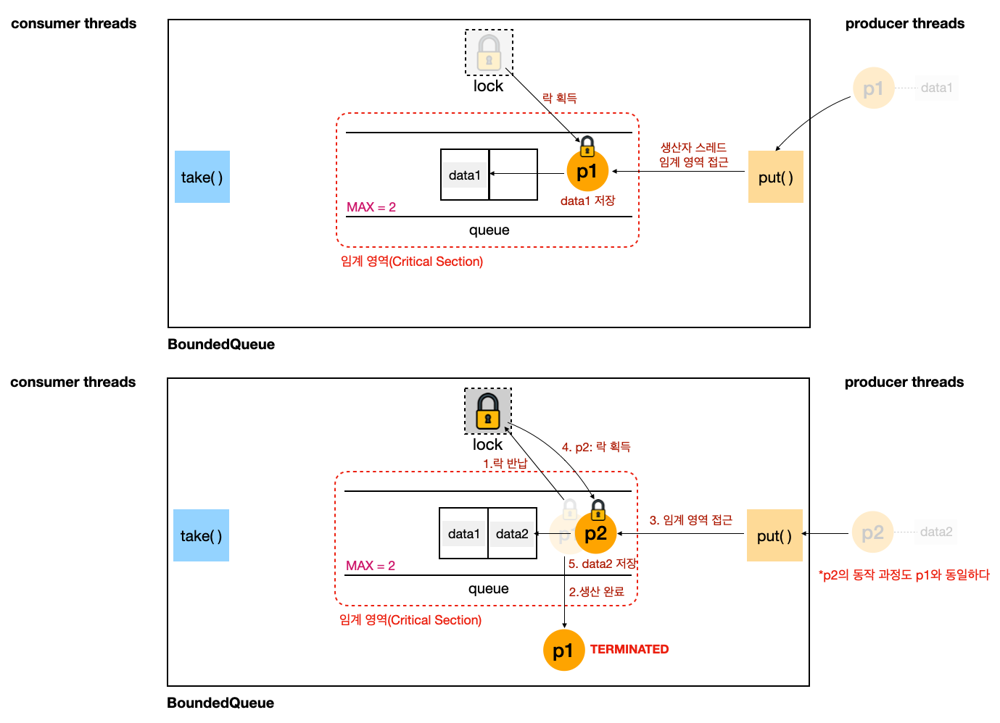
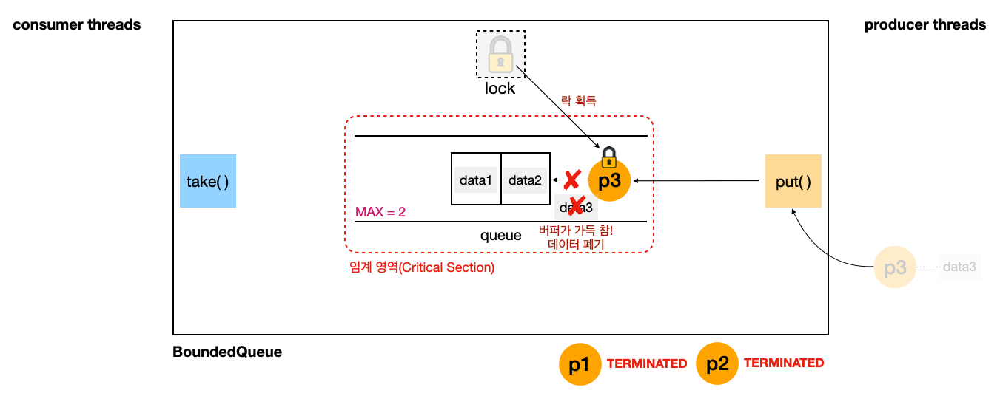
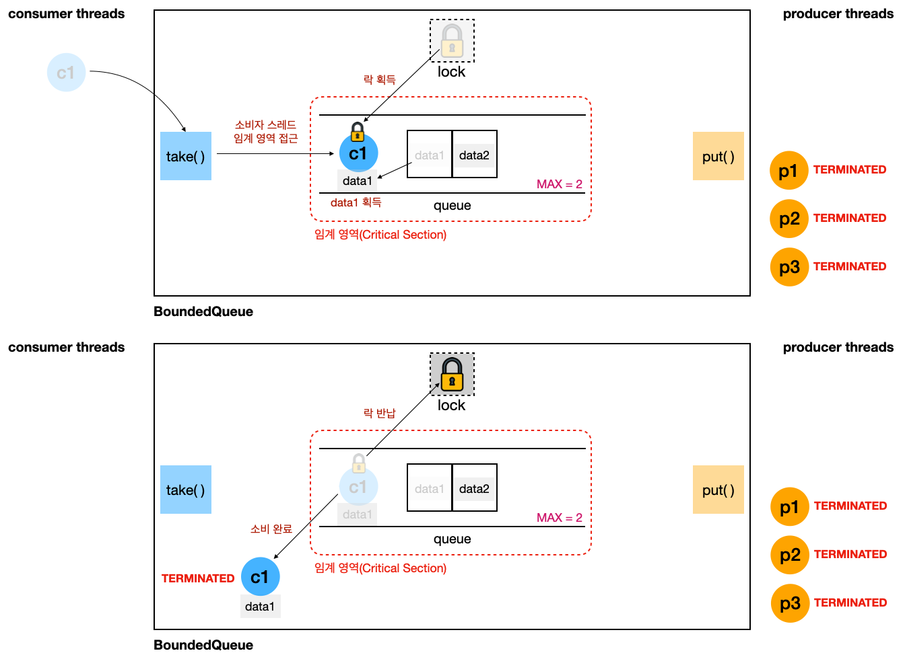
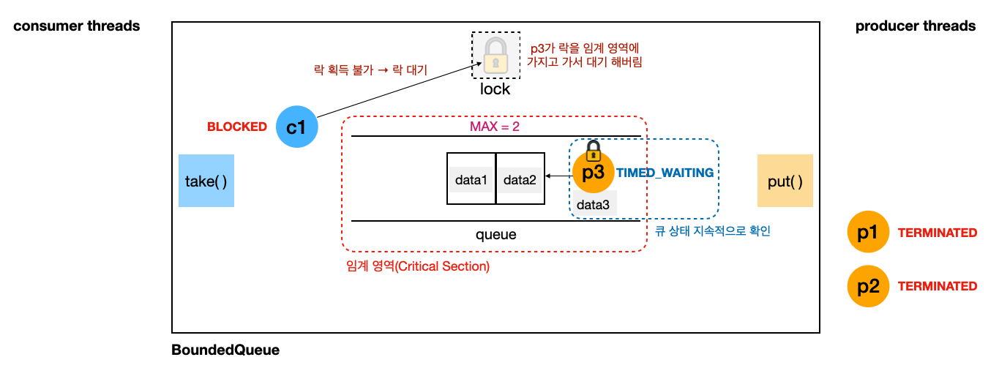
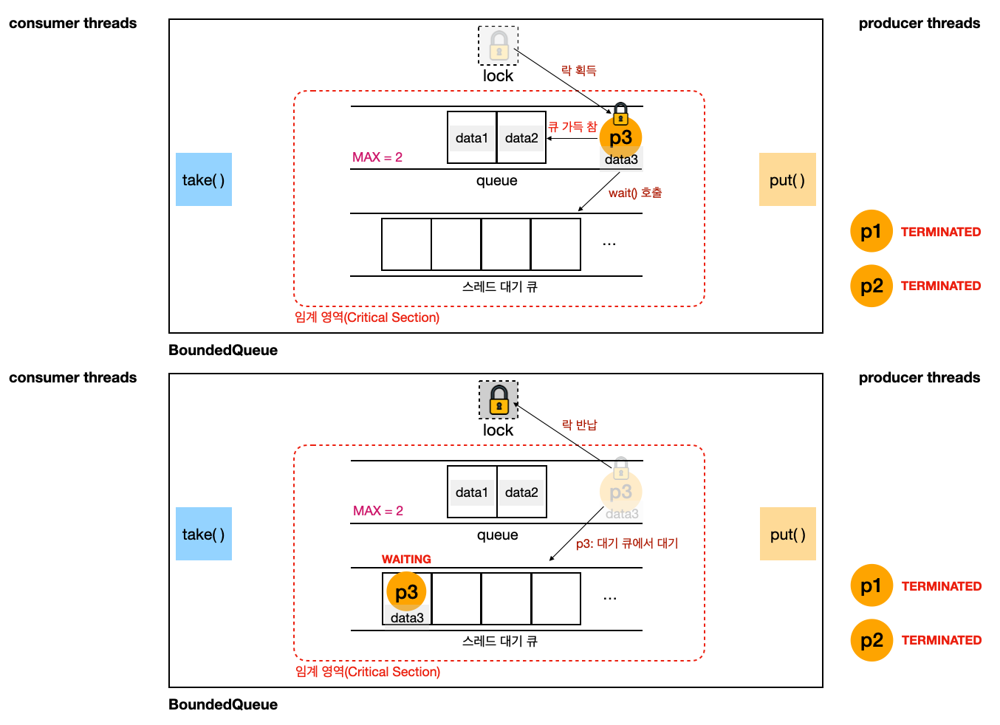
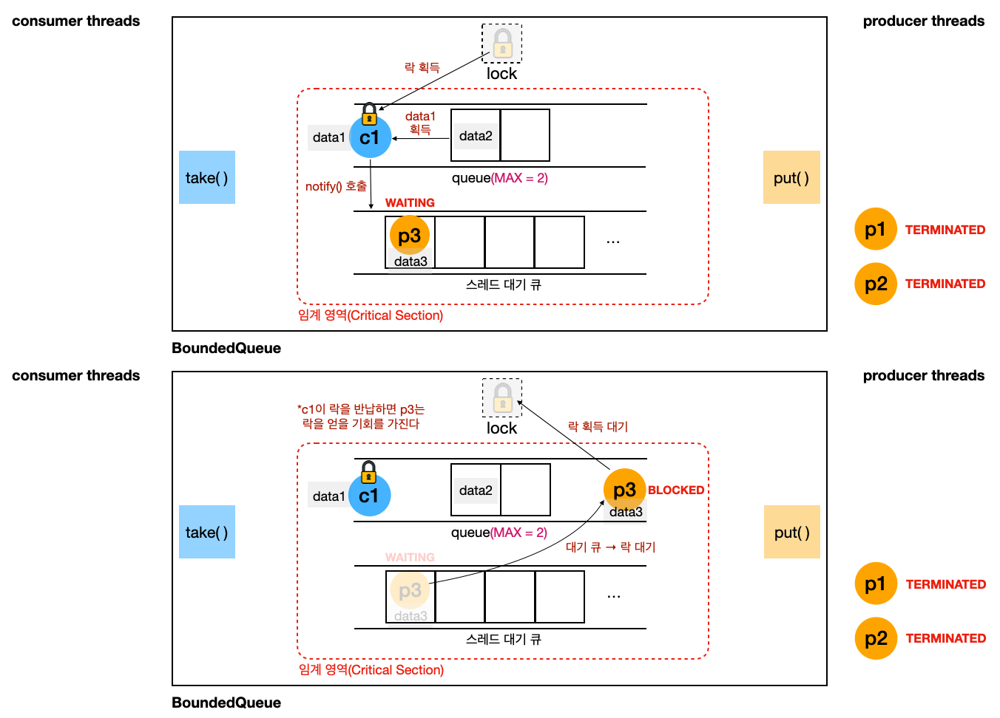
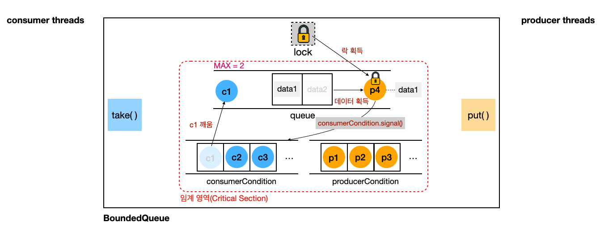
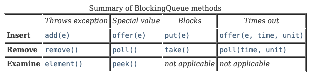

---

> 2024-07-16 업데이트
{: .prompt-warning }


---

> **해당 포스트는 Lombok과 `@Slf4j`(Logback)를 사용한다**
>
> 로그는 `logstash-logback-encoder`를 통해 JSON 형태로 파싱하고 있다. 편의상 `version`, `level`, `levelValue` 필드를 제외하고 사용했다.
>
> 만약 로깅에 익숙하지 않다면 로깅 대신 `System.out`을 사용하면 된다.
{: .prompt-warning }


---

## 1. 생산자-소비자 문제(Producer-Consumer Problem)

### 생산자-소비자 문제 소개

생산자-소비자(Producer-Consumer) 문제는 동기화와 관련된 고전적인 문제로, **다수의 생산자와 소비자가 공유 자원을 사용하는 상황에서 발생하는 문제**를 다룬다. 유한 버퍼 문제(Bounded Bufer Problem)라고 부르기도 한다.

문제에서 사용하는 기본 개념을 살펴보자.

- **생산자(Producer)**
  - 생산자는 데이터를 생성해서 버퍼에 저장하는 역할을 한다
  - 예를 들어, 어떤 데이터 스트림에서 데이터를 수집하여 이를 버퍼에 추가하는 것
- **소비자(Consumer)**
  - 소비자는 버퍼에서 데이터를 꺼내서 처리하는 역할을 한다
  - 예를 들어, 버퍼에서 데이터를 가져와서 이를 가공하여 사용자에게 전달하는 것
- **공유 버퍼(Shared Buffer)**
  - 생산자와 소비자가 데이터를 주고받는 중간 매체
  - **버퍼의 크기는 제한적이기 때문에 버퍼가 가득 찰 때의 생산자의 행동, 비어 있을 때의 소비자의 행동, 상황 등을 관리**해야 한다

<br>

> **버퍼(Buffer)**
>
> **데이터의 임시 저장 공간**으로, 생산자-소비자 문제뿐만 아니라 다양한 시스템과 응용 프로그램에서 중요한 역할을 한다. 버퍼를 사용하는 몇 가지 이유들을 알아보자.
>
> - **생산자와 소비자 간의 속도 차이 완화**
>   - 생산자와 소비자가 데이터를 처리하는 속도가 다를 수 있다(보통 생산자의 작업 속도가 소비자 보다 빠르다)
>   - 예를 들면, 생산자가 빠르게 데이터를 생성하지만 소비자가 이를 처리하는 속도가 너무 느리면 데이터의 손실이 발생할 수 있다. 버퍼는 이러한 속도 차이를 완화해서 데이터 손실을 방지하고 시스템의 안정성을 높인다
>     - 동영상 스트리밍의 버퍼링을 생각하자
>   - 버퍼에 데이터를 임시 저장해 두면, 생산자는 소비자가 데이터를 처리할 때까지 기다릴 필요 없이 계속해서 데이터를 생성할 수 있다
> - **데이터 스트림의 일관성을 유지하기 위해**
>   - 생산자와 소비자가 동시에 데이터를 처리할 때, 버퍼를 사용하면 데이터가 일관된 순서로 처리될 수 있다
>   - 버퍼는 데이터를 일정 순서로 저장하고, 이 순서에 따라 데이터를 소비자에게 제공함으로써 데이터 처리의 일관성을 보장할 수 있다
> - **데이터를 일시적으로 저장하여 비동기 처리를 하기 위해**
>   - 버퍼를 사용하면 생산자와 소비자가 독립적으로 동작할 수 있다. 즉, 생산자가 데이터를 생성할 때 소비자가 즉시 해당 데이터를 처리할 필요가 없다.
>   - 버퍼는 데이터를 일시적으로 저장하고, 소비자가 준비되었을 때 데이터를 처리할 수 있도록 한다
>
> 이외에도 버퍼를 사용하는 다양한 이유가 존재한다.
{: .prompt-info }

<br>

---

### 생산자-소비자 문제 예시

생산자-소비자 문제 상황을 예시를 통해서 한번 파악해보자.

<br>

생산자-소비자 문제를 재현하기 위해서는 다음의 요소가 필요하다.

* **버퍼(buffer) 역할을 하는 구현체**: 큐(queue)로 구현하는 것이 편하다
  * 버퍼는 최대 크기가 존재한다
* **생산(produce)**: 버퍼에 데이터를 보관하는 메서드
* **소비(consume)**: 버퍼에 보관된 값을 가져가는 메서드

<br>

`BoundedQueue` 인터페이스

```java
public interface BoundedQueue {
    void put(String data);
    String take();
}
```

* 구현하는 버퍼 역할을 하는 큐에 대한 인터페이스
  * 나중에 다시 버퍼 구현체를 새로 만들고 적용하는 것을 편하게 하기 위해서 사용
* **`put(data)`**
  * 버퍼에 데이터 보관한다
  * 생산자 스레드가 호출하고 데이터 생산
* **`take()`**
  * 버퍼에 보관된 데이터를 가져간다
  * 소비자 스레드가 호출하고 데이터 소비

<br>

`BoundedQueueV1` 구현체

```java
@Slf4j
public class BoundedQueueV1 implements BoundedQueue {

    private final Queue<String> queue = new ArrayDeque<>();
    private final int MAX;

    public BoundedQueueV1(int MAX) {
        this.MAX = MAX;
    }

    @Override
    public synchronized void put(String data) {
        if (queue.size() == MAX) {
            log.info("[put()] 큐가 가득 참. 해당 데이터 버림: {}", data);
            return;
        }
        queue.offer(data);
    }

    @Override
    public synchronized String take() {
        if (queue.isEmpty()) {
            return null;
        }
        return queue.poll();
    }

    @Override
    public String toString() {
        return queue.toString();
    }
}
```

* 생산자-소비자 문제를 재현하기 위해서 사용할 구현체
* **`Queue<String> queue = new ArrayDeque<>()`**
  * 데이터를 보관할 버퍼는 큐(`ArrayDeque`)로 구현
  * `queue`는 공유 자원이다. 해당 자원을 사용하는 메서드에는 `synchronized`를 추가해서 스레드의 동시 접근을 차단한다.
* **`MAX`**: 버퍼에 저장할 수 있는 최대 크기
* **`put()`**: 큐에 데이터 저장. 큐가 가득 찼을 때 시도하는 경우, 해당 데이터는 버린다.
* **`take()`**: 큐에 데이터를 가져간다. 큐에 데이터가 없을 때 시도하는 경우 `null` 반환.

<br>

`ProducerTask` 스레드

```java
@Slf4j
public class ProducerTask implements Runnable {

    private BoundedQueue queue;
    private String request;

    public ProducerTask(BoundedQueue queue, String request) {
        this.queue = queue;
        this.request = request;
    }

    @Override
    public void run() {
        log.info("[생산 시도] {} -> {}", request, queue);
        queue.put(request);
        log.info("[생산 완료] {} -> {}", request, queue);
    }
}
```

* 생산자 스레드를 실행하는 경우 `queue.put(request)`를 호출해서 전달된 데이터 `request`를 큐에 보관한다

<br>

`ConsumerTask` 스레드

```java
@Slf4j
public class ConsumerTask implements Runnable{

    private BoundedQueue queue;

    public ConsumerTask(BoundedQueue queue) {
        this.queue = queue;
    }

    @Override
    public void run() {
        log.info("[소비 시도]  ? <- {}", queue);
        String data = queue.take();
        log.info("[소비 완료] {} <- {}", data, queue);
    }
}
```

* 소비자 스레드를 실행하는 경우, `queue.take()`를 호출해서 큐의 데이터를 가져와서 소비한다

<br>

```java
@Slf4j
public class ProduceConsumeMain {

    private final static int MAX = 2; // 버퍼 최대 크기 2

    public static void main(String[] args) {

        BoundedQueue queue = new BoundedQueueV1(MAX);
        /*
         * 1. 생산자 우선 실행
         */
        producerFirst(queue);
        /*
         * 2. 소비자 우선 실행
         */
        // consumerFirst(queue);
    }

    private static void consumerFirst(BoundedQueue queue) {
        log.info("-- [소비자 우선 실행] 시작: {} --", queue.getClass().getSimpleName());
        List<Thread> threads = new ArrayList<>();
        startConsumer(queue, threads); // 소비자 우선
        printAllState(queue, threads);
        startProducer(queue, threads);
        printAllState(queue, threads);
        log.info("-- [소비자 우선 실행] 종료: {} --", queue.getClass().getSimpleName());
    }

    private static void producerFirst(BoundedQueue queue) {
        log.info("-- [생산자 우선 실행] 시작: {} --", queue.getClass().getSimpleName());
        List<Thread> threads = new ArrayList<>();
        startProducer(queue, threads); // 생산자 우선
        printAllState(queue, threads);
        startConsumer(queue, threads);
        printAllState(queue, threads);
        log.info("-- [생산자 우선 실행] 종료: {} --", queue.getClass().getSimpleName());
    }

    private static void startConsumer(BoundedQueue queue, List<Thread> threads) {
        System.out.println();
        log.info("-- 소비자 시작 --");
        for (int i = 1; i <= MAX+1; i++) {
            Thread consumer = new Thread(new ConsumerTask(queue), "consumer" + i);
            threads.add(consumer);
            consumer.start();
            ThreadUtils.sleep(100);
        }
    }

    private static void startProducer(BoundedQueue queue, List<Thread> threads) {
        System.out.println();
        log.info("-- 생산자 시작 --");
        for (int i = 1; i <= MAX+1; i++) {
            Thread producer = new Thread(new ProducerTask(queue, "data" + i), "producer" + i);
            threads.add(producer);
            producer.start();
            ThreadUtils.sleep(100);
        }
    }

    private static void printAllState(BoundedQueue queue, List<Thread> threads) {
        System.out.println();
        log.info("[현재 상태 출력] 큐 데이터: {}", queue);
        for (Thread thread : threads) {
            log.info("{}: {}", thread.getName(), thread.getState());
        }
    }
}
```

* **`producerFirst(queue)`**: 생산자를 우선 실행한다
  * 버퍼가 가득 차서 데이터를 버리는 상황을 보기 위해서 사용한다
  * `consumerFirst()`도 같이 호출하면 해당 상황을 보지 못하기 때문에 주석 처리한다
  * `startProducer()`: 생산자 스레드를 3개(`MAX+1`) 만들어서 실행한다
    * `producer1` → `producer2` → `producer3` 순서로 실행된다
  * `printAllState()`: 모든 스레드의 상태를 출력한다
  * `startConsumer()`: 소비자 스레드를 3개 만들어서 실행한다
    * `consumer1` → `consumer2` → `consumer3` 순서로 실행된다
* `producerFirst()`를 호출하게 되면 `producer1` → `producer2` → `producer3` → `consumer1` → `consumer2` → `consumer3`의 순서로 스레드가 실행된다

<br>

생산자 우선 실행하는 경우의 결과.

```json
{"@timestamp":"2024-07-16T16:16:24.435197+09:00","message":"-- [생산자 우선 실행] 시작: BoundedQueueV1 --","thread_name":"main"}

{"@timestamp":"2024-07-16T16:16:24.438964+09:00","message":"-- 생산자 시작 --","thread_name":"main"}
{"@timestamp":"2024-07-16T16:16:24.439364+09:00","message":"[생산 시도] data1 -> []","thread_name":"producer1"}
{"@timestamp":"2024-07-16T16:16:24.439548+09:00","message":"[생산 완료] data1 -> [data1]","thread_name":"producer1"}
{"@timestamp":"2024-07-16T16:16:24.542317+09:00","message":"[생산 시도] data2 -> [data1]","thread_name":"producer2"}
{"@timestamp":"2024-07-16T16:16:24.542629+09:00","message":"[생산 완료] data2 -> [data1, data2]","thread_name":"producer2"}
{"@timestamp":"2024-07-16T16:16:24.647557+09:00","message":"[생산 시도] data3 -> [data1, data2]","thread_name":"producer3"}
{"@timestamp":"2024-07-16T16:16:24.648038+09:00","message":"[put()] 큐가 가득 참. 해당 데이터 버림: data3","thread_name":"producer3"}
{"@timestamp":"2024-07-16T16:16:24.648304+09:00","message":"[생산 완료] data3 -> [data1, data2]","thread_name":"producer3"}

{"@timestamp":"2024-07-16T16:16:24.752675+09:00","message":"[현재 상태 출력] 큐 데이터: [data1, data2]","thread_name":"main"}
{"@timestamp":"2024-07-16T16:16:24.752965+09:00","message":"producer1: TERMINATED","thread_name":"main"}
{"@timestamp":"2024-07-16T16:16:24.753113+09:00","message":"producer2: TERMINATED","thread_name":"main"}
{"@timestamp":"2024-07-16T16:16:24.753227+09:00","message":"producer3: TERMINATED","thread_name":"main"}

{"@timestamp":"2024-07-16T16:16:24.75336+09:00","message":"-- 소비자 시작 --","thread_name":"main"}
{"@timestamp":"2024-07-16T16:16:24.754042+09:00","message":"[소비 시도]    ? <- [data1, data2]","thread_name":"consumer1"}
{"@timestamp":"2024-07-16T16:16:24.754312+09:00","message":"[소비 완료] data1 <- [data2]","thread_name":"consumer1"}
{"@timestamp":"2024-07-16T16:16:24.855995+09:00","message":"[소비 시도]    ? <- [data2]","thread_name":"consumer2"}
{"@timestamp":"2024-07-16T16:16:24.856547+09:00","message":"[소비 완료] data2 <- []","thread_name":"consumer2"}
{"@timestamp":"2024-07-16T16:16:24.960577+09:00","message":"[소비 시도]    ? <- []","thread_name":"consumer3"}
{"@timestamp":"2024-07-16T16:16:24.960978+09:00","message":"[소비 완료] null <- []","thread_name":"consumer3"}

{"@timestamp":"2024-07-16T16:16:25.061369+09:00","message":"[현재 상태 출력] 큐 데이터: []","thread_name":"main"}
{"@timestamp":"2024-07-16T16:16:25.061731+09:00","message":"producer1: TERMINATED","thread_name":"main"}
{"@timestamp":"2024-07-16T16:16:25.061873+09:00","message":"producer2: TERMINATED","thread_name":"main"}
{"@timestamp":"2024-07-16T16:16:25.061979+09:00","message":"producer3: TERMINATED","thread_name":"main"}
{"@timestamp":"2024-07-16T16:16:25.062082+09:00","message":"consumer1: TERMINATED","thread_name":"main"}
{"@timestamp":"2024-07-16T16:16:25.062202+09:00","message":"consumer2: TERMINATED","thread_name":"main"}
{"@timestamp":"2024-07-16T16:16:25.062306+09:00","message":"consumer3: TERMINATED","thread_name":"main"}
{"@timestamp":"2024-07-16T16:16:25.062423+09:00","message":"-- [생산자 우선 실행] 종료: BoundedQueueV1 --","thread_name":"main"}
```

<br>

소비자 우선 실행의 경우도 생산자 우선 실행과 유사하게 동작한다.

<br>

---

### 생산자-소비자 문제 동작 과정

이전의 **생산자 우선 실행의 동작 과정**을 그림을 통해서 살펴보자.

<br>

_초기 상태_

* `queue`를 사용하는 영역이 임계 영역(Critical Section)이기 때문에 `synchronized`를 사용한다
  * 임계 영역에 접근하기 위해서는 락을 획득해야 한다
* 아직 생산자 또는 소비자 스레드가 생성된 상태가 아니다

<br>

_생산자 스레드는 버퍼에 데이터를 저장한다_

```json
{"@timestamp":"2024-07-16T16:16:24.435197+09:00","message":"-- [생산자 우선 실행] 시작: BoundedQueueV1 --","thread_name":"main"}

{"@timestamp":"2024-07-16T16:16:24.438964+09:00","message":"-- 생산자 시작 --","thread_name":"main"}
{"@timestamp":"2024-07-16T16:16:24.439364+09:00","message":"[생산 시도] data1 -> []","thread_name":"producer1"}
{"@timestamp":"2024-07-16T16:16:24.439548+09:00","message":"[생산 완료] data1 -> [data1]","thread_name":"producer1"}
{"@timestamp":"2024-07-16T16:16:24.542317+09:00","message":"[생산 시도] data2 -> [data1]","thread_name":"producer2"}
{"@timestamp":"2024-07-16T16:16:24.542629+09:00","message":"[생산 완료] data2 -> [data1, data2]","thread_name":"producer2"}
```

* 임계 영역에 접근하고 작업을 수행하기 위해서는 락을 획득해야 한다
* 생산자 스레드의 작업은 데이터를 버퍼에 저장하는 것이다
* 작업이 끝난 스레드는 **TERMINATED** 상태로 변경된다
* `p1`, `p2` 스레드의 동작 과정은 동일하다

<br>

_버퍼가 가득 찬 상태: 데이터 저장을 시도하면 해당 데이터는 버린다_

```json
{"@timestamp":"2024-07-16T16:16:24.647557+09:00","message":"[생산 시도] data3 -> [data1, data2]","thread_name":"producer3"}
{"@timestamp":"2024-07-16T16:16:24.648038+09:00","message":"[put()] 큐가 가득 참. 해당 데이터 버림: data3","thread_name":"producer3"}
{"@timestamp":"2024-07-16T16:16:24.648304+09:00","message":"[생산 완료] data3 -> [data1, data2]","thread_name":"producer3"}

{"@timestamp":"2024-07-16T16:16:24.752675+09:00","message":"[현재 상태 출력] 큐 데이터: [data1, data2]","thread_name":"main"}
{"@timestamp":"2024-07-16T16:16:24.752965+09:00","message":"producer1: TERMINATED","thread_name":"main"}
{"@timestamp":"2024-07-16T16:16:24.753113+09:00","message":"producer2: TERMINATED","thread_name":"main"}
{"@timestamp":"2024-07-16T16:16:24.753227+09:00","message":"producer3: TERMINATED","thread_name":"main"}
```

* `p3` 스레드도 `p1`, `p2` 스레드와 마찬가지로 락을 얻고 데이터 저장을 시도한다
* 큐는 `MAX=2`로 최대 2개의 데이터를 넣을 수 있다. 현재 큐는 가득 찬 상태이다.
* 가득 찬 상태에서 `p3`가 `data3`를 넣으려고 시도하면 실패하고, 해당 데이터는 버리게 된다.
  * `p3`도 마찬가지로 **TERMINATED** 상태로 변경된다

<br>

_소비자 스레드 시작_

```json
{"@timestamp":"2024-07-16T16:16:24.75336+09:00","message":"-- 소비자 시작 --","thread_name":"main"}
{"@timestamp":"2024-07-16T16:16:24.754042+09:00","message":"[소비 시도]    ? <- [data1, data2]","thread_name":"consumer1"}
{"@timestamp":"2024-07-16T16:16:24.754312+09:00","message":"[소비 완료] data1 <- [data2]","thread_name":"consumer1"}
{"@timestamp":"2024-07-16T16:16:24.855995+09:00","message":"[소비 시도]    ? <- [data2]","thread_name":"consumer2"}
{"@timestamp":"2024-07-16T16:16:24.856547+09:00","message":"[소비 완료] data2 <- []","thread_name":"consumer2"}
{"@timestamp":"2024-07-16T16:16:24.960577+09:00","message":"[소비 시도]    ? <- []","thread_name":"consumer3"}
{"@timestamp":"2024-07-16T16:16:24.960978+09:00","message":"[소비 완료] null <- []","thread_name":"consumer3"}
```

* 소비자 스레드 `c1` ~ `c3`의 동작도 생산자 스레드와 매우 비슷하다. 단지 데이터를 넣는 것이 아니라 꺼내는 것이다.
* `c1`은 임계 영역에 접근하기 위해서 락을 얻는다.
* `c1`은 큐에서 `data1`을 소비하기 위해서 꺼낸다.
* 꺼내는 작업을 완료하면 `c1`은 **TERMINATED** 상태로 변경된다
* `c2`의 동작도 `c1`과 동일하다.
* `c3`의 경우, 큐가 비어있기 때문에 유의미한 데이터를 꺼내지 못하고 `null`을 반환 받는다

<br>

> **소비자 우선 실행하는 경우**
>
> * 비어 있는 큐에서 `c1` ~ `c3`는 데이터를 받지 못한다
> * 생산자 우선과 마찬가지로 `p3`는 `data3`를 버리게 된다
{: .prompt-info }

<br>

---

### 생산자-소비자 문제의 문제 상황

위의 동작 과정을 통해서 파악한 **생산자-소비자 문제의 대표적인 문제 상황**은 다음과 같다.

* **버퍼가 가득 차는 경우**
  * 생산자 입장에서 버퍼에 여유가 생길 때 까지 조금만 기다리면 되는데, 데이터를 버리게 되는 것이 아쉽다
* **버퍼가 비어 있는 경우**
  * 소비자 입장에서 버퍼에 데이터가 들어올 때 까지 기다리면 되는데, `null`을 반환 받는 것은 아쉽다

<br>

위의 문제 상황에서 가장 먼저 떠올릴 수 있는 해결 방법은 **버퍼가 가득 찬 경우 생산자 스레드가 대기하도록 만들고, 버퍼가 비어있는 경우 소비자 스레드가 대기하도록 구현**하는 것이다.

<br>

---

## 2. 생산자-소비자 문제 해결하기

### 문제 해결 시도 1: 스레드 대기

**버퍼가 가득 찬 경우 생산자 스레드가 대기하도록 만들고, 버퍼가 비어있는 경우 소비자 스레드가 대기하도록 구현**해보자.

이를 가장 간단히 구현하는 방법은, **`while`문을 사용해서 지속적으로 버퍼 상태를 확인**해서 큐에 빈공간이 생기거나 데이터가 들어있는 경우를 체크하는 것이다.

<br>

```java
@Override
public synchronized void put(String data) {
    while (queue.size() == MAX) {
        log.info("[put()] 큐가 가득 참, 생산자 대기...");
        ThreadUtils.sleep(1000);
    }
    queue.offer(data);
}

@Override
public synchronized String take() {
    while (queue.isEmpty()) {
        log.info("[take()] 큐가 비어 있음, 소비자 대기..");
        ThreadUtils.sleep(1000);
    }
    return queue.poll();
}
```

<br>

결론부터 말하자면, **이 방식은 해결법이 될 수 없다**. 아니, 오히려 상황을 악화시킨다!

다음 그림을 통해 그 이유를 알아보자. 생산자 우선으로 실행했다고 가정해보자.

<br>

_p3가 락을 임계 영역에 가지고 가서 대기 해버리는 것이 문제의 원인_

* `p1`, `p2`가 데이터를 큐에 넣는 것 까지는 이전과 같다
* 큐가 가득찬 상태에서 `p3`는 이제 데이터를 버리는 것이 아니라, 락을 획득한 상태로 대기한다(**TIMED_WAITING** 상태)
  * `p3`는 대기하면서 `1000ms` 마다 큐가 비었는지 상태를 확인해서, 비어 있는 경우 `data3`를 저장하는 작업을 수행한다
* **문제는 여기서 발생한다!**
  * `p3`가 대기하면서 `c1`이 소비하기 위해서 임계 영역에 접근을 시도한다. 그러나 임계 영역에 진입하는 것을 실패한다. 그 이유는 **`p3`가 락을 소유하고 있는 상태로 임계 영역 내에서 대기하고 있기 때문**이다.
    * `synchronized`의 작동원리는 락을 획득하지 못하는 경우 **BLOCKED** 상태로 락을 얻을 때 까지 무한히 대기하는 것이다
  * `c1`은 락 대기 상태(**BLOCKED**)로 변경되고, 락을 얻을 때 까지 대기한다
    * `c2`, `c3`도 마찬가지로 락을 획득하지 못하고 기다린다
* **결론**
  * `p3`가 락을 반납하기 위해서는 큐에 빈 자리가 생겨야하는데, 빈 자리가 생기기 위해서는 소비자 스레드가 데이터를 한 개 이상 소비해줘야 한다. 이는 소비자 스레드가 락을 얻기 전 까지 불가능하기 때문에, 결국 **무한 대기 상태에 빠진다**.

<br>

이런 무한 대기 문제는 소비자 우선으로 실행해도 나타난다.

위에서 발생한 **문제의 원인은 근본적으로 큐 상태를 확인하는 스레드가 락을 임계 영역으로 가지고 가서 대기하기 때문**이다. 이를 해결하기 위해서는 스레드가 대기하기 전에 **다른 스레드에게 락을 양보할 수 있도록 구현**하면 되는 것이다.

<br>

---

### 문제 해결 시도 2: wait(), notify()

위에서 **"락을 가지고 대기하는 스레드가 다른 스레드에게 락을 양보할 수 있도록 구현하면 된다"**라고 했지만, 실제로 **자바에서 락을 바로 양보할 수 있는 기능은 없다**. 그러나 자바가 제공하는 **`Object.wait()`, `Object.notify()`은 이전의 문제를 해결할 수 있는 기능을 제공**한다.

해당 메서드의 기능을 살펴보자.

* **`wait()`**
  * 호출한 스레드를 **대기 상태(WAITING)**로 만든다
  * 해당 스레드는 **모니터 락을 반납(해제)**하고, 해당 객체의 **대기 큐**에서 대기하게 된다
  * 다른 스레드가 같은 객체에서 `notify()` 또는 `notifyAll()`을 호출할 때까지 대기 상태에 머무르게 된다
  * **주의점**
    * `wait()`은 현재 스레드가 **`synchronized` 블럭이나 메서드안에서 락을 소유하고 있을 때만 호출**할 수 있다
* **`notify()`**
  * **대기 중인 스레드 중 하나를 깨운다**
  * `wait()`으로 대기 큐에 있는 스레드 중 하나가 선택되어 모니터 락을 획득할 기회를 얻게 된다
  * 정확히 어떤 스레드가 깨어날지는 JVM이 결정하며, 이 선택은 일반적으로 비결정적이다(대기 중인 스레드들 중 어떤 스레드가 깨어날지는 예측할 수 없다)
  * **주의점**
    * `notify()` 역시 **호출하는 스레드가 `synchronized` 블럭이나 메서드안에서 있어야 호출**할 수 있다
    * `notify()`로 **깨워진 스레드는 즉시 실행되지 않으며, 모니터 락을 획득해야지만 `wait()` 이후의 코드를 실행**할 수 있다
* **`notifyAll()`**
  * **대기 중인 모든 스레드를 깨운다**
  * 해당 객체의 대기 큐에 있는 모든 스레드가 깨어나서 **모니터 락을 획득하려 시도**하게 된다
  * `notifyAll()`은 **다수의 스레드가 조건이 충족되기를 기다리고 있는 상황**에서 사용된다. 모든 스레드를 깨워서, 그중 **조건이 충족된 스레드가 작업을 진행하도록 한다**.
  * **주의점**
    * `notifyAll()` 역시 반드시 **`synchronized` 블록**이나 **`synchronized` 메서드** 안에서 호출되어야 한다

<br>

> **대기 큐(wait queue)**
>
> `wait()`를 호출한 스레드가 대기한다는 **대기 큐는 일반적인 의미의 큐(Queue) 자료구조가 아니다**. 내부적으로는 특정 스레드가 대기 상태로 들어가거나 다시 실행될 수 있도록 관리하는 데이터 구조로 구현되어 있으며, 이 구조는 **일반적인 큐의 성질을 따르지 않을 수 있다.**
>
> FIFO 방식의 큐 처럼 작동할 것으로 기대하기보다, 특정 조건에서 스레드가 깨어나게 되는 방식으로 이해하는 것이 편하다.
{: .prompt-info }

<br>

이제 `wait()`, `notify()`를 기존 코드에 적용해서, 스레드가 무한 대기하는 문제를 해결해보자.

```java
@Override
public synchronized void put(String data) {
    while (queue.size() == MAX) {
        log.info("[put()] 큐가 가득 참, 생산자 대기...");
        try {
            wait(); // 락 반납: RUNNABLE -> WAITING (스레드는 대기 큐에서 대기)
            log.info("[put()] 생산자 깨어남");
        } catch (InterruptedException e) {
            throw new RuntimeException(e);
        }
    }
    queue.offer(data);
    log.info("[put()] 생산자 데이터 저장, notify() 호출");
    notify(); // 대기 큐 스레드 중 하나 깨우기: 대기 큐 -> BLOCKED
}

@Override
public synchronized String take() {
    while (queue.isEmpty()) {
        log.info("[take()] 큐에 데이터가 없음, 소비자 대기...");
        try {
            wait();
            log.info("[take()] 소비자 깨어남");
        } catch (InterruptedException e) {
            throw new RuntimeException(e);
        }
    }
    String data = queue.poll();
    log.info("[take()] 소비자 데이터 획득, notify() 호출");
    notify(); // 대기 큐 스레드 중 하나 깨우기: 대기 큐 -> BLOCKED
    return data;
}
```

* **`put()`**
  * 생산자 스레드가 `synchronized`를 통해 설정된 임계 영역을 접근 할 때 락 획득을 시도한다
  * 락을 획득한 스레드는 `while`문을 통해서 큐에 빈 공간이 생기는지 반복적으로 검사한다
    * **빈 공간이 없는 경우**: `wait()`를 호출해서 대기한다. 이 때 해당 스레드는 락을 반납하고 대기 큐에서 기다린다.(**WAITING** 상태)
      * 대기 상태에서 깨어나면, 다시 반복문에서 큐가 비었는지 확인한다
    * **빈 공간이 있는 경우**: 데이터를 큐에 저장하고 `notify()`를 호출한다. 호출한 `notify()`를 통해서 대기 큐의 스레드에게 저장된 데이터가 있다고 신호를 보낸다.
      * 이 `notify()`를 통해서 소비자 스레드가 깨어나서 데이터 획득을 진행할 수 있다

* **`take()`**
  * 소비자 스레드가 `synchronized`를 통해 설정된 임계 영역을 접근 할 때 락 획득을 시도한다
  * 락을 획득한 스레드는 `while`문을 통해서 큐에 데이터가 존재하는지 반복적으로 검사한다
    * **데이터가 없는 경우**: `wait()`를 호출해서 대기한다. 이 때 해당 스레드는 락을 반납하고 대기 큐에서 기다린다.(**WAITING** 상태)
      * 대기 상태에서 깨어나면, 다시 반복문에서 큐에 데이터가 있는지 확인한다
    * **데이터가 있는 경우**: 큐에서 데이터를 획득하고 `notify()`를 호출한다. 호출한 `notify()`를 통해서 큐에 저장할 공간이 생겼다고 대기 큐의 스레드에게 신호를 보낸다.
      * 이 `notify()`를 통해서 생산자 스레드가 깨어나서 데이터 저장을 진행할 수 있다

<br>

생산자 우선으로 실행한 결과.

```json
{"@timestamp":"2024-07-16T01:06:45.145241+09:00","message":"-- [생산자 우선 실행] 시작: BoundedQueueV3 --","thread_name":"main"}

{"@timestamp":"2024-07-16T01:06:45.148979+09:00","message":"-- 생산자 시작 --","thread_name":"main"}
{"@timestamp":"2024-07-16T01:06:45.149386+09:00","message":"[생산 시도] data1 -> []","thread_name":"producer1"}
{"@timestamp":"2024-07-16T01:06:45.149559+09:00","message":"[put()] 생산자 데이터 저장, notify() 호출","thread_name":"producer1"}
{"@timestamp":"2024-07-16T01:06:45.149648+09:00","message":"[생산 완료] data1 -> [data1]","thread_name":"producer1"}
{"@timestamp":"2024-07-16T01:06:45.25491+09:00","message":"[생산 시도] data2 -> [data1]","thread_name":"producer2"}
{"@timestamp":"2024-07-16T01:06:45.255216+09:00","message":"[put()] 생산자 데이터 저장, notify() 호출","thread_name":"producer2"}
{"@timestamp":"2024-07-16T01:06:45.255342+09:00","message":"[생산 완료] data2 -> [data1, data2]","thread_name":"producer2"}
{"@timestamp":"2024-07-16T01:06:45.359701+09:00","message":"[생산 시도] data3 -> [data1, data2]","thread_name":"producer3"}
{"@timestamp":"2024-07-16T01:06:45.359993+09:00","message":"[put()] 큐가 가득 참, 생산자 대기...","thread_name":"producer3"}

{"@timestamp":"2024-07-16T01:06:45.464945+09:00","message":"[현재 상태 출력] 큐 데이터: [data1, data2]","thread_name":"main"}
{"@timestamp":"2024-07-16T01:06:45.465561+09:00","message":"producer1: TERMINATED","thread_name":"main"}
{"@timestamp":"2024-07-16T01:06:45.465895+09:00","message":"producer2: TERMINATED","thread_name":"main"}
{"@timestamp":"2024-07-16T01:06:45.466204+09:00","message":"producer3: WAITING","thread_name":"main"}

{"@timestamp":"2024-07-16T01:06:45.466557+09:00","message":"-- 소비자 시작 --","thread_name":"main"}
{"@timestamp":"2024-07-16T01:06:45.468132+09:00","message":"[소비 시도]   ? <- [data1, data2]","thread_name":"consumer1"}
{"@timestamp":"2024-07-16T01:06:45.468664+09:00","message":"[take()] 소비자 데이터 획득, notify() 호출","thread_name":"consumer1"}
{"@timestamp":"2024-07-16T01:06:45.468962+09:00","message":"[소비 완료] data1 <- [data2]","thread_name":"consumer1"}
{"@timestamp":"2024-07-16T01:06:45.469133+09:00","message":"[put()] 생산자 깨어남","thread_name":"producer3"}
{"@timestamp":"2024-07-16T01:06:45.469595+09:00","message":"[put()] 생산자 데이터 저장, notify() 호출","thread_name":"producer3"}
{"@timestamp":"2024-07-16T01:06:45.470209+09:00","message":"[생산 완료] data3 -> [data2, data3]","thread_name":"producer3"}
{"@timestamp":"2024-07-16T01:06:45.573147+09:00","message":"[소비 시도]   ? <- [data2, data3]","thread_name":"consumer2"}
{"@timestamp":"2024-07-16T01:06:45.573953+09:00","message":"[take()] 소비자 데이터 획득, notify() 호출","thread_name":"consumer2"}
{"@timestamp":"2024-07-16T01:06:45.574103+09:00","message":"[소비 완료] data2 <- [data3]","thread_name":"consumer2"}
{"@timestamp":"2024-07-16T01:06:45.678461+09:00","message":"[소비 시도]   ? <- [data3]","thread_name":"consumer3"}
{"@timestamp":"2024-07-16T01:06:45.679268+09:00","message":"[take()] 소비자 데이터 획득, notify() 호출","thread_name":"consumer3"}
{"@timestamp":"2024-07-16T01:06:45.679575+09:00","message":"[소비 완료] data3 <- []","thread_name":"consumer3"}

{"@timestamp":"2024-07-16T01:06:45.780898+09:00","message":"[현재 상태 출력] 큐 데이터: []","thread_name":"main"}
{"@timestamp":"2024-07-16T01:06:45.781892+09:00","message":"producer1: TERMINATED","thread_name":"main"}
{"@timestamp":"2024-07-16T01:06:45.782333+09:00","message":"producer2: TERMINATED","thread_name":"main"}
{"@timestamp":"2024-07-16T01:06:45.782592+09:00","message":"producer3: TERMINATED","thread_name":"main"}
{"@timestamp":"2024-07-16T01:06:45.782805+09:00","message":"consumer1: TERMINATED","thread_name":"main"}
{"@timestamp":"2024-07-16T01:06:45.783088+09:00","message":"consumer2: TERMINATED","thread_name":"main"}
{"@timestamp":"2024-07-16T01:06:45.783325+09:00","message":"consumer3: TERMINATED","thread_name":"main"}
{"@timestamp":"2024-07-16T01:06:45.783699+09:00","message":"-- [생산자 우선 실행] 종료: BoundedQueueV3 --","thread_name":"main"}
```

<br>

해당 동작 과정의 일부를 그림으로 살펴보자.

<br>

_p3: wait()를 통해서 락 반납, 대기 큐에서 기다리기_

```json
{"@timestamp":"2024-07-16T01:06:45.359701+09:00","message":"[생산 시도] data3 -> [data1, data2]","thread_name":"producer3"}
{"@timestamp":"2024-07-16T01:06:45.359993+09:00","message":"[put()] 큐가 가득 참, 생산자 대기...","thread_name":"producer3"}

{"@timestamp":"2024-07-16T01:06:45.464945+09:00","message":"[현재 상태 출력] 큐 데이터: [data1, data2]","thread_name":"main"}
{"@timestamp":"2024-07-16T01:06:45.465561+09:00","message":"producer1: TERMINATED","thread_name":"main"}
{"@timestamp":"2024-07-16T01:06:45.465895+09:00","message":"producer2: TERMINATED","thread_name":"main"}
{"@timestamp":"2024-07-16T01:06:45.466204+09:00","message":"producer3: WAITING","thread_name":"main"}
```

* `p3`가 락을 획득하고 임계 영역에 진입해서 큐의 상태를 확인했더니 큐가 가득 찬 상태이다
* `p3`는 `wait()`를 호출한다
  * `p3`는 락을 반납하고 대기 큐에서 기다린다(**WAITING** 상태)

<br>

_데이터를 획득하고 notify() 호출_

```json
{"@timestamp":"2024-07-16T01:06:45.466557+09:00","message":"-- 소비자 시작 --","thread_name":"main"}
{"@timestamp":"2024-07-16T01:06:45.468132+09:00","message":"[소비 시도]   ? <- [data1, data2]","thread_name":"consumer1"}
{"@timestamp":"2024-07-16T01:06:45.468664+09:00","message":"[take()] 소비자 데이터 획득, notify() 호출","thread_name":"consumer1"}
{"@timestamp":"2024-07-16T01:06:45.468962+09:00","message":"[소비 완료] data1 <- [data2]","thread_name":"consumer1"}
{"@timestamp":"2024-07-16T01:06:45.469133+09:00","message":"[put()] 생산자 깨어남","thread_name":"producer3"}
```

* `c1`은 락을 획득하고 임계 영역에서 데이터를 획득하는 작업을 수행한다
* `c1`은 데이터를 획득하고 `notify()`를 호출한다
  * 스레드 대기 큐는 `notify()`의 신호를 받고 대기 큐에 있는 스레드 중 하나를 깨운다
  * 깨운 스레드(`p3`)가 즉시 작동하는 것은 아니다. `p3`가 임계 영역 안에 있어도 코드를 실행하기 위해서는 락을 소유하고 있어야 한다.
  * `p3`는 락을 소유하지 않기 때문에 락을 획득할 때 까지 **BLOCKED** 상태로 대기한다
* 이후에 `c1`이 락을 반납하면 `p3`는 락을 획득할 기회를 가진다

<br>

이후의 동작 과정도 지금까지의 과정과 매우 유사하다. 중요한 것은 이제 `p1` ~ `p3`는 모두 데이터를 버리지 않고 생산하고, `c1` ~ `c3`는 데이터를 모두 소비할 수 있다는 것이다.

<br>

---

### wait(), notify()의 한계

위에서 본 `wait()`, `notify()`를 사용한 케이스는 괴장히 이상적인 경우이다. 실제로는 더 많은 스레드가 사용되면서 다양한 문제들이 발생한다.

`wait()`, `notify()`가 가지는 한계는 다음과 같다.

* **어느 스레드를 깨우는지는 비결정적이다**

  * **`notify()`의 비공정성**

    * `notify()`는 대기 중인 스레드 중 하나만을 비결정적으로 깨운다. 깨워진 스레드가 항상 가장 적절한 스레드가 아닐 수 있으며, 이로 인해 공정하지 않은 실행이 발생할 수 있다.

    * **예1**: 같은 종류의 스레드를 깨우면 비효율적이다. 생산자 스레드가 `notify()`를 통해서 소비자 스레드를 깨우는 것이 제일 효율적이다
    * **예2**: 먼저 들어온 스레드 보다 나중에 들어온 스레드가 깨워질 수 있다. 이런 비공정한 실행은 스레드 기아(starvation) 문제를 초래할 수 있다.
      * **스레드 기아 문제를 해결하기 위해서 `notifyAll()`을 사용**할 수 있다. 그러나 모든 스레드를 깨우는 것은 불필요한 경쟁을 만드는 비효율적인 일이 될 수 있다.

* **모니터 락에 대한 의존성**

  * `wait()`와 `notify()`는 반드시 `synchronized` 블록이나 메서드 내에서 사용해야 하며, 객체의 모니터 락을 필요로 한다. 이는 특정 객체에 대한 동기화만 지원하므로, 보다 복잡한 락 관리가 필요한 경우 유연성이 떨어질 수 있다.

* **다수의 조건 변수 처리의 어려움**

  * `wait()`와 `notify()`는 특정 조건을 처리하기 위해 설계된 것이 아니다. 만약 하나의 락을 사용하여 여러 조건을 처리해야 하는 경우, 어떤 스레드가 어떤 조건을 기다리고 있는지 명확하게 관리하기 어렵다.
  * **예1**: 생산자와 소비자를 나눠서 관리하기 어렵다

<br>

---

## 3. BlockingQueue

### 다수의 조건 변수 처리(대기 큐 나누기)

위의 한계에서 설명했듯이, `wait()`, `notify()`를 사용하는 경우 **대기 큐에서 깨울 스레드는 비결정적으로 선택되기 때문에 같은 종류의 스레드를 깨울 수 있다**. 이는 비효율적이다. 이를 해결하기 위해서는 생산자와 소비자 스레드의 조건을 다르게 처리해서 **서로 다른 역할을 수행하는 스레드들을 명확하게 구분하고 관리**하는 것이 좋다.

* **생산자**: 버퍼가 가득 차면 대기해야 하고, 버퍼에 공간이 생길 때까지 기다려야 한다
  * 생산을 완료하면 소비자에게 신호를 보내야 한다

* **소비자**: 버퍼가 비어 있으면 대기해야 하고, 버퍼에 데이터가 추가될 때까지 기다려야 한다
  * 소비를 완료하면 생산자에게 신호를 보내야 한다


<br>

가장 좋은 방법은 **같은 종류의 스레드끼리 모이도록 대기 큐를 둘로 분리**하는 것이다. 이를 구현하기 위해서 [이전 포스트](https://seungki1011.github.io/posts/java-28-synchronization/#4-reentrantlock)에서 다룬 `ReentrantLock`과 `Condition`을 사용할 수 있다.

<br>

```java
@Slf4j
public class BoundedConditionQueue implements BoundedQueue {

    private final Lock lock = new ReentrantLock(); // ReentrantLock 생성
    private final Condition producerCondition = lock.newCondition(); // 생산자 대기 큐
    private final Condition consumerCondition = lock.newCondition(); // 소비자 대기 큐

    private final Queue<String> queue = new ArrayDeque<>();
    private final int MAX;

    public BoundedConditionQueue(int MAX) {
        this.MAX = MAX;
    }

    @Override
    public void put(String data) {
        lock.lock(); // 락 획득
        try {
            while (queue.size() == MAX) {
                log.info("[put()] 큐가 가득 참, 생산자 대기...");
                try {
                    producerCondition.await(); // 생산자 대기 큐에서 기다린다
                    log.info("[put()] 생산자 깨어남");
                } catch (InterruptedException e) {
                    throw new RuntimeException();
                }
            }
            queue.offer(data); // 데이터 버퍼 큐에 저장
            log.info("[put()] 생산자 데이터 저장, consumerCondition.signal() 호출");
            consumerCondition.signal(); // 소비자 대기 큐에 신호를 보낸다
        } finally {
            lock.unlock(); // 락 해제
        }
    }

    @Override
    public String take() {
        lock.lock(); // 락 획득
        try {
            while (queue.isEmpty()) {
                log.info("[take()] 큐가 비었음, 소비자 대기...");
                try {
                    consumerCondition.await(); // 소비자 대기 큐에서 기다린다
                    log.info("[take()] 소비자 깨어남");
                } catch (InterruptedException e) {
                    throw new RuntimeException();
                }
            }
            String data = queue.poll(); // 버퍼 큐에서 데이터 획득
            log.info("[take()] 소비자 데이터 획득, producerCondition.signal() 호출");
            producerCondition.signal(); // 생산자 대기 큐에 신호를 보낸다
            return data;
        } finally {
            lock.unlock(); // 락 해제
        }
    }

    @Override
    public String toString() {
        return queue.toString();
    }
}
```

* ```java
  private final Condition producerCondition = lock.newCondition(); // 생산자 대기 큐
  private final Condition consumerCondition = lock.newCondition(); // 소비자 대기 큐
  ```

  * 생산자와 소비자 스레드를 위한 대기 큐를 나누어서 관리한다

* **생산자 스레드**

  * **큐가 가득 찬 경우**
    * `producerCondition.await()`: 생산자 전용 대기 큐에서 기다린다
  * **큐에 여유가 있을 경우**
    * 큐에 데이터를 저장한다
    * `consumerCondition.signal()`: 소비자 전용 대기 큐에 신호를 보낸다. 소비자 대기 큐에서 소비자 스레드를 하나 깨워서 데이터를 소비할 수 있다.

* **소비자 스레드**

  * **큐가 비었을 경우**
    * `consumerCondition.await()`: 소비자 전용 대기 큐에서 기다린다
  * **큐에 데이터가 존재하는 경우**
    * 큐에서 데이터를 획득한다
    * `producerCondition.signal()`: 생산자 전용 대기 큐에 신호를 보낸다. 생산자 대기 큐에서 생산자 스레드를 하나 깨워서 데이터를 생산할 수 있다.

<br>

> **`Condition`**
>
> `Condition`의 세부 구현 사항은 JVM 마다 다르지만, 일반적으로 FIFO 방식의 `Queue`로 구현된다. 따라서 `signal()`을 보내면 FIFO 방식으로 깨운다.
{: .prompt-info }

<br>

_소비자 스레드, 생산자 스레드 나누어서 관리_

<br>

---

### BlockingQueue 소개

사실, 지금까지 살펴본 `Lock`과 `Condition`을 이용해서 구현한 자료구조는 이미 다 만들어져 있다. 자바는 `java.util.concurrent.BlockingQueue`라는 인터페이스와 여러 구현체들을 제공한다. `BlockingQueue`는 **스레드 안전한 큐**이며, 큐에 아이템을 추가하거나 제거할 때 **필요한 경우 대기**하는 기능을 제공한다. 이 인터페이스는 동시성 문제를 해결하고, 자바에서 다중 스레드 환경에서 안전하고 효율적으로 큐를 사용할 수 있도록 한다.

<br>

```java
public interface BlockingQueue<E> extends Queue<E> {
  
    boolean add(E e);
    boolean offer(E e);
    
    void put(E e) 
      throws InterruptedException;
    boolean offer(E e, long timeout, TimeUnit unit) 
      throws InterruptedException;
    
    E take() 
      throws InterruptedException;
    E poll(long timeout, TimeUnit unit) 
      throws InterruptedException;
    
    int remainingCapacity();
  
    boolean remove(Object o);
    boolean contains(Object o);
  
    int drainTo(Collection<? super E> c);
    int drainTo(Collection<? super E> c, int maxElements);
}
```

* **데이터 추가**: `add()`, `offer()`, `put()`, `offer(timeout)`
  * **`put()`**: 큐에 요소를 추가한다. 큐가 가득 차 있으면, 큐에 공간이 생길 때까지 현재 스레드를 대기 상태로 만든다.
  * **`offer()`**: 큐에 즉시 요소를 추가하려 시도한다. 큐에 여유 공간이 없으면 `false`를 반환한다.
  * **`offer(timeout)`**: 지정된 시간 동안 큐에 요소를 추가하려 시도한다. 시간이 초과되면 `false`를 반환한다.
* **데이터 획득**: `take()`, `poll(timeout)`, `remove()`
  * **`take()`**: 큐에서 요소를 제거하고 반환한다. 큐가 비어 있으면, 큐에 요소가 추가될 때까지 현재 스레드를 대기 상태로 만든다.
  * **`poll()`**: 큐에서 즉시 요소를 제거하려 시도한다. 큐가 비어 있으면 `null`을 반환한다.
  * **`poll(timeout)`**: 지정된 시간 동안 큐에서 요소를 제거하려 시도한다. 시간이 초과되면 `null`을 반환한다.

<br>

`BlockingQueue`는 다음과 같은 구현체들을 제공한다.

* **`ArrayBlockingQueue`**
  - 크기가 고정된 배열로 구현되었다.
  - 큐의 최대 크기를 지정해야 하며, 지정된 크기 이상으로 큐에 데이터를 추가할 수 없다.
* **`LinkedBlockingQueue`**
  - 링크드 리스트로 구현되었다.
  - 기본적으로 무한의 크기를 가지지만, 생성 시 큐의 최대 크기를 지정할 수 있다.
* **`PriorityBlockingQueue`**
  - 우선순위 큐를 기반으로 구현되었다.
  - 요소들이 자연 순서나 `Comparator`에 따라 정렬되며, 우선순위가 높은 요소가 먼저 처리된다.

<br>

이외에도 여러가지 구현체들을 제공한다.

<br>

---

### BlockingQueue 사용하기

이전 코드를 `BlockingQueue`를 적용해서 사용해보자.

<br>

```java
public class BoundedBlockingQueue implements BoundedQueue {
    
    private BlockingQueue<String> queue;
    
    // ArrayBlockingQueue 구현체 사용
    public BoundedBlockingQueue(int MAX) {
        queue = new ArrayBlockingQueue<>(MAX);
    }

    @Override
    public void put(String data) {
        try {
            queue.put(data);
        } catch (InterruptedException e) {
            throw new RuntimeException();
        }
    }
    
    @Override
    public String take() {
        try {
            return queue.take();
        } catch (InterruptedException e) {
            throw new RuntimeException();
        }
    }

    @Override
    public String toString() {
        return queue.toString();
    }
}
```

* `ArrayBlockingQueue`를 구현체로 사용하고 있다

<br>

`ArrayBlockingQueue`의 내부 구현을 살펴보면, 우리가 이전에 구현했던 자료구조와 마찬가지로 `ReentrantLock`과 `Condition`을 사용하고 있다. (물론 `put()`이나 `take()`를 살펴보면 세부 구현은 조금씩 다르다.)

```java
public ArrayBlockingQueue(int capacity, boolean fair) {
        if (capacity <= 0)
            throw new IllegalArgumentException();
        this.items = new Object[capacity];
        lock = new ReentrantLock(fair);
        notEmpty = lock.newCondition(); // 소비자 스레드 대기 condition
        notFull =  lock.newCondition(); // 생산자 스레드 대기 condition
    }
```

<br>

---

### 큐가 가득 차는 경우의 대응

백엔드 애플리케이션에서 발생하는 대부분의 유한 버퍼 문제는 생산자의 작업이 소비자의 작업보다 많기 때문이다.(물론 이는 시스템의 구현과 특성에 따라 다를 수 있다.)

예를 들어서 다음과 같은 주문 요청 시스템이 있다고 가정해보자.

* 생산자가 서버에 상품을 주문 요청을 넣는 클라이언트이고, **생산자 스레드는 해당 주문 요청을 버퍼에 넣어준다**고 해보자.

* 소비자는 버퍼에서 주문 요청을 꺼내서 주문을 처리하는 서버이고, **소비자 스레드는 버퍼에서 주문 요청을 꺼내서 주문을 처리**한다.
* 큐의 한계는 1000개

<br>

만약 생산자 스레드가 1000개가 넘는 주문을 순간적으로 큐에 담는다면, 소비자 스레드는 최대한 소비를 하려고 노력할 것이다. 이 와중에도 생산자 스레드는 주문 생산을 계속 시도할 것이다.

대부분의 경우 **소비자 스레드는 생산자의 작업 속도를 따라가지 못하고 큐가 계속 차 있는 상태를 유지**할 것이다. 이는 결국에 **생산자 스레드가 큐 앞에서 대기하는 상황을 만들 것이고, 요청이 쌓일수록 클라이언트는 대기해야하는 시간이 계속 늘어난다**. 이런 경우 주문을 포기하고 클라이언트 한테 상황을 설명하는 메세지를 보여주는 것이 더 나은 선택이 될 수 있다.

<br>

> `BlockingQueue`에서 제공하는 기능을 위주로 설명한다.
>
> 실제 해결 방법이나 예방 방법은 나중에 다룰 예정이다.
{: .prompt-info }


<br>

여기서 사용할 수 있는 대응의 선택지는 다음과 같다.

* 예외를 던지고, 예외를 받아서 처리한다
* 대기하지 않고 즉시 `false`를 반환한다
* 대기한다
* 특정 시간만 대기하도록 한다

<br>

`BlockingQueue`는 해당 대응에 대한 기능들을 모두 제공한다.

<br>

_https://docs.oracle.com/javase/8/docs/api/java/util/concurrent/BlockingQueue.html_

* **대기시 예외 반환**: `add()`, `remove()`, `element()`
  * **`element()`**: 큐의 머리 요소 반환. 요소를 큐에서 제거하지 않는다. 큐가 비어 있는 경우 `NoSuchElementException`을 던진다.
* **대기시 즉시 반환**: `offer()`, `poll()`, `peek()`
  * **`peek()`**: 큐의 머리 요소를 반환. 요소를 큐에서 제거하지 않는다. 큐가 비어 있으면 `null`을 반환한다.
* **대기**: `put()`, `take()`
* **특정 시간 대기**: `offer(timeout)`, `poll(timeout)`

<br>

---

## Reference

1. [이것이 자바다!](https://www.google.co.kr/books/edition/%EC%9D%B4%EA%B2%83%EC%9D%B4_%EC%9E%90%EB%B0%94%EB%8B%A4_%EA%B0%9C%EC%A0%95%ED%8C%90/SLWGEAAAQBAJ?hl=ko&gbpv=0)
1. [김영한: 실전 자바 로드맵](https://www.inflearn.com/roadmaps/744)
1. [Abraham Silberschatz: Operating System Concepts(공룡책)](https://www.google.co.kr/books/edition/Operating_System_Concepts_10e_Abridged_P/VFV1DwAAQBAJ?hl=ko&gbpv=0)
1. [https://docs.oracle.com/javase/8/docs/api/java/util/concurrent/BlockingQueue.html](https://docs.oracle.com/javase/8/docs/api/java/util/concurrent/BlockingQueue.html)
