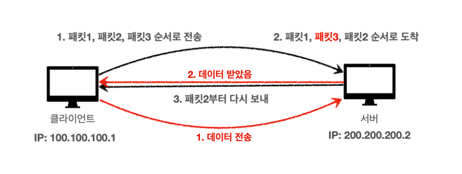

---


## 인터넷(Internet)

클라이언트(Client)과 서버(Server)간의 통신은 대다수의 경우 인터넷(Internet)을 통해서 이루어진다.


<p align='center'>네트워크 하향식 접근 - 인터넷</p>

<br>

위의 그림에서 볼 수 있듯이 인터넷은 전세계 수십억의 컴퓨터를 연결해주는 네트워크이다. 그러면 인터넷에서 컴퓨터(노드, 호스트) 끼리의 통신은 어떻게 이루어질까? 출발 노드에 종착 노드까지 어떤 송수신 제어와 원리에 의해 데이터의 전송이 이루어질 것이다. HTTP에 대해 알아보기 전에 기본적으로 인터넷에서의 통신이 이루어지는 프로토콜에 대해서 알아보자.

<br>

---

## IP(Internet Protocol)

클라이언에 IP 주소를 ```100.100.100.1``` 그리고 서버에는 ```200.200.200.2```를 부여했다고 가정하자.


IP의 역할은 다음과 같다.

* 지정한 IP 주소(IP Address)에 데이터 전달
* 데이터를 전달할 때 패킷(packet)이라는 단위로 전달

<br>

그러면 이 IP 패킷은 어떻게 생긴 것일까?


<p align='center'>IP Packet</p>

* 패킷에는 전송 데이터 외에도 출발지 IP, 목적지 IP, 등의 정보를 포함한다
* IP 주소를 바탕으로 노드끼리 패킷을 전달해서 목적 IP에 도착하도록 한다

<br>


* 데이터인 ```Hello, world!```를 서버가 받으면, 성공적으로 받았다는 응답을 다시 보낸다
* 패킷을 전송할 때 클라이언트 → 서버의 경로와 서버 → 클라이언트의 경로를 다를 수 있다

<br>

그림만으로 확인하면 문제가 없어보이지만, 이 IP 주소만을 가지고 컴퓨터 끼리 통신하는 방식에는 한계가 존재한다. 

다음은 IP 프로토콜이 가지는 한계다.

* 비연결성(Connectionless)
  * **패킷이 받을 대상이 없거나 서비스 불능 상태여도 패킷을 전송한다**


* 비신뢰성(Unreliable)
  * IP 프로토콜은 **최선형 전달(Best-Effort Delivery)을 사용**한다
  * **쉽게 말해서, 패킷이 중간에 사라지거나 패킷이 순서대로 전달되지 않을 수 있다**


* 포트(Port) 구분이 불가능하다
  * 같은 IP를 사용하는 서버에서 통신하는 애플리케이션 프로세스가 둘 이상이면 **포트로 구분해야 하지만, IP 프로토콜에서는 불가능하다**

<br>

이런 IP 프로토콜의 한계를 해결하기 위해서 TCP 프로토콜을 사용한다.

<br>

---

## TCP(Transmission Control Protocol)

### TCP 소개

네트워크 계층을 설명할 때 많은 경우 OSI 7 계층을 설명한다. 그러나 OSI 7 계층의 경우 현실 세계에서 실제로 구현해서 사용한다기 보다는 개념적 모델(conceptual model)에 가깝다. 현실 세계의 인터넷의 경우 TCP/IP 4 계충으로 설명하는 것이 더 알맞은 경우가 많다(여기서 TCP/IP 4 계층도 개념적 모델이다).

<br>


<p align='center'>네트워크 계층의 개념적 모델</p>

* Application Layer(애플리케이션 계층) : HTTP, FTP
* Transport Layer(전송 계층) : TCP, UDP
* Network Layer(인터넷 계층) : IP
* Network Access(Interface) Layer

<br>

다음 그림은 TCP/IP 프로토콜에서 패킷이 전송되는 대략적인 과정이다.


<p align='center'>TCP/IP Protocol</p>

* 데이터가 어떤식으로 패킷이 담기고 전달되는지 알아두자

<br>

그러면 TCP/IP 패킷은 어떻게 생긴 것일까?


<p align='center'>IP Packet + TCP Segment</p>

* TCP/IP 프로토콜에서는 TCP segment를 IP 패킷안에 추가한다
  * ~~데이터와 함께 TCP segment를 encapsulate한다고 표현하는 것 같다~~
* PORT와 관련된 정보. 전송 제어와 순서에 관한 정보, 검증 정보, 등이 들어가서 기존 IP 프로토콜의 한계를 해결한다

<br>

TCP(Transmission Control Protocol, 전송 제어 프로토콜)의 특징은 다음과 같다.

* 연결지향형(connection oriented) - 데이터를 보내기 전에 연결을 위해서 핸드셰이크(handshake)가 필요
  * 3 way handshake(connection establish)
  * 4 way handshake(connection terminate)


* 데이터 전달 보증
* 순서 보장
* TCP 연결은 단일 송신자와 단일 수신자 사이의 점대점(point-to-point) 연결

<br>

---

### Three way handshake

TCP Three-way handshake에 대해서 알아보자.


<p align='center'>TCP Three way Handshake</p>

1. 연결을 위해서 클라이언트에서 서버로 ```SYN```이라는 메세지를 보낸다
2. 서버가 ```SYN```을 받았으면, 요청 수락이라는 ```ACK``` 메세지와 함께 ```SYN```메세지를 다시 클라이언트로 보낸다
3. 마지막으로 클라이언트는 그러면 요청 수락인 ```ACK```를 서버로 보내고 연결이 성공적으로 이루어진다
   * 보통 이 과정에서 데이터도 함께 전송한다

* 여기서 알아야하는 것은 TCP 3 way handshake은 클라이언트와 서버간 논리적으로 연결되는 것이다. 

<br>

---

### 데이터 전달 보증, 순서 보장

<br>



* 클라이언트가 데이터를 전송하면 서버는 데이터를 잘 받았다고 응답 해준다
* 데이터를 보내는 경우 패킷의 순서를 보장해준다
  * 서버에서 패킷의 순서가 잘못되었음을 인지하면 클라이언트는 패킷을 순서에 맞게 다시 보낸다

<br>

이런 것들이 가능한 이유는 TCP/IP 패킷에 전송 제어, 순서, 검증 정보, 등에 대한 정보가 포함되어 있기 때문이다! 이런 요소들이 TCP를 신뢰할 수 있는 프로토콜이라고 부를 수 있도록 해준다.

<br>

---

## UDP(User Datagram Protocol)

UDP에 대해 알아보자.

UDP의 특징은 다음과 같다.

* 기능이 거의 없음
* 연결지향(connection oriented) X
* 데이터 전달 보증 X
* 순서 보장 X
* 단순하고 빠름
* IP에 PORT와 체크섬이 추가된 정도
* 애플리케이션 레벨에서 추가 작업을 해서 사용 가능
* 보통 TCP를 많이 사용하지만, 요즘 다시 HTTP3에서 사용되면서 각광 받는중 

<br>

---

## PORT

포트에 대해서 알아보자.

클라이언트가 여러 서버들과 통신을 하는 상황이라고 가정해보자. 예를 들어, 같은 IP 내에서 게임, 화상통화, 웹 브라우징을 한다고 해보자.


<p align='center'>PORT</p>


* 포트(PORT)를 이용해서 같은 IP내의 프로세스를 구분할 수 있다
* 패킷에 출발지 포트와 목적지 포트가 포함되어 있다
* 포트 넘버
  * 0 ~ 65535 : 할당 가능
  * 0 ~ 1023 (Well known PORT) : 잘 알려진 포트, 사용하지 않는 것이 좋다
    * FTP - 20, 21
    * TELNET - 23
    * HTTP - 80
    * HTTPS - 443


<br>

---

## DNS(Domain Name System)

DNS에 대해 알아보자.

클라이언트와 서버가 통신을 할 때, 서버의 IP는 고정이 아니라 언제든지 바뀔수 있다. 또한 호스트 네임(도메인 명)을 사용하기 위해서 해당 호스트 네임에 매칭된 IP 주소가 필요하다. 여기서 호스트 네임(hostname)은 ```www.naver.com```, ```www.google.com``` 처럼 문자로 구성된 도메인 명을 말한다.

DNS는 쉽게 말해서 호스트 네임을 IP 주소로 변환해주는 디렉토리 서비스이다(이외에도 여러가지 일을 하지만 여기서 다루지 않겠다).


<p align='center'>DNS</p>

* DNS 서버에 도메인과 IP를 등록하면 그냥 호스트네임을 통해서 접속이 가능하다

<br>

---

## URI(Uniform Resource Identifier)

URI, URL, URN에 대해 알아보자. 


<p align='center'>URI</p>

* URI(Uniform Resource Locater) : 통일된 방식으로 리소스를 구분하는데 필요한 정보
  * 리소스(resource) : URI로 식별할 수 있는 모든 것


* URL, URN은 URI에 포함된다
* URL(Locater) : 리소스가 있는 위치를 지정


* URN(Name) : 리소스에 이름을 부여
  * URN 이름만으로 실제 리소스를 찾는 방법은 보편화 되진 않았음

<br>

그러면 URL의 형식을 한번 살펴보자.

> ```scheme://[userinfo@]host[:port][/path][?query][#fragement]```

* 예시 : ```https://www.google.com:443/search?q=hello&hl=ko```

* protocol : ```https```
  * 프로토콜은 어떤 방식으로 자원에 접근할 것인가 하는 약속, 규칙
  * 예) http, https, ftp..


* userinfo
  * URL에 사용자 정보를 포함해서 인증
  * 거의 사용하지 않음


* hostname : ```www.google.com```
  * 도메인명 또는 IP 주소를 직접 사용가능


* port number : ```443```
  * 접속 포트
  * http는 80, https는 443으로 생략 가능


* path : ```/search```
  * 리소스가 위치한 경로, 계층적 구조
  * 예) ```/home/file1.png```, ```members/1004```


* query string : ```q=hello&hl=ko```
  * key=value 형태
  * 웹서버에 제공하는 파라미터
  * ?로 시작하고, &로 추가 가능


* fragment
  * html 내부 북마크 등에 사용한다
  * 예) 깃헙의 마크다운 목차
  * 서버에 전송하는 정보는 아님

<br>

---

## 웹에서의 요청의 흐름

웹 브라우저에서 요청을 보낼 때, 해당 요청의 흐름에 대해서 알아보자.

https://www.google.com/search?q=hello&hl=ko를 웹 브라우저에 입력해서 접속할때 일어나는 요청의 흐름을 살펴보자.

<br>


1. HTTP 요청 메세지 생성
   * ```GET /search?q=hello&hl=ko HTTP/1.1```
   * ```Host: www.google.com```
   * 기타 내용
2. HTTP 요청 메세지를 소켓 라이브러리를 통해 전달하고 생성된 TCP/IP 패킷에 HTTP 메세지를 포함한다
3. 요청 패킷을 목적지(구글 서버)로 전달
4. 요청 패킷을 받고 해석 후, 서버(구글 서버)에서 응답 메세지를 생성하고 응답 패킷에 담는다
   * ```HTTP/1.1 200 OK```
   * ```Content-Type: text/html;charset=UTF-8```
   * ```Content-Length: 3423```
   * 기타 내용
   * 응답 내용 : HTML, 등..
5. 응답 패킷을 클라이언트 한테 전달
6. 클라이언트(웹브라우저)에서 받은 내용(이 경우에는 HTML)을 렌더링

<br>


<p align='center'>HTTP 메세지 전송</p>

---

## Reference

1. [인프런 - 모든 개발자를 위한 HTTP 웹 기본 지식](https://www.inflearn.com/course/http-%EC%9B%B9-%EB%84%A4%ED%8A%B8%EC%9B%8C%ED%81%AC/dashboard)
2. [널널한 개발자 - 네트워크 기초](https://www.youtube.com/watch?v=k1gyh9BlOT8&list=PLXvgR_grOs1BFH-TuqFsfHqbh-gpMbFoy)
3. HTTP 완벽 가이드
4. 네트워크 하향식 접근(Computer Networking a Top-Down Approach)
